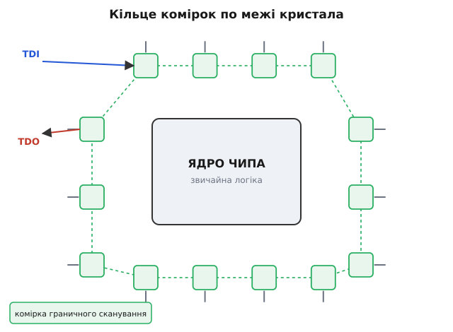
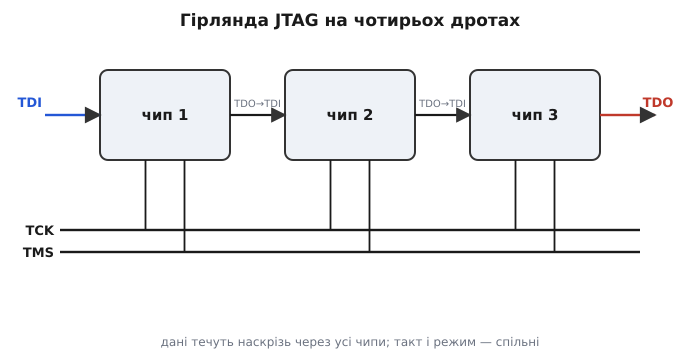

# JTAG і граничне сканування

Уявіть плату, зібрану наприкінці 1980-х за новою модою. Мікросхеми більше не сидять ніжками в дірках — вони припаяні знизу корпусу сіткою кульок припою (BGA, ball grid array), схованих під самим чипом. Двісті контактів, і **до жодного не дотягтися щупом**: вони затиснуті між пластиковим дном мікросхеми й мідною доріжкою під нею. Плата не працює. Питання просте й відчайдушне: котра з двохсот кульок не пропаялася? Класичний тестер притулити ніде — тестувати нема до чого.

До цього десятиліттями діяв «ложе цвяхів» (англ. *bed of nails*) — панель із сотнями підпружинених голок, що знизу тицялися в контактні площинки плати. Поки доріжки й ніжки лежали зверху, це працювало. Але щойно контакти поїхали **під** корпуси, а доріжки — між внутрішні шари багатошарової плати, голкам не стало куди тицятися. Фізичний доступ до вузлів схеми зник — а перевіряти пайку треба.

Вихід знайшли не в кращих голках, а в зміні самої думки: **якщо ззовні до ніжки не дотягтися — нехай сама мікросхема дотягнеться до неї зсередини**. Вкладімо в кожен чип крихітну спостережну апаратуру, яка вміє з середини кристала і **читати** стан кожної своєї ніжки, і **виставляти** на неї потрібний рівень. Тоді фізичний щуп більше не потрібен: чип сам собі і датчик, і генератор сигналу на кожному виводі. Ця ідея — **граничне сканування** (англ. *boundary scan*, «сканування межі»): скануємо саме **межу** мікросхеми, кільце її виводів. А спосіб дотягтися до цієї апаратури ззовні всього чотирма дротами назвали **JTAG** — за іменем групи інженерів (Joint Test Action Group, «спільна робоча група з тестування»), яка звела все докупи. Її напрацювання [1990 року закріпили стандартом IEEE 1149.1](topic:hw-digital/jtag-boundary-scan/hist-jtag-origin.md) — «Standard Test Access Port and Boundary-Scan Architecture».

## Комірка на кожній ніжці

Щоб чип міг сам стежити за своїми виводами, між кожною справжньою ніжкою і внутрішньою логікою кристала вставляють маленьку схему — **комірку граничного сканування** (*boundary-scan cell*). Уявіть її як перемикач із пам'яттю, поставлений просто на «кордоні» між ядром чипа і зовнішнім світом. У звичайному режимі вона прозора: сигнал від ядра йде на ніжку, а сигнал ззовні — до ядра, ніби комірки й немає. Але за командою вона **перехоплює** цей потік.

Комірка вміє дві речі, дзеркальні одна одній. Перша — **захопити** (*capture*): у потрібну мить сфотографувати той логічний рівень, що зараз стоїть на ніжці, і запам'ятати біт. Друга — **нав'язати** (*drive*): виставити на ніжку той рівень, який у неї заздалегідь записали, замість сигналу ядра. Перша перетворює комірку на око, друга — на руку. Око читає, що на ніжці **є**; рука кладе на ніжку те, що ми **хочемо**.

Тепер ключовий хід. Усі ці комірки — по одній на кожен вивід — з'єднують **послідовно, в одне довге кільце** навколо всього кристала, як намистини на нитці. Вихід однієї комірки заходить у вхід сусідньої, і так по колу, від першої ніжки до останньої. Виходить один величезний **зсувний регістр** — той самий ланцюг комірок, крізь який біти крокують по одному за такт. Тільки тут кожна «намистина» сидить не всередині, а просто на виводі чипа. Це кільце назвали **регістром граничного сканування** (*boundary-scan register*).

Раз це зсувний регістр, з ним можна робити рівно те, що з будь-яким зсувним регістром: **вкинути** в нього довгий ланцюжок бітів по одному дроту (і кожна комірка отримає своє значення, щоб потім нав'язати його ніжці) або **висунути** з нього по одному дроту весь знімок стану (кожна комірка віддасть біт, який щойно захопила). Двома простими операціями зсувного ланцюга — «засунути» й «висунути» — ми і командуємо всіма ніжками чипа, і зчитуємо їх усі. Ззовні для цього треба лише один провід «дані всередину», один «дані назовні» і такт.

> 🔧 **Навіщо це.** Ось де ловиться неспаяна кулька BGA. Наказуємо мікросхемі A **нав'язати** логічну 1 на конкретний вивід, а сусідній мікросхемі B — **захопити** її вхід, куди ця доріжка приходить. Засунули 1 у комірку A, висунули знімок з B. Якщо доріжка й обидві пайки цілі — B бачить 1. Якщо B бачить 0 — обрив: або кулька не пропаялася, або доріжка порвана. І все це **без жодного щупа**, самим лише перетасовуванням бітів по кільцю. Так за кілька секунд перевіряють тисячі з'єднань на платі, до яких фізично не дотягтися.


*Ядро мікросхеми (посередині) працює як завжди, а по його краю — кільце комірок, по одній на кожен вивід. Комірки з'єднані послідовно: біти заходять із входу TDI, крокують по колу через усі комірки й виходять у TDO. Кожна комірка вміє або пропускати сигнал наскрізь (робочий режим), або захопити рівень на ніжці, або нав'язати їй свій записаний біт. Кільце — це один довгий зсувний регістр, розкладений по межі кристала.*

## Чотири дроти: порт доступу

Кільце комірок сидить усередині чипа. Щоб керувати ним ззовні, стандарт задає **порт тестового доступу** (*Test Access Port*, TAP) — рівно чотири обов'язкові лінії, і жодним дротом більше, хоч би скільки виводів мала мікросхема. Саме ця ощадливість зробила JTAG всюдисущим.

- **TCK** (*test clock*) — тактовий сигнал. Кожен його фронт крокує зсув на один біт і рухає всю тестову логіку. Без такту нічого не відбувається.
- **TDI** (*test data in*) — вхід даних. Сюди по одному біту заходить усе, що ми засуваємо в кільце.
- **TDO** (*test data out*) — вихід даних. Звідси по одному біту виходить усе, що ми висуваємо.
- **TMS** (*test mode select*) — вибір режиму. Єдиний керівний дріт, яким ми «розповідаємо» чипу, що робити далі: набирати команду, засувати дані чи зупинитися.

TDI і TDO — це два кінці однієї «нитки», на яку нанизане кільце: вкинуте в TDI проходить крізь усі комірки й з'являється в TDO. А TMS — це стрілочник, який перемикає, **куди саме** веде ця нитка цього разу і що на ній станеться на найближчому такті.

П'яту лінію, **TRST** (*test reset*), стандарт лишає **необов'язковою** — це прямий сигнал «скинути всю тестову логіку». Без неї цілком обходяться, бо скинути можна й самим лише TMS (про це — трохи нижче).

Найгарніше в цих чотирьох дротах — те, як мікросхеми **зчіплюються в ланцюг**. Виводимо TDO першого чипа в TDI другого, TDO другого — у TDI третього, а TCK і TMS **розводимо спільними** на всіх. Тепер кільця всіх мікросхем зшилися в одне довжелезне спільне кільце, що проходить крізь усю плату — від TDI найпершого чипа до TDO найостаннішого. Тими самими чотирма дротами програматор бачить і керує **кожною ніжкою кожної мікросхеми** на платі. Це називають **гірляндою** (*daisy chain*, «ланцюжок стокроток»).


*Три мікросхеми, зшиті в гірлянду. TDI першої — вхід усього ланцюга, TDO останньої — його вихід; між ними дані течуть наскрізь через усі три. Такт TCK і керівний TMS підведені до всіх мікросхем одночасно, тож вони крокують у ногу. Уся плата керується чотирма дротами незалежно від того, скільки на ній чипів і виводів.*

## Один автомат станів на всіх

Постає задача синхронізації. Дріт TMS один, а розповісти чипу треба різне: «зараз я набираю команду», «зараз засуваю дані», «а зараз — стоп, обробляй». Як одним двійковим сигналом передати стільки намірів? Відповідь елегантна: у кожній мікросхемі стандарт вимагає однаковий **скінченний автомат** — маленьку [схему станів](topic:hw-digital/finite-state-machines) на строго **16 станів**, названу **контролером TAP**. Він і є мозком тестового порту.

Працює автомат так: на кожному фронті TCK він дивиться на рівень TMS і за ним переходить у наступний стан. Один біт TMS — один крок автомата. Ланцюжок нулів і одиниць на TMS **прокладає маршрут** цим автоматом: подаси одну послідовність — потрапиш у стан «засуваю команду», іншу — у стан «засуваю дані». Оскільки автомат в усіх чипів гірлянди однаковий, а TMS спільний, **усі вони йдуть тим самим маршрутом синхронно** — і разом опиняються то в режимі команди, то в режимі даних.

У цій мапі з 16 станів є дві головні «кімнати роботи». Одна — **Shift-DR** (*shift data register*): поки автомат тут, кожен фронт TCK засуває один біт з TDI у поточний вибраний регістр і висуває один у TDO. Тут ми ганяємо дані крізь кільце. Друга — **Shift-IR** (*shift instruction register*): так само зсуває, але не дані, а **команду** в окремий регістр інструкцій. Спершу заводимо автомат у Shift-IR і задаємо команду (що робити з кільцем), потім у Shift-DR і ганяємо дані.

Один стан варто назвати окремо — **Test-Logic-Reset**, вихідний. У ньому вся тестова логіка «спить», а чип поводиться так, ніби JTAG узагалі немає, — працює своє звичайне діло. Сюди ж закладено просту гарантію відновлення: **п'ять фронтів TCK поспіль із TMS = 1** приводять автомат у Test-Logic-Reset **з будь-якого** стану. Тому окремий дріт TRST і необов'язковий: хай як програматор заплутається, п'ять одиниць на TMS завжди повернуть усіх у відоме вихідне положення. Це і є та «страховка», без якої довгий ланцюг не був би надійним.

## Команда вирішує, що робити з кільцем

Саме кільце пасивне — воно лише зсуває біти. **Що** саме воно робить із ніжками, задає команда в регістрі інструкцій. Стандарт вимагає, щоб кожна сумісна мікросхема розуміла три обов'язкові команди — на них тримається весь тест плати.

- **EXTEST** (*external test*) — «тестуй зовнішнє». Комірки перестають пропускати сигнал ядра й **нав'язують** ніжкам ті біти, що ми в них засунули, а на входах — захоплюють. Це робочий режим перевірки пайки й доріжок **між** чипами: одна мікросхема виставляє рівні, сусідні читають.
- **SAMPLE/PRELOAD** — «підглянь / зарядь наперед». Дві дії в одній команді. *Sample* робить миттєвий знімок реальних сигналів на ніжках, **не втручаючись** у роботу чипа, — знято живу картину. *Preload* тим часом заряджає комірки бітами наперед, щоб у мить переходу в EXTEST на ніжках одразу з'явилися готові значення, без сміттєвого проміжного стану.
- **BYPASS** — «пропусти повз». Ставить між TDI і TDO **один-єдиний тригер** замість усього довгого кільця чипа. Навіщо? У гірлянді нам часто цікава лише одна мікросхема, а решта — на шляху даних. Наказавши їм BYPASS, ми **скорочуємо ланцюг**: замість сотень непотрібних комірок кожна така мікросхема додає лише один такт затримки. Дані до потрібного чипа доходять на порядок швидше.

Дуже поширена, хоч і не обов'язкова, четверта команда — **IDCODE**: за нею мікросхема віддає в TDO свій **32-бітний код-паспорт** (виробник, номер частини, версія). Це спосіб ззовні «перекликати» гірлянду: висунув коди — і бачиш, які саме чипи і в якому порядку стоять на платі, чи всі на місці.

> 🔧 **Навіщо це.** IDCODE — перше, що робить будь-який JTAG-програматор, під'єднавшись до незнайомої плати. Він гонить гірлянду в режим видачі кодів і читає паспорти по черзі. Якщо очікувалося три чипи, а відгукнулося два — на платі бракує мікросхеми або обірваний сам ланцюг TCK/TMS. Якщо код не той, що в проєкті, — поставили не ту деталь. Ця перекличка займає мілісекунди й одразу відсіює грубі помилки монтажу ще до будь-якого тесту з'єднань.

## Один крок ланцюга в коді

Абстракцію легко відчути, якщо самому «поганяти» TAP по тактах. Ось наскрізна дрібниця: як **один біт** проходить через порт. На кожному такті ми виставляємо TMS і TDI, робимо фронт TCK і **на тому ж фронті** зчитуємо TDO. Мікросхема виставляє свій вихідний біт на спадному фронті TCK, а ми, ведучі, ловимо його на **висхідному** — так вони не заважають одне одному.

**Умова: висунути в TDO один біт із кільця й одночасно засунути в TDI новий біт, тримаючи автомат у стані Shift-DR (TMS = 0).**

```c
// Порт TAP «ногами» мікроконтролера (bit-banging).
// Такт низький у спокої; крокуємо один такт зсуву.
static uint8_t tap_clock(uint8_t tms, uint8_t tdi) {
    gpio_write(PIN_TMS, tms);      // 1) готуємо керування й дані
    gpio_write(PIN_TDI, tdi);      //    ДО фронту такту
    gpio_write(PIN_TCK, 1);        // 2) висхідний фронт TCK:
    uint8_t tdo = gpio_read(PIN_TDO); //   ведений засуває біт — ловимо TDO
    gpio_write(PIN_TCK, 0);        // 3) спадний фронт — крок завершено
    return tdo;                    //    повертаємо висунутий біт
}
```

Порядок рядків тут — не випадковий, а сама суть протоколу. TMS і TDI мусять стояти **до** підняття TCK, бо чип фотографує їх саме в мить висхідного фронту (рядок 2). Читаємо TDO теж на цьому фронті — біт, який ведений виставив ще на попередньому спадному. Переставте рядки — і зчитаєте не той біт або задасте команду в неправильний стан. Уся строгість «один фронт — один крок» тримається на цьому порядку.

Тепер довший приклад: цією ж цеглинкою висунути **32-бітний IDCODE**. Припустімо, автомат уже заведений у Shift-DR і вибрано регістр ідентифікації.

**Умова: перебуваючи у Shift-DR, зчитати 32 біти IDCODE, тримаючи TMS = 0 усі такти, крім останнього (останнім TMS = 1 — вихід зі зсуву).**

```c
uint32_t read_idcode(void) {
    uint32_t id = 0;
    for (int i = 0; i < 32; i++) {
        // TMS=0 усі 31 крок, TMS=1 на останньому — виходимо зі Shift-DR.
        uint8_t last = (i == 31);
        uint8_t bit  = tap_clock(last, 0);   // засуваємо 0, ловимо біт коду
        id |= (uint32_t)bit << i;            // IDCODE іде молодшим бітом уперед
    }
    return id;                                // напр. 0x4BA00477 — ядро ARM
}
```

Тридцять два оберти циклу — тридцять два фронти TCK — і ми маємо повний паспорт чипа, висунутий по одному проводу TDO. Зверніть увагу на дрібницю з `last`: підняти TMS треба саме на **останньому** такті, бо цей крок і виводить автомат зі стану зсуву. Піднімеш зарано — обірвеш зчитування посеред коду; забудеш підняти — застрягнеш у Shift-DR. Так само, по тактах, працює і засування команди EXTEST, і продавлювання довгого вектора крізь усю гірлянду: та сама `tap_clock` — лише різні маршрути TMS.

## Не тільки тест: як JTAG став ще й дверима в чип

Задумували все це заради перевірки пайки. Але інженери швидко побачили: якщо ми вже маємо всередині кожного чипа стандартний порт із чотирьох дротів, регістр команд і зсувний доступ до нутрощів — **через ці ж двері можна робити куди більше, ніж тестувати ніжки**. Виробники додали свої, нестандартні команди — і той самий TAP відкрив дорогу до внутрішньої логіки кристала.

Так JTAG став універсальним чорним ходом у мікросхему. Через нього **прошивають** пам'ять і ПЛІС — заливають конфігурацію в чип уже на готовій платі, не виймаючи його. Через нього ж **налагоджують** програму: зупиняють процесор, читають і пишуть його регістри й пам'ять, ставлять точки зупину, крокують по одній інструкції. Кожен налагоджувач мікроконтролера, кожен програматор ПЛІС говорить із чипом саме цими чотирма дротами. Скромний порт для пошуку неспаяної кульки виявився головним службовим входом сучасної електроніки — і живе вже понад тридцять років саме тому, що робить складне доступним крізь чотири прості дроти.
