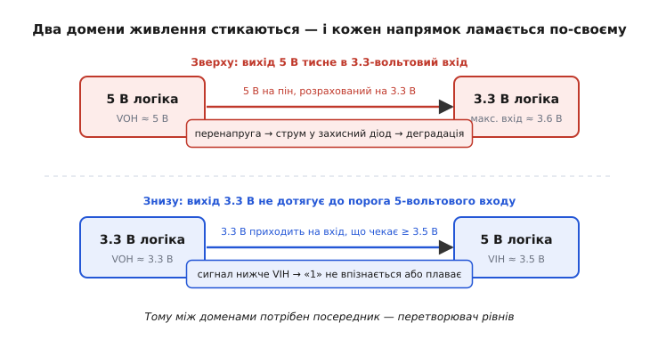
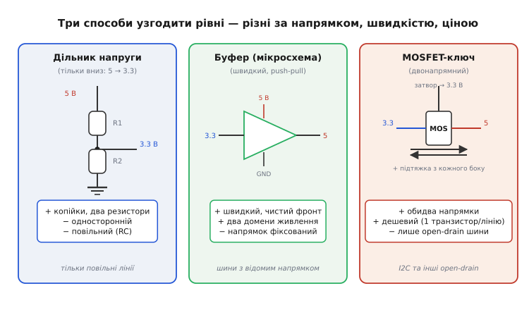
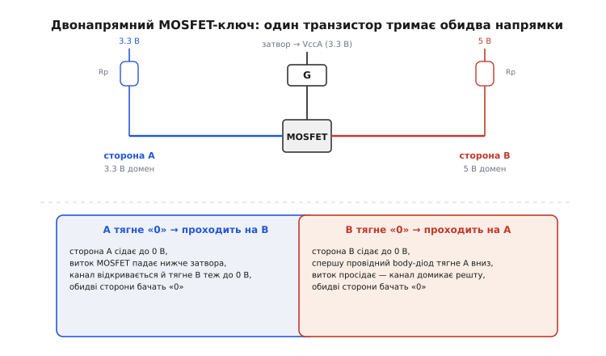
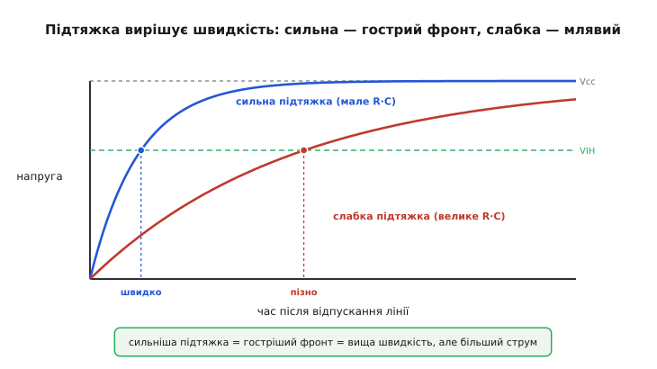

# Перетворювач рівнів

Сучасна плата майже ніколи не живиться однією напругою. Мікроконтролер працює на 3.3 В, бо так менше гріється й споживає; стара мікросхема пам'яті чи дисплей лишилися на 5 В, бо їх спроєктували в ту епоху; якийсь давач узагалі хоче 1.8 В. Кожна з цих частин видає й чекає логічні рівні **відносно свого живлення** — і коли їх з'єднати дротом навпростець, вони одне одного **не зрозуміють**, а часом і **пошкодять**. Перетворювач рівнів (*level shifter*, або *level translator* — від латинського *trans-* «через» + *latus* «перенесений») — це **клас пристроїв-посередників**, які узгоджують логічні рівні двох доменів живлення, щоб «1» в одному читалася як «1» в іншому, а пін не отримав напруги вище, ніж витримує.

Це не один компонент і не один номер у каталозі, а **родина рішень** з різною ціною, швидкістю й напрямком. Щоб обрати правильне, треба спершу зрозуміти, **через що саме** ламається прямий стик доменів — а ламається він двома різними способами.

## Чому прямий дріт між доменами не працює

Корінь проблеми в тому, що логічна «1» — це **не число, а діапазон напруг**, прив'язаний до живлення тієї мікросхеми. Домен на 5 В видає одиницю біля 5 В і чекає на вході щось вище приблизно 3.5 В; домен на 3.3 В видає одиницю біля 3.3 В і чекає вище приблизно 2 В. Самі пороги (VOL, VOH, VIL, VIH) у кожного домену свої, бо їх рахують від власної шини живлення.

> 📐 Логічні «0» і «1» — це не точні числа, а смуги напруг, обмежені чотирма порогами: вихідними VOL/VOH (що драйвер гарантує) і вхідними VIL/VIH (що приймач вимагає), а між VIL і VIH лежить заборонена зона. Точне значення в межах смуги не несе інформації — важить лише, по який бік порога сигнал. Це й треба тримати в голові, читаючи цю статтю: [рівні як діапазони](root:hw-digital/logic-levels-as-ranges).

З'єднавши два домени навпростець, ми стикаємо їхні **несумісні** смуги — і виходить два протилежні лиха, залежно від напрямку сигналу.


*Зверху: 5-вольтовий вихід тисне свою «1» (≈ 5 В) у вхід, розрахований щонайбільше на ≈ 3.6 В, — це перенапруга, що жене струм у захисний діод входу й поволі його вбиває. Знизу: 3.3-вольтовий вихід видає «1» лише на ≈ 3.3 В, а 5-вольтовий вхід вимагає ≥ 3.5 В — сигнал не дотягує до VIH і «1» або не впізнається, або плаває. Один напрямок калічить залізо, інший просто не передає сигнал; перетворювач рівнів лагодить обидва.*

**Згори вниз (5 В → 3.3 В): перенапруга.** Тут біда фізична. Вхід 3.3-вольтової мікросхеми має всередині захисні діоди до своєї шини живлення (*ESD-захист*). Коли драйвер тисне на цей пін 5 В, напруга піна вилазить вище живлення 3.3 В, верхній захисний діод **прочиняється** й починає зливати струм у шину 3.3 В. Цей струм гріє діод і поволі його руйнує — мікросхема може не померти одразу, але деградує й виходить з ладу раніше за термін. Тобто навіть якщо «начебто все читається», ви потроху **вбиваєте** вхід.

**Знизу вгору (3.3 В → 5 В): недотяг.** Тут біда логічна. 3.3-вольтовий драйвер чесно тисне свою одиницю майже до власної шини — до ≈ 3.3 В. Але 5-вольтовому входу цього **мало**: його поріг VIH лежить десь на 3.5 В (для давнішої логіки — узагалі біля 3.5…3.85 В). Сигнал приходить **нижче порога**, застрягає в забороненій зоні — і приймач читає його то як «0», то як «1», то як шум. Залізо ціле, але зв'язку немає.

Зверніть увагу на **асиметрію**: проблеми двох напрямків зовсім різні за природою, тож і ліки різні. Іноді небезпечний лише один напрямок (наприклад, лінія тільки від 5 В до 3.3 В) — і тоді вистачає найдешевшого одностороннього рішення. А іноді лінія двостороння (одна шина, де обидва кінці й говорять, і слухають) — і тоді потрібен пристрій, що пропускає сигнал **в обидва боки**. Саме цей поділ — однонапрямний чи двонапрямний — і визначає вибір.

> 🔧 **Навіщо це.** Перше питання при стику двох мікросхем на різних напругах: **куди тече сигнал?** Намалюйте стрілку. Якщо в один бік (скажімо, MCU командує дисплеєм) — шукайте однонапрямний перетворювач: він простіший, швидший і дешевший. Якщо лінія двостороння (як [I2C](root:com-devices/async-serial), де ведений відповідає тим самим дротом) — потрібен двонапрямний, і вибір різко звужується. Помилитися тут — означає або купити надлишкове, або поставити те, що фізично не може працювати на цій шині.

## Три механізми, з яких збирають усі перетворювачі

Попри розмаїття мікросхем, **способів** узгодити рівні насправді лише три, і кожен — прямий наслідок якоїсь однієї фізичної ідеї. Розберімо їх від найпростішого.


*Дільник напруги (ліворуч) — два резистори, що масштабують 5 В униз до 3.3 В: копійки, але односторонній і повільний. Буфер-мікросхема (посередині) — активний перемикач із двома доменами живлення: швидкий і чистий, але напрямок зашитий апаратно. MOSFET-ключ (праворуч) — один транзистор із підтяжками з обох боків: пропускає сигнал в обидва боки, але лише на open-drain шинах. Під кожним — його природна ніша.*

### 1. Резистивний дільник — для повільного й одностороннього «вниз»

Найдешевший спосіб опустити рівень — узяти [дільник напруги](root:hw-analog/voltage-divider): два резистори послідовно, а сигнал знімати з їхньої середини. Якщо вхід 5 В, а треба 3.3 В, добирають таке відношення R1 до R2, щоб у точці відводу вийшло ≈ 3.3 В:

```
Vout = Vin · R2 / (R1 + R2)
3.3  = 5.0 · R2 / (R1 + R2)     →     R2 / (R1 + R2) ≈ 0.66
напр.:  R1 = 1.0 кОм,  R2 = 2.0 кОм  →  Vout = 5 · 2/3 ≈ 3.33 В
```

Просто, дешево, надійно. Але в дільника два вроджені обмеження, обидва принципові.

По-перше, він працює **тільки в один бік — униз**. Дільник лише послаблює напругу; підняти 3.3 В до 5 В він фізично не може (пасивні резистори енергії не додають). Тож «вгору» дільник не годиться взагалі.

По-друге, він **повільний**, і ось чому. Будь-яка реальна лінія має паразитну ємність (пін, доріжка, вхід приймача). Разом з опором дільника ця ємність утворює RC-ланку, і фронт сигналу розмивається зі сталою часу `τ = R · C`. Щоб дільник віддавав чистий 3.3-вольтовий рівень, опори мусять бути досить великими (інакше через них тектиме зайвий струм); але великий R при тій самій C дає велику τ — і фронт стає **млявим**. Тому дільник придатний лише там, де сигнал **повільний**: скидання, ввімкнення живлення, рідкісні команди. Для швидкої шини на мегагерци він не годиться — фронти не встигнуть.

### 2. Буфер-мікросхема — швидкий, але з зашитим напрямком

Коли потрібні **чисті швидкі фронти**, пасивними резисторами вже не обійтися — потрібен **активний** елемент, який сам формує вихідний рівень. Це буфер (*buffer*) чи спеціальна мікросхема-перетворювач: усередині два домени живлення (скажімо, VccA = 3.3 В і VccB = 5 В), вона читає сигнал зі сторони A за порогами A, а на стороні B **наново видає** його повноцінною [двотактною (push-pull)](root:hw-digital/push-pull-output) одиницею вже на рівні 5 В.

Перевага очевидна: вихід **активно** тягне лінію і вгору, і вниз, тож фронти круті, а швидкість — десятки й сотні мегагерц. До того ж напрямок «вгору» їй дається так само легко, як «вниз»: вона не послаблює, а **перевидає** сигнал на потрібному рівні.

Розплата — у тому, що напрямок **зашитий апаратно**. Буфер читає вхід тільки з одного боку й видає вихід тільки з іншого; повернути сигнал назад тим самим виводом він не може. Для односторонніх шин це не біда (дані часто й течуть в один бік — [SPI](root:com-devices/async-serial), команди на дисплей), але для двосторонньої лінії простий буфер не підходить: потрібен або керований сигнал напрямку, або зовсім інший механізм.

### 3. MOSFET-ключ — дешевий і двонапрямний

Залишається найхитріше: пропустити сигнал **в обидва боки** одним пасивним елементом. Це вміє класична схема на одному n-канальному [MOSFET](root:hw-components/logic-level-mosfet) із підтяжками з кожного боку — стандартне рішення для [open-drain](root:hw-digital/open-drain-output) шин на кшталт I2C. Один транзистор на лінію, копійки, а працює симетрично. Як саме — варто розібрати окремо, бо це найкрасивіша ідея в темі.

## Чому MOSFET-ключ пускає сигнал в обидва боки

Двонапрямність тут не випадкова — вона **вбудована** в те, як з'єднаний транзистор. Схема така: затвор (*gate*) сидить на **нижчому** живленні (VccA, 3.3 В); один бік каналу (нехай сторона A) дивиться в 3.3-вольтовий домен, другий (сторона B) — у 5-вольтовий; на кожному боці своя підтяжка до своєї шини.


*Затвор закріплено на нижчій шині (3.3 В). У спокої обидві сторони підтягнуті вгору, кожна до свого живлення, транзистор закритий — рівні незалежні. Ліворуч унизу: коли сторона A тягне «0», виток MOSFET падає нижче затвора, канал відмикається й переносить «0» на сторону B. Праворуч унизу: коли «0» тягне сторона B, спершу спрацьовує body-діод транзистора, тоді домикається канал — і «0» з'являється на A. Сигнал проходить у будь-якому напрямку, бо обидва сценарії самі вмикають той самий ключ.*

**Спокій: обидві «1».** Коли ніхто не тягне лінію, обидві підтяжки піднімають свої сторони вгору — A до 3.3 В, B до 5 В. На транзисторі напруга затвор-виток ≈ 0 (і затвор, і виток біля 3.3 В), він **закритий**, сторони розв'язані. Кожен домен спокійно тримає свою «1» на своєму рівні — і це вже половина зсуву: «1» на 3.3 В і «1» на 5 В співіснують без конфлікту.

**Сторона A тягне «0».** Драйвер на 3.3-вольтовому боці сідає до 0 В. Тепер виток транзистора (сторона A) — на нулі, а затвор лишився на 3.3 В, тож напруга затвор-виток ≈ 3.3 В **перевищує поріг** Vth — канал **відмикається**. Через відкритий канал сторона B розряджається в сторону A, і B теж сідає до ≈ 0 В. Підсумок: «0» з боку A **перейшов** на бік B.

**Сторона B тягне «0».** Тут хитріше, і саме тут схема показує свою елегантність. Драйвер на 5-вольтовому боці сідає до 0 В. У MOSFET між стоком і витоком завжди є **паразитний body-діод**; коли сторона B падає, цей діод опиняється під прямою напругою (A ще вгорі, B унизу) і **проводить**, підтягуючи сторону A вниз. Щойно A почала падати, виток транзистора просідає, напруга затвор-виток знову перевищує поріг — і канал **домикає** перенесення, дотягуючи A до повного нуля. Підсумок: «0» з боку B **перейшов** на бік A.

Уся краса в тому, що **обидва** сценарії «нуля» самі вмикають той самий ключ — байдуже, з якого боку прийшов сигнал. Тому схема **симетрична** й двонапрямна без жодного керування напрямком. Але є ціна цієї симетрії: вона спирається на те, що лінію тягнуть **тільки вниз**, а вгору її повертає підтяжка. Тобто це механізм **виключно для open-drain шин** (I2C, 1-Wire, лінії скидання з відкритим стоком). Для звичайної двотактної лінії, де драйвер активно тисне і вгору, і вниз, ця схема не підходить — там потрібен буфер.

> 🔧 **Навіщо це.** Ця триадка на одному транзисторі — те, що ви ставите між 3.3-вольтовим MCU і 5-вольтовим I2C-модулем (дисплеєм, годинником, давачем). Запам'ятайте умову: затвор — на **нижчу** шину, підтяжки — з **обох** боків, по одному транзистору на **кожну** лінію (SDA і SCL — окремо). І перевірте найчастішу пастку: схема працює **лише** з open-drain; спробуєте зсунути нею push-pull лінію (наприклад, SPI) — отримаєте конфлікт драйверів і зіпсований сигнал.

## Швидкість і підтяжки: чим за них платять

У двох із трьох механізмів — у дільнику й у MOSFET-ключі — швидкість упирається в **підтяжку**, і це не дрібниця, а головний компроміс експлуатації. Причина та сама RC-ланка, що й у дільника. На open-drain лінії драйвер уміє лише **тягнути вниз** (швидко, активним транзистором), а **вгору** лінію повертає тільки підтяжка — пасивний резистор, що заряджає паразитну ємність лінії. Саме цей заряд через резистор і визначає, наскільки **гострий** буде фронт «0 → 1».


*Після того як драйвер відпустив лінію, підтяжка заряджає її ємність по експоненті 1 − e⁻ᵗ/τ, де τ = R · C. Сильна підтяжка (мале R, синя крива) дає малу сталу часу — лінія швидко перетинає поріг VIH, фронт гострий, можна на високій частоті. Слабка підтяжка (велике R, червона) дає велику τ — лінія повзе вгору й перетинає VIH пізно, на високій частоті «1» просто не встигне сформуватися. Платня за швидкість — більший струм через сильну підтяжку.*

Звідси прямий компроміс. Хочете **швидше** — ставте **сильнішу** (меншу за опором) підтяжку: τ = R · C меншає, фронт крутішає, лінія встигає на вищій частоті. Але сильна підтяжка означає більший струм, коли драйвер тримає «0» (через відкритий транзистор тече Vcc/R), — а отже, **більше споживання** й більше навантаження на драйвер. Хочете **економніше** — слабша підтяжка, але тоді фронти мляві й стеля частоти падає. Класична інженерна вилка: швидкість проти струму.

**Приклад (стеля частоти від підтяжки).** На I2C-лінії з підтяжкою Rp = 4.7 кОм і паразитною ємністю шини C = 200 пФ оцінимо сталу часу й найшвидший розумний фронт.

```c
// Оцінка фронту 0→1 на open-drain шині (підтяжка заряджає ємність)
const float Rp = 4700.0f;     // підтяжка, Ом
const float C  = 200e-12f;    // ємність шини, Ф
float tau = Rp * C;           // = 4700 · 200e-12 = 0.94 мкс

// Грубо: «чистий» фронт ≈ 3·τ; період має бути помітно більший
float t_rise = 3.0f * tau;            // ≈ 2.8 мкс
float f_max  = 1.0f / (10.0f * tau);  // запас ~10τ на період → ≈ 106 кГц
```

Виходить, що з такою підтяжкою лінія ледь тягне стандартні 100 кГц, а на 400 кГц фронт уже не встигне — треба або зменшити Rp (швидше, але більший струм), або вкоротити лінію (менше C). Це і є та сама вилка в числах: τ ставите ви, обравши Rp і змирившись із C.

Для **буфера** все легше: він тягне лінію активно в обидва боки, тож підтяжки для швидкості йому не треба, і стеля частоти в нього набагато вища — десятки й сотні мегагерц. Це, власне, головна причина брати буфер замість MOSFET-ключа там, де лінія швидка й двотактна.

## Де це живе: шини між контролером і периферією

Майже завжди перетворювач рівнів стоїть на **шині між мікроконтролером і периферією**, що опинилися в різних доменах. Звести вибір можна до короткого правила, яке прямо випливає з усього вищого:

```
напрямок?          швидкість?        →  що ставити
один бік, вниз      повільно          →  резистивний дільник (копійки)
один бік            швидко            →  буфер-мікросхема (push-pull)
обидва боки         open-drain        →  MOSFET-ключ + підтяжки
обидва боки         швидко, push-pull →  спеціальний двонапрямний перетворювач
```

Типові місця, де він з'являється: **I2C** від 3.3-вольтового MCU до 5-вольтового модуля (MOSFET-ключ на SDA і SCL); **SPI чи паралельна шина** на дисплей старого покоління (буфер, бо швидко й односторонньо); лінія **скидання** чи поодинокий сигнал переривання між доменами (дільник, бо повільно й односторонньо); вхід **UART** від 5-вольтового пристрою на 3.3-вольтовий приймач (дільник або буфер). Помітно, що вибір щоразу диктують ті самі три питання — **напрямок, швидкість, тип виходу** — і відповідь на них одразу відсікає непридатні механізми.

Окремо варто тримати в голові межу застосовності. Перетворювач рівнів **узгоджує логіку**, а не живлення: він не дає струму навантаженню й не «живить» мікросхему іншого домену — для цього є власні шини живлення з кожного боку. Його робота вузька й чесна: зробити так, щоб «1» одного домену впізналася як «1» іншого, а жоден вхід не отримав напруги, більшої за дозволену. Усе інше — підтяжки, фронти, напрямок — лише деталі того, **як** саме він цю роботу виконує.

---

Підсумок: перетворювач рівнів — це **клас посередників**, що узгоджують логічні рівні двох доменів живлення, бо «1» — це діапазон, прив'язаний до власної шини, і прямий стик доменів ламається двома способами: згори вниз — **перенапругою** (струм у захисний діод входу), знизу вгору — **недотягом** до порога VIH. Механізмів узгодження три: **резистивний дільник** (дешевий, але односторонній «вниз» і повільний через RC), **буфер-мікросхема** (швидкий, push-pull, але напрямок зашитий) і **MOSFET-ключ** (двонапрямний і дешевий, але лише для open-drain шин). Двонапрямність MOSFET-ключа виростає з того, що **обидва** напрямки «нуля» самі вмикають той самий транзистор. Швидкість на open-drain лінії впирається в **підтяжку**: сильніша дає гостріший фронт ціною струму (τ = R · C). А головне питання вибору — завжди **напрямок, швидкість і тип виходу** шини між контролером і периферією.

---
