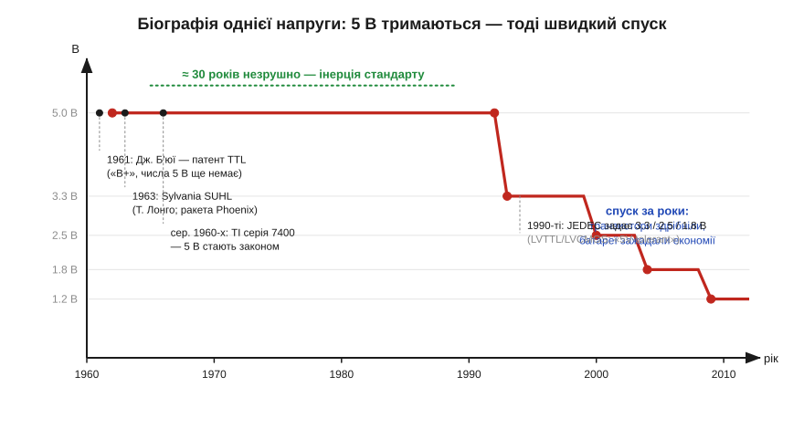
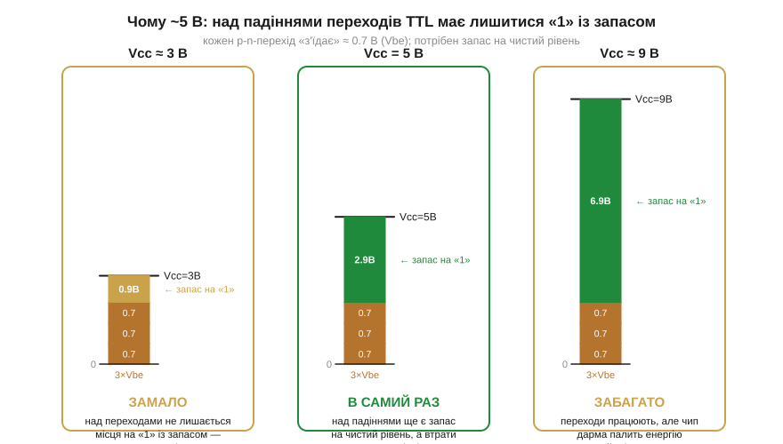
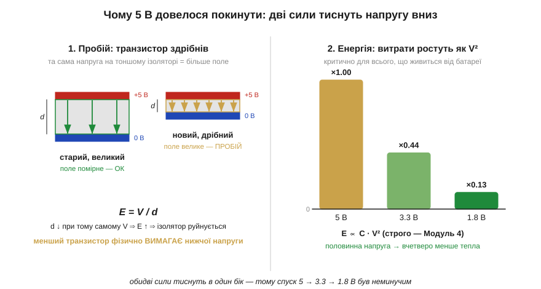

# 📜 Чому саме 5 вольтів: спадщина TTL і довгий шлях униз до 3.3 і 1.8 В

Пороги «0» і «1» у цифровій техніці задає [логічне сімейство](topic:hw-digital/logic-families), і класика цифрової логіки жила на **5 В**, а далі логіка вперто «спускалася» драбиною: 3.3 → 1.8 В і нижче. Але звідки взялося саме **5 В**? Не 4, не 6, не зручні «круглі» 10? І чому, спускаючись, інженери зупинилися на дивному **3.3**, а не на рівних 3.0? За цими числами немає божественного одкровення — є ланцюг цілком земних інженерних компромісів, кожен зі своєю датою, своїм автором і своєю ціною. П'ять вольтів — це не константа природи, а **закам'янілий слід** однієї конкретної схемотехніки початку 1960-х, яка пережила саму себе на півстоліття. Пройдімо цей слід від його джерела.

Уявіть, що ви — інженер 1962 року. Транзистор щойно перестав бути екзотикою, перші інтегральні схеми вже існують, але **жодного стандарту живлення** ще немає: одна схема хоче 6 В, інша 12, третя взагалі мінус 3. Питання «скільки вольтів має бути одиниця» ще відкрите — його ніхто не закрив. І те, як його закриють кілька конкретних людей у кількох конкретних фірмах, визначить напругу на ніжках мікросхем, які ви тримаєте в руках сьогодні.

*Хронологія однієї напруги. **5 В** прийшли з TTL початку 1960-х і панували незрушно майже тридцять років — бо вся індустрія, від чипів до блоків живлення, на них стандартизувалася. Спуск почався лише в 1990-х, коли транзистори здрібніли настільки, що 5 В стали їх **пробивати**, а апетит до енергії в портативній техніці став нестерпним. Тоді JEDEC за кілька років проклав сходинки 3.3 → 2.5 → 1.8 В, і темп різко пришвидшився. Зверніть увагу на асиметрію: **трималося** одне число десятиліттями, а **посипалося** за роки — так і виглядає інерція стандарту, який раптом перестав бути вигідним.*

---

## Світ без стандарту: чому питання взагалі постало

Спершу варто відчути, чому єдина напруга — це взагалі **цінність**, а не дрібниця. У ламповому світі, з якого електроніка щойно вийшла, про спільне живлення ніхто й не мріяв: лампи хотіли десятки й сотні вольтів на аноди, кожна схема мала власний химерний набір напруг, а позначення «B+» (плюс анодної батареї) було радше прізвиськом, ніж стандартом. Транзистор цей світ перевернув — він працює на одиницях вольтів, — але **узгодженості** не приніс автоматично. Якби кожне сімейство чипів вимагало свого живлення, скласти з них систему було б мукою: на одній платі довелося б розводити п'ять різних напруг, і кожен стик двох чипів ставав би окремою задачею.

Тому величезна, хоч і непомітна, цінність будь-якого спільного числа в тому, що воно **звільняє** розробника від цього клопоту. Щойно вся індустрія домовляється про одну напругу живлення, з'являються дешеві стабілізатори саме на неї, чипи різних виробників починають стикуватися «з коробки», а блоки живлення штампують мільйонами. Питання було не «яке число найкрасивіше», а «навколо якого числа збереться найбільше заліза». І відповідь на нього дала не комісія мудреців, а конкретна схемотехніка, що випадково виявилася найвдалішою у свій момент.

---

## Звідки 5 вольтів: біполярний транзистор диктує умови

Народження п'яти вольтів неможливо зрозуміти, не зазирнувши всередину **TTL** — транзисторно-транзисторної логіки (*transistor-transistor logic*), одного з класичних [логічних сімейств](topic:hw-digital/logic-families). Її винайшов 1961 року **Джеймс Б'юї** (*James L. Buie*) в компанії Pacific Semiconductor (згодом її поглинула TRW); патент (US 3,283,170) він подав у вересні того ж року, а отримав аж 1966-го. Сам Б'юї спершу називав це «транзисторно-зв'язаною транзисторною логікою» (TCTL), протиставляючи її ранішим діодним схемам. Цікава деталь, що багато говорить про природу п'яти вольтів: **у тому патенті 1961 року числа «5 В» немає взагалі**. Б'юї пише просто «B+» — те саме лампове прізвисько, успадковане з минулої епохи. П'ять вольтів іще не існували як стандарт; вони мали народитися з фізики схеми, а не з декрету.

А фізика диктувала ось що. TTL збудована на [біполярних транзисторах](topic:hw-components/bjt-operation) (BJT), і всередині неї сигнал, ідучи від входу до виходу, долає кілька **p-n-переходів**, кожен зі своїм падінням близько **0.7 В** (це той самий [Vbe](topic:hw-components/bjt-gain)). Мало того — у TTL ці переходи навмисно використані замість резисторів для зміщення, і вся схема правильно працює лише у **вузькому віконці** напруги живлення. Складіть докупи: щоб над усіма послідовними падіннями лишився ще й пристойний [запас завадостійкості](topic:hw-digital/noise-margin), живлення мусить бути помітно вищим за кілька Vbe, але не настільки високим, щоб дарма палити енергію й гріти кристал. П'ять вольтів сіли в цю «золоту середину» майже самі: достатньо, щоб над трьома-чотирма переходами лишилося місце на чисту одиницю, і не забагато, щоб чип не перегрівався.

*Бюджет напруги всередині TTL. Сигнал від живлення до виходу проходить крізь кілька p-n-переходів, кожен «з'їдає» ≈ 0.7 В (Vbe біполярного транзистора). Якби живлення було надто низьким (ліворуч, ~3 В), над цими падіннями не лишилося б місця на впевнену «1» із запасом — схема стала б тендітною. Якби надто високим (праворуч, ~9 В), переходи працювали б, але чип дарма палив би енергію й грівся. **П'ять вольтів** (посередині) — це компроміс: над усіма падіннями ще є місце на чистий рівень із запасом, а втрати ще помірні. Звідси й знайомі несиметричні пороги TTL (VIL 0.8 / VIH 2.0 В) — вони не випадкові, а є прямим відбитком цих внутрішніх падінь.*

Варто чесно сказати: **5 В не були єдиним математично можливим вибором**. Це не точка, виведена з рівняння, а зручний інтервал, у який добре сіла саме біполярна схемотехніка тих років. За інакшої внутрішньої будови індустрія могла б осісти й на 4, і на 6 В. Але історія пішла так, що найвдалішим у потрібний момент виявилося саме TTL на ~5 В, — і далі спрацювала вже не фізика, а інерція. Ось як ця інерція набирала маси.

---

## Як 5 вольтів стали законом: Sylvania, Phoenix і серія 7400

Винайти схему — ще не означає задати стандарт. П'ять вольтів стали **законом** не тому, що були оптимальні, а тому, що навколо них зібралася критична маса заліза, — і тут історія, як майже завжди в електроніці, виявляється **колективною**, а не справою одного генія.

Перший практичний крок зробила компанія **Sylvania**: близько 1963 року її інженер **Том Лонго** (*Tom Longo*), спираючись на опубліковану працю Бісона й Рюегга (*Beeson–Rüegg*) про TTL, створив перше комерційне сімейство таких мікросхем — **SUHL** (Sylvania Universal High-Level Logic). І показовий «гачок» для нашого курсу: найпершим серйозним застосуванням TTL став **військовий** — обчислювач системи наведення ракети Hughes Phoenix, для якого Litton Guidance обрала саме схему Лонго. Як і чимало фундаментальних рішень в електроніці, п'ять вольтів спершу полетіли на ракеті, а вже потім прийшли на стіл розробника.

Та по-справжньому світовим стандартом TTL — а разом із ним і 5 В — зробила **Texas Instruments**. У середині 1960-х команда під керівництвом **Джеррі Люке** (*Jerry Luecke*) відтворила схеми Sylvania у власному техпроцесі й випустила серію **5400** (військовий діапазон температур), а слідом — дешеву **7400** у пластиковому корпусі для промисловості. Саме недорога серія 7400, із сотнями взаємозамінних логічних «цеглинок» на 5 В, накрила ринок. А коли менеджери, що відкололися від Fairchild, заснували **National Semiconductor** і почали **другим джерелом** випускати ту саму 7400 (додавши, до речі, виходи з третім станом — Tri-State), сімейство остаточно перетворилося на загальну мову цифрової техніки. Тут спрацював ефект снігової кулі: що більше виробників робили чипи на 5 В, то вигіднішими ставали 5-вольтові стабілізатори й блоки живлення, а що дешевшим було таке живлення — то охочіше нові чипи робили теж на 5 В. Самопідсильна петля заклинила індустрію на п'яти вольтах на десятиліття.

> 🔧 **Навіщо це.** Ось чому «логіка = 5 В» так глибоко в'їлося в інженерну культуру й чому донині на полицях повно 5-вольтових модулів і чому стільки давачів та індикаторів за замовчуванням хочуть саме 5 В. Це не тому, що 5 В чимось особливо хороші **сьогодні**, — а тому, що навколо них за 1960–80-ті наросла гігантська екосистема, яку нікуди подіти. Коли ви берете старіший модуль на 5 В і стикуєте його з 3.3-вольтовим ESP32, ви буквально зводите дві історичні епохи — і саме тому вам потрібен [зсувач рівня](topic:hw-digital/voltage-domain-interface). Спадщина TTL — це не абстракція, а напруга на конкретній ніжці у вас на столі.

---

## Чому почали спускатися: фізика, що зрадила п'яти вольтам

Якщо 5 В були такі зручні, чому ж від них пішли? Тому що зручність трималася на конкретній фізиці, а фізика змінилася. Дві сили тягли логіку вниз [драбиною напруг](topic:hw-digital/logic-families) — і варто побачити, **коли** і **чому** вони стали нездоланними.

Перша сила — **розмір транзистора**. Закон Мура десятиліттями зменшував елементи на кристалі, і у 1980–90-х вони здрібніли настільки, що шар ізолятора під затвором [MOSFET](topic:hw-components/field-control) став **зовсім тонким**. А напруга, поділена на тонку відстань, дає величезну напруженість поля: ті самі 5 В, цілком безпечні для великих транзисторів 1970-х, для дрібних транзисторів 1990-х стали **пробивати** ізолятор і руйнувати переходи. Далі тримати 5 В означало б зупинити мініатюризацію — а на це ніхто не пішов би. Знизити живлення стало не примхою, а **умовою виживання** дрібних транзисторів.

Друга сила — **енергія**. Енергія перемикання росте як **квадрат** напруги, E ∝ C·V². У стаціонарного комп'ютера це питання тепла; а от у **портативної** техніки, що саме вибухнула в 1990-х — ноутбуків, перших мобільних, плеєрів, — це питання **часу життя від батареї**. Половинна напруга дає вчетверо менше витрат на перемикання — спокуса, перед якою галузь не встояла. Дрібніші транзистори вже й так вимагали нижчого живлення — і заразом дарували економію; обидві сили тягли в один бік.

*Чому 5 В довелося покинути. **Ліворуч — пробій:** із мініатюризацією ізолятор під затвором тоншає, і незмінні 5 В дають дедалі більшу напруженість поля (E = V/d) — аж до руйнування. Менший транзистор **фізично вимагає** нижчої напруги. **Праворуч — енергія:** витрати на перемикання ростуть як V², тож спуск 5 → 3.3 → 1.8 В дає економію 1 → ~0.44 → ~0.13 — критично для всього, що живиться від батареї. Обидві стрілки тиснуть в один бік, тому спуск був неминучим — і тривав сходинками, а не одним стрибком, щоб індустрія встигала переходити.*

---

## Чому 3.3, а не рівні 3.0: компроміс перехідної доби

Отже, вниз — зрозуміло. Але чому перша сходинка лягла на дивне **3.3 В**, а не на круглі 3.0? Тут історія напрочуд показова, бо число вибирали **не з фізики, а з дипломатії сумісності**.

У 1990-х новеньких 3.3-вольтових чипів іще було мало, а навколо панував океан старого 5-вольтового заліза. Викинути його за одну ніч було неможливо — отже, нова напруга мусила **співіснувати** зі старою хоча б у перехідні роки. І комітет **JEDEC**, що взявся стандартизувати низькі напруги, зробив тонкий хід: він задав 3.3 В так, щоб **пороги** нового сімейства (LVTTL) лишилися **тими самими**, що й у класичного 5-вольтового TTL — VIH 2.0, VIL 0.8 В. Завдяки цьому 3.3-вольтовий вихід (його VOH ≈ 3.0 В) **дотягувався** до 2-вольтового TTL-порога з запасом — рівно той «улюблений збіг», на якому тримається [сумісність логічних рівнів](topic:hw-digital/logic-families). Якби напругу опустили до рівних 3.0 В, цей запас над порогом ставав би вже надто тонким; зайві 0.3 В були **подушкою сумісності** зі спадщиною TTL.

JEDEC закріпив тоді цілий ряд сходинок — 3.3 В ± 0.3, 2.5 В ± 0.2, 1.8 В ± 0.15 (стандарт JESD8-A), — а окремою угодою (JESD36) описав «**5V-tolerant**» входи: захисні структури входу, спеціально посилені, щоб 3.3-вольтовий чип міг прийняти 5 В на вхід і не згоріти — ще один місток через прірву між епохами. Так [драбина напруг живлення](topic:hw-digital/logic-families) виявляється не випадковим набором чисел, а **запроєктованою** послідовністю, де кожна сходинка тримає сумісність із попередньою.

А чи є чесна відповідь на «чому саме 3.3, а не 3.2 чи 3.4»? Лише почасти. Запас над TTL-порогом пояснює, чому **не нижче** 3.0; а от точне значення «3.3» закріпилося радше з властивостей кремнію й технологій тих конкретних виробників, що першими на нього перейшли, ніж із якогось єдиного гарного рівняння — деякі джерела навіть згадують 3.0 В як окремий «розширений» діапазон того ж стандарту. Тож акуратно: «3.3 В обрали заради запасу над TTL-порогом» — **правда лише наполовину** *(точне число — почасти історична випадковість конкретних техпроцесів, єдиного канонічного пояснення «саме 3.3» немає — перевірити)*.

> 🔧 **Навіщо це.** Ця історія прямо пояснює одну з найзручніших речей у стику [логічних рівнів](topic:hw-digital/logic-families): чому 3.3-вольтовий вихід керує 5-вольтовим TTL **напряму**. Це не щаслива випадковість — це **навмисно** закладено в стандарт LVTTL, щоб перехід 5 → 3.3 В був безболісним. І та сама логіка пояснює, чому зворотний напрям (5 В на 3.3-вольтовий вхід) небезпечний без «5V-tolerant» позначки: спадкоємність робили в один бік — «вниз», від старого до нового. Знаючи цю історію, ви читаєте рядок «5V-tolerant input» у даташиті не як дрібний дозвіл, а як обіцянку, виборену цілим комітетом заради вашого зручного стику.

---

## Куди привів цей ланцюг

Озирнімося на пройдений шлях. П'ять вольтів **не** були істиною, висіченою в камені, — вони народилися з падінь на p-n-переходах усередині біполярної схеми Джеймса Б'юї, набрали ваги завдяки SUHL Тома Лонго, серії 7400 команди Джеррі Люке й другому джерелу від National, а потім трималися десятиліттями вже силою власної екосистеми. А коли транзистори здрібніли так, що 5 В стали їх пробивати, а батареї зажадали економії, та сама індустрія так само колективно проклала драбину вниз — і навмисно вмонтувала в неї сумісність, щоб 3.3 В розуміли стару п'ятірку.

Найвпертіший слід цієї історії — думка, що **числа в даташиті мають біографію**. За кожним «5.0 В», «3.3 В», «5V-tolerant» стоїть не абстрактний ідеал, а конкретний компроміс конкретних людей у конкретний рік — між фізикою переходу, ціною енергії та інерцією вже випущених мільйонів чипів. Саме тому ці напруги такі «некруглі» й на перший погляд свавільні: вони не вибрані, а **наростали** шар за шаром, як кільця на дереві. І коли ви наступного разу зведете на одній платі 5-вольтовий модуль і 3.3-вольтовий контролер, згадайте: ви стикуєте не просто дві напруги, а дві епохи інженерної історії — і [зсувач рівня](topic:hw-digital/voltage-domain-interface) між ними є зшивкою цих епох.
