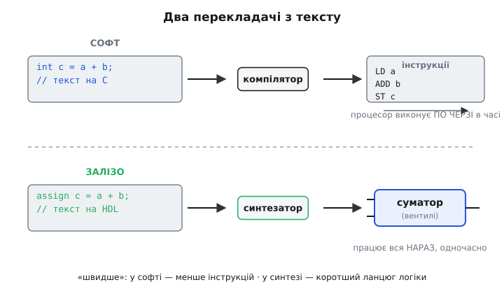
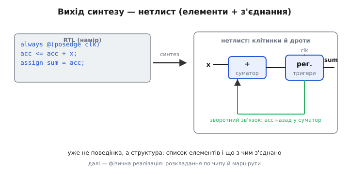

# Логічний синтез: від HDL до вентилів

Сучасний цифровий чип — це мільйони, а то й мільярди логічних елементів. Ніхто їх не малює й не сполучає руками: людина в житті не встигла б розставити стільки дротів, а помилилася б на першій же тисячі. Тож між тим, що інженер **описує**, і тим, що врешті лежить у кремнії, стоїть машина-перекладач. Вона бере [опис схеми мовою HDL](topic:hw-digital/hdl) — текст, зрозумілий людині, — і **сама** будує з нього повну мережу вентилів і тригерів. Цей переклад тексту в схему й називають **логічним синтезом** (від грец. *sýnthesis* — складання, поєднання). Розберімо, що саме він робить: що подають на вхід, які кроки проходить опис усередині і що виходить на виході.

### Синтез — це переклад опису в схему, а не запуск програми

Найперше треба збити хибну аналогію, яку тягне за собою кожен, хто прийшов із програмування. Мова HDL **навмисне** схожа на мову програмування — ті самі `if`, `+`, фігурні дужки. Через це виникає спокуса думати, ніби HDL «компілюється й виконується», як звичайний код. Це не так, і різниця тут не косметична.

Коли [компілятор](topic:hw-arch/fetch-decode-execute) обробляє програму на C, він видає **список інструкцій**, які потім процесор виконує **по черзі в часі**. Синтезатор натомість видає не інструкції, а **схему** — набір вентилів, тригерів і дротів між ними, що існує **цілком і водночас**, як існує намальована на кресленні мікросхема. Ніхто цю схему не «виконує» крок за кроком; вона просто **є** й працює вся нараз, тільки-но подано живлення. Тому синтез — не компіляція в звичному сенсі, а **переклад одного роду опису (поведінка, яку хоче людина) в інший рід опису (з'єднання елементів, зрозуміле фабриці чи FPGA)**.


*Два перекладачі з тексту. Компілятор видає **інструкції**, які процесор проганяє послідовно в часі. Синтезатор видає **схему** — вентилі й тригери, з'єднані дротами, що працюють одночасно. Через це «оптимізувати» в цих світах означає протилежне: у софті — менше інструкцій, у синтезі — коротший ланцюг логіки.*

Ця відмінність одразу перевертає інтуїцію про те, що таке «добре». У програмі швидкість — це **менше інструкцій виконати**. У схемі інструкцій немає взагалі; «швидше» означає **коротший найдовший ланцюг логіки** між двома тригерами. Через те синтез — окрема дисципліна, а не різновид компіляції: він міркує в термінах площі, затримки й перемикань, а не тактів процесора. І щоб цей переклад узагалі мав сенс, на вхід йому треба подати не будь-який текст, а опис саме того рівня, який синтезатор уміє перетворити на залізо.

### Що подають на вхід: синтезовний RTL

Синтезатор їсть не всяку мову опису й навіть не всяку її частину. Ходовий вхід — опис на рівні **RTL** (англ. *register-transfer level*, рівень міжрегістрових передач): ти кажеш, **які є регістри** й **яка логіка перераховує їхній наступний стан** на кожному такті, а конкретні вентилі лишаєш на розсуд машини. Це той самий рівень, яким пишуть щодня: досить високий, щоб не малювати кожен вентиль, і досить конкретний, щоб із нього однозначно виросло залізо.

Ключове слово тут — **синтезовний** (англ. *synthesizable*). Мова HDL уміє описувати дві дуже різні речі, і лише одна з них перетворюється на схему. Перша — **як залізо поводиться** (регістри, логіка, з'єднання); це синтезовне. Друга — **як його випробувати** (згенерувати тестові сигнали, роздрукувати значення, почекати задану кількість наносекунд); це для [моделювання (симуляції)](topic:hw-digital/hdl-simulation) на комп'ютері, і в кремній воно не лягає ніяк. Роздрукувати рядок у справжньому дроті неможливо; «почекати 10 нс» — теж не деталь, яку можна впаяти. Тому все, що описує **перевірку, а не схему**, синтезатор або ігнорує, або відкидає з помилкою.

> 🔧 **Навіщо це.** Межа «синтезовне ↔ несинтезовне» — джерело класичної розгубленості новачка: код **чудово моделюється**, показує правильні хвильки на екрані — а синтезатор його не бере або будує щось геть інше. Причина майже завжди та сама: у синтезовний блок затесалося те, що існує лише в симуляції — затримка `#`, друк `$display`, цикл без сталої межі, ініціалізація, якої в реальному тригері нема. Практичне правило: **для заліза пиши так, ніби кожен рядок мусить стати дротом чи вентилем**; усе, що дротом стати не може, тримай окремо — у тестовому оточенні, яке працює лише на комп'ютері. Тоді те, що ти бачив у моделюванні, і те, що синтезується, збігатимуться.

Отримавши синтезовний опис, машина не перекладає його дослівно рядок у рядок. Вона проходить кілька виразно різних кроків, і найцікавіший — найперший, бо саме там абстрактний текст уперше стає конкретним залізом.

### Крок перший: розпізнати залізо за наміром (інференс)

Синтезатор не бере твої слова буквально — він **розпізнає намір**. Побачивши певний зразок у коді, він доходить висновку, **яку апаратну цеглинку** ти мав на увазі, і ставить її. Цей здогад так і називають — **інференс** (англ. *inference*, від лат. *inferre* — «виводити, робити висновок»): виведення заліза зі зразка опису. Кілька зразків розпізнаються завжди однаково, і варто знати їх напам'ять, бо саме через них ти й керуєш тим, що збереться.


*Як зразок опису стає залізом. Синтезатор упізнає типові конструкції й підставляє відповідну цеглинку: `+` — [суматор](topic:hw-digital/gates-to-functions), `if`/`case` з вибором — [мультиплексор](topic:hw-digital/combinational-circuits), блок «на фронті такту» — [регістр із тригерів](topic:hw-digital/d-flip-flop), `*` — помножувач. Ти пишеш намір — машина добирає схему.*

Розберімо головні зразки, бо кожен — це свідомий вибір заліза, замаскований під звичну конструкцію мови.

**Арифметика.** Оператор `+` між двома шинами інферить [суматор](topic:hw-digital/gates-to-functions) потрібної розрядності; `*` — помножувач; `-` — віднімач. Ти не описуєш, з яких вентилів той суматор скласти, — синтезатор бере готовий свій, оптимізований під цільовий чип.

**Вибір.** Конструкція `if`/`else` чи `case`, що обирає одне значення з кількох, інферить [мультиплексор](topic:hw-digital/combinational-circuits) — комутатор, який пропускає на вихід ту гілку, чия умова справдилась. Скільки гілок — стільки входів у мультиплексора.

**Пам'ять стану.** Оце найважливіший поділ. Опис усередині блоку, що спрацьовує **[на фронті такту](topic:hw-digital/edge-vs-level)** (`always @(posedge clk)`), інферить [регістр](topic:hw-digital/register) — банк [тригерів](topic:hw-digital/d-flip-flop), що защіпають значення по такту й тримають його. Опис **без** такту, що просто реагує на зміну входів, інферить [комбінаційну логіку](topic:hw-digital/basic-gates) без пам'яті. Той самий вираз під тактом і без такту дає **фізично різне залізо**: з регістром і затримкою на такт — або миттєву мережу вентилів. Саме тут криється найчастіша плутанина новачка: забув про такт, де потрібна пам'ять, — дістав миттєву логіку; або ненавмисно описав регістр і здивувався зайвій затримці.

І є один зразок, який інферить залізо, **якого ти не хотів**. Розберімо його окремо — це головна пастка інференсу.

### Пастка інференсу: ненавмисна засувка

Уяви комбінаційний блок (без такту), що має щось поставити на вихід залежно від умови — але ти **забув гілку `else`**:

```verilog
always @(*) begin        // комбінаційний блок: без такту
    if (enable)
        y = data;        // а що, як enable == 0?  Про це не сказано!
end
```

Постав себе на місце синтезатора. Тобі описали залізо, яке при `enable == 1` кладе на вихід `data`. А що робити, коли `enable == 0`? Опис **мовчить**. Але вихід у справжньої схеми мовчати не може — на дроті завжди якийсь рівень. Єдиний спосіб виконати такий неповний опис буквально — **запам'ятати попереднє значення** `y` й тримати його, доки `enable` знову не стане одиницею. А «запам'ятати й тримати» — це вже **пам'ять**. Тож синтезатор змушений інферити **засувку** (англ. *latch*, [прозора клямка-пам'ять](topic:hw-digital/sr-latch)) там, де ти думав, що описуєш чисту комбінаційну логіку.


*Ненавмисна засувка. Неповний `if` (немає `else`) лишає вихід невизначеним для частини умов — синтезатор змушений додати **засувку**, щоб було чим «тримати» старе значення. Домалюй `else` (визнач вихід для всіх умов) — і замість засувки інфериться звичайний **мультиплексор** без пам'яті.*

Ця засувка — майже завжди помилка, і підступна: код моделюється, синтез проходить (часто лише з тихим попередженням), а схема поводиться загадково — сигнал десь «застрягає». Ліки прості й механічні: у комбінаційному блоці **вихід має бути визначений для всіх умов**. Домалюй `else`, або постав виходу значення на початку блоку — тоді для кожної комбінації входів вихід заданий, тримати старе значення не треба, і замість засувки інфериться чистий [мультиплексор](topic:hw-digital/combinational-circuits). Правило коротке: **неповний вибір у комбінаційному блоці = засувка**; хочеш її уникнути — не лишай виходу без значення. Коли ж усі цеглинки розпізнано, з них складається чернетка схеми — і настає другий крок.

### Крок другий: спростити й прибрати зайве

Розпізнавши всі цеглинки, синтезатор має ще не фінальну схему, а лише її **першу, дослівну** версію — часто надлишкову. Тепер він **перекроює** цю логіку, шукаючи дешевший еквівалент: викидає ланцюжки, чий вихід нікуди не веде або завжди сталий; зливає однакові шматки; згортає алгебру. Класичний приклад — вираз `a·b + a·(не b)` дорівнює простісінькому `a`, тож три вентилі перетворюються на голий дріт. За ту саму поведінку — менше заліза.

Це — [окрема, дуже неглупа машинерія оптимізації синтезу](topic:hw-digital/synthesis-optimization): вона з безлічі рівносильних схем шукає найдешевшу за площею, швидкодією чи споживанням, а куди саме тягнути — їй кажуть **обмеженнями** (англ. *constraints*), найперше цільовою тактовою частотою. Тут важливо лиш одне: спрощення — це **окремий крок конвеєра**, що працює над **абстрактною** логікою, ще не прив'язаною до жодного конкретного чипа. Спершу знаходимо найпростішу логіку взагалі — і лише потім кладемо її на реальні елементи.

### Крок третій: покласти логіку на реальні клітинки

Досі синтезатор мав діло з **абстрактними** `AND`, `OR`, `NOT`, суматорами — «родовою» логікою, без прив'язки до заліза. Останній крок — **прив'язка до технології** (англ. *technology mapping*): перекласти абстрактні операції на **справжні клітинки того чипа**, куди дизайн ляже. І тут два цілком різні світи.

Для **мікросхеми на замовлення** (ASIC, англ. *application-specific integrated circuit*) ціль — **бібліотека стандартних клітинок**: набір готових фізичних вентилів різного розміру й швидкості (`NAND` на два входи, `NOR` на три, тригер такий-то), кожен зі своєю площею й затримкою, наданий фабрикою. Прив'язка тут — це задача «накрити мою логіку клітинками з цієї бібліотеки якнайдешевше».

Для [програмовної логіки FPGA](topic:hw-digital/inside-fpga) ціль зовсім інша. Там **нема** окремих фізичних вентилів — є [таблиці істинності LUT](topic:hw-digital/lut): маленькі універсальні комірки, кожна вміє **будь-яку** функцію від, скажімо, шести входів. Прив'язка до FPGA — це задача «накрити мою логіку найменшим числом LUT», і вона геть не схожа на добір гейтів для ASIC.


*Один RTL — дві різні прив'язки. Абстрактна логіка (посередині) лягає на **стандартні клітинки** фабрики для ASIC — або на **таблиці LUT** для FPGA. Тіло синтезу спільне; різниться лише останній крок — на які саме фізичні елементи все накладають. Тому той самий опис синтезують і в чип, і в FPGA, міняючи тільки цільову бібліотеку.*

Оце розділення й пояснює головну зручність RTL: **опис не прибитий до конкретного заліза**. Той самий синтезовний код можна покласти і в дешеву FPGA для прототипу, і у власну мікросхему для серії — синтезатор просто візьме іншу цільову бібліотеку на останньому кроці. А результатом усього конвеєра — хоч для ASIC, хоч для FPGA — стає один і той самий рід документа.

### Що виходить: нетлист

Пройшовши інференс, оптимізацію й прив'язку, синтезатор віддає **нетлист** (англ. *netlist*, дослівно «список мереж»: *net* — електрична мережа-провідник, *list* — список). Назва точно каже суть: це **список усіх елементів схеми й усіх з'єднань між їхніми виводами**. Тобто які саме клітинки взято (стільки-то таких вентилів, стільки-то тригерів) і що з чим з'єднано дротами. Нетлист — уже не поведінка, а **готова структура схеми**: якби ти намалював її на папері, вийшла б повна принципова схема з вентилів.


*Вихід синтезу — нетлист. Кілька рядків RTL (ліворуч) стають конкретною мережею клітинок і дротів (праворуч): які елементи взято й що з чим сполучено. Це вже не опис поведінки, а структура, готова до втілення — у кремній чи у тканину FPGA.*

Цей нетлист — не кінець дороги, а **передача естафети** наступному етапу. Далі його чекає **фізична реалізація**: для FPGA — розкладання по клітинках чипа й прокладання маршрутів (place & route), а тоді генерація бітів конфігурації; для ASIC — розміщення клітинок на кристалі й розведення шарів металу під фотошаблони. Але вся ця фізика вже працює **зі структурою, а не з поведінкою** — тяжку роботу «зрозуміти, чого хотіла людина, і скласти з цього схему» зробив саме логічний синтез.

> 🔧 **Навіщо це.** Слово «нетлист» ти постійно зустрічатимеш у звітах інструментів — і корисно точно знати, що це просто **список елементів і з'єднань**, підсумок синтезу. Практична вигода: коли синтезатор рапортує «стільки-то LUT, стільки-то тригерів», це підрахунок по нетлисту — і найкращий спосіб побачити, **що насправді збудувалося** з твого опису. Дивишся в цей звіт — і одразу ловиш несподіванки: раптовий помножувач там, де його не мало бути; засувка, якої ти не хотів; удесятеро більше тригерів, ніж уявляв. Синтез — місток, де намір стає структурою; читати нетлист — значить бачити, що вийшло по той бік містка.

### Зведімо конвеєр докупи на маленькому прикладі

Проженімо крізь усі кроки один крихітний опис — щоб побачити переклад цілком.

**Умова.** Треба схема, що на кожному фронті такту додає до збереженого значення вхідне число (акумулятор). Опишемо намір мовою RTL і простежимо, у що його перетворить синтез.

```verilog
module accum(input clk, input [7:0] x, output [7:0] sum);
    reg [7:0] acc = 0;              // 8-бітний регістр стану
    always @(posedge clk)           // на фронті такту...
        acc <= acc + x;             // ...защіпнути (старе acc + вхід x)
    assign sum = acc;               // вихід = вміст регістра
endmodule
```

Тепер простежмо переклад крок за кроком — не як «виконання рядків», а як розпізнавання й складання заліза:

```
1. Інференс (розпізнати цеглинки за зразками):
     reg [7:0] acc  + блок @(posedge clk)  →  8-бітний РЕГІСТР (банк 8 тригерів)
     acc + x                               →  8-бітний СУМАТОР
     assign sum = acc                      →  прямі ДРОТИ від регістра до виходу

2. Оптимізація (спростити):
     тут спрощувати майже нічого — логіка вже мінімальна;
     на великій схемі саме тут викидається зайве й балансується глибина

3. Прив'язка до технології (покласти на клітинки):
     для FPGA:  суматор + регістр  →  кілька LUT (для «+») + 8 тригерів клітинок
     для ASIC:  →  вентилі суматора зі стандартних клітинок + 8 тригерів бібліотеки

4. Нетлист (вихід):
     список: 1 суматор, 1 регістр (8 тригерів), дроти clk→регістр,
             x→суматор, вихід суматора→вхід регістра, регістр→sum
```

Прочитай ці кроки як **народження схеми з тексту**. Жоден рядок не «виконався»: `always @(posedge clk)` не «викликався» — синтезатор **розпізнав** у ньому банк тригерів, з'єднаний із суматором у петлю, що защіпає новий підсумок на кожному фронті. `assign sum = acc` — не крок, а постійні дроти від регістра до виходу. На виході — не інструкції, а нетлист: конкретна, назавжди з'єднана схема, що складає й накопичує, доки цокає такт. Оце й весь логічний синтез у мініатюрі: узяти опис наміру → розпізнати за ним залізо → спростити → покласти на реальні клітинки → віддати готову структуру. Уся сила в тому, що цей переклад робить машина — тож людина мислить наміром, а мільйони вентилів складаються самі.

> 🔧 **Навіщо це.** Тримати в голові ці чотири кроки корисно щодня, бо вони підказують, **де** шукати причину, коли щось пішло не так. Схема робить не те, що в моделюванні? — швидше за все, у синтезовний код затесалося несинтезовне (питання **входу**). Вискочила зайва пам'ять чи засувка? — недороблений **інференс** (неповний блок, забутий такт). Схема правильна, але завелика чи заповільна? — це вже **оптимізація** й **архітектура**. Знаючи конвеєр, ти не тикаєшся навмання, а одразу дивишся на потрібний крок — і на нетлист, що показує підсумок усіх чотирьох.

> 📜 **Загляньте у вставку:** [Як схеми навчили синтезуватися самі](topic:hw-digital/logic-synthesis/hist-synthesis.md) — від ручної мінімізації картами Карно й програми Espresso до Design Compiler 1987 року, з якою малювання схем поступилося їхньому опису.
