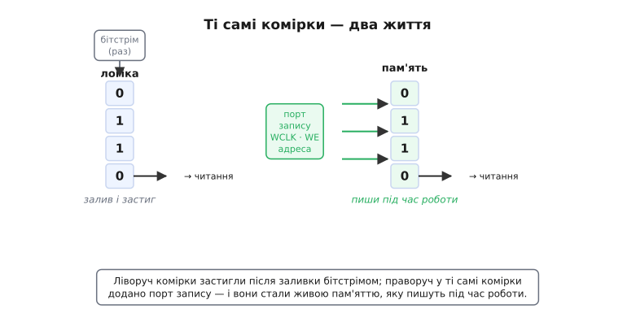
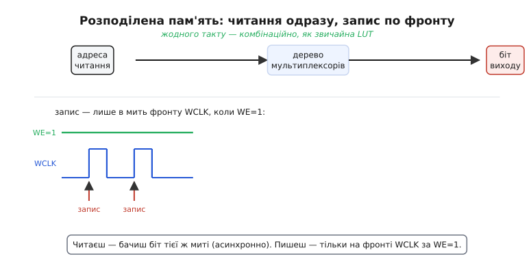
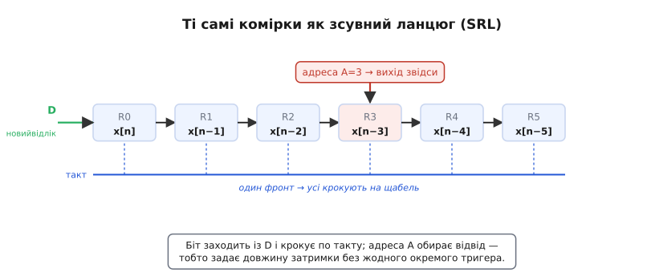

# LUT як розподілена пам'ять (Distributed RAM і SRL)

У серці FPGA стоїть [таблиця підстановки](root:hw-digital/lut) — LUT: жменька комірок пам'яті, у яких лежить стовпець відповідей логічної функції, і дерево мультиплексорів, яким входи вибирають потрібний біт. Коли LUT працює логікою, ці комірки — **статична пам'ять (SRAM)**, у яку раз залили конфігурацію, і вона застигла: біти стоять непорушно, змінити їх можна лише новою заливкою всього чипа. Але придивімося уважніше й поставимо просте, майже нахабне питання. Якщо ці комірки — справжня SRAM, а SRAM за природою можна **перезаписувати** будь-коли, то навіщо тримати їх застиглими? Що, якби до них домалювати звичайний вхід запису — і дозволити прошивці міняти їхній вміст **під час роботи**?

Виявляється, саме це й роблять. Той самий блок SRAM, що вдень служить таблицею логіки, увечері підробляє **живою пам'яттю** — крихітним ОЗП просто в тілі логічної клітинки. І ще й у другій ролі: замкнувши ті самі комірки в ланцюг, дістаємо **зсувний регістр** без жодного окремого тригера. Два трюки — **розподілена пам'ять** (англ. *distributed RAM*) і **зсувний регістр на LUT** (англ. *shift register LUT*, SRL) — виростають з однієї думки: комірки вже стоять на кристалі, тож гріх не використати їх ще й як пам'ять. Розберімо, як це працює, чому це майже безкоштовно і де воно рятує розробника.

## Друге життя тих самих комірок

Почнімо з того, що LUT уже **є** пам'яттю — просто пам'яттю тільки для читання, з погляду працюючої схеми. Чотиривходова LUT тримає 16 бітів, шестивходова — 64; входи функції правлять за **адресу**, а на виході з'являється біт, що лежить за цією адресою. Це буквально операція читання з пам'яті: подав адресу — отримав слово. Різниця з «нормальним» ОЗП лише в одному: у логічному режимі ці 16 чи 64 біти пише **тільки бітстрім конфігурації**, один раз на старті, а далі вони закам'янілі.

Тепер зробімо один крок. Щоб перетворити пам'ять «тільки читання» на повноцінну «читання-запис», їй бракує рівно одного — **порту запису**: лінії адреси, куди писати, лінії даних, що писати, сигналу дозволу запису (WE, *write enable*) і такту запису (WCLK, *write clock*). Додайте цей порт до SRAM-комірок LUT — і та сама LUT-6 стає **ОЗП на 64×1 біт**, у яке прошивка кладе й дістає значення на льоту. Дерево мультиплексорів, яким входи читали біт логіки, тепер працює **портом читання** пам'яті; додана обв'язка запису — **портом запису**. Схема майже не змінилася; змінилося те, що комірки перестали бути застиглими.


*Ліворуч комірки працюють логікою: бітстрім залив у них стовпець відповідей і вони застигли. Праворуч до тих самих комірок домальовано порт запису (WCLK, WE, адреса запису) — і вони стали живим ОЗП, куди пишуть під час роботи. Вихід читання в обох випадках той самий — через дерево мультиплексорів. Уся різниця — доданий шлях «записати комірку».*

Ось чому це вигідно майже задарма. Комірки SRAM **уже стоять** на кристалі — за них заплачено площею й транзисторами, коли будували LUT. Дозволити їх перезаписувати — це дописати відносно дешеву обв'язку запису, а не класти окремий блок пам'яті. Тож замість того, щоб під невеликий буфер тягти дані аж до великого виділеного ОЗП десь на краю чипа, ви робите крихітну пам'ять **прямо там, де сидить логіка**, з тих клітинок, що однаково нікуди не поділися. Звідси й назва: пам'ять не зібрана в один масив, а **розподілена** по полю логіки, дрібними шматочками в самих клітинках.

> 🔧 **Навіщо це.** Розподілена пам'ять — це ваш інструмент для **дрібних, швидких, локальних** буферів. Регістровий файл на 16 чи 32 слова, невелика черга (FIFO) на десяток елементів, таблиця коефіцієнтів фільтра, коротка лінія затримки — усе це сідає в кілька LUT просто поруч із логікою, що з ними працює. Виграш подвійний: ви не витрачаєте цінні блоки виділеного ОЗП на дрібницю (їх на чипі лічена кількість) і не женете сигнал через півкристала — пам'ять стоїть упритул, тож коротка й швидка. Коли синтезатор рапортує «дизайн зайняв стільки-то LUTRAM» — це і є ці клітинки в ролі пам'яті.

## Не кожна LUT уміє бути пам'яттю

Тут криється перша практична тонкість, і про неї варто знати наперед, щоб не дивуватися звітам інструментів. **Порт запису є не в кожної LUT.** Додавати обв'язку запису до всіх клітинок було б марнотратно: більшість логіки її ніколи не використає, а транзистори й дроти вона з'їдала б у кожній клітинці чипа. Тому виробники ставлять здатність писати лише в **частину** клітинок — умовно, в кожну четверту (у сімействах Xilinx це зветься **SLICEM** — *memory*, на відміну від звичайних логічних **SLICEL** — *logic*). Клітинки-SLICEM уміють і логіку, і пам'ять, і зсувний регістр; клітинки-SLICEL — лише логіку.

Наслідок простий: **розподілена пам'ять живе не будь-де, а тільки на тих ділянках, де є SLICEM**. Тому чим більше distributed RAM ви просите, тим із меншого запасу «пам'яткоздатних» клітинок інструмент її будує — і якщо перегнути, він або відмовиться, або почне будувати неоковирно, з'їдаючи клітинки, потрібні під логіку. Розподілена пам'ять — для **малих** обсягів; великі буфери — робота виділених блоків ОЗП, яких на чипі спеціально наставили окремими масивами (це вже не наша тема, але межу треба відчувати).

## Читаєш одразу, пишеш по такту

Друга тонкість — у **характері доступу**, і вона напряму впливає на те, як писати робочий код. Читання й запис розподіленої пам'яті поводяться по-різному, і несиметрія тут не примха, а прямий наслідок будови.

**Читання — асинхронне.** Подали адресу читання — і біт з'являється на виході **тієї ж миті**, без жодного такту, просто протягнувшись крізь дерево мультиплексорів. Це рівно те, що LUT робить у логіці: адреса на входах → біт на виході, комбінаційно. Ніякого фронту чекати не треба.

**Запис — синхронний.** А от **покласти** новий біт у комірку можна лише в **мить фронту** WCLK і лише коли дозвіл WE піднятий. Це та сама дисципліна, що й у [тактованого регістра](root:hw-digital/shift-register-clocked): дані й адреса запису мусять устоятися до фронту, а сам запис стається в цю коротку мить. Між фронтами вміст пам'яті непорушний, хоч би як смикалися лінії даних.


*Угорі — читання: адреса проходить крізь те саме дерево мультиплексорів і дає біт негайно, комбінаційно, без такту. Унизу — запис: нове значення заходить у комірку тільки в мить фронту WCLK і лише коли WE=1; поза фронтом уміст стоїть. Читаєш будь-коли — бачиш поточний біт; пишеш — строго по фронту.*

Ця пара «читання одразу / запис по фронту» — те, що треба тримати в голові, коли описуєш пам'ять мовою [HDL](root:hw-digital/hdl). Опишеш доступ так, що читання не потребує такту (комбінаційне), а запис — під фронтом, — і синтезатор упізнає розподілену пам'ять і збудує її на LUT. Опишеш обидва боки синхронними (читання теж під тактом) — і він, найпевніше, збудує **виділений блок ОЗП**, бо той якраз читає синхронно. Тобто **сама форма опису** штовхає інструмент до одного чи другого виду пам'яті. Якщо вам конче треба, щоб читання розподіленої пам'яті теж було синхронне, — ніхто не заважає завести вихід читання на сусідній тригер клітинки (він там і так є), доклавши один такт затримки навмисно.

## Той самий блок — зсувний регістр (SRL)

А тепер найдотепніший поворот. Ми домалювали до комірок порт запису й дістали ОЗП. Зробімо інакше: замкнімо комірки в **ланцюг** — вихід кожної на вхід наступної — і подаймо спільний такт. Що вийде? [Тактований зсувний регістр](root:hw-digital/shift-register-clocked): на кожен фронт біт заходить із входу, а вся низка крокує на щабель уперед. Тільки цей регістр збудовано **не з окремих тригерів**, а з тих самих SRAM-комірок LUT, перемкнутих у режим зсуву. Одна LUT-6 дає таким робом **32-бітний** зсувний регістр (SRL32), у старіших чотиривходових — 16-бітний (SRL16).

Порівняйте ціну. Щоб зробити 32-бітну лінію затримки на звичайних тригерах, треба **32 тригери** — 32 клітинки стану, дефіцитний ресурс. А SRL укладає ті самі 32 щаблі в **одну** LUT, не витративши **жодного** окремого тригера. Різниця в ресурсах разюча: там, де регістр забрав би десятки клітинок, SRL обходиться однією. Тому коли в дизайні потрібна довга затримка потоку даних на фіксовану (чи керовану) кількість тактів — інструмент радо збирає її на SRL, бо це в рази ощадливіше.

Але справжня родзинка SRL — в **адресі**. У режимі зсуву входи LUT уже не потрібні як логічна адреса читання таблиці; натомість ними задають, **з якої саме комірки ланцюга брати вихід** — тобто **відвід** (англ. *tap*). Постав адресу 31 — вихід береться з останньої, 31-ї комірки, і це повна 32-щаблева затримка. Постав адресу 7 — вихід береться з 8-ї комірки, і той самий фізичний ланцюг поводиться як **8-щаблевий** регістр. Виходить керована **довжина затримки**: та сама залізяка дає будь-яку затримку від 1 до 32 тактів, і міняти її можна **на льоту, самою адресою**, не чіпаючи схему.


*Комірки LUT перемкнуто в зсувний ланцюг: новий відлік заходить із D, і на кожен фронт спільного такту вся низка зсувається на щабель — у комірках лежить x[n], x[n−1], x[n−2]… Адреса A не читає логіку, а обирає, з якого щабля взяти вихід: A=3 бере x[n−3]. Так само задають будь-яку довжину затримки від 1 щабля до повної, і жоден окремий тригер на це не витрачено.*

Тут одразу видно, навіщо це в обробленні сигналів. У комірках зсувного ланцюга, крізь який течуть [відліки сигналу](root:hw-analog/sampling-quantization), лежить готова **історія** сигналу: x[n], x[n−1], x[n−2] і далі вглиб. Це і є [лінія затримки з відводами](root:hw-digital/shift-register-clocked) — кістяк [цифрового фільтра](root:hw-digital/shift-register-clocked). Замість того щоб будувати таку лінію з юрби тригерів, її вкладають у кілька SRL — компактно, дешево, з керованою довжиною. Одна тонкість: **проміжні відводи** SRL відкриває через свою адресу по одному за раз, тож для класичного FIR, де всі відводи потрібні **одночасно**, SRL зручний насамперед як **суцільна затримка** (наприклад, вирівняти два потоки в часі), а повний набір одночасних відводів частіше беруть з окремих тригерів або з розподіленої пам'яті. Але як **дешева програмована затримка** SRL — інструмент першого вибору.

> 🔧 **Навіщо це.** SRL — ваша **безкоштовна лінія затримки**. Треба притримати шину даних на кілька тактів, щоб вона зійшлася в часі з керуючим сигналом? Вирівняти два потоки, що розсинхронізувалися на конвеєрі? Зробити елемент затримки в цифровому фільтрі? Усе це — SRL, і воно не з'їдає ні тригерів, ні виділеного ОЗП. Ба більше: коли ви пишете в [HDL](root:hw-digital/hdl) звичайний ланцюжок регістрів `data <= {data[N-2:0], new_bit}` завдовжки в десятки бітів, розумний синтезатор **сам** упізнає в ньому зсув і згорне його в SRL, заощадивши вам гори клітинок, — варто лише знати, що так буває, і не дивуватися, коли 64 «регістри» у звіті займають дві LUT замість шістдесяти чотирьох тригерів.

## Як це виглядає в коді прошивки

Розподілену пам'ять найлегше відчути з боку опису схеми. Ось маленький **регістровий файл** — 16 комірок по 8 біт, з асинхронним читанням і синхронним записом. Це канонічний опис, який синтезатор Xilinx збирає саме на LUT-як-ОЗП, бо читання тут комбінаційне, а запис — під фронтом:

```verilog
// 16 слів по 8 біт — сяде в кілька LUT як розподілене ОЗП.
// Ключ до впізнавання: читання БЕЗ такту, запис ПІД фронтом.
module regfile16x8 (
    input              clk,
    input              we,          // дозвіл запису (write enable)
    input      [3:0]   waddr,       // адреса запису (4 біти → 16 комірок)
    input      [7:0]   wdata,       // дані запису
    input      [3:0]   raddr,       // адреса читання
    output     [7:0]   rdata        // дані читання
);
    reg [7:0] mem [0:15];           // 16×8 — тіло пам'яті

    always @(posedge clk)           // ЗАПИС — синхронний, по фронту й за we
        if (we)
            mem[waddr] <= wdata;

    assign rdata = mem[raddr];      // ЧИТАННЯ — асинхронне, без такту
endmodule
```

Придивіться, як точно код повторює фізику. Блок `always @(posedge clk)` із `if (we)` — це і є синхронний порт запису: комірка `mem[waddr]` оновлюється лише в мить фронту й лише коли `we` піднятий, точнісінько як WCLK+WE у залізі. Рядок `assign rdata = mem[raddr]` — асинхронний порт читання: `rdata` іде за `raddr` **без** такту, комбінаційно, крізь те саме дерево мультиплексорів. Саме ця несиметрія — читання без фронту, запис під фронтом — і є сигнал синтезатору: «збери це на LUT, а не у виділеному ОЗП».

А ось SRL у ролі **лінії затримки**: притримати 8-бітну шину рівно на N тактів. У HDL це просто ланцюг зсуву, який інструмент згортає в SRL:

```verilog
// Затримати шину data на DEPTH тактів. Синтезатор згорне цей
// зсувний ланцюг у SRL — без витрати окремих тригерів на кожен щабель.
module delay_line #(parameter DEPTH = 16) (
    input              clk,
    input      [7:0]   din,
    output     [7:0]   dout
);
    reg [7:0] sr [0:DEPTH-1];       // ланцюг щаблів
    integer i;

    always @(posedge clk) begin
        sr[0] <= din;               // новий відлік заходить із входу
        for (i = 1; i < DEPTH; i = i + 1)
            sr[i] <= sr[i-1];       // уся низка крокує на щабель
    end

    assign dout = sr[DEPTH-1];      // вихід — з останнього щабля
endmodule
```

І тут головне не проґавити одну **пастку**, спільну для обох конструкцій: у розподіленої пам'яті **читання відстає від запису** на розуміння порядку, а в SRL вихід відстає від входу **рівно на DEPTH тактів**. Якщо ви подали дані в `delay_line` і чекаєте їх на виході **того ж такту** — їх там немає й не буде: вони виходять через DEPTH фронтів. Так само з `regfile`: записавши слово на фронті, ви прочитаєте його з тієї адреси **правильно**, але якщо в тому ж такті одна частина схеми пише в комірку, а інша читає ту саму комірку, — читач побачить **старе** значення (запис устигне лише по фронту). Це не хиба, а прямий наслідок «пишемо по такту»: завжди питайте себе, **на якому такті** ваші дані вже точно в пам'яті, і не читайте раніше.

## Дві ролі, одна ідея

Історія того, як комірки LUT навчилися бути пам'яттю, — окрема цікава сторінка: розподілене ОЗП (у Xilinx його назвали SelectRAM) з'явилося ще в архітектурі [XC4000 на зорі FPGA](root:hw-digital/lut-ram/hist-selectram-srl.md), а трюк зі зсувним регістром на LUT (SRL16) дозрів пізніше, коли інженери помітили, що ті самі комірки чудово годяться й на ланцюг затримки.

Підсумуємо суть. **LUT — це SRAM плюс дерево мультиплексорів**, і якщо дозволити тим коміркам перезаписуватися під час роботи, вони служать не лише таблицею логіки, а й **живою пам'яттю**. Звідси два трюки з однією основою:

**Розподілена пам'ять (distributed RAM)** — комірки LUT з доданим портом запису стають крихітним ОЗП **прямо в тілі логіки**: LUT-6 дає 64×1 біт. Читання **асинхронне** (адреса → біт одразу, крізь мультиплексори), запис **синхронний** (лише на фронті WCLK за WE). Уміють це не всі клітинки, а лише «пам'яткоздатні» (SLICEM, ~кожна четверта), тож пам'ять ця для **малих, локальних, швидких** буферів; великі обсяги — робота виділених блоків ОЗП. У [HDL](root:hw-digital/hdl) її «замовляють» формою опису: комбінаційне читання + синхронний запис.

**Зсувний регістр на LUT (SRL)** — ті самі комірки, замкнуті в **ланцюг**: біт заходить із входу й крокує по такту, LUT-6 дає 32 щаблі (SRL32), і **жодного окремого тригера** на це не витрачено. Адреса LUT тут обирає **відвід** — тобто задає **довжину затримки** від 1 до повної, керовану на льоту. Це найдешевша програмована [лінія затримки](root:hw-digital/shift-register-clocked), кістяк елементів затримки в цифровому обробленні сигналів.

Обидва трюки — про те саме прозріння: пам'ять у FPGA не мусить бути окремим великим масивом. Мільйони SRAM-комірок уже стоять на кристалі всередині LUT, і найдешевша пам'ять — та, що вже там; лишається дозволити їй бути не тільки таблицею логіки. Тому, дивлячись на LUT, варто бачити в ній не «логічний елемент», а **універсальну жменьку комірок**, що на вимогу стає то функцією, то ОЗП, то лінією затримки.

---
