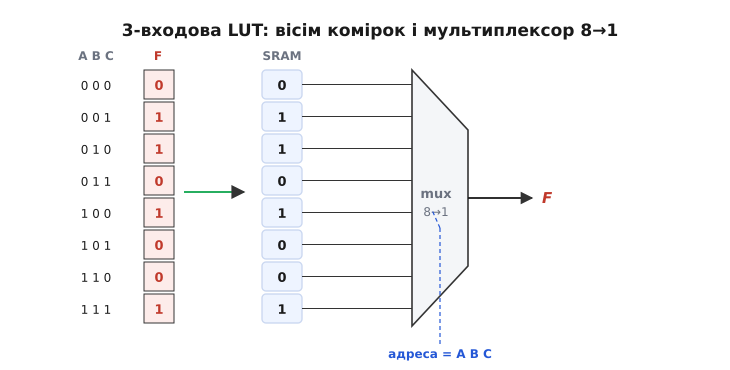
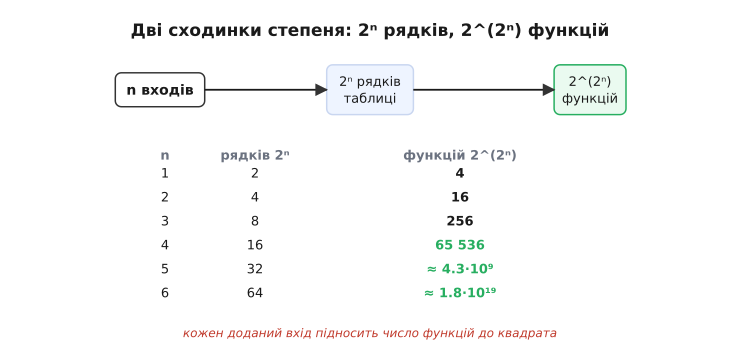
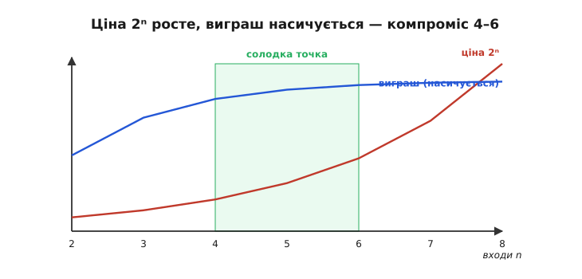

# 🧮 Скільки функцій уміщує LUT: 2^(2ⁿ) і чому 4–6 входів — солодка точка

> Числова вставка до [таблиці підстановки в ПЛІС](root:hw-digital/lut). Головне там: клітинка ПЛІС не «складає» логіку з вентилів, а **зберігає** її — як стовпець бітів у крихітній пам'яті, що адресується входами. Звідси й назва: LUT (*look-up table*, таблиця підстановки). Лишилося поставити вираз на числа: **скільки** різних функцій така таблиця здатна втримати — і чому виробники, ніби змовившись, спинилися саме на 4–6 входах. Відповідь виявляється на диво точною й пояснює конструкцію реальних чипів.

### Спершу — що таке LUT як число

Почнімо з образу [самої таблиці підстановки](root:hw-digital/lut). n-входова LUT — це 2ⁿ комірок пам'яті (по одній на кожен рядок таблиці істинності) і мультиплексор, для якого n входів слугують адресою й вибирають потрібну комірку. Те, що зберігається в комірках, і є **стовпець виходів** функції з таблиці істинності: біт на кожну комбінацію входів. Перевіримо рахунок на найменшому прикладі — функції трьох змінних.


*Та сама ідея «таблиця в пам'яті». Стовпець F із таблиці істинності (ліворуч) вписують у вісім комірок SRAM (центр); трійка входів (A,B,C) працює як адреса, а мультиплексор 8→1 видає на вихід рівно ту комірку, на яку вказала адреса. Схему не паяють з вентилів — її **завантажують** як вміст пам'яті. Тому одні й ті самі вісім комірок реалізують будь-яку функцію трьох входів, а затримка завжди одна: час доступу до пам'яті.*

З цього малюнка вже видно ключову річ. Раз функцію задає **вміст** комірок, то «перепрограмувати» клітинку — означає просто переписати ці біти. А скільки всього різних варіантів вмісту — стільки різних функцій LUT і вміє. Це вже не образ, а лічильник, і його легко довести до кінця.

### Інтуїція: два незалежні подвоєння

Усе тримається на двох степенях двійки, що нанизуються один на одного. Перший дає [булева алгебра](root:math-logic/boolean-algebra): таблиця істинності функції n змінних має **2ⁿ рядків**, бо кожен новий вхід подвоює число комбінацій (додали біт — і кожен попередній рядок роздвоївся на «новий вхід = 0» та «новий вхід = 1»). Другий степінь — над першим. У кожному рядку вихід вільний: туди можна незалежно поставити 0 або 1, і будь-який вибір дає **законну** функцію. Тож ми робимо 2ⁿ незалежних виборів по дві можливості — а коли незалежні вибори перемножуються, двійки множаться самі на себе 2ⁿ разів.


*Ланцюжок угорі: n входів → 2ⁿ рядків таблиці → 2^(2ⁿ) різних функцій (бо кожен рядок — окремий 0/1, і їх перемножуємо). Таблиця знизу рахує це для малих n. Зверніть увагу на стрибок: 4 входи — це вже 65 536 функцій, 5 — понад чотири мільярди, а 6 входів дають ≈ 1.8·10¹⁹ — більше, ніж секунд минуло від Великого вибуху. І все це — у клітинці на лічені десятки бітів пам'яті.*

### Апарат: формула 2^(2ⁿ)

Формалізуємо те, що щойно порахували образом. Позначмо число входів n. Тоді:

```
рядків у таблиці істинності   = 2ⁿ
у кожному рядку вихід          = 0 або 1   (2 варіанти, незалежно)
усього різних функцій  N(n)    = 2^(2ⁿ)
```

Підставмо кілька значень, щоб відчути темп зростання:

```
n = 1 :  2^(2¹) = 2² = 4 функції
n = 2 :  2^(2²) = 2⁴ = 16
n = 3 :  2^(2³) = 2⁸ = 256
n = 4 :  2^(2⁴) = 2¹⁶ = 65 536
n = 5 :  2^(2⁵) = 2³² ≈ 4.3 · 10⁹
n = 6 :  2^(2⁶) = 2⁶⁴ ≈ 1.8 · 10¹⁹
```

Це **подвійна експонента** (*double exponential*): росте не просто швидко, а нестямно — кожен доданий вхід не множить попереднє число, а підносить його до квадрата (з 256 робить 256² = 65 536). Саме тому n-входова LUT — настільки універсальна цеглинка: вже при n = 4 вона перекриває всі 65 536 функцій чотирьох змінних до одної, тож синтезатору ніколи не бракне потрібної — хоч би яку химерну логіку він захотів туди вкласти. А коштує така повна універсальність дрібниці: рівно 2ⁿ біт пам'яті (16 комірок для n = 4). Постає природне питання: якщо ширший вхід дає так нестямно багато, чому б не робити LUT якомога ширшими?

### Чому спиняються на 4–6: ціна проти виграшу

Тут підказку дає не сама формула функцій, а **ціна** однієї LUT — і вона ховається в тому ж 2ⁿ, тільки з іншого боку. Пам'ять LUT — це 2ⁿ комірок, тож **кожен доданий вхід подвоює залізо** клітинки: 4 входи — 16 біт, 5 — 32, 6 — 64, 7 — уже 128 комірок, та ще й ширший мультиплексор перед ними. Зростання геометричне.

Порахуймо марнотратство навпростець. Покладемо в LUT-8 (256 комірок) типову функцію, що реально залежить лише від чотирьох входів. Тоді 4 «зайві» входи нічого не змінюють, а виходить, що 16 рядків справжньої таблиці просто повторено 2⁴ = 16 разів. Корисні з 256 комірок — лише 16; решта 240 (94 % клітинки) — мертвий вантаж, який однаково займає площу й живиться струмом. Ось чому широчезну LUT майже завжди недовикористано. А ось виграш від ширшого входу зовсім інший. Ширша LUT корисна тим, що ховає більший шмат логіки в одну клітинку, тобто скорочує **глибину** — число рівнів LUT, крізь які сигнал біжить ланцюжком (а кожен рівень додає затримку, що вже впирається в [часові обмеження ПЛІС](root:hw-digital/fpga-timing-and-routing)). Та реальні схеми складаються переважно з **вузьких** вузлів: типовій логіці рідко треба сім чи вісім входів одразу, тож у широченних LUT частина комірок просто стоїть без діла. Виграш від кожного нового входу швидко **насичується**, а ціна знай подвоюється.


*Червона крива — ціна клітинки (2ⁿ комірок), що подвоюється з кожним входом. Синя — виграш (скільки рівнів логіки економить ширший вхід), який майже виходить на полицю вже за 5–6 входів. Зона, де виграш ще вартий ціни, — зелена смуга 4–6. Праворуч — як беруть **майже** весь виграш, не платячи за справді широкий вхід: одну LUT-6 складають із двох LUT-5 зі спільними входами і мультиплексора на 6-й вхід; коли ж функції треба лише 5 входів, ті самі дві половини працюють як дві окремі клітинки.*

Звідси й «солодка точка» (*sweet spot*). Це не вгадування й не данина традиції, а підсумок інженерних замірів. Дослідники архітектури ПЛІС із Торонтського університету — насамперед Вон Бец і Джонатан Роуз — ще наприкінці 1990-х на тестових схемах показали, що **за площею** найвигідніша LUT приблизно на чотири входи. Пізніша їхня робота (Ахмед і Роуз, 2000-ті), що врахувала вже й **затримку** на глибоко-субмікронних техпроцесах, зсунула оптимум до п'яти-шести входів. Тому сімейства початкового рівня й досі тримаються 4-входових клітинок, а більші сучасні ПЛІС стандартно мають 6-входову LUT — нерідко «дробову» (*fracturable*): фізично це дві 5-входові половинки, що за потреби зливаються в одну шестивходову, а інакше рахують дві окремі функції. Так конструктори знімають майже весь виграш широкого входу, не платячи повну геометричну ціну.

### Чому це важливо

Ця арифметика — підмурок усього, що пов'язане з [таблицею підстановки в ПЛІС](root:hw-digital/lut). Вона пояснює, **чому** LUT універсальна (подвійна експонента 2^(2ⁿ) гарантує, що потрібна функція в наборі завжди знайдеться) і водночас **чому** її не роблять як завгодно широкою (ціна 2ⁿ подвоюється щокроку, а виграш насичується). Дві сходинки степеня працюють і там, де йдеться про [внутрішній устрій клітинки](root:hw-digital/inside-fpga) чи про критичний шлях і максимальну частоту: ширина LUT — це безпосередньо і обсяг пам'яті в клітинці, і глибина логіки, крізь яку йде сигнал. Та сама пара степенів двійки з [булевої алгебри](root:math-logic/boolean-algebra), що задає таблицю істинності, тут визначає, скільки заліза коштує одна програмована цеглинка ПЛІС.
