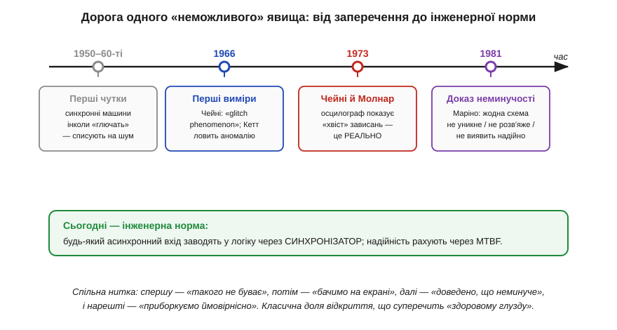
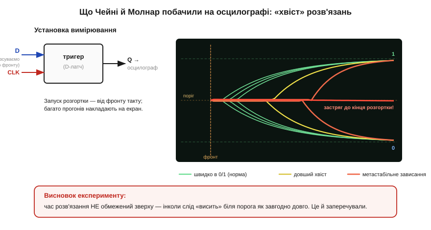
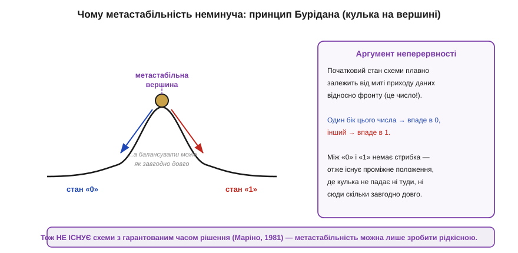

# 📜 Метастабільність: явище, в яке інженери відмовлялися вірити

> Суть метастабільності проста: якщо дані змінюються рівно у вікні **setup/hold** довкола тактового фронту, тригер може **зависнути** між 0 і 1 — і це не вада конкретного чипа, а фундаментальна риса будь-якої бістабільної петлі. Та сама петля, яка дає [тригеру пам'ять](topic:hw-digital/state-memory/hist-flip-flop.md), має хиткий «горб» між двома стійкими станами, на якому кулька балансує, перш ніж упасти. Тут — розповідь про те, як інженерія цілих **два десятиліття** відмовлялася вірити, що той горб справді існує в залізі, доки двоє дослідників із Сент-Луїса не показали його на екрані осцилографа.

Уявіть інженера середини 1960-х. У нього в руках — акуратна, детермінована цифрова логіка: вентилі, тригери, лічильники. Усе підкоряється чітким правилам: подав входи — за відому затримку дістав однозначний вихід, або 0, або 1. Третього не дано — так він вважає, так пишуть підручники, так велить здоровий глузд. І раптом велика синхронна машина **зрідка** робить незрозуміле: лічильник перескакує через число, керування «зривається», система перезавантажується — а потім тижнями працює бездоганно, і відтворити збій не виходить. Що це? Найпростіша відповідь — «навівся шум», «бракована лампа», «космічний промінь». Майже ніхто не припускав справжньої причини, бо вона звучала як єресь: що цифровий тригер може на якийсь час застрягнути **ні в 0, ні в 1**. Простежмо, як ця «єресь» виявилася правдою.


*Шлях метастабільності від заперечення до інженерної норми. Спершу — глухі чутки про невідтворювані збої синхронних машин (списувані на шум). Тоді перші виміри (Чейні з його меморандумом «The Glitch Phenomenon» та Айвен Кетт). 1973-го Чейні й Молнар **показали явище на осцилографі**. 1981-го Маріно **довів**, що його не уникнути жодною схемою. Сьогодні захист від нього — рутинна частина кожного цифрового проєкту.*

---

## Чому в неї так важко було повірити

Спершу варто зрозуміти, **чому** опір був таким завзятим, — бо це не була просто впертість. Уся привабливість цифрової техніки полягає саме в **дискретності**: на відміну від аналогових схем, де сигнал може набути будь-якого проміжного значення й тому чутливий до кожної дрібниці, цифрова логіка визнає лише два рівні. Шум, дрейф, розкид параметрів — усе це «округлюється» назад до чистого 0 чи 1. Саме ця завадостійкість зробила цифрову електроніку царицею техніки, і інженери цінували її понад усе.

Метастабільність била в саме серце цієї віри. Вона стверджувала, що навіть ідеальний тригер — наріжний камінь усієї дискретної логіки — за певних умов **полишає** царство двох рівнів і зависає десь посередині, та ще й на непередбачуваний час. Це звучало як зрада головного принципу. До того ж збій був **рідкісним** і **невідтворюваним**: він міг траплятися раз на години чи дні роботи й ніколи не з'являвся «на вимогу» в лабораторії. Усе, що рідкісне й неповторюване, інженер інстинктивно списує на зовнішню перешкоду, а не на властивість самої схеми.

Була й третя причина, найглибша. Метастабільність — явище **ймовірнісне**: не можна сказати «за таких входів тригер зависне», можна лише «за таких входів він зависне з певною малою ймовірністю на певний час». А детерміновану цифрову логіку інженери звикли описувати **логічними рівняннями** без жодних імовірностей. Прийняти, що надійність суто цифрової схеми треба рахувати **статистично**, як у фізиці елементарних частинок, було психологічно важко. Тому фразу, що згодом стане класичною, — що багато інженерів **відмовлялися вірити**, ніби бістабільний пристрій може опинитися у стані, який «ні істинний, ні хибний», і лишатися невизначеним як завгодно довго, — записали недарма. Опір був не дурістю, а захистом дорогої й виправданої картини світу. Зламати його могли тільки незаперечні виміри.

---

## Перші чутки: збої, яких ніхто не міг відтворити

А підстави для тривоги нагромаджувалися. Тільки-но в 1950–60-х почали будувати **великі синхронні** системи, де одна частина машини мусила «питати» іншу, що живе у власному ритмі, інженери раз по раз натрапляли на той самий клас примарних збоїв. Найвиразніше він проступав на **арбітрах** і **синхронізаторах** — схемах, які саме й існують, щоб розв'язувати конфлікти між непогодженими в часі сигналами.

Розгляньмо **арбітр** (*arbiter*) — схему, що вирішує, хто з двох претендентів першим дістав доступ до спільного ресурсу (шини, пам'яті). Якщо дві заявки приходять із помітним розривом у часі, відповідь очевидна. А якщо вони приходять майже **одночасно**, з різницею в пікосекунди? Схема мусить однаково дати чітку відповідь «перший — A» чи «перший — B», та коли заявки розділяє менше, ніж її власна роздільність, арбітр опиняється точнісінько в становищі кульки на вершині горба: він **не може** миттєво вибрати й на якусь мить зависає. Та сама халепа — у **синхронізатора**, що ловить зовнішній сигнал у момент тактового фронту: рано чи пізно сигнал зміниться рівно на фронті.

Тоді ще не було ні назви «метастабільність», ні теорії. Був лише невловний симптом: великі машини зрідка «божеволіли», і провину звично складали на завади. Дехто з інженерів, утім, почав підозрювати, що корінь — у самих **бістабільних** схемах, а не в навколишньому шумі. Та підозра — це ще не доказ; бракувало головного — **побачити** явище на власні очі.

---

## 1966: перші підступи до явища

Перші документовані підступи до проблеми зробили незалежно кілька людей по обидва боки океану, і це варто наголосити: метастабільність ніхто не «відкрив» одним махом — її намацували **колективно**, з різних боків.

У США **Томас Чейні** (*Thomas J. Chaney*) з Лабораторії обчислювальних систем Вашингтонського університету в Сент-Луїсі (*Washington University in St. Louis*) ще 1966 року описав загадкову поведінку тригерів у технічному меморандумі з промовистою назвою — **«The Glitch Phenomenon»** («Явище глітча»). Слово *glitch* — «збій», «зрив» — саме тоді й прижилося в інженерному жаргоні на позначення короткого паразитного імпульсу. Чейні зафіксував, що тригер у відповідь на «незручний» вхід видає не чистий перепад, а щось аномальне.

Паралельно в Британії інженер **Айвен Кетт** (*Ivan Catt*) у середині 1960-х, працюючи над швидкими цифровими системами, теж натрапив на аномальну поведінку тригерів на межі їхньої роздільності й описав її. Імена Чейні й Кетта стоять серед перших, хто чесно сказав: проблема — **в самому елементі**, а не в його оточенні. Та їхні роботи лишалися напівпоміченими: меморандум — це не гучна публікація, а індустрія загалом не була готова почути таке про свій улюблений тригер. Потрібен був експеримент, від якого годі відмахнутися.

---

## 1973: Чейні й Молнар показують явище на екрані

Цей експеримент і поставили **Томас Чейні** разом із колегою **Чарльзом Молнаром** (*Charles E. Molnar*, 1935–1996) — тим самим, що уславився системою **LINC**, одним із прабатьків персонального комп'ютера. 1973 року в *IEEE Transactions on Computers* вийшла їхня коротка — лише на дві сторінки — але доленосна стаття **«Anomalous Behavior of Synchronizer and Arbiter Circuits»** («Аномальна поведінка схем синхронізаторів і арбітрів»). Саме її прийнято вважати моментом, коли метастабільність із чуток стала **визнаним фактом**.

Сила статті була не в теорії, а в **прямому вимірі**. Чейні й Молнар узяли звичайнісінькі серійні тригери, навмисно подавали на них дані рівно в момент тактового фронту — тобто свідомо заганяли вхід у заборонене вікно setup/hold — і дивилися на вихід **осцилографом**, запускаючи розгортку від фронту такту й **накладаючи** багато прогонів на один екран. І екран показав те, чого «не могло бути».


*Реконструкція того, що показав осцилограф. Більшість прогонів розв'язуються швидко: вихід рішуче йде в 1 або в 0 (зелені сліди). Та частина слідів **зависає біля порога** й тікає у визначений стан **помітно пізніше** (жовті), а окремі — **дуже** пізно (червоні); деякі не встигають визначитися аж до кінця розгортки. Накладені разом, ці «хвости» малюють віяло, що **не має** чіткої правої межі: час розв'язання не обмежений зверху. Оце віяло й було доказом, від якого годі відмахнутися.*

Картина вражала. Якби тригер завжди перемикався за фіксований час, усі сліди лягли б щільним пучком. Натомість сліди **розповзалися** в часі віялом, і його «хвіст» тягнувся тим довше, чим точніше дані влучали у фатальну мить фронту. Подекуди вихід зависав посеред екрана, балансуючи між рівнями, перш ніж нарешті впасти, — і **коли** саме він упаде, передбачити було годі. Це і є метастабільний стан, спійманий на гарячому: не «неправильний рівень», а **відсутність** рівня протягом непередбачуваного часу.

Висновок Чейні й Молнара був тверезий і нещадний: ця поведінка **притаманна** самій схемі, її **не можна усунути**, а серйозні системні збої — прямий її наслідок, який проєктувальники здебільшого не беруть до уваги, оцінюючи надійність. Іншими словами, привид, на який списували всі невідтворювані «глюки», нарешті дістав ім'я, фотографію — і вирок: він реальний і нікуди не дінеться.

> 🔧 **Навіщо це.** Урок Чейні й Молнара — не лише історичний. Він пояснює, **чому** найгидкіші баги в цифровій техніці бувають саме такими: рідкісними, невідтворюваними, «магічними». Якщо ваша система раз на кілька днів робить щось безглузде там, де в неї заходить зовнішній сигнал, — перша підозра не «зіпсувався чип», а «десь асинхронний вхід зайшов у логіку без синхронізатора, і ми спіймали метастабільність». Саме тому базове правило таймінгу — заводити будь-який зовнішній сигнал через два тригери — не педантизм, а пряма пам'ять про це віяло на екрані.

---

## Чому її в принципі не уникнути: принцип Бурідана

Лишалося питання глибше за будь-який осцилограф: а може, явище — то вада **конкретних** тригерів тих років, і досить винайти «правильний» елемент, щоб метастабільність зникла? Відповідь — **ні**, і вона має не інженерну, а **математичну** природу. Її найкраще схоплює образ, відомий ще із середньовічної філософії, — **осел Бурідана** (*Buridan's ass*): голодний осел, поставлений рівно між двома однаковими оберемками сіна, не має жодної причини обрати один з них — і, за притчею, гине від голоду, безконечно вагаючись.

Цю притчу до цифрових схем строго приклав **Леслі Лампорт** (*Leslie Lamport*) — один з найвидатніших теоретиків розподілених систем — у роботі **«Buridan's Principle»** (написаній 1984-го). Її суть гранично проста й нездоланна.


*Чому метастабільність неуникна. Тригер на фронті — як кулька на вершині горба між двома долинами («0» і «1»). Куди вона впаде, **неперервно** залежить від миті, коли прийшли дані відносно фронту: трохи раніше — долина «0», трохи пізніше — долина «1». Але між «впаде в 0» і «впаде в 1» немає **стрибка**: раз вихід неперервно залежить від моменту, то існує проміжне положення, за якого кулька не падає ні туди, ні сюди як завгодно довго. Жодна схема цього обійти не може.*

Аргумент тримається на **неперервності**. Кінцевий стан тригера неперервно залежить від того, наскільки рано чи пізно змінився вхід відносно фронту. Якщо дуже рано — на виході певно буде один стан; якщо дуже пізно — певно інший. А неперервна величина не може **стрибнути** від одного результату до іншого, ніде не пройшовши **проміжних** значень. Отже, неминуче існує таке «точно посередині» положення входу, з якого тригер вирушає в розв'язання **як завгодно довго**. Можна зменшувати ймовірність втрапити рівно туди, та занулити її не вдасться ніколи — як не можна збалансувати голку на вістрі «гарантовано ненадовго».

Формально й остаточно це довів **Леонард Маріно** (*Leonard R. Marino*) у статті **«General Theory of Metastable Operation»** (*IEEE Transactions on Computers*, 1981). Він показав строго: **жодна** цифрова схема, з якими б елементами її не будували, не може гарантовано ні **уникнути** метастабільності, ні **розв'язати** її за обмежений час, ні навіть надійно **виявити**, що вона настала. Це поставило крапку в надіях на «чарівний тригер»: метастабільність — не дефект, а фундаментальне обмеження, як неможливість вічного двигуна. Питання назавжди перестало бути «як її позбутися?» і стало «як зробити її **досить рідкісною**, щоб система працювала роками?».

---

## Як із нею живуть: синхронізатор і ставка на ймовірність

Якщо ворога не здолати, з ним домовляються. Відповіддю інженерії стала не марна боротьба, а **ймовірнісна** інженерія: метастабільності дають **час розсмоктатися** й рахують, наскільки рідко вона все-таки прорветься далі. Практичне втілення цієї ідеї — **синхронізатор із двох тригерів**: асинхронний сигнал заводять у перший тригер, дають йому **цілий період такту** на те, щоб вийти з можливого зависання, і лише тоді другий тригер зчитує вже визначене значення.

Хитрість тут — у **часі на розв'язання**. Метастабільний стан хоч і не має жорсткої верхньої межі тривалості, та **загасає експоненційно**: ймовірність, що тригер усе ще «висить» біля порога, з кожною наносекундою падає в рази. Тому, подарувавши першому тригеру повний такт перепочинку, ми робимо ймовірність, що зависання дотягне до другого тригера, **мізерною** — настільки, що проміжки між реальними збоями вимірюють роками, а то й століттями.

Цю надійність навчилися рахувати числом — **середнім часом між збоями** (*MTBF, mean time between failures*). Формулу для нього вивели у 1970-х (вагомий внесок зробили, зокрема, **Куранц і Ванн**, *Couranz & Wann*), і вона зв'язує MTBF із частотою такту, частотою змін асинхронного сигналу, відведеним на розв'язання часом і двома **фізичними** сталими конкретного тригера — τ (стала загасання метастабільності) і T₀. Загальний вигляд такий:

```
              exp(t_r / τ)
MTBF  =  ───────────────────────
          T₀ · f_clk · f_data
```

Прочитаймо її, бо вона напрочуд повчальна. У знаменнику — два «темпи зустрічей»: як часто цокає такт (`f_clk`) і як часто смикається асинхронний вхід (`f_data`); що вони вищі, то частіше випадає небезпечна мить і то менший (гірший) MTBF. А в чисельнику — **експонента** від відношення `t_r / τ`, де `t_r` — час, відведений тригеру на розв'язання (для двотригерного синхронізатора — приблизно період такту). Ось де ховається вся сила прийому: MTBF росте **експоненційно** з відведеним часом. Додали один такт перепочинку — і надійність підстрибнула не на відсотки, а на **порядки**. Саме тому два тригери поспіль перетворюють часті зависання першого на майже неможливий збій на виході; а коли частоти високі й цього замало — додають **третій** тригер, ще раз помноживши `t_r`, і MTBF знову злітає.

Варто наголосити, що `τ` і `T₀` — це **паспортні** характеристики елемента, як час затримки: швидші технології мають менше `τ`, тобто гасять метастабільність хутчіше. Тому, обираючи логіку для синхронізатора, інженер дивиться саме на ці числа, а формула MTBF підказує, скільки тригерів поставити, щоб спати спокійно.

> 🔧 **Навіщо це.** За цією формулою стоїть проста дисципліна, яку ви носитимете з собою. По-перше: метастабільність не «лагодять», а **зменшують її ймовірність** до прийнятної — інженерія тут імовірнісна, і це нормально. По-друге: головний важіль — **час на розв'язання**, і він входить в MTBF **експоненційно**, тож зайвий тригер коштує дешево, а виграє страшенно багато. По-третє, практичне: підвищуючи тактову частоту системи, ви скорочуєте `t_r` (на розв'язання лишається менше) — і MTBF падає експоненційно, тож на високих частотах синхронізатори вимагають особливої уваги. Коли ви заводите в мікроконтролер сигнал кнопки чи давача, пам'ятайте: за лаштунками його приймає рівно такий синхронізатор, а його надійність — рівно ця експонента.

---

## Куди привела ця історія

Озирнімося на пройдений шлях. Він почався з примарних збоїв, у яких ніхто не міг розгледіти системи; пройшов крізь меморандум зі словом *glitch* і ранні спостереження Чейні та Кетта; досягнув переломної миті 1973-го, коли осцилограф Чейні й Молнара показав «хвіст» зависань, від якого вже годі було відмахнутися; і завершився 1981-го теоремою Маріно, що остаточно посадила метастабільність у ряд **фундаментальних** обмежень, поруч із неможливістю вічного двигуна. Так «єресь» стала підручниковою істиною.

Та найцінніший слід цієї історії — не дати й не імена, а **зміна способу думати**. Метастабільність навчила інженерів, що навіть у бездоганно дискретному, детермінованому світі цифрової логіки на самій **межі** — там, де схема торкається сигналів, які не знають її ритму, — ховається крихта аналогової, ймовірнісної непевності, і її не прогнати, а лише приборкати статистикою. Це той самий хиткий горб бістабільності, що в [історії тригера](topic:hw-digital/state-memory/hist-flip-flop.md) постає як невинна «кулька між двома ямами»: там він давав пам'ять, а тут, спійманий у невдалу мить, обертається на найпідступніший з усіх збоїв.

І ще один урок, суто людський. Найважче приймаються відкриття, що зазіхають на засадничу віру, — а віра в чисту дискретність цифрової логіки була саме такою. Знадобилися прямий експеримент і строгий доказ, щоб індустрія визнала очевидне. Тому, працюючи з setup/hold, синхронізаторами й таймінгом, тримайте в голові це віяло на екрані осцилографа: за сухими правилами таймінгу стоїть двадцятирічна боротьба за те, щоб повірити власним очам.
