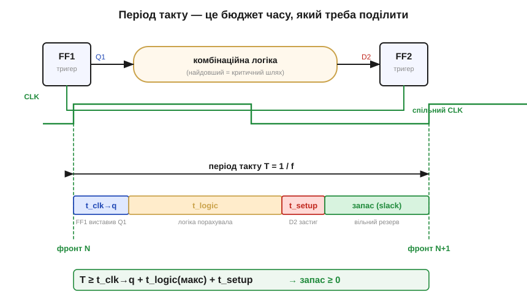
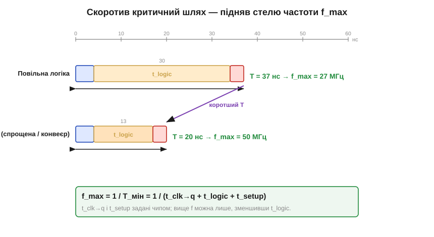
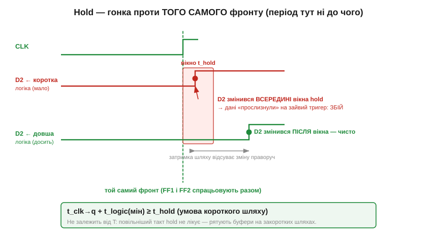

# 🧮 Бюджет таймінгу: t_setup, t_hold, t_clk-to-q — звідки береться межа частоти

> Числовий бік таймінгу синхронної схеми. Тригерові потрібне вікно **setup/hold** довкола фронту, а період [тактового сигналу](topic:hw-digital/clock-signal) мусить вмістити **критичний шлях** логіки. Зведемо це в одну формулу: складемо **три** іменовані затримки в бюджет періоду, дістанемо звідти **максимальну частоту** f_max — і покажемо другу, тихішу межу, про яку легко забути.

### Три затримки, з яких складено цифрову схему

Уявімо звичну картину синхронної схеми: дані біжать від одного тригера (FF1) крізь комбінаційну логіку до наступного (FF2), і обидва тактуються спільним фронтом [тактового сигналу](topic:hw-digital/clock-signal). На цьому шляху живуть рівно три характерні часи — їх ви знайдете в кожному даташиті тригера:

- **t_clk→q** (*clock-to-Q delay*) — затримка від фронту такту до того, як вихід Q тригера справді встановить нове значення. Тригер реагує не миттєво: фронт прийшов — і лише за t_clk→q на виході з'являється свіже Q.
- **t_setup** (*setup time*, t_su) — на скільки **раніше** за фронт вхід D мусить застигнути, щоб тригер устиг його чисто захопити.
- **t_hold** (*hold time*, t_h) — скільки D мусить **триматися** стабільним **після** фронту, поки внутрішня петля «замкнеться».

Перші два разом і задають стелю частоти; третій відповідає за окрему пастку.

### Інтуїція: період такту — це бюджет, який треба поділити

Уявімо період такту T як фіксовану «кишеню» часу між двома фронтами — і подивімося, що мусить у неї вміститися. Після фронту N тригер FF1 спершу витрачає t_clk→q, поки виставить нове Q. Тоді сигнал повзе крізь логіку — найдовший такий шлях звуть **критичним**, і його затримка t_logic. А ще до приходу фронту N+1 результат мусить застигнути на вході FF2 за t_setup. Усе це має вкластися в один період — інакше FF2 захопить «сире», недолічене значення.


*Період T поділено між трьома затримками плюс **запас** (*slack*). FF1 виставляє Q за t_clk→q, логіка рахує t_logic, дані застигають за t_setup до наступного фронту — а вільний резерв (зелений) і є slack. Поки вся смуга вкладається в T (slack ≥ 0), захоплення чисте; «з'їси» весь запас — фронт N+1 прийде, поки логіка ще рахує.*

### Апарат: нерівність бюджету й формула f_max

Запишемо бюджет одним рядком. Щоб дані гарантовано встигли від FF1 до FF2 за один такт, період мусить покрити суму трьох доданків:

```
T  ≥  t_clk→q  +  t_logic(макс)  +  t_setup
```

Різниця між наявним періодом і цією сумою — це **запас** (slack), міра «наскільки ще не пізно»:

```
slack  =  T − ( t_clk→q + t_logic + t_setup )   ≥  0.
```

Найкоротший припустимий період — коли запас зведено до нуля; його обернена величина і є максимальна тактова частота:

```
T_мін   =  t_clk→q + t_logic + t_setup
f_max   =  1 / T_мін
```

Ось і вся «межа частоти», тепер уже числом. Порахуймо на круглих значеннях.

**Приклад (звідки беруться мегагерци).** Нехай t_clk→q = 4 нс, t_setup = 3 нс, а критичний шлях логіки t_logic = 30 нс.

```
T_мін = 4 + 30 + 3      = 37 нс
f_max = 1 / 37 нс       ≈ 27 МГц
```

Двадцять сім мегагерц — і ні на герц більше, хоч який точний кварц поставиш. Зверніть увагу, **що** саме обмежує: t_clk→q і t_setup задані чипом, їх не зменшити, тож єдина ручка — критичний шлях. Спростимо логіку (або розіб'ємо її на коротші ділянки — це [конвеєр](topic:hw-arch/pipeline)) і вкоротімо t_logic до 13 нс:

```
T_мін = 4 + 13 + 3      = 20 нс
f_max = 1 / 20 нс       = 50 МГц
```

Та сама схема, та сама технологія — а стеля майже вдвічі вища, бо ми вкоротили найдовший шлях.


*Два бюджети в одному масштабі: t_clk→q і t_setup незмінні, змінюється лише t_logic. Повільна логіка (30 нс) дає T = 37 нс і f_max ≈ 27 МГц; швидша (13 нс) — T = 20 нс і 50 МГц. Підняти частоту — означає **відрізати** від середнього сегмента, t_logic.*

### Друга межа: hold і «закороткий» шлях

Доти йшлося про шлях **надто довгий** — він обмежує максимум частоти. Та є й протилежна біда: шлях **надто короткий**. Тут на сцену виходить третій час, t_hold. Дані, що FF1 виставив на цьому ж фронті, не повинні добігти крізь логіку до FF2 **занадто рано** — поки ще триває вікно hold того **самого** фронту. Інакше FF2 побачить, як вхід смикнувся всередині свого hold-вікна, і дані «прослизнуть» на зайвий щабель — той самий збій синхронності, що виникає й за [перекосу тактового сигналу](topic:hw-digital/clock-signal).


*Проти **того самого** фронту тригери спрацьовують разом. Якщо логіка надто коротка (червоне), нова Q1 добігає до D2 ще всередині вікна t_hold — збій. Досить довгий шлях (зелене) відсуває зміну за вікно — чисто. Період T тут ні до чого: повільніший такт hold **не лікує**.*

Формально це окрема нерівність — уже на **мінімальний** шлях, не на максимальний:

```
t_clk→q  +  t_logic(мін)  ≥  t_hold.
```

І головна її особливість: у ній **немає T**. Setup-межу можна полагодити, сповільнивши такт; hold-межу — ні, бо вона стосується одного фронту, а не проміжку між фронтами. Ліки інші: на підозріло коротких шляхах навмисно **додають затримку** — буфер чи пару інверторів, — щоб дані добігали вже поза вікном hold.

### Навіщо це на практиці

Ці два рядки — кістяк усієї часової дисципліни синхронної схеми. Setup-нерівність робить числом «ручку швидкості»: коли в даташиті ESP32 стоїть «240 МГц», за цим — порахований бюджет, у який цілий ланцюг «t_clk→q + логіка + t_setup» втиснуто менш ніж у ~4.2 нс періоду. Hold-нерівність пояснює, чому самого «повільнішого такту» іноді мало, і чому інструменти проєктування цифрових схем перевіряють **обидві** межі. А обидві разом — це кількісний бік метастабільності: там, де таймінг дотримано (slack ≥ 0 і hold виконано), дані застигають вчасно, і метастабільності всередині синхронного домену просто немає звідки взятися.
