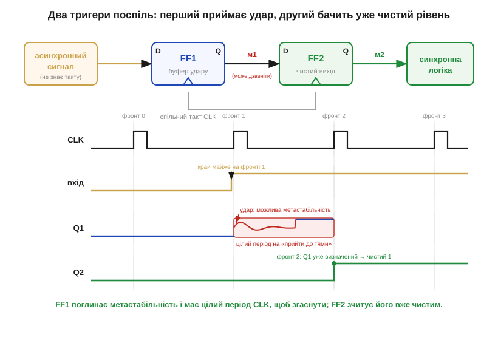
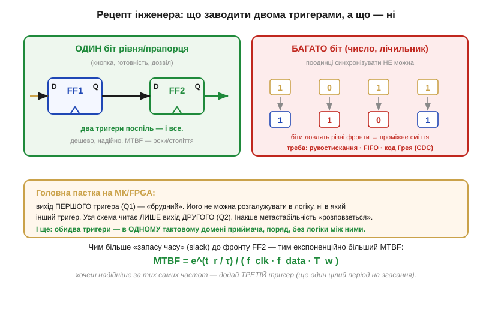

# ⚙️ Двотригерний синхронізатор: як безпечно завести асинхронний сигнал у тактову область

Будь-який **асинхронний** вхід — кнопку, лінію від іншого чипа, сигнал з чужого тактового домену — не можна заводити в синхронну логіку напряму: рано чи пізно він зміниться на фронті й уведе тригер у метастабільність. Перетворимо це на **робочий рецепт**: що саме поставити на вході, як це виглядає в прошивці й HDL і де чигають пастки, коли ви робите це на справжньому мікроконтролері чи FPGA.

### Задача

Дано: сигнал, що змінюється **коли заманеться**, без жодного зв'язку з нашим тактом (*clock*, CLK). Треба: завести його значення в нашу синхронну схему так, щоб уся подальша логіка бачила **чистий** 0 або 1 — ніколи не «щось посередині». Повністю прибрати ризик метастабільності не можна, тож реальна мета скромніша й чесніша: зробити збій настільки рідкісним, щоб середній час між випадками (*MTBF*) вимірювався роками чи століттями — далеко за межами строку служби пристрою.

### Ідея

Не **боротися** з метастабільністю, а дати їй **час розсмоктатися**. Ставимо два тригери (*flip-flops*) поспіль, обидва — на **нашому** такті. Перший ловить чужий сигнал і інколи зависає; але до того, як його зчитає другий тригер, минає **цілий період** CLK — досить, щоб «дзвін» згаснув у певний 0 чи 1. Другий тригер бачить уже визначений рівень і віддає його логіці чистим.


*Угорі — потік даних: асинхронний сигнал → FF1 → FF2 → логіка, обидва тригери на спільному CLK. Унизу — час: вхід міняється майже точно на **першому фронті**, тож FF1 на цьому фронті може зависнути (червона зона «дзвону»). Але він має **весь період** до **другого фронту**, щоб згаснути, — і на другому фронті FF2 зчитує вже чистий рівень. Перший тригер приймає удар; другий бачить порядок.*

### Реалізація

В апаратному описі синхронізатор — це буквально два регістри, що щотакту зсувають значення далі. Ось він на Verilog:

```verilog
// Синхронізатор живе в тактовому домені приймача (CLK).
// Атрибут ASYNC_REG підказує синтезатору тримати обидва тригери
// поряд, щоб метастабільність мала повний період на згасання.
module synchronizer (
    input  wire clk,        // такт приймача
    input  wire async_in,   // асинхронний вхід (кнопка, чужий домен)
    output wire clean_out   // визначений рівень для логіки
);
    (* ASYNC_REG = "TRUE" *) reg ff1, ff2;

    always @(posedge clk) begin
        ff1 <= async_in;    // 1-й щабель: може стати метастабільним
        ff2 <= ff1;         // 2-й щабель: за період ff1 уже згас
    end

    assign clean_out = ff2; // ТІЛЬКИ це віддаємо логіці
endmodule
```

Хитрість — у **неблокувальних** присвоєннях (`<=`): на фронті обидва тригери оновлюються «одночасно» зі **старих** значень, тож `ff2` бере те, що було в `ff1` **до** фронту. Саме звідси й береться той цілий такт затримки, за який зависання першого щабля встигає згаснути.

На мікроконтролері «два тригери» вам зазвичай дарує **сама периферія**: цифрові входи GPIO й лінії захоплення часто вже мають вбудований синхронізатор на тактовій частоті. Та коли ви читаєте швидку зовнішню лінію або міст між двома незалежними тактовими доменами всередині кристала, дворівневий ланцюг роблять явно — у залізі за наведеним модулем, або, для повільних подій, повторним зчитуванням у прошивці:

```c
#include <stdint.h>

#define EXT_PIN 4        // GPIO, до якого під'єднано асинхронну лінію

// read_pin() повертає рівень входу (0 або 1) на вашій платформі.
extern uint8_t read_pin(int pin);

// Викликати періодично — з циклу опитування чи таймерного переривання.
// Повертає «вистояний» через два знімки рівень; саме з ним працює логіка.
uint8_t sync_read(void) {
    static uint8_t ff1 = 0, ff2 = 0;
    ff2 = ff1;                  // 2-й щабель: попередній знімок зсувається далі
    ff1 = read_pin(EXT_PIN);    // 1-й щабель: свіжий знімок входу
    return ff2;
}
```

Порядок рядків тут не випадковий: `ff2` бере **попереднє** значення `ff1` **до** того, як `ff1` оновиться свіжим знімком. Так у послідовному коді відтворюється та сама «одночасність» щаблів, що в залізі дають неблокувальні присвоєння.

### Складність і пастки на МК

Сам прийом коштує копійки — два тригери (або два байти стану) і один такт затримки. Платиш ти не ресурсами, а **увагою**: майже всі провали тут — не від браку елементів, а від недогляду в підключенні.


*Ліворуч (зелене) — для **одного** біта рівня двох тригерів досить. Праворуч (червоне) — **багатобітне** число так синхронізувати не можна: окремі біти ловлять різні фронти й дають проміжне сміття. Унизу — головна пастка: вихід **першого** тригера «брудний», його не можна розгалужувати; уся схема читає лише вихід **другого**. І важіль MTBF: більший запас часу — експоненційно надійніше.*

Чотири граблі, на які наступають найчастіше:

**Один біт, не число.** Два тригери рятують **рівень одного** дроту. Багатобітну величину — лічильник, координату, слово даних — так не передаси: біти «приїдуть» у різні такти, і логіка спіймає безглузде проміжне значення. Для переходу між тактовими доменами (*CDC, clock-domain crossing*) потрібен **протокол**: рукостискання (*handshake*), черга **FIFO** або код **Грея** (*Gray code*), де між сусідніми значеннями міняється лише один біт.

**Не розгалужуй перший тригер.** Вихід FF1 — потенційно метастабільний; якщо завести його **в кілька місць** одразу (у логіку «зрізати кут» або в інший тригер), кожен «спостерігач» може вирішити по-різному, і метастабільність **розповзеться** по схемі. Правило просте: FF1 живить **лише** FF2, а вся решта читає **тільки** FF2.

**Обидва тригери — поряд і в одному домені.** Між FF1 і FF2 не можна вставляти комбінаційну логіку: вона з'їдає той самий запас часу (*slack*), за який метастабільність має згаснути. Обидва — на одному CLK приймача, поряд (у FPGA для цього є спеціальні атрибути синтезу).

**Два тригери — не завжди досить.** MTBF залежить не лише від кількості щаблів, а й від частоти, запасу часу, технології, температури й напруги. За високої частоти чи малого slack ставлять **третій** тригер — ще один цілий період на згасання робить MTBF як завгодно великим. І пам'ятайте: синхронізатор прибирає метастабільність, але **не** прибирає [**брязкіт** контактів](root:hw-digital/contact-debounce) — механічне «торохтіння» кнопки лишається задачею фільтрації, а не синхронізації. Це дві різні обережності зі світом, що не знає нашого такту, і потрібні вони обидві.
