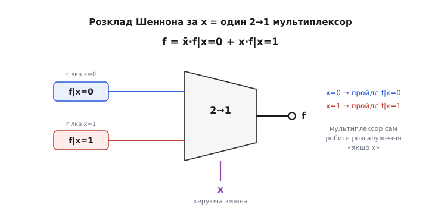
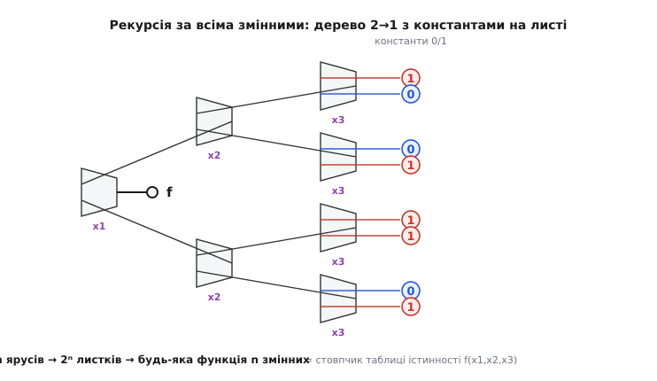

# 🧮 Канонічна форма через мультиплексор: розклад Шеннона

Є твердження, яке спершу звучить надто сильно, щоб бути правдою: **будь-яку** логічну функцію — хоч найзаплутанішу, з десятком змінних і купою «і», «або», «не» — можна побудувати з самих лише мультиплексорів, не додавши жодного вентиля обчислення. Мультиплексор не рахує суму, не порівнює, не інвертує в звичному сенсі — він тільки **вибирає один вхід із багатьох за адресою**. І все ж цього вибору досить, щоб відтворити геть усе, що вміє булева алгебра. Не приблизно, не «майже», а точно, будь-що.

Це не фокус і не гра слів. За цим стоїть одна проста тотожність, яку варто зрозуміти до кісток, бо вона лежить в основі того, чому програмована логіка (FPGA) взагалі можлива, чому таблиця відповідей еквівалентна схемі з вентилів, і чому мультиплексор — не просто зручна деталь, а **функційно повний будівельний блок**. Розберімо її від першопричини: спершу побачимо саму тотожність очима, тоді доведемо, що вона дає повноту, а насамкінець порахуємо, чим за цю універсальність платять.

## Одна змінна: розгалуження «якщо»

Почнімо з найдрібнішого й найочевиднішого. Візьми будь-яку логічну функцію — назвемо її f — яка залежить від кількох двійкових змінних. Вибери серед них одну, скажімо x, і подивись на неї окремо від решти. У будь-який момент x або дорівнює 0, або дорівнює 1 — третього не дано. То розгляньмо ці два випадки нарізно.

**Коли x = 0**, функція f перетворюється на щось простіше: у неї підставили конкретне значення однієї зі змінних, тож лишилася функція від **решти** змінних. Позначмо її `f|x=0` — «f, у якій x зафіксовано нулем». **Коли x = 1** — так само виходить функція від решти змінних, уже інша, позначмо її `f|x=1`. Ці два «зрізи» називають **кофакторами** (від лат. *co-* «спільно» + *factor* «чинник»: те, що множиться поряд): негативний кофактор `f|x=0` і позитивний `f|x=1`.

Тепер ключова думка. Уся інформація про f стосовно змінної x повністю вичерпується цими двома зрізами: якщо ми знаємо, чим стає f при x = 0 і чим — при x = 1, ми знаємо про залежність від x **усе**. Лишається тільки з'єднати обидва випадки в один запис. І ось як це робиться:

```
f  =  x̄·(f|x=0)  +  x·(f|x=1)
```

Прочитаймо це очима, бо тут уся суть. Доданок `x̄·(f|x=0)`: множник x̄ (тобто «не x») дорівнює 1 рівно тоді, коли x = 0, і дорівнює 0, коли x = 1. Отже цей доданок **живий** (пропускає `f|x=0`) лише при x = 0, а при x = 1 занулюється весь. Дзеркально доданок `x·(f|x=1)` живий лише при x = 1. Оскільки x не може бути 0 і 1 одночасно, у будь-яку мить активний **рівно один** доданок, а другий — чистий нуль. Складання «+» тут не рахує нічого хитрого: воно просто дає той єдиний доданок, що не занулився.

Перевірмо підстановкою, як завжди варто. Хай x = 0: тоді x̄ = 1, x = 0, і вираз дає `1·(f|x=0) + 0·(f|x=1) = f|x=0` — саме те, чим f і є при x = 0. Хай x = 1: маємо `0·(f|x=0) + 1·(f|x=1) = f|x=1`. Тотожність справджується в обох випадках, а інших випадків для двійкового x немає — отже вона правдива завжди. Це і є **розклад за однією змінною**: будь-яку функцію можна розписати як вибір між двома простішими залежно від однієї змінної.

> 🔧 **Навіщо це.** Цей запис — не абстракція, а **буквальна інструкція для мультиплексора**. Придивись іще раз: `f = x̄·(f|x=0) + x·(f|x=1)` — це **точно** формула 2→1 мультиплексора `Y = D0·S̄ + D1·S`, слово в слово, якщо покласти адресу S = x, вхід D0 = `f|x=0`, вхід D1 = `f|x=1`. Тобто розклад за змінною **фізично є** одним 2→1 мультиплексором, керованим цією змінною. Змінна x не «обчислюється» — вона стає **керуючою лінією**, що вирішує, який із двох зрізів пустити на вихід.


*Ліворуч — два кофактори f|x=0 і f|x=1 (те, чим стає функція при кожному значенні x). Знизу керуюча змінна x заходить як адреса. Мультиплексор сам робить розгалуження «якщо x=0 бери верхній зріз, якщо x=1 — нижній». Змінна не рахується — вона перемикає.*

Ось чому мультиплексор так природно виражає логіку: сам собою він **уже є** оператором «якщо». Будь-яка функція, розглянута через одну зі своїх змінних, розпадається на «якщо ця змінна 0 — одне, якщо 1 — інше», а це рівно те, що робить 2→1. Тотожність лише проговорює вголос те, що мультиплексор робить залізом.

## Хто це насправді придумав

Цю тотожність у літературі з цифрової техніки майже завжди звуть **розкладом Шеннона** (англ. *Shannon expansion, Shannon decomposition*), і це ім'я варто одразу поставити на місце, бо історія тут повчальна.

Сам розклад — не Шеннонів. Його ввів **Джордж Буль** (George Boole, англійський математик і логік) ще 1854 року в праці «Дослідження законів мислення» (*An Investigation of the Laws of Thought*), як Твердження II, дослівно назване «Розкласти чи розвинути функцію, що містить будь-яке число логічних символів». Буль і логіки XIX століття користувалися ним широко — задовго до появи будь-якої електроніки. Тому строго тотожність зветься **теоремою розкладу Буля** (*Boole's expansion theorem*), і її нерідко називають фундаментальною теоремою булевої алгебри.

Внесок **Клода Шеннона** (Claude Elwood Shannon, американський інженер і математик) інший, але теж реальний: він показав **схемну** інтерпретацію цієї тотожності — як вона читається на релейних і перемикальних мережах. У праці 1949 року «Синтез двоконтактних перемикальних схем» (*The Synthesis of Two-Terminal Switching Circuits*) він застосував розклад до побудови схем; іще раніше, у знаменитій магістерській роботі 1938 року, він заклав саму мову «булева алгебра = перемикальні схеми», де такі розклади й стали інструментом синтезу. Тобто Шеннон не **відкрив** тотожність — він переклав її з мови чистої логіки на мову залізо-схем, і саме тому вона зрослася з його ім'ям у інженерній традиції.

Статус доказовості тут ясний і усталений: тотожність — **Булева** (1854, документовано в його ж книзі), схемне прочитання — **Шеннонове** (1938–1949). Приписувати сам розклад Шеннону як винахідникові — поширена, але **історично неточна** атрибуція; чесно казати «теорема Буля, у схемному вигляді за Шенноном». Ім'я «розклад Шеннона» лишилося як данина інженерній зручності, а не як твердження про першість.

## Рекурсія: від однієї змінної до всіх

Одна тотожність — одна змінна — один 2→1. Але функція має не одну змінну, а n штук. Що робити з рештою? Відповідь красива: **те саме, ще раз**. Розклад можна застосувати рекурсивно, і саме тут із дрібної тотожності виростає повнота.

Ми розклали f за x і дістали два кофактори — `f|x=0` і `f|x=1`. Але кожен із них — теж логічна функція, лише вже від **менших** змінних (x у них зафіксовано). Отже до кожного можна застосувати той самий розклад — тепер за другою змінною, скажімо y:

```
f|x=0  =  ȳ·(f|x=0,y=0)  +  y·(f|x=0,y=1)
f|x=1  =  ȳ·(f|x=1,y=0)  +  y·(f|x=1,y=1)
```

Кожен кофактор став двома **меншими** кофакторами. Підставивши обидва рядки назад у розклад за x, дістаємо f, виражену через **чотири** зрізи — по одному на кожну комбінацію (x, y). У схемному вигляді це вже дерево: один 2→1 на вершині (керує x), під ним два 2→1 (обидва керують y), а на їхні входи заходять чотири кофактори.

Далі — очевидно. Кожен із чотирьох кофакторів іще залежить від решти змінних, тож розкладаємо за третьою, за четвертою… За кожним кроком число зрізів подвоюється, а число «вільних» змінних у кожному зрізі меншає на одну. Процес неминуче спиниться, коли змінних не лишиться зовсім: після розкладу за **всіма** n змінними кожен зрізок — це f, у якої зафіксовано **всі** входи, тобто просто **число**, 0 або 1. Це і є значення функції для однієї конкретної комбінації входів — один рядок таблиці істинності.

Порахуймо, скільки таких листків. Кожна з n змінних подвоює їх число, тож усього виходить **2ⁿ** листків — рівно стільки, скільки рядків у таблиці істинності функції n змінних. І кожен листок — константа, взята прямо з відповідної клітинки таблиці:

```
n змінних  →  розклад за кожною  →  2ⁿ зрізів-констант  →  2ⁿ→1 мультиплексор
```


*Корінь керується x1, наступний ярус — x2, третій — x3; кожен ярус з'їдає одну змінну. Після трьох ярусів вільних змінних не лишається, тож на восьми входах-листках сидять самі константи 0/1 — це рівно стовпчик значень таблиці істинності f(x1, x2, x3). Дерево з n ярусів має 2ⁿ листків і відтворює будь-яку функцію n змінних.*

Ось де ховається доведення повноти, і воно виходить майже само. Ми взяли **довільну** функцію — жодних припущень про неї, крім того, що вона логічна й від n двійкових змінних. Механічним розкладом ми звели її до дерева самих 2→1 мультиплексорів, на листках якого — тільки константи 0 і 1. Жодного вентиля обчислення при цьому не знадобилося: ані «і», ані «або», ані інвертора — сама структура мультиплексорів і два числа на входах. Оскільки функція була **будь-яка**, а звести вдалося **завжди**, висновок неминучий: **мультиплексор із константами на входах відтворює будь-яку логічну функцію**. Це і означає, що мультиплексор — **функційно повний** будівельний блок.

> 🔧 **Навіщо це.** Саме на цьому тримається вся програмована логіка. У кристалі FPGA немає наперед розведених вентилів під твою конкретну схему — у ньому тисячі однакових крихітних комірок, і в кожній сидить маленька **таблиця відповідей** (LUT, *lookup table*), яку читає мультиплексор: змінні заходять як адреса, а в клітинках лежать заздалегідь завантажені константи 0/1. Теорема розкладу гарантує, що такою таблицею можна задати **будь-яку** функцію потрібного числа входів. Тому «запрограмувати FPGA» — це, на найнижчому рівні, **розкласти твою логіку за змінними й записати листки-константи в пам'ять кожної комірки**. Механізм цього докладніше показано в [мультиплексорі як обчислювачі функції](topic:hw-digital/multiplexer/proj-mux-lut-c.md).

Варто одразу зняти можливе непорозуміння з інверсією. «Мультиплексор не інвертує» — і все ж повнота включає й функцію-заперечення. Секрет у тому, що інверсія теж сидить у листках-константах: щоб дістати «НЕ x», беремо 2→1, керований x, і кладемо на входи не змінні, а **константи** — на вхід «x=0» ставимо 1, на вхід «x=1» ставимо 0. Тоді при x=0 вихід дасть 1, при x=1 дасть 0 — це рівно `x̄`. Заперечення не робиться операцією над сигналом; воно **закодоване порядком констант** на входах. Ту саму дрібницю видно й на фігурі: різні стовпчики констант на листках дають різні функції тих самих змінних.

## Мова мінітермів: та сама повнота, записана сумою

Дерево розкладу — це погляд «згори вниз»: беремо функцію й дробимо її. Є дзеркальний погляд «знизу вгору», який дає ту саму повноту одним рядком і прямо пояснює формулу мультиплексора з основної статті. Він оперує **мінітермами**.

**Мінітерм** (англ. *minterm*, «мінімальний доданок») — це добуток **усіх** керуючих змінних, кожної рівно раз, або прямо, або з інверсією. Для двох змінних S1, S0 таких добутків чотири:

```
m0 = S̄1·S̄0      (дорівнює 1 лише при S1S0 = 00)
m1 = S̄1·S0       (лише при 01)
m2 = S1·S̄0       (лише при 10)
m3 = S1·S0        (лише при 11)
```

Кожен мінітерм — це **детектор однієї адреси**: він дорівнює 1 рівно для тієї єдиної комбінації змінних, що відповідає його номеру, і 0 для всіх інших. Перевір на m2 = S1·S̄0: щоб добуток був 1, треба S1 = 1 **і** S̄0 = 1 (тобто S0 = 0), а це саме комбінація 10 — номер два. Жодна інша комбінація його не «запалить». Мінітерми — то виміряні по клітинках прапорці: у будь-яку мить піднятий рівно один, той, чий номер збігся з поточною адресою.

Тепер вихід мультиплексора з n адресними лініями записується так — і це той самий вираз, що в статті про мультиплексор, лише названий на ім'я:

```
Y  =  Σ Dᵢ · mᵢ       (сума за всіма i від 0 до 2ⁿ−1)
```

Читається прозоро: кожен вхід даних Dᵢ помножено на свій мінітерм-детектор mᵢ. Оскільки в будь-яку мить рівно один мінітерм дорівнює 1, а решта — 0, у сумі виживає **рівно один** доданок — той Dᵢ, чия адреса зараз на лініях вибору. Решта доданків занулені множенням на 0. Тому вихід дорівнює саме тому входу, який ти адресував, і нічому іншому.

Розпишімо для 4→1, щоб побачити збіг зі статтею повністю:

```
Y = D0·S̄1·S̄0 + D1·S̄1·S0 + D2·S1·S̄0 + D3·S1·S0
```

Це не нова формула — це `Y = Σ Dᵢ·mᵢ`, у якій мінітерми виписані явно. Кожен доданок стереже свою адресу; активний завжди один. Зв'язок із розкладом Шеннона тут прямий: якщо в цю суму підставити замість Dᵢ не довільні входи, а **значення функції** для відповідної комбінації (тобто клітинки таблиці істинності), дістанемо саме той листковий запис, до якого приводить рекурсивний розклад. Сума мінітермів і дерево розкладу — два записи однієї істини, з різних кінців.

> 🔧 **Навіщо це.** Форма `Y = Σ Dᵢ·mᵢ` пояснює, чому мультиплексор **не спотворює** дані ані на біт. Над самими Dᵢ не виконують жодної логічної операції — їх лише множать на 0 (відрізати) або 1 (пропустити як є). Обраний вхід доходить до виходу **дослівно**, байт у байт. Саме тому мультиплексором ведуть не тільки логічні рівні, а й цілі шини даних: маршрутизація не псує вміст, бо мінітерм — це чиста засувка, а не обчислювач.

## Дешифратор плюс «АБО»: та сама сума, розкладена на дві деталі

Формула `Y = Σ Dᵢ·mᵢ` не лише описує поведінку — вона диктує **внутрішню будову** мультиплексора, і робить це в дві чіткі частини. Придивімося, з чого складається сума.

Спершу треба, з адреси S1…Sn, дістати **всі мінітерми** mᵢ — усі детектори адрес, з яких рівно один буде піднятий. Вузол, що з набору адресних бітів формує 2ⁿ ліній, і в кожен момент запалює рівно одну з них, — це [дешифратор адреси](topic:hw-arch/address-decoding): він «розшифровує» двійковий номер у позиційний «одна лінія з багатьох». Кожен його вихід — це рівно один мінітерм mᵢ. Дешифратор робить першу половину формули: обчислює всі mᵢ й піднімає той, чия адреса зараз активна.

Далі кожен мінітерм множиться на свій Dᵢ (вентиль «І»: пропускає Dᵢ, лише якщо його мінітерм піднятий), а всі добутки складаються (велике «АБО»). Оскільки піднятий один мінітерм, «АБО» збирає рівно той Dᵢ, що йому відповідає. Отже:

```
мультиплексор  =  дешифратор адреси  +  вентилі «І» (по одному на вхід)  +  велике «АБО»
```

Це не метафора, а буквальний розклад формули на залізо: `Σ` — то велике «АБО», кожне `Dᵢ·mᵢ` — то «І», а весь набір `mᵢ` — то дешифратор. Тому мультиплексор і кажуть «дешифратор, за яким іде АБО-збирач»: перша частина вибирає рядок за адресою, друга виводить те, що на обраному рядку стоїть. Ця пара — дешифратор і збирач — і є та сама сума мінітермів, лише розкладена на два впізнавані вузли.

## Ціна універсальності: глибина дерева й затримка

Повнота — прекрасна, але не безкоштовна. Розклад за всіма змінними дає **2ⁿ→1** мультиплексор, а число входів росте **вибухово** з числом змінних: функція від 4 змінних — це 16→1, від 6 — уже 64→1, від 10 — 1024 входи. Пряма таблиця для десятка змінних непідйомна. Тому на практиці розкладають не до кінця, а лише за **частиною** змінних (кількома верхніми ярусами), а на входи листків подають не голі константи, а **простіші функції** решти змінних, зібрані вже з вентилів. Розклад Шеннона тут — інструмент **дроблення** великої задачі на менші, керовані кількома змінними; це стандартний хід у синтезі логіки й у розкладанні функції по LUT-ах FPGA.

Друга ціна — **затримка**. Коли великий мультиплексор збирають деревом із дрібних (бо 2ⁿ→1 у кремнії часто й є дерево 2→1), сигнал іде від листка до кореня крізь **усі яруси** по черзі. А ярусів рівно стільки, скільки адресних бітів: n. Кожен ярус додає свою невелику затримку перемикання t, і повний шлях від входу до виходу набігає пропорційно **глибині дерева**:

```
глибина дерева  =  n  =  log₂(число входів)
затримка (грубо)  ≈  n · t_ярус
```

**Оцінка затримки 8→1 дерева.** Хай кожен ярус 2→1 додає близько 0.2 нс на перемикання. 8→1 — це три адресні біти, тобто три яруси дерева (2³ = 8):

```
n = log₂ 8 = 3 яруси
t ≈ 3 · 0.2 нс = 0.6 нс від входу до виходу
```

Для 16→1 буде чотири яруси (≈ 0.8 нс), для 64→1 — шість (≈ 1.2 нс). Затримка росте **логарифмічно** від числа входів — повільно, і це добра новина: подвоїти число входів коштує лише **одного** зайвого ярусу. Логарифм — найкращий закон росту, на який тут можна сподіватися: щоб розрізнити 2ⁿ речей, треба щонайменше n двійкових рішень, а дерево якраз і робить по одному рішенню на ярус.

> 🔧 **Навіщо це.** Ця логарифмічна глибина — причина, чому широкий вибір роблять **деревом**, а не «пласким» одноярусним мультиплексором на гігантському «АБО». Пласке «АБО» на 64 входи — це один вентиль із 64 входами, фізично повільний і ненажерливий; дерево ж розбиває той самий вибір на 6 акуратних ярусів по два входи. Коли в даташиті бачиш затримку «propagation delay» мультиплексора, вона майже завжди росте саме як log₂ від числа каналів — бо всередині сидить дерево, і рахунок ярусів = рахунок адресних бітів. Практичний висновок: якщо критичний шлях у схемі впирається в широкий мультиплексор, зменшуй **не число входів даних, а число ярусів** — розбивай вибір розумніше, а не грубіше.

## Що з цього виходить

Ми почали з майже неймовірного твердження й дійшли до того, чому воно мусить бути правдою. Ланцюг короткий і надійний. Будь-яка функція, розглянута через одну свою змінну, розпадається надвоє — на два кофактори — і це розпадання **фізично є** одним 2→1 мультиплексором, керованим тією змінною: `f = x̄·f|x=0 + x·f|x=1`. Кофактори — теж функції, тож розклад повторюють за кожною змінною, аж поки не лишиться жодної; тоді на всіх 2ⁿ листках стоять самі константи з таблиці істинності. Отже будь-яку функцію відтворює дерево мультиплексорів із числами на входах — а це і є **функційна повнота** мультиплексора. Той самий факт із іншого кінця — сума мінітермів `Y = Σ Dᵢ·mᵢ`, що прямо кладеться на залізо як дешифратор плюс «АБО». Платня за універсальність — вибухове число входів (тому на практиці розкладають лише частково) і глибина дерева, що дає затримку, пропорційну числу адресних бітів, тобто log₂ входів.

Головне, що варто винести: мультиплексор виглядає скромним «перемикачем джерел», але за цим ховається повноцінний **обчислювач будь-якої логіки**, і місток між двома цими ролями — рівно одна тотожність Буля, прочитана як схема. Змінна, подана на адресу, перестає бути «даними для обчислення» й стає **вибором гілки**; а вся булева алгебра, виявляється, — це дерево таких виборів із константами на самому дні.
