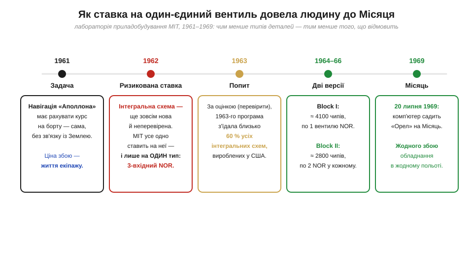
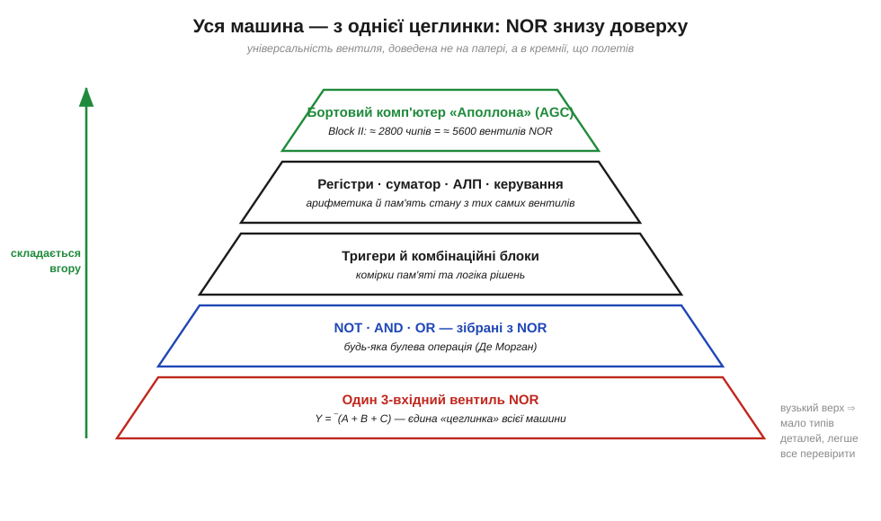
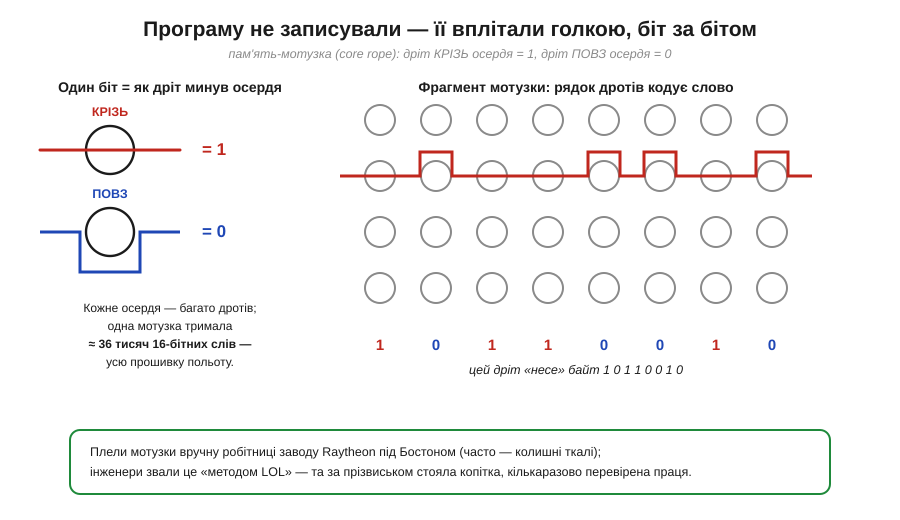

# 📜 Комп'ютер «Аполлона» з одного вентиля: NOR, що літав на Місяць

> Є на папері дивовижна річ: одного-єдиного типу вентиля — [NAND **або** NOR](root:hw-digital/nand-nor) — досить, щоб побудувати геть усю логіку. Звучить як математична витонченість, гарна, та ніби абстрактна. Ця історія — про те, як та сама властивість одного дня перестала бути красивою теоремою й буквально **полетіла на Місяць**: бортовий комп'ютер, що садив астронавтів на чужий світ, інженери свідомо склали майже цілком з одного типу вентиля — 3-вхідного NOR. Тут абстрактна «функціональна повнота» з підручника обернулася питанням життя і смерті — і дала на нього інженерну відповідь.

Розповімо всю історію по-людськи — навіщо взагалі йти на таку крайність і що з того вийшло. А почати варто з простого запитання, що його поставили перед собою конструктори на початку 1960-х і яке не має нічого спільного з елегантністю формул.

*Логіка цілого рішення на одній стрічці. Перед лабораторією приладобудування MIT постала задача (рахувати навігацію на борту, без зв'язку із Землею, ціною життя екіпажу), і вони пішли на подвійну сміливість: довірилися щойно винайденій інтегральній схемі — та ще й звели всю логіку до **одного** її типу, 3-вхідного NOR. Наслідки видно праворуч: шалений попит на чипи, дві версії машини (Block I — по одному NOR у чипі, Block II — по два) і, зрештою, посадка на Місяць без жодного збою обладнання в польоті.*

## Задача, у якій помилка коштує життя

Уявімо умову, яку треба було розв'язати. Корабель летить до Місяця. Радіосигнал від Землі йде туди понад секунду, стільки ж назад, а в найгостріші хвилини — гальмування, стикування, посадка — рішення треба ухвалювати **негайно** і на самому борту. Отже, кораблю потрібен власний обчислювач: він має тримати курс, рахувати, куди й коли ввімкнути двигун, керувати орієнтацією — і робити це **безвідмовно**, бо за пультом сидять живі люди, а другої спроби не буде.

Тепер додаймо контекст епохи. Надворі початок 1960-х. Транзистор іще молодий, а **інтегральна схема** (*integrated circuit*, IC) — той самий чип, де кілька транзисторів живуть на одній кремнієвій пластинці, — щойно народилася: їй буквально кілька років, її майже ніхто не випробував у серйозній справі, і чи можна на неї покладатися — велике питання. Зібрати з такої новинки мозок пілотованого космічного корабля — крок, на який мало хто наважився б.

І тут конструктори зробили хід, що на перший погляд суперечить здоровому глузду. Замість того щоб підстрахуватися перевіреними деталями, вони пішли на **подвійний** ризик: довірилися новісінькій інтегральній схемі — та ще й вирішили будувати всю логіку машини **з одного-єдиного типу** цих схем. Один тип чипа на весь комп'ютер. Звідки така зухвалість — і до чого тут саме NOR?

> 🔧 **Навіщо це.** Тримайте цю сцену в голові щоразу, коли читаєте холодне «NAND/NOR функціонально повні». За цією формулою стоїть конкретний інженерний вибір під шаленим тиском: не «як зробити найкрасивіше», а «як зробити так, щоб **не вбити людей**». Універсальність одного вентиля тут — не прикраса, а інструмент керування ризиком. І це найчастіший контекст, у якому абстрактні властивості логіки стають важливими насправді.

## Чому саме один тип вентиля: менше деталей — менше біди

Відповідь криється в самій природі надійності. Інженерне правило просте до банальності: **що менше в системі різних типів деталей, то менше способів для неї зламатися**. Кожен новий тип компонента — це окрема фізика відмов, окремий процес виготовлення зі своїми дефектами, окремий план випробувань, окремий ризик, що десь у партії проскочить брак. Десять різних мікросхем — це десять окремих «фронтів», які треба втримати. А один-єдиний тип — це **один** фронт, на якому можна зосередити всю інженерну прискіпливість світу.

Ось де [теорема про функціональну повноту](root:hw-digital/nand-nor) раптом стає золотою. NOR **сам по собі** будує і NOT, і AND, і OR — а отже, будь-яку логіку взагалі. Тобто можна, у принципі, викинути всю «зоологію» вентилів і лишити **один**. У звичайній наземній електроніці так зазвичай не роблять: там зручніше мати під рукою повний асортимент, бо «прямий» AND там, де він потрібен, економить вентилі. Та коли на шальках терезів — людські життя, рівняння переписується. Заради надійності інженери свідомо погодилися на «зайві» вентилі (адже AND із самих NOR — це кілька NOR замість одного), щоб виграти головне: **звести весь логічний мозок машини до одного, до дрібниць вивченого й випробуваного компонента**.

Цю ідею добре видно, якщо подивитися, як машина «росте» вгору з єдиної цеглинки.

*Та сама універсальність, але вже як інженерна реальність, а не вправа. Унизу — єдина «цеглинка»: 3-вхідний NOR, Y = ‾(A + B + C). З нього (за [законами Де Моргана](root:math-logic/boolean-algebra)) складають NOT, AND, OR; з них — тригери й комбінаційні блоки; далі — регістри, суматор, пристрій керування; а на самій вершині — цілий бортовий комп'ютер. Що вище, то вужча піраміда типів деталей: на весь цей поверх логіки припадає по суті **один** вид логічного елемента. Саме ця вузькість угорі й означала: менше того, що може відмовити, і простіше все перевірити.*

Зверніть увагу на форму піраміди: догори вона **звужується** не за кількістю елементів (їх якраз тисячі), а за кількістю **типів**. Складність машини величезна, але вся вона зведена до повторення однієї простої, наскрізь вивченої деталі. Це і є практичний сенс «функціональної повноти» NOR: не «дивіться, як гарно», а «дивіться, як **надійно** — нам досить досконало знати лише один вентиль».

## Ставка на щойно винайдений чип

Лишалося втілити цю ідею в кремнії — і тут історія робиться по-справжньому ризикованою. Розробку машини, що дістала назву **бортовий комп'ютер „Аполлона“** (*Apollo Guidance Computer*, AGC), вела **лабораторія приладобудування Массачусетського технологічного інституту** (MIT Instrumentation Laboratory) під орудою **Чарльза Старка Дрейпера** (*Charles Stark Draper*); апаратну частину очолював інженер **Елдон Голл** (*Eldon C. Hall*). Саме команді Голла належить сміливе рішення поставити на інтегральну схему тоді, коли індустрія ще їй не довіряла.

Сміливість була не на словах. Усередині кожен чип реалізовував **3-вхідний вентиль NOR** на так званій **резисторно-транзисторній логіці** (*resistor-transistor logic*, RTL) — найпростішому на той час способі зробити вентиль на кількох транзисторах і резисторах. У ранній версії машини (Block I) у корпусі сидів **один** такий NOR; у пізнішій, льотній версії (Block II) — **два** NOR в одному корпусі. Перші партії цих мікросхем робила компанія **Fairchild Semiconductor** (та сама колиска майбутньої Кремнієвої долини), а далі, коли пішло справжнє серійне виробництво, основним постачальником чипів для комп'ютерів «Аполлона» став ліцензований за тим самим проєктом завод **Philco** (*Philco*, згодом Philco-Ford). Тобто весь логічний мозок машини спирався на **один** тип мікросхеми, що його випускали за єдиним добре відпрацьованим кресленням.

Опір цій ідеї був серйозний. Авторитетні голоси радили не ризикувати й доручити комп'ютер традиційнішим виконавцям; лунали прямі сумніви, чи витримає система MIT вимоги місії. Команда відповіла не суперечкою, а випробуваннями: чипи ганяли в **жорстоких** умовах — температура, вібрація, забруднення, — і якщо в партії відмовляв бодай один, **бракували всю партію**. Ставка, що здавалася авантюрою, виявилася далекоглядною: за всю програму **жоден** бортовий комп'ютер «Аполлона» — ні на командному модулі, ні на місячному — **не зазнав апаратного збою під час польоту**. Один ретельно випробуваний вентиль виявився надійнішим за повний асортимент «солідніших» деталей.

> 🔧 **Навіщо це.** Ось чому [NAND/NOR](root:hw-digital/nand-nor) — не екзотика, а **фундамент** реальних мікросхем. «Аполлон» довів цю думку до межі: ціла машина на одному вентилі — і вона працює бездоганно там, де ціна помилки максимальна. Коли наступного разу проєктуватимете щось відповідальне, згадайте цей принцип «звести все до одного перевіреного блоку»: він універсальний — від NOR «Аполлона» до уніфікованих модулів у будь-якій надійній системі.

## Скільки коштувала ця ставка: чип, якого на всіх не вистачало

У цієї відваги була ціна — і вона добре показує, наскільки масштабним для свого часу був цей замовник. Машина потребувала тисяч однакових чипів: у льотному Block II їх було близько **2800** (по два NOR у кожному — тобто ≈ 5600 вентилів), а в ранішому Block I — близько **4100** (по одному NOR на корпус). Для індустрії, де інтегральна схема ще вчора була лабораторною дивиною, це виявилося колосальним апетитом.

Наслідок добре відомий історикам техніки. За поширеною оцінкою, **1963 року програма „Аполлон“ поглинала близько 60 % усіх інтегральних схем, що вироблялися у США** *(перевірити: точне формулювання й база відсотка різняться між джерелами — десь ідеться про частку від загального випуску ІС, десь про конкретні типи RTL-логіки; сам факт надзвичайно великої частки засвідчений надійно, конкретні 60 % варто подавати як оцінку, а не як точну цифру)*. Попит був такий, що навіть Fairchild насилу встигав його закривати. Тобто новонароджена індустрія мікросхем зробила величезний стрибок дорослішання значною мірою **на гроші й під вимоги космічної програми**: масове, прискіпливе до якості замовлення змусило виробників навчитися робити чипи надійно й багато — а це згодом здешевило їх для всіх. Ставка MIT на «недозрілу» технологію не просто спрацювала — вона, по суті, **підштовхнула** дозрівання цілої галузі.

Тут варто бути чесними щодо атрибуції, як і всюди в цій книзі. «Аполлон» не винайшов ні інтегральну схему, ні вентиль NOR — він став їх **раннім масовим і дуже вимогливим споживачем**, і саме в цій ролі вплинув на історію. А самих по собі заслуг тут багато й вони **колективні**: винахід інтегральної схеми пов'язують насамперед із Джеком Кілбі (*Jack Kilby*, Texas Instruments) і Робертом Нойсом (*Robert Noyce*, Fairchild); серійні RTL-вентилі, на яких літав «Аполлон», виросли з роботи інженерів Fairchild; а сам комп'ютер — це праця великої команди MIT, а не одного героя. Велику справу, як завжди, робили багато людей.

## Програму не записували — її вплітали руками

Є в цій історії ще один бік, без якого вона була б неповна, — і він теж тримається на двійкових 0 і 1, тільки вже не в кремнії. Логіку машини склали з NOR; а ось **програму** для неї — траєкторії, формули наведення, послідовності посадки — зберігали зовсім дивовижно. Її **вплітали в пам'ять руками**, дріт за дротом.

Технологія називалася **пам'ять-мотузка** (*core rope memory*). Замість напівпровідникової мікросхеми тут — безліч крихітних феритових кілець (осердь) і дроти, протягнуті крізь них. Принцип кодування біта геніально простий: якщо дріт проходить **крізь** осердя — це 1, а якщо обминає його **повз** — це 0. Цілу програму, таким чином, у буквальному сенсі **прошивали** в матерію: маршрут кожного дроту відносно кожного кільця і **був** записаним бітом.

*Як виглядав «запис» програми. Ліворуч — кодування одного біта: дріт **крізь** феритове осердя означає 1, дріт **повз** — 0. Праворуч — фрагмент мотузки: один протягнутий дріт «несе» цілу послідовність бітів залежно від того, які кільця він пронизав, а які обійшов (тут — байт 1 0 1 1 0 0 1 0). Одна така мотузка вміщувала близько 36 тисяч 16-бітних слів — усю прошивку польоту. Унизу — те, про що варто сказати окремо: цю роботу робили **руки** конкретних людей.*

І ось тут — найважливіша й найповчальніша деталь, яку легко проґавити. Цю пам'ять не друкувала машина — її **ткали вручну** робітниці на заводі **Raytheon** під Бостоном, багато з яких раніше працювали на текстильних фабриках і мали натреновану на тонку ручну роботу вправність. Помилишся однією петлею — і біт неправильний, а виправити вже зіткану мотузку годі: часто доводилося починати спочатку. Тож кожну мотузку перевіряли й перевіряли по кілька разів.

> 🔧 **Навіщо це.** Зверніть увагу, як глибоко сюди проникають ті самі 0 і 1, що з ними працювали ще [Джордж Буль](root:math-logic/boolean-algebra/hist-boole.md) і [Клод Шеннон](root:hw-digital/why-digital/hist-shannon.md). У логіці двійка втілилася як «крізь чи повз вентиль NOR», у пам'яті — як «крізь чи повз феритове кільце». Одна й та сама абстрактна двійковість — то напруга, то напрямок дроту. Це чудово показує, чому весь курс крутиться навколо біта: він байдужий до носія й однаково природно лягає і в кремній, і в зіткану руками мотузку.

Про цих людей варто сказати точно, бо тут легко піти за зручним міфом. Інженери MIT між собою називали цей спосіб «методом LOL» — від англійського *Little Old Ladies*, «маленькі літні пані»; прізвисько було приязне, але водночас применшувало складність праці. Сучасні історики техніки слушно зауважують: прізвисько «маленькі пані» не лише поблажливе, а й **затирає** внесок багатьох жінок, зокрема жінок іншого кольору шкіри, які теж виконували цю надточну роботу. Тут важливо не сплутати дві різні речі: пам'ять-мотузку **ткали** робітниці Raytheon у Массачусетсі, а от **складанням самих мікросхем** на іншому етапі займалися, серед інших, жінки народу навахо на заводі Fairchild у Шипроку (*Shiprock*, Нью-Мексико) — це окрема операція, окреме місце й окремі люди. І там, і там за технічним тріумфом стоїть копітка, висококваліфікована ручна праця конкретних людей, яку довго лишали в тіні. Згадати їх — частина чесної історії цієї машини.

## Що з цього лишилося нам

Усе зводиться до однієї теореми: одного NOR досить, щоб скласти будь-яку логіку. Сама собою вона виглядає як витончена абстракція. А історія «Аполлона» показала, у що ця абстракція здатна обернутися, коли по-справжньому **притисне**: один-єдиний, до дрібниць вивчений вентиль став мозком корабля, що довіз людей до Місяця й повернув назад — і зробив це без жодного збою обладнання. «Функціональна повнота» з підручника тут стала **стратегією виживання**.

І ще дві думки на дорогу. Перша: двійка — байдужа до носія. Ті самі 0 і 1, що в Буля випали з рівняння, у Шеннона лягли на реле, тут утілилися одразу двічі: у логіці як «крізь чи повз NOR», у пам'яті як «крізь чи повз кільце». Друга: великі справи **колективні**. За «комп'ютером „Аполлона“» стоять не одне ім'я, а команда Голла й Дрейпера в MIT, інженери Fairchild і Philco, ткалі Raytheon, складальниці чипів у Шипроку, винахідники самої інтегральної схеми — і ще багато людей, чий внесок історія часом залишала без підпису.
