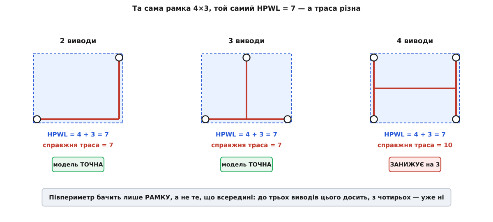
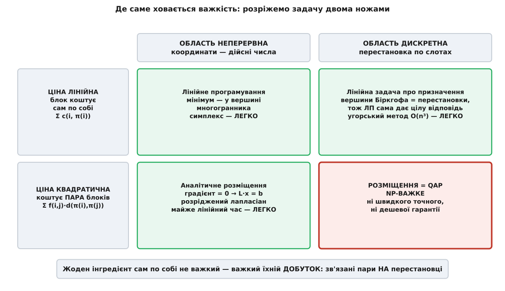
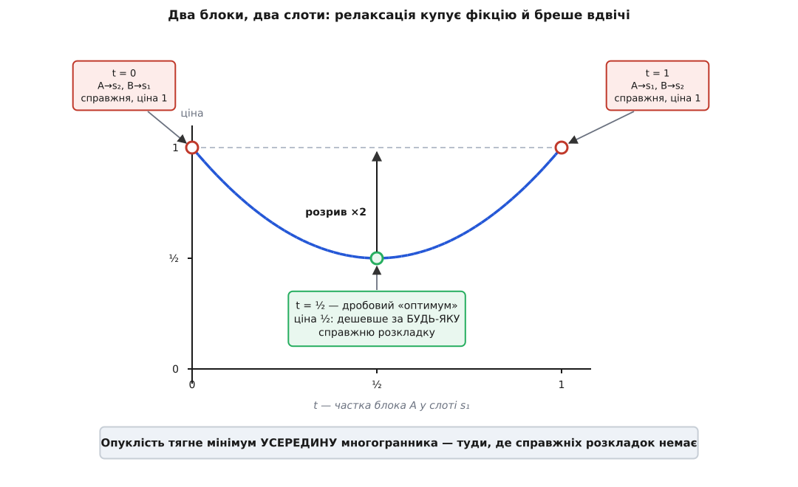

# 🧮 Ціна, перестановка й стіна: формальне ядро NP-важкості розміщення

Вирок «розміщення NP-важке» — це висновок. Зберімо машину, що його видає: означмо ціну так, щоб її можна було рахувати, назвімо об'єкт, по якому мінімізуємо, і — головне — знайдімо, **де саме** в цій конструкції сидить важкість.

Остання відповідь буде несподівана. Не у факторіалі: n! варіантів має й сортування, а сортуємо ми швидко. І навіть не в самій формулі ціни: її мінімум, як побачимо, береться майже за лінійний час. Важкість народжується на **стику** двох цілком безневинних складників — і саме цей стик доведеться покласти під мікроскоп.

## Ціна: що саме ми мінімізуємо

Позначмо. Список з'єднань — це пара H = (B, N): скінченна множина **блоків** B = {b₁, …, bₙ} і множина **сполук** N, де кожна сполука e ∈ N — підмножина блоків, які треба з'єднати одним дротом (елементи e — її **виводи**, їх щонайменше два). Тканина — множина **слотів** S ⊂ ℤ², причому |S| = |B| = n. **Розміщення** — бієкція π: B → S.

Півпериметр рахують так: для сполуки e беруть координати всіх її блоків і обводять їх найменшою прямокутною рамкою.

```
HPWL(e, π) = (max xᵦ − min xᵦ) + (max yᵦ − min yᵦ)
              b∈e      b∈e        b∈e      b∈e

де (xᵦ, yᵦ) = π(b) — координати слота, у якому сидить блок b
```

Ціна розкладки — сума по сполуках, і саме її мінімізуємо:

```
HPWL(π) = Σ HPWL(e, π)  →  min по всіх бієкціях π: B → S
         e∈N
```

Тепер чесне питання: чому саме **півпериметр**? Це ж не довжина дроту, а розмір рамки навколо виводів — дріт усередині рамки ще ніхто не проклав. Відповідь у тому, що для малих сполук це не оцінка, а **точне значення**. Найкоротша прямокутна траса, що з'єднує виводи (прямокутне мінімальне дерево Штайнера, англ. *rectilinear Steiner minimal tree*, RSMT), для сполук із **двома й трьома** виводами має довжину рівно в півпериметр обгортної рамки. З чотирьох виводів HPWL стає **нижньою межею**: справжня траса буває довша (усталено).


*Одна рамка, три різні правди. У всіх трьох випадках обгортна рамка однакова — 4×3, тож HPWL = 7 однаковий. Але справжня найкоротша траса дорівнює семи лише в перших двох: із чотирма виводами вона коштує 10, і модель занижує ціну на три. Півпериметр бачить рамку, а не те, що всередині — до трьох виводів цього досить, далі вже ні.*

**Приклад: одна рамка, три різні траси.** Порахуймо все на клітинках.

```
Скрізь обгортна рамка 4 × 3  →  HPWL = 4 + 3 = 7

2 виводи: (0,0) і (4,3)
  траса-«коліно»: 4 праворуч + 3 угору                  = 7    ✓ = HPWL

3 виводи: (0,0), (4,0), (2,3)
  горизонталь y=0 (4) + вертикаль x=2 від y=0 до y=3 (3) = 7    ✓ = HPWL

4 виводи: (0,0), (4,0), (0,3), (4,3)
  вертикаль x=0 (3) + вертикаль x=4 (3) + перемичка (4)  = 10   ✗ > 7
```

Отже, HPWL — не «приблизна довжина дроту», а точна нижня межа, яка збігається з правдою на переважній більшості сполук (двовивідних у реальних схемах — більшість) і чесно недобирає на широких. Її беруть не тому, що вона добра, а тому, що вона **найдешевша з чесних**: рахується за один прохід по виводах, тоді як RSMT для великої сполуки — сама собі важка задача.

> 🔧 **Навіщо це.** Ціль оптимізації — не риторика, а те єдине, що алгоритм справді робить. HPWL обирають, бо кожен хід відпалу міняє ціну лише кількох сполук, і дельту видно за мікросекунди; візьміть за ціну справжню трасу — і кожен із мільйонів ходів вимагатиме будувати дерева Штайнера. Ціна платиться там, де модель бреше: широка сполука на десятки виводів здається розміщувачу дешевшою, ніж є, і він недостатньо старанно її стягує. Тому промислові інструменти домножують HPWL широких сполук на поправкові коефіцієнти — латають рівно ту діру, яку видно на правій панелі малюнка.

## Квадратична модель і чому квадрат

Поруч із HPWL живе друга модель ціни. Кожній парі блоків i, j припишімо вагу wᵢⱼ ≥ 0 (наскільки міцно їх в'яже дріт) і напишімо:

```
Q(π) = Σ wᵢⱼ · ( (xᵢ − xⱼ)² + (yᵢ − yⱼ)² )
      i<j
```

Навіщо квадрат, коли дріт міряють манхеттенською відстанню |xᵢ − xⱼ| + |yᵢ − yⱼ|? Річ у гладкості. Модуль має злам у нулі: у точці xᵢ = xⱼ похідної не існує, і жоден метод, що спирається на градієнт, там не працює. Квадрат гладкий усюди, а його похідна — лінійна. І ця дрібна на вигляд заміна дає наслідок, від якого перевертається вся картина.

## Перший сюрприз: сама ціна — легка

Відпустімо на мить вимогу «кожен блок у своєму слоті» й дозвольмо блокам мати **будь-які дійсні** координати. Візьмімо похідну Q по координаті xᵢ і прирівняймо до нуля:

```
∂Q/∂xᵢ = 2 · Σ wᵢⱼ · (xᵢ − xⱼ) = 0
             j
```

Читаємо, що це означає: у мінімумі кожен блок сидить у **зваженому середньому своїх сусідів**. Зберімо всі n рівнянь разом — і вони складуться в лінійну систему з **лапласіаном** графа:

```
L · x = 0,   де L = D − W
  W — матриця ваг wᵢⱼ
  D — діагональна, Dᵢᵢ = Σ wᵢⱼ (сума ваг, що чіпляються до блока i)
                          j
```

Матриця L розріджена (у рядку стільки ненулів, скільки в блока сусідів), симетрична й додатно напіввизначена. Такі системи розв'язують спряженими градієнтами чи розрідженим розкладом Холецького — на практиці за майже лінійний час. **Мінімум квадратичної ціни береться майже миттєво.**

І тут-таки видно, чому цього замало. Система L·x = 0 має очевидний розв'язок: усі xᵢ однакові. Без додаткових умов «найкраща» розкладка — звалити всі блоки в одну точку, довжина дроту нуль. Закріпімо частину блоків (у справжньому кристалі це виводи-контакти по краю, чиї координати задані наперед) і розділімо змінні на вільні (f) та закріплені (p):

```
L_ff · x_f = − L_fp · x_p = b
```

Тепер L_ff додатно визначена, розв'язок єдиний, і його справді знаходять за майже лінійний час. Але подивімося, що вийшло: блоки посідали в точках-середніх — по кілька в одній клітині, крізь одне одного. Це не розкладка. Це хмара.

Запам'ятаймо результат, бо він перевертає картину: **у цільовій функції важкості немає**. Ні в HPWL, ні в квадратичній моделі — мінімум обох береться швидко. Важкість десь-інде.

## Об'єкт: перестановка й форма Купманса–Бекмана

Занумеруймо слоти числами 1…n. Тоді розміщення — це просто **перестановка** π ∈ Sₙ, а ціна набуває канонічного вигляду:

```
cost(π) = Σ fᵢⱼ · d(π(i), π(j))  →  min по π ∈ Sₙ
         i<j

  fᵢⱼ    — «потік» між блоками i та j (скільки дроту їх в'яже)
  d(k,l) — відстань між слотами k та l (манхеттенська на сітці)
```

Потік × відстань, підсумовані по всіх парах. Це **квадратична задача про призначення** у формі Купманса–Бекмана. Через матриці її пишуть іще коротше: якщо X — матриця перестановки (xᵢₖ = 1, коли блок i сидить у слоті k), F — матриця потоків, D — матриця відстаней, то

```
cost(X) = tr( F · X · D · Xᵀ )  →  min по матрицях перестановки X
```

Праця, де ця форма з'явилася, — Купманс і Бекман, «Assignment problems and the location of economic activities», Econometrica 25(1), 1957, с. 53–76 (усталено). Варто помітити, як саме вона побудована, бо це рівно наша тема. Автори поставили **дві** задачі про розселення виробництв. Перша **нехтувала** вартістю перевезень між виробництвами — і виявилася задачею лінійного програмування з системою рент, що підтримує оптимум: усе розв'язується, усе красиво. Друга **врахувала** вартість перевезень між виробництвами — і, як обережно сказано в самій праці, вносить ускладнення, що потребують марудних і майже недосліджених обчислень. Тобто стіну намацали 1957 року, за чотирнадцять років до того, як у теорії складності з'явилося слово, щоб її назвати. І намацали рівно там, де вона стоїть: щойно ціна почала залежати від **пар**, лінійне програмування скінчилося.

Загальнішу форму дав Лоулер (Management Science 9(4), 1963, с. 586–599): він дозволив ціні залежати від четвірки індексів, cᵢⱼₖₗ — «блок i у слоті k разом із блоком j у слоті l коштує стільки-то», — і закріпив за задачею її нинішнє ім'я (усталено).

## Де ховається важкість: розріжемо задачу двома ножами

Тепер у нас є все, щоб локалізувати важкість. У задачі рівно два підозрювані: **зв'язок пар** у ціні й **дискретність** області. Візьмімо по ножу на кожного.

**Ніж перший: приберімо зв'язок пар, лишімо перестановку.** Хай ціна кожного блока залежить тільки від його власного слота, а не від сусідів:

```
cost(π) = Σ c(i, π(i))
          i
```

Це **лінійна задача про призначення**, і вона розв'язується точно й швидко. Про [угорський метод](topic:sf-algorithms/hungarian-algorithm) варто знати лише те, що він дає **гарантований оптимум** такої задачі за O(n³) — тобто на n у мільйон разів більшому за nug30 він відпрацював би на ноутбуці. Дискретність сама собою нікому не заважає.

**Ніж другий: лишімо зв'язок пар, приберімо дискретність.** Тоді градієнт квадратичної ціни дає систему L·x = b — майже лінійний час. Квадратичність сама собою теж нікому не заважає.

**А тепер обидва разом** — і задача стає NP-важкою.


*Розріжемо задачу двома ножами. По горизонталі — область: неперервні координати чи перестановка по слотах. По вертикалі — ціна: чи залежить вона від блока окремо, чи від пари блоків. Три клітини з чотирьох легкі, і кожна має свій добре відомий швидкий метод. Важка рівно одна — та, де зв'язані пари накладено на перестановку. Жоден інгредієнт сам собою не важкий; важкий їхній добуток.*

Ось точна локалізація важкості. Не «варіантів багато» (їх багато й у трьох легких клітинах: перестановок у лінійному призначенні рівно стільки ж, n!). Не «ціна квадратична» (у неперервному світі це навіть зручно). Важко саме те, що вибір слота для блока A **міняє найкращий вибір** для блока B, і водночас вибирати доводиться з дискретної множини, де не можна зробити «пів-кроку в бік».

## Чому релаксація не рятує: многогранник Біркгофа

Природна думка: якщо дискретність заважає, послабмо її — розв'яжімо задачу в неперервному світі, а тоді округлімо. Так роблять усюди, і саме так найчастіше й перемагають NP-важкі задачі на практиці. Подивімося, чому тут цей прийом ламається — і чому ламається саме він.

Замінімо матрицю перестановки на **двічі стохастичну**: невід'ємні числа, де кожен рядок і кожен стовпець дають у сумі одиницю. Такі матриці утворюють опуклий многогранник — **многогранник Біркгофа** Bₙ. Ключова його властивість: **вершини Bₙ — це рівно матриці перестановок**. Твердження зазвичай звуть теоремою Біркгофа–фон Неймана (Ґаррет Біркгоф, 1946; незалежно Джон фон Нейман, 1953), хоча рівносильні результати дістали раніше — Ернст Штайніц у дисертації 1894 року й угорський математик Денеш Кеніг 1916-го, мовою парувань у дводольних графах (усталено).

Ця геометрія і є прихованою причиною, чому лінійне призначення легке. Мінімізуємо лінійну функцію ⟨C, X⟩ на многограннику — це лінійне програмування, а лінійна функція завжди досягає мінімуму **у вершині**. Вершини ж тут — самі перестановки. Тобто релаксація дає **цілу відповідь задарма**: округляти нема чого, оптимум ЛП уже є законною відповіддю. Угорський метод не має щастя — він має геометрію.

А тепер зробімо те саме з квадратичною ціною.

**Приклад: два блоки, два слоти — і релаксація вже бреше вдвічі.** Найменший екземпляр, який узагалі можна побудувати.

```
Дано: блоки A, B; одна сполука A–B, потік f = 1
      слоти s₁ = (0,0), s₂ = (1,0)
      відстані: d(s₁,s₂) = d(s₂,s₁) = 1,  d(s₁,s₁) = d(s₂,s₂) = 0

Справжніх розкладок рівно дві (2! = 2):
  π₁: A→s₁, B→s₂  →  ціна = f · d(s₁,s₂) = 1 · 1 = 1
  π₂: A→s₂, B→s₁  →  ціна = f · d(s₂,s₁) = 1 · 1 = 1
  Справжній оптимум = 1.

Релаксуймо. Двічі стохастична матриця 2×2 має рівно один вільний
параметр t ∈ [0,1] (xₐ,₁ = «наскільки блок A у слоті s₁»):

  xₐ,₁ = t        xₐ,₂ = 1−t
  x_B,₁ = 1−t     x_B,₂ = t
  рядки:   t + (1−t) = 1 ✓      стовпці: t + (1−t) = 1 ✓

Ціна релаксації — сума по ВСІХ парах слотів:

  Q(t) = Σ xₐ,ₖ · x_B,ₗ · d(sₖ, sₗ)
        k,l
       = xₐ,₁·x_B,₁·d(s₁,s₁) = t·(1−t)·0     = 0
       + xₐ,₁·x_B,₂·d(s₁,s₂) = t·t·1         = t²
       + xₐ,₂·x_B,₁·d(s₂,s₁) = (1−t)·(1−t)·1 = (1−t)²
       + xₐ,₂·x_B,₂·d(s₂,s₂) = (1−t)·t·0     = 0

  Q(t) = t² + (1−t)²

Звіряємо на вершинах:
  Q(1) = 1 + 0 = 1   ✓ це π₁
  Q(0) = 0 + 1 = 1   ✓ це π₂
А тепер усередині:
  Q(½) = ¼ + ¼ = ½   ← удвічі дешевше за БУДЬ-ЯКУ справжню розкладку
```

Звідки взялася знижка? Подивімося на два доданки, що при t = ½ дали нулі: це випадки, коли **обидва блоки опинилися в одному слоті** — відстань нуль, ціна нуль. При t = ½ рівно половина ймовірнісної маси йде саме на них. Справжня розкладка так не вміє: два блоки в одну клітину не влазять, і це забороняє саме означення бієкції. А двічі стохастичній матриці ніхто не забороняв — «пів-A і пів-B у слоті s₁» для неї цілком законна точка. Релаксація **купує фікцію** й показує ціну, якої фізично не існує.


*Відрізок між двома єдиними справжніми розкладками — і провал посередині. Кінці відрізка (t = 0 і t = 1) — вершини многогранника Біркгофа, тобто справжні перестановки, обидві ціною 1. Дробова точка t = ½ коштує ½ — удвічі менше, ніж узагалі можливо, бо купує неіснуючий світ, де половину часу обидва блоки сидять в одному слоті. Опуклість, усюди в оптимізації благо, тут відриває мінімум від вершин — а тільки у вершинах живуть відповіді.*

Чи не можна залатати релаксацію? Подивімося на природу функції. Ціна релаксації — квадратична форма від елементів X, а її матриця других похідних (гессіан) будується з кронекерового добутку F ⊗ D, чиї власні значення — усі попарні добутки λᵢ(F)·μⱼ(D). Далі двома рядками:

```
F і D симетричні, з НУЛЯМИ на діагоналі
  (блок не в'яжеться сам із собою; слот не віддалений сам від себе)

⟹ tr F = Σ λᵢ(F) = 0,   але   Σ λᵢ(F)² = ‖F‖² > 0
           i                    i
⟹ серед λᵢ(F) є і додатні, і від'ємні.  Те саме для D.
⟹ серед добутків λᵢ(F)·μⱼ(D) неминуче є обох знаків.
```

Гессіан **невизначений** — і це вирок будь-якій надії розв'язати релаксацію «як звичайну оптимізацію». Розгляньмо всі три можливості; знадобиться лише те, що [опукла функція має єдиний глобальний мінімум](topic:math-analysis/convex-functions), а ввігнута — навпаки, притискає мінімум до краю області.

- Якби форма була **опуклою**, мінімум брався б швидко — але сідав би **всередину** многогранника, як у прикладі з двома блоками, і ми діставали б лише нижню межу з розривом. (Парабола t² + (1−t)² на нашому відрізку саме опукла — тому мінімум і втік у t = ½.)
- Якби форма була **ввігнутою**, мінімум сів би **у вершині**, тобто був би справжньою перестановкою — точність задарма. Але мінімізувати ввігнуту квадратичну функцію на многограннику **саме собою NP-важко**: Пардалос і Вавасіс (Journal of Global Optimization 1, 1991, с. 15–22) показали, що досить **одного** від'ємного власного значення, аби задача стала NP-важкою, тоді як суто опуклий випадок розв'язується за поліноміальний час (усталено).
- Насправді форма невизначена — тобто немає ні швидкого розв'язання, ні гарантії вершини. Гірший із двох світів.

Ось чому релаксація тут не рятує, і це не невезіння, а структура: **або мінімум легко знайти, але він не там, де відповіді; або він там, де відповіді, але знайти його важко.**

## Зведення: від розрізання графа до кремнію

Щоб узагалі говорити мовою NP, задачу треба поставити як питання з відповіддю «так/ні».

**РОЗМІЩЕННЯ-РІШЕННЯ.** Дано список з'єднань H, множину слотів S і ціле K. Чи існує розміщення π із HPWL(π) ≤ K?

Ця задача **в NP**: сертифікат — сама перестановка π, а перевірка — один прохід по сполуках із пошуком мін/макс координат, тобто O(Σ|e|). Ті поняття, на яких тут усе тримається, — [класи P і NP та зведення](topic:computability/np-completeness) — зводяться до трьох тверджень: P — задачі, розв'язні за поліноміальний час; NP — задачі, де готову відповідь можна швидко **перевірити**; зведення A ≤ₚ B означає, що екземпляр A можна швидко переписати як екземпляр B, а отже B не легша за A. NP-важка задача — не легша за **жодну** задачу з NP.

Тепер сама важкість. Ось задача, від якої вестимемо зведення:

**MinLA (мінімальне лінійне впорядкування).** Дано граф G = (V, E), |V| = n. Знайти бієкцію φ: V → {1, 2, …, n}, що мінімізує Σ по ребрах (u,v) ∈ E величини |φ(u) − φ(v)|.

**Зведення MinLA ≤ₚ РОЗМІЩЕННЯ.**

```
Дано екземпляр MinLA: граф G = (V, E), |V| = n.
Будуємо екземпляр розміщення:
  блоки   B = V
  слоти   S = { (1,0), (2,0), …, (n,0) }   — один ряд
  сполуки N = { {u,v} : (u,v) ∈ E }        — кожне ребро = двовивідна сполука

Для двовивідної сполуки {u,v} при розміщенні π:
  HPWL({u,v}, π) = |xᵤ − xᵥ| + |yᵤ − yᵥ|
                 = |xᵤ − xᵥ| + 0            (усі слоти в ряду: y ≡ 0)

Позначмо φ(v) = x-координата слота π(v). Тоді φ — бієкція V → {1…n}, і

  HPWL(π) =  Σ  |φ(u) − φ(v)|  =  ціна MinLA для φ
          (u,v)∈E
```

Відповідність **точна**: не «приблизно», не «з точністю до сталої» — ціна розкладки дорівнює ціні впорядкування один в один, і кожній розкладці відповідає рівно одне впорядкування. Побудова забирає лінійний час. Отже, поліноміальний алгоритм для розміщення дав би поліноміальний алгоритм для MinLA.

А MinLA — NP-повна. Довели Ґері, Джонсон і Стокмаєр (Theoretical Computer Science 1(3), 1976, с. 237–267): у тій праці вони показали NP-повноту **простого максимального розрізу** (Simple Max Cut — розріз на графі без ваг), а NP-повнота оптимального лінійного впорядкування вийшла з неї **наслідком** (усталено). Ланцюжок замкнувся: виконуваність → простий максимальний розріз → лінійне впорядкування → розміщення. Укладати кремній важко, бо важко **розрізати граф**.

І тут варто назвати прямо місце, де такі доведення найчастіше тихо ламаються. Зведення зобов'язане видати **законний екземпляр цільової задачі**. Ми подали ряд із n слотів — і це законно рівно тоді, коли в означенні розміщення множина слотів S є **частиною входу**. Саме так ми її й означили, і це не хитрість заради доведення: справжні тканини не є рівними квадратами — колонки блоків пам'яті й помножувачів чергуються з колонками логіки, тож «слоти дано на вході» описує дійсність точніше, ніж «квадрат». Але якби ми **пришпилили** означення до квадратної сітки, ряд перестав би бути екземпляром — і зведення в наведеному вигляді стало б недійсним: довелося б будувати ґаджет, що заганяє блоки в один ряд. Для сітчастих варіантів важкість теж відома: Сахні й Бгатт (17-та конференція DAC, 1980) пройшлися набором задач автоматизації проєктування й показали, що більшість із них NP-важкі, а швидке наближення зі сталою відносною похибкою для них малоймовірне (усталено).

## Чому точні методи впираються в експоненту

Дві головні дороги до точного оптимуму — цілочислове програмування й метод гілок і меж. Обидві впираються в ту саму стіну, але з різних боків, і корисно побачити, з яких.

**Дорога перша: лінеаризувати.** Квадратичність заважає — приберімо її. Добуток двох двійкових змінних xᵢₖ·xⱼₗ можна замінити новою змінною yᵢⱼₖₗ, доклавши умов, які змушують її поводитися як добуток. Саме це зробив Лоулер 1963 року. Ціну фокуса видно одразу: змінних yᵢⱼₖₗ рівно стільки, скільки четвірок індексів — **n⁴**, і приблизно стільки ж додаткових умов (усталено).

```
n = 30:    30⁴ = 810 000 двійкових змінних
n = 100:   100⁴ = 10⁸
n = 1 000: 1000⁴ = 10¹²  ← лише щоб ЗАПИСАТИ задачу
```

Пізніші лінеаризації тиснуть цю гору: Кауфман і Брокс (1978) обходяться n² двійковими змінними, n² дійсними й n²+2n умовами — найощадливіше з відомого (усталено). Але дурних грошей не буває: найкомпактніша лінеаризація дає й **найслабшу** нижню межу. Це не збіг, а закон жанру — силу межі купують розміром запису.

**Дорога друга: гілки й межі.** Щоб відсікати гілки, потрібна **нижня межа**: оцінка знизу на ціну будь-якого добудовування часткового призначення. Класична — межа Гілмора–Лоулера (Гілмор, 1962; Лоулер, 1963): для кожної пари «блок i у слот k» внесок оцінюють оптимістично, розв'язуючи допоміжну лінійну задачу про призначення, а тоді ще одну, головну, вже над цими оцінками. Складність — O(n³), тобто дешево (усталено).

Але подивімося, **якою ціною** дається ця дешевизна. Лінійна задача про призначення — це рівно та задача, де **пар немає**: кожен блок оцінюється сам по собі. Отже, щоб порахувати межу швидко, довелося **розчепити пари** — викинути саме той зв'язок, який і робить задачу важкою. Межа виходить систематично оптимістична: вона оцінює світ, де кожен блок дістає свій найкращий варіант незалежно від сусідів, а такого світу немає. І що більше n, то більше пар, то більше зв'язку викинуто — розрив між межею й правдою росте разом із задачею. Це не здогад: межа Гілмора–Лоулера відома тим, що швидко псується зі зростанням n (усталено).

А слабка межа — смерть для гілок і меж. Відсікання працює, лише коли межа переконує: «ця гілка вже гірша за знайдене». Оптимістична межа не переконує майже ніколи, гілки не відсікаються, і дерево пошуку розповзається назад до тих самих n!, від яких метод мав урятувати. Ось точна відповідь на питання, чому точні методи впираються в експоненту: **не тому, що варіантів багато, а тому, що нема чим їх відкидати.**

**Приклад: скільки коштує n = 30.**

```
nug30 — екземпляр QAP на 30 об'єктів, поставлений 1968 року
(Нюджент, Фоллманн і Румл). Протримався нерозв'язаним 32 роки.

Розв'язали точно: 19 червня 2000 (Анстрайхер, Бріксіус, Ґу, Ліндерот)
  метод:         гілки й межі на обчислювальній ґратці (Condor / MW)
  машин:         у середньому 653, максимум 1007
  час:           6 діб 22 год 04 хв 31 с «за годинником»
  сумарно:       ≈ 11 процесорних років
  ефективність:  ≈ 92 % розпаралелювання

Для порівняння — простір повного перебору на тих самих 30 об'єктах:
  30! ≈ 2.65·10³²
```

Тридцять об'єктів. Одинадцять процесорних років, тисяча машин і найкращі на той час нижні межі — усе це, щоб **довести оптимальність** розкладки на тридцяти. Реальний кристал має мільйони.

**Але NP-важкість — не вирок конкретному екземпляру.** Тут варто зупинитися, бо саме це зі слова «NP-важка» виносять неправильно частіше за все. Задача комівояжера теж NP-важка — той самий статус, той самий клас. І все ж екземпляр pla85900 — **85 900** точок, узятий, до речі, з реального завдання проєктування схем — розв'язали точно, з доведеною оптимальністю (розв'язувач Concorde: Аппельґейт, Біксбі, Хватал і Кук, 2006; понад 136 процесорних років) (усталено).

Порівняймо: 85 900 проти 30. Однаковий клас складності, однаковий «вирок» — і різниця майже в три тисячі разів. Звідки?

Не з класу складності. Із **сили релаксації**. Лінійна релаксація комівояжера з відсіканнями (умови підциклів, гребінці) тримається до правди дуже близько — межа переконлива, дерево ріжеться нещадно. Релаксації ж QAP розчіплюють пари — і провалюються в розрив. NP-важкість каже: **у найгіршому випадку гарантії немає** — і жодного слова про те, чи піддасться ваш конкретний екземпляр. Чи піддасться — вирішує не клас, а те, чи знайшов хтось для цієї задачі міцну релаксацію. Для комівояжера знайшли. Для QAP — поки що ні.

**І про сам факторіал.** Його часто наводять як доказ важкості, а він не доказ — і це варто дорахувати до кінця. По-перше, частину варіантів можна викинути безкоштовно: квадратна сітка має 8 симетрій (чотири повороти × дзеркало — група D₄), тож різних розкладок насправді n!/8. Легше не стало: поділити 10³² на вісім — це не зменшити задачу, а округлити її. По-друге, порахуймо, скільки місця треба, щоб **записати** відповідь:

```
Формула Стірлінга:  n! ≈ √(2πn) · (n/e)ⁿ
                    log₂(n!) ≈ n · log₂(n/e)

n = 10⁶:  log₂(10⁶/e) = log₂(367 879) ≈ 18.5
          log₂(n!) ≈ 10⁶ · 18.5 ≈ 1.85·10⁷ біт ≈ 2.3 мегабайта
```

Два мегабайти — стільки треба, щоб назвати одну конкретну розкладку мільйона блоків. **Відповідь коротка.** Вихід не є проблемою; проблема — пошук. Простір важкий не тому, що відповідь довга, а тому, що ми не вміємо йти до неї, не блукаючи.

## Що саме заборонено наближати — і що ні

Найгостріше твердження про цю задачу звучить так: марно шукати не лише точний алгоритм, а й **дешеву гарантію**. Ось воно точно.

**Теорема (Сахні й Гонсалес, Journal of the ACM 23(3), 1976, с. 555–565, теорема 3.2).** QAP сильно NP-важка, і для будь-якого сталого ε > 0 існування поліноміального ε-наближеного алгоритму для QAP тягне P = NP (усталено).

Буквально: не можна мати швидкий алгоритм, який **обіцяє** «моя відповідь не гірша за (1+ε)·оптимум» — за жодного ε. Ні за один відсоток, ні за тисячу.

Розберімо **механізм**, бо він простіший, ніж здається, і вчить більшого за саме твердження. Побудуємо екземпляри QAP, де оптимум дорівнює **точно нулю** — і рівно тоді, коли в графі є гамільтонів цикл:

```
Дано граф G = (V, E), |V| = n. Питання: чи є в G гамільтонів цикл?

Будуємо QAP:
  потоки:   fᵢⱼ = 1, якщо i та j сусідні в циклі 1→2→…→n→1; інакше 0
  відстані: d(k,l) = 0, якщо (k,l) ∈ E;  інакше 1

Ціна перестановки π = Σ fᵢⱼ · d(π(i), π(j))
                     i<j
  = кількість пар, сусідніх у циклі, які π поклала на пару НЕ-ребер G

Отже:  ціна(π) = 0  ⟺  кожна сусідня в циклі пара лягла на ребро G
                    ⟺  π задає гамільтонів цикл у G
```

Тепер удар. Хай є алгоритм A з гарантією A(I) ≤ (1+ε)·OPT(I). Візьмімо екземпляр, де гамільтонів цикл **є**, тобто OPT = 0. Гарантія каже: A(I) ≤ (1+ε)·0 = **0**. Алгоритм **зобов'язаний** видати розв'язок ціни нуль — тобто знайти гамільтонів цикл. Швидко. А це NP-повна задача.

Ось і весь фокус: **множник безсилий проти нуля**. Будь-яка задача, де питання «чи дорівнює оптимум нулю?» саме собою NP-важке, автоматично не має наближення з **відносною** гарантією — глибокої математики для цього не треба зовсім.

**А тепер застереження, без якого це твердження переносять неправильно.** Подивімося ще раз на матрицю відстаней у доведенні: d(k,l) = 0 для **різних** місць k та l. Це не метрика — це матриця, підігнана під фокус із нулем. А відстані справжньої тканини манхеттенські на сітці: чесна метрика, де різні слоти віддалені **щонайменше на 1**. Отже, для зв'язного списку з'єднань оптимум **строго більший за нуль**, і фокусу з нулем просто нема за що вхопитися.

Тобто теорема Сахні–Гонсалеса, узята буквально, **не забороняє** наближати розміщення на сітці. Вона про QAP у загальному вигляді, з довільними матрицями. І що це не педантизм, а справжня діра, доводить наш власний окремий випадок: **MinLA — та сама одновимірна тінь розміщення, від якої ми вели зведення, — наближається**. Рао й Річа дали O(log n)-наближення; згодом Чарікар зі співавторами й, незалежно, Файґе й Лі підтягнули його до O(√(log n)·log log n), поєднавши напівозначене програмування з округленням Рао–Річі (усталено). Множник росте — але росте **повільно**, і це нескінченно далеко від «жодної гарантії».

Утім, лазівка вузька. PTAS для MinLA не існує, якщо тільки NP-повні задачі не розв'язуються за випадковий субекспоненційний час (Амбюль, Мастроліллі, Свенсон); а для природної напівозначеної релаксації MinLA знайдено розрив цілісності Ω(log log n) (Деванур, Кот, Сакет і Вішной, STOC 2006) (усталено).

І — головна іронія, заради якої все це варто було рахувати. Прикиньмо, чого варта та гарантія на справжньому кристалі:

```
n = 10⁶ блоків
√(log₂ n) · log₂(log₂ n) ≈ √19.93 · log₂(19.93) ≈ 4.47 · 4.32 ≈ 19
```

Приблизно **двадцятикратна** гарантія — та ще й із прихованою сталою зверху. Доведено-добрий алгоритм обіцяє розкладку, гіршу за оптимум разів у двадцять. Жоден інженер такого не візьме. А [імітація відпалу](topic:sf-algorithms/simulated-annealing), у якої гарантії **немає взагалі**, дає на практиці одиниці відсотків від найкращого відомого.

Отакий парадокс варто тримати в голові: алгоритми з гарантіями тут практично марні, а практично корисний алгоритм не має гарантій. Теорія складності відповідає на питання «що можна **обіцяти** в найгіршому випадку»; інженерія живе питанням «що виходить на **моїх** екземплярах». Це два різні питання, і плутати їх — найдорожча помилка в цій темі.

> 🔧 **Навіщо це.** З формального ядра практик виносить три речі, яких не видно з самого слова «NP-важка». Перше: **не вимагайте від інструмента доведеної оптимальності** — на тридцяти об'єктах це коштувало одинадцяти процесорних років, на ваших мільйонах не коштує нічого, бо неможливе. Друге: **не плутайте «NP-важка» з «безнадійна»** — комівояжера з 85 900 точок розв'язали точно; різницю робить не клас складності, а сила релаксації, тож питати треба не «який клас?», а «чи є для цієї задачі міцна нижня межа?». Третє: **не купуйтеся на гарантії** — навіть найкраща відома для одновимірного випадку обіцяє на мільйоні блоків двадцятикратний програш, тобто нічого не обіцяє; евристика без гарантій дасть вам відсотки.

## Де цей апарат працює

Розрізавши задачу двома ножами, ми не просто її класифікували — ми накреслили будову кожного сучасного розміщувача.

Подивімося ще раз на клітину «квадратична ціна × неперервна область»: мінімум береться за майже лінійний час, але блоки злипаються в хмару. Це не глухий кут — це **перший крок** аналітичного розміщення: розв'язати L·x = b, дістати хмару, а тоді **легалізувати** — розсунути блоки по слотах, зіпсувавши ціну якомога менше. Розробники не обходять наш аналіз; вони живуть точно за ним: беруть легку клітину таблиці й платять за повернення в важку.

Так само з іншим ножем. Межа Гілмора–Лоулера розчіплює пари, щоб рахуватися швидко, — і тому слабка. Імітація відпалу чинить навпаки: не бореться зі зв'язком пар і не викидає його, а **обходить** — рахує лише зміну ціни від перестановки двох слотів, зачіпаючи жменю сполук. Вона не намагається довести оптимальність; вона відмовляється від доведення й купує за це швидкість.

Обидва рішення — прямі наслідки того, що ми вивели: зв'язок пар не можна ні обчислити дешево, ні проігнорувати безкарно. Його можна тільки обходити — і вся інженерія розміщення є довгим переліком способів це робити.
