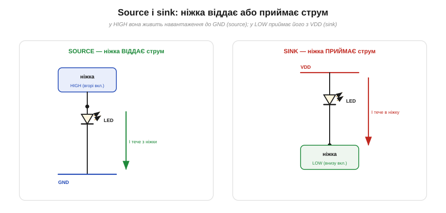
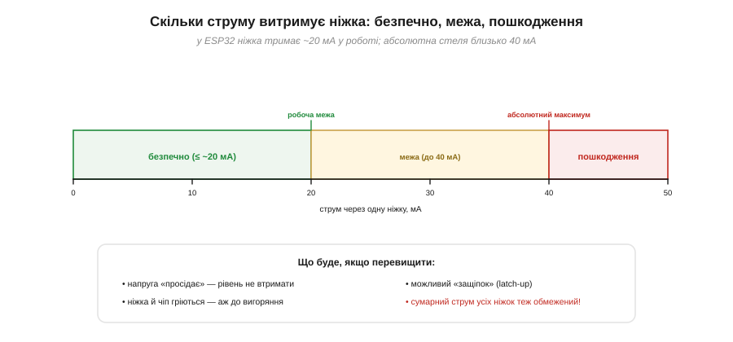
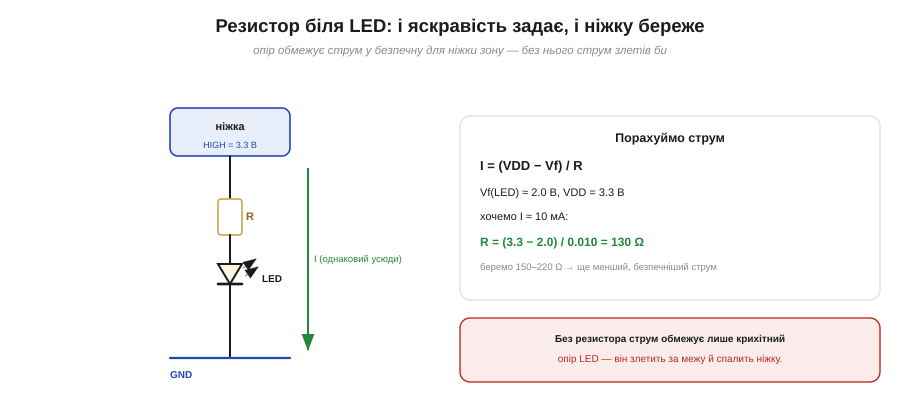
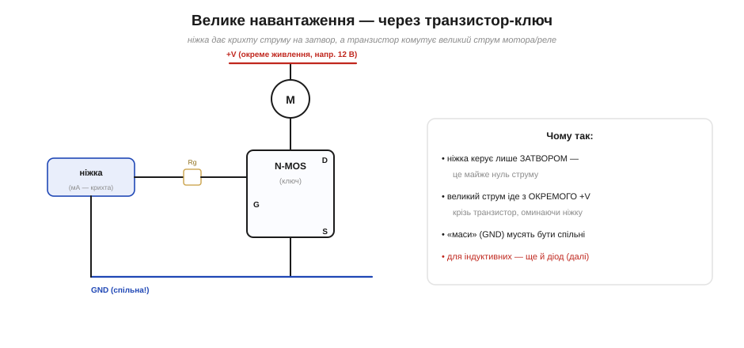
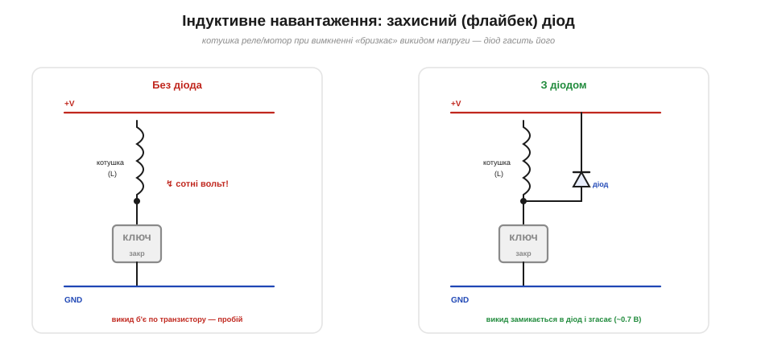
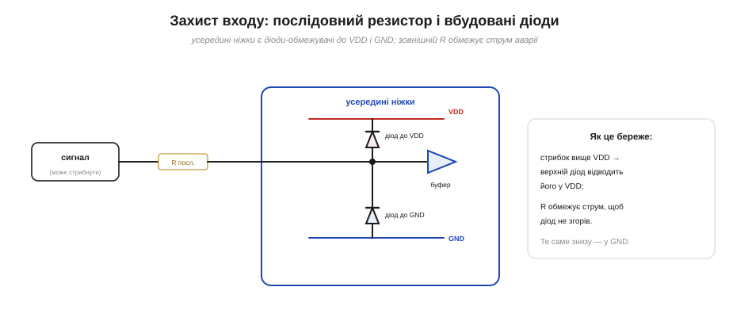

# Навантажувальна здатність і захист ніжки

Цифровий вихід не просто «оголошує» рівень, а [активно тримає його](root:hw-digital/push-pull-output), віддаючи чи приймаючи струм через транзистори двотактного каскаду. Звідси постає практичне питання: а **скільки** струму ніжка здатна так пропустити, перш ніж постраждати? Воно не академічне: переплутати тут — означає буквально **спалити** ніжку (а часом і весь чип). Ця тема — про межі струму ніжки (окремо «віддавати» й «приймати»), про те, що стається при перевищенні, і про три класичні способи захисту: **резистор** біля світлодіода, **транзистор-ключ** для великих навантажень і **діод** для індуктивних. Заразом розберемо, як уберегти ніжку-**вхід** від завеликої напруги.

### Source і sink: віддавати чи приймати струм

Усередині ніжки сидить [двотактний каскад](root:hw-digital/push-pull-output) — пара транзисторів, верхній і нижній. Коли ніжка в **HIGH**, відкрито верхній транзистор — ніжка з'єднана з VDD, і струм тече **з** ніжки в навантаження (далі — на GND). Це називають **source** (ніжка — «джерело» струму). Коли ніжка в **LOW**, відкрито нижній транзистор — ніжка з'єднана з GND, і струм тече **в** ніжку (з навантаження, що висить на VDD). Це **sink** (ніжка «поглинає» струм). Те саме залізо, лише напрямок струму протилежний.


*Дві ролі ніжки-виходу. Ліворуч — **source**: ніжка в HIGH живить світлодіод, що йде на GND, і струм витікає з ніжки. Праворуч — **sink**: світлодіод висить на VDD, ніжка в LOW «притягує» його катод до землі, і струм втікає в ніжку. Звідси й світлодіод можна засвітити двома способами — «від ніжки» або «в ніжку».*

Чому це важливо розрізняти? Бо в багатьох мікросхемах межі для source і sink **різні**: історично нижній транзистор (sink) часто міцніший, тож деякі чипи приймають більший струм, ніж віддають. До того ж саме від ролі залежить, як підмикати навантаження: світлодіод «у ніжку» (sink, катодом до ніжки) світитиметься, коли на ніжці **LOW** — та сама інверсна логіка, що й [у кнопки, яка тягне лінію до землі](root:hw-digital/floating-pullups). Обидві ролі варто тримати в голові: «віддаю» і «приймаю» — це різні половини двотактного каскаду.

Окремий випадок — [open-drain вихід](root:hw-digital/open-drain-output): він уміє **лише приймати** (sink), бо верхнього транзистора в нього нема, тож «віддавати» (source) він не може взагалі. Саме тому світлодіод до open-drain ніжки чіпляють катодом, щоб ніжка **притягувала** його до землі. Та й у звичайних двотактних ніжках схему «sink» (світлодіод від VDD у ніжку) часто люблять більше: нижній транзистор зазвичай міцніший, тож рівень LOW він тримає твердіше, ніж верхній — HIGH.

### Скільки струму — межа однієї ніжки

Тепер головне число. Кожна ніжка має **межу струму** — скільки вона безпечно пропустить. У ESP32 орієнтир такий: **близько 20 мА** у нормальній роботі й **близько 40 мА** як абсолютна стеля (силу виходу навіть можна налаштувати — від кількох до сорока мА). Перейдеш цю стелю — і фізика бере своє.


*Шкала струму однієї ніжки ESP32: зелена зона (≤ ~20 мА) — безпечна робота; жовта (до ~40 мА) — гранична, на свій ризик; червона (понад 40 мА) — пошкодження. І окремо: сумарний струм **усіх** ніжок теж обмежений можливостями виводів живлення чипа.*

Що саме стається при перевищенні? По-перше, напруга на ніжці **просідає**: транзистор має свій внутрішній опір, і чим більший струм ви тягнете, тим більше на ньому «губиться» вольтів — рівень HIGH може впасти настільки, що приймач уже не впізнає одиницю — нижче за свій [поріг розпізнавання](root:hw-digital/logic-thresholds). По-друге, на тому опорі виділяється **тепло** — ніжка й кристал гріються, аж до незворотного вигоряння. По-третє, у важких випадках спрацьовує **«защіпка»** (latch-up) — паразитна структура всередині чипа «замикається» накоротко й тягне руйнівний струм. А ще є **сумарна** межа: навіть якщо кожна ніжка окремо в нормі, усі разом течуть через спільні виводи живлення, які теж не безмежні. Тож бюджет струму рахують **двічі** — на ніжку й на весь чип.

Те, що силу виходу можна **налаштувати**, — не дрібниця. Слабше налаштування ніжки менше гріє й менше «дзвенить» (дає чистіший фронт без викидів і завад), зате повільніше перемикає важке навантаження; сильніше — навпаки, швидше, але електрично галасливіше. Тому за замовчуванням беруть помірне (близько 20 мА) і піднімають лише там, де треба швидко гнати ємнісну лінію. Це ще один компроміс «швидко проти чисто» — рідня тому, що виникає при виборі [сили підтяжок](root:hw-digital/floating-pullups).

> 🔧 **Навіщо це.** Запам'ятайте робочий орієнтир: **~20 мА на ніжку** — і живіть спокійно. Один звичайний світлодіод (через резистор) — це якраз кілька мА, тож пряме керування LED — нормально. А от реле, моторчик, лампа, смужка світлодіодів, динамік — це десятки й сотні мА; вішати їх **просто на ніжку не можна**. Перш ніж щось підмикати, грубо прикиньте струм навантаження й порівняйте з 20 мА: більше — потрібен підсилювач (транзистор), про який нижче.

### Найчастіший випадок: світлодіод і резистор

Найперше навантаження кожного початківця — світлодіод. І найперша помилка — підмкнути його до ніжки **без резистора**. Світлодіод сам по собі майже не обмежує струму: щойно напруга на ньому перевищує поріг (для червоного ~2 В), його опір стрімко падає, і він пропускає скільки дадуть. «Скільки дадуть» — це десятки мА, що миттю виходять за межу ніжки. Резистор послідовно з LED і **задає** струм у безпечне русло, і **береже** ніжку: він бере на себе різницю напруг і обмежує струм за законом Ома.


*Резистор послідовно зі світлодіодом: струм один на весь ланцюжок, I = (VDD − Vf)/R. Для VDD = 3.3 В, Vf ≈ 2.0 В і бажаних 10 мА виходить R ≈ 130 Ω (беруть 150–220 Ω). Без резистора струм обмежував би лише крихітний власний опір LED — і ніжка згоріла б.*

Цей розрахунок — той самий, що [задає яскравість світлодіода на push-pull виході](root:hw-digital/push-pull-output), та в нього є й **другий** сенс: резистор тут не лише «про яскравість», а й **запобіжник** для ніжки. Узяти опір трохи більшим за розрахунковий — безпечніше (трохи тьмяніше світло, зате менший струм). Це найдешевший захист в електроніці: одна копійчана деталь рятує ніжку.

> 🧮 **Два бюджети й колір світлодіода.** Ніжка має дві межі — свою й чипа в сумі, — а резистор світлодіода рахують за кольором (синій/білий на 3.3 В капризні!). Формула, таблиця й розрахунок запасу — у вставці [Бюджет ніжки й порту](root:hw-digital/pin-drive-limits/math-pin-budget.md).

### Коли навантаження завелике: транзистор-ключ

А якщо навантаження таки більше за 20 мА — реле, моторчик, потужна стрічка? Тоді ніжка керує не самим навантаженням, а **транзистором**, що працює **ключем**. Ідея проста й могутня: ніжка подає крихітний струм на **затвор** (gate) польового транзистора — а той своїм каналом пропускає **великий** струм навантаження, узятий із **окремого** живлення. Ніжка майже не навантажується (затвор бере мізер), а вся «сила» тече повз неї.


*Велике навантаження вмикають транзистором. Ніжка через невеликий резистор керує затвором N-MOS; великий струм мотора йде з окремого живлення +V крізь транзистор на GND, оминаючи ніжку. Обов'язкова умова — **спільна земля** (GND) у мікроконтролера й силового живлення.*

Кілька важливих деталей. По-перше, **спільна земля**: «мінуси» мікроконтролера й силового живлення мусять бути з'єднані, інакше транзистор не «бачитиме» рівня від ніжки. По-друге, невеликий резистор у затворі (Rg) стримує кидок струму при перемиканні. По-третє, для звичайного логічного N-MOS ніжки 3.3 В часто досить, щоб відкрити його повністю, — але це треба перевіряти [за порогом конкретного транзистора](root:hw-components/logic-level-mosfet) (буває, потрібен «logic-level» тип). Так одна слабка ніжка керує хоч мотором, хоч лампою — вона лише «натискає кнопку», а тягне струм транзистор.

Ключем може бути не лише польовий (MOSFET), а й біполярний (BJT) транзистор — тоді ніжка керує ним через струм бази (і резистор бази обов'язковий). MOSFET зручніший тим, що затвор бере майже нуль струму, тож сьогодні його беруть частіше. Є й інша вісь вибору: вмикати навантаження **знизу** (ключ між навантаженням і GND — простіше, наш випадок) чи **зверху** (між +V і навантаженням — складніше, та інколи потрібне). Для перших кроків досить нижнього ключа на N-MOS.

> 🔧 **Навіщо це.** Правило-рятівник: **усе, що сильніше за світлодіод, — через транзистор**. Спроба крутнути моторчик «прямо з ніжки» закінчується спаленою ніжкою (а часто й просадкою живлення, від якої перезавантажується весь чип). Транзистор-ключ — копійчаний і простий; для індуктивних навантажень додайте до нього ще й діод, про який — просто зараз.

### Індуктивне навантаження: захисний діод

Реле, мотор, соленоїд мають **котушку** — індуктивність. А котушка має вперту властивість: вона **опирається зміні струму**. Поки транзистор увімкнено, крізь котушку тече струм. Щойно транзистор **вимикається**, котушка щосили намагається той струм **зберегти** — і, не маючи куди його дівати, **підстрибує напругою** на своїх кінцях до сотень вольтів (фізика: U = L·dI/dt, а різке вимкнення — це величезне [dI/dt](root:math-analysis/derivative)). Цей викид (його звуть зворотною ЕРС, back-EMF) б'є просто по транзистору й здатен його пробити, а наводкою дістати й ніжку.


*Ліворуч — без діода: вимкнення котушки дає викид у сотні вольт, що пробиває транзистор. Праворуч — захисний (флайбек) діод увімкнено паралельно котушці зворотно; при вимкненні струм котушки замикається крізь нього й спокійно згасає, а напруга обмежується лише ~0.7 В понад живлення.*

Ліки відомі й дешеві — **захисний (флайбек) діод** паралельно котушці, увімкнений «зворотно» (катодом до плюса). Назва «флайбек» (англ. *flyback* — «зворотний кидок») саме про це: про той зворотний стрибок струму, який діод і приймає на себе. У звичайній роботі він замкнений і не заважає. А в мить вимкнення, коли котушка «бризкає» викидом, діод **відмикається** й дає струмові безпечний шлях по колу — той циркулює крізь котушку й діод, поступово згасаючи, а напруга на транзисторі лишається безпечною. Без перебільшення: на будь-якій котушці, що комутується транзистором, флайбек-діод **обов'язковий** — це не «покращення», а необхідність.

### Захист входу: послідовний резистор і діоди-обмежувачі

Досі йшлося про ніжку-вихід. Та ніжку-**вхід** теж треба берегти — від завеликої або від'ємної напруги. На щастя, всередині майже кожної ніжки вже є два **діоди-обмежувачі** (clamp/ESD-діоди): один до VDD, другий до GND. Якщо напруга на ніжці підскочить вище VDD, верхній діод відмикається й **відводить** надлишок у шину живлення; якщо впаде нижче нуля — нижній діод відводить струм із GND. Так ніжка лишається в безпечному «коридорі» від ~0 до VDD.


*Усередині ніжки — діоди-обмежувачі до VDD і GND, що відводять викиди напруги. Та самі вони слабкі, тож зовнішній **послідовний резистор** обмежує струм аварії крізь них, рятуючи й діоди, і чип. Той самий резистор гасить і статичні розряди (ESD).*

Але ці діоди **слабкі** — пропустити крізь себе великий струм надовго вони не можуть і самі згорять. Тому зовнішній **послідовний резистор** (одиниці–десятки кілоом) на лінії входу — добра звичка: він **обмежує** струм крізь обмежувальні діоди під час викиду, рятуючи їх. Саме тут коріниться відоме застереження, що [ESP32 **не 5-вольтотерпимий**](root:hw-digital/logic-thresholds): подаси 5 В прямо на 3.3-вольтову ніжку — і верхній діод почне відводити струм у VDD без упину, аж поки не згорить. Послідовний резистор (а краще — дільник чи перетворювач рівнів) і робить таке з'єднання безпечним. Той самий резистор заразом гасить і **статичні розряди** (ESD) з пальців та одягу.

Береже резистор і у зворотний бік. Ніжку-**вихід** не можна замикати просто на VDD чи GND: для [двотактного каскаду](root:hw-digital/push-pull-output) це фактично коротке замикання; а якщо така помилка можлива в монтажі, послідовний резистор обмежить струм аварії. Платою за захист на вході є невелике сповільнення: резистор разом із ємністю входу — це [RC-ланка](root:hw-digital/floating-pullups), тож надто великий опір «розмаже» швидкий сигнал. Для повільних входів (кнопки, рівні) це байдуже, для швидких — резистор беруть помірний.

### Порахуймо: бюджет струму

Зведімо все в один числовий приклад — від світлодіода до реле.

**Приклад (бюджет струму).**

```
1) Світлодіод через резистор:
   Vf ≈ 2.0 В, VDD = 3.3 В, R = 220 Ω
   I = (3.3 − 2.0) / 220 = 1.3 / 220 ≈ 5.9 мА
   5.9 мА < 20 мА  →  ніжці безпечно, LED світить. OK.

2) Вісім таких світлодіодів на восьми ніжках:
   кожна ніжка:  ~6 мА   (окремо — OK)
   сумарно:      8 × 6 = 48 мА через спільні VDD/GND
   →  перевіряй СУМАРНИЙ ліміт чипа, не лише поніжковий!

3) Реле 12 В, котушка тягне 60 мА:
   60 мА  >>  20 мА  →  напряму на ніжку НЕ можна.
   рішення: транзистор-ключ + флайбек-діод (обов'язково).
```

Приклад показує всю логіку розділу разом: один світлодіод ніжці по силі; вісім — уже привід згадати про **сумарну** межу; реле — однозначно через транзистор і з діодом. Звичка рахувати цей бюджет **до** того, як щось підмкнути, економить спалені ніжки й годинами не відтворювані «загадки».

Отже, ніжка тримає рівень не безмежно: у ESP32 безпечно близько 20 мА (стеля ~40 мА), і є ще сумарна межа на весь чип. Світлодіод вмикають **через резистор** (він і яскравість задає, і ніжку береже), сильніші навантаження — **через транзистор-ключ** (ніжка керує затвором, силу тягне окреме живлення), а індуктивні — обов'язково з **флайбек-діодом**. Вхід же береже **послідовний резистор** разом із вбудованими діодами-обмежувачами. Так ніжка постає наскрізь — від транзисторів усередині до захисту назовні. А з боку **коду** ці самі ніжки прошивка вмикає й вимикає цілими портами — [через регістри й бітові маски](root:sf-devices/gpio-registers), швидко й по кілька ніжок разом.
