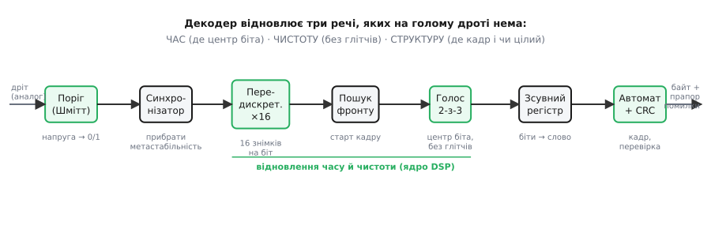
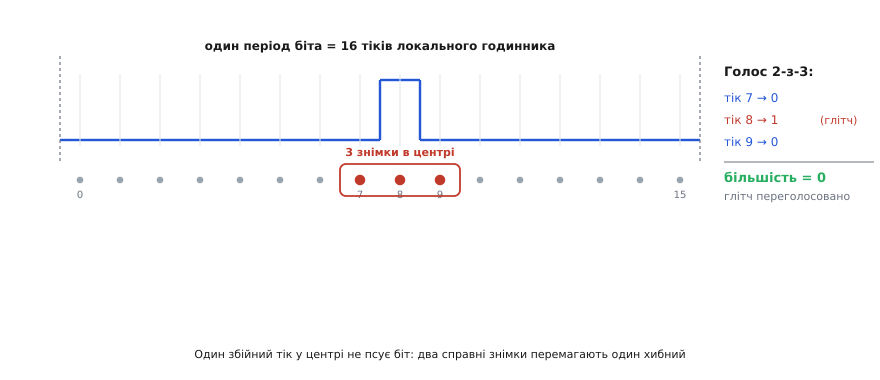
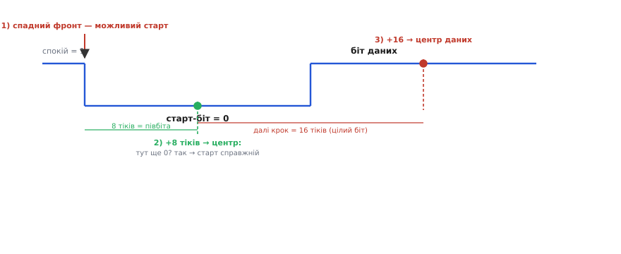

# Внутрішня логіка декодера протоколів

Уявіть, що вам простягнули один-єдиний дріт і сказали: на ньому — байти. Ви міряєте напругу — вона то висока, то низька, стрибає туди-сюди. І все. Ніхто не каже, **де починається** байт, **коли** саме читати кожен біт, і чи не був якийсь стрибок просто завадою. На дроті немає ні міток, ні пробілів між бітами, ні окремої лінії «ось зараз дійсне значення». Є лише напруга в часі. Перетворити цей голий струмок рівнів на осмислені байти — і є робота **декодера протоколу** (*decode* — розкодувати, з лат. *de-* «зняти» + *codex* «звід правил»). Це не одна хитра мікросхема, а маленький **конвеєр** обробки, де кожен щабель лагодить одну конкретну проблему сирого дроту. Розберімо цей конвеєр щабель за щаблем — і стане видно, що ховається всередині будь-якого приймача UART, SPI чи однодротової шини давача.

### Чого бракує на голому дроті — і що декодер відновлює

Почнімо з головного питання: **чому не можна просто читати ніжку** мікроконтролера й брати біти? Бо між передавачем і приймачем бракує трьох речей, і кожну доведеться відновити своїми силами.

Перше — **час**. У багатьох протоколах (класичний приклад — асинхронна послідовна лінія) окремого дроту з тактом немає: передавач і приймач мають **різні** годинники, лише налаштовані на однакову швидкість. Приймач не знає, коли передавач «поставив» новий біт; він мусить сам вирахувати, **де середина кожного біта**, і читати саме там, а не на краю, де рівень якраз перемикається й читання ненадійне.

Друге — **чистота**. Реальна лінія ловить завади: короткий викид від сусіднього дроту, брязкіт, шпилька від перемикання живлення. Один хибний стрибок посеред біта не повинен перетворити 0 на 1. Декодер має **відфільтрувати глітчі** (*glitch* — короткий випадковий збій).

Третє — **структура**. Потік бітів сам собою нічого не значить, доки ми не знаємо, **де межі кадру**: де старт, скільки бітів даних, де перевірка, де кінець. І, зчитавши кадр, треба ще й **переконатися, що він цілий** — не спотворений завадою в дорозі.


*Внутрішній конвеєр декодера. Зліва входить гола напруга з дроту, справа виходить готовий байт із прапором «ціле / помилка». Кожен щабель лагодить одну біду: поріг робить із напруги чисті 0/1, синхронізатор прибирає метастабільність на асинхронному вході, передискретизація ×16 дає багато знімків на біт, пошук фронту ловить старт кадру, голос «2-з-3» бере значення в центрі біта й відкидає глітч, зсувний регістр складає біти у слово, автомат сортує кадр і перевіряє його. Середні три щаблі — «час і чистота» — і є ядром цифрового оброблення сигналу всередині декодера.*

Ось і вся мапа теми: **декодер — це машина, що відновлює час, чистоту й структуру** там, де на дроті їх немає. Пройдімо конвеєр зліва направо.

### Вхід: зробити з напруги чисті нулі й одиниці

Найперше, з чим стикається декодер, — це те, що напруга на дроті **аналогова**. Вона не стрибає миттєво між 0 В і 3.3 В, а плавно повзе через проміжні значення, ще й тремтить від шуму. Перш ніж говорити про «біти», цю плавну криву треба звести до двох чистих рівнів. Це робить **поріг**: усе вище певної напруги — логічна 1, усе нижче — 0.

Але простий поріг має підступ: коли напруга **зависла** біля самого порога й тремтить, вихід починає скажено миготіти між 0 і 1 на кожне дрібне ворушіння шуму. Тому на вході ставлять не простий поріг, а поріг **із гістерезисом** — [тригер Шмітта](topic:hw-digital/threshold-schmitt): у нього два різні пороги, вгору й униз, і між ними — «мертва зона», де вихід не міняється. Раз перемкнувшись у 1, він не впаде назад у 0, доки напруга не опуститься помітно нижче. Це вбиває миготіння на повільних, зашумлених фронтах і дає далі по конвеєру чисту двійкову лінію.

> 🔧 **Навіщо це.** Коли ви заводите сигнал давача чи довгу лінію зв'язку прямо на цифрову ніжку, першим по дорозі стоїть саме такий вхідний поріг. Якщо забути про гістерезис — на пологому, зашумленому фронті приймач «побачить» кілька фальшивих перемикань замість одного, і декодер зловить неіснуючі біти. Тому для будь-якого повільного чи довгого входу беруть ніжку з входом Шмітта (або додають гістерезис зовнішньою схемою) — це найдешевша страховка від глітчів на самому початку.

### Синхронізація: приборкати асинхронний вхід

Тепер тонкість, яку легко проґавити. Лінія, що приходить іззовні, живе **за своїм часом** — вона може змінитися будь-якої миті, зокрема **точно в момент** фронту нашого локального такту. А цифрові схеми всередині декодера тактовані: вони читають вхід рівно по фронту свого годинника. Спіймати рівень саме в мить його зміни — прямий шлях до [метастабільності](topic:hw-digital/metastability-timing): тригер зависає між 0 і 1 на невизначений час і може «заразити» цим усю логіку далі.

Тому перш ніж пускати зовнішню лінію в роботу, її пропускають крізь **синхронізатор** — [ланцюжок із двох тригерів на локальному такті](topic:hw-digital/metastability-timing/proj-two-ff-synchronizer.md). Перший тригер може впасти в метастабільний стан, але має цілий такт, щоб «розсмоктатися» до чистих 0 чи 1; другий тригер віддає далі вже стабільне, синхронне до нашого годинника значення. Ціна — затримка на пару тактів, і вона зовсім не заважає: далі ми однаково будемо знімати лінію багато разів на біт.

### Передискретизація: знайти, де ж центр біта

Ось ми й дійшли до серця декодера — **відновлення часу**. Годинник передавача нам недоступний, отже, треба самим вирахувати, коли настає середина кожного біта. Прийом простий і потужний: знімати лінію **набагато частіше**, ніж міняються біти. Стандарт для асинхронної лінії — **16 знімків на один біт**: локальний годинник цокає у 16 разів швидше за швидкість передавання.

Це той самий прийом, що й [передискретизація](topic:hw-analog/oversampling-decimation) взагалі — «знімати частіше, ніж вимагає сама швидкість сигналу», — але тут ми виміняємо надлишок знімків не на роздільність, а на **точність у часі**. Маючи 16 тіків усередині кожного біта, декодер точно знає: центр біта — це десь тік 8. Не треба вгадувати; треба лише **порахувати тіки** від початку біта до середини. А що знімків аж 16, то навіть якщо наш годинник трохи розходиться зі швидкістю передавача, кілька тіків похибки не зсунуть нас із центру біта на його небезпечний край.

### Голос більшості: центр біта без глітчів

Знати, **де** центр біта, — півділа. Треба ще прочитати там значення **надійно**, попри можливий глітч рівно в цю мить. Тут декодер робить розумний хід: замість одного знімка в центрі він бере **три сусідні** — тіки 7, 8, 9 — і віддає **більшість голосів**, тобто те значення, яке трапилося щонайменше двічі з трьох. Це і є **голосування 2-з-3** (*majority vote*): рішення ухвалює більшість.


*Один період біта поділено на 16 тіків локального годинника; справжнє значення біта тут — 0 (лінія внизу). У центрі один тік (8) підскочив угору — це глітч, коротка завада. Декодер бере не один центральний знімок, а три (тіки 7, 8, 9, обведені): 0, 1, 0. Більшість — 0, тож глітч **переголосовано** двома справними сусідами, і біт зчитано правильно. Одна коротка завада, коротша за пів такту знімання, не здатна перемогти два добрі знімки.*

Механізм той самий, що рятує від [брязкоту контактів](topic:hw-digital/contact-debounce): подія має **протриматися** кілька знімків поспіль, щоб її визнали справжньою, а поодинокий короткий стрибок відкидається як шум. Тут це крихітний **цифровий фільтр** над потоком знімків — найпростіший, який лишень буває: він пропускає стійке значення й глушить одиничні викиди. У цьому й полягає «цифрове оброблення сигналу» всередині декодера: узяти дискретизований потік і алгоритмом (лічба тіків + голос більшості) витягти з нього чисте значення.

**Приклад (голос 2-з-3 у коді).** Ось як три знімки центру перетворюються на один надійний біт. Функція бере три виміри й повертає значення більшості — без жодних розгалужень, самою логікою:

:::tabs
```cpp
#include <cstdint>

/* більшість 2-з-3: біт виходу = 1, якщо принаймні два входи = 1 */
constexpr std::uint8_t majority3(std::uint8_t a, std::uint8_t b, std::uint8_t c) {
    return (a & b) | (b & c) | (a & c);
}
```
```python
def majority3(a: int, b: int, c: int) -> int:
    """більшість 2-з-3: біт виходу = 1, якщо принаймні два входи = 1"""
    return (a & b) | (b & c) | (a & c)
```
:::

Розберімо, чому ця формула і є «більшість». Кожен доданок — це пара входів, що збіглися в 1: якщо будь-які двоє з трьох дорівнюють 1, спрацьовує хоча б один `&`, і на виході 1. Якщо ж одиниць менше двох — жодна пара не збіжиться, і вихід 0. Три АБО-об'єднані пари покривають усі три способи набрати більшість. Один хибний біт (наш глітч) ніколи не переважить два справні — саме цього ми й хотіли. Ту саму `majority3` в залізі складають із двох-трьох [вентилів](topic:hw-digital/basic-gates), тож вона майже безплатна і в коді, і в кремнії.

### Вирівнювання на старт: із чого все починається

Лишилося одне питання часу: **звідки декодер знає, що біт узагалі почався**? У спокої асинхронна лінія тримає високий рівень (лог. 1). Початок кадру позначено **старт-бітом** — примусовим падінням у 0. Отже, декодер сидить і чекає **спадного фронту**: різкого переходу 1→0. Спіймавши його, він припускає, що це старт, і запускає лічбу тіків.

Але фронт міг виявитися й глітчем, а не справжнім стартом. Тому одразу після фронту декодер відлічує **пів біта — 8 тіків** — щоб дістатися середини гаданого старт-біта, і **перевіряє: лінія все ще 0?** Якщо так — старт справжній, і заразом ми щойно **влучили в центр** першого біта; далі досить крокувати рівно по **16 тіків**, щоб раз по раз опинятися в центрі кожного наступного біта. Якщо ж посередині вже не 0 — це була завада, декодер скидає лічбу й повертається чекати наступного фронту. Цей крок так і звуть — **відкидання хибного старту** (*false start bit rejection*).


*Як декодер ловить ритм кадру. У спокої лінія тримає 1. (1) Спадний фронт 1→0 — можливий старт-біт: декодер запускає лічбу тіків. (2) Відлічивши 8 тіків (пів біта), він потрапляє в **центр** старт-біта й перевіряє, що там усе ще 0, — це відсіює короткі завади. (3) Далі досить крокувати рівно по 16 тіків: кожен такий крок від центру старт-біта приводить у центр наступного біта даних. Так із одного пійманого фронту декодер вивів ритм читання всього кадру.*

Зверніть увагу, як гарно сходяться два прийоми: перевірка «ще 0 через півбіта» **водночас** і відкидає хибний старт, і безкоштовно ставить нас точно в центр біта. Один рух — дві користі.

### Складання слова: зсувний регістр

Тепер декодер уміє щотакту (точніше, що-біта) видавати один надійний біт. Але користувачеві потрібен цілий **байт**, а не окремі біти. Збирає їх [зсувний регістр](topic:hw-digital/shift-register): це ланцюжок комірок, де на кожен новий біт увесь вміст **зсувається** на одну позицію, а свіжий біт заходить із краю. Пропустивши крізь нього вісім бітів поспіль, дістаємо в регістрі повний байт — рівно в тому порядку, в якому біти прийшли.

Порядок заходу важливий і диктується протоколом. Асинхронна лінія, наприклад, шле **молодшим бітом уперед**, тож новий біт слід уводити зі старшого кінця й зсувати праворуч — тоді перший прийнятий біт «доїде» до молодшої позиції якраз на восьмому кроці. Плутанина з напрямом зсуву — класична причина, чому декодер видає «дзеркальні» байти.

### Автомат кадру: хто всім диригує

Досі ми описували щаблі окремо, але хтось має **вести їх по черзі**: чекати старту, відлічити рівно вісім бітів даних, тоді (як передбачає протокол) прочитати біт перевірки, тоді стоп-біт, і повернутися чекати наступного кадру. Цей диригент — [скінченний автомат](topic:hw-digital/finite-state-machines): машина, що тримає **стан** (де ми зараз у кадрі) і на кожному кроці за станом і входом вирішує, що робити далі й куди перейти. Стани — приблизно `СПОКІЙ → СТАРТ → ДАНІ → ПЕРЕВІРКА → СТОП → СПОКІЙ`; лічильник бітів усередині стану `ДАНІ` тримає машину там рівно вісім кроків. Сама форма кадру — скільки бітів даних, чи є біт парності, скільки стоп-бітів — задана протоколом; для асинхронної лінії це [кадр UART](topic:com-devices/uart-frame).

Автомат — це той щабель, де «сирі надійні біти» нарешті стають **структурою**: машина знає, що восьмий біт завершив дані, дев'ятий — це перевірка, а не дані, і десятий мусить бути стоп-бітом (лінія повертається в 1). Якщо стоп-біта на місці немає — лінія не піднялася, коли мала, — автомат підіймає прапор **помилки кадру** (*framing error*): рамки кадру «поїхали», ритм збився.

### Перевірка: чи цілий кадр

Останній щабель — **контроль цілості**. Навіть точно зчитаний кадр міг бути спотворений завадою ще в дорозі, до нашого декодера. Тому в кадр закладають надлишок, який дає змогу помітити спотворення. Найпростіший — **біт парності** (*parity* — парність): передавач додає біт так, щоб загальна кількість одиниць у кадрі була парна (або непарна — за домовленістю); приймач лічить одиниці й перевіряє, чи парність збіглася. Один перевернутий біт зламає парність — і кадр буде відкинуто.

Парність ловить лише непарне число помилок і не бачить, наприклад, двох перевернутих бітів. Тому серйозніші протоколи беруть [циклічний надлишковий код (CRC)](topic:com-modulation/crc): передавач ділить дані за особливими правилами й додає до кадру остачу, а приймач повторює те саме ділення й звіряє. CRC ловить набагато ширший клас спотворень і в багатьох мікроконтролерах порахований апаратним блоком «на льоту». Хоч би яку схему взято, суть одна: **декодер не просто читає кадр — він виносить вирок «ціле / зіпсуте»**, і лише ціле віддає користувачеві.

### Один щабель — один урок

Тепер видно, чому декодер саме такий. Кожен його щабель відповідає на конкретне «а що як»: **а що як напруга плаває** — поріг Шмітта; **а що як вхід смикнеться в мить фронту** — синхронізатор; **а що як я не знаю, де центр біта** — передискретизація ×16; **а що як там глітч** — голос 2-з-3; **а що як то був не старт** — перевірка через півбіта; **а що як плутаю окремі біти** — зсувний регістр; **а що як загубив межі кадру** — автомат; **а що як кадр спотворено** — CRC чи парність. Зберіть ці відповіді в ланцюг — і матимете рівно ту машину, що всередині кожного приймача протоколу.

Ось як центральні щаблі — вирівнювання й читання одного біта — виглядають у прошивці програмного приймача. Це серце декодера в коді: локальний таймер цокає ×16, а лічильник тіків веде нас від старт-фронту до центрів бітів:

:::tabs
```cpp
#include <cstdint>

/* Стан приймача одного байта. Таймер зводить isr() ×16 на біт. */
static struct {
    std::uint8_t  active;      /* чи всередині кадру */
    std::uint8_t  tick;        /* лічильник тіків 0..15 у межах біта */
    std::uint8_t  bit_no;      /* скільки бітів даних уже зібрано */
    std::uint8_t  shifter;     /* тут накопичується байт */
} rx;

extern std::uint8_t line_read();   /* уже після Шмітта й синхронізатора: 0/1 */
extern std::uint8_t majority3(std::uint8_t, std::uint8_t, std::uint8_t);
extern void byte_ready(std::uint8_t);

/* Викликається локальним таймером 16 разів на кожен біт */
void rx_isr() {
    std::uint8_t s = line_read();

    if (!rx.active) {                 /* чекаємо старт-фронт у спокої */
        if (s == 0) {                 /* лінія впала — можливий старт */
            rx.active = 1;
            rx.tick   = 0;
            rx.bit_no = 0;
        }
        return;
    }

    rx.tick++;
    if (rx.tick == 8 && rx.bit_no == 0) {   /* центр старт-біта */
        if (line_read() != 0) {             /* насправді не 0 → хибний старт */
            rx.active = 0;                  /* скинути, чекати знову */
        }
        return;
    }

    if (rx.tick >= 16) {              /* дійшли центру чергового біта даних */
        rx.tick = 0;
        /* голос по центру: три сусідні знімки */
        std::uint8_t b = majority3(line_read(), line_read(), line_read());
        rx.shifter = (rx.shifter >> 1) | (b << 7);   /* молодший біт уперед */
        if (++rx.bit_no == 8) {      /* байт зібрано */
            byte_ready(rx.shifter);  /* віддати користувачеві */
            rx.active = 0;           /* (стоп-біт і перевірку — окремо) */
        }
    }
}
```
```python
class UartRx:
    """Стан приймача одного байта. Таймер зводить isr() ×16 на біт."""

    def __init__(self, line_read, byte_ready):
        self.line_read = line_read    # уже після Шмітта й синхронізатора: 0/1
        self.byte_ready = byte_ready  # віддати зібраний байт користувачеві
        self.active = False           # чи всередині кадру
        self.tick = 0                 # лічильник тіків 0..15 у межах біта
        self.bit_no = 0               # скільки бітів даних уже зібрано
        self.shifter = 0              # тут накопичується байт

    def isr(self):
        """Викликається локальним таймером 16 разів на кожен біт"""
        s = self.line_read()

        if not self.active:               # чекаємо старт-фронт у спокої
            if s == 0:                    # лінія впала — можливий старт
                self.active = True
                self.tick = 0
                self.bit_no = 0
            return

        self.tick += 1
        if self.tick == 8 and self.bit_no == 0:   # центр старт-біта
            if self.line_read() != 0:             # насправді не 0 → хибний старт
                self.active = False               # скинути, чекати знову
            return

        if self.tick >= 16:               # дійшли центру чергового біта даних
            self.tick = 0
            # голос по центру: три сусідні знімки
            b = majority3(self.line_read(), self.line_read(), self.line_read())
            self.shifter = (self.shifter >> 1) | (b << 7)   # молодший біт уперед
            self.bit_no += 1
            if self.bit_no == 8:          # байт зібрано
                self.byte_ready(self.shifter)   # віддати користувачеві
                self.active = False             # (стоп-біт і перевірку — окремо)
```
:::

Прочитайте його як зменшений автомат: поле `active` — це стан «у кадрі / у спокої», `tick` лічить 16 тіків усередині біта, `bit_no` веде вісім кроків даних. На тіку 8 першого біта — перевірка хибного старту; на кожному 16-му тіку — голос більшості й зсув у байт. Це буквально той самий конвеєр, лише стиснутий у одну процедуру переривання; апаратний UART робить те саме, тільки логікою в кремнії, а не рядками C.

---

**Підсумок.** **Декодер протоколу** — це внутрішній **конвеєр**, що перетворює голу напругу на дроті на перевірені байти, відновлюючи три речі, яких на лінії немає: **час** (де центр біта), **чистоту** (без глітчів) і **структуру** (де кадр і чи він цілий). Щаблі йдуть один за одним: [поріг Шмітта](topic:hw-digital/threshold-schmitt) робить із аналогової напруги чисті 0/1; [синхронізатор](topic:hw-digital/metastability-timing) прибирає метастабільність на асинхронному вході; [передискретизація ×16](topic:hw-analog/oversampling-decimation) дає багато знімків на біт, щоб лічбою тіків знайти його центр; **голос 2-з-3** читає центр надійно, переголосовуючи одиничний глітч (той самий прийом, що й [проти брязкоту](topic:hw-digital/contact-debounce)); перевірка «ще 0 через півбіта» відкидає хибний старт і заразом влучає в центр; [зсувний регістр](topic:hw-digital/shift-register) складає біти у слово; [скінченний автомат](topic:hw-digital/finite-state-machines) сортує кадр за форматом протоколу ([кадр UART](topic:com-devices/uart-frame)); а [CRC](topic:com-modulation/crc) чи біт парності виносить вирок «ціле / зіпсуте». Кожен щабель лагодить одне конкретне «а що як» — і разом вони дають машину, що чує сенс там, де на дроті лише напруга.
