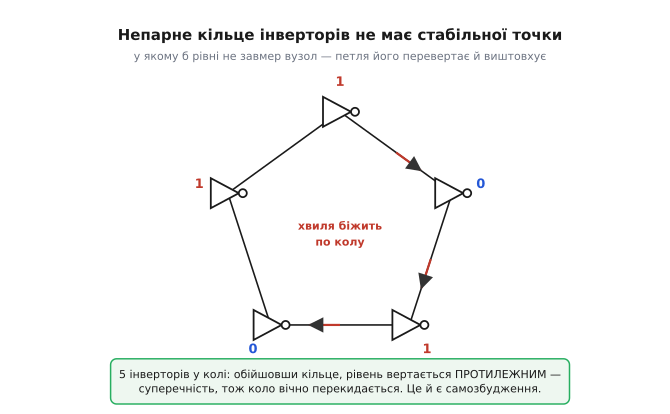
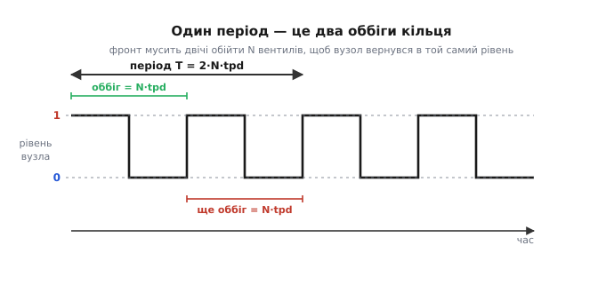
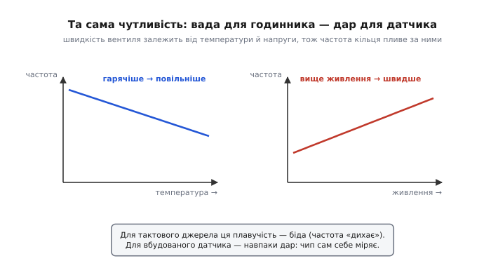
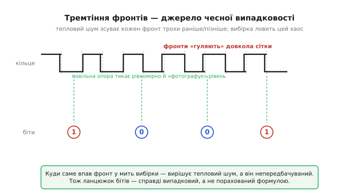

# Кільцевий генератор

Щоб щось у схемі коливалося саме собою, зазвичай ставлять кварц, котушку з конденсатором чи спеціальну аналогову мікросхему. А тепер дивовижне: візьми три звичайні цифрові інвертори — ті самі логічні «НЕ», що є в будь-якому чипі, — з'єднай їх у ланцюжок і замкни вихід останнього назад на вхід першого. Не додавай ні котушки, ні кварцу, ні задавального струму. Просто подай живлення. І це кільце **само** почне гнати на своєму виході рівний прямокутний сигнал — десятки, а на кристалі й тисячі мільйонів разів на секунду. Ніхто його не розгойдував; воно розгойдалося з нічого.

Це **кільцевий генератор** (англ. *ring oscillator* — «генератор-кільце»): найпростіший спосіб змусити цифрову логіку коливатися, не маючи жодного окремого коливального елемента. За цією простотою — гарна причина, і вона варта того, щоб її розкласти до дна: чому голе кільце логіки не завмирає, а вічно перекидається, з якою частотою й від чого та частота залежить, і чому та сама схема водночас — і найзручніший внутрішній годинник кремнію, і його вбудований термометр, і джерело справжньої випадковості.

### Чому кільце не може завмерти

Почнімо з одного інвертора й запитаймо просту річ: чи є в нього рівень, у якому він **згоден** сидіти? Інвертор робить одне — перевертає вхід. Подай на вхід «0» — на виході «1». Подай «1» — на виході «0». Тепер підключимо його вихід до **його ж** входу й спитаймо, чи знайдеться стан рівноваги. Хай на вході «0»; тоді вихід — «1»; але вихід зав'язаний на вхід, отже вхід уже «1»; тоді вихід мусить стати «0»; той «0» знову на вході — і вихід рветься назад у «1». Хоч який рівень візьми, інвертор сам себе з нього виштовхує. У схеми немає **стабільної точки** — рівня, який, обійшовши коло, вернувся б сам у себе.

Це і є корінь усього. Генератор — це схема без місця спокою: щойно вона десь усталюється, її власна будова її звідти жене. Один інвертор, замкнений сам на себе, уже має цю властивість. Але один — поганий генератор: на потрібній для самозбудження частоті його підсилення заслабке, фронти вироджуються, і схема радше застрягне десь на півдорозі між «0» і «1», ніж чисто заколиватиметься. Тому інверторів беруть **кілька**, і саме тут з'являється правило, яке спершу дивує.

### Чому непарне число

Замкнімо в кільце не один інвертор, а ланцюжок із кількох, і подивімося на **постійний** рівень — ніби нічого не змінюється. Кожен інвертор перевертає рівень. Отже ланцюг із **парного** числа інверторів дає на виході **той самий** рівень, що на вході (два перевороти скасовуються), а з **непарного** — **протилежний**. Тепер замкнімо вихід ланцюга на його вхід і спитаймо, як щойно про один: чи є стала точка?

```
парне число (напр. 4):  вхід 0 → … → вихід 0 → назад на вхід 0.  Збігається!
                        Петля має стабільну точку — вона просто застигає в ній.

непарне число (напр. 3): вхід 0 → … → вихід 1 → назад на вхід 1.  Суперечність!
                        Стабільної точки НЕМА — петля мусить вічно перекидатися.
```

Ось у чому суть непарності. Непарне кільце — це петля з **інверсією** по постійному струму: обійшовши коло, сигнал повертається перевернутим і сам себе спростовує. Такій петлі ніде спинитися. Парне ж кільце навпаки — має **згоду** по постійному струму, радо застигає в одному з двох стійких станів і нічого не генерує; два інвертори, замкнені в кільце, — це вже не генератор, а клітинка пам'яті, [защіпка на двох інверторах](topic:hw-digital/sr-latch), що тримає біт саме тому, що має стабільну точку.


*Непарне кільце інверторів: обійшовши коло, рівень будь-якого вузла повертається протилежним — суперечність, тож коло вічно перекидається. Хвиля перемикань біжить по колу зі скінченною швидкістю; вона й задає частоту. Парне кільце натомість застигло б у стійкому стані й мовчало.*

> 🔧 **Навіщо це.** Правило «тільки непарне» — перше, що рятує, коли зібране кільце мовчить. Поставив чотири інвертори замість трьох чи п'яти — і схема тихо застигла в стабільній точці, ніякого сигналу, а причину шукають годинами в «поганих контактах». Рахуй вентилі: **три, п'ять, сім** — тільки непарне. Те саме на кристалі: кільцевий генератор-датчик проєктують суворо з непарним числом ступенів, бо парне дало б замість годинника защіпку.

### Звідки береться частота

Ми з'ясували, чому кільце **мусить** коливатися. Лишилося зрозуміти, чому воно робить це з **чіткою** частотою, а не деренчить абияк. Відповідь у тому, що перекидання не миттєве. Кожен інвертор перевертає свій вихід **не одразу**, а через власну [затримку поширення](topic:hw-digital/gate-timing) tpd — час від зміни на вході до зміни на виході. Тож «суперечність», яку ми знайшли, розв'язується не стрибком, а **хвилею перемикань**, що біжить кільцем по колу зі скінченною швидкістю.

> Логічний вентиль перемикає вихід не миттєво: між зміною входу й зміною виходу минає **затримка поширення** tpd — одиниці наносекунд у звичайної логіки. Вона й обмежує, як швидко ланцюг вентилів устигає перерахуватися, а в кільці — задає темп біганини хвилі по колу. [Часові параметри вентилів](topic:hw-digital/gate-timing) розкладають, звідки ця затримка й чому фронти вгору і вниз різні.

Простежмо цю хвилю. У якомусь вузлі рівень щойно змінився — скажімо, став високим. Через tpd наступний інвертор перекине свій вихід; за ним, ще через tpd, наступний; і так фронт оббіжить усі N вентилів. Час одного повного оббігу:

```
один оббіг = N · tpd
```

Але після одного оббігу наш початковий вузол опиниться в **протилежному** рівні — бо N непарне, ланцюг інвертує. Щоб вузол вернувся в **той самий** рівень, з якого почали, тобто щоб завершився один повний **період**, фронт мусить обійти кільце **двічі**:

```
T = 2 · N · tpd
```


*Рівень одного вузла кільця в часі — чистий меандр. Перший півперіод (високий) — фронт один раз обійшов усі N вентилів; другий (низький) — обійшов ще раз, уже протилежним рівнем. Щоб вузол вернувся в той самий рівень, потрібні два оббіги, тому повний період T = 2·N·tpd, а не N·tpd.*

Множник **2** — не «про запас» і не «бо синусоїда». Він строго через те, що повний період прямокутного сигналу складається з **двох** півперіодів (високого й низького), і кожен півперіод — це рівно один оббіг кільця протилежним рівнем. Частота — обернена до періоду:

```
f = 1 / T = 1 / (2 · N · tpd)
```

Ось і весь генератор в одному рядку. Дві речі одразу впадають в око. По-перше, частота падає, коли вентилів **більше**: довше кільце — повільніше коливання. По-друге, і це головне для всього подальшого, частота **прямо задана затримкою вентиля** tpd. А затримка — не стала природи; вона залежить від того, як швидко цього дня, за цієї напруги й температури перемикаються транзистори саме цього кристала. Кільце не має власного «еталона часу»; воно міряє час **самим собою** — і тому його частота живе разом із залізом.

**Приклад (частота кільця).** Зберемо кільце з N = 5 інверторів, у кожного затримка поширення tpd = 8 нс. З якою частотою воно заколиватиметься?

```
T = 2 · N · tpd
T = 2 · 5 · 8×10⁻⁹ с
T = 80×10⁻⁹ с = 80 нс

f = 1 / T = 1 / (80×10⁻⁹) = 12.5×10⁶ Гц = 12.5 МГц
```

Дванадцять з половиною мегагерц — і жодного кварцу, лише п'ять копійчаних інверторів. На кристалі, де затримка одного ступеня — десятки пікосекунд, те саме коротке кільце дає вже одиниці гігагерц.

### Одна властивість, два обличчя: годинник і датчик

Тепер підійдемо до найцікавішого, що робить кільцевий генератор особливим. Ми щойно побачили: його частота прямо задана швидкістю транзисторів. А швидкість транзисторів **пливе** — від температури, від напруги живлення, від того, «швидким» чи «повільним» вийшов кристал із заводу. Гарячіший кремній перемикається повільніше — частота падає. Вище живлення — транзистори жвавіші, частота росте. Ця залежність — одна й та сама фізика, але дивитися на неї можна двома протилежними очима, і в цьому вся сіль.


*Ліворуч: гарячіше — повільніші транзистори — нижча частота. Праворуч: вище живлення — жвавіші транзистори — вища частота. Це одна властивість, подана двічі. Для тактового джерела така плавучість — вада (частота «дихає»). Для вбудованого датчика — саме те, що треба: за частотою чип читає свою температуру й напругу.*

**Очима годинникаря** ця плавучість — вада. Якщо кільце — джерело такту, ти хочеш **сталу** частоту, а вона тут дихає з кожним градусом і кожною десятою вольта. Тому там, де потрібна точність, — у радіо, у годиннику реального часу, у зв'язку — кільцевий генератор не годиться, беруть [кварц](topic:hw-components/crystal): його частоту тримає механічний резонанс кристалика, а не хисткий час перемикання логіки. Кільце ж лишають там, де важить не точність, а **простота й гнучкість**: як дешевий внутрішній тактовий сигнал, що не потребує зовнішнього кварцу й вільно перебудовується частотою (додав чи вимкнув пару ступенів — змінив частоту). Саме такий некритичний внутрішній такт живить безліч дрібних вузлів усередині чипів.

> Точний, стабільний [тактовий сигнал](topic:hw-digital/clock-signal) — серцебиття будь-якої синхронної цифрової системи; за його фронтами всі вузли крокують в один такт. Кільцевий генератор дає такт **дешевий і перебудовний**, але «дихаючий»; кварц дає **стабільний**, але жорсткий і зовнішній. Вибір між ними — це вибір між гнучкістю й точністю.

**Очима метролога** та сама плавучість — не вада, а **дар**. Якщо частота кільця однозначно росте з напругою й падає з температурою, то, вимірявши частоту, можна **прочитати назад** і температуру, і напругу — без окремого термометра й вольтметра. Саме тому кільцевий генератор — стандартний вбудований датчик усередині мало не кожного сучасного процесора й ПЛІС. Крихітне кільце розкидають по кристалу, і за його частотою чип на льоту вимірює, наскільки він гарячий у цій точці, наскільки просіла напруга живлення під навантаженням і наскільки «швидким» узагалі вдався саме цей кремній. Ці показання годують керування частотою й напругою: коли чип бачить, що гріється, він сам скидає такт; коли є запас — піднімає. Той самий дефект, що робить кільце поганим годинником, робить його чудовим сенсором PVT — процесу, напруги й температури (*process, voltage, temperature*).

> 🔧 **Навіщо це.** Кільцевий генератор — не лабораторна забавка, а масовий промисловий блок. На пластині його ставлять у смужки між кристалами як **монітор процесу**: заміряли частоту голого кільця — і одразу знають, «швидка» чи «повільна» вийшла ця партія, ще до складання. Усередині готового чипа десятки таких кілець працюють термометрами й індикаторами просідання живлення. Розуміти, чому їхня частота пливе, — значить розуміти, як кремній вимірює сам себе.

### Тремтіння фронтів — джерело справжньої випадковості

Є ще один бік цієї «нестабільності», зовсім несподіваний. Досі ми казали, що частота кільця пливе від температури й напруги — це повільні, плавні зміни. Але навіть за ідеально сталих умов кожен окремий фронт кільця приходить не строго вчасно: він трохи **тремтить** — то на крихту раніше, то на крихту пізніше. Причина — [тепловий шум](topic:hw-analog/resistor-noise): безладний рух зарядів у транзисторах щомиті ледь-ледь зсуває поріг перемикання, а отже й момент, коли фронт народжується. Це тремтіння називають **джитером** (англ. *jitter* — «тремтіння») моменту фронту. Для годинника воно — ще одна вада; але його можна обернути на несподівану користь.

Тепловий шум **фундаментально непередбачуваний** — його не порахувати наперед жодною формулою. Отже, якщо спіймати накопичене тремтіння фронтів, дістанеш **справді випадкові** біти — не псевдовипадкові, які лише вдають хаос, а такий собі підрахунок за прихованою формулою, а по-справжньому непередбачувані, укорінені у фізику. Прийом простий: беруть швидке кільце, чиї фронти добряче натремтіли, і **вибирають** його рівень рідкими тиками повільнішого опорного сигналу. Куди саме впав фронт у мить вибірки — вирішує тепловий шум, тож кожен спійманий біт — чесний кидок монети.


*Швидке кільце: тепловий шум зсуває кожен фронт трохи раніше або пізніше за ідеальну сітку. Рідка опора «фотографує» рівень кільця у свої моменти. Оскільки точне положення фронту в ту мить вирішує шум, послідовність спійманих бітів справді випадкова, а не породжена формулою.*

Саме так будують **апаратні генератори випадкових чисел** (*true random number generator*, TRNG) усередині чипів — ті, що дають ключі для шифрування. Кільцевий генератор тут ідеальний: він робиться з самих цифрових вентилів, займає копійки площі й не потребує жодної аналогової екзотики, а джерело хаосу — тепловий шум — вбудоване в кремній безкоштовно й невичерпно. Так «нестабільність», яка псує годинник, стає підмурком безпеки.

### Де кільцевий генератор поступається — і це варто знати

Кільцевий генератор дешевий і зробиться з чого завгодно, але він **не заміняє** кварц там, де важить точність, і межі варто тримати в голові, аби не поставити його не туди.

**Він не тримає частоту.** Це вже сказано, але це головне обмеження: частота кільця плаває з температурою, живленням і розкидом виготовлення, легко на десятки відсотків між холодним і гарячим, слабким і сильним живленням. Для внутрішнього некритичного такту — байдуже; для будь-чого, де частоту треба **знати** й тримати (радіо, лічба часу, послідовний зв'язок із зовнішнім світом), кільце не годиться. Там ставлять [кварц](topic:hw-components/crystal) або кільце, замкнене в петлю підстроювання, що прив'язує його до стабільної опори.

**Його фронти тремтять.** Той самий джитер, що корисний для випадковості, шкідливий для такту: він розмиває моменти фронтів, а отже й точність усього, що ними тактується. Кільцевий такт — «брудніший» за кварцовий, і це ще одна причина не пускати його в чутливі до фази застосування.

**На високій частоті вихід не ідеальний меандр.** Що коротше й швидше кільце, то менше в кожного ступеня часу вивести вихід у чистий повний рівень, — і сигнал вироджується в щось ближче до синусоїди з пологими фронтами. Якщо таке кільце заводять на лічильний вхід, пологий зашумлений фронт можна порахувати кілька разів поспіль; лікують це [тригером із гістерезисом](topic:hw-digital/threshold-schmitt), який робить із в'ялого фронту різкий чистий перепад.

Отак і виходить, що коливатися вміє навіть гола логіка — досить замкнути **непарне** число інверторів у кільце, і воно, не маючи стабільної точки, само розгойдається з періодом `T = 2·N·tpd`. За цю простоту платять точністю: частота кільця пливе від температури, напруги й розкиду кремнію, а його фронти тремтять. Але той самий недолік — зворотний бік двох чеснот: плавучість частоти робить кільце вбудованим термометром і вольтметром кристала, а тремтіння фронтів — джерелом справжньої випадковості для ключів шифрування. Кварц тримає час; кільце **міряє** кремній і **сіє** хаос — і саме тому воно живе всередині майже кожного сучасного чипа.
