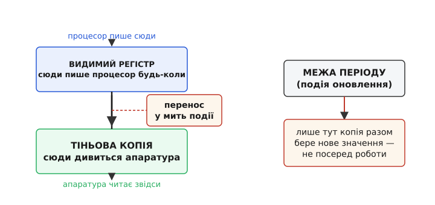
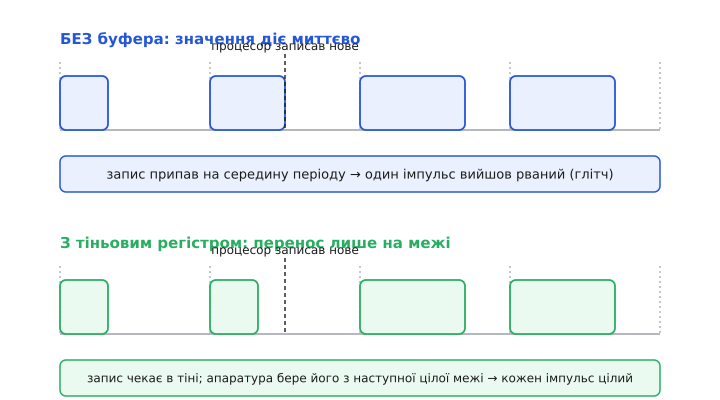
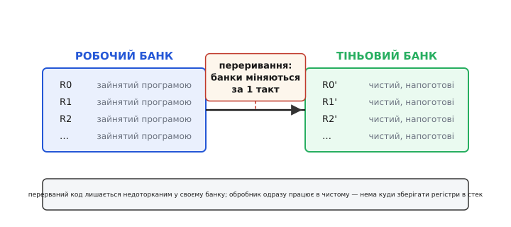

# Тіньовий регістр

Уяви, що ти на ходу перемальовуєш креслення, за яким просто зараз працює верстат. Ти стираєш одну лінію, ще не встиг дорисувати сусідню — а верстат уже прочитав половину нового, половину старого й зробив покруч. Проблема не в тому, що нове креслення погане. Проблема в **мить**: ти міняв його тоді, коли ним користувалися, і зловив читача посеред неузгодженого стану.

Рівно ця біда виникає в залізі щоразу, коли **процесор** хоче змінити число, за яким **апаратура** працює безперервно: ширину імпульсу, поріг лічильника, момент спрацювання. Процесор пише байти по черзі й у довільну мить; апаратура тим часом тактує далі й може зчитати регістр рівно між двома записами. Розв'язок напрочуд простий і має власну назву — **тіньовий регістр** (англ. *shadow register* — «регістр-тінь»): не даємо апаратурі дивитися туди, куди пише процесор, а тримаємо для неї окрему копію й переносимо нове значення в неї **вмить**, у безпечний момент. Розберімо, звідки береться потреба, як саме працює цей обмін і де він рятує на практиці.

### Чому «просто записати» — недостатньо

Почнімо з кореня. Будь-який регістр — це набір [D-тригерів](root:hw-digital/d-flip-flop), і сам він оновлюється миттєво, за одним фронтом такту. Здавалося б, звідки взятися неузгодженому стану? Звідти, що процесор рідко пише весь регістр за один такт.

Візьмімо 16-розрядне число на 8-розрядній шині. Процесор кладе його **двома** записами: спершу молодший байт, потім старший. Між цими двома записами минає час — кілька тактів процесора. І якщо апаратура читає це 16-розрядне число саме тоді, у неї в руках опиниться **новий молодший байт зі старим старшим** — значення, якого ти ніколи не мав на увазі. Було 0x00FF, ти хочеш 0x0100, а на одну коротку мить регістр показує 0x01**FF** або 0x00**00**. Один такий проміжний зайвий стан — і лічильник перескочив, імпульс вийшов не тієї ширини, порівняння спрацювало не там.

Навіть коли запис уміщається в один такт, лишається друга біда — **момент**. Апаратура працює періодами: лічильник біжить від нуля до верху, порівнює свій стан із порогом, дає імпульс, скидається, і знову. Якщо ти зміниш поріг **посеред** періоду — коли лічильник уже проминув старе значення, але ще не дійшов до нового, — цей період вийде спотвореним. Не тому, що число хибне, а тому, що ти підмінив його, поки ним якраз користувалися.

> 🔧 **Навіщо це.** Це не рідкісна екзотика, а щоденний випадок мікроконтролера: таймер жене [ШІМ](root:hw-arch/pwm-on-mcu) на світлодіод чи мотор, а програма плавно змінює яскравість або оберти — тобто раз у раз переписує регістр ширини. Без захисту кожна така зміна ризикує породити один рваний імпульс: моторець смикнеться, світло моргне. На одному кадрі непомітно, але вухо чує клацання в звуковому ШІМ, а точний привод збивається з ходу.

### Ідея: розділити «куди пишуть» і «звідки читають»

Причина болю — що **та сама** комірка водночас і мета запису процесора, і джерело для апаратури. Прибираємо саме це збігання. Робимо **дві** комірки замість однієї.

Перша — **видимий регістр** (той, що бачить процесор на шині): у нього пишуть будь-коли й будь-як, хоч побайтно, хоч посеред періоду. Друга — **тіньова копія**, схована від процесора: рівно її й тільки її читає апаратура. Поки процесор бабрається у видимому регістрі, тінь стоїть незмінна, тож апаратура весь час бачить одне цілісне, узгоджене значення. А коли настане **безпечна мить**, уміст видимого регістра **разом, за один фронт**, переписується в тінь.


*Процесор пише у видимий регістр коли завгодно, апаратура читає лише тіньову копію. Нове значення переходить у тінь не відразу, а одним кроком у визначену мить — на межі періоду. Тому апаратура ніколи не бачить напівзаписаного числа: між переносами тінь незмінна.*

Ключ — **атомарність** переносу (гр. *átomos* — неподільний): копія забирає всі розряди нового значення **одночасно**, за один такт, а не байт за байтом. Проміжного стану «половина нова, половина стара» просто не існує в тіні: вона стрибає зі старого повного значення відразу в нове повне. А значить, зникає й перша біда (напівзаписане число), і друга (зміна невчасно), бо переносимо ми не будь-коли, а тільки в момент, який апаратура сама оголошує безпечним.

Що це за момент — залежить від пристрою, але логіка одна: **межа періоду**. Для лічильника це мить, коли він скидається (**подія оновлення**, англ. *update event*); для порівняння — коли поточний цикл завершився й наступний ще не почався. У цю мить старим значенням уже ніхто не користується, а нове ще не потрібне — ідеальна щілина, щоб підмінити тінь непомітно.

### Як це виглядає в апаратурі таймера

Найпоширеніше втілення тіньового регістра сидить у **таймері** мікроконтролера, і виробники дають двом половинам чіткі імена. Регістр, у який пише програма, звуть **регістром попереднього завантаження** (англ. *preload register*), а сховану копію, за якою працює лічильник, — власне **тіньовим регістром**. Одним бітом у налаштуваннях таймера ти обираєш поведінку: або запис у видимий регістр **одразу** протікає в тінь (буферизація вимкнена), або він **чекає** в preload і переноситься в тінь лише на найближчій події оновлення (буферизація ввімкнена).

Подивімося, що дає кожен режим, на прикладі ШІМ. Лічильник біжить 0 → ARR → 0, і поки він менший за поріг CCR — вихід високий, далі низький; так ширина CCR задає шпаруватість. Тепер програма змінює CCR посеред періоду.


*Угорі буфер вимкнено: нове число діє миттєво, тож імпульс, під час якого стався запис, обривається достроково — на виході рваний імпульс замість рівного. Унизу той самий запис із тіньовим регістром чекає в тіні й підхоплюється лише на межі наступного періоду, тому жоден імпульс не спотворюється.*

Різниця видима одразу. Без буфера ти ризикуєш зіпсувати **той** період, у який попав запис. З тіньовим регістром зміна **завжди чиста**: вона застосовується цілим числом і рівно на межі, тож кожен окремий імпульс лишається правильним — просто ширина стрибає між періодами, а не всередині одного.

**Приклад (плавна зміна яскравості).** Керуємо світлодіодом через ШІМ на таймері мікроконтролера й повільно нарощуємо яскравість. Оскільки CCR буферизований тіньовим регістром, писати в нього можна будь-коли — навіть із перерваного місця, — і жоден кадр не буде рваним:

```c
// TIM->CCR1 — регістр порівняння каналу 1. Через увімкнену
// буферизацію (OC1PE=1) запис лягає в preload, а в тінь
// перейде на найближчому оновленні лічильника (на межі періоду).

volatile uint16_t g_target;   // куди хочемо дійти (0..ARR)

void led_set_brightness(uint16_t duty) {
    // Пишемо коли завгодно: апаратура однаково візьме значення
    // тільки на межі, тож поточний імпульс не порветься.
    TIM3->CCR1 = duty;        // осіло в preload
    g_target = duty;
}

// Виклик у повільному циклі — плавна анімація без глітчів:
void led_fade_step(void) {
    static uint16_t cur;
    if      (cur < g_target) cur++;
    else if (cur > g_target) cur--;
    led_set_brightness(cur);  // безпечно: тінь підхопить на update
}
```

Жодних «зачекай кінця періоду перед записом» у коді нема — про синхронність подбала апаратура, бо між `CCR1 =` і реальним застосуванням стоїть тіньовий регістр.

> 🔧 **Навіщо це.** Той самий буфер рятує ще й **регістр періоду** ARR. Якщо змінити верхню межу лічильника миттєво, а лічильник уже пробіг далі за нове ARR, він «промахнеться» повз точку скидання й накрутить зайвий довжелезний період, поки не переповниться повністю. Буферизований ARR через тінь застосовується лише на межі, тож частота ШІМ міняється гладко, без одиничного викиду. Тому в даташитах біля ARR і CCR майже завжди є біт «auto-reload preload / output-compare preload» — вмикай його, коли міняєш значення на ходу.

### Той самий прийом трохи інакше: тіньові банки регістрів у процесорі

Слово «тіньовий» у цифровій техніці вживають і в іншому, спорідненому значенні — і варто побачити зв'язок, щоб не плутатися. Ідеться про **тіньові банки регістрів процесора**, зроблені заради **швидкого входу в переривання**.

Згадаймо задачу. Коли трапляється переривання, обробник хоче користуватися регістрами процесора — але в них зараз лежать дані перерваної програми, і затерти їх не можна. Класичний вихід — на вході в обробник **зберегти** ці регістри в стек, а на виході **відновити**. Це десятки тактів на кожне переривання, і саме вони роздувають затримку відгуку.

Тіньовий банк прибирає цю плату. Замість одного набору робочих регістрів апаратура тримає **два**: робочий і тіньовий (чисту копію). Коли влітає переривання, процесор **одним рухом**, за такт-два, перемикає банки: перерваний код застигає недоторканим у своєму банку, а обробник відразу дістає власний чистий набір і працює в ньому. На виході банки міняються назад — і перерваний код бачить свої регістри точнісінько такими, якими лишив.


*Робочий банк тримає стан перерваної програми, тіньовий стоїть чистий. Переривання перемикає їх за один такт замість того, щоб зберігати регістри в стек. Обробник миттєво працює у своєму наборі, а вихід повертає перерваному коду його регістри в незмінному вигляді.*

Спільна суть із таймерним випадком очевидна: **тінь — це прихована копія, недоступна «звичайному» користувачеві, яку перемикають цілком і вмить, щоб уникнути неузгодженого проміжного стану**. У таймері вона захищає апаратуру від напівзаписаного числа; у процесорі — захищає перерваний контекст від затирання й економить збереження в стек. Механізм один, застосування різні.

> 🔧 **Навіщо це.** Тіньові банки — чому деякі мікроконтролери й сигнальні процесори мають дуже коротку, до того ж **сталу** затримку переривання: вона не залежить від того, скільки регістрів довелося б рятувати вручну. Це критично там, де переривання мусить відреагувати за жорсткий строк — керування двигуном, обробка кожного відліку [аналого-цифрового перетворення](root:hw-analog/adc), швидкі протоколи зв'язку. Побачив у даташиті «shadow/banked registers, N-cycle interrupt latency» — знай, що за цим стоїть саме такий подвійний набір.

### Де тіньовий регістр ламається — межі й ціна

Прийом дешевий і потужний, але не безкоштовний, і межі варто тримати в голові.

**Він коштує площі.** Тінь — це другий фізичний набір тригерів. Подвоєння регістра займає місце на кристалі й трохи струму. Для одного таймера це дрібниця, але тіньові банки на весь регістровий файл — уже помітна ціна, тож їх дають не всюди.

**Він додає затримку застосування.** Плата за безпеку — нове значення діє **не миттєво**, а лише з наступної межі. Записав ширину зараз — реально вона зміниться аж за півперіоду чи період. Здебільшого це саме те, чого хочеш; але якщо треба, щоб зміна вплинула **негайно** (наприклад, аварійно вимкнути вихід), буферизацію доводиться на цей момент обходити — писати напряму, свідомо ризикуючи одним рваним періодом заради швидкості.

**Він не рятує від гонитви поза межами тіні.** Тіньовий регістр робить атомарним рівно **один** перенос — усередині цього регістра. Але якщо кілька окремих регістрів мусять змінитися **узгоджено між собою** (скажімо, і період, і кілька порогів разом), а їхні тіні оновлюються на **різних** подіях, ти знову дістанеш проміжний стан — тепер уже між регістрами. Тому в таймерах усі буферизовані регістри навмисне переносять з **однієї** події оновлення: щоб уся група стрибнула в нове разом. Тіньовий регістр — інструмент точковий; узгодженість ширшої групи забезпечує спільна мить переносу, а не сам факт наявності тіні.

І окремо варто не змішувати тіньовий регістр із двома сусідніми, але іншими ідеями. Він **не** те саме, що [подвійна буферизація](root:hw-motion/display-double-buffering) кадру даних, хоч і споріднений: там два повні буфери, поки один малюється, інший читається, і вони міняються ролями цілком; тіньовий же регістр — це вужчий випадок, часто на одне-єдине число, з жорстко визначеною апаратурою миттю переносу. І він **не** синхронізатор: [метастабільність](root:hw-digital/metastability-timing) на межі [тактових доменів](root:hw-digital/clock-domain-crossing) — окрема проблема, яку тіньовий регістр сам собою не розв'язує (для передавання сигналу між доменами потрібні свої прийоми). Тінь бореться з **неузгодженим проміжним значенням у своєму такті**, а не з переходом між різними тактами.

### Підсумок

Тіньовий регістр народжується з простого спостереження: небезпечно міняти число тоді, коли ним просто зараз користуються. Тож ми розводимо роль «куди пишуть» і роль «звідки читають» на дві комірки — видиму й приховану, — а нове значення переносимо в приховану **цілком і в безпечну мить**, на межі періоду. Так апаратура ніколи не ловить напівзаписаного чи невчасно зміненого стану, а програма може писати коли завгодно й не думати про синхронність.

Та сама думка — «прихована копія, яку перемикають вмить» — працює і вгорі, у процесорі, де тіньові банки регістрів роблять вхід у переривання швидким і сталим за часом. Різні поверхи, різні задачі, але спільний хід: сховати копію від того, хто може зловити її в неузгодженому стані, і оголосити один чіткий момент, коли стару картину змінюють на нову — усю відразу, без напівкроків.
