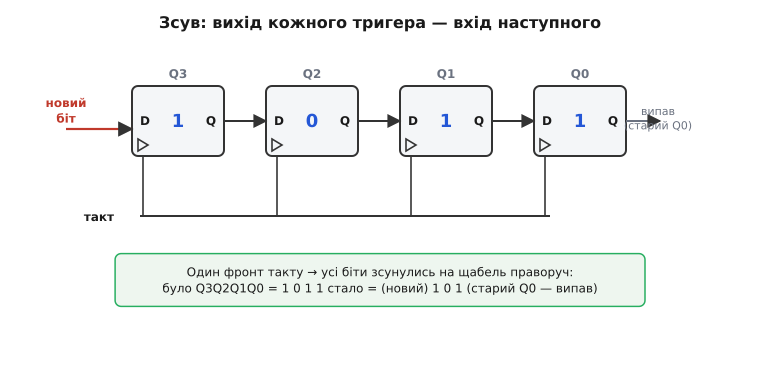
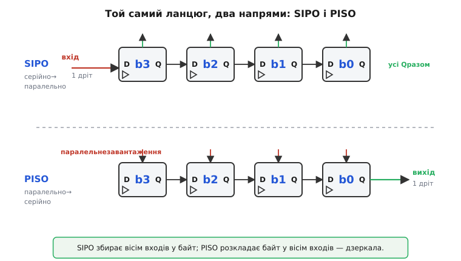
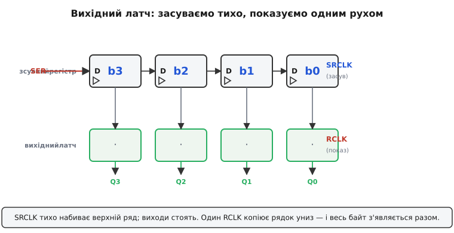
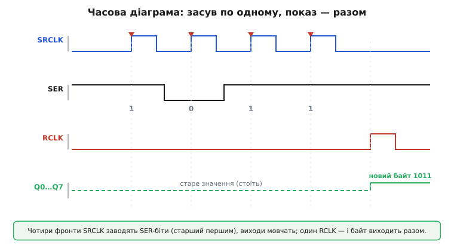

# Зсувний регістр

Уявіть просту, але вперту проблему. На платі стоїть мікроконтролер, а керувати треба двадцятьма світлодіодами. Ніжок у дешевого корпусу — всього кілька вільних, і двадцяти окремих ліній просто немає звідки взяти. Або навпаки: треба опитати шістнадцять кнопок, а входів так само бракує. Здавалося б, глухий кут — або бери дорожчий чип із сотнею ніжок, або відмовляйся від половини задуму.

Вихід знайшли в одній спостережливій думці: **дроти можна заощадити, якщо передавати біти не всі разом, а по черзі в часі**. Один провідник за вісім тактів пронесе вісім бітів — треба лише на іншому кінці складати їх назад у ціле. Пристрій, що це робить, — **зсувний регістр** (англ. *shift register*, «регістр, що зсуває»): ланцюжок комірок пам'яті, крізь який біти крокують по такту, заходячи з одного боку й рухаючись до іншого. З цієї простої механіки виростає і розширення ніжок, і весь послідовний зв'язок.

## Одна комірка, з'єднана в ланцюг

Будівельна цеглинка тут — звичайний тригер, комірка на один біт. Зсувний регістр складають саме з [D-тригерів](root:hw-digital/d-flip-flop) — комірок із одним входом D і одним виходом Q, які в мить **фронту** такту (короткого переходу 0→1) «фотографують» те значення, що має D саме зараз, і тримають його на Q аж до наступного фронту; між фронтами вхід можна смикати скільки завгодно — вихід не зреагує. Саме ця властивість «оновлюватися рівно раз за такт, у строго визначену мить» і зробить можливим узгоджений зсув.

Один тригер тримає один біт — і нічого більше. Цікаве починається, коли тригери ставлять **у ряд** і з'єднують особливим чином: вихід Q кожного тригера заводять на вхід D **наступного**, а такт подають **спільний** — на всі одразу. Тоді на кожному фронті стається ось що: кожен тригер захоплює те, що стоїть на виході сусіда **зліва**. А оскільки всі вони спрацьовують в одну й ту саму мить, уся низка бітів дружно зсувається на один щабель.


*Вихід кожного тригера живить вхід наступного. На фронті спільного такту тригер №2 хапає те, що було на виході №1, №3 — те, що було на №2, і так усім ланцюгом. Результат: біти зсуваються на щабель праворуч за один такт. Зліва на звільнене місце заходить новий біт (із входу даних), а біт, що був скраю праворуч, «випадає» — його вже ніхто не ловить.*

Чому це не плутанина, чому новий стан №2 не «протікає» далі в №3 у тому ж такті? Бо тригер ловить вхід лише в **мить** фронту, а не поки такт високий. У цю мить №3 дивиться на **старий** (доперехідний) вихід №2 — той встигає змінитися тільки **після** фронту. Тож кожен бере значення сусіда, яке було «за крок до», і ланцюг зсувається рівно на одну позицію, без гонитви. Якби тут стояли прозорі засувки, що пишуть весь час, поки такт=1, біт прогнався б крізь увесь ланцюг за один такт — і зсуву не вийшло б. Уся ідея тримається на захопленні **по фронту**.

> 🔧 **Навіщо це.** Запам'ятайте одну формулу поведінки: **за кожен фронт такту — зсув на один біт**. Звідси відразу рахується час. Щоб провести вісім бітів крізь восьмирозрядний регістр, треба **вісім** тактів; щоб наповнити ланцюг із 32 комірок — 32 такти. Коли пізніше доведеться оцінювати, чи встигне дисплей чи гірлянда оновитися «на око непомітно», ви просто множитимете кількість бітів на період такту.

## Два напрями: SIPO і PISO

Сам ланцюг тригерів — нейтральний; усе вирішує, **як ми вмикаємо дані** і **звідки знімаємо результат**. Тут є два дзеркальні режими, і саме вони перетворюють зсув на корисний інструмент.

Перший — **SIPO** (*serial-in, parallel-out*, «послідовно-всередину, паралельно-назовні»). Дані заходять в один кінець ланцюга **по одному біту** за такт, а знімаємо ми **всі виходи Q одразу**, всі разом. Це збирач: вісім тактів — і в восьми комірках лежить повний байт, який можна прочитати цілком. Так одна вхідна лінія перетворюється на вісім паралельних виходів.

Другий — **PISO** (*parallel-in, serial-out*, «паралельно-всередину, послідовно-назовні»). Спершу в усі комірки **одним рухом** записують байт (паралельне завантаження), а тоді тактами **висувають** його в один провідник, біт за бітом. Це роздавач навпаки: вісім паралельних входів стискаються в одну послідовну лінію.


*Угорі — SIPO: біти заходять по одному дроту зліва, а знімаються всі виходи Q одночасно (паралельно). Унизу — PISO: байт спершу завантажують паралельно зверху, а потім тактами висувають у єдиний провідник праворуч. Той самий ланцюг тригерів, лише з різного боку: SIPO збирає вісім окремих сигналів у байт, PISO розкладає байт назад у вісім.*

Є й третій, найпростіший варіант — **SISO** (*serial-in, serial-out*): і вхід, і вихід послідовні, дані просто проходять крізь ланцюг наскрізь. Корисний він тим, що затримує сигнал рівно на стільки тактів, скільки в ньому комірок, — виходить лінія затримки. Але робочі конячки на практиці — це SIPO і PISO: перший **розширює виходи** мікроконтролера, другий — **збирає входи**. Повертаючись до задачі з двадцятьма світлодіодами: це робота для SIPO. А шістнадцять кнопок зчитав би PISO.

## Защіпка виходу: показувати не мерехтливо

З чистим SIPO є неприємна дрібниця. Поки ми **засуваємо** вісім бітів по одному, виходи Q міняються **на кожному** такті — адже біти буквально їдуть крізь комірки. Якщо ці виходи вже підключені до світлодіодів, очі побачать не один акуратний перехід до нового візерунка, а ціле блимання проміжних станів, поки байт «вповзає». Для гірлянди дрібниця, для семисегментного індикатора чи матриці — помітне сміття.

Лікують це **вихідним латчем** (англ. *output latch*, дослівно «защіпка») — другим рядом тригерів, який стоїть **за** зсувним регістром і має **окремий** власний такт. Виходить подвійний буфер: у верхньому ряду (зсувний регістр) ми спокійно набиваємо біти, а нижній ряд (латч) у цей час тримає на виходах **старе** значення, не реагуючи на метушню вгорі. І лише коли весь байт вже на місці, ми даємо **один** імпульс на такт латча — і він **умить копіює** весь рядок до себе. Тоді всі виходи стрибають у новий стан **разом**, без проміжного блимання.


*Два ряди тригерів, два окремі такти. SRCLK тихо набиває верхній ряд (зсувний регістр) по одному біту — і весь цей час виходи стоять. Один імпульс RCLK копіює готовий рядок униз, у вихідний латч, — і аж тоді весь байт з'являється на виходах Q одразу. «Засуваємо непомітно, показуємо одним рухом».*

Те, що в латча **свій** такт, — це не ускладнення, а зручність: ви роз'єднали в часі «готувати дані» й «показати дані». Можна неспішно засунути байт, а показати його точно в потрібний момент; можна навіть готувати наступний кадр, поки світиться попередній.

## Каскадування: довше без зайвих дротів

Найкрасивіше у зсувному регістрі — те, як легко він **росте**. Вісім виходів мало? З'єднайте **послідовний вихід** одного регістра (біт, що «випадає» з останньої комірки) із **послідовним входом** другого, а такти зробіть **спільними** для обох. Тепер другий регістр ловить рівно те, що висувається з першого, — і два восьмирозрядні ланцюги поводяться як один шістнадцятирозрядний. Три корпуси дадуть 24 виходи, чотири — 32, і так скільки завгодно.

Платиться за це **лише часом, а не дротами**. Керівних ліній від мікроконтролера як було три, так і лишається — додавання корпусів їх не множить. Зростає тільки кількість тактів на повне завантаження: на ланцюг із 32 біт треба 32 фронти замість восьми. Ось де по-справжньому видно вигоду послідовного підходу: **довжина даних росте, а кількість ліній стоїть на місці**. Саме тому довгі стрічки адресних світлодіодів чи великі індикаторні панелі тримаються на жменьці проводів.

## Розрахунок часу

Поведінка проста, тож і прикидки прості. Нехай треба оновлювати матрицю з 64 світлодіодів (вісім каскадованих восьмирозрядних SIPO-регістрів) так, щоб людина не помічала миготіння, — скажімо, 100 разів на секунду. Скільки має бути такт зсуву?

```
біти в ланцюзі     = 8 регістрів × 8 = 64 біти
тактів на 1 кадр   = 64 (зсув) + 1 (защіпка) ≈ 65
кадрів на секунду  = 100
тактів на секунду  = 65 × 100 = 6 500
з запасом ×10      ≈ 65 000 тактів/с  →  f_такту ≈ 65 кГц
```

Шістдесят п'ять кілогерц — це геть скромно: навіть програмне «смикання» ніжками легко дає сотні кілогерц, а апаратний послідовний вузол — десятки мегагерц. Висновок практичний: для більшості індикаторних задач швидкодія зсувного регістра — узагалі не вузьке місце, гляньте на цей розрахунок, перш ніж хвилюватися про «чи встигне».

## Як це засувати в C

Тепер найцікавіше для прошивки — як власне «заговорити» зі зсувним регістром із коду. Рецепт для SIPO дослівно повторює механіку: для кожного біта виставити рівень на лінії даних, тоді дати фронт на лінії такту — і так усі вісім, від старшого біта до молодшого. У кінці — один імпульс на латч.

**Умова:** мікроконтролер веде три ніжки — `DATA` (послідовні дані), `CLK` (такт зсуву) і `LATCH` (такт защіпки). Треба вивести один байт `value` на вісім виходів SIPO-регістра з вихідним латчем, старшим бітом уперед.

:::tabs
```cpp
#define PIN_DATA   2
#define PIN_CLK    3
#define PIN_LATCH  4

// Засунути один байт у зсувний регістр (старший біт першим)
void shift_out_byte(uint8_t value) {
    for (int i = 7; i >= 0; i--) {       // від біта 7 (старший) до 0
        int bit = (value >> i) & 1;      // витягуємо i-й біт
        gpio_write(PIN_DATA, bit);       // 1) виставили дані
        gpio_write(PIN_CLK, 1);          // 2) фронт такту: біт «затік»,
        gpio_write(PIN_CLK, 0);          //    решта зсунулась на щабель
    }
}

// Показати байт на виходах: засунути 8 бітів, тоді клацнути латчем
void show_byte(uint8_t value) {
    shift_out_byte(value);
    gpio_write(PIN_LATCH, 1);            // один імпульс RCLK копіює
    gpio_write(PIN_LATCH, 0);            //    рядок у вихідний латч
}
```
```micropython
from machine import Pin

data  = Pin(2, Pin.OUT)   # DATA  — послідовні дані
clk   = Pin(3, Pin.OUT)   # CLK   — такт зсуву
latch = Pin(4, Pin.OUT)   # LATCH — такт защіпки

# Засунути один байт у зсувний регістр (старший біт першим)
def shift_out_byte(value):
    for i in range(7, -1, -1):        # від біта 7 (старший) до 0
        data.value((value >> i) & 1)  # 1) виставили дані
        clk.value(1)                  # 2) фронт такту: біт «затік»,
        clk.value(0)                  #    решта зсунулась на щабель

# Показати байт на виходах: засунути 8 бітів, тоді клацнути латчем
def show_byte(value):
    shift_out_byte(value)
    latch.value(1)                    # один імпульс RCLK копіює
    latch.value(0)                    #    рядок у вихідний латч
```
:::

Найчастіша помилка тут одна: засунути вісім бітів — і **забути** фінальний імпульс на `LATCH`. Дані вже сидять у зсувному регістрі, але латч їх **не показав**, тож виходи не змінюються, і здається, ніби схема «мертва». Правило, яке варто вкарбувати: **вісім тактів `CLK` → один такт `LATCH`**.


*Той самий рецепт у часі (для наочності — чотири біти, 1 0 1 1). На кожному фронті SRCLK черговий біт із SER заходить у регістр, старший — першим. Увесь цей час виходи Q **тримають старе значення** — без проміжного мерехтіння. І лише коли по чотирьох фронтах надходить один імпульс RCLK, усі виходи стрибають **разом** у новий байт.*

Це «смикання ніжками вручну» (англ. *bit-banging*) працює на будь-яких трьох виводах і добре показує суть. Але виставляти біт і давати такт — це рівно те, що апаратно й дуже швидко робить вузол **SPI**: він сам жене байт у лінію разом із тактом. Тому на практиці лінію `DATA` чіпляють до виходу даних SPI, `CLK` — до тактового виходу SPI, і відправлення байта стає **одним** трансфером, а `LATCH` мікроконтролер смикає одразу по ньому. Це і швидше, і не займає процесор на час передачі.

:::tabs
```cpp
// Той самий показ байта, але засув віддано апаратному SPI
void show_byte_spi(uint8_t value) {
    spi_transfer(value);                 // SPI сам жене 8 бітів + такт
    gpio_write(PIN_LATCH, 1);            // защіпка — як і раніше, вручну
    gpio_write(PIN_LATCH, 0);
}
```
```micropython
from machine import Pin, SPI

spi   = SPI(1, baudrate=10_000_000)  # апаратний вузол: дані + такт
latch = Pin(4, Pin.OUT)              # LATCH — як і раніше, вручну

# Той самий показ байта, але засув віддано апаратному SPI
def show_byte_spi(value):
    spi.write(bytes([value]))        # SPI сам жене 8 бітів + такт
    latch.value(1)                   # защіпка — як і раніше, вручну
    latch.value(0)
```
:::

Тепер уся послідовність читається в одну думку: «віддав байт — клацнув латчем». Морока з окремими бітами сховалася в апаратний вузол, а на видноті лишився тільки змістовний крок — момент показу.

## Де він працює насправді

Тепер зберімо картину докупи на живих прикладах. **Драйв світлодіодів** — найпряміший випадок SIPO: один восьмирозрядний регістр живить вісім сегментів індикатора (сім сегментів плюс крапка) або вісім окремих світлодіодів; каскад із кількох корпусів засвічує цілі панелі та біжучі рядки — і все на трьох лініях. (Дрібниця, але важлива: вихід регістра струм сам не обмежує, тож кожному світлодіодові потрібен **свій струмообмежувальний резистор**.)

**Читання кнопок** — дзеркальний випадок PISO: стан шістнадцяти кнопок защипують у регістри одним завантаженням, а тоді мікроконтролер вичитує їх по одному дроту шістнадцятьма тактами. Знову три лінії замість шістнадцяти входів.

А найглибше зсувний регістр сидить у **зв'язку**: на кожному кінці послідовної лінії стоїть саме він. Передавач бере байт PISO-регістром і висуває його в провід біт за бітом; приймач збирає ці біти SIPO-регістром назад у байт. Те, що ми звемо «послідовним інтерфейсом» — від простого до швидкого, — це, по суті, два зсувні регістри, що перемовляються одним дротом. Економія проводів, з якої ми почали, і фундамент усього послідовного обміну — це той самий скромний ланцюжок тригерів, що дружно клацають по спільному такту.

> 🔧 **Навіщо це.** Винесіть три речі. Перша: зсувний регістр — це **перекладач** між «біти по черзі в часі» і «біти всі разом у просторі»; SIPO збирає, PISO роздає. Друга: він **розширює ніжки майже задарма** — додавання корпусів каскадом коштує тактів, а не проводів, тож кількість керівних ліній лишається сталою. Третя: на практиці засув майже завжди віддають апаратному SPI, а **вихідним латчем** (окремий такт) гарантують, що виходи стрибають у новий стан разом, без мерехтіння. Побачивши «три ніжки керують двадцятьма виходами», ви тепер одразу впізнаєте всередині цей ланцюжок.

---

Отже, **зсувний регістр** — це ланцюг [D-тригерів](root:hw-digital/d-flip-flop) зі **спільним тактом**, де вихід кожного заведено на вхід наступного, тож за кожен **фронт** уся низка бітів зсувається на один щабель. Залежно від того, як вмикати й знімати дані, виходять режими **SIPO** (один вхід → вісім виходів, збирач) і **PISO** (вісім входів → один вихід, роздавач), а також проста лінія затримки SISO. **Вихідний латч** з окремим тактом тримає виходи, доки ми засуваємо біти, і показує готовий байт **одним рухом** — без мерехтіння. **Каскадування** нарощує розрядність майже задарма: ростуть такти, а не дроти. У коді засув — це «вистав біт, дай такт» вісім разів плюс імпульс на латч, і цю рутину природно віддати апаратному SPI. Звідси і розширення ніжок (драйв світлодіодів, читання кнопок), і серце всього послідовного зв'язку.

---
