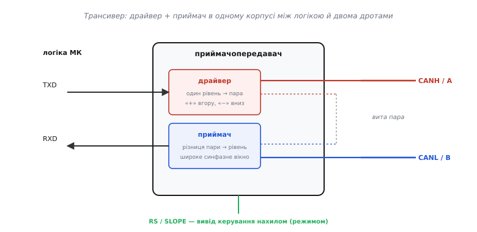
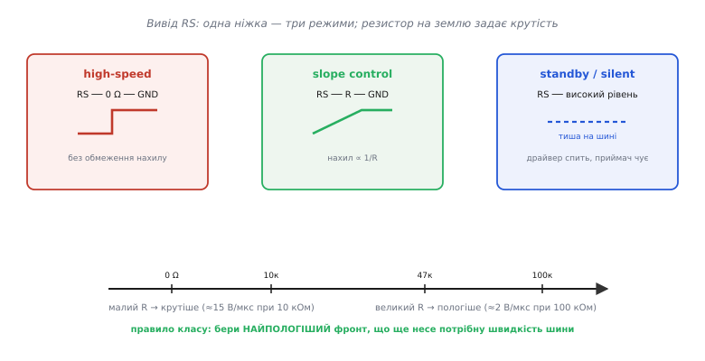
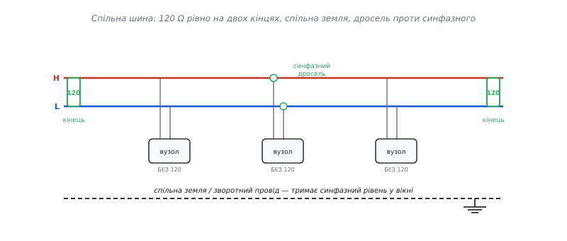

# 🔌 Інтерфейсні передавачі з керованим нахилом: чип, що жене пару в дріт повільно навмисно

Є цілий клас мікросхем, для яких **пологий фронт** — не побічний ефект і не компроміс, а закладена в кремній головна риса. Це інтерфейсні приймачопередавачі диференційних шин — ті, що виводять сигнал із тихої плати в довгий зашумлений дріт: автомобільну шину **CAN**, промислову **RS-485**, мережу давачів по будівлі. Розгляньмо їх не як науку про диференційну передачу взагалі, а **з боку плати**: який це клас пристроїв, з яких блоків він зібраний, що стирчить на його ногах, як його підключити, як «оживити» вперше — і де саме на ньому інженери спотикаються знов і знов. Партномерів тут не буде: усе, що нижче, однакове для будь-якого виробника, бо випливає з одного спільного набору вимог класу, а конкретні родини — лише його втілення.

І перша, визначальна вимога — та, задля якої цей клас узагалі має вивід керування нахилом. Сигнал тут не лишається на платі: він **біжить дротом на метри крізь електромагнітний бруд** — іскри запалювання, силові перетворювачі, мотори, рації. У такому середовищі різкий фронт перетворює саму шину на антену: круте перемикання жене кидок струму крізь паразитні ємність та [індуктивність](root:ph-electromagnetism/inductance) дроту, і той **випромінює заваду** й дзвенить на кожному краю. Тому фронти тут **навмисно роблять пологими** — рівно настільки пологими, наскільки дозволяє швидкість шини. Це не «драйвер слабкий» — це драйвер, у якого крутість фронту зроблено **керованою величиною**, з окремим виводом, щоб інженер виставив її під конкретну лінію.

> 🔧 **Навіщо це.** Цей клас — стандартний «вихід у зовнішній світ» скрізь, де сигнал мусить покинути спокій однієї плати й пройти дротом крізь завади: машина, цех, будівля, поле давачів. Усередині пристрою сигнали бігають однопровідно, швидко й тихо; щойно треба в довгий дріт — ставлять диференційний трансивер, і брудний світ між пристроями перестає псувати дані. А керований нахил — це той гвинт, яким виріб проходить сертифікацію на електромагнітну сумісність: пологіший фронт випромінює в рази менше, і часто саме резистор на виводі нахилу рятує вже готову плату без перепаювання.

## Що це за клас пристроїв

Диференційна передача — ідея; **приймачопередавач** — її втілення в одному корпусі. Усередині чипа живуть двоє: **драйвер**, що бере однопровідний логічний сигнал зсередини пристрою (один рівень відносно місцевої землі) і виставляє його на **два дроти дзеркально**; і **приймач**, що робить зворотне — знімає з двох дротів дві напруги й видає назад **одну**, рівну їхній різниці, відлічену вже від *його* землі. Драйвер жене, приймач слухає; логіка перемикає, хто зараз говорить.

Чому це окремий клас, а не просто «два буфери на корпус»? Через три речі, кожна з яких для звичайного логічного виходу зайва, а тут — обов'язкова.

Перше — **керований нахил фронту**, з якого ми почали. У звичайного вентиля фронт такий, який вийшов; тут він — окремий параметр із власним виводом, бо дріг довгий і завада реальна.

Друге — **широке синфазне вікно приймача**. Звичайний логічний вхід бачить лише вузьку смужку «0…живлення»: подай на нього напругу, вищу за живлення, — і він або нічого не зрозуміє, або згорить. Приймач цього класу мусить чесно віднімати навіть тоді, коли спільний рівень обох дротів **далеко відплив від нуля** — бо на метрах кабелю землі двох пристроїв неминуче розходяться, а наводка підіймає обидва дроти разом. Тому приймач RS-485 гарантує роботу, поки спільний рівень тримається щонайменше в межах **−7…+12 В** відносно його землі, а автомобільний CAN-приймач витримує ще ширше. Це вікно — тверда риса класу, і без нього передача розсипалася б на першому ж зсуві потенціалів. *(Усталений факт: діапазон синфазних напруг щонайменше −7…+12 В зафіксовано стандартом RS-485/TIA-485; сучасні промислові приймачі часто розширюють його далі.)*

Третє — **вбудований захист від зовнішнього світу**. Логічний вихід усередині плати нічого не боїться; вихід у дріт мусить пережити коротке замикання на живлення чи на землю, зустрічний драйвер, кидок напруги від сусіднього силового кола, розряд статики при монтажі. Тому в цей клас **вбудовують** обмеження струму, тепловий захист і стійкість виводів до напруг, що виходять далеко за живлення.

Ось контрольний тест, що відрізняє цей клас від простого буфера: якщо пристрою треба **вивести сигнал у довгий зовнішній дріг** із завадою — це трансивер із усіма трьома рисами; якщо сигнал лишається на платі — досить звичайного вентиля, і жодна з трьох рис не потрібна. Щойно бачите мікросхему з двома «товстими» виводами в роз'єм і виводом керування нахилом — знайте: усередині драйвер, приймач і оборона від зовнішнього світу.

## Блок-схема: що між логікою й двома дротами

Подивімося на типовий чип цілком — від логіки мікроконтролера до двох дротів пари.


*Приймачопередавач стоїть містком між двома світами. Ліворуч — логіка мікроконтролера: один вивід даних на передачу (TXD), один на прийом (RXD). Усередині корпусу драйвер перетворює логічний рівень на дзеркальну пару, приймач знімає з пари різницю й повертає логіці один рівень. Праворуч — два дроти у виту пару. Знизу окремо стирчить вивід RS/SLOPE — гвинт керування нахилом фронту й режимом чипа. Драйвер і приймач ділять ті самі два виводи до лінії (пунктир).*

Ланцюг читається так. Логіка передавача кладе біт на вивід TXD. Драйвер виставляє його на два дроти **протилежно**: коли CANH (плече «+», воно ж «A») іде вгору, CANL (плече «−», «B») іде вниз. Пара — вита пара — несе обидва дроти поряд, тримаючи наводку на них однаковою. На дальньому кінці приймач знімає обидві напруги, **віднімає** їх і віддає своїй логіці на вивід RXD чистий відновлений біт. А коли говорити має інший вузол — драйвер **відпускають** у високоомний стан, і пара вільна.

Три деталі на цій схемі коштовніші за решту й заслуговують окремої уваги: **вивід керування нахилом** (знизу), **синфазне вікно приймача** (те, що дозволяє йому чути крізь зсув земель) і **вбудований захист** (не намальований блоком, але присутній у кожному плечі драйвера). До них і перейдемо по черзі — але спершу про той вивід, задля якого весь цей клас потрапив у тему керування крутістю.

## Вивід керування нахилом: одна ніжка — три режими

Найхарактерніша ознака класу — окремий вивід, історично названий **RS** (від *slope* — «нахил»; у різних родин його звуть RS, SLOPE, S або STB). Він робить одразу дві споріднені справи: задає **крутість фронту** й перемикає **режим** чипа. І, що елегантно, обидві задачі керуються **одним резистором на землю** — без жодного цифрового інтерфейсу.


*Одна ніжка, три ролі. Ліворуч: RS прямо на землю (0 Ω) — драйвер перемикає так різко, як може, без обмеження нахилу; це режим для короткої швидкої лінії. Посередині: резистор R між RS і землею — нахил стає керованим і **обернено пропорційним** опору (більший R → пологіший фронт). Праворуч: високий рівень на RS — чип у standby: драйвер спить, живлення мізерне, приймач лишається чути шину. Знизу шкала опору й типові крутості CAN-передавача.*

Розберімо всі три режими, бо саме тут ховається логіка вибору.

**High-speed — RS на землю.** З'єднай RS напряму з землею (нульовий резистор) — і вивідні транзистори драйвера перемикають **так швидко, як фізично можуть**, без жодного обмеження нахилу. Це режим для **короткої швидкої лінії**: біт короткий, дріт короткий, паразити малі, дзвону нема кому наробити, а швидкість потрібна. Тут крутість навмисно тримають максимальною.

**Slope control — резистор на землю.** Постав між RS і землею резистор — і крутість стає **керованою величиною**. Логіка проста й майже лінійна: **більший резистор → пологіший фронт → нижча крутість**. Механізм такий: спад напруги на цьому резисторі задає малий опорний струм усередині чипа, а вже цей струм визначає, наскільки швидко внутрішня схема заряджає й розряджає вивідні транзистори. Менше струму — повільніше наростає напруга на них — пологіший фронт на дротах. У типового CAN-передавача це виглядає так: резистор близько **10 кОм** дає крутість близько **15 В/мкс**, а **100 кОм** — уже близько **2 В/мкс**, увосьмеро пологіше. У швидших родин та сама механіка, але числа інші: 0 Ω дає близько 38 В/мкс, а 50 кОм — близько 4 В/мкс. *(Усталений факт: залежність «резистор на виводі нахилу → крутість» і ці порядки величин — стандартна риса CAN-передавачів зі slope control; точні числа різняться між родинами й наведені як типові.)*

**Standby / silent — керувальний рівень на RS.** Подай на той самий вивід (або на окремий вивід режиму S) **високий логічний рівень** — і чип іде в економний режим: драйвер **вимикається** зовсім, споживання падає до мікроамперів, але приймач **лишається активним** і далі слухає шину. Навіщо розділяти? Бо це два різні корисні стани. **Standby** — сон вузла, що зараз не потрібен, але має прокинутися, коли на шині щось з'явиться (у машині так дрімають десятки блоків, поки мережа тиха). **Silent / listen-only** («мовчазний / лише слухати») — режим, коли вузол **чує все, але сам не говорить**: діагностика, аналізатор шини, або спосіб **утримати несправний вузол** від того, щоб він заглушив усю мережу застряглим сигналом.

**Приклад (вибір резистора нахилу під швидкість шини).** Треба сповільнити фронти CAN-передавача до ~2 В/мкс, щоб зменшити випромінювання на повільній шині 125 кбіт/с у довгій проводці. Що поставити на вивід RS?

```c
// За типовим даташитом передавача: R ≈ 100 кОм → крутість ≈ 2 В/мкс.
// Резистор від виводу RS (SLOPE) до землі задає режим і нахил:
//
//   RS ── 0 Ω  ── GND     // high-speed: найкрутіші фронти, коротка швидка лінія
//   RS ── 100k ── GND     // slope: ~2 В/мкс, тиха далека лінія, мала завада
//   RS ── (високий рівень із МК) // standby: драйвер спить, приймач чує
//
// Ціль класу: НАЙПОЛОГІШИЙ фронт, що ще несе потрібну швидкість даних.
```

Один резистор на землю — і той самий передавач стає або «спринтером» для короткої швидкої лінії, або «тихоходом» для довгої зашумленої. Це той самий компроміс вікна крутості, тільки винесений назовні, під конкретну шину: крутість беруть **мінімальну, що ще несе потрібну швидкість даних**, бо кожен зайвий вольт-на-мікросекунду крутості на метрах дроту — це зайва завада задарма.

> 🔧 **Навіщо це.** Перш ніж паяти резистор нахилу, порахуй бітовий інтервал шини й візьми ціллю крутість, за якої фронт помітно коротший за біт, — але не крутіший. На 125 кбіт/с біт триває 8 мкс, тож пологі 2 В/мкс — розкіш запасу; на 1 Мбіт/с біт уже 1 мкс, і такий пологий фронт «з'їв» би пів біта — там ставлять крутіше або взагалі high-speed. Резистор нахилу — це буквально гвинт «швидкість шини ⇄ тиша в ефірі», і крутити його треба свідомо, а не ставити «як у сусіда».

## Синфазне вікно: чому приймач чує крізь зсув земель

Повернімося до другої коштовної деталі. Наводка, однакова на обох дротах, при відніманні **скорочується** — але приймач є реальною мікросхемою з власним живленням, і чесно віднімати він здатен лише доти, доки напруга **обох** дротів лишається в його робочому вікні. Це вікно й називають **допустимим синфазним діапазоном** (common-mode range).

Чому це тверда межа? Бо віднімач усередині приймача мусить «бачити» свої входи, а бачити він їх може лише в певному діапазоні напруг відносно своєї землі й живлення. Виповз спільний рівень за вікно — землі двох пристроїв розійшлися надто сильно, чи влучив потужний кидок — і вхідний каскад **упирається в стелю чи підлогу**: віднімання ламається, хоч різниця на дротах формально й правильна. Тому стандарти задають вікно **явно**. Промислова RS-485 гарантує роботу, поки спільний рівень тримається в **−7…+12 В** відносно землі приймача; автомобільний CAN тримає ще ширше, бо в машині зсуви земель і кидки більші.

Ось чому третій провід — **спільна земля** чи зворотний провід — не розкіш, а частина конструкції. Він тримає синфазний рівень двох пристроїв **близько**, не даючи йому випливти за вікно. Лінію без спільної землі між пристроями з власними джерелами легко «викинути» за синфазний діапазон першим же зсувом потенціалів — і вона замовкне, дарма що дроти й приймач справні. А коли землі можуть розійтися **аж занадто** (різні силові щити, медичне обладнання, висока напруга поряд), спільної землі вже мало — тоді беруть **ізольований** трансивер, що рве спільну землю бар'єром і дає кожному боку свій нуль, знімаючи питання синфазного вікна взагалі.

> 🔧 **Навіщо це.** «Шина працює на столі, а в цеху між двома щитами мовчить» — майже завжди це вихід за синфазне вікно: землі щитів розійшлися на десятки вольтів, і приймач уперся. Лік не в тому, щоб міняти чип, а в тому, щоб **дати спільну землю** (тягнути третій провід чи екран разом із парою), а де зсув завеликий — ставити ізолятор. Хто цього не знає, місяцями підозрює «поганий кабель», хоча кабель ні до чого.

## Вбудований захист: чому цей клас переживає те, від чого гине вентиль

Вихід у зовнішній дріт — це вихід у світ, де все може статися: хтось закоротить дріт на живлення чи на землю, два вузли ввімкнуть драйвери одночасно й почнуть битися струмами, сусіднє силове коло наведе кидок напруги, монтажник торкнеться роз'єму зарядженим статикою пальцем. Звичайний логічний вихід від будь-якого з цих випадків згорів би. Тому в цей клас **вбудовують** оборону, і вона теж — визначальна риса.

**Обмеження струму драйвера.** Замкнули дріт на землю чи на живлення — драйвер не намагається прогнати нескінченний струм і згоріти, а **впирається в стелю**: віддає лише обмежений струм короткого замикання й тримає його, поки коротке не зникне. Плече лишається цілим.

**Тепловий захист.** Якщо коротке тримається довго й чип починає перегріватися, спрацьовує **теплове вимкнення**: драйвер відключається, доки кристал не охолоне. Це остання лінія оборони на випадок, коли обмеженого струму замало, щоб не зваритися.

**Стійкість виводів за межі живлення.** Виводи в дріт витримують напруги, що виходять **далеко за живлення чипа** — і вгору, і в мінус. Промислові й автомобільні родини тримають на дротах десятки вольтів будь-якої полярності (типово ±40…±58 В у захищених версіях), бо в машині чи цеху кидок такого порядку — буденність.

**Захист від застряглого сигналу (dominant timeout).** Найкпідступніший збій — коли **власна логіка зависла** й тримає TXD у стані, що займає шину, назавжди (для CAN це «домінантний» стан, який перебиває всіх). Один такий вузол глушить **усю мережу**. Тому в чип вбудовують **сторожовий таймер**: якщо TXD тримає займальний рівень довше за граничний час, драйвер **сам себе вимикає** й відпускає шину — хай зіпсувався один вузол, але мережа живе. Це саме той механізм, що стоїть за режимом silent: не дати одному хворому заглушити всіх.

Ці чотири речі й роблять трансивер трансивером, а не буфером. Вентиль усередині плати нічого з цього не має, бо йому нічого й не загрожує; трансивер має все, бо стоїть на межі з ворожим світом.

## Типова розпіновка: чотири логічні ноги й дві силові

Зовні клас на диво одноманітний — розпіновку базового трансивера впізнаєш із першого погляду, і в CAN, і в RS-485 вона по суті та сама. З одного боку корпусу — **логіка** (в мікроконтролер), з іншого — **лінія** (у дріт).

З боку логіки:

- **вхід даних на передачу** (TXD у CAN, DI — *driver input* — у RS-485): той єдиний біт, що його гнати в лінію;
- **вихід даних із прийому** (RXD у CAN, RO — *receiver output* — у RS-485): відновлений логічний рівень для місцевої логіки;
- **дозвіл драйвера** (driver enable): вмикає драйвер або **відпускає** його у високоомний стан, щоб по спільній парі міг говорити хтось інший;
- **дозвіл/режим** (receiver enable у RS-485; RS/S/STB у CAN): вмикає приймач, глушить його, або переводить чип у standby/silent.

З боку лінії:

- **два дроти пари** — CANH і CANL у CAN; A і B (їх же звуть D+ і D−) у RS-485;
- **живлення й земля** чипа.

У RS-485 дозволи драйвера й приймача часто зводять так, що напівдуплексна шина керується парою виводів DE/RE, а нерідко їх ще й **з'єднують в один** вивід «напрямок»: один рівень — говори, інший — слухай. У CAN роль «режиму» бере на себе вже знайомий вивід RS/S. Але кістяк однаковий: **чотири логічні ноги** (два дані, два керування) плюс **дві силові** в дріт плюс живлення. Побачив таку розкладку — можеш не дивитися на партномер, підключення вже зрозуміле.

## Підключення: як завести пару в шину

Підключення двох пристроїв елементарне за принципом і вимогливе за трьома дрібницями, кожна з яких — окрема граблина, якщо про неї забути.

**Плече до плеча однойменно.** CANH одного вузла йде до CANH усіх інших; CANL — до CANL. У RS-485: A до A, B до B. Переплутав місцями на якомусь вузлі — і його приймач відніматиме навпаки, читаючи суцільну помилку.

**Термінатор — рівно два, на двох кінцях.** Швидкий сигнал біжить парою як **хвиля**, і пара поводиться як [лінія передачі](root:hw-analog/power-matching) з власним хвильовим опором Z₀ — для типової витої пари це близько **120 Ом** (диференційно). Якщо кінець лінії не узгоджено цим опором, хвиля доходить до кінця й **відбивається** назад, накладаючись на сигнал, — виходить дзвін і хибні перемикання. Лік класичний: поставити на кінці резистор, що **дорівнює** Z₀, — тоді хвиля поглинається без відбиття. Для диференційної пари це резистор **між двома дротами**, і саме тому стандарт вимагає **120 Ом**. Ключове: термінаторів **рівно два**, і стоять вони на двох **найдальших фізичних кінцях** шини. Два по 120 Ом на кінцях дають паралельно 60 Ом — навантаження, під яке драйвери й розраховані.

**Спільна земля.** Тягнути третій провід (чи екран) разом із парою — щоб синфазний рівень вузлів не розбігся за вікно приймача.


*Правильна топологія багатоточкової шини. Дві лінії пари (H і L) тягнуться від кінця до кінця; термінатор 120 Ом стоїть **лише на двох найдальших кінцях**, а вузли посередині чіпляються короткими відводами **без** власного термінатора. Знизу — спільна земля (зворотний провід), що тримає синфазний рівень усіх вузлів у вікні приймача. Біля одного вузла — синфазний дросель, що гасить наводку, спільну для обох дротів.*

Найчастіша помилка тут — термінатор **на кожному вузлі** замість двох на кінцях. Логіка новачка («у мене п'ять пристроїв — поставлю п'ять термінаторів») **вбиває** шину: кожен зайвий резистор — це зайве навантаження, п'ять по 120 Ом дають паралельно 24 Ом, драйвер такого не тягне, розмах просідає, шина мовчить. Думати треба не «термінатор на пристрій», а «термінатор на **кінець дроту**», а кінців рівно два.

> 🔧 **Навіщо це.** Перше, що перевіряють на неробочій шині, — **термінація**: увімкни живлення, вимкни всі драйвери й заміряй омметром опір між двома дротами. Має вийти близько **60 Ом** (два по 120 паралельно). Вийшло 120 — забули один термінатор (лінія дзвенітиме); вийшло 20–30 — термінаторів наставили забагато (драйвери задихаються); вийшло майже нескінченність — жодного (на швидкій лінії суцільний дзвін). Ця одна цифра — 60 Ом між дротами — діагностує половину бід топології за десять секунд.

## Idle-стан і failsafe: щоб приймач не «шумів», коли всі мовчать

Є тонкість, на якій новачки гублять години. Коли на напівдуплексній шині **ніхто не передає** — усі драйвери відпущено у високоомний стан, — пара лишається «висіти» без визначеного рівня. Диференційна напруга на ній близька до нуля, а це саме та зона невизначеності, де приймач не знає, «0» там чи «1». Входи ловлять наводку, і вихід приймача **тремтить** випадковими бітами. Для мовчазної шини це катастрофа: приймач бачить сміття там, де має бути спокійна «одиниця» лінії неробочого стану.

Лік — **зміщення в безпечний стан** (failsafe biasing). На шину додають легку підтяжку: пару зовнішніх резисторів, що в спокої **зсувають** диференційну напругу в бік упевненої «одиниці» (у RS-485 — щоб різниця A−B була завідомо додатною й за порогом приймача). Тоді, коли всі мовчать, приймач бачить чистий idle-рівень, а не тремтіння. Тонкість: ці зміщувальні резистори стоять **паралельно** термінації, тож їх підбирають так, щоб сумарне навантаження на шину все одно лишалося близько 120 Ом на кінець — інакше зіб'ється узгодження. Сучасніші приймачі мають **внутрішній failsafe**: їхній поріг навмисно зсунуто так, що при нулі різниці (обрив, тиша, коротке) вихід сам стає «одиницею» — тоді зовнішні резистори не потрібні. *(Усталений факт: потреба у failsafe-зміщенні для визначеного idle-стану й «повний failsafe» зі зсувом порогу приймача — стандартні поняття практики RS-485.)*

## Перший байт: як оживити шину вперше

Зібрали два вузли на такому трансивері — як перевірити, що канал живий, перш ніж пускати по ньому дані? Послідовність запуску класу завжди та сама, і кожен крок сам себе пояснює.

**Подайте живлення й виставте режим.** На обидва чипи — живлення. Вивід нахилу/режиму — у робочий стан (RS на землю через потрібний резистор, не в standby). На передавачі — дозвіл драйвера активний; на приймачі — «слухати».

**Заміряйте спокій на парі — це «перший показ».** Не передаючи нічого, гляньте, що на дротах у idle. У CAN обидва дроти в спокої сидять близько середини живлення (recessive — «поступливий» стан, різниця ≈ 0). У RS-485 із failsafe-зміщенням на парі стоїть невелика **стала** диференційна напруга потрібної полярності. Тремтить різниця в спокої або гуляє нулем без failsafe — це нормальна ознака невизначеного idle, і саме тут ставлять зміщення.

**Смикніть сигнал — простежте його на тому кінці.** Подайте на вхід даних передавача повільний меандр; на виході даних приймача має з'явитися **той самий** меандр. З'явився **інвертований** — переплутані плечі (H↔L або A↔B). Не з'явився зовсім — перевіряйте дозвіл драйвера, термінацію (ті самі 60 Ом) і спільну землю.

**Перевірте, що шина відпускається.** На напівдуплексі зніміть дозвіл драйвера на передавачі — пара має **відпуститися** (перейти в idle-рівень), звільнивши лінію для інших. Не відпускається — драйвер завис активним; на реальній шині це заглушило б усіх.

Здоровий стан, отже, читається кількома простими діями: **визначений idle на парі, меандр доходить незіпсованим, 60 Ом між дротами, драйвер відпускається за командою**. Усе інше — деталі протоколу.

## Типові граблі класу

Збираючи шину на цьому класі, спотикаються на тому самому. Кожна граблина має чіткий механізм — тож і лік до неї однозначний.

- **Термінатор на кожному вузлі замість двох на кінцях.** П'ять по 120 Ом паралельно — це 24 Ом; драйвер задихається, розмах просідає, шина мовчить або збоїть під навантаженням. **Ознака:** між дротами замість ~60 Ом виходить 20–30. **Лік:** рівно **два** термінатори по 120 Ом на двох **найдальших кінцях**; вузли посередині — без термінатора.
- **Термінатора взагалі нема (або він не на кінці).** Швидка лінія **дзвенить**, на фронтах сходинки, приймач ловить хибні перемикання. **Ознака:** між дротами ~120 Ом (один термінатор) чи нескінченність (жодного); осцилограф показує дзвін. **Лік:** два по 120 Ом на кінцях; на **дуже повільній і короткій** лінії, де фронт довший за пробіг хвилі, термінація не потрібна взагалі.
- **Нема спільної землі — вихід за синфазне вікно.** Землі вузлів розійшлися за діапазон приймача (−7…+12 В для RS-485) — віднімання ламається, хоч різниця формально правильна; шина «мовчить у полі, а на столі працює». **Лік:** тягнути спільну землю/екран разом із парою; за великих зсувів між щитами — **ізольований** трансивер.
- **Висяча пара в idle — приймач «шумить».** Усі драйвери відпущено, пара ні до чого не підтягнута — приймач **тремтить** від наводки, видаючи сміття, коли всі мовчать. **Лік:** failsafe-зміщення (зовнішні резистори, підібрані під 120 Ом) або приймач із **внутрішнім** failsafe.
- **Переплутані плечі H↔L (A↔B) на одному вузлі.** Його приймач віднімає навпаки — суцільна помилка; меандр приходить **інвертованим**. **Лік:** однойменно — H до H, L до L; звіряти маркування дротів на кожному роз'ємі.
- **Два драйвери одночасно на напівдуплексі.** Хтось не зняв дозвіл драйвера вчасно — два драйвери **б'ються** за пару, женуть зустрічні струми, гріються; рятує лише вбудоване обмеження струму й dominant-timeout, але дані в цей час гинуть. **Лік:** перемикати напрямок рівно навколо передачі — підняв дозвіл → відіслав → дочекався, поки останній біт **фізично вийшов** → зняв дозвіл.
- **Фронти надто круті — плата не проходить на завади.** Поставили high-speed (RS на землю) на довгій лінії «щоб напевно» — і шина фонить, дзвенить, валить сертифікацію [електромагнітної сумісності](root:hw-power/emc-filtering). **Ознака:** осцилограф показує викиди й дзвін на фронтах; приймач поряд ловить наводку. **Лік:** поставити на RS резистор нахилу під реальну швидкість шини — пологіший фронт у рази менше випромінює.
- **Синфазна наводка на довгій парі.** На метрах кабелю зовнішнє поле наводить на **обидва** дроти однаковий сигнал; якщо його забагато, він підіймає спільний рівень до краю синфазного вікна. **Лік:** [синфазний дросель](root:hw-analog/common-mode-noise/comp-common-mode-choke.md) біля роз'єму — він гасить спільну для обох дротів наводку, майже не чіпаючи корисної різниці; плюс кручення пари й екран.

## Варіації класу

Під одну вивіску «інтерфейсний трансивер диференційної шини» збирають кілька різновидів — корисно бачити, чим вони різняться, бо вибір диктує не мода, а конкретна задача.

За **шиною й кодуванням рівнів**. **CAN** — дротовий «монтажний І»: один займальний (домінантний) стан **перебиває** поступливий, і на цьому побудовано розв'язання конфліктів, коли кілька вузлів говорять разом; дроти CANH/CANL у спокої сходяться до середини живлення. **RS-485** — простіша двоточкова диференційна пара A/B без дротового «І», з явним керуванням напрямком через DE/RE; вона дозволяє більше вузлів і швидкість, але вимагає, щоб протокол сам стежив, чия черга говорити. Механіка трансивера (драйвер, приймач, синфазне вікно, захист) у них спільна — різниться логіка шини, що на ньому працює. Обидві шини мають власні статті: [шина RS-485](root:com-medium/rs-485-multidrop-bus) розібрана окремо.

За **напрямком і дуплексом**. Чистий **драйвер** (лише жене) чи чистий **приймач** (лише слухає) — для повного дуплексу на двох окремих парах; **трансивер** (обидва в корпусі з перемиканням) — для напівдуплексу по одній парі. CAN майже завжди трансивер по одній парі; RS-485 буває і напівдуплексним (одна пара, DE/RE перемикає), і повнодуплексним (дві пари, кожна в один бік).

За **керуванням нахилом**. Одні родини мають вивід RS/SLOPE із плавним аналоговим заданням крутості резистором (те, з чого ми почали); інші — лише кілька фіксованих режимів (high-speed / standby без плавного нахилу); треті задають крутість **цифрово**, регістром через додатковий інтерфейс. Що повільніша й довша цільова лінія — то важливіше мати тонке керування нахилом.

За **глибиною захисту й діагностики**. Базовий трансивер має обмеження струму й тепловий захист; **захищені** (fault-protected) версії додають стійкість виводів до великих напруг (±40…±58 В), захист від переполюсування живлення, dominant-timeout; **діагностичні** — ще й повідомляють логіці про виявлені збої шини (обрив, коротке, перегрів). Що ворожіше середовище (машина, важка промисловість) — то товща оборона.

За **ізоляцією**. Звичайний трансивер гальванічно зв'язує логіку із шиною; **ізольований** має бар'єр (ємнісний, магнітний чи оптичний) між боком логіки й боком лінії, тож вони живляться нарізно й **не мають спільної землі** взагалі. Його беруть саме тоді, коли синфазний зсув гарантовано виповзе за будь-яке розумне вікно (різні потенціали щитів, медицина, висока напруга) — ізоляція знімає питання синфазного діапазону з коренем, ціною складнішого чипа й окремого живлення бар'єра.

Конкретні сімейства цього класу — з фіксованими партномерами, розпіновкою корпусу й точними числами захисту — живуть у [каталозі модулів зв'язку](root:com-medium/rs-485-multidrop-bus): там річ визначається продуктом, а тут ми лишаємося на рівні принципу.

Спільне в усіх варіацій одне, і воно повертає нас до початку: **драйвер кладе біт у різницю двох дротів пологим настільки, наскільки задав вивід нахилу; приймач цю різницю віднімає, поки спільний рівень тримається в його вікні; а вбудований захист береже виводи від ворожого світу за роз'ємом.** Зрозумів ці три речі — керований нахил, синфазне вікно, вбудовану оборону — і будь-який представник класу, від крихітного CAN-передавача до захищеного промислового RS-485, читається з першого погляду на його ноги.
