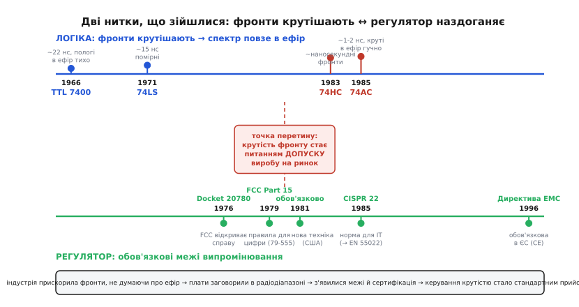

# 📜 Як фронти завалювали сертифікацію

Уявіть інженера кінця 1970-х, який щойно зібрав робочий комп'ютер. Логіка працює бездоганно: біти лічаться, пам'ять відповідає, екран малює. А потім у сусідній кімнаті вмикають телевізор — і по картинці біжать хвилі перешкод, диктор тоне в тріску. Комп'ютер не має антени, не передає нічого навмисне, він просто рахує — і все ж труїть ефір на пів будинку. Ця сцена повторювалася тисячі разів і врешті переросла в закон. А в самій її серцевині сиділа річ, яку тодішні розробники ще не звикли бачити ворогом: **крутість фронту** цифрового сигналу.

Ця історія — про те, як безневинний із виду параметр, швидкість наростання напруги на ніжці, з технічної дрібнички став **головним джерелом проблем електромагнітної сумісності** цілої галузі. І як інженерна відповідь на цей клопіт — свідоме **пригальмовування фронтів** там, де швидкість не потрібна, — з хитрощів окремих майстрів перетворилася на стандартний, майже рефлекторний прийом, зашитий тепер у кожен мікроконтролер полем «output speed». Щоб зрозуміти, чому так вийшло, треба спершу побачити, чому саме крутий фронт світить в ефір.

### Чому саме фронт, а не тактова частота

Перша й найпоширеніша хиба інтуїції: здається, що фонить **швидка** плата — та, що цокає на високій частоті. Насправді джерело радіозавади — не так частота такту, як **крутість країв** сигналу. Причина суто в тому, як влаштований спектр прямокутного імпульсу.

Реальний цифровий сигнал — не ідеальна вертикальна стінка, а **трапеція** з похилими боками. І хоча повторюється вона з тактовою частотою, її гострі краї вимагають для свого складання дуже високих гармонік — синусоїд у десятки й сотні разів вищих за такт. Верхню межу, до якої спектр іще відчутно «світить», задає час фронту, а не період:

```
верхня межа спектра:   f ≈ 1 / (π · τ)

   τ — час фронту (наростання/спаду)
   вище f спектр швидко згасає
```

Ось звідки береться контрінтуїтивна річ: плата може цокати помірні 4 мегагерци, але якщо її фронти по одній наносекунді, спектр тягнеться на сотні мегагерц — просто в діапазон FM-радіо й телебачення. Механізм, чому саме час фронту, а не висота імпульсу, керує цією межею, виведено крок за кроком у [спектрі трапеції](topic:hw-digital/slew-rate-gpio/math-trapezoid-spectrum.md); тут важливий лише висновок: **зробив фронт крутішим — підняв верхню межу спектра, і плата фонить вище й гучніше.**

Тепер ключ до всієї історії. Наприкінці 1970-х індустрія почала масово **прискорювати фронти** — і зробила це, навіть не думаючи про ефір. А коли фронти покрутішали, спектр поповз угору — і тихі досі плати раптом заговорили в радіодіапазоні.

### Марш логіки: від млявої TTL до наносекундних фронтів

Щоб оцінити стрибок, погляньмо на числа. Стандартна транзисторно-транзисторна логіка (TTL), яку Texas Instruments вивела на масовий ринок у 1966 році серією 7400, була за нинішніми мірками **млявою**: типова затримка вентиля близько 22 наносекунд, і фронти під стать — розтягнуті, пологі. Наступний масовий крок, маловитратна Шотткі-логіка (74LS) 1971 року, підтягнув затримку до ~15 нс, але фронти лишалися відносно спокійними. Пологий фронт означав низьку верхню межу спектра — і такі плати, за всієї своєї «повільності», в ефір майже не світили. Не тому, що інженери про це дбали, а просто тому, що фізика повільного біполярного виходу сама тримала спектр унизу.

> 🔧 **Навіщо це.** Стара TTL «не фонила» не через якусь мудрість розробників, а через власну неквапливість. Це важливий урок і сьогодні: коли берете стару, повільну деталь чи навмисне сповільнюєте вихід, ви задарма отримуєте тихий спектр. Швидкість завжди коштує ефіру — і навпаки, повільність його береже.

А далі почалася гонка за швидкодією, і вона все змінила. Прихід високошвидкісної КМОН-логіки (74HC/HCT) близько 1983 року, а тоді «просунутої» КМОН (74AC/ACT) у 1985-му, стиснув затримку вентиля до ~8 нс — але головне сталося не із затримкою, а з **фронтами**. КМОН-вихід — це два транзистори, що жорстко тягнуть лінію то до живлення, то до землі; його фронти вийшли **наносекундними**, разів у п'ять-десять крутішими за стару TTL. Довідники того часу вже прямо попереджали біля родини 74AC: «виходи можуть спричиняти [стрибок землі](topic:hw-pcb/ground-bounce)» — характеристика, якої в описах спокійної TTL просто не було потреби згадувати.

І тут криється підступ, який довго збивав інженерів із пантелику. Заміняючи стару TTL на нову КМОН «пін-у-пін», розробник міняв логічно **те саме** — той самий вентиль І-НЕ, ту саму цоколівку, ту саму напругу. Схема працювала точно як раніше, тільки швидше й холодніше. Але непомітно, поза його увагою, крутість фронтів зросла в рази — а разом із нею й спектр поповз у радіодіапазон. Плата, що вчора проходила будь-яку перевірку, сьогодні раптом починала фонити — і винною була не логіка, а **невидима зміна нахилу країв**. Різні підродини логіки — саме про ці приховані електричні відмінності за однаковою логікою; докладніше в [підродинах логіки](topic:hw-digital/logic-subfamilies).

```
                       затримка     фронти        спектр в ефір
   TTL 7400 (1966)     ~22 нс       пологі        низько, тихо
   74LS   (1971)       ~15 нс       помірні       низько
   74HC   (1983)       ~15 нс       ~наносекундні вище
   74AC   (1985)       ~8 нс        круті, ~1-2 нс високо, гучно
```

Оце і є фізична передумова всієї подальшої історії: за якихось два десятиліття масова цифрова логіка **покрутішала фронтами на порядок**, а разом із фронтами злетів угору й спектр — і тихі колись плати заговорили там, де їх ніхто не кликав. Лишалося тільки, щоб цих плат стало **багато** й вони зайшли **в дім**.

### Комп'ютер приходить у дім — і псує сусідові телевізор

Наприкінці 1970-х сталося друге: обчислювальна техніка з машинних залів масово ринула в помешкання. Altair 8800, Apple II, Commodore PET, TRS-80 — перші персональні комп'ютери стояли тепер у вітальнях, поруч із телевізором і радіоприймачем. І кожен із них був недорого зроблена коробка з цифровою логікою, чиї фронти вже покрутішали, а екранування ще ніхто всерйоз не робив.

Наслідок був негайний і скандальний. Altair 8800, скажімо, так рясно світив в ефір, що його перетворювали на **радіоджерело навмисне**: тримали приймач поруч і слухали, як машина «награє» мелодії перешкодами під час обчислень — фокус, який тішив ентузіастів, але чудово ілюстрував масштаб витоку. Для сусіда за стіною той самий витік був не фокусом, а зіпсованим вечором: комп'ютер в одній квартирі глушив телевізор і радіо в іншій.

Аварійна лампа для регулятора вже й так горіла з іншого боку. До 1977 року скарги на перешкоди від громадянського радіозв'язку (CB-радіо, тодішня масова забавка) становили **83 відсотки всіх скарг** на завади телебаченню, що надходили до американської Федеральної комісії зв'язку (FCC). Комісія боляче обпеклася на цій хвилі — і, побачивши, як у дім суне ще й армія комп'ютерів із таким самим потенціалом гидити ефір, вирішила не чекати другої катастрофи, а діяти на випередження.

> 🔧 **Навіщо це.** Ось чому електромагнітна сумісність — це не про «мою плату», а про **сусіда**. Ваш пристрій може працювати бездоганно й нікому в корпусі не заважати — і все одно бути поза законом, якщо він труїть ефір навколо. Регулятор захищає не вас, а того, хто поруч намагається дивитися телевізор чи слухати радіо. Тому межі виражені в мікровольтах на метр на відстані — це про поле, яке ваш виріб виливає **назовні**.

### Народження меж: FCC Part 15 і європейські норми

Юридичний каркас для таких обмежень уже існував, і був він давній. Ще 1938 року головний інженер FCC Юелл Джетт (Ewell Jett) провів думку: якщо радіовипромінювання пристрою досить слабке й короткосяжне, щоб не завдавати відчутної шкоди, — його можна не ліцензувати. З цієї ідеї виріс **Part 15** — розділ правил для пристроїв, що випромінюють радіочастоти ненавмисно (*unintentional radiators*): не радіо, не передавач, а річ, чия мета зовсім інша, але яка все одно світить в ефір. Комп'ютер ліг сюди ідеально.

Готуючи ґрунт, FCC ще 1976 року відкрила справу (Docket 20780) про пристрої з обмеженим випромінюванням, а технічну основу для меж напрацювала галузева асоціація виробників — **CBEMA** (Computer and Business Equipment Manufacturers Association). За її дослідженнями комісія у **вересні 1979 року** ухвалила нові правила для цифрової техніки, комп'ютерів насамперед. Рушій рішення комісія висловила без манівців у самому тексті (документ FCC 79-555):

> «Ми найбільше зацікавлені захистити людину, яка отримує перешкоди від комп'ютера свого сусіда. Меншою мірою нас турбують пристрої в тому самому помешканні.»

І поруч — застереження, чому не можна зволікати: без негайних заходів галузь напореться на «нестерпну проблему перешкод, подібну до перешкод від CB-радіо». Пам'ять про 83 відсотки скарг була ще свіжа.

Правила ввели поділ, що живий і досі. **Class A** — техніка для промислового й офісного середовища, де сусід-приймач далеко; межі м'якші. **Class B** — техніка для дому, той самий персональний комп'ютер поруч із телевізором; межі приблизно на **10 децибелів суворіші**. Логіка поділу відверто побутова: для Class B навіть відстань вимірювання поля взяли меншою (3 метри), моделюючи типову ситуацію — маленький комп'ютер у конторі й телевізор у сусідній квартирі за стіною. Набирали чинності норми поступово: для нової техніки з жовтня 1981-го, для раніше випущеної — з жовтня 1983-го.

Європа пішла тим самим шляхом, лише трохи згодом і ширше. Міжнародний комітет CISPR ще 1985 року видав норму для інформаційно-технічного обладнання — **CISPR 22**, що задавала межі випромінюваних і кондуктивних завад; у Європейському Союзі її прийняли як стандарт **EN 55022**. А парасольковий закон — Директива про електромагнітну сумісність (89/336/EEC) — вийшов у травні 1989 року й після відтермінувань став **обов'язковим із 1 січня 1996-го**: відтоді відповідна техніка на ринку ЄС мусить відповідати нормам і нести знак CE. Європейський підхід був навіть вимогливіший за американський: він регулював не лише **випромінювання** (скільки шуму виріб виливає назовні), а й **несприйнятливість** (наскільки сам виріб стійкий до чужих завад) — але джерело випромінюваної частини лишалося тим самим, що й у FCC: гармоніки цифрових тактів і крутих фронтів.

Так по обидва боки Атлантики над кожним цифровим виробом виросла **обов'язкова брама**: перш ніж продати, треба довести в акредитованій лабораторії, що плата не світить в ефір понад межу. І ось тут крутість фронту з внутрішньої дрібнички перетворилася на **питання допуску виробу на ринок**.


*Дві нитки, що зійшлися. Згори — логіка крутішає фронтами: від пологої TTL 1966-го через 74HC до наносекундних фронтів 74AC 1985-го, і разом із фронтами верхня межа спектра повзе в радіодіапазон. Знизу — регулятор наздоганяє: справа FCC (1976), правила Part 15 для цифрової техніки (вересень 1979), обов'язкові дати (1981-1983), європейські CISPR 22 (1985) та Директива EMC, обов'язкова з 1996. Точка перетину — момент, коли крутість фронту стала питанням допуску виробу на ринок.*

### Коли виріб топить сам його GPIO

Тепер — суть, заради якої вся розповідь. Із появою обов'язкової сертифікації інженери раз за разом натрапляли на той самий болючий сценарій: виріб працює бездоганно, робить усе, що має, — і **провалює вимірювання випромінювання** на кілька децибелів. Не через погану схему, не через помилку в логіці, а лише тому, що якийсь тактовий сигнал чи шина мають **надто круті фронти** й світять гармоніками понад межу.

Класична картина в лабораторії виглядає так. Аналізатор спектра показує вузькі піки, що вилазять за лінію межі, і всі — на кратних частотах якогось одного такту. Метод виключення (по черзі відмикати джерела) виводить на винуватця: скажімо, тактова лінія звукової шини на 12.768 МГц, чиї гармоніки навколо ~37 МГц пробивають межу. Перша спроба — почепити [конденсатор-фільтр](topic:hw-power/emc-filtering) — часто **не дає нічого**: заваду породжує не так живлення, як самі круті краї сигналу. І тоді інженери беруться за єдиний по-справжньому дієвий важіль — **пригальмувати фронт у самому джерелі**.

Роблять це послідовним елементом у лінію: резистором, а частіше — феритовою намистиною, що м'яко з'їдає найвищі гармоніки. У типовому такому випадку заміна на феритову намистину ~300 Ом на тактовій доріжці роняла завади на 5-10 децибелів — і виріб, який щойно провалював норму, раптом її проходив. Жодного перепаювання плати, жодного екрана: просто **пологіший фронт** там, де круті краї були непотрібні. Той самий фізичний важіль, що керує стрибком землі й дзвоном на платі, виявився й ліками від провалу на сертифікації — бо всі три біди ростуть із одного кореня, великого dV/dt.

> 🔧 **Навіщо це.** Ось чому «завалити ЕМС» — це часто не катастрофа конструкції, а недогляд у налаштуванні кількох ніжок. Найдешевший і найперший хід, коли виріб фонить, — знайти найкрутіші фронти, які насправді **не потребують** такої швидкості (повільні керувальні лінії, службові такти), і пригальмувати їх: послідовний резистор, феритова намистина, нижча сходинка «output speed» у регістрі. Дуже часто цих кількох децибелів рівно й бракувало, щоб пройти. Крутість треба тримати мінімальною, що ще несе потрібну швидкість даних, — не «про всяк випадок якнайшвидше».

Виробники персоналок 1980-х проходили цю школу дорого й публічно. Готуючись до жовтня 1981-го, Apple випустила Apple II Plus і згодом IIe вже з поліпшеним екрануванням; Atari 800 несла щедрий метал усередині, аж до екранованих гнізд картриджів. А Apple III довелося відкликати й доопрацьовувати саме через недостатнє радіоекранування. Кожен такий випадок утовкмачував галузі одну думку: витік в ефір треба закладати в конструкцію **з самого початку** — і найтонший, найдешевший інструмент тут не мідний екран і не фільтр, а **керування крутістю фронтів**.

### Чому пригальмовування фронту стало стандартним прийомом

Зведімо нитку. Спершу індустрія, женучись за швидкодією, непомітно **покрутішала фронти** цифрової логіки на порядок — від пологої TTL до наносекундної КМОН. Потім ця техніка масово зайшла **в дім** і почала труїти ефір сусідам. Регулятор відповів **обов'язковими межами** — FCC Part 15 у США, CISPR/EN у Європі — і поставив над кожним виробом браму сертифікації. І за цією брамою розробники раз за разом провалювалися **саме через круті фронти**, а рятувалися **пригальмовуванням** цих фронтів у джерелі.

З цього кола причин і випливло те, що сьогодні здається очевидним: **керування крутістю фронту стало базовим інженерним прийомом**, а не екзотикою. Спершу — окремими хитрощами (послідовний резистор, феритова намистина на найгарячіших лініях). Потім виробники мікросхем зрозуміли: краще дати цей важіль прямо в чипі — і почали закладати у виходи **регульовану крутість**. Так з'явилися поля «output speed» / «slew rate» у регістрах налаштування ніжок, знайомі за [керуванням крутістю фронту](topic:hw-digital/slew-rate-control): кілька сходинок нахилу, з яких прикладник вибирає **найповільнішу, що ще встигає** за його даними. Це прямий нащадок тих лабораторних провалів: важіль, колись прикручуваний зовні паяльником, тепер стоїть усередині кремнію й вмикається одним записом у регістр.

Мораль історії коротка. Крутість фронту здається технічною дрібничкою — одне число, В/нс. Але саме воно колись зробило цифрову електроніку головним забруднювачем ефіру, породило цілий пласт законів і випробувальних лабораторій, і врешті прописалося окремим полем у кожному сучасному мікроконтролері. Коли ви ставите ніжці нижчу швидкість, бо «даним і так вистачає», — ви повторюєте той самий хід, яким інженери 1980-х витягали свої вироби із сертифікаційної ями. Тільки тепер це коштує не феритової намистини й тижня в лабораторії, а двох бітів у регістрі.
