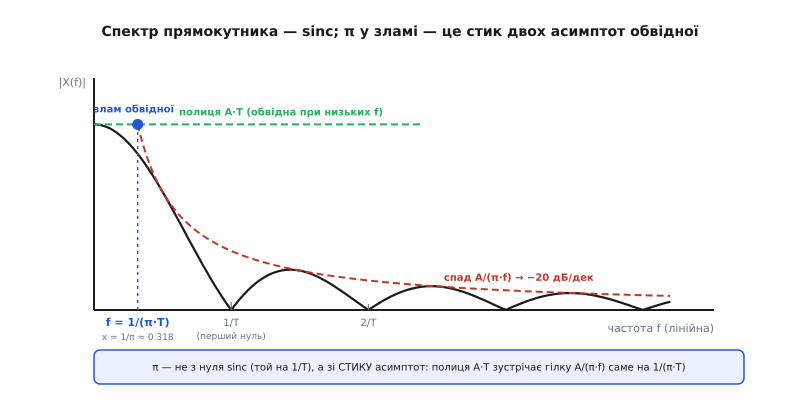
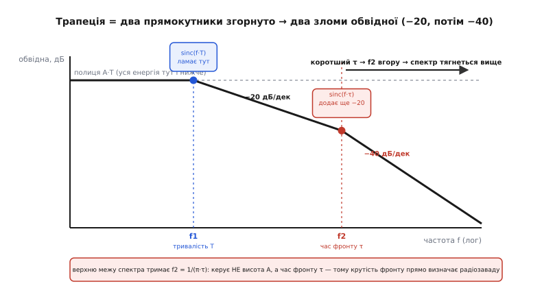

# 🧮 Спектр трапеції: звідки 1/(π·τ)

У самій темі спектр трапецієподібного імпульсу подано як готову картинку: обвідна пласка до першого зламу, тоді валиться на −20 децибелів на декаду, а від другого зламу — круто на −40 дБ/дек; злами сидять на f1 = 1/(π·T) і f2 = 1/(π·τ). Це правильна картинка, і нею користуються щодня. Але вона повна загадок. Звідки взявся **π** — число з геометрії кола — у формулі про цифрову ніжку? Чому зламів **два**, а не один чи три? Чому нахили саме −20 і −40, а не якісь інші? І головне для всієї теми: чому верхню межу спектра тримає **час фронту τ**, а не висота імпульсу — тобто чому крутість краю, а не розмах сигналу, визначає, скільки радіозавади ніжка випромінює?

Тут ми зберемо цю обвідну **з першопричин**. Не «є така формула», а: почнемо з голого прямокутника, порахуємо його спектр чесним інтегралом, побачимо, як з косинуса-синуса народжується π, тоді складемо трапецію з двох прямокутників — і другий злам випаде сам. Наприкінці стане видно, чому саме τ керує стелею спектра, і як із цієї математики виростає інженерне поняття **knee-частоти** для оцінки завади. Апарат тут рівно той, що треба; кожну формулу ми **використаємо**, а не просто оголосимо.

## Спектр — це список синусоїд, яких вимагає сигнал

Почнімо з того, що взагалі означає «спектр імпульсу». [Ідея Фур'є](topic:math-analysis/fourier-idea) стверджує річ, спершу неймовірну: будь-який повторюваний сигнал — навіть різкий прямокутник із гострими кутами — можна точно скласти з суми чистих синусоїд різних частот. Не наблизити, а **скласти точно**, якщо синусоїд узяти досить (аж до нескінченності). Кожна синусоїда входить у суму зі своєю амплітудою; список цих амплітуд за частотами і є **спектр**.

Для повторюваного сигналу — а цифрова лінія, що знай перемикається, саме такий — набір потрібних частот не суцільний, а **дискретний**: лише кратні основній частоті повторення. Якщо імпульси йдуть із періодом Tp, то в сумі присутні тільки частоти f = k/Tp (k = 1, 2, 3, …) — це **[ряд Фур'є](topic:math-analysis/fourier-series)**, гребінець гармонік. Висоти цих гармонік не абиякі: вони лягають під плавну криву — **обвідну**. Саме форму обвідної ми й шукаємо, бо вона й каже, до якої частоти сигнал іще несе відчутну енергію, а де вже згасає.

Тут корисно розділити дві речі, які легко змішати. **Форма одного імпульсу** (наскільки він широкий, які в нього краї) задає **обвідну** — плавну криву, під якою сидять гармоніки. А **період повторення** Tp задає лише **частоту гребінця** — як густо стоять гармоніки під цією обвідною. Нас цікавить обвідна, тож зручно рахувати спектр **одного** імпульсу (його **перетворення Фур'є**), а не всього нескінченного ряду: обвідна ряду — це і є спектр одиночного імпульсу, лише «продегустований» у точках гребінця. Тому далі беремо один імпульс і питаємо: який у нього спектр?

> 🔧 **Навіщо це.** Розділення «форма ↔ період» одразу пояснює спостереження зі статті: плата може цокати помірну частоту (рідкий гребінець), а фонити на сотнях мегагерц — бо це задає **обвідна**, тобто форма й краї імпульсу, а не такт. Знизити такт — зсунути гребінець, але обвідна лишиться тягтися вгору. А от загладити край (збільшити τ) — прибрати верх самої обвідної. Ось чому боротьба з ЕМС ведеться за **крутість фронтів**, а не за тактову частоту.

## Крок перший: спектр голого прямокутника

Найпростіший імпульс — ідеальний прямокутник: висота A, ширина T, миттєві вертикальні краї. Порахуймо його спектр напряму, за означенням перетворення Фур'є. Перетворення питає, «скільки» синусоїди частоти f сидить у сигналі, і рахує це інтегралом добутку сигналу на комплексну синусоїду. Для прямокутника, що стоїть симетрично навколо нуля (від −T/2 до +T/2), інтеграл беруть тільки на ширині імпульсу, бо поза нею сигнал нульовий:

```
X(f) = ∫ A·e^(−j·2π·f·t) dt     (межі: від −T/2 до +T/2)
```

Показник e^(−j·2π·f·t) — це просто спосіб записати «косинус і синус частоти f» одним компактним символом (формула Ойлера: e^(jθ) = cosθ + j·sinθ). Інтеграл від такої експоненти — знову експонента, поділена на її показник:

```
X(f) = A · [ e^(−j·2π·f·t) / (−j·2π·f) ]   від t=−T/2 до t=+T/2
     = A · ( e^(−j·π·f·T) − e^(+j·π·f·T) ) / (−j·2π·f)
```

Ось **перша поява π**: вона вискочила механічно, коли межі ±T/2 підставилися в показник 2π·f·t — двійка з інтеграла зустрілася з T/2, лишилося π·f·T. Жодної геометрії кола ми не кликали; π тут — слід того, що синусоїда «замикається» через 2π, а половина ширини (T/2) внесла свою двійку. Далі згадаймо, що різниця двох спряжених експонент — це синус: e^(jθ) − e^(−jθ) = 2j·sinθ. Підставляємо θ = π·f·T:

```
X(f) = A · ( −2j·sin(π·f·T) ) / (−j·2π·f)
     = A · sin(π·f·T) / (π·f)
```

Мнимі одиниці й двійки скоротилися, лишився чистий дійсний результат. Домножимо й поділимо на T, щоб побачити знайому форму:

```
X(f) = A·T · sin(π·f·T) / (π·f·T)  =  A·T · sinc(f·T)
```

Це **sinc** (від лат. *sinus cardinalis* — «головний синус»): функція sin(πx)/(πx). Вона й описує спектр прямокутника. Розберімо її поведінку, бо в ній — уся суть.

**На нулі частоти** (f → 0) sinc прямує до одиниці (відомий факт: sin(малого кута)/(той самий кут) → 1), тож X(0) = A·T. Логічно: A·T — це **площа** імпульсу, а компонента на нульовій частоті — це просто середнє значення, помножене на «скільки триває». Це вершина спектра, рівень **полиці**.

**Нулі** sinc — там, де sin(π·f·T) = 0, тобто π·f·T = π, 2π, 3π… а отже на частотах f = 1/T, 2/T, 3/T… Спектр прямокутника — це низка **пелюсток**, що торкаються нуля на кратних 1/T.

**Верхи пелюсток спадають як 1/f.** Оскільки sin(…) гойдається між −1 і +1, стеля |X(f)| задана множником поза синусом: |X(f)| ≤ A·T / (π·f·T) = A/(π·f). Ось **обвідна**: вона падає обернено пропорційно до частоти. Удвічі вища частота — удвічі менша амплітуда. У децибелах (де кожна декада — це ×10 по частоті) спад «×1 на ×10» — це рівно **−20 дБ/декаду**. Ось звідки взявся перший нахил: він не «домовленість», а пряма арифметика 1/f-обвідної sinc.


*Спектр прямокутника ширини T у лінійних осях: пелюстки sinc з нулями на 1/T, 2/T… Обвідну задають дві асимптоти — пласка полиця A·T (низькі частоти) і спадна гілка A/(π·f) (високі, −20 дБ/дек). Вони перетинаються рівно на f = 1/(π·T), тобто на x = 1/π ≈ 0.318 — саме тут злам обвідної. Помітьте: злам НЕ збігається з першим нулем sinc (той на 1/T); π виринає зі стику асимптот, а не з нуля.*

## Звідки в зламі саме π

Тепер найтонше місце — і найчастіша плутанина. Обвідна прямокутника має **дві асимптоти**. При низьких частотах вона майже пласка на рівні A·T (полиця). При високих — це спадна гілка A/(π·f). Де ці дві прямі **перетинаються**, там і «злам» обвідної: нижче — вона пласка, вище — падає. Прирівняймо асимптоти й знайдімо точку стику:

```
A·T = A/(π·f)      →      π·f·T = 1      →      f = 1/(π·T)
```

Ось воно: **злам обвідної сидить на f1 = 1/(π·T)**, і π тут — не з геометрії, а з того самого sin(π·f·T), що дав гілку A/(π·f). Двійка, яка була в 2π·f·t, «з'їлася» половинною шириною T/2 ще на кроці підстановки меж — тому в кінцевій формулі стоїть π, а не 2π.

Чому це важливо не сплутати: **перший нуль** sinc — на f = 1/T, а **злам обвідної** — на f = 1/(π·T) ≈ 0.318/T, тобто **раніше**, приблизно на третині шляху до першого нуля. Це різні точки. Інженерна обвідна — це не сама зубчаста sinc, а її дві прямі-асимптоти; і поріг, від якого вона починає спадати, — саме 1/(π·T). Множник 1/π ≈ 0.318 — це просто координата перетину, і він переходить далі в усі формули зламів, зокрема й у ту, що керує завадою від фронту.

Варто розуміти, що 1/π тут — це **інженерна умовність вибору точки зламу**, а не єдина «правильна» межа. Спектр sinc спадає плавно; де саме провести «кут» ламаної-обвідної — питання зручності. Стик асимптот A·T і A/(π·f) дає природний і найпоширеніший вибір 1/(π·T). Тому в різних книгах трапляються й трохи інші множники (хтось бере 1/T як грубу межу, хтось — knee на 0.5/τ, про що нижче) — усі вони про ту саму частоту з точністю до сталого множника порядку одиниці. Суть не в третьому знаку, а в тому, **що** стоїть у знаменнику: тривалість — у першому зламі, час фронту — у другому.

## Крок другий: трапеція — це два прямокутники, згорнуті разом

Реальний цифровий імпульс не має вертикальних країв: він **трапеція** — пласка вершина, але похилі боки, що піднімаються за час фронту τ. Як дістати її спектр? Можна знову брати інтеграл — вийде громіздко. Є куди прозоріший шлях, і він одразу пояснює, звідки береться **другий** злам.

Придивімося до форми. Трапеція з плаcкою вершиною й лінійними скосами — це те, що виходить, коли **згорнути** (взяти [згортку](topic:com-signal/convolution)) два прямокутники різної ширини. Згортка — це операція «ковзного усереднення»: беремо один прямокутник і «розмазуємо» ним другий, посуваючи вздовж і додаючи перекриття. Якщо ширший прямокутник має ширину, пов'язану з тривалістю імпульсу, а вужчий — ширину τ, то їхня згортка дає рівно трапецію: там, де вужче вікно повністю всередині ширшого, перекриття максимальне (пласка вершина); а на краях, поки вікно наповзає й сповзає, перекриття наростає й спадає **лінійно** за час τ — це і є похилі боки. Час фронту τ трапеції — це ширина того **вужчого** прямокутника, яким ми розмазували.

Навіщо було переписувати трапецію через згортку? Через одну золоту властивість перетворення Фур'є, **теорему про згортку**: згортка в часі стає **простим множенням** у частотах. Спектр згортки двох сигналів — це добуток їхніх спектрів. А спектр кожного прямокутника ми вже знаємо — це sinc. Отже спектр трапеції — **добуток двох sinc**:

```
трапеція = прямокутник(ширина T) ⊛ прямокутник(ширина τ)

спектр трапеції  U(f) = A·T · sinc(f·T) · sinc(f·τ)
```

(⊛ — знак згортки.) І ось тут випадає все, що треба. Кожен множник sinc додає свій злам обвідної там, де сам починає спадати:

- **sinc(f·T)** ламає обвідну на **f1 = 1/(π·T)** — той самий перший злам від голого прямокутника; його дає **тривалість** імпульсу T.
- **sinc(f·τ)** ламає обвідну на **f2 = 1/(π·τ)** — точно за тією ж логікою стику асимптот, лише замість T тепер τ; його дає **час фронту** τ.

Оскільки τ значно менший за T (фронт коротший за весь імпульс), його злам 1/(π·τ) стоїть **значно вище** по частоті. Тож обвідна трапеції проходить три ділянки, і кожна — це перемноження нахилів двох sinc:

```
частота             sinc(f·T)     sinc(f·τ)     обвідна (сумарно)
нижче f1            полиця         полиця        пласка (0 дБ/дек)
f1 … f2            спад 1/f       ще полиця      −20 дБ/дек
вище f2            спад 1/f       спад 1/f       −40 дБ/дек
```

**Ось звідки −40 дБ/дек після другого зламу**: два множники sinc, кожен зі спадом 1/f (−20 дБ/дек), перемножуються в 1/f² — а це вдвічі крутіший спад, −40 дБ/дек. Не «домовленість» і не «так виходить на графіку»: це буквально додавання двох нахилів, бо добуток у частотах додає показники спаду. Перший злам вмикає перший 1/f; другий злам вмикає другий 1/f поверх нього.


*Обвідна спектру трапеції як добуток двох sinc. Множник sinc(f·T) ламає обвідну на f1 = 1/(π·T) — це тривалість імпульсу; далі −20 дБ/дек. Множник sinc(f·τ) додає ще −20 дБ/дек на f2 = 1/(π·τ) — це час фронту; сумарно від f2 обвідна валиться на −40 дБ/дек. Коротший фронт τ посуває f2 угору — і спектр тягнеться вище, у зону, де кожен провідник охоче стає антеною.*

## Чому саме час фронту, а не висота, тримає стелю спектра

Тепер відповідь на головне питання теми, і математика дає її прямо. Погляньмо ще раз на спектр трапеції: U(f) = A·T·sinc(f·T)·sinc(f·τ). Де в цій формулі сидить кожен параметр і що він робить із обвідною?

**Висота A** стоїть спереду **множником**. Вона піднімає чи опускає **всю** обвідну однаково — на всіх частотах разом. Подвоїти амплітуду — підняти весь спектр на ту саму величину, не зсунувши жодного зламу. Форма кривої (де вона ламається, як круто падає, доки тягнеться) від A **не залежить** ані на йоту. Висота — це «гучність» усього спектра, а не його «ширина».

**Тривалість T** сидить у першому зламі f1 = 1/(π·T) — вона задає, де обвідна вперше почне спадати, тобто радше **низ** спектра.

**Час фронту τ** сидить у другому зламі f2 = 1/(π·τ) — і саме він задає, **доки** спектр тягнеться, перш ніж провалитися круто. Зменшуєш τ (крутіший фронт) — f2 їде **вгору**, і вся зона −20 дБ/дек (де енергії ще багато) розтягується до вищих частот. Збільшуєш τ (пологіший фронт) — f2 з'їжджає **вниз**, круте −40 дБ/дек починається раніше, і високі частоти вимирають.

Складімо це в один висновок. Верхню межу «світіння» сигналу — ту частоту, вище якої енергія вже нікчемна, — визначає **другий злам f2 = 1/(π·τ)**. У ньому немає ні A, ні (майже) T: **тільки час фронту τ**. Тому:

> Не розмах сигналу і не його тривалість, а **крутість фронту** керує тим, до якої частоти цифрова лінія випромінює. Підняти напругу вдвічі — зробити заваду гучнішою рівномірно скрізь; а вкоротити фронт удвічі — розсунути саму зону завади вгору по спектру, туди, де провідники ефективніше стають антенами й де сертифікаційні норми ЕМС суворіші.

Це не інтуїтивна оцінка «на пальцях», а те, що прямо читається з розташування τ у формулі. Ось чому вся тема про slew rate крутиться навколо часу фронту: він — єдина ручка, що рухає **верх** спектра, а отже пряму радіозаваду.

**Приклад (порахуймо обидва зломи для типової лінії).** Нехай імпульс має пласку частину T = 20 нс (наприклад, широкий такт), а фронт τ = 2 нс. Де сидять злами обвідної?

```c
// Перший злам — від тривалості імпульсу:
//   f1 = 1 / (π·T) = 1 / (3.1416 × 20e-9)
//      = 1 / (6.283e-8) ≈ 1.59e7 Гц ≈ 15.9 МГц
//
// Другий злам — від часу фронту:
//   f2 = 1 / (π·τ) = 1 / (3.1416 × 2e-9)
//      = 1 / (6.283e-9) ≈ 1.59e8 Гц ≈ 159 МГц
//
// Тобто:  до 16 МГц   — полиця (уся енергія тут і нижче);
//         16…159 МГц  — спад −20 дБ/дек;
//         вище 159 МГц — круте −40 дБ/дек (енергія швидко вмирає).
```

Верхня «жива» межа спектра — це f2 ≈ 159 МГц, і задав її **виключно** фронт 2 нс. Тепер загладьмо фронт до τ = 8 нс, не чіпаючи ні висоти, ні тривалості:

```c
//   f2 = 1 / (π × 8e-9) ≈ 3.98e7 Гц ≈ 39.8 МГц
```

Верхня межа впала вчетверо — зі 159 до 40 МГц, — і вся енергія, що жила між ними, просто зникла з ефіру. Ані амплітуда, ані період не змінилися; ми лише зробили край пологішим — і спектр «сів» учетверо по верхній межі. Це і є математичне серце того, чому пологіший фронт (там, де він припустимий за швидкістю даних) — найдешевший спосіб утихомирити плату.

## Від зламу до інженерної «knee-частоти»

Формула f2 = 1/(π·τ) точна для ідеалізованої трапеції з лінійними скосами. Реальний фронт не строго лінійний (радше експонента чи S-подібна крива [RC-природи](topic:hw-analog/rc-time-constant)), тому інженери-практики ввели трохи іншу, зумисне **грубу** межу — **knee-частоту** (англ. *knee* — «коліно», злам обвідної). Її означують через час наростання Tr (за звичним рівнем 10–90 %):

```
knee-частота:   Fknee ≈ 0.5 / Tr

   Tr — час наростання фронту (10–90 %)
   вище Fknee енергії в цифровому сигналі вже мало
```

Ця оцінка — з класичної книги «High-Speed Digital Design: A Handbook of Black Magic» Говарда Джонсона (*Howard W. Johnson*) і Мартіна Ґрема (*Martin Graham*), Prentice-Hall, 1993 — настільної для розробників швидкої цифрової техніки (усталене джерело). Джонсон захистив докторат у Rice University 1982 року й спеціалізувався на швидкому цифровому зв'язку; Ґрем — професор електротехніки Берклі. Ідея Fknee проста й потужна: **майже вся енергія цифрового імпульсу лежить нижче knee-частоти**, а вище — згасає. Тому, щоб лінія передавала фронт без спотворення, тракт має рівно пропускати частоти **до Fknee включно**; а щоб оцінити, доки плата фонить, дивляться теж на Fknee.

Порівняймо з нашим f2. Коефіцієнт відрізняється: 1/π ≈ 0.318 проти 0.5. Це не суперечність — це **різні означення тієї самої частоти зламу**. По-перше, вони прив'язані до різних мір фронту: наш τ — це повний час скосу ідеальної трапеції, а Tr Джонсона — час 10–90 % реального фронту, який трохи коротший за повний скіс; при перерахунку множники зближуються. По-друге, як ми вже казали, точка «кута» ламаної-обвідної — інженерна умовність, тож 0.318 і 0.5 обидва «правильні» в межах свого припущення. Головне — обидві формули кажуть **те саме по суті**: верхня межа спектра обернено пропорційна часу фронту, з множником порядку одиниці. Коротший фронт — вища межа — ширша завада; і жодна з формул від цього не відступає.

> 🔧 **Навіщо це.** Knee-частота — це кишеньковий калькулятор ЕМС. Побачили в даташиті час фронту (чи зміряли осцилографом) — поділили 0.5 на нього — дістали частоту, до якої плата реально випромінює. Фронт 1 нс → Fknee ≈ 500 МГц: шукайте проблеми аж туди, ставте [фільтри-конденсатори](topic:hw-power/emc-filtering) з розрахунку на цю смугу, не дивуйтеся, що «повільна» плата свистить у гігагерцях. І навпаки — коли обираєте [сходинку швидкості ніжки](topic:hw-digital/slew-rate-gpio), прикиньте потрібний τ під свою швидкість даних, а тоді Fknee покаже, яку смугу завади ви на себе берете. Одне ділення економить дні на сертифікаційному полігоні.

## Нитка докупи

Зберімо виведення в один ланцюг. Спектр — це список синусоїд, яких сигнал вимагає для свого складання; для повторюваного імпульсу гармоніки лягають під плавну **обвідну**, і саме її форму (а не густоту гребінця, задану періодом) ми шукаємо. Спектр голого прямокутника ширини T — це **sinc**: X(f) = A·T·sin(π·f·T)/(π·f·T); його обвідна пласка на рівні A·T, тоді спадає як 1/f (−20 дБ/дек), а **π** з'являється механічно зі стику асимптот A·T = A/(π·f), даючи перший злам f1 = 1/(π·T) — не плутати з першим нулем sinc на 1/T. Реальний імпульс — **трапеція**, а трапеція — це два прямокутники, **згорнуті** разом (ширший — тривалість, вужчий — час фронту τ); за теоремою про згортку спектр стає **добутком двох sinc**, і другий множник sinc(f·τ) додає **другий злам f2 = 1/(π·τ)** та ще −20 дБ/дек, тобто разом **−40 дБ/дек** (два спади 1/f перемножуються в 1/f²). Нарешті, з розташування параметрів у формулі видно суть: **висота A** множить увесь спектр рівномірно (не рухає зламів), **тривалість T** тримає нижній злам, а **час фронту τ** тримає **верхній** — тож саме крутість фронту, а не розмах чи період, визначає, доки сигнал випромінює. Інженерна **knee-частота** Fknee ≈ 0.5/Tr (Джонсон і Ґрем) — та сама межа з іншим множником-умовністю: коротший фронт — вища межа — ширша радіозавада. Ось повне походження тієї обвідної, що у статті була просто картинкою.
