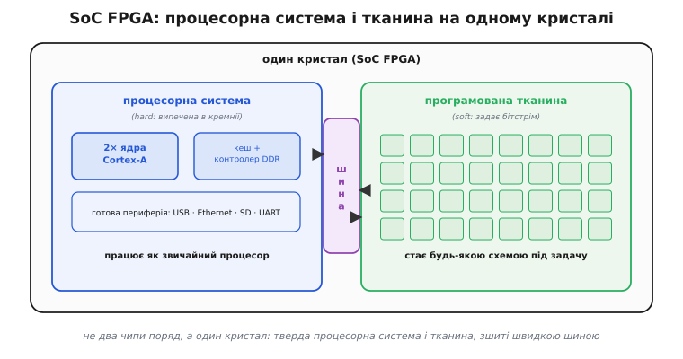
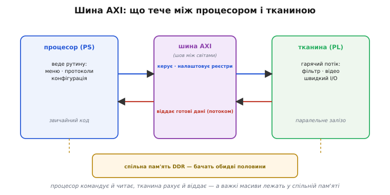
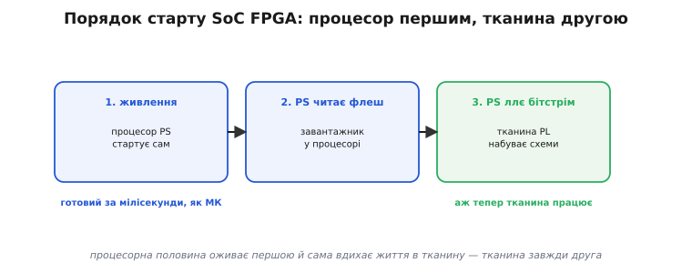
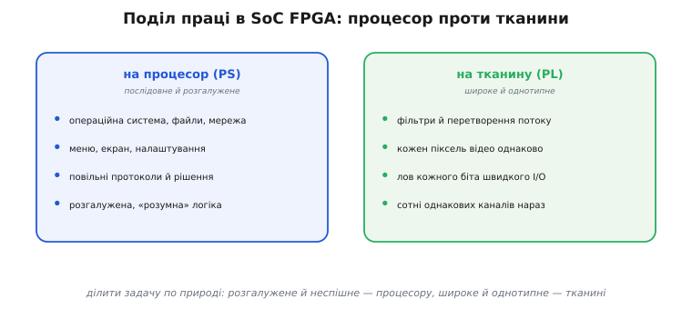

# SoC FPGA: тверде ядро + тканина

Є спокуслива ідея — покласти [процесор усередину FPGA](topic:hw-digital/soft-core), зібравши його з тих самих [LUT і тригерів](topic:hw-digital/inside-fpga), що й решту логіки. Вона працює, але за неї платять: таке [м'яке ядро](topic:hw-digital/soft-core) з'їдає тисячі клітинок і йде на третину-половину швидкості справжнього процесора. А тепер уявіть, що вам треба не абищо, а повноцінна операційна система з мережею, файлами й екраном поряд із паралельним залізом. Викладати такий процесор із тканини — марнотратство: він забере пів чипа й усе одно повзтиме. Напрошується інше рішення, просте до зухвалості: а якщо покласти на той самий кристал **справжній** процесор, випечений у кремнії, і поставити його **поряд** із тканиною? Саме це і є SoC FPGA — і ця стаття про те, як влаштований такий гібрид і чому він розв'язує задачі, непосильні ні чистому процесору, ні чистій FPGA поодинці.

Назва розкриває задум. **SoC** (англ. *System on a Chip* — «система на кристалі») означає, що на одному шматку кремнію зібрано цілу обчислювальну систему, а не одну функцію. Додайте до неї програмовану тканину — і маєте **SoC FPGA**: система, у якої одна половина є готовим процесором, а друга лишається м'якою, переписуваною логікою.

### Один кристал, дві половини

Головне, що треба зрозуміти з самого початку: SoC FPGA — це **не два чипи поряд** на платі, з'єднані доріжками. Це **один кристал**, поділений усередині на дві частини різної природи, зшиті прямо в кремнії.


*Ліворуч — тверда процесорна система (PS): пара ядер, кеш, контролер DDR і готова периферія (USB, Ethernet, SD, UART), усе випечене в кремнії. Праворуч — програмована тканина (PL): поле однакових клітинок, що бітстрімом стає будь-якою схемою. Між половинами — швидка шина, якою вони спілкуються. Це один кристал, а не два чипи на платі.*

Дві половини мають усталені імена, і їх варто запам'ятати, бо ними рясніє вся документація. Тверду частину звуть **процесорна система** (англ. *Processing System*, PS) — це справжній процесор із усім, що йому належить: одне чи кілька ядер (зазвичай архітектури ARM), кеш, [контролер зовнішньої пам'яті DDR](topic:hw-arch/memory-controller), і ціла жменя готової периферії — USB, Ethernet, контролери карт пам'яті, послідовні порти. Усе це виточене в кремнії заздалегідь, тож працює на повній швидкості й займає мало місця — рівно як [готові блоки BRAM і DSP у звичайній FPGA](topic:hw-digital/inside-fpga). М'яку частину звуть **програмована логіка** (англ. *Programmable Logic*, PL) — це і є та сама [FPGA-тканина](topic:hw-digital/inside-fpga): поле LUT-тригерних клітинок, що [бітстрімом](topic:hw-digital/programmable-logic) стає будь-якою схемою під задачу.

Чому таке поєднання настільки природне? Бо PS і PL закривають рівно ті дві половини роботи, у яких кожен світ безпорадний поодинці. Процесор чудово веде **розгалужену, послідовну** логіку — операційну систему, протоколи, меню, — але захлинається на широких однотипних потоках. Тканина навпаки: незрівнянна в [паралельному залізі](topic:hw-digital/programmable-logic), але складна послідовна рутина лягає на неї громіздко, а власний процесор із неї — дорогий і повільний. Поставте їх на один кристал — і кожна половина робить те, що їй удається найкраще, а важку роботу нікому не доводиться виконувати чужими інструментами.

> 🔧 **Навіщо це.** Перше, що дає ця картина, — правильне очікування від плати. Коли ви бачите SoC FPGA, знайте: у вас на руках **водночас** повноцінний одноплатний комп'ютер (PS зі своєю пам'яттю, мережею, здатний тягнути Linux) і поле програмованої логіки поряд. Тому таку мікросхему обирають не тоді, коли потрібне «трохи процесора при FPGA» (для цього досить [м'якого ядра](topic:hw-digital/soft-core)), а тоді, коли потрібні **обидва світи всерйоз** — і серйозний процесор із операційною системою, і серйозна тканина під паралельні потоки. Це відразу задає, які задачі варто нести на такий чип, а які ні.

### Шов між світами: шина AXI

Дві половини на одному кристалі були б двома чужими один одному пристроями, якби їх не зв'язувало щось, чим вони швидко обмінюються даними. Це «щось» — **шина** просто в кремнії, і вона тут не дріб'язок, а серце всього гібрида: саме через неї процесор командує тканиною, а тканина віддає процесору результати.


*Процесор (PS) керує тканиною й налаштовує її реєстри — стрілка ліворуч-праворуч. Тканина (PL) віддає процесору готові дані потоком — зустрічна стрілка. А важкі масиви лежать у спільній пам'яті DDR, яку бачать обидві половини. Уся ця розмова йде шиною AXI, вбудованою в кристал.*

Ця шина має ім'я — **AXI** (англ. *Advanced eXtensible Interface* — «розширюваний інтерфейс», частина ширшого набору правил AMBA, який ARM розробив для зв'язку блоків усередині чипа). Не варто лякатися абревіатури: по суті це набір проводів і правил, за якими один блок каже іншому «прочитай ось цю адресу» чи «запиши ось це значення». Важливо не як вона зветься, а **що** нею тече, і тут ясно видно два зустрічні струмені. В один бік, від процесора до тканини, ідуть **керування й налаштування**: процесор пише в реєстри вашого блока в тканині — «увімкнись», «ось коефіцієнт фільтра», «починай». У другий бік, від тканини до процесора, ідуть **готові дані**: тканина перемолола потік і віддає результат. Ці реєстри в тканині процесор бачить просто як [комірки пам'яті за певними адресами](topic:hw-arch/memory-controller) — записав у таку адресу число, і воно опинилося в керуючому реєстрі вашої схеми.

Та найважливіше вміння цієї шини — інше. Обидві половини можуть звертатися до **однієї спільної зовнішньої пам'яті**. Процесор кладе в [DDR-пам'ять](topic:hw-arch/sdram-ddr) масив даних — а тканина читає його **звідти ж напряму**, не переганяючи байт за байтом через процесор. Це прибирає найгіршу пляшкову шийку гібридних систем: коли процесор і прискорювач сидять у різних чипах, кожен байт між ними доводиться копіювати, і на широкому потоці саме це копіювання стає стіною. Тут стіни немає — обидві половини дивляться в один спільний масив.

Тонкий, але коштовний бік цієї спільної пам'яті — **узгодженість** (англ. *cache coherency* — узгодженість кешу). Процесор тримає гарячі дані в [кеші](topic:hw-arch/cache), і без спеціального піклування тканина, читаючи пам'ять, могла б побачити **застарілу** копію — ту, що в пам'яті, поки свіжа лежить у кеші процесора. У SoC FPGA є окремі шляхи AXI, якими тканина заглядає в пам'ять **узгоджено з кешем**: вона бачить саме те, що бачить процесор, без ручного «скидання кешу». Це та деталь, яку легко проґавити й потім півдня ловити, чому прискорювач працює зі сміттям.

> 🔧 **Навіщо це.** Практична вигода — знати, де шукати вузьке місце й де його немає. По-перше, у SoC FPGA передавання «процесор ↔ тканина» **не** коштує окремого чипа й доріжок на платі: це внутрішня шина, швидка й широка, тож на неї закладаються сміливо. По-друге, найдешевший спосіб згодувати тканині багато даних — **не** слати їх реєстр за реєстром, а покласти масив у спільну DDR і дати тканині читати звідти самій (це зветься доступом до пам'яті в обхід процесора, DMA). По-третє, узгодженість кешу — перше, що перевіряють, коли прискорювач видає сміття: або йдіть узгодженим шляхом AXI, або вручну скидайте кеш перед тим, як тканина читатиме масив.

### Порядок старту: процесор першим, тканина другою

З двох половин природно постає питання, на якому спотикаються всі новачки: коли вмикається живлення, **хто оживає першим**? У звичайній FPGA відповідь проста — чип нічого не робить, поки в нього не заллється бітстрім. У SoC FPGA порядок інший і несиметричний, і його треба чітко засвоїти.


*Порядок увімкнення. Крок 1: подали живлення — процесорна половина стартує сама, як звичайний мікроконтролер. Крок 2: процесор читає зовнішню флеш і виконує завантажник. Крок 3: сам процесор заливає бітстрім у тканину — і лише тепер тканина набуває схеми й починає працювати. Тканина завжди оживає другою.*

Ключ у тому, що **головний тут — процесор**. Подали живлення — і процесорна половина стартує **сама**, точнісінько як звичайний мікроконтролер: вона має вбудований завантажник у кремнії, який одразу після скидання читає зовнішню [флеш-пам'ять](topic:hw-arch/emmc-ssd) чи карту й починає виконувати код. На цьому етапі тканина ще **порожня** — вона нічого не робить, бо в неї ще ніхто не залляв конфігурацію. І ось найцікавіше: бітстрім у тканину заливає **сам процесор**. Серед першого коду, який він виконує, є крок «візьми ось цей файл-бітстрім і сконфігуруй ним PL». Тобто процесорна половина буквально **вдихає життя** у програмовану — спершу оживає сама, тоді оживляє сусідку.

Ця асиметрія — не примха, а зручність. Вона означає, що SoC FPGA стартує так само, як звичайна вбудована система з процесором: та сама флеш, той самий завантажник, та сама послідовність. Тканина стає просто ще одним пристроєм, який ваш код ініціалізує при старті — як ви ініціалізуєте контролер дисплея чи мережу. Ба більше, з цього випливає рідкісна гнучкість: раз бітстрім вантажить процесор, він може **перезавантажити** тканину новим бітстрімом уже під час роботи — перетворити прискорювач з фільтра на відеокодек, не перезапускаючи всю систему. Ось як це виглядає в найпростішому коді прошивки, що йде на PS одразу після старту:

**Умова: процесор PS щойно стартував; треба сконфігурувати тканину бітстрімом і ввімкнути в ній блок-прискорювач.** Драйвер FPGA-менеджера тут умовний, але послідовність — точно та, що виконує реальний PS:

```c
#include <stdint.h>

// Тканина після скидання порожня. Процесор сам заливає в неї бітстрім,
// а вже потім бачить її реєстри як звичайну пам'ять за адресами.

#define PL_ACCEL_BASE   0x43C00000u        // адреса нашого блока в тканині
#define REG_CONTROL     (*(volatile uint32_t *)(PL_ACCEL_BASE + 0x00))
#define REG_STATUS      (*(volatile uint32_t *)(PL_ACCEL_BASE + 0x04))
#define CTRL_ENABLE     0x1u

int soc_bring_up(const void *bitstream, uint32_t len) {
    // 1. Процесор ллє бітстрім у тканину — тканина набуває схеми.
    if (fpga_load_bitstream(bitstream, len) != 0)
        return -1;                          // конфігурація не вдалася

    // 2. Тепер реєстри блока в тканині доступні як пам'ять — вмикаємо його.
    REG_CONTROL = CTRL_ENABLE;

    // 3. Чекаємо, поки блок звітує про готовність (біт 0 у STATUS).
    while ((REG_STATUS & 0x1u) == 0)
        ;                                   // тканина ще піднімається
    return 0;                               // гібрид готовий до роботи
}
```

Висновок прямий і практичний: у SoC FPGA програмування починається **з боку процесора**, і тканина — це пристрій, який процесорний код піднімає при старті. Якщо після ввімкнення система «мертва», спершу дивляться не на логіку в тканині, а на процесорну гілку: чи стартував PS, чи прочитав флеш, чи дійшов до кроку заливання бітстріму.

> 🔧 **Навіщо це.** Розуміння порядку старту економить години налагодження. По-перше, дефекти запуску SoC FPGA діляться навпіл: «процесор не піднявся» (флеш, завантажник, живлення ядра — суто процесорні біди, знайомі з будь-якого МК) і «тканина не сконфігурувалася» (немає чи битий бітстрім, процесор не дійшов до кроку заливання). Знаючи, що тканину вантажить процесор, ви одразу ставите щуп у правильну гілку. По-друге, це відкриває прийом: тканину можна **переконфігуровувати на льоту** — тримати кілька бітстрімів і вантажити потрібний під поточну задачу, поки процесор працює. По-третє, ваш звичний ланцюг «флеш → завантажник → застосунок» тут працює як є; тканина просто вбудовується в нього ще одним кроком ініціалізації.

### Хто що робить: поділ праці

Уся сила SoC FPGA розкривається, коли ви правильно **ділите задачу** між двома половинами. Покладете не те й не туди — і гібрид працюватиме гірше за окремий процесор чи окрему FPGA. Тому найважливіша навичка тут — чуття, що куди природно лягає.


*Природний поділ. На процесор (PS) кладемо послідовне й розгалужене: операційну систему, файли й мережу, меню та екран, неспішні протоколи, «розумну» логіку з багатьма гілками. На тканину (PL) кладемо широке й однотипне: фільтри й перетворення потоку, однакову обробку кожного пікселя, лов кожного біта швидкого інтерфейсу, сотні однакових каналів нараз.*

Правило поділу коротке: **розгалужене й неспішне — процесору, широке й однотипне — тканині**. Процесор бере на себе те, де багато різних рішень і мало повторів: операційну систему, роботу з файлами й мережею, екранне меню, повільні протоколи, усю «розумну» логіку, де кожен випадок особливий. Тканина бере те, де мало різних дій, зате величезний потік однакових: пропустити кожен відлік крізь [цифровий фільтр](topic:hw-digital/inside-fpga), обробити кожен піксель кадру, зловити кожен біт швидкого інтерфейсу, крутити сотню однакових каналів. Стик між ними — та сама шина AXI: тканина віддає процесорові вже пережований, зменшений потік, а процесор командує тканиною й ухвалює рішення високого рівня.

Ось як цей поділ виглядає в коді. Нехай тканина містить [DSP-фільтр](topic:hw-digital/inside-fpga), що перемелює швидкий потік відліків, а процесор лише спостерігає за результатом і ухвалює рішення. Уся «гаряча» робота — у тканині; процесор торкається лише готового підсумку:

**Умова: тканина фільтрує потік і накопичує суму; процесор читає підсумок і за порогом ухвалює рішення.** Процесор не бачить окремих відліків — тільки результат, який тканина порахувала паралельно:

```c
#include <stdint.h>

#define ACCEL_BASE   0x43C00000u
#define REG_CTRL     (*(volatile uint32_t *)(ACCEL_BASE + 0x00))
#define REG_RESULT   (*(volatile uint32_t *)(ACCEL_BASE + 0x08))  // підсумок з тканини
#define REG_COUNT    (*(volatile uint32_t *)(ACCEL_BASE + 0x0C))  // скільки відліків оброблено

#define THRESHOLD    100000u

void supervise(void) {
    REG_CTRL = 0x1u;                        // «працюй» — далі тканина сама

    for (;;) {
        // Процесор НЕ чіпає окремі відліки: їх фільтрує тканина паралельно,
        // ловлячи кожен на своїй частоті. Процесор бачить лише підсумок.
        uint32_t level = REG_RESULT;        // готове число з тканини за адресою

        if (level > THRESHOLD) {
            // Розгалужене «розумне» рішення — це робота саме процесора:
            log_event(level, REG_COUNT);    // запис у файл, повідомлення в мережу
            raise_alarm();
        }
        sleep_ms(10);                       // процесор неспішний — тканина встигає
    }
}
```

Зверніть увагу на різницю темпів. Тканина ловить **кожен** відлік на високій частоті — це її стихія. Процесор же перевіряє підсумок раз на десять мілісекунд і робить розгалужену «розумну» роботу: пише в журнал, шле сповіщення мережею, піднімає тривогу. Кожна половина працює у своєму природному ритмі, і жодна не робить чужу роботу чужими інструментами. Саме в цьому поділі — уся вигода гібрида.

### Коли SoC FPGA доречна, а коли ні

SoC FPGA — потужна, але не безкоштовна: це складніший чип, складніша розробка й вища ціна, ніж у чистого мікроконтролера чи чистої FPGA. Тому чесно назвати, **коли** вона виправдана, а коли ви берете з гармати по горобцях.

Головний критерій випливає з усього сказаного: SoC FPGA доречна тоді, коли вам **всерйоз потрібні обидві половини одночасно**. Потрібен серйозний процесор — з операційною системою, мережею, файлами, екраном — **і** поряд серйозна паралельна тканина, що тягне широкий потік у реальному часі. Класичні приклади: камера, де тканина обробляє відеопотік попіксельно, а процесор веде мережу, налаштування й запис; вимірювальний прилад, де тканина ловить сигнал на сотнях мегагерц, а процесор малює графіки й спілкується з користувачем; радіо, де тканина перемелює широку смугу, а процесор веде протоколи вищого рівня. Скрізь тут **обидва** світи навантажені по-справжньому — і тримати їх на одному кристалі дешевше, компактніше й швидше (бо шина всередині), ніж зводити процесор і FPGA двома окремими чипами.

А коли ні? Якщо навантажена лише **одна** половина — гібрид зайвий. Потрібна сама паралельна логіка, а процесорної роботи мало — берете звичайну FPGA, а дрібну рутину покладете на [м'яке ядро в тканині](topic:hw-digital/soft-core): дешевше й простіше, ніж тягнути повноцінний PS. Потрібен лише процесор без паралельних потоків — берете звичайний [мікроконтролер](root:embedded/fpga-vs-mcu): він на порядок дешевший, простіший у розробці й не змушує вас володіти водночас і програмуванням, і [мовою опису апаратури](topic:hw-digital/hdl). Головна пастка SoC FPGA — брати її «про запас», коли реально працює лиш одна половина, а друга стоїть баластом, за який ви заплатили ціною, складністю й місяцями освоєння.

Історія цих чипів коротка й повчальна: [перші SoC FPGA з'явилися лише на початку 2010-х](topic:hw-digital/soc-fpga/hist-soc-fpga.md), коли Xilinx і Altera майже одночасно зшили ARM-процесор із тканиною на одному кристалі — і саме поєднання двох світів, а не кожен окремо, відкрило цілий клас нових задач.

> 🔧 **Навіщо це.** Практична користь — ставити правильне питання **до** вибору чипа, а не після. Спитайте себе чесно: чи навантажені **обидві** половини всерйоз? Якщо так — SoC FPGA окупить свою складність компактністю, швидкою внутрішньою шиною й одним кристалом замість двох. Якщо навантажена лише тканина — беріть звичайну FPGA (з [м'яким ядром](topic:hw-digital/soft-core) на дрібну рутину). Якщо лише процесорна робота — беріть [мікроконтролер](root:embedded/fpga-vs-mcu). Цей єдиний чесний припис — «обидві половини навантажені?» — рятує від найдорожчої помилки: купити й місяцями освоювати гібрид там, де вистачило б удвічі простішого й дешевшого рішення.
