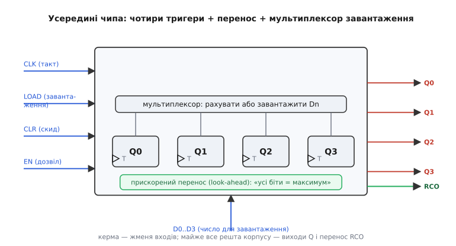
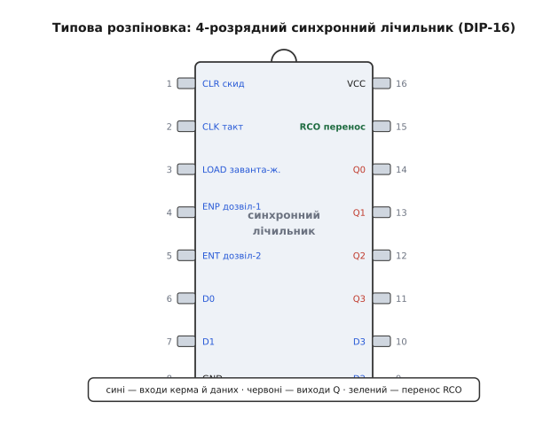
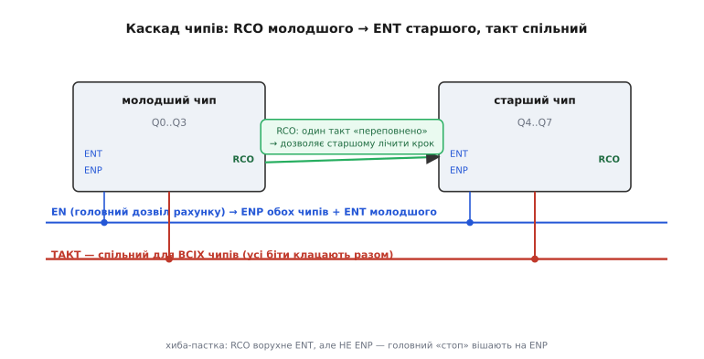

# 🔌 Мікросхеми синхронних лічильників: 4 розряди, завантаження й перенос у корпусі

Ідею [синхронного лічильника](root:hw-digital/synchronous-counter) — спільний такт задає мить, логіка переносу вирішує, кому з бітів перевернутися, — не мусиш складати щоразу з окремих тригерів і вентилів. Її давно **відлили в готовий корпус**. Найужитковіший клас — **4-розрядний синхронний лічильник із паралельним завантаженням і прискореним переносом**. Один малий чип на шістнадцять ніжок дає повний синхронний лічильник: усі біти клацають разом, число не «розривається» на переходах, а кілька керувальних входів дозволяють спинити рахунок, стрибком завантажити наперед задане число й зчепити кілька таких чипів у ширший лічильник без утрати швидкості. Розберімо цей клас так, щоб, узявши будь-який його представник, ти одразу знав, що в нього всередині, як його завести й об які три-чотири речі об нього спотикаються.

Одразу межу проведемо. Це **не** та копійчана родина ланцюгових CMOS-лічильників, де виходи «діляться» брижами й один тактує наступного, — ті розібрано окремо, як [лічильники-дільники в корпусі](root:hw-digital/counters/api-4017-4040.md); там перенос біжить розрядами, і на переходах буває хибне проміжне число. Тут інша порода: **справжній синхронний** лічильник, де все зроблено рівно для того, щоб такого глітча на виходах не було.

### Що це за клас: синхронний лічильник, виведений на ніжки

Усередині корпусу — рівно те, про що йдеться в основній статті: чотири тригери на **спільному** такті, над ними логіка, що обчислює для кожного біта умову «перевернутися чи ні», і трохи обв'язки, щоб цим усім можна було керувати ззовні. Виробники цей клас так і підписують у довіднику: *synchronous 4-bit counter, presettable, with look-ahead carry* — «синхронний 4-розрядний лічильник, з можливістю попереднього встановлення, з прискореним переносом». Кожне слово тут — обіцянка конкретної властивості:

- **synchronous** (гр. *sýn* — разом, *chrónos* — час) — усі чотири тригери тактуються одним фронтом, виходи міняються строго разом; проміжного «битого» коду на виходах не виникає.
- **4-bit** — рахунок у межах одного корпусу йде на чотири розряди, тобто **за модулем 16** (0…15) для двійкового різновиду або **за модулем 10** (0…9) для десяткового.
- **presettable** (англ. *preset* — наперед встановити) — лічильник уміє не лише рахувати з того, де стоїть, а й **завантажити** будь-яке число з зовнішніх входів даних, стрибком, за один такт.
- **look-ahead carry** (англ. — «перенос із заглядом наперед») — умову переповнення схема рахує не естафетою вентилів, а **паралельно**, тож чипи цього класу можна зчіплювати в ширший лічильник, і гранична частота від цього не падає. Це прямо той [прискорений перенос](root:hw-digital/synchronous-counter/math-max-frequency.md), про який ідеться в основній статті.

Технологія — та сама стандартна логіка, у якій живе решта цифрового дріб'язку: біполярні серії (швидкі, але ненажерливі) або, частіше сьогодні, **CMOS** (широке живлення 2…6 В, чудово на 5 В і 3.3 В, майже нульовий струм у спокої). Для нас важлива не технологія кристала, а те, що поведінка **однакова** в будь-якого виробника: розпіновка, набір керувальних входів, логіка переносу — усе стандартизоване десятиліттями, тож усе сказане нижче стосується цілого класу, а не одного продукту.

### Блок-схема: чотири тригери, мультиплексор, перенос

Найпростіше уявити нутро чипа як три шари, накладені один на одного. Внизу — **чотири тригери** на спільному такті: серце, що зберігає поточне число Q0…Q3. Над ними — **мультиплексор завантаження**: перед кожним тригером стоїть перемикач, який вирішує, що подати на його вхід у наступний фронт, — «наступне число рахунку» (те, що обчислила логіка лічби) чи біт Dn із зовнішньої шини. І наскрізь усе пронизує **ланцюг прискореного переносу**, що обчислює умову «лічильник дійшов до максимуму» й виводить її назовні окремою ніжкою.


*Що ховає корпус синхронного лічильника-чипа. Чотири тригери (внизу) тактуються **спільною** лінією — тому всі біти й міняються разом. Над ними мультиплексор щофронту обирає: рахувати далі чи завантажити зовнішнє число D0…D3. Наскрізь іде **прискорений перенос**, що перевіряє «усі біти = максимум» і виводить це сигналом RCO. Ліворуч — жменя входів керма, знизу — дані для завантаження, праворуч — виходи Q і перенос; більша частина ніжок корпусу — це саме виходи.*

Зверни увагу на пропорцію: керма — обмаль, а виходів — багато. Це прикмета всього класу. Лічильник — пристрій, що **сам** робить свою роботу щотакту; ззовні йому треба лише дати такт, сказати «можна» й зрідка — «завантаж оце» чи «скинься». Тому вхідних керувальних ніжок лічені штуки, а решта корпусу — виходи чотирьох бітів плюс перенос.

### Типова розпіновка: як ці входи лягають на ніжки

Клас настільки усталений, що розкладка ніжок практично **канонічна** — різні виробники й різні різновиди (двійковий/десятковий, із синхронним/асинхронним скидом) тримають той самий порядок виводів, щоб чипи були взаємозамінні на платі. Ось типовий 16-ніжковий корпус:


*Типова (узагальнена) розпіновка класу. Ліва колонка — керма й частина даних: **CLR** (скид), **CLK** (такт), **LOAD** (завантаження), два дозволи **ENP** і **ENT**, входи даних. Права — живлення й виходи: **VCC**, перенос **RCO**, чотири виходи **Q0…Q3**, решта входів даних. Ключ-виїмка згори задає бік ніжки 1 — сплутаєш орієнтацію, і живлення піде навпаки. Конкретні номери ніжок різняться між різновидами в дрібницях, але набір і зміст входів той самий у всього класу.*

Пройдімося по входах, бо кожен несе окрему думку.

- **CLK** — тактовий вхід, спільний для всіх чотирьох тригерів. Клас рахує за **наростаючим** фронтом (англ. *rising edge*): усі біти оновлюються в мить, коли CLK іде з 0 в 1. Це прямий наслідок синхронного дизайну — один фронт «спускає курок» одразу для всіх.
- **ENP** і **ENT** — **два** дозволи рахунку (англ. *count enable*; історичні підписи — *CEP* і *CET*, «parallel» і «trickle»). Обидва мають бути в одиниці, щоб лічильник рахував; будь-який у нулі — і рахунок **завмирає** синхронно. Навіщо аж два — стане ясно на каскаді; поки що запам'ятай, що вони **не рівноправні**.
- **LOAD** (він же *PE*, *parallel enable*) — вхід синхронного завантаження. Коли він активний, наступний фронт **не рахує**, а вкидає в тригери число з входів D0…D3 одним стрибком.
- **CLR** (він же *MR*, *master reset*) — скид у нуль. Залежно від різновиду — синхронний (діє на фронті) або асинхронний (діє миттєво); про цю розвилку — окремо нижче, це головна відмінність усередині класу.
- **D0…D3** — чотири входи даних: число, яке завантажать за командою LOAD.

І виходи:

- **Q0…Q3** — чотири біти поточного числа; молодший Q0, старший Q3. Міняються строго на фронті, усі разом.
- **RCO** (англ. *ripple carry output*, він же *TC* — *terminal count*, «кінцевий рахунок») — вихід переносу. Він піднімається в одиницю рівно тоді, коли лічильник **дійшов до свого максимуму** (15 для двійкового, 9 для десяткового), і тримається один такт. Це сигнал «я зараз переповнюся» для наступного чипа в каскаді.

### «Перший байт»: як його завести й побачити рахунок

У лічильника немає ні регістрів налаштування, ні протоколу — «заговорити» з ним означає **дати живлення, подати такт і прибрати гальма з керувальних входів**. Три кроки, як і в будь-якого логічного чипа.

**Живлення.** VCC на «плюс», GND на «мінус» і — обов'язково — **блокувальний конденсатор** 100 нФ упритул до ніжок живлення. Це звична гігієна [цифрового живлення](root:hw-components/decoupling): щофронту всі чотири тригери перемикаються разом, смикаючи короткий кидок струму; конденсатор поруч гасить цей кидок, інакше просадка на шині живлення збиває сусідні чипи.

**Такт.** Подай на CLK рівномірний тактовий сигнал. Для проби згодиться повільний генератор — скажімо, [інвертор Шмітта](root:hw-digital/threshold-schmitt) з резистором і конденсатором, що дає кілька герц: тоді рахунок можна **побачити оком** на світлодіодах, начеплених на Q0…Q3. У бойовій схемі CLK беруть від системного такту.

**Прибрати гальма.** Тут головна пастка новачка. Керувальні входи **не можна лишати в повітрі** — у CMOS плаваючий вхід ловить наводки й поводиться випадково. Щоб лічильник просто рахував угору, треба:

- **ENP = 1** і **ENT = 1** — інакше рахунок стоїть (обидва дозволи активні);
- **LOAD** = неактивний — інакше чип щофронту завантажує дані замість лічби;
- **CLR** = неактивний — інакше лічильник вічно скинутий у нуль.

Дотримав ці рівні — і на наростаючих фронтах CLK виходи побіжать 0000 → 0001 → 0010 → … → 1111 → 0000, усі біти чисто перемикаючись разом. RCO при цьому спалахне на такті, коли на виходах 1111, — один імпульс за повний цикл.

**Умова: перевірити «прибирання гальм» у прошивці — які рівні керма дають чистий рахунок угору.**

:::tabs
```cpp
#include <cstdint>

// Модель одного фронту 4-розрядного синхронного лічильника цього класу.
// Пріоритет входів — точно як у залізі: спершу скид, тоді завантаження,
// тоді дозвіл, і лише потім власне лічба.
uint8_t sync_ic_step(uint8_t q, uint8_t d,
                     bool clr, bool load, bool enp, bool ent) {
    if (clr)                       // скид б'є все — виходи в нуль
        return 0;
    if (load)                      // завантаження: стрибок на зовнішнє число
        return d & 0x0F;
    if (enp && ent)                // рахує ЛИШЕ коли ОБИДВА дозволи = 1
        return (q + 1) & 0x0F;     // модуль 16 (двійковий різновид)
    return q;                      // будь-який дозвіл у нулі — завмирання
}
```
```python
# Модель одного фронту 4-розрядного синхронного лічильника цього класу.
# Пріоритет входів — точно як у залізі: спершу скид, тоді завантаження,
# тоді дозвіл, і лише потім власне лічба.
def sync_ic_step(q, d, clr, load, enp, ent):
    if clr:                        # скид б'є все — виходи в нуль
        return 0
    if load:                       # завантаження: стрибок на зовнішнє число
        return d & 0x0F
    if enp and ent:                # рахує ЛИШЕ коли ОБИДВА дозволи = 1
        return (q + 1) & 0x0F      # модуль 16 (двійковий різновид)
    return q                       # будь-який дозвіл у нулі — завмирання
```
:::

Код точно відбиває залізо, і саме порядок `if` — це суть. Скид найголовніший. Завантаження перебиває лічбу (той самий мультиплексор). Рахунок іде **тільки** коли `enp && ent` — забув один, і лічильник мовчки стоїть, а ти півдня шукаєш, чому «чип не працює». Маска `& 0x0F` — це апаратна межа за модулем 16: без неї число вилізло б за чотири біти. Для десяткового різновиду замість неї була б перевірка «дійшов до 9 → наступний 0».

### Синхронне завантаження й дозвіл: за що цей клас люблять

Дві речі підносять цей клас над простим лічильником-дільником, і обидві варті окремого слова, бо саме на них будують реальні схеми.

**Синхронне завантаження — це перезавантажуваний таймер.** Здатність стрибком укинути наперед задане число дає найкорисніший трюк: лічити **вниз від N до переповнення**, а на переповненні знову завантажити N. Виходить дільник частоти на **довільний** модуль, а не лише на степінь двійки. Схема класична: заводиш RCO (сигнал «дійшов до краю») назад на LOAD, а на входи даних подаєш число, з якого хочеш починати цикл, — і лічильник сам, без жодного коду, ділить такт на потрібний коефіцієнт. Ключове слово — **синхронне**: завантаження стається на фронті, чисто, без глітча, точно як сама лічба. Це успадкована від синхронного дизайну чистота, і саме вона робить такий дільник придатним туди, звідки його читає інша тактована логіка.

> 🔧 **Навіщо це.** Апаратний таймер у мікроконтролері — це, по суті, той самий синхронний лічильник із завантаженням: ти задаєш період (число для перезавантаження) і напрям, а він відмірює інтервали без участі процесора. Розуміння цього чипа — це розуміння, що діється всередині таймера МК на рівні тригерів: LOAD-вхід — це регістр перезавантаження, RCO — прапорець переповнення, який смикає переривання.

**Два дозволи — це заготовка під каскад.** Навіщо ENP і ENT, коли для завмирання вистачило б одного? Відповідь у тому, як вони по-різному впливають на **перенос**, — і це підводить нас до головного вміння цього класу.

### Каскад: як зчепити чипи в ширший лічильник (і головна пастка)

Один корпус — чотири біти, рахунок до 15. Треба ширше — до 255, до 65535 — чипи **зчіплюють**. І тут криється найтонше місце всього класу, об яке спотикаються навіть досвідчені.

Правило зчеплення таке: **такт спільний для всіх чипів** (інакше втратиш синхронність, заради якої все й затівалося), а сигнал «молодший переповнився, старшому час рахувати» передають через **перенос**: RCO молодшого чипа заводять на **ENT** старшого. Поки молодший не дійшов до 15, його RCO у нулі — ENT старшого в нулі — старший стоїть. У такт, коли молодший показує 15, його RCO піднімається — ENT старшого стає одиницею — і на **тому самому** спільному фронті старший робить один крок. Обидва чипи клацнули разом; ширше число лишилося цілим.


*Каскад двох чипів у восьмирозрядний лічильник. **RCO** молодшого (він піднімається на такт, коли молодший дійшов до 15) заходить на **ENT** старшого — тож старший робить крок рівно тоді, коли молодший переповнюється, і на **спільному** такті. Головний «дозвіл рахунку» всієї збірки вішають на **ENP** обох чипів (плюс на ENT молодшого). Такт — спільний для всіх, тому всі біти обох чипів міняються разом. Пастка: RCO залежить від ENT, але **не** від ENP, тож головний «стоп» треба вішати саме на ENP.*

А тепер сама пастка, заради якої й існують два окремі дозволи. **RCO піднімається за умовою «усі біти = максимум **І** ENT = 1» — але ENP на RCO не впливає.** Тобто перенос дивиться лише на ENT, а на ENP — ні. Навіщо така асиметрія? Вона й дає правильний каскад:

- **ENT** — «прохідний» дозвіл: він і пускає рахунок, і **пропускає** перенос далі вгору. Тому саме на ENT заводять RCO з молодшого чипа — перенос естафетою йде розрядами вгору лише через ENT-ланцюг.
- **ENP** — «головний» дозвіл усієї збірки: він теж спиняє рахунок, але **не** глушить RCO. Тому загальний сигнал «стоп/пуск» для всього багаточипового лічильника вішають на **ENP** усіх чипів: спинити рахунок він спинить, а вже полічені переноси не зіпсує.

Сплутаєш ці два — заведеш головний дозвіл на ENT замість ENP — і в мить «стоп» ти заодно обірвеш ланцюг переносу між чипами, а він у деяких схемах потрібен навіть під час паузи. Тому канон: **RCO → ENT наступного, спільний «дозвіл» → ENP усіх**. Ось де окупаються два входи замість одного.

> 🔧 **Навіщо це.** Це рівно та властивість «internal look-ahead carry», яку обіцяє довідник: перенос між чипами йде **паралельно**, не гальмуючи такт, тож восьми- чи шістнадцятирозрядний лічильник тримає ту саму високу частоту, що й один чип. Головна перевага синхронного дизайну — незалежність стелі частоти від розрядності — переноситься на каскад чипів рівно завдяки цьому переносу RCO→ENT.

### Типові граблі

- **Плаваючі керувальні входи.** Найчастіша й найпідступніша помилка: лишити ENP, ENT, LOAD чи CLR «у повітрі». У CMOS такий вхід ловить наводки — і лічильник то стоїть, то скидається, то завантажується сам собою, а причину шукати важко, бо поводиться він **випадково**. **Кожен** керувальний вхід має сидіти на чіткому рівні через притягувальний резистор.
- **Забутий другий дозвіл.** Рахувати чип починає лише коли **обидва** ENP і ENT в одиниці. Підняв один, забув другий — лічильник мовчки стоїть, ніби несправний. Перше, що перевіряти, коли «не рахує», — обидва дозволи.
- **RCO залежить від ENT, а не від ENP.** Розібрана вище пастка каскаду. Заведеш глобальний «стоп» на ENT — обірвеш ланцюг переносу; вішай його на ENP.
- **Синхронний скид проти асинхронного — не той різновид.** Візьмеш чип із **синхронним** скидом і чекатимеш, що CLR миттєво обнулить виходи, — а він обнулить лише на наступному фронті; або навпаки. У схемі це різниця між «скинувся негайно» і «скинувся за один такт». Різновид треба брати свідомо (див. нижче) і звіряти з довідником.
- **RCO усе ж може «дзеленькнути».** Тонкість: синхронний лічильник прибирає глітч із **виходів Q**, але сам сигнал **RCO** — комбінаційний (він = «усі біти = максимум»), тож на переходах бітів на ньому може майнути коротка голка. Виходи чисті, а перенос — не завжди. Тому RCO не тактує напряму чутливу логіку без фіксації тригером; його призначення — годувати ENT наступного чипа, який дивиться на нього лише в мить фронту.
- **Світлодіод на вихід без резистора.** Начепиш світлодіод прямо на Qn — спокуса, від якої страждають і вихід чипа, і світлодіод. [Струмообмежувальний резистор](root:ph-electromagnetism/joule-heating) обов'язковий.
- **Плутанина модуля.** Двійковий різновид рахує до 15 (модуль 16), десятковий — до 9 (модуль 10). Візьмеш не той — і дільник дасть не той коефіцієнт, а «зайві» стани десяткового (10…15) поводитимуться не так, як очікуєш.

### Варіації класу

За тим самим принципом виробники дають чотири близькі різновиди, і всі вони живуть на **однаковій** розпіновці — відрізняються лише двома прапорцями поведінки:

**Двійковий чи десятковий.** Одна вісь — модуль рахунку. **Двійковий** різновид рахує 0…15 (модуль 16); **десятковий** (BCD, англ. *binary-coded decimal* — двійково-кодований десятковий) рахує 0…9, а на десятому такті перескакує в нуль. Десятковий зручний там, де число одразу читають як десяткову цифру (індикатори, годинники): кожен чип — один десятковий розряд, каскад із трьох дає лічбу 000…999.

**Синхронний чи асинхронний скид.** Друга вісь — як діє CLR. **Синхронний** скид обнуляє виходи лише на **наступному фронті** такту (чисто, узгоджено з рештою логіки, без ризику коротких голок). **Асинхронний** скид обнуляє виходи **негайно**, щойно CLR пішов у нуль, не чекаючи такту (швидко, але може дати коротку неузгодженість — це вже трохи проти самого духу синхронності). Який брати — залежить від схеми: треба, щоб скид ліг рівно на такт, — синхронний; треба обнулити миттєво за зовнішньою подією — асинхронний.

Ці дві осі дають чотири комбінації (двійковий/десятковий × синхронний/асинхронний скид) — саме тому в довіднику поруч стоять чотири споріднені номери одного сімейства, попарно взаємозамінні за ніжками. Обираєш не «інший чип», а **потрібну пару прапорців**; усе решта — та сама блок-схема, та сама розпіновка, ті самі два дозволи й той самий RCO.

Ширше сімейство синхронної логіки в корпусах не обмежене лічильниками: поруч на полиці — синхронні [регістри зсуву](root:hw-digital/register), [скінченні автомати](root:hw-digital/finite-state-machines) на програмованій логіці й врешті цілі процесори. Але саме 4-розрядний синхронний лічильник — найчистіший і найдешевший спосіб отримати готовий синхронний лічильник у залізі: дай такт, підніми обидва дозволи, прибери гальма — і чип рахує сам, усіма чотирма бітами разом, без єдиного рядка коду. А коли треба ширше — зчепи кілька через RCO→ENT під спільним тактом, і синхронність збережеться на всю розрядність.
