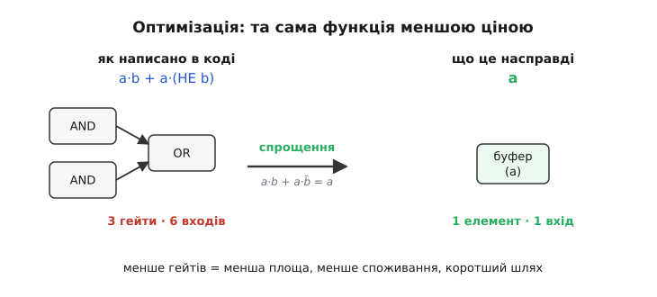
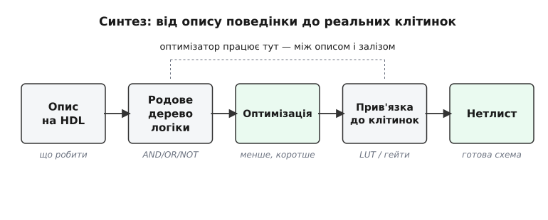
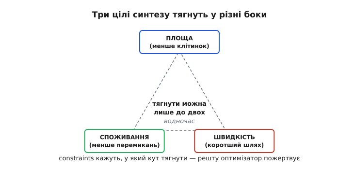

# Оптимізація синтезу

Ти пишеш мовою опису апаратури просту, ніби очевидну річ: «вихід дорівнює одиниці, коли натиснуто хоч одну з восьми кнопок і при цьому пристрій не в режимі паузи». Компілятор апаратури — **синтезатор** (від грец. *sýnthesis* — складання, поєднання) — має перетворити цей опис поведінки на справжню схему з логічних елементів. І тут з'ясовується, що той самий вислів можна скласти з залізяччя мільйоном різних способів: в лоб, як написано, вийде громіздке дерево гейтів; а можна те саме звести до жменьки елементів, які працюють утричі швидше й гріються вдвічі менше. Вибір найкращого способу і є **оптимізація синтезу** (від лат. *optimus* — найкращий) — серцевина того, як текст стає кремнієм.

Питання не косметичне. Логіка, яку синтезатор породжує «дослівно», буває в рази більша й повільніша за ту, що робить абсолютно те саме. Різниця — це реальні транзистори на кристалі, реальні наносекунди затримки й реальні міліампери струму. Тому між твоїм [описом на HDL](topic:hw-digital/hdl) і готовим залізом стоїть окрема, дуже неглупа машинерія, яка не просто перекладає — вона **шукає найдешевший еквівалент**. Розберімо, що це за пошук, за якими правилами він іде і чим за нього платять.

### Чому «як написано» — майже завжди не найкраще

Почнімо з коренуватого факту: логічний вислів і схема, що його реалізує, — це різні речі, і одному вислову відповідає безліч схем. Візьмімо крихітний приклад. Хай сигнал тривоги вмикається за формулою `alarm = a·b + a·(НЕ b)` — тобто «спрацювати, якщо a і b, або якщо a і не-b». Дослівно це три елементи: два `AND` і один `OR`, разом шість входів. Але вдумаймося: у першому випадку потрібне `a` разом із `b`, у другому — `a` разом із протилежним `b`. Хоч яке `b`, аби було `a`, — тривога. Отже, весь цей вислів дорівнює простісінькому `alarm = a`. Три гейти зникають, лишається дріт.


*Та сама логічна функція, зібрана в лоб (три гейти, шість входів) і після спрощення (один елемент): менше гейтів означає меншу площу, менше споживання й коротший шлях сигналу.*

Оце «менше гейтів за ту саму поведінку» і є та здобич, за якою полює оптимізатор — тільки не на трьох елементах, а на сотнях тисяч. Людина такого дерева в голові не втримає; тим паче що реалізацій багато не тому, що хтось пише криво, а тому, що **сама природа логіки надлишкова**: одну функцію можна виразити купою алгебрично рівних формул, і майже кожна з них — не найкоротша. Синтезатор бере твій опис, будує з нього внутрішнє дерево логіки й починає це дерево **перекроювати**, шукаючи еквівалент, що коштує дешевше.

> 🔧 **Навіщо це.** Новачок часто вірить, що «оптимізувати» дизайн — це переписувати HDL коротше, як софтовий код. Насправді синтезатор сам зводить `a·b + a·b̄` до `a` — рахувати гейти руками не треба. Твоя робота інша: писати опис **ясно й правильно**, а важелем швидкості чи розміру керувати не довжиною тексту, а **вказівками синтезатору** (constraints) — куди саме тягнути. Тому кількість рядків мовою опису майже не корелює з розміром схеми: два різні описи однієї функції дадуть після синтезу однакове залізо.

### Що всередині: три кроки одного проходу

Синтез — не одна дія, а конвеєр. Погляньмо на нього згори, бо саме порядок кроків пояснює, чому оптимізація влаштована так, а не інакше.


*Шлях від опису поведінки до реальних клітинок: спершу опис перетворюється на родове дерево логіки, далі його оптимізують, і лише потім прив'язують до конкретних елементів чипа.*

Спершу синтезатор **розбирає** твій опис і будує з нього дерево з абстрактних, «родових» операцій — просто `AND`, `OR`, `NOT`, суматори, мультиплексори, без прив'язки до якогось конкретного чипа. Це технологічно-незалежне подання: чиста логіка, ще не залізо. На цьому рівні йде перша, **незалежна від технології** оптимізація — та сама алгебра, що звела наш `alarm` до `a`, тільки над цілим деревом: спрощення виразів, викидання логіки, чий вихід нікуди не йде або завжди сталий, злиття однакових шматків.

Потім настає **прив'язка до технології** (англ. *technology mapping* — накладання на конкретну елементну базу): абстрактні `AND`/`OR` треба перекласти на **реальні клітинки** того чипа, куди дизайн ляже. І тут два світи розходяться. Для мікросхеми на замовлення (ASIC) ціль — **бібліотека стандартних клітинок**: набір готових гейтів різного розміру й швидкості, кожен зі своєю площею й затримкою. Для [програмовної логіки FPGA](topic:hw-digital/inside-fpga) ціль зовсім інша — там немає окремих гейтів, є [таблиці істинності LUT](topic:hw-digital/lut), маленькі універсальні комірки, кожна з яких уміє будь-яку функцію від кількох входів. Прив'язка до FPGA — це задача «як накрити дерево логіки найменшим числом LUT», і вона геть не схожа на добір гейтів для ASIC. Після прив'язки йде друга оптимізація — **залежна від технології**: тепер, коли відомі реальні затримки й розміри клітинок, схему ще раз шліфують під конкретне залізо.

Чому спершу незалежна оптимізація, а прив'язка потім? Бо алгебру логіки простіше й чистіше робити над абстрактними операціями: не відволікаючись на те, що в цьому чипі `NAND` дешевший за `AND`, а в тому навпаки. Спершу знаходимо найпростішу **логіку** взагалі, тоді накладаємо її на конкретне залізо. Розділили важку задачу на дві осяжні — класичний хід.

### За чим женеться оптимізатор: площа, швидкість, споживання

Тепер головне питання: а що таке «краще»? «Найкраща» схема — не абсолют, а компроміс між трьома величинами, які тягнуть у різні боки.


*Три цілі синтезу — площа, швидкодія, споживання — тягнуть у різні боки: покращуючи одне, зазвичай жертвують іншим, а constraints кажуть оптимізатору, у який кут тягнути.*

**Площа** — скільки клітинок (гейтів чи LUT) з'їдає схема. Менша площа — дешевший кристал, більше поміститься в той самий чип. **Швидкодія** — наскільки короткий [критичний шлях](topic:hw-digital/fpga-timing-and-routing), найдовший ланцюг логіки між тригерами, бо саме він визначає максимальну тактову частоту. **Споживання** — скільки енергії йде на перемикання, критично для всього, що живиться від батареї. Біда в тому, що ці цілі **суперничають**. Щоб пришвидшити арифметику, ставлять розлогіші, «широкі» схеми на кшталт [суматора з передбаченням переносу](topic:hw-digital/carry-lookahead-adder) — вони швидші, але їдять більше площі. Щоб заощадити площу, логіку роблять компактнішою, але глибшою — а глибша логіка повільніша. Тому тягнути одночасно в усі три кути не вийде: реально керуєш двома, третім жертвуючи.

Звідки оптимізатор знає, куди тягнути саме твій дизайн? Ти йому кажеш — через **обмеження** (англ. *constraints* — накладені вимоги): «тактова частота має бути 100 МГц», «оцей вихід має встигнути за 4 наносекунди». Constraints — це не побажання, а мета: синтезатор гне схему так, щоб їх виконати, а те, про що ти не просив, чим і жертвує. Не задаси вимоги за часом — він оптимізуватиме площу й видасть компактну, але, може, надто повільну схему. Тому **правильно поставлені constraints важать більше, ніж будь-яке ручне переписування коду**: вони — кермо всієї оптимізації.

> 🔧 **Навіщо це.** На практиці 90% керування синтезом — це файл із constraints, а не сам HDL. Головна вимога — **цільова частота** (period/clock constraint): доки її нема, синтезатор не знає, що дизайн має бути швидким, і чесно економить площу, лишаючи логіку повільною. Класична пастка новачка: дивуватися, чому схема «не тягне» потрібну частоту, тоді як він просто ні разу її не зажадав. Друге за важливістю — не забути **обмеження на входах-виходах** (скільки часу дані приходять до фронту й скільки треба на виході), бо без них аналіз межі кристала неповний.

### Головний важіль швидкості й головна пастка глибини

Серед усіх трюків оптимізації один заслуговує окремої уваги, бо саме він щодня рятує дизайни, — робота з **глибиною логіки**. Глибина — це скільки рівнів гейтів сигнал проходить підряд між двома тригерами; кожен рівень додає затримку, а їхня сума й є критичний шлях. Оптимізатор уміє те саме логічне дерево **перебалансувати**: замість довгого ланцюга «гейт за гейтом» скласти нижче, ширше дерево, де кілька гілок рахуються паралельно й зливаються під кінець. Логіка та сама, результат той самий — але глибина менша, тож частота вища.

Порахуймо, чому це працює, на прикладі ланцюжка з чотирьох операндів.

**Приклад (глибока проти збалансованої логіки).** Хай треба зробити `AND` чотирьох сигналів: `y = a·b·c·d`. Синтезатор має два способи скласти це з двовходових гейтів.

```
Спосіб 1 — «ланцюжком», як часто виходить дослівно:
    t1 = a AND b        (рівень 1)
    t2 = t1 AND c       (рівень 2)   ← кожен чекає попередній
    y  = t2 AND d       (рівень 3)
  глибина = 3 рівні гейтів

Спосіб 2 — «деревом», як перебудує оптимізатор:
    t1 = a AND b        (рівень 1)   ┐ рахуються
    t2 = c AND d        (рівень 1)   ┘ водночас
    y  = t1 AND t2      (рівень 2)
  глибина = 2 рівні гейтів

Хай один гейт додає 1.2 нс затримки:
  ланцюжок:   3 × 1.2 = 3.6 нс критичний шлях  → Fmax ≈ 278 МГц
  дерево:     2 × 1.2 = 2.4 нс критичний шлях  → Fmax ≈ 417 МГц
```
Висновок: та сама функція, та сама кількість гейтів (три) — але дерево на рівень мілкіше, тож помітно швидше. На чотирьох операндах виграш скромний; на широкій арифметиці, де ланцюг тягнеться на десятки рівнів, збалансування рятує частоту в рази. Це і робить оптимізатор автоматично — коли ти зажадав високу частоту через constraints.

Та сама медаль має зворот, і про нього мовчати не можна. Оптимізатор чудово скорочує **комбінаційну** логіку між тригерами, але **не пересуває самі тригери** — межі синхронних щаблів він поважає. Якщо ти згромадив між двома тригерами десять рівнів арифметики, ніяке балансування не втисне їх у такт, розрахований на три: тут потрібне вже **розрізання шляху тригером**, тобто [конвеєризація](topic:hw-digital/fpga-timing-and-routing) — а це зміна самого дизайну, з додатковим тактом затримки, і робиш її ти, а не синтезатор. Оптимізація синтезу шліфує те, що є; **архітектуру** — скільки роботи класти між тригерами — задаєш ти.

### Чого оптимізатор не зробить за тебе

Варто чітко окреслити межу можливостей, бо на неї натикаються всі. Синтезатор — блискучий у межах **тієї логіки, яку ти описав**: він викине зайве, спростить алгебру, збалансує глибину, добере найкращі клітинки. Але він **не переосмислить твій алгоритм**. Якщо ти описав множення через повільний послідовний зсув, він і збере тобі акуратний послідовний множник — а не здогадається, що тобі, можливо, потрібен був швидкий паралельний. Синтез оптимізує **реалізацію**, а не **задум**.

Ще одна тонка межа — те, що синтезатор бачить як «однакове». Він упевнено зливає дві гілки логіки, лише якщо доведе, що вони **тотожні за всіх** входів. Тому величезну роль грають **байдужі стани** (англ. *don't-care* — «однаково яке»): комбінації входів, які в твоїй системі ніколи не трапляються або на яких вихід не важить. Кожен такий стан — це свобода: на ньому оптимізатор може поставити будь-що, аби решту здешевити. Що більше байдужих станів ти чесно позначив, то більше в оптимізатора простору. І навпаки: якщо ти змусив синтезатор берегти поведінку там, де вона тобі байдужа, ти сам собі зв'язав руки. Тому «розкажи інструменту, що тобі байдуже» — теж частина мистецтва синтезу.

> 🔧 **Навіщо це.** Практичний висновок, що економить години: коли схема виходить надто велика чи повільна, першою думкою має бути **не «як умовити синтезатор»**, а «чи не занадто важку логіку я між тригери поклав». Оптимізатор дотисне останні відсотки; але порядок величини задає **архітектура** — розрядність, глибина арифметики, кількість конвеєрних щаблів. Синтез — чудовий шліфувальник і поганий архітектор; проєктувати мусиш ти.

Уся ця машинерія — від алгебричного спрощення до прив'язки на клітинки — визріла не одразу. Спершу схеми мінімізували руками [картами Карно та табличним методом](topic:hw-digital/synthesis-optimization/hist-minimization.md), потім з'явилися перші програми-мінімізатори двох рівнів, а звідти виросли сучасні багаторівневі оптимізатори, що ганяють мільйони гейтів. А під капотом спрощення лежить конкретна [алгебра імплікант і кубів](topic:hw-digital/synthesis-optimization/math-two-level.md) — правила, за якими програма вирішує, що дві реалізації тотожні й котра дешевша.

---

Коротко про головне: **синтез** перетворює [опис поведінки на HDL](topic:hw-digital/hdl) на реальну схему, а **оптимізація синтезу** обирає з безлічі рівносильних реалізацій найдешевшу. Іде це конвеєром: розбір опису → **родове дерево логіки** → **незалежна від технології** оптимізація (алгебра: спростити, викинути зайве, злити однакове) → **прив'язка до технології** (гейти для ASIC або [LUT для FPGA](topic:hw-digital/lut)) → **залежна від технології** доводка. «Найкраще» — компроміс трьох цілей, що суперничають: **площа**, **швидкодія** ([критичний шлях](topic:hw-digital/fpga-timing-and-routing)) і **споживання**; куди тягнути, оптимізатору кажуть **constraints**, найперше — цільова частота. Головний важіль швидкості — **балансування глибини логіки**: те саме дерево, складене нижче й ширше, коротшає за критичним шляхом. Але межі: синтезатор шліфує **комбінаційну** логіку й не рухає тригери — глибокий шлях розрізають [конвеєром](topic:hw-digital/fpga-timing-and-routing) вручну; він оптимізує **реалізацію**, а не **алгоритм**, тож порядок величини задає архітектура, а не інструмент.
