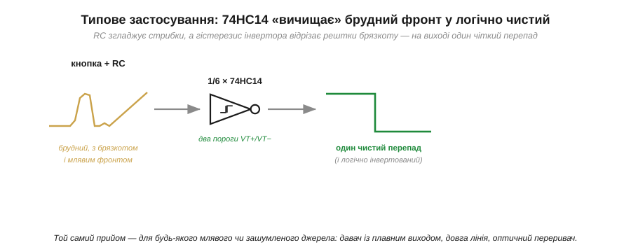

# 📋 74HC14: розпіновка й підключення шести інверторів Шмітта

> Готова мікросхема **74HC14** — це шість [тригерів Шмітта](root:hw-digital/threshold-schmitt) (гістерезис, два пороги, петля на передавальній характеристиці) в одному корпусі за копійки: подав млявий чи зашумлений сигнал — зняв чисту цифру, не пишучи ні рядка коду. Тут зібрано все, щоб завести її в роботу: що всередині, як пронумеровано ніжки DIP-14, як подати живлення й сигнал і де підстелити соломки.

### Що це за клас пристрою

74HC14 — це **шестиканальний інвертувальний буфер із входами-тригерами Шмітта** (*hex inverting Schmitt-trigger*). Кожне слово тут робоче. «Інвертор» (*inverter*) — канал видає логічне заперечення: подали «1» — на виході «0», і навпаки ([вентиль NOT](root:hw-digital/basic-gates)). «Шість» (*hex*) — таких незалежних інверторів у корпусі **шість**, кожен сам по собі. А найголовніше для нас — **«входи-тригери Шмітта»**: на вході кожного стоїть саме той [гістерезис із двома порогами](root:hw-digital/threshold-schmitt) замість одного. Тобто 74HC14 — не «логіка для обчислень», а передусім **формувач сигналу**: шість маленьких чистильників в одному корпусі.

Літери теж не випадкові. **HC** означає «High-speed CMOS» — швидку КМОН-логіку з [сімейства HC](root:hw-digital/logic-families), що живиться від 2 до 6 В і добре пасує до 5-вольтових і 3.3-вольтових систем. Є близький родич **74HCT14** з тих самих шести інверторів, але з вхідними порогами під старий TTL — про цю відмінність ідеться серед варіацій класу.

### Блок-схема: що всередині

Усередині корпусу немає нічого, крім шести однакових ланцюжків «вхід → тригер Шмітта → інвертор → вихідний буфер». Жодного спільного вузла, крім живлення й землі.


*Ліворуч — логіка: шість незалежних інверторів, у кожного на вході петля-символ гістерезису ([тригер Шмітта](root:hw-digital/threshold-schmitt)). Праворуч — реальний корпус DIP-14: входи позначено nA, виходи nY, живлення VCC — пін 14, спільна земля GND — пін 7. Канали самостійні: можна задіяти один, а решту п'ять притягнути до живлення чи землі (вільними їх лишати не можна — чому, видно серед типових грабель).*

### Типова розпіновка

Розведення ніжок у 74HC14 — стандартне для всієї «чотирнадцятиногої» логіки, тож запам'ятавши його раз, ви впізнаєте сотні інших мікросхем. У звичному корпусі DIP-14 (чи його поверхневих родичах SOIC/TSSOP) пари «вхід–вихід» ідуть поряд:

```
        ┌───────∪───────┐
 1A  1 ─┤               ├─ 14  VCC   (живлення +2…6 В)
 1Y  2 ─┤               ├─ 13  6A
 2A  3 ─┤               ├─ 12  6Y
 2Y  4 ─┤    74HC14     ├─ 11  5A
 3A  5 ─┤               ├─ 10  5Y
 3Y  6 ─┤               ├─  9  4A
GND  7 ─┤               ├─  8  4Y
        └───────────────┘
```

Орієнтир на корпусі — **виїмка-ключ** (півколо) з одного торця: тримаючи її вгорі, пін 1 знаходимо ліворуч зверху, далі нумерація йде **проти годинникової** стрілки. Живлення завжди в одному кутку (пін 14, VCC), земля — навпроти по діагоналі (пін 7, GND). Шість входів — це піни 1, 3, 5, 9, 11, 13; шість виходів — 2, 4, 6, 8, 10, 12.

### Підключення

Завести 74HC14 в роботу гранично просто. **Живлення:** на пін 14 — ту саму напругу, що живить вашу логіку (зазвичай 3.3 В або 5 В), пін 7 — на спільну землю. **Обов'язково** поставте керамічний конденсатор 0.1 мкФ між VCC і GND **впритул** до корпусу — блокувальний (*decoupling*) конденсатор гасить кидки струму в момент перемикання; без нього швидка КМОН-логіка з її [крутими фронтами](root:hw-digital/edges-rise-time) ловить власні наводки. **Сигнал:** на будь-який вхід nA, очищений результат — з відповідного виходу nY. Пам'ятайте лише, що вихід **інвертований**: якщо інверсія заважає, пропустіть сигнал через **два** канали поспіль — подвійне заперечення повертає полярність, а гістерезис спрацьовує двічі.

### Що знімається з виходу

Те, заради чого 74HC14 і ставлять найчастіше, — **вичистити брудний сигнал**: подати млявий чи зашумлений фронт на будь-який вхід nA й зняти з виходу nY один різкий, чистий перепад (логічно інвертований).


*Зліва — типовий «брудний» сигнал реального світу: млявий фронт із брязкотом (наприклад, від механічного контакту, згладженого RC-ланцюжком). Посередині — інвертор Шмітта з його двома порогами. Праворуч — на виході один чіткий перепад без жодного фантомного імпульсу (і логічно інвертований). Той самий прийом працює для будь-якого повільного чи зашумленого джерела.*

Той самий один інвертор здатний і на більше: додати до нього резистор і конденсатор — і він **сам себе розгойдає** в генератор прямокутних імпульсів без кварцу й коду. Як саме він коливається і від чого залежить частота — у прикладі про [генератор на 74HC14](root:hw-digital/threshold-schmitt/proj-74hc14-oscillator.md).

### Типові граблі

Попри простоту, на 74HC14 легко наступити на кілька класичних грабель — усі вони ростуть із природи [КМОН-входу](root:hw-digital/logic-families).

- **Невикористані входи не можна лишати «в повітрі».** КМОН-вхід має дуже високий опір, тож вільний (*floating*) вхід ловить наводки, плаває біля порога й змушує внутрішні транзистори постійно перемикатися — чип гріється й шумить. Кожен незадіяний вхід nA **притягніть** прямо до VCC або до GND (можна навіть просто перемкнути на сусідній сигнал). Гістерезис тут не рятує: він приборкує шум на корисному фронті, але не утримує абсолютно вільний пін.
- **Гістерезис кінцевий, а не нескінченний.** Смуга VT+ − VT− у 74HC14 — близько 0.4…1.4 В залежно від живлення (за даташитом, при VCC = 4.5 В типово VT+ ≈ 2.4 В, VT− ≈ 1.4 В, тобто смуга ≈ 1 В). Якщо розмах шуму перевищує цю смугу — брязкіт проб'ється і крізь Шмітт. Для дуже брудних сигналів спершу згладьте їх RC-фільтром, а вже потім подавайте на 74HC14 — саме цей дует «RC + Шмітт» і показано вище.
- **Пороги «плавають» від екземпляра й від напруги.** VT+ і VT− не фіксовані: вони зсуваються разом із VCC і трохи різняться від чипа до чипа. Не закладайтеся на точні їх значення — 74HC14 чудовий формувач, але **не** прецизійний компаратор. Потрібен точний поріг — беріть [окремий компаратор](root:hw-analog/comparator) з опорним джерелом.
- **Швидкі фронти можуть «дзвеніти» на довгих доріжках.** Виходи HC мають [круті фронти](root:hw-digital/edges-rise-time); на довгій лінії це збуджує дзвін. Лікується серійним резистором 22…33 Ом біля виходу.

### Варіації класу

74HC14 — лише один представник великого сімейства «гекс-Шміттів», і сусідів корисно знати. Найближчий — **74HCT14**: ті самі шість інверторів, але входи з нижчими, «TTL-сумісними» порогами, щоб надійно читати старі 5-вольтові TTL-сигнали ([рівні TTL проти CMOS](root:hw-digital/logic-families)). Сучасніший швидкий родич — **74LVC14** на нижчі напруги (аж до ~1.65 В) і часто з толерантністю входів до 5 В. Потрібен **не**інвертувальний варіант — є аналог із буферами замість інверторів. А коли шести каналів забагато — той самий тригер Шмітта випускають і поодинці, в крихітних корпусах на один-два вентилі. Принцип скрізь той самий — [гістерезис](root:hw-digital/threshold-schmitt); різняться лише кількість каналів, рівні порогів і корпус.

Отже, 74HC14 — це той випадок, коли ціла теорія [порогового входу з гістерезисом](root:hw-digital/threshold-schmitt) згортається в одну дешеву мікросхему: подав млявий чи брудний сигнал — зняв чисту цифру. Її варто тримати в шухляді як універсальний «чистильник» — і для [брязкоту механічної кнопки](root:hw-digital/contact-debounce) вона одне з перших апаратних рішень, що спадають на думку.
