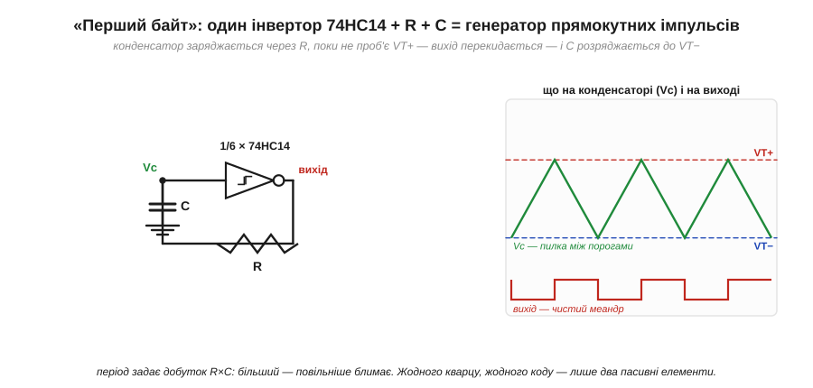

# ⚙️ 74HC14 як генератор: R, C і один інвертор Шмітта замість кварцу

> Один [інвертор Шмітта](root:hw-digital/threshold-schmitt) із корпусу [74HC14](root:hw-digital/threshold-schmitt/api-74hc14.md), плюс один резистор і один конденсатор, — і виходить **генератор прямокутних імпульсів** без кварцу, без мікроконтролера, без жодного рядка коду. Тут — чому ця схема взагалі коливається (а не застигає посередині), як вивести її період із двох порогів і заряду конденсатора й на що зважати, коли потрібна конкретна частота. Це найдешевший спосіб побачити гістерезис «наживо»: плавний заряд конденсатора виходить чистим меандром.

## Задача

Треба джерело прямокутних імпульсів — блимання світлодіода, простий такт для іншої схеми, чутний тон на пищавку. Кварцовий резонатор дав би точну частоту, але коштує грошей і місця, а тут точність не потрібна — потрібно **дешево, з двох деталей, і щоб завелося одразу**. Виявляється, того самого інвертора Шмітта, що чистить сигнали, досить, аби зібрати такий генератор самотужки.

## Чому саме гістерезис змушує схему коливатися

Візьмімо один інвертор і замкнімо його вихід назад на власний вхід через резистор R, а від входу до землі повісимо конденсатор C.


*Вихід інвертора через резистор R заряджає конденсатор C, під'єднаний до власного входу. Поки напруга Vc повзе вгору й росте до VT+ — вихід тримає високий рівень; щойно Vc проб'є VT+, вихід перекидається в низький і починає **розряджати** C — аж доки Vc впаде нижче VT−, і все повторюється. На вході — пилка між двома порогами, на виході — чистий меандр. Саме гістерезис робить цей цикл можливим: без двох порогів схема просто застрягла б посередині.*

Уявімо, що вихід щойно став **високим**. Через резистор він заряджає конденсатор, і напруга на вході Vc повзе вгору. Звичайний інвертор із єдиним порогом перекинувся б рівно на ньому — і застряг би там, ледь тремтячи біля межі. Але вхід тут **Шміттів**, із двома порогами. Тож вихід тримає високий рівень, аж доки Vc не дотягнеться до **верхнього** порога VT+; щойно пробили VT+ — вихід перекидається в **низький** і тепер уже **розряджає** конденсатор. Vc повзе вниз — і вихід тримає низький рівень, аж доки Vc не впаде до **нижнього** порога VT−, і все починається спочатку.

Ось де ключ: **без другого порога коливань не було б**. Один поріг зупинив би схему в рівновазі десь посередині; два пороги роблять таку рівновагу неможливою — щойно система дійшла одного краю, вона мусить бігти до іншого. Гістерезис перетворює «застигання» на «гойдання».

## Період крок за кроком

Порахуймо, скільки триває один цикл. Конденсатор через резистор заряджається й розряджається за звичайним експоненційним законом RC; лишається знайти час на кожній із двох ділянок — від VT− до VT+ (заряд) і назад від VT+ до VT− (розряд). Позначмо високий рівень виходу VOH, низький — VOL (у КМОН вони близькі до живлення й до нуля).

```
заряд   (вихід високо, Vc росте VT− → VT+):
    Vc(t) = VOH − (VOH − VT−)·e^(−t / RC)
    при Vc = VT+ :   t₁ = R·C · ln[(VOH − VT−) / (VOH − VT+)]

розряд  (вихід низько, Vc падає VT+ → VT−):
    Vc(t) = VOL + (VT+ − VOL)·e^(−t / RC)
    при Vc = VT− :   t₂ = R·C · ln[(VT+ − VOL) / (VT− − VOL)]

період:  T = t₁ + t₂
```

Формула спрощується, щойно підставимо типовий випадок: вихід гойдається від рейки до рейки (VOH ≈ VCC, VOL ≈ 0), а пороги лягли симетрично — VT+ ≈ ⅔·VCC, VT− ≈ ⅓·VCC. Тоді обидва логарифми стають ln 2:

```
t₁ = R·C · ln[(VCC − VCC/3) / (VCC − 2·VCC/3)] = R·C · ln 2
t₂ = R·C · ln[(2·VCC/3) / (VCC/3)]             = R·C · ln 2
T  = t₁ + t₂ = 2·ln2·R·C ≈ 1.39·R·C
f  = 1 / T ≈ 0.72 / (R·C)
```

Головне тут — частота залежить **тільки** від добутку R·C, а не від живлення: VCC скоротилося. Це і зручно (напруга гуляє — частота стоїть), і показово — усе тримається на одній сталій часу RC.

**Приклад (частота блимання).** Візьмімо R = 100 кОм і C = 1 мкФ — скільки блимань за секунду?

```
дано:   R = 100 кОм = 1.0×10⁵ Ом
        C = 1 мкФ   = 1.0×10⁻⁶ Ф
стала:  R·C = 1.0×10⁵ × 1.0×10⁻⁶ = 0.10 с

T = 2·ln2·R·C ≈ 1.39 × 0.10 ≈ 0.14 с   →   f ≈ 7 Гц
```

На практиці пороги реального 74HC14 лежать не точно на ⅓ і ⅔, а вихід не дотягує до рейок ідеально, тож коефіцієнт «плаває»: різні екземпляри й даташити дають T у межах ≈ (1.0…1.4)·R·C, тобто f ≈ (0.7…1.0)/(R·C). Для блимання світлодіодом цього більш ніж досить — вийде близько 7–8 спалахів за секунду. Хочете швидше — зменшіть R чи C, повільніше — збільшіть.

> 🔧 **Навіщо це.** Це кишеньковий генератор «на коліні»: коли треба такт, тон чи блимання, а точність байдужа, дешевше за 74HC14 з парою деталей не буває. Але саме тому, що частота тримається на розкиданих порогах і на вихідних рівнях чипа, вона **не прецизійна** — гуляє з температурою, живленням і від екземпляра до екземпляра. Потрібна точна, стабільна частота (годинник, зв'язок, звук із нотами) — там ставлять кварц; Шміттів автогенератор лишають для невибагливих задач. І ще: RC-вузол не можна навантажувати — будь-який зайвий струм із входу спотворить заряд і зсуне частоту.

Це і є найкоротший місток від теорії до заліза: [два пороги гістерезису](root:hw-digital/threshold-schmitt), замкнені на заряд конденсатора, самі народжують цифровий такт.
