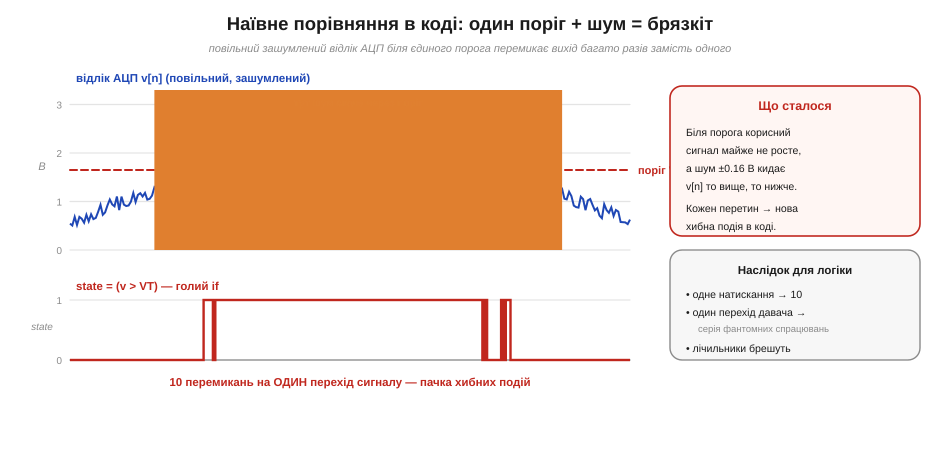
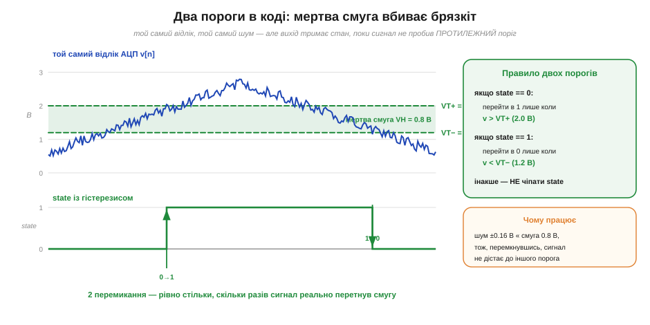
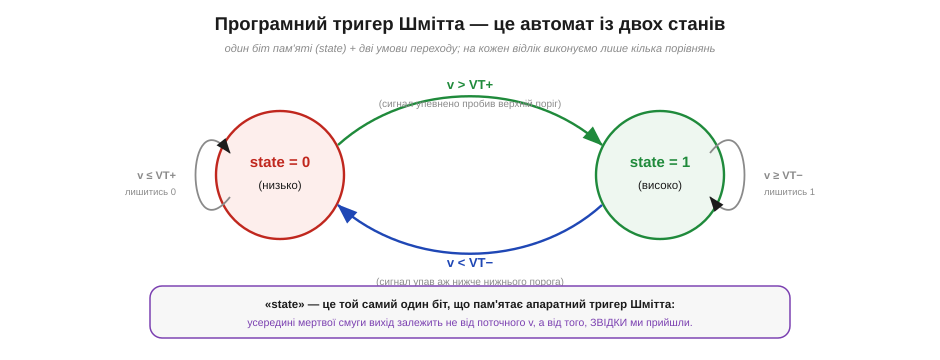

# ⚙️ Гістерезис у коді: програмний тригер Шмітта

> ⚙️ Алгоритмічна вставка про гістерезис у коді. **Апаратний** [тригер Шмітта](root:hw-digital/threshold-schmitt) вбиває брязкіт двома порогами й додатним зворотним зв'язком. Та коли сигнал уже **зайшов у мікроконтролер** через АЦП і живе як числа, того самого гістерезису можна досягти **кодом** — без жодної зайвої деталі на платі. Цей самий прийом працює всюди, де оцифрований сигнал тремтить, — ним згладжують і [брязкіт кнопки](root:hw-digital/contact-debounce), і поріг на оцифрованому давачі.

## Задача

Уявімо найпоширенішу ситуацію розробки: мікроконтролер раз у раз читає АЦП і має вирішити одне грубе питання — «рівень піднявся вище межі чи ні?». Скажімо, треба ввімкнути вентилятор, коли напруга з термодавача перейшла поріг, або позначити «бак повний», коли сигнал поплавця перевалив за рівень. Здавалося б, рядок коду: `on = (v > THRESHOLD)`.

Та сигнал реального давача **зашумлений**, а біля порога він до того ж повзе **повільно**. І щойно `v` опиняється поблизу межі, шум починає кидати кожен наступний відлік то трохи вище, то трохи нижче неї. Наївне порівняння слухняно перемикає вихід **щоразу** — і замість одного чистого спрацювання ми отримуємо чергу хибних. Це той самий **брязкіт** (*chatter*), що й на апаратному [порозі без запасу](root:hw-digital/threshold-schmitt), тільки тепер він народжується у вашому `if`.


*Повільний зашумлений відлік АЦП v[n] біля **єдиного** порога VT. У підсвіченій зоні шум ±0.16 В багато разів перекидає сигнал через межу, і голий вираз `state = (v > VT)` дає **10 перемикань** на один-єдиний перехід сигналу. Для логіки далі це катастрофа: одне натискання обертається на десяток подій, лічильники брешуть.*

## Ідея

Корінь біди той самий, що й у всієї цифрової логіки: біля єдиної межі **немає запасу**, тож найменший шум змінює відповідь. Ліки теж ті самі — гістерезис, тільки реалізований не парою транзисторів, а **пам'яттю про власний стан**. Замість одного порога заводимо **два**: верхній `VT+` і нижній `VT−`. І головне — вихід тепер залежить не лише від поточного `v`, а й від того, у якому стані ми вже перебуваємо:

- якщо зараз `state == 0`, перемикаємось у `1` **лише** коли `v` упевнено пробив **верхній** поріг (`v > VT+`);
- якщо зараз `state == 1`, повертаємось у `0` **лише** коли `v` упав аж нижче **нижнього** порога (`v < VT−`);
- між порогами (у «мертвій смузі») ми `state` **не чіпаємо** — він тримає попереднє значення.


*Той самий відлік і той самий шум, але з двома порогами (VT+ = 2.0 В, VT− = 1.2 В) і зеленою «мертвою смугою» VH = 0.8 В між ними. Шум ±0.16 В набагато менший за смугу, тож, перемкнувшись на одному порозі, сигнал зі своїм тремтінням просто **не дістає** до іншого. Підсумок — рівно **2 перемикання**: один чистий 0→1 і один 1→0.*

Глибша суть тут та сама, що й у заліза: щойно ми ухвалили рішення, ми робимо протилежне рішення **дорожчим**. А це означає, що змінна `state` фактично **пам'ятає** один біт — той самий біт, що його зберігає апаратний [тригер Шмітта](root:hw-analog/schmitt-trigger). Усередині смуги один і той самий `v` дає різний вихід залежно від того, **звідки** ми прийшли, — тобто весь алгоритм є крихітним **автоматом із двох станів**.


*Той самий код як діаграма станів: два стани (0 і 1) і дві умови переходу між ними (`v > VT+` нагору, `v < VT−` додолу). Доки сигнал у мертвій смузі, обидві петлі ведуть «лишитися», і автомат тримає свій біт незмінним.*

## Реалізація мовою C

Уся реалізація — кілька рядків, які виконуються на **кожен** новий відлік з АЦП. Це прошивка мікроконтролера, тож код — мовою C; стан автомата тримаємо у `static`-змінній, а пороги — прямо у сирих відліках АЦП:

```c
#include <stdint.h>
#include <stdbool.h>

/* Пороги — прямо у відліках 12-бітного АЦП (0…4095), без переведення у вольти.
   При Vref = 3.3 В це ≈ 2.0 В і ≈ 1.2 В, тобто смуга VH ≈ 0.8 В. */
#define VT_HI  2482u        /* верхній поріг, у відліках */
#define VT_LO  1489u        /* нижній поріг,  у відліках */

/* Викликати на КОЖЕН свіжий відлік v з АЦП. Повертає стійкий біт. */
bool schmitt_step(uint16_t v)
{
    static bool state = false;      /* збережений біт — пам'ять автомата */

    if (!state && v > VT_HI)
        state = true;               /* упевнено пробили верх → перемкнулись у 1 */
    else if (state && v < VT_LO)
        state = false;              /* впали аж нижче низу → повернулись у 0 */
    /* інакше v у мертвій смузі — state не чіпаємо */

    return state;
}
```

Ширину смуги `VH = VT_HI − VT_LO` беруть **трохи більшою за розмах шуму** від піка до піка: тоді тремтіння в межах смуги не дістане протилежного порога. Платою, як і в залізі, є те, що точка перемикання стає менш точною на ±VH/2, — знову той самий компроміс «стійкість проти точності». А самі пороги зручно тримати прямо у **сирих відліках АЦП** (наприклад, для 12-бітного перетворювача — у числах 0…4095), щоб не витрачати такти на переведення у вольти.

## Складність і пастки на МК

**Обчислень — копійки:** на відлік лише пара порівнянь і присвоєнь, тобто **O(1)** за часом і **одна** змінна стану за пам'яттю. Цей гістерезис буквально безкоштовний — він не додає ні деталей на плату, ні відчутного навантаження на ядро, тож його ставлять усюди, де оцифрований сигнал може тремтіти. Та кілька характерних граблів на мікроконтролері знати варто.

- **Втрачений стан.** Уся магія тримається на змінній `state`, що **переживає** виклики. Якщо випадково оголосити її локальною й заводити з нуля на кожен відлік, гістерезис зникне, а брязкіт повернеться. `state` має бути `static` (чи полем структури), а не локальною.
- **Пороги в різних одиницях.** Класична помилка — звіряти сирий відлік АЦП із порогом, заданим у вольтах (або навпаки). Тримайте `v`, `VT_HI` і `VT_LO` в **одних** одиницях; найдешевше — усе у відліках.
- **Замала смуга.** Якщо `VH` вужча за реальний розмах шуму, два пороги вироджуються майже в один — і брязкіт проскакує. Зміряйте шум давача й беріть смугу з запасом; занадто широка теж погана — забариться реакція й «змаже» точку.
- **Старт у мертвій смузі.** Якщо живлення ввімкнулось, коли сигнал уже **всередині** смуги, початкове значення `state` визначає вихід довільно. Задайте розумний початковий стан (часто `0`) свідомо, а не покладайтесь на випадок.
- **Дільник на ціле.** Рахуючи пороги з відсотків живлення у цілочисловій арифметиці (без FPU), стежте за порядком множення й ділення, щоб не втратити точність на округленні, — це загальна осторога [цілочислової арифметики з фіксованою комою](root:hw-arch/fixed-point).

Висновок той самий, що й у заліза: два пороги замість одного перетворюють брудний, тремтливий відлік на чистий, стійкий біт — лише тепер цей тригер Шмітта живе **у вашому коді**, не коштує жодної деталі й переноситься з проєкту в проєкт одним копіюванням.
