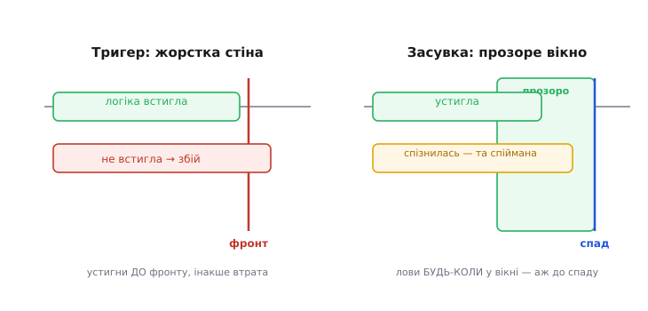
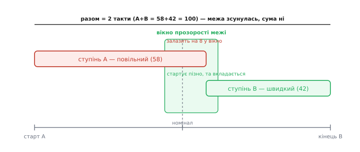
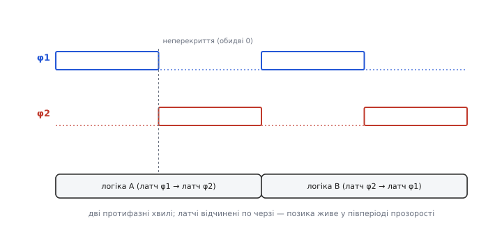
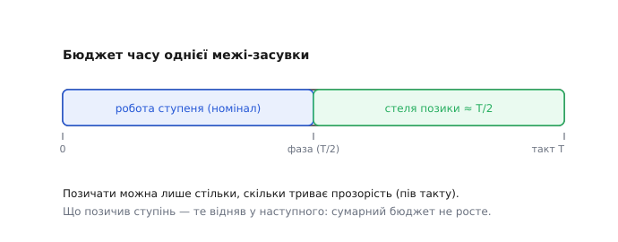

# Позичання часу в латч-конвеєрах

Уся швидка цифрова техніка впирається в одне число — **період такту**. Що коротший такт, то більше операцій за секунду. А що диктує той період? Найповільніша ділянка логіки між двома комірками пам'яті: доки вона не дорахує, наступний фронт давати не можна. Здавалося б, тут глухий кут — швидкість схеми задає її найгірший шматок. Та є хитрий спосіб трохи послабити цей диктат: дозволити повільному шматкові **позичити** трохи часу в сусіда, який упорався раніше. Цей прийом і зветься **позичання часу** (англ. *time borrowing*), і працює він лише тоді, коли межами між ступенями стоять не тригери, а **прозорі засувки**.

### Чому тригер ставить жорстку стіну

Згадаймо, як [тригер](topic:hw-digital/d-flip-flop) захоплює дані. Він оновлює вихід **рівно по фронту** такту — в одну мить, а не протягом якогось часу. Це його головна чеснота: вся машина клацає синхронно. Але саме через це кожен ступінь дістає **жорсткий дедлайн**.

Уяви конвеєр: логіка ступеня A рахує щось і віддає результат тригерові на межі; далі логіка ступеня B бере його й рахує своє. Тригер на межі приймає результат A **тільки** в мить фронту. Отже, логіка A мусить **устигнути** дорахувати до цього фронту — жодної секунди пізніше. Спізнилась на волосинку — тригер спіймає ще старе, недороблене значення, і схема помилиться. Це і є стіна: дані, що не встигли до фронту, просто втрачені.


*Тригер (ліворуч) захоплює по **фронту** — це вертикальна стіна: устиг до неї — добре, спізнився бодай трохи — втрата. Засувка (праворуч) прозора **цілий півперіод** — це не стіна, а **вікно**: дані, що зайшли пізнувато (жовтогаряча смуга), все одно проходять і фіксуються аж на **спаді** такту. Різниця «мить проти вікна» — уся суть позичання.*

Тепер погляньмо, чим ця стіна кепська. Ступені майже ніколи не рівні за швидкістю: один шлях логіки коротший, інший довший. А період такту доводиться брати **під найдовший** — інакше найповільніший ступінь не встигне. Виходить прикра несправедливість: якщо ступінь A витрачає 6 нс, а ступінь B — лише 4 нс, то такт однак мусить бути ≥ 6 нс. Ті 2 нс запасу в ступеня B ([запас часу, англ. *slack*](topic:hw-digital/critical-path-and-slack)) **пропадають марно** — тригер на межі не дає B поділитися ними з A. Кожен ступінь замкнений у своєму такті, і надлишок одного не рятує нестачу іншого.

### Прозорість засувки — це вже не стіна, а вікно

А що, як прибрати стіну? [Засувка](topic:hw-digital/sr-latch) (точніше — [D-латч](topic:hw-digital/edge-vs-level)) поводиться інакше за тригер: доки такт високий, вона **прозора** — вихід просто повторює вхід (Q=D). Захоплення (замикання на останньому значенні) стається аж на **спаді** такту, коли вона зачиняється.

Ось де ховається можливість. Прозора засувка ловить дані **не в одну мить**, а протягом цілого вікна — усього часу, доки вона відчинена. Якщо логіка A дорахувала трохи **після** того, як вікно відчинилося, — не біда: засувка прозора, свіже значення просто **протікає** крізь неї далі, у логіку B, і буде остаточно зафіксоване лише на спаді. Дедлайн для A зсунувся зі жорсткого «фронт» на м'якше «десь до спаду».

> 🔧 **Навіщо це.** Ось де народжується вся вигода. Прозорість, якою [лякають](topic:hw-digital/d-flip-flop) у контексті тригерів («латч бовтається за входом — небезпечно!»), у конвеєрі обертається **перевагою**. Та сама риса, через яку латч не годиться на просту комірку пам'яті, дає йому здатність приймати запізнілі дані. Тому найшвидші процесори всередині подекуди будують саме на латчах, а не на тригерах: латч-конвеєр дозволяє коротший такт за ту саму логіку.

### Як саме позичається час

Простежмо механізм на очах. Хай межі між ступенями — прозорі засувки, а логіка A виявилась повільною й дорахувала дещо **із запізненням**, уже після номінальної середини такту. Результат A входить у прозору засувку-межу й, оскільки вона відчинена, **одразу тече** далі — у логіку B. B починає рахувати **пізніше** за розклад. Але якщо B — швидкий ступінь із запасом, він **усе одно встигне** до своєї межі. Час, якого забракло A, узявся із запасу B. A **позичив** у B — а сумарний час на два ступені лишився той самий.


*Номінальна межа між тактами — посередині. Ступінь **A** (червоний) повільний і залазить на 8 одиниць у **вікно прозорості** межі. Результат одразу тече в ступінь **B** (зелений), тож B стартує пізно — але він швидкий і **вкладається** до кінця. Сумарний бюджет двох тактів незмінний (58 + 42 = 100): зсунулась лише **межа** між ступенями, а не загальний час. A позичив у B рівно 8.*

Ключ до розуміння: тригер **фіксує** межу між ступенями намертво в мить фронту, а прозора засувка дає цій межі **плавати** в межах вікна. Повільний ступінь відсуває фактичну точку захоплення пізніше — у бік сусіда, — і поки сусід має запас, усе тримається. Ланцюжок ступенів починає поводитись так, ніби важлива лише **сумарна** затримка кількох ступенів, а не піковий кожного окремо. Нерівності затримок **усереднюються** самі собою, без жодного втручання проєктувальника.

### Двофазний такт: де живе вікно позики

Щоб це працювало надійно, латч-конвеєри тактують **двофазно** — двома майже протифазними сигналами, які прийнято звати φ1 і φ2 (грец. *phásis* — «поява, фаза»). Одні межі-засувки відчиняються фазою φ1, сусідні — фазою φ2. Логіка живе **між** латчем на φ1 і латчем на φ2.


*Дві хвилі **φ1** і **φ2** зсунуті на півперіод — коли одна висока, друга низька. Між ними лишають короткий проміжок **неперекриття**, де **обидві** = 0 (щоб дані не «проскочили» крізь два відчинені латчі поспіль). Логіка A сидить між латчем φ1 і латчем φ2; логіка B — між φ2 і наступним φ1. Кожен латч відчинений свій **півперіод** — і саме цей півперіод прозорості є коморою, з якої ступінь може позичати час.*

Двофазність дає ще один дарунок, майже безкоштовно. Оскільки точка захоплення «плаває», латч-конвеєр стає **менш чутливим** до дрібних неточностей такту — [зсуву фаз між копіями такту (skew) і його тремтіння (jitter)](topic:hw-digital/clock-signal). Тригерна схема на них реагує гостро: зсунувся фронт — зсунувся жорсткий дедлайн. А латч просто ловить трохи раніше чи пізніше в межах свого вікна, і невеличкий зсув розчиняється в тому вікні без наслідків.

### Скільки можна позичити — і чим за це платять

Позичання не безмежне, і межа проста: **позичити можна лише стільки, скільки триває прозорість** — тобто приблизно **половину такту** (пів періоду, T/2, доки латч відчинений). Далі латч зачиняється, вікно закривається, і жодна логіка вже нічого не протягне.


*Повна смуга — такт **T**. Ліва половина — «номінальна» робота ступеня. Права половина, аж до **T/2**, — стеля того, що ступінь може позичити з прозорого вікна межі. Але це не безкоштовний час із повітря: **що позичив один ступінь, те відняв у наступного** — сумарний бюджет ланцюжка не росте, лише перерозподіляється.*

Це важливо не переплутати: позичання **не додає** часу конвеєрові загалом. Воно лише **перерозподіляє** наявний час між сусідніми ступенями — забирає в того, хто має запас, і віддає тому, кому бракує. Виграш реальний (можна взяти коротший такт, бо не треба закладатися на найгірший ступінь окремо), але це виграш від **згладжування нерівностей**, а не поява часу нізвідки. Якщо всі ступені однаково завантажені під зав'язку, позичати нема з чого й нема кому.

І є плата. Прозорий латч, крізь який дані **течуть**, легше порушує другу межу таймінгу — [**hold-час** (мінімальний час, доки дані мають ще потриматися після захоплення)](topic:hw-digital/hold-violation). Оскільки в прозорий латч нове значення може прослизнути «наскрізь» раніше, ніж треба, латч-конвеєри вимагають ретельнішого догляду за короткими (швидкими) шляхами — саме тут і потрібен проміжок неперекриття між φ1 і φ2. Тому латчі й дають більшу свободу за швидкістю, але коштують складнішим аналізом таймінгу: інструмент має рахувати, скільки часу кожна межа позичає, і стежити, щоб ніде не «перепозичити». Точний бюджет — скільки конкретна межа може віддати, не зламавши наступну, — виводиться з простої нерівності на затримки й фази ([🧮 бюджет позики: звідки береться стеля T/2](topic:hw-digital/time-borrowing/math-borrow-budget.md)).

### Те саме — у коді прошивки

Позичання часу — це властивість **заліза**, тож у мікроконтролері ти його руками не «вмикаєш». Але саму логіку «жорсткий фронт проти прозорого вікна» корисно відчути в коді, бо вона повторюється щоразу, коли ти тактуєш зовнішню логіку ніжкою МК і мусиш витримати таймінг.

Порівняймо дві моделі захоплення. Тригерна — ловить **рівно** на фронті, пізніше нічого не приймає:

**Умова: тригер ловить `data` лише в мить фронту `clk` 0→1; спізнені дані втрачено.**

:::tabs
```cpp
#include <stdbool.h>

static bool clk_prev = false;
static bool q_ff     = false;

// тригер: одна-єдина мить захоплення
void ff_capture(bool data, bool clk) {
    bool rising = clk && !clk_prev;   // фронт саме зараз?
    if (rising) {
        q_ff = data;                  // взяли рівно те, що є на фронті
    }
    clk_prev = clk;
    // після фронту data хоч як міняйся — q_ff не зрушиться (стіна)
}
```
```python
clk_prev = False
q_ff     = False

# тригер: одна-єдина мить захоплення
def ff_capture(data: bool, clk: bool) -> None:
    global clk_prev, q_ff
    rising = clk and not clk_prev     # фронт саме зараз?
    if rising:
        q_ff = data                   # взяли рівно те, що є на фронті
    clk_prev = clk
    # після фронту data хоч як міняйся — q_ff не зрушиться (стіна)
```
```js
let clkPrev = false;
let qFf      = false;

// тригер: одна-єдина мить захоплення
function ffCapture(data, clk) {
    const rising = clk && !clkPrev;   // фронт саме зараз?
    if (rising) {
        qFf = data;                   // взяли рівно те, що є на фронті
    }
    clkPrev = clk;
    // після фронту data хоч як міняйся — qFf не зрушиться (стіна)
}
```
```go
var clkPrev = false
var qFf     = false

// тригер: одна-єдина мить захоплення
func ffCapture(data, clk bool) {
    rising := clk && !clkPrev         // фронт саме зараз?
    if rising {
        qFf = data                    // взяли рівно те, що є на фронті
    }
    clkPrev = clk
    // після фронту data хоч як міняйся — qFf не зрушиться (стіна)
}
```
:::

А тепер прозорий латч — доки дозвіл високий, він **тече** за входом і фіксує останнє значення аж на спаді. Пізні дані, що зайшли **до** спаду, ще встигають:

**Умова: латч прозорий, доки `en`=1 (Q тече за `data`); фіксує на спаді `en` 1→0.**

:::tabs
```cpp
#include <stdbool.h>

static bool en_prev = false;
static bool q_latch = false;

// латч: цілий рівень — вікно захоплення
void latch_capture(bool data, bool en) {
    if (en) {
        q_latch = data;               // прозоро: тече за входом весь час, доки en=1
    }
    // на спаді en 1→0 останнє значення просто лишається в q_latch — це й є «фіксація»
    en_prev = en;
    // дані, що змінилися пізно, АЛЕ доки en ще =1, встигли пройти — це і є позика часу
}
```
```python
en_prev = False
q_latch = False

# латч: цілий рівень — вікно захоплення
def latch_capture(data: bool, en: bool) -> None:
    global en_prev, q_latch
    if en:
        q_latch = data                # прозоро: тече за входом весь час, доки en=1
    # на спаді en 1→0 останнє значення просто лишається в q_latch — це й є «фіксація»
    en_prev = en
    # дані, що змінилися пізно, АЛЕ доки en ще =1, встигли пройти — це і є позика часу
```
```js
let enPrev = false;
let qLatch = false;

// латч: цілий рівень — вікно захоплення
function latchCapture(data, en) {
    if (en) {
        qLatch = data;                // прозоро: тече за входом весь час, доки en=1
    }
    // на спаді en 1→0 останнє значення просто лишається в qLatch — це й є «фіксація»
    enPrev = en;
    // дані, що змінилися пізно, АЛЕ доки en ще =1, встигли пройти — це і є позика часу
}
```
```go
var enPrev = false
var qLatch = false

// латч: цілий рівень — вікно захоплення
func latchCapture(data, en bool) {
    if en {
        qLatch = data                 // прозоро: тече за входом весь час, доки en=1
    }
    // на спаді en 1→0 останнє значення просто лишається в qLatch — це й є «фіксація»
    enPrev = en
    // дані, що змінилися пізно, АЛЕ доки en ще =1, встигли пройти — це і є позика часу
}
```
:::

Різниця в одному рядку умови — `rising` проти `en`, — але наслідок величезний. Тригер бере знімок в одну мить; латч тримає вікно відчиненим цілий рівень. У залізі саме це вікно й дає повільному ступеню шанс дорахувати «внапозичку»: значення, що зайшло у прозорий латч навіть із запізненням, усе одно протече далі й буде спіймане на спаді — так само, як `data`, оновлене пізно, але доки `en` ще =1, потрапляє в `q_latch`.

Зверни увагу й на зворотний бік у цьому ж коді: доки `en`=1, будь-яка зміна `data` **одразу** міняє `q_latch`. Якщо наступний ступінь чекає стабільного значення, ця прозорість може віддати йому нове **зарано** — та сама загроза hold-часу, тільки в програмній подобі. Ось чому справжня цифрова схема так дбає про короткі шляхи й проміжки неперекриття.

> 🔧 **Навіщо це.** Три речі винеси. Перша: тригерний конвеєр ставить кожному ступеню **жорсткий дедлайн** — фронт; латч-конвеєр ставить **вікно** прозорості, і повільний ступінь може позичити час у швидкого сусіда. Друга: позичання **не створює** час — воно **перерозподіляє** його між сусідами (стеля — пів такту, T/2), тож виграш іде від згладжування нерівних ступенів, а рівномірно завантаженому конвеєру воно не поможе. Третя: за цю свободу платять складнішим таймінгом і гострішою загрозою [hold-часу](topic:hw-digital/hold-violation), тому латчі беруть там, де реально женуться за частотою (нутро швидких процесорів), а звичайну логіку все ж будують на простих і передбачуваних [тригерах](topic:hw-digital/d-flip-flop). Запам'ятай образ: **тригер — стіна, латч — вікно**; позичання часу живе саме в тому вікні.

---

Швидкість синхронної схеми впирається в найповільніший ступінь, бо [тригер](topic:hw-digital/d-flip-flop) на межі захоплює дані **рівно по фронту** — це жорстка стіна, і запас швидшого сусіда пропадає. Якщо ж межами поставити **прозорі засувки**, стіна стає **вікном**: доки латч відчинений (цілий півперіод), запізнілі дані все одно течуть далі й фіксуються аж на спаді. Так повільний ступінь **позичає час** у сусіда з запасом — нерівності затримок усереднюються, а такт можна взяти коротший. Тактують це двофазно (φ1/φ2 з проміжком неперекриття), і схема заодно стає стійкішою до зсуву й тремтіння такту. Ціна: позичити можна лише до T/2, позика **перерозподіляє**, а не додає час, і гострішою стає загроза [hold-часу](topic:hw-digital/hold-violation). Образ для пам'яті — **тригер ставить стіну, латч відчиняє вікно**.
