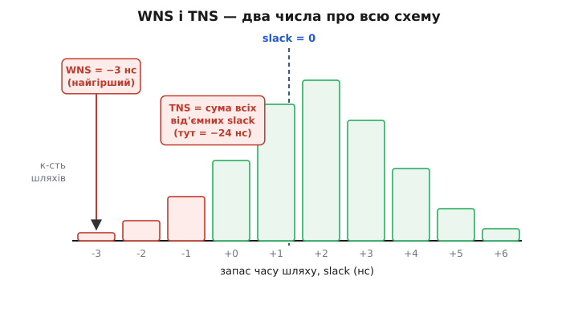
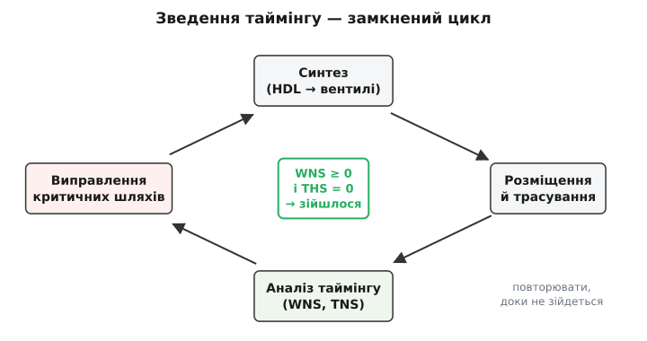
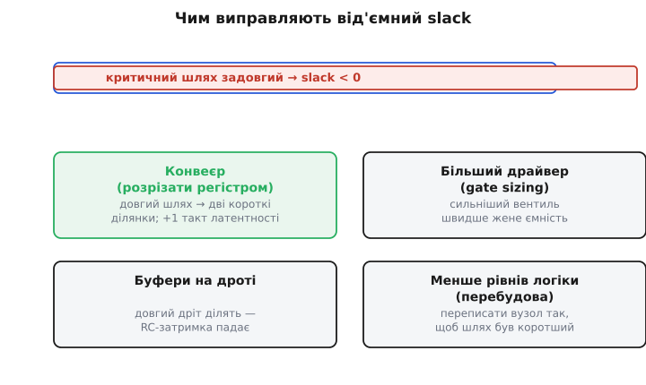

# Зведення таймінгу

Схема на десятки тисяч тригерів або зійдеться в часі — або ні. **Зведення таймінгу** (англ. *timing closure*; *closure* — замикання, зведення докупи, від лат. *claudere* — зачиняти) — це не одна дія, а цілий процес: домогтися, щоб **кожен** сигнал у синхронній схемі встигав туди, куди має, за відведений період такту, і щоб жоден не приходив зарано. Слово «зведення» тут точне: інструмент, дизайнер і саме залізо ганяють дизайн по колу — синтез, розкладка, аналіз, правка, знову аналіз — доки числа не збіжаться в потрібну точку. Коли вони збіглися, кажуть «таймінг зійшовся» (*timing closed*), і лише тоді дизайн можна прошивати в чип чи віддавати на виготовлення. Доки не зійшовся — це не дизайн, а чернетка, яка на потрібній частоті працюватиме як пощастить.

Питання виростає з тих самих двох чисел, що керують кожним тригером — [setup і hold час, через які народжується метастабільність](topic:hw-digital/metastability-timing). Тільки прикладені вони не до однієї пари тригерів на макетці, а до **всіх** шляхів велетенського дизайну одночасно. Один шлях полагодив — сусідній зіпсувався; підтягнув частоту — розсипалося ще п'ять місць. Саме через це «зведення» стало окремим ремеслом зі своїми числами, прийомами й пастками.

### Два числа, що вирішують долю дизайну

Щоб керувати тисячами шляхів, потрібно згорнути їх у щось осяжне. Для цього аналізатор рахує по кожному перегону «від тригера до тригера» **запас часу** — [slack (провис, вільний кінець мотузки)](topic:hw-digital/fpga-timing-and-routing): наскільки сигнал устигає раніше, ніж мусив. Додатний slack — встигаємо; від'ємний — не встигаємо, шлях провалено. Але шляхів безліч, і дивитися на кожен окремо неможливо. Тому весь дизайн згортають у **два** числа.

**WNS** (англ. *Worst Negative Slack* — найгірший від'ємний запас) — це slack **найгіршого** шляху в усьому дизайні. Одне число, що каже: наскільки провалено те місце, яке провалено найсильніше. Якщо WNS невід'ємний — жоден шлях не провалено, і за setup дизайн чистий. Якщо WNS = −3 нс — десь є перегін, якому бракує аж трьох наносекунд, і саме він тягне все донизу.

**TNS** (англ. *Total Negative Slack* — сумарний від'ємний запас) — це **сума** всіх від'ємних slack по всіх кінцевих точках. WNS каже, *наскільки* глибока найглибша яма; TNS каже, *скільки* ям загалом і які вони сумарно. Один провалений шлях на −3 нс і сотня провалених по −0.1 нс дадуть однаковий WNS = −3, але геть різний TNS: у першому випадку −3, у другому −13. Це різні хвороби й різне лікування.


*Кожен стовпчик — скільки шляхів мають такий запас. Праворуч від нуля (зелене) — встигають; ліворуч (червоне) — провалені. WNS — найлівіший провалений шлях (тут −3 нс). TNS — сума всіх від'ємних запасів (тут −24 нс): вона каже, скільки роботи попереду.*

> 🔧 **Навіщо це.** Після кожної збірки FPGA-дизайну ти дивишся спершу на ці два числа, і вони одразу підказують стратегію. **WNS < 0, TNS малий** (кілька шляхів ледь не встигають) — точкова хвороба: знайди ті кілька перегонів і полагодь саме їх. **TNS великий, розмазаний по сотнях шляхів** — системна хвороба: або ціль частоти надто зухвала для цього дизайну, або десь глобальна проблема (поганий такт, затиснений район чипа), і колупати шляхи поодинці марно. **WNS ≥ 0 і THS = 0** (для hold — свій найгірший запас, англ. *Total Hold Slack*) — таймінг зійшовся, можна заливати. Ці два числа — приладова дошка всього процесу.

Мета зведення, отже, формулюється в одному рядку: **WNS ≥ 0 і TNS = 0** за setup, і те саме за hold. Нуль від'ємного запасу означає, що не лишилося жодного шляху, який не встигає. Все ремесло — привести дизайн у цей стан.

### Чому це цикл, а не разова дія

Здавалося б: інструмент розклав логіку, порахував slack, показав провалені шляхи — виправ їх, і по всьому. Чому «зведення» перетворюється на впертий цикл, який може крутитися днями?

Причина в тому, що **всі шляхи ділять один спільний ресурс** — місце на чипі й дроти між клітинками. Коли ти виправляєш один критичний шлях — скажімо, просиш інструмент покласти два тригери ближче один до одного, щоб дріт між ними скоротився, — ці тригери займають місце, яке хтось інший уже займав. Той «хтось» тепер їде далі, його дроти довшають, і **його** шлях може провалитися. Таймінг — це ковдра, яку натягуєш на один кут, а оголюється інший. Тому після кожної правки треба **перерахувати весь дизайн наново** й подивитися, що зламалося тепер.


*Цикл зведення: HDL синтезується у вентилі, вентилі розкладаються по чипу й з'єднуються дротами, аналізатор рахує WNS/TNS, дизайнер (або сам інструмент) править найгірші шляхи — і все по колу. Вихід один: коли WNS ≥ 0 і THS = 0.*

Цей цикл проходить чотири станції. **Синтез** перетворює [опис мовою апаратури](topic:hw-digital/hdl) на мережу конкретних вентилів і тригерів. **Розміщення й трасування** (англ. *place and route*) розкладає ці клітинки по фізичному чипу й прокладає між ними дроти — саме тут народжуються реальні затримки, бо довжина дроту стає відомою лише після розкладки. **Аналіз таймінгу** (той самий [статичний розрахунок slack по всіх перегонах](topic:hw-digital/fpga-timing-and-routing)) виносить вирок: WNS, TNS, список винних. **Виправлення** змінює щось — код, обмеження або підказку інструменту — щоб найгірші шляхи покоротшали. І знову синтез. Кожен оберт наближає числа до нуля; ремесло дизайнера — щоб оберти **сходилися**, а не крутилися вічно, ганяючи одну й ту саму проблему з кута в кут.

### Чому важко: один дизайн, багато світів

Найпідступніше в зведенні — те, що затримки в чипі **не фіксовані**. Один і той самий вентиль перемикається то швидше, то повільніше залежно від умов, у яких опинився чип. І схема має працювати в **усіх** цих умовах, а не лише в тих, де її зібрали на столі.

Затримку роздмухують або стискають три речі, які англійською звуть **PVT**: **P**rocess (розкид виготовлення — два однакові чипи з різних куточків пластини трохи різні), **V**oltage (напруга живлення — просіла на 5%, і вентилі оспали), **T**emperature (температура — гарячий кремній зазвичай повільніший). Кожне поєднання крайніх значень — це **куток** (англ. *corner*): «повільний кремній, низька напруга, спека» — найгірший для setup, бо все повільне й довгий шлях не встигає; «швидкий кремній, висока напруга, холод» — найгірший для hold, бо все летить і дані прибувають надто рано. Аналізатор рахує таймінг **у кожному кутку окремо**, і зведення означає зійтися в **усіх** водночас. Полагодив setup у повільному кутку, а зламав hold у швидкому — не зійшлося.

> 🔧 **Навіщо це.** Ось чому не можна судити про робочу схему з того, що «на макетці ж запустилося». На твоєму теплому столі при рівно 3.3 В чип потрапив у зручний куток і критичний шлях устиг. Той самий виріб узимку на просілій батарейці потрапляє в повільний куток — і той самий шлях уже не встигає, схема починає збоїти «на морозі». Або навпаки: гарячий шлях, що ледь тримав hold, у мороз розганяється й ловить дані зарано. Аналіз по кутках існує саме для того, щоб піймати ці випадки **до** того, як їх піймає замерзлий користувач. Тому таймінг зводять не «щоб запустилося», а «щоб не впало в жодних умовах експлуатації».

### Правило гри: обмеження

Інструмент сам по собі не знає, який такт тобі потрібен і які затримки на ніжках припустимі. Йому це **кажуть** — окремим файлом **обмежень** (англ. *constraints*): «такт має 10 нс», «сигнал на цій ніжці приходить за 2 нс до фронту», «між цими двома тактами дані не бігають — не рахуй шлях між ними». Без обмежень аналіз безглуздий: інструмент не знає, з чим порівнювати slack, і або мовчить, або оптимізує не те. Формат цих файлів [(SDC/XDC — набір команд, що задають такти й затримки на межах дизайну)](topic:hw-digital/fpga-constraints) — це, по суті, мова, якою ти диктуєш аналізатору правила часу.

Обмеження — двосічні. Задав такт занадто **вільним** (повільним) — інструмент розслабиться, розкладе логіку абияк, а на реальній частоті дизайн не потягне, бо йому й не веліли поспішати. Задав занадто **жорстким** (швидшим, ніж треба) — інструмент гарує наосліп, роздуває дизайн буферами, довго крутить цикл і однак не сходиться, бо ганяється за частотою, яка не потрібна. Тому перше правило зведення: **обмеження мають бути правдиві** — рівно той такт і ті затримки, що в реального виробу, ні на йоту вільніші й без надмірного запасу. Неправдиві обмеження — головна причина або таймінгу, що «зійшовся, а виріб не працює», або марних діб, витрачених на недосяжну ціль.

### Чим лікують від'ємний slack

Коли числа показали провалений шлях, у дизайнера є набір перевірених прийомів. Усі вони роблять одне: **коротшають найдовший шлях** так, щоб він уліз у період.


*Червоний шлях довший за період — slack від'ємний. Чотири способи вкоротити його: розрізати регістром на дві половини (конвеєр), поставити сильніший вентиль, розбити довгий дріт буферами, або перебудувати логіку так, щоб рівнів стало менше.*

**Конвеєризація** — головний і найпотужніший прийом. Довгий шлях розрізають [регістром навпіл, роблячи з нього дві короткі ділянки](topic:hw-digital/fpga-timing-and-routing): кожна половина тепер удвічі коротша, тож період можна вкоротити майже вдвічі. Плата — зайвий такт [латентності (результат виходить на такт пізніше)](topic:hw-arch/pipeline), але пропускна здатність не страждає. Це найчистіше рішення, коли частота задана ззовні й знизити її не можна.

**Збільшення драйвера** (англ. *gate sizing* — добір розміру вентиля): вентиль на критичному шляху заміняють на потужнішу копію, яка сильнішим струмом швидше перезаряджає ємність наступного входу й дроту. Виграш у наносекундах — ціною більшого струму й площі.

**Уставляння буферів** (англ. *buffer insertion*): довгий дріт сам по собі має затримку (опір дроту на його ємність — [RC-затримка](topic:hw-digital/edges-rise-time)), і що дріт довший, то гірше — квадратично. Розбивши його буфером-повторювачем посередині, отримуємо два коротші дроти замість одного довгого, і сумарна затримка падає.

**Перебудова логіки** (англ. *logic restructuring*): іноді шлях довгий не через дроти, а через кількість **рівнів** вентилів, які сигнал мусить пройти послідовно. Тоді той самий булів вираз переписують у «пласкішу» форму — менше вентилів один за одним, — і глибина шляху зменшується. Це вже робота ближче до [оптимізації синтезу](topic:hw-digital/synthesis-optimization), і найкраще, коли її помічають ще в самому HDL: неоковирний код народжує довгі ланцюги, які потім важко полагодити внизу.

**Приклад (як WNS диктує ціль частоти).** Хай аналізатор після збірки видав такий звіт, а ти хочеш зрозуміти, куди тягнути.

```c
// Звіт таймінгу (умовний): ціль такту й найгірший шлях
float T_target = 10.0f;   // заданий період такту, нс  (тобто 100 МГц)
float WNS      = -1.5f;   // найгірший запас, нс  → шлях НЕ встигає

// Скільки насправді триває найгірший шлях?
// slack = період − довжина_шляху  ⇒  довжина = період − slack
float worst_path = T_target - WNS;      // 10.0 − (−1.5) = 11.5 нс
// Отже, на цій розкладці схема потягне не більш ніж:
float f_real = 1000.0f / worst_path;    // 1000/11.5 ≈ 87.0 МГц

// Два виходи:
//  (а) опустити ціль до реальних 87 МГц — якщо частота не критична;
//  (б) вкоротити найгірший шлях на 1.5 нс (конвеєр/сайзинг),
//      щоб він уліз у 10 нс і дав чесні 100 МГц.
```
Висновок: від'ємний WNS — це не вирок «не працює ніколи», а точна міра боргу. −1.5 нс каже: або живи на 87 МГц, або відшукай, де вкоротити шлях рівно на ці півтори наносекунди.

### Порядок дій, який справді сходиться

Прийоми — це половина справи; друга половина — **послідовність**, у якій за них братися, бо неправильний порядок жене цикл по колу без результату.

Спершу — **hold, потім setup**? Ні, навпаки за пріоритетом уваги, але разом за перевіркою. Setup лагодять зменшенням логіки й частоти; **hold** же — окрема морока, бо його [ламають надто швидкі шляхи (дані прибувають раніше, ніж тригер устиг замкнутися на старому)](topic:hw-digital/hold-violation), і лікують не прискоренням, а **сповільненням** — уставляють буфери-затримки в надто прудкі перегони. Погано те, що правки setup і hold тягнуть у різні боки: скоротив шлях заради setup — міг зламати hold сусіда. Тому їх тримають в оці **одночасно**, а не по черзі.

Далі — **найгірше спершу**. Беруться за перегін із найгіршим WNS, бо саме він задає стелю частоти всього дизайну; полагодив його — стеля піднялася, і, можливо, десяток дрібніших шляхів під нею перестали бути проблемою самі собою. Гнатися за сотнею дрібних провалів, поки зяє одна велика яма, — марно.

І головне правило проти нескінченного циклу: якщо після кількох обертів числа **не сходяться, а гуляють** (полагодив тут — вилізло там, полагодив там — повернулося сюди), проблема майже завжди не в шляхах, а **вище**: ціль частоти зависока для цього дизайну на цьому чипі, або обмеження брешуть, або дизайн архітектурно вимагає більше конвеєра, ніж у ньому є. Тоді треба відступити на крок і **змінити задачу** — опустити частоту, додати конвеєрних щаблів у самому HDL, розбити важкий блок, — а не колупати той самий вузол укотре. Досвід зведення — це насамперед уміння відрізнити «ще один оберт циклу дотисне» від «цикл уперся, треба міняти дизайн».

> 🔧 **Навіщо це.** Зведи для себе весь процес до короткого чек-листа після кожної збірки. **Перше:** глянь WNS і TNS — невід'ємні означають «готово», від'ємні кажуть, наскільки й скільки. **Друге:** якщо провал точковий (малий TNS) — знайди найгірші шляхи у звіті й вкороти саме їх (конвеєр, сайзинг, буфери). **Третє:** якщо провал системний (великий розмазаний TNS) або цикл не сходиться — не колупай шляхи, а **відступи**: перевір, чи правдиві обмеження, чи реальна ціль частоти, чи не бракує дизайну конвеєра. **Четверте:** ніколи не заливай чип із від'ємним slack «бо на макетці працює» — воно працює лише у зручному кутку PVT і впаде в мороз чи на просілій напрузі. Ці чотири звички й відрізняють дизайн, що надійно тримає частоту, від того, що «то працює, то ні».

Історія самого поняття теж повчальна: «зведення таймінгу» стало окремим ремеслом лише тоді, коли дроти в чипах почали важити більше за вентилі й доводити дизайн у часі старим способом «полагодь код і пересинтезуй» стало практично неможливо — саме звідти виросла ціла галузь інструментів [фізичного синтезу, які зводять таймінг автоматично, розкладаючи логіку й правлячи затримки в одному циклі](topic:hw-digital/timing-closure/hist-physical-synthesis.md).

---

Коротко про головне: **зведення таймінгу** — це процес довести синхронний дизайн до стану, коли **кожен** шлях устигає за період такту й жоден не приходить зарано. Долю дизайну згортають у два числа — **WNS** (найгірший від'ємний запас, наскільки глибока найглибша яма) і **TNS** (сума всіх від'ємних запасів, скільки ям загалом); мета — **WNS ≥ 0 і TNS = 0** за setup, і те саме за hold. Це не разова дія, а **цикл** синтез → розкладка → аналіз → правка, бо всі шляхи ділять спільне місце й дроти: полагодив один — ламається сусід. Важко тому, що затримки гуляють із умовами (**PVT**: розкид виготовлення, напруга, температура), і зійтися треба в **усіх кутках** одразу. Правила диктують [обмеженнями](topic:hw-digital/fpga-constraints) — і вони мають бути **правдиві**, бо брехливі гублять усе зведення. Лікують від'ємний slack, коротшаючи найдовший шлях: [конвеєром](topic:hw-digital/fpga-timing-and-routing), більшим драйвером, буферами на дротах, меншою глибиною логіки — беручись **за найгірше спершу** й не забуваючи, що коли цикл не сходиться, міняти треба саму задачу, а не колупати той самий вузол.
