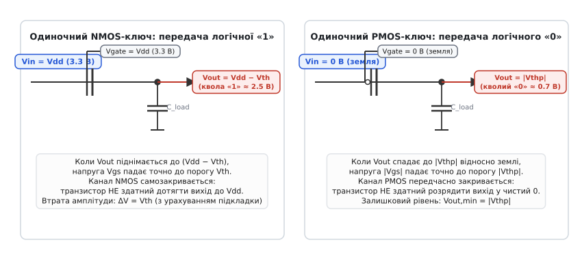
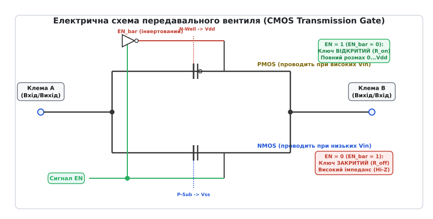
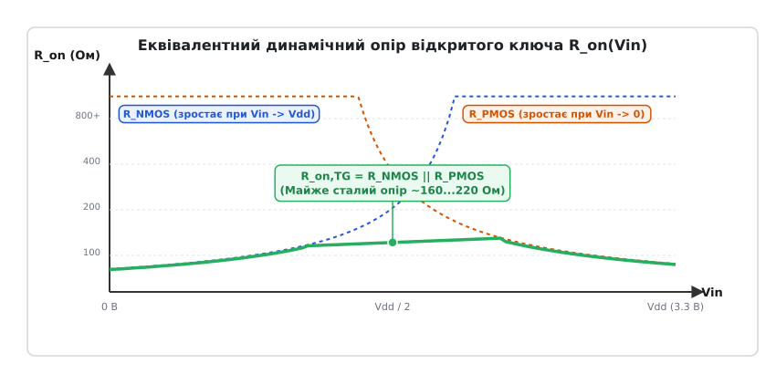
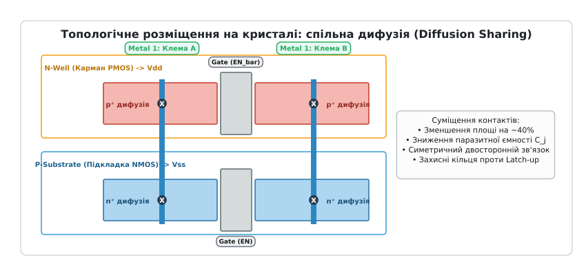
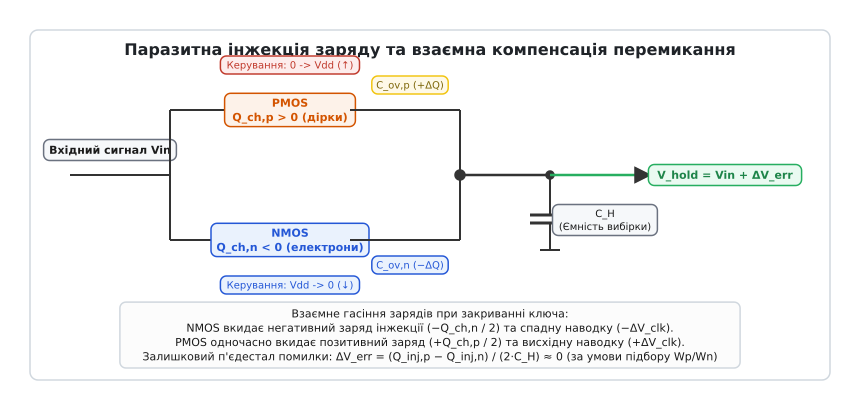
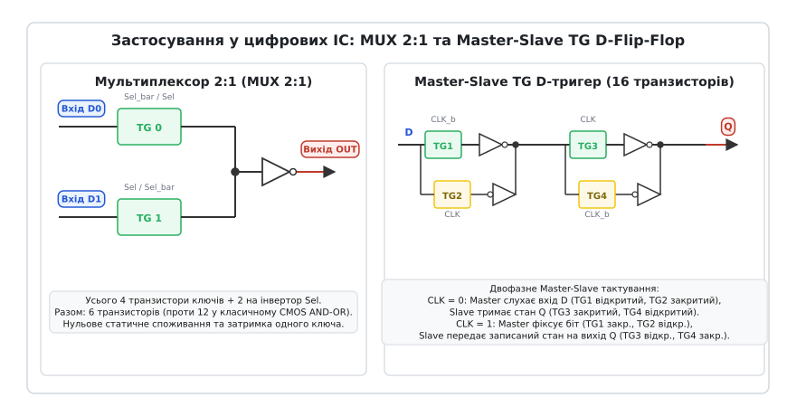

# Передавальний вентиль (CMOS transmission gate)

<preknowlist>
- [Будова MOSFET](root:hw-components/mosfet-structure) — планарний розріз, затвор над діелектриком, наведення каналу витік–стік.
- [Поріг MOSFET](root:hw-components/mosfet-threshold) — умови поверхневої інверсії кремнію під затвором.
- [NMOS і PMOS](root:hw-components/nmos-pmos) — типи провідності, електрони та дірки, полярність керування.
- [CMOS](root:hw-digital/cmos) — комплементарна логіка на парі транзисторів протилежного типу.
- [Ефект підкладки (body effect)](root:hw-components/body-effect) — зсув порогової напруги через різницю потенціалів між витоком і підкладкою.
- [Ємність затвора та динамічні втрати](root:hw-components/gate-capacitance) — паразитні ємності перекриття та перезаряд вузлів.
</preknowlist>

Спроба передати повний розмах аналогової чи цифрової напруги від `0 В` до шини живлення `V_DD = 3.3 В` крізь один-єдиний польовий транзистор завершується спотворенням сигналу на виході. Якщо як прохідний ключ використати одиночний n-канальний MOSFET (NMOS), чия напруга на затворі підтягнута до `3.3 В`, вихідна напруга застрягне на рівні `2.5 В` (а з урахуванням ефекту підкладки впаде до `2.3 В`), втративши цілий вольт порогового спаду `V_th`.

Ця просіла напруга не просто спотворює сигнал: потрапляючи на вхід наступного стандартного логічного вентиля, вона не здатна повністю закрити його p-канальний транзистор. Через інвертор починає безперервно текти наскрізний струм короткого замикання силою в сотні мікроамперів, кристал розігрівається, а статичний запас завадостійкості схеми знижується до нуля. Спроба замінити NMOS на p-канальний транзистор (PMOS) призводить до симетричного лиха на протилежному кінці шкали: PMOS не здатен розрядити вихідний вузол нижче свого порогу `|V_thp| ≈ 0.7 В`, утворюючи кволий, спотворений логічний нуль.

Вихід із цієї фізичної пастки полягає у створенні паралельної комплементарної пари. Поєднавши NMOS та PMOS пліч-о-пліч і подавши на їхні затвори протифазні сигнали керування, інженери отримують **передавальний вентиль** (англ. *transmission gate*, скорочено *TG*; також *pass gate* або двобічний аналоговий ключ). Цей базовий мікроелектронний вузол усуває порогову деградацію, забезпечує двосторонню провідність у повному діапазоні напруг і слугує фундаментальним будівельним блоком сучасних мультиплексорів, динамічних тригерів, схем вибірки-зберігання аналого-цифрових перетворювачів та матричних комутаторів.

---

### Фізика порогової деградації в одиночних прохідних транзисторах

Щоб зрозуміти необхідність паралельної структури, простежимо процеси перенесення заряду в одиночному транзисторі, який працює у ролі прохідного перемикача між джерелом сигналу та вихідною ємністю навантаження `C_load`.

Польовий транзистор відкривається тоді, коли напруга між його затвором та інверсійним каналом перевищує порогову напругу `V_th`. У класичному цифровому інверторі витік NMOS-транзистора жорстко заземлений (`V_S = 0 В`), тому напруга затвор–витік `V_GS` строго дорівнює вхідній напрузі затвора. У прохідному ж ключі транзистор увімкнений послідовно в розрив сигнальної лінії: його витік не прив'язаний до фіксованої шини, а плаває разом із потенціалом вихідного вузла `V_out`.

```
NMOS передає «1»:   V_gate = V_DD,   V_in = V_DD,   V_out росте від 0 до V_DD − V_thn
```

Коли на вхід NMOS подано напругу живлення `V_DD`, а на затворі встановлено дозвільний рівень `V_DD`, на початковому етапі конденсатор розряджений (`V_out = 0 В`). Різниця потенціалів затвор–витік максимальна:

```
V_GS,n = V_gate − V_out = V_DD − 0 = V_DD > V_thn
```

Канал сильно інвертований, його провідність висока, і струм стоку швидко заряджає ємність навантаження. Проте в міру зростання вихідної напруги `V_out` потенціал витоку піднімається слідом за нею. Різниця `V_GS,n = V_DD − V_out` неухильно зменшується.

Щойно вихідний потенціал досягає критичної позначки:

```
V_out,max = V_DD − V_thn
```

напруга затвор–витік падає точно до порогу відкривання `V_GS,n = V_thn`. Надпорогова напруга `V_GS,n − V_thn` стає рівною нулю. Інверсійний канал під затвором зникає, транзистор замикається власним вихідним потенціалом і струм припиняється. Подальший заряд вихідної ємності стає неможливим, якщо не враховувати мізерні підпорогові струми витоку, які вимагають секунд для зміни напруги на мілівольти.


*Фізичний механізм деградації сигналу в одиночних ключах на MOSFET. Ліворуч: NMOS закривається сам, щойно вихідний потенціал досягає рівня Vdd − Vthn. Праворуч: PMOS дзеркально обриває розряджання на рівні |Vthp|. Одиночний транзистор не здатен передати повний розмах напруги.*

У мікроелектроніці цю властивість формулюють як базове правило прохідної логіки: **NMOS-транзистор ідеально проводить сильний нуль (Strong 0), але передає кволу одиницю (Weak 1)**. Сильний нуль передається бездоганно, оскільки при передачі `0 В` витік сидить на землі, `V_GS,n = V_DD`, і транзистор залишається повністю відкритим аж до повного розряду виходу до нульового потенціалу.

Для PMOS-транзистора ситуація дзеркально протилежна. PMOS відкривається низьким потенціалом затвора відносно витоку (`V_SG,p = V_S − V_G > |V_thp|`). Коли PMOS передає високий рівень `V_in = V_DD` при заземленому затворі (`V_G = 0 В`), його витік має потенціал `V_DD`, `V_SG,p = V_DD − 0 = V_DD`, що утримує широкий канал відкритим аж до досягнення виходом точного рівня `V_DD`. PMOS передає **сильну одиницю (Strong 1)**.

Проте при спробі розрядити вихід через PMOS до землі (`V_in = 0 В`) витоком стає вихідний вузол `V_out`. Коли `V_out` опускається до величини `|V_thp|`, напруга витік–затвор падає до `V_SG,p = |V_thp| − 0 = |V_thp|`, і канал PMOS самовільно закривається. PMOS видає **кволий нуль (Weak 0)**, залишаючи на виході нерозряджений залишок `V_out,min = |V_thp|`.

---

### Комплементарна пара: подолання порогового обмеження

Щоб отримати перемикач, здатний без спотворень комутувати будь-яку напругу в межах від `0 В` до `V_DD`, обидва транзистори об'єднують у паралельну структуру.

Стік NMOS з'єднують зі стоком PMOS (формуючи клему `A`), а витік NMOS — з витоком PMOS (формуючи клему `B`). Оскільки польовий транзистор є фізично симетричним приладом, назви «стік» і «витік» тут умовні: струм вільно протікає в обох напрямках — як від `A` до `B`, так і від `B` до `A`.


*Будова CMOS передавального вентиля. Паралельне включення NMOS та PMOS під керуванням парафазних сигналів EN та EN_bar усуває порогову втрату та забезпечує симетричну двосторонню провідність між клемами A і B.*

Для одночасного відкривання та закривання пари транзисторів різного типу провідності потрібні взаємно інверсні (парафазні) сигнали керування. Затвор NMOS керується прямим сигналом дозволу `EN` (Enable), а затвор PMOS — інверсним сигналом `EN̄` (Enable Bar):

1. **Режим увімкненого ключа (`EN = V_DD`, `EN̄ = 0 В`):**  
   Обидва транзистори перебувають у відкритому стані. Якщо вхідний сигнал лежить поблизу нуля (`0 ≤ V_in < |V_thp|`), основний струм проводить повністю відкритий NMOS, забезпечуючи передачу чистого нуля без порогового зсуву. Якщо сигнал наближається до шини живлення (`V_DD − V_thn < V_in ≤ V_DD`), де NMOS починає закриватися, провідність перехоплює PMOS, дотягуючи рівень точно до `V_DD`. У середній ділянці шкали (`|V_thp| ≤ V_in ≤ V_DD − V_thn`) відкриті обидва транзистори одночасно.
   
2. **Режим вимкненого ключа (`EN = 0 В`, `EN̄ = V_DD`):**  
   На затвор NMOS подано `0 В`, тому для будь-якого сигналу `V_in ≥ 0` напруга `V_GS,n ≤ 0 < V_thn`. На затвор PMOS подано `V_DD`, тому `V_SG,p = V_in − V_DD ≤ 0 < |V_thp|`. Обидва транзистори надійно закриті. Опір між клемами `A` та `B` зростає до гігаомів, переводячи вихідний вузол у стан високого імпедансу (Hi-Z).

Завдяки паралельному увімкненню зникають «мертві зони» на краях робочого діапазону. Сигнал проходить крізь вентиль із повним розмахом від рейки до рейки (rail-to-rail).

---

### Динамічний опір відкритого ключа Ron(Vin)

Замкнений передавальний вентиль не є ідеальним короткозамкненим провідником: він має скінченний активний опір відкритого каналу `R_on`. Найважливішою характеристикою вентиля є залежність цього опору від миттєвого значення комутованої напруги `V_in`.

Опір одиночного відкритого MOSFET у лінійному (тріодному) режимі обернено пропорційний надпороговій напрузі на затворі:

```
R_on,NMOS(V_in) ≈ 1 / [ μ_n · C_ox · (W/L)_n · (V_DD − V_in − V_thn) ]
```

```
R_on,PMOS(V_in) ≈ 1 / [ μ_p · C_ox · (W/L)_p · (V_in − |V_thp|) ]
```

де `μ_n`, `μ_p` — рухливості електронів та дірок у каналі, `C_ox` — питома ємність підзатворного оксиду на одиницю площі, `W` та `L` — геометрична ширина й довжина каналу.

З цих виразів видно, що опір NMOS монотонно зростає від мінімального значення при `V_in = 0 В` до нескінченності при `V_in → V_DD − V_thn`. Навпаки, опір PMOS прямує до нескінченності при `V_in → |V_thp|` і спадає до мінімуму при `V_in = V_DD`.


*Динамічний опір відкритого передавального вентиля. Зростання опору NMOS при наближенні Vin до Vdd компенсується відкриванням PMOS, забезпечуючи стабільний сумарний опір пари у всьому діапазоні.*

Оскільки транзистори увімкнені паралельно, результуючий опір визначається сумою їхніх провідностей:

```
G_TG(V_in) = 1 / R_on,TG(V_in) = G_NMOS(V_in) + G_PMOS(V_in)
```

```
R_on,TG(V_in) = [ R_on,NMOS(V_in) · R_on,PMOS(V_in) ] / [ R_on,NMOS(V_in) + R_on,PMOS(V_in) ]
```

Там, де опір одного транзистора різко злітає вгору, провідність другого досягає максимуму. Два круті гіперболічні горби взаємно компенсуються: сумарний опір `R_on,TG` залишається практично сталим у всьому діапазоні вхідних напруг від `0 В` до `V_DD`, зазнаючи лише помірного підйому (на 30–50%) у середній точці `V_in ≈ V_DD / 2`, де обидва прилади перебувають у проміжному стані провідності.

Для детального аналітичного виведення цих рівнянь, умов лінеаризації та строгого розрахунку геометрії каналів зверніться до математичної вставки [детальне математичне виведення опору R_on та розрахунок ефекту підкладки](root:hw-digital/transmission-gate/math-ron-derivation.md).

#### Геометричне балансування ширини каналів
Рухливість електронів у кремнії `μ_n` приблизно у 2.5–3 рази перевищує рухливість дірок `μ_p`. Якщо зробити транзистори однакової геометричної ширини `W_n = W_p`, провідність NMOS-плеча буде значно вищою за PMOS-плече. Це призведе до суттєвої асиметрії опору: біля нуля опір вентиля буде низьким (наприклад, 80 Ом), а біля напруги живлення зросте втричі (до 240 Ом).

Щоб збалансувати опір та вирівняти час перемикання при наростанні й спаді сигналу, ширину каналу PMOS у топології стандартної комірки збільшують:

```
W_p ≈ ( μ_n / μ_p ) · W_n ≈ (2.5 ... 3.0) · W_n
```

Таке пропорціювання вирівнює питомі провідності `k_n ≈ k_p`, роблячи криву `R_on,TG(V_in)` симетричною відносно центральної точки `V_DD / 2`.

---

### Ефект підкладки (Body Effect) і проблема низьковольтного живлення

У практичній топології інтегральних мікросхем підкладки транзисторів не можуть бути електрично з'єднані з рухомими клемами `A` чи `B`. Усі NMOS-транзистори формуються у спільній кремнієвій p-підкладці (або в ізольованих p-карманах), яка під'єднана до найнижчого потенціалу мікросхеми `V_SS = 0 В`. PMOS-транзистори виготовляються в n-карманах (N-well), під'єднаних до найвищого потенціалу живлення `V_DD`.

Коли комутована напруга `V_in` зростає вище нуля, між витоком NMOS та його підкладкою виникає зворотна напруга зміщення `V_SB,n = V_in > 0`. Ця напруга розширює збіднену область під затвором, оголюючи додатковий просторовий заряд іонізованих акцепторів. Щоб скомпенсувати цей заряд і створити інверсійний канал, затвору потрібна більша напруга: порогова напруга NMOS нелінійно зміщується вгору:

```
V_thn(V_in) = V_thn0 + γ_n · [ √(2·ϕ_F + V_in) − √(2·ϕ_F) ]
```

де `γ_n` — коефіцієнт впливу підкладки (типово `0.3–0.5 В^(1/2)`), а `2·ϕ_F` — поверхневий потенціал подвійної інверсії Фермі (`≈ 0.6–0.7 В`).


*Топологічна структура передавального вентиля на кремнієвому кристалі. Спільні дифузійні ділянки стоку/витоку зменшують площу комірки та знижують паразитну ємність p-n переходів.*

Для PMOS-транзистора виникає дзеркальний зсув: оскільки карман сидить на `V_DD`, а витік має потенціал `V_in`, напруга зміщення підкладка–витік становить `V_BS,p = V_DD − V_in`. При зменшенні `V_in` нижче `V_DD` абсолютне значення порогу `|V_thp(V_in)|` також зростає.

#### Криза провідності при масштабуванні напруги живлення
Ефект підкладки має вирішальний вплив на опір ключа в середині діапазону (`V_in ≈ V_DD / 2`):

- При живленні `V_DD = 5 В` або `3.3 В` початкові пороги `V_th0 ≈ 0.6 В` під дією підкладки зростають у центрі до `0.85–0.95 В`. Оскільки `V_DD / 2` (1.65 В) значно більше за цей поріг, обидва транзистори залишаються відкритими, і опір лише помірно зростає.
- Проте при перетині технологічної межі `V_DD ≤ 1.2 В` або `1.0 В` у глибоких субмікронних процесах виникає критична ситуація:

```
V_DD ≤ V_thn(V_DD/2) + |V_thp(V_DD/2)|
```

У центрі діапазону надпорогові напруги `V_GS − V_th` обох транзисторів одночасно стають від'ємними. Обидва прилади вимикаються в зоні біля `V_DD / 2`, утворюючи розрив провідності («мертву зону»), де опір `R_on` злітає до нескінченності.

Для подолання цієї кризи в сучасних аналогових та змішаних ІС застосовують спеціальні схемотехнічні заходи:
1. **Бутстрепінг затвора (Bootstrapped Switch):** за допомогою літаючого конденсатора напруга на затворі ключа під час увімкнення піднімається вище шини живлення на величину сигналу (`V_gate = V_in + V_DD`), підтримуючи напругу `V_GS` строго постійною незалежно від сигналу.
2. **Ізольовані кишені (Triple-Well Process):** NMOS розміщують в індивідуальному ізольованому p-кармані (Deep N-Well), який локально закорочують з його власним витоком (`V_SB = 0`), повністю нейтралізуючи ефект підкладки.

---

### Динамічні паразити: інжекція заряду та clock feedthrough

При використанні передавального вентиля в прецизійних вузлах — таких як схеми вибірки-зберігання (Sample-and-Hold, S/H) аналого-цифрових перетворювачів — на перший план виходять динамічні похибки комутації, що виникають у момент переходу ключа зі стану «увімкнено» в стан «вимкнено».

Ці похибки формуються двома фізичними явищами: інжекцією заряду інверсійного каналу та ємнісною наводкою тактового сигналу.


*Динамічні паразити та механізм їхнього гасіння в CMOS передавальному вентилі. Інжекція дірок з PMOS та електронів з NMOS взаємно компенсуються на ємності вибірки CH, знижуючи залишковий п'єдестал похибки.*

#### 1. Інжекція заряду каналу (Channel Charge Injection)
Коли польовий транзистор перебуває у відкритому стані, під діелектриком затвора накопичений заряд рухливих носіїв:

```
Q_ch,n = − W_n · L_n · C_ox · (V_DD − V_in − V_thn)   [електрони в NMOS]
```

```
Q_ch,p = + W_p · L_p · C_ox · (V_in − |V_thp|)         [дірки в PMOS]
```

У мить вимикання сигнали керування швидко закривають канали. Напруга на затворах змінюється за частки наносекунди, інверсійний шар колапсує, і накопичені носії виштовхуються через стокові та витокові дифузійні ділянки. Частина цього заряду (типово близько 50% при швидкому перемиканні) стікає на вихідний конденсатор вибірки `C_H`.

Введений заряд викликає миттєвий стрибок напруги на ємності — так званий **п'єдестал похибки вибірки** (pedestal error):

```
ΔV_inj = ΔQ_inj / C_H
```

#### 2. Ємнісна наводка перемикання (Clock Feedthrough)
Затворні електроди транзисторів перекривають краю дифузійних областей стоку та витоку, формуючи паразитні ємності перекриття `C_ov = W · L_ov · C_ox`. Разом із конденсатором вибірки `C_H` ці ємності утворюють ємнісний дільник напруги.

Стрибок напруги керування на затворі NMOS `ΔV_gate,n = 0 − V_DD = −V_DD` наводить на виході від'ємний імпульс:

```
ΔV_clk,n = − V_DD · [ C_ov,n / (C_H + C_ov,n) ]
```

Стрибок напруги на затворі PMOS `ΔV_gate,p = V_DD − 0 = +V_DD` наводить додатний імпульс:

```
ΔV_clk,p = + V_DD · [ C_ov,p / (C_H + C_ov,p) ]
```

#### Механізм взаємної компенсації в CMOS-парі
Тут проявляється фундаментальна перевага передавального вентиля над однотранзисторним ключем. Оскільки NMOS вимикається перепадом напруги від `V_DD` до `0 В`, він інжектує у вихідний вузол електрони (від'ємний заряд) і створює спадну ємнісну наводку. PMOS одночасно вимикається перепадом від `0 В` до `V_DD`, інжектуючи дірки (додатний заряд) і створюючи висхідну ємнісну наводку.

Заряди протилежного знаку та зустрічні ємнісні стрибки **рекомбінують і взаємно гасять один одного** на спільному вихідному вузлі:

```
ΔV_total ≈ [ (Q_ch,p − Q_ch,n) / (2 · C_H) ] + [ V_DD · (C_ov,p − C_ov,n) / C_H ]
```

Повне ідеальне гасіння досягається лише в одній точці шкали, оскільки заряди каналів нелінійно залежать від вхідної напруги `V_in`. Проте сумарна похибка вибірки передавального вентиля знижується в 10–50 разів порівняно з одиночним NMOS-ключем.

Для ще глибшого придушення залишкового п'єдесталу в прецизійних схемах поряд із ключем встановлюють компенсаційні транзистори-пустушки (Dummy Switches) з половинною шириною `W / 2` та закороченими стоком і витоком, керовані протифазним тактовим сигналом.

---

### Топологічна оптимізація: суміщення дифузійних ділянок

При проєктуванні кремнієвої топології передавального вентиля у складі бібліотеки стандартних комірок (standard cell) критичним завданням є мінімізація займаної площі та зменшення паразитної ємності p-n переходів стоку й витоку `C_j`.

Якщо виготовити NMOS та PMOS як два повністю ізольованих транзистори і з'єднати їх окремими металевими доріжками першого рівня (Metal 1), кожен вивід матиме власну контактну область дифузії. Це призведе до подвоєння площі активних зон і, як наслідок, подвоєння паразитної ємності переходу на підкладку `C_db` (Drain-to-Body).

У професійній топології застосовують метод **суміщення дифузії (Diffusion Sharing)**:
1. P-канальний транзистор формується в суцільній смужці p⁺-дифузії всередині N-well, а N-канальний — у паралельній смужці n⁺-дифузії в P-підкладці.
2. Полікремнієві затвори обох транзисторів розташовуються паралельно на мінімальній технологічній відстані.
3. Ліва спільна дифузійна ділянка NMOS та PMOS перекривається єдиною вертикальною металевою смугою клеми `A`. Права ділянка перекривається смугою клеми `B`.

Таке компонування дає три відчутні інженерні переваги:
- **Зменшення площі комірки на 35–45%:** усуваються проміжні розриви між дифузійними зонами та ізоляційними канавками STI (Shallow Trench Isolation).
- **Зниження паразитної ємності на 50%:** спільний металевий контакт об'єднує дві активні області з мінімальним периметром p-n переходів, що безпосередньо прискорює перезаряд вузла й знижує динамічну затримку перемикання `t_pd = R_on · C_parasitic`.
- **Багатопальцева геометрія (Multi-Finger Layout):** для ширококанальних аналогових ключів затвор розбивають на кілька паралельних пальців однакової довжини, що зменшує розподілений опір полікремнію `R_gate` та знижує паразитну ємність стоку, яка шунтує сигнал.
- **Підвищення стійкості до Latch-Up (тиристорного замикання):** щільне охоплення N-well і підкладки охоронними кільцями (Guard Rings) з частим розташуванням контактів до шин `V_DD` і `V_SS` знижує коефіцієнт підсилення паразитної чотиришарової p-n-p-n структури до безпечного рівня.

---

### Схемотехнічні застосування у цифрових та аналогових ІС

Передавальний вентиль є незамінним вузлом у багатьох класах інтегральних схем завдяки здатності спрямовувати сигнали без створення додаткових логічних каскадів.


*Схемотехнічні застосування передавальних вентилів. Ліворуч: компактний мультиплексор 2:1 на двох парах ключів. Праворуч: Master-Slave D-тригер на 16 транзисторах із парафазним тактуванням.*

#### 1. Мультиплексор 2:1 (MUX 2:1)
Класична реалізація двовходового мультиплексора на логічних вентилях CMOS (AND-OR-INVERT + інвертор) потребує 12 транзисторів і створює затримку щонайменше двох логічних вентилів.

Мультиплексор на передавальних вентилях реалізується всього на 6 транзисторах:
- Вхід `D0` проходить крізь перший ключ `TG0`, керований сигналом `Sel̄ / Sel`.
- Вхід `D1` проходить крізь другий ключ `TG1`, керований сигналом `Sel / Sel̄`.
- Виходи обох вентилів об'єднані на спільний вузол, до якого під'єднано один відновлювальний інвертор.

Схема не виконує проміжних логічних обчислень: вона фізично спрямовує обраний інформаційний дріт до вихідного буфера. Це забезпечує вдвічі меншу площу на кристалі та мінімальну затримку розповсюдження сигналу.

#### 2. Статичні та динамічні Master-Slave D-тригери (TG D-FF)
Традиційний D-тригер на логічних вентилях NAND містить від 28 до 36 транзисторів і страждає від ризику перегонів сигналів (race conditions) при пологих фронтах тактового сигналу.

Використання передавальних вентилів дозволяє побудувати повноцінний Master-Slave D-тригер, що спрацьовує за фронтом тактового імпульсу, всього на **16 транзисторах**:
- **Провідний каскад (Master Latch):** складається з вхідного передавального вентиля `TG1`, прямого інвертора `Inv1` та петлі зворотного зв'язку з інвертора `Inv2` і вентиля `TG2`. При `CLK = 0` вентиль `TG1` відкритий, а `TG2` закритий — ведучий каскад прозоро зчитує вхідний біт `D`.
- **Ведений каскад (Slave Latch):** дзеркальна комірка на базі `TG3`, `Inv3` та зворотного зв'язку `Inv4 + TG4`. При `CLK = 0` вентиль `TG3` закритий, а `TG4` замкнений — ведений каскад надійно зберігає попередній стан виходу `Q`.
- У момент переходу `CLK` з `0` в `1` вентиль `TG1` миттєво відсікає вхід `D`, петля `TG2` замикає збережений рівень усередині Master-каскаду, а вентиль `TG3` відкривається, передаючи зафіксований біт на вихід `Q`.

Така архітектура забезпечує мінімальний час вибірки (setup time `t_su`), нульовий час утримання (hold time `t_hold ≈ 0`) і високу граничну тактову частоту роботи (понад 2–4 ГГц у сучасних техпроцесах).

#### 3. Комутатори схем вибірки-зберігання (Sample-and-Hold)
В аналого-цифрових перетворювачах порозрядного врівноваження (SAR ADC) та конвеєрних АЦП (Pipelined ADC) передавальний вентиль комутує вхідну аналогову напругу на масив вибіркових конденсаторів `C_H`.

Ключова вимога тут — малий та лінійний опір `R_on` у всьому діапазоні перетворення, що гарантує низький коефіцієнт гармонійних спотворень (THD), та швидке встановлення напруги за час вибірки `t_acq = 7...10 · R_on · C_H` (для точності 12–16 біт). Крім того, у схемах вибірки на нижню обкладку (Bottom-Plate Sampling) пара передавальних вентилів синхронно відсікає обкладки конденсатора, повністю усуваючи залежність інжекції заряду від миттєвої вхідної напруги сигналу.

#### 4. Матричні аналогові крос-комутатори (Crosspoint Switch)
У матриці `N × M` ключів передавальні вентилі розташовуються на кожному перетині горизонтальних та вертикальних шин. Оскільки вентиль проводить струм в обидва боки без падіння напруги, він дозволяє з'єднувати будь-яке джерело аналогового сигналу (наприклад, звуковий канал чи лінію вимірювального давача) з будь-яким приймачем без зміщення нульової точки.

---

### Обмеження передавального вентиля: коли потрібна буферизація

Попри універсальність, передавальний вентиль має чотири фундаментальні схемотехнічні обмеження, які інженер зобов'язаний враховувати:

1. **Відсутність логічного відновлення та підсилення сигналу:**  
   Звичайний логічний інвертор формує на виході свіжі рівні напруги безпосередньо від шин живлення, маючи високий коефіцієнт підсилення по струму й напрузі. Передавальний вентиль є суто пасивним ключем. Сигнал, що проходить крізь нього, зазнає омічних втрат на `R_on` і сповільнюється паразитною ємністю.
   
   Якщо з'єднати послідовно ланцюг із `N` передавальних вентилів, затримка поширення сигналу зростатиме не лінійно, а **квадратично**:

   ```
   t_pd ≈ 0.38 · R_on · C_node · N²
   ```

   Тому в цифрових бібліотеках діє суворе правило: **не з'єднувати більше 3–4 передавальних вентилів поспіль без проміжного буферного інвертора-відновлювача**.

2. **Вразливість вузлів у стані Hi-Z до витоків:**  
   Коли вентиль розімкнено, вихідний вузол відсікається від джерел низького імпедансу. Збережений заряд утримується виключно на паразитній ємності. Під дією струмів витоку зворотно зміщених p-n переходів (`I_leak ≈ 1–100 пА`) збережена напруга дрейфує, що обмежує мінімальну робочу тактову частоту динамічних схем. Для запобігання втраті даних вузли доповнюють слабкими статичними підтяжками зворотного зв'язку (Weak Keepers).

3. **Скінченна ізоляція на високих частотах:**  
   У вимкненому стані ключ не розриває коло ідеально: паразитні ємності перекриття `C_ov` та міжелектродні ємності створюють шлях витоку високочастотного змінного сигналу (Feedthrough Leakage). На частотах вище 100 МГц опір ємнісного витоку `X_C = 1 / (2·π·f·C_off)` падає до кількох кілоомів, що знижує коефіцієнт послаблення закритого ключа (Off-Isolation).

4. **Деградація надійності (HCI та NBTI) та захист від ESD:**  
   Оскільки передавальний вентиль часто розташовується безпосередньо біля контактних площадок вводу-виводу (I/O Pads), його затвори та ультратонкі дифузійні шари піддаються загрозі електростатичного пробою (ESD). Для захисту двонапрямленого каналу паралельно з ключем встановлюють низькоємнісні діодні збірки або вторинні захисні транзистори (ggNMOS). У процесі тривалої експлуатації гарячі носії заряду (Hot Carrier Injection) та негативна температурна нестабільність затвора (NBTI у PMOS) зміщують порогові напруги транзисторів у часі, викликаючи поступове зростання `R_on` та асиметрію затримок, що враховується під час розрахунку часових запасів (timing margins) на етапі статичного часового аналізу (STA).

---

### Порівняння: CMOS передавальний вентиль проти логіки на прохідних транзисторах (PTL/CPL)

У цифровій схемотехніці передавальний вентиль часто порівнюють з альтернативними архітектурами комутації даних:

| Архітектурний підхід | Кількість транзисторів на біт | Рівень вихідного сигналу | Потреба в інверсному керуванні | Основна сфера застосування |
| :--- | :--- | :--- | :--- | :--- |
| **Одиночний NMOS-ключ (PTL)** | 1 транзистор | Деградована «1» (`V_DD − V_th`) | Ні (лише прямий сигнал) | DRAM комірки, матриці ПЛІС |
| **Диференціальна прохідна логіка (CPL)** | 4 транзистори + відновлювач | Повний розмах через інвертори | Так (пряма та інверсна фази) | Швидкодіючі суматори, АЛП |
| **CMOS передавальний вентиль (TG)** | 2 транзистори + інвертор | Повний розмах (`0...V_DD`) | Так (`EN` та `EN̄`) | Мультиплексори, D-тригери, АЦП |

Одиночний NMOS виграє за площею вдвічі, проте вимагає обов'язкових відновлювальних підтяжок (Level Restorers). Комплементарний передавальний вентиль займає збалансовану інженерну нішу, поєднуючи повний розмах напруги, симетричний двонапрямлений струм та нульове статичне енергоспоживання в стані спокою.

---

### Програмна модель передавального вентиля

Для перевірки логіки роботи та аналізу порогової поведінки передавального вентиля наведемо поведінкову модель двонапрямленого ключа. Модель відтворює три стани виходу (0, 1, Hi-Z) та ілюструє різницю між одиночним NMOS-ключем і повноцінним CMOS передавальним вентилем.

:::tabs
```c
#include <stdio.h>
#include <stdbool.h>

/* Стан логічного вузла: активні рівні або високий імпеданс Hi-Z */
typedef enum {
    LOGIC_0,
    LOGIC_1,
    LOGIC_WEAK_1, /* Деградована одиниця одиночного NMOS (Vdd - Vth) */
    LOGIC_WEAK_0, /* Деградований нуль одиночного PMOS (|Vthp|) */
    LOGIC_HIZ
} LogicState;

/* Модель одиночного NMOS-ключа */
LogicState nmos_pass_switch(LogicState in, bool gate_enable) {
    if (!gate_enable) return LOGIC_HIZ;
    if (in == LOGIC_0) return LOGIC_0;           /* NMOS чудово проводить сильний 0 */
    if (in == LOGIC_1) return LOGIC_WEAK_1;      /* NMOS втрачає поріг на одиниці */
    return in;
}

/* Модель CMOS передавального вентиля (TG) */
LogicState cmos_transmission_gate(LogicState in, bool en) {
    /* en=true означає EN=1 і EN_bar=0 (обидва транзистори відкриті) */
    if (!en) return LOGIC_HIZ;
    
    /* Паралельна пара передає сильний 0 через NMOS і сильну 1 через PMOS */
    return in;
}

int main(void) {
    printf("--- Тестування одиночного NMOS проти CMOS TG ---\n");
    
    printf("NMOS(Вхід 0, EN=1) -> %s\n", nmos_pass_switch(LOGIC_0, true) == LOGIC_0 ? "Сильний 0" : "Помилка");
    printf("NMOS(Вхід 1, EN=1) -> %s\n", nmos_pass_switch(LOGIC_1, true) == LOGIC_WEAK_1 ? "Квола 1 (Vdd - Vth)" : "Помилка");
    
    printf("CMOS_TG(Вхід 0, EN=1) -> %s\n", cmos_transmission_gate(LOGIC_0, true) == LOGIC_0 ? "Сильний 0 (0 В)" : "Помилка");
    printf("CMOS_TG(Вхід 1, EN=1) -> %s\n", cmos_transmission_gate(LOGIC_1, true) == LOGIC_1 ? "Сильна 1 (Vdd)" : "Помилка");
    printf("CMOS_TG(Вхід 1, EN=0) -> %s\n", cmos_transmission_gate(LOGIC_1, false) == LOGIC_HIZ ? "Hi-Z (Ізольовано)" : "Помилка");
    
    return 0;
}
```
```cpp
#include <iostream>
#include <optional>
#include <string_view>

/* Типізоване представлення електричного потенціалу вузла */
enum class NodeLevel {
    StrongZero,   // Чистий 0 В (земля)
    StrongOne,    // Чиста напруга Vdd
    DegradedOne,  // Знижена одиниця Vdd - Vth
    DegradedZero  // Підвищений нуль |Vthp|
};

/* Ідіоматичний клас передавального вентиля */
class TransmissionGate {
public:
    constexpr TransmissionGate() = default;

    // Симуляція передачі сигналу крізь ключ
    [[nodiscard]] constexpr std::optional<NodeLevel> transfer(
        NodeLevel input, 
        bool enable
    ) const noexcept {
        if (!enable) {
            return std::nullopt; // Стан високого імпедансу (Hi-Z)
        }
        // Завдяки парі NMOS+PMOS сигнал проходить без порогової втрати
        return input;
    }

    // Для порівняння: модель одиночного NMOS-ключа
    [[nodiscard]] static constexpr std::optional<NodeLevel> singleNmosTransfer(
        NodeLevel input, 
        bool enable
    ) noexcept {
        if (!enable) {
            return std::nullopt;
        }
        if (input == NodeLevel::StrongOne) {
            return NodeLevel::DegradedOne; // Порогова втрата Vthn
        }
        return input;
    }
};

constexpr std::string_view levelToString(std::optional<NodeLevel> lvl) noexcept {
    if (!lvl.has_value()) return "Hi-Z (Високоімпедансний стан)";
    switch (*lvl) {
        case NodeLevel::StrongZero:   return "Сильний 0 (0.0 В)";
        case NodeLevel::StrongOne:    return "Сильна 1 (Vdd = 3.3 В)";
        case NodeLevel::DegradedOne:  return "Квола 1 (Vdd - Vth ≈ 2.5 В)";
        case NodeLevel::DegradedZero: return "Кволий 0 (|Vthp| ≈ 0.7 В)";
    }
    return "Невідомо";
}

int main() {
    constexpr TransmissionGate tg;

    std::cout << "--- Симуляція проходження рівнів крізь CMOS TG ---\n";
    std::cout << "Вхід StrongZero, EN=true -> " 
              << levelToString(tg.transfer(NodeLevel::StrongZero, true)) << '\n';
    std::cout << "Вхід StrongOne,  EN=true -> " 
              << levelToString(tg.transfer(NodeLevel::StrongOne, true)) << '\n';
    std::cout << "Вхід StrongOne,  EN=false -> " 
              << levelToString(tg.transfer(NodeLevel::StrongOne, false)) << '\n';

    std::cout << "\n--- Для порівняння: одиночний NMOS ключ ---\n";
    std::cout << "Вхід StrongOne,  EN=true -> " 
              << levelToString(TransmissionGate::singleNmosTransfer(NodeLevel::StrongOne, true)) << '\n';

    return 0;
}
```
:::

---

### Підсумковий синтез

Передавальний вентиль уособлює фундаментальний принцип комплементарної схемотехніки: об'єднання двох фізично неідеальних приладів із протилежними вадами створює єдину систему, вільну від недоліків кожного з них.

NMOS-транзистор забезпечує бездоганну провідність нижньої половини діапазону напруг, PMOS-транзистор бере на себе верхню половину, а їхнє паралельне з'єднання формує симетричний двобічний ключ із майже постійним динамічним опором у всьому діапазоні від рейки до рейки. Одночасно зустрічні імпульси парафазного керування компенсують паразитну інжекцію заряду та ємнісні наводки перемикання. Ця елегантна простота робить передавальний вентиль незамінним компонентом інтегральних схем — від надшвидких процесорних регістрів і матриць перемикання до прецизійних трактів аналогового перетворення.
