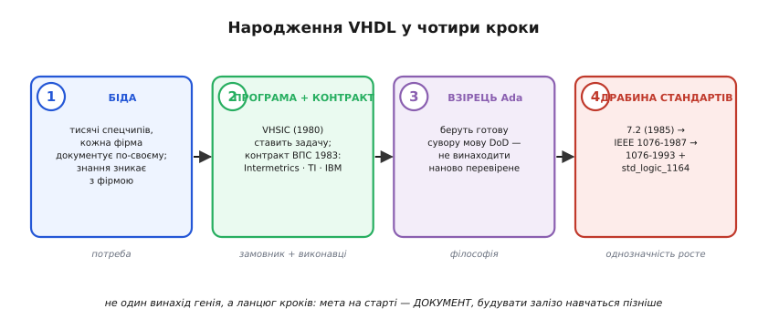
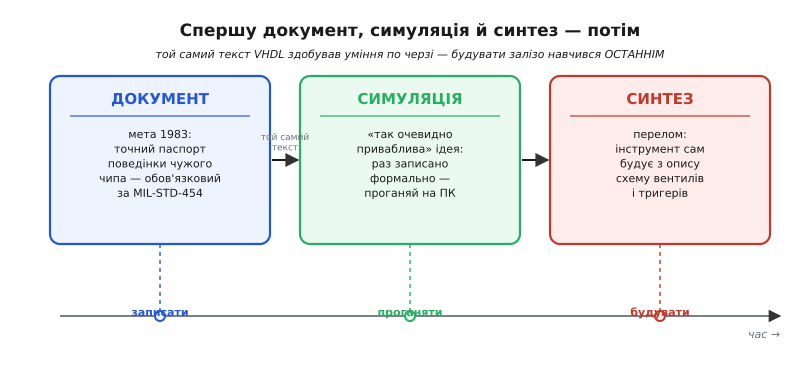

# 📜 VHDL народилася як паспорт чужого чипа, а не як мова для схем

Найдивніше у VHDL — те, чого вона **не** мала робити на початку. Її не задумували, щоб проєктувати схеми. Її не задумували навіть, щоб їх симулювати. Її задумали, щоб **описати вже готовий чужий чип** — точно, однозначно й так, щоб цей опис пережив і свого автора, і фірму, яка чип зробила. Усе інше — симуляція, а потім і синтез — приросло згодом до того самого тексту, наче ніхто не планував наперед. Тож щоб зрозуміти, чому VHDL така, яка є, — сувора, багатослівна, педантично типізована, — треба почати не з мови, а з дуже приземленої канцелярської біди американського війська 1980-х.

Це історія в кілька окремих кроків, які легко злити в один, а даремно. Спершу — **потреба**: зберегти знання про поведінку чипа, коли фірма-виробник зникне. Потім — **державна програма** VHSIC, у якій ця потреба спливла. Далі — **контракт** 1983 року й три фірми, що зробили мову. Потім — вибір **Ada** за взірець, який пояснює її характер. І нарешті — довга **драбина стандартизації**: спершу військова версія 7.2, тоді перший стандарт IEEE, за ним другий, а разом з ним — окремий стандарт на дев'ятизначну логіку. Пройдімо їх по черзі й на кожному спитаймо не «що сталося», а «**чому** саме так».

*Уся історія в чотирьох кроках, кожен зробили різні люди з різною метою. Спершу біда: військо замовляє тисячі спецчипів, кожна фірма описує свій по-своєму, і знання зникає разом із фірмою. Тоді програма VHSIC (1980) ставить задачу єдиної мови; контракт ВПС 1983 року доручає її трьом фірмам. За взірець беруть Ada — теж мову міноборони, теж навмисне сувору. І аж наприкінці мова піднімається драбиною стандартів: військова версія 7.2 (1985) → IEEE 1076-1987 → 1076-1993 разом зі std_logic_1164. Мета на старті — документ; будувати з нього залізо навчаться пізніше.*

## Біда, з якої все почалося: знання, що зникає разом із фірмою

Уявімо становище міністерства оборони США на початку 1980-х. Складна військова техніка — радар, ракета, літак — усередині напхана мікросхемами, і дедалі більше серед них **спеціальних**, зроблених на замовлення під одну конкретну задачу (їх звуть замовними інтегральними схемами, англ. *ASIC — application-specific integrated circuit*). Таких чипів військо замовляло тисячами, у десятків різних фірм. І кожна фірма документувала свій чип **по-своєму**: своїми словами, своїми схемами, своїми таблицями, своєю внутрішньою мовою креслень. Одну поведінку двоє інженерів із двох фірм записали б двома несхожими паперами.

Поки все нове, це стерпно. Проблема визріває з часом — і саме тому вона така підступна. Військова система живе **десятиліттями**: літак, поставлений на озброєння, лишається в строю тридцять і сорок років. А от чип усередині нього живе значно менше: за десять років він застаріє, виробництво його припиниться, а сама фірма-виробник цілком може **зникнути** — збанкрутувати, злитися з іншою, просто закритися. І ось у складній ракеті стоїть мікросхема, якої більше ніхто не робить, з паперовим описом, який писала контора, якої більше немає, мовою креслень, зрозумілою лише її колишнім інженерам.

Настає день, коли цю мікросхему треба замінити — вигоріла, скінчився запас, знайшли ваду. І тут військо впирається в стіну: щоб замовити рівноцінну заміну в іншої фірми, треба **точно** знати, що саме стара мікросхема робила — кожен її вхід, кожен вихід, кожну реакцію на кожен набір сигналів. А єдине джерело цього знання — двозначний папір, який кожен читає трохи інакше. Помилишся в тлумаченні бодай одного біта поведінки — і заміна поводитиметься не так, а це в бойовій системі не «баг», а провалена місія.

> 🔧 **Навіщо це.** Ось де корінь усього характеру VHDL, і його варто вкарбувати. Проблема, яку вона розв'язувала, — не «як спроєктувати схему», а «**як записати поведінку залізяки так точно й однаково, щоб через двадцять років чужа людина прочитала рівно те саме**». Це вимога не до інструмента проєктування, а до **документа-паспорта**: однозначного, повного, машиночитного, що переживе свого автора. Тримайте цю мету в голові — з неї, як з єдиного кореня, виросте кожна «зайва» строгість мови, на яку нарікатиме новачок.

Паперовий опис провалював цю вимогу з трьох боків одразу. Він **двозначний** — природна мова допускає різночитання. Він **неповний** — автор мимоволі опускає те, що йому здається очевидним. І він **мертвий для машини** — його не можна ні перевірити автоматично, ні «прокрутити», щоб побачити, чи справді чип поводиться, як написано. Потрібен був спосіб описувати поведінку чипа **формальною мовою**: точною, як програмний код, повною, як інженерна специфікація, і придатною для машини, щоб опис можна було не лише читати, а й проганяти. Саме таку мову військо й вирішило замовити.

## VHSIC: велика ставка на швидкий кремній, у якій спливла проблема опису

Замовило воно її не окремо, а всередині великої програми, ім'я якої VHDL і носить у собі. У **березні 1980 року** міністерство оборони США запустило програму **VHSIC** (англ. *Very High Speed Integrated Circuit* — «дуже швидка інтегральна схема») — спільну для всіх трьох родів війська (армії, флоту й ВПС). Це усталений факт. Мета програми була куди ширша за будь-яку мову: підштовхнути власну американську мікроелектроніку до нового покоління чипів — дуже швидких, дуже щільних і **стійких до радіації**, щоб вони працювали і в супутнику під космічними променями, і поряд з електромагнітним ударом ядерного вибуху. Ставилися цілком конкретні технічні цілі: довести розмір елемента на кристалі до 0.5 мікрометра, підняти швидкість вентилів на порядки проти цивільних чипів, збільшити надійність. Ішлося про технологічну перевагу в електронній війні, у наведенні ракет, у бортовій електроніці винищувачів.

VHDL у цій великій ставці — деталь, побічний плід. Але деталь неминуча, бо проблема опису била просто в серце програми. VHSIC мала породити **безліч** нових складних чипів у **різних** фірм-підрядників, і всі ці чипи треба було між собою стикувати, документувати й передавати від фірми до фірми та від фірми до війська. Без спільної, єдиної для всіх мови опису вся програма потонула б у тому самому різнобої паперів, з якого починалася наша історія, — тільки помножений на масштаб великої державної ставки. Тож усередині VHSIC постала окрема задача: створити **єдину мову опису апаратури**, якою кожен підрядник описував би поведінку свого чипа так, щоб опис був однозначний, повний і зрозумілий будь-кому іншому й через роки. Ця мова й дістане ім'я за програмою: **VHDL** — *VHSIC Hardware Description Language*, «мова опису апаратури програми VHSIC».

Зверніть увагу на порядок думки, бо він визначальний. Спочатку — велика ціль (швидкі військові чипи), і **лише як її обслуга** — мова опису. VHDL народилася не тому, що хтось мріяв про елегантну мову для схем, а тому, що великій державній програмі **знадобився спільний формат документа**. Мова-слуга, мова-паспорт — а не мова-творець. Це прямо вплине на те, як вона виглядає.

## Контракт 1983 року: три фірми, три ролі

Щоб мову справді зробити, потрібен був виконавець — і тут історія стає приємно конкретною, аж до номера паперу. У **1983 році** Військово-повітряні сили США уклали контракт під номером **F33615-83-C-1003** — цей номер і досі кочує історичними довідками, тож факт добре задокументований. Прикметно, що мову замовляли не одному генієві-одинакові, а **консорціуму** з трьох фірм, і кожна відповідала за свій бік справи. Уже сам склад виконавців багато каже про майбутній характер мови.

- **Intermetrics** була **головним підрядником** і відповідала за **саму мову** — її синтаксис, семантику, за те, як вона влаштована зсередини. Це фірма мовників-програмістів, і саме вона тримала перо.
- **Texas Instruments** давала **чипову експертизу** — знання того, як насправді проєктують і поводяться інтегральні схеми, щоб мова описувала реальне залізо, а не абстракцію.
- **IBM** додавала **системну експертизу** — досвід побудови великих обчислювальних систем, щоб мовою можна було описувати не лише окремий чип, а й те, як він живе у складі більшого.

Із цієї трійці випливає багато. Мову робили **не ентузіасти для себе, а корпорації під наглядом держави**, за формальним контрактом, з вимогами й термінами. Звідси її ґрунтовність, її офіційна важкість, її несхожість на легкий інструмент, який хтось написав би за вихідні для власної зручності. Це добре видно на контрасті: інша велика [мова опису апаратури](topic:hw-digital/hdl), Verilog, народилася майже водночас у маленькому каліфорнійському стартапі як гнучкий робочий інструмент — і вийшла лаконічною та вільною. Дві мови роблять по суті те саме, але звучать як два різні автори: VHDL — сухий юридичний протокол консорціуму, Verilog — швидка робоча записка інженера. Обидві історії докладно зведено окремо, у [спільному нарисі про народження HDL](topic:hw-digital/hdl/hist-hdl.md); тут ми йдемо вглиб саме військового боку.

> 🔧 **Навіщо це.** Запам'ятайте загальне правило, яке VHDL ілюструє чисто: **характер інструмента часто задає не техніка, а те, хто і навіщо його замовив.** Коли вам трапиться код на VHDL, надміру церемонний проти стислого Verilog, це не примха авторів — це відбиток контракту F33615-83-C-1003: консорціум великих фірм робив мову-**документ** для системи, що житиме десятиліття. Строгість тут не вада, а технічне завдання. Інструменти носять на собі слід своєї колиски, і VHDL носить його в кожному оголошенні типу.

## Чому взяли Ada: не винаходити наново вже перевірене

Тепер — одна деталь замовлення, яка пояснює обличчя VHDL краще за все інше. Синтаксис нової мови не вигадували з нуля. Міністерство оборони прямо **зажадало**: хай мова якомога більше повторює вже наявну мову **Ada** — щоб, за формулюванням задачі, «не винаходити наново поняття, які вже було ретельно продумано й перевірено». І цей вибір не випадковий, а майже родинний.

Ada — це теж **дітище того самого міністерства оборони**. На межі 1970–80-х Пентагон, потонувши в сотнях різних мов програмування у своїх системах, замовив собі **одну** спільну мову — сувору, надійну, з жорсткою перевіркою типів, спеціально спроєктовану так, щоб у критичних військових системах помилку ловив **компілятор**, а не бойовий виліт. Назвали її на честь [Ади Лавлейс](topic:hw-arch/what-is-processor/hist-babbage-lovelace.md) — жінки, яку вважають першою, хто написав алгоритм для машини. Тобто на столі в замовника вже лежала мова, зроблена рівно з тією філософією, яка потрібна була й для опису чипів: **краще більше строгості зараз, ніж дорога помилка потім**.

Далі логіка проста, як добра інженерія. Навіщо винаходити нову сувору мову, коли є готова, вже перевірена в тому самому відомстві, з тими самими цінностями? Узяли Ada за взірець синтаксису — і VHDL успадкувала весь її почерк: багатослівні оголошення, обов'язкові й точні типи, педантичну структуру, де кожну річ треба назвати явно. Тому, відкривши код на VHDL сьогодні, ви впізнаєте в ньому дисципліну Ada, а отже — двічі відбитий слід міноборони: мова опису заліза, зроблена за взірцем мови програмування, яку те саме відомство перед тим замовило для себе. Строгість VHDL — це не її власна вигадка, а **спадок традиції**, з якої їй веліли вирости.

Тут корисно чесно розрізнити внески, щоб не склеїти їх у міф про «мову, яку придумала одна геніальна команда». Ідею формальної мови опису апаратури **поставила** програма VHSIC і ВПС (замовник). Філософію строгості й типів **дала** традиція Ada й, ширше, DoD (взірець). Саму мову — синтаксис і семантику — **зробила** Intermetrics з чиповою й системною підтримкою TI та IBM (виконавці). А до світового стандарту її доведе вже інша спільнота (про це — далі). Жодного одинака: є ланцюг замовник → взірець → виконавці → комітет, і кожна ланка додала своє.

## Головний сюжет: спершу документ, симуляція й синтез — потім

А тепер — серцевина всієї історії, те, заради чого її варто розповідати. Легко подумати, що мову для опису схем із самого початку робили, щоб ці схеми **будувати**. Насправді все було навпаки, і послідовність тут — три окремі, розділені в часі кроки, які плутати не можна.

**Крок перший — документ.** Первісна, єдина мета VHDL 1983 року — саме **задокументувати поведінку чужого чипа**. Не спроєктувати, не симулювати — **записати**, що готовий чип робить, точно й однозначно, щоб цей запис пережив фірму-виробника. Наскільки це була офіційна, «паперова» мета, видно з того, що її закріпили у військовому стандарті: **MIL-STD-454** прямою вимогою наказував документувати мікроелектронні пристрої **саме мовою VHDL**. Тобто спочатку VHDL — це буквально **формат обов'язкового паспорта** чипа для військової техніки, а не інструмент розробника.

**Крок другий — симуляція.** І тут спрацювала природна спокуса, яку не могли оминути. Якщо ми вже записали поведінку чипа формальною, точною мовою — то чому б цей запис не **проганяти** на комп'ютері? Подати на описані входи сигнали й подивитися, що станеться на виходах? Ідея була, за влучним висловом самих істориків мови, **«так очевидно приваблива»**, що почали робити **симулятори**, здатні читати файли VHDL і оживляти описану в них поведінку. Так паспорт-документ здобув друге життя: з нього стало можна не лише **прочитати**, що чип робить, а й **побачити** це в дії, ще нічого не паяючи. Але — уважно — це поки що не побудова схеми. Симулятор нічого не виготовляє; він лише розігрує на екрані ту поведінку, яку ви **самі** описали.

**Крок третій — синтез.** І тільки згодом настав справжній перелом, той самий, що перетворив VHDL із мови-документа на мову-креслення. З'явилися інструменти **логічного синтезу** — програми, що беруть той самий текст VHDL і **самі будують** із нього фізичну реалізацію: розкладку [вентилів](topic:hw-digital/basic-gates), [тригерів](topic:hw-digital/d-flip-flop), з'єднань. Ось коли VHDL стала тим, чим ми знаємо її нині, — мовою, з якої **росте залізо**. Текст, що починав як пасивний паспорт «ось що цей чип робить», перетворився на активне креслення «збудуй мені чип, який робитиме ось це».

*Той самий текст VHDL, три різні його вміння, здобуті по черзі. Спершу (мета 1983-го) — лише ДОКУМЕНТ: точний паспорт поведінки чужого чипа, обов'язковий за військовим стандартом. Тоді приросла СИМУЛЯЦІЯ: раз поведінку записано формально, її можна проганяти на комп'ютері й дивитися виходи. І аж наприкінці — СИНТЕЗ: інструмент читає той самий опис і сам будує з нього схему вентилів і тригерів. Будувати залізо VHDL навчилася останньою, а не першою — і саме тому вона мова-паспорт за вдачею.*

Ця послідовність — не історична дрібниця, а ключ до розуміння самої мови. Багато що у VHDL, що збиває з пантелику розробника, стає прозорим, щойно згадаєш: **її передусім проєктували, щоб точно описувати, а не щоб зручно будувати.** Звідси її одержимість однозначністю. Звідси те, що вона змушує розділяти [паспорт виводів (entity) і нутрощі (architecture)](topic:hw-digital/vhdl) — бо паспорт чипа й публікують окремо від його таємної начинки. Звідси її строгі типи. Мова, народжена як документ, назавжди лишилася трохи документом — навіть коли навчилася будувати кремній.

> 🔧 **Навіщо це.** Ось практичний висновок, вартий кожного, хто сідає за VHDL. Синтезатор побудує рівно те, що ви **описали**, а не те, що ви **мали на думці**, — бо в основі мови лежить ідея точного, буквального опису, а не наказу «зроби як краще». Тому питайте себе на кожному рядку не «що станеться далі» (це думка про програму), а «**яку схему** я цим описую» (це думка про паспорт). Мова, зроблена документувати залізо, і читатися хоче як опис заліза. Хто це вловив, той перестає воювати з її строгістю й починає нею користатися.

## Драбина стандартів: від військової версії 7.2 до IEEE

Лишається останній крок — як внутрішня військова мова стала світовим стандартом, яким сьогодні користуються геть цивільні інженери по всьому світу. Тут теж важлива послідовність, бо стандартів було кілька, і кожен додав своє.

**VHDL 7.2 (серпень 1985) — військова база.** Перша повноцінна версія мови, породжена контрактом, вийшла в **серпні 1985 року** під номером **7.2**; це версія від ВПС США. Один хід тут вартий уваги, бо він розумний: базову мову оприлюднили **на два роки раніше** за майбутній офіційний стандарт — навмисне, щоб виробники встигли почати робити інструменти (компілятори, симулятори) **заздалегідь**, ще до того, як стандарт остаточно застигне. Тобто екосистему готували наперед.

**IEEE 1076-1987 — перший відкритий стандарт.** Тоді сталося головне для долі мови: держава **віддала** її світові. Після серйозного доопрацювання силами представників промисловості, університетів і самого міноборони мову в **грудні 1987 року** затвердив інститут **IEEE** — як стандарт під номером **1076** (наступного року її прийняв і ANSI). І — рішучий крок — усі права на визначення мови DoD **передав IEEE**, щоб заохотити промисловість приймати мову й вкладатися в неї. Мова, народжена як закритий військовий формат документа, стала **першим у світі офіційним стандартом HDL** і пішла гуляти цивільною інженерією. Звідси й звична назва тієї редакції — «VHDL-87».

**IEEE 1076-1993 — шліфування.** Стандарт живе, поки його вдосконалюють. Редакція **1993 року** зробила синтаксис послідовнішим, дала більше свободи в іменуванні, розширила набір символів (щоб уміщати друковані знаки ISO-8859-1), додала оператор `xnor` і безліч дрібніших уточнень. Це версія, яку довго найкраще підтримували інструменти виробників, — робоча редакція на роки вперед («VHDL-93»).

**IEEE 1164 (std_logic_1164, 1993) — дев'ятизначна логіка окремим стандартом.** А ось тут — найпоказовіша дірка, яку довелося латати вже після 1987-го, і вона знову про «документ проти реальності». Перший стандарт 1987 року знав лише **двозначну** логіку: тип `bit` та вектор із них, тобто голі 0 і 1. Але робоча група швидко побачила, що двійки **не досить**, щоб чесно моделювати справжні цифрові системи: реальна лінія буває ще й у стані «невідомо» (`'X'`), «не задано» (`'U'`), «відпущено у високий опір» (`'Z'`) і в кількох слабших варіантах. Двома значеннями симулятор не покаже конфлікту драйверів чи забутої ініціалізації — а це реальні біди схеми. Тож окремим стандартом **IEEE 1164** визначили тип **std_logic** (і його вектор std_logic_vector) із **дев'ятьма** значеннями, разом із функцією розв'язання конфліктів. Стандарт затвердили того самого 1993 року (публікація — 26 травня 1993). Відтоді робочим типом у практично кожному проєкті VHDL став не голий `bit`, а саме `std_logic` — рівно тому, що дев'ять станів чесніше описують дійсність, а VHDL завжди була про **чесний опис дійсності**.

Простежте наскрізну нитку цієї драбини — вона одна: **бажання описувати залізо дедалі точніше й однозначніше.** Версія 7.2 дала строгу мову. Стандарт 1987 року зробив її спільною й офіційною. Редакція 1993-го її відшліфувала. А std_logic_1164 полагодив те, що двозначна логіка бреше про реальні лінії. Кожен щабель — не про «зробити мову зручнішою для написання», а про «зробити опис точнішим і надійнішим». Це та сама цінність, з якої мова починалася в кабінетах VHSIC.

## Що з цієї історії винести

Озирнімося на весь шлях. Почали ми не з мови, а з **біди**: військо замовляє тисячі спецчипів у різних фірм, кожна документує свій по-своєму, і знання про поведінку чипа ризикує зникнути разом із фірмою — а система житиме ще десятиліття. З цієї суто канцелярської потреби — **зберегти однозначний, машиночитний паспорт поведінки** — і виросла VHDL усередині великої програми VHSIC (1980). Контракт ВПС 1983 року доручив мову консорціуму — Intermetrics робила саму мову, Texas Instruments давала чиповий досвід, IBM системний, — а за взірець узяли Ada, теж мову міноборони, теж навмисне сувору, щоб не винаходити наново вже перевірене.

Але головне, що варто винести, — це **порядок умінь**. VHDL спершу вміла лише **документувати**; тоді до того самого тексту приросла **симуляція**, бо формально записану поведінку так очевидно кортіло проганяти; і аж наприкінці прийшов **синтез**, який навчився з опису **будувати** справжню схему. Мова, що нині вирощує кремній, народилася як паспорт — і саме тому вона така, яка є. Її строгість, її типи, її багатослівність, її розділення інтерфейсу й нутрощів — усе це грані однієї-єдиної вимоги, закладеної в кабінетах Пентагону: **описати залізо так точно, щоб через двадцять років чужа людина прочитала рівно те саме, що мав на думці автор.** А драбина стандартів — від військової версії 7.2 через IEEE 1076-1987 і 1076-1993 до дев'ятизначного std_logic_1164 — це просто історія того, як цю однозначність робили дедалі чеснішою. Хто зрозумів, що VHDL — за вдачею документ, той більше не дивується жодній її строгості: він бачить у ній не примху, а слід тієї першої, дуже приземленої потреби нічого не втратити.
