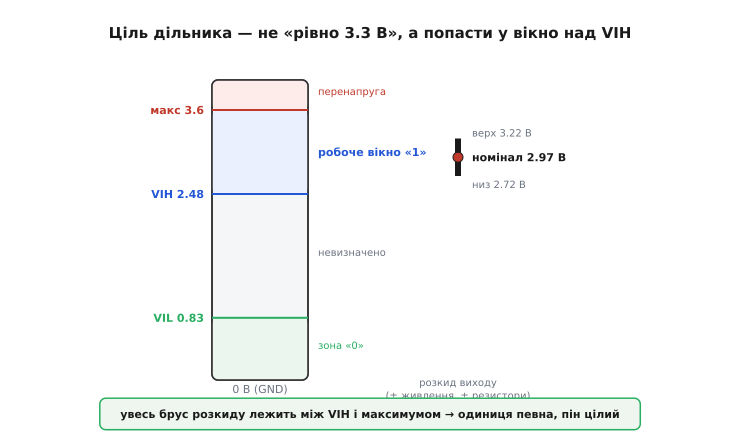
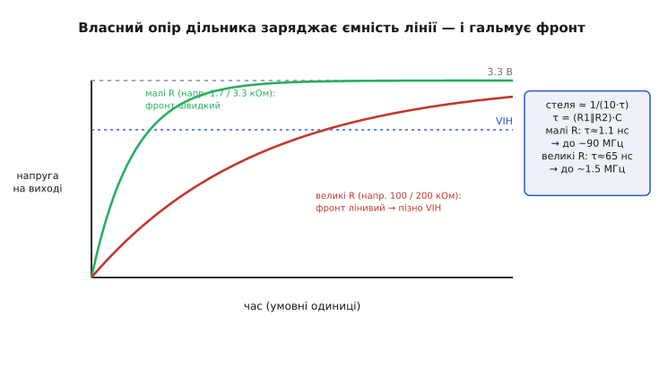
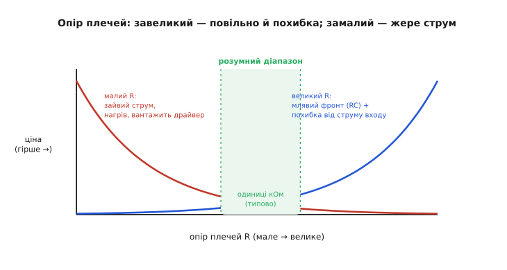
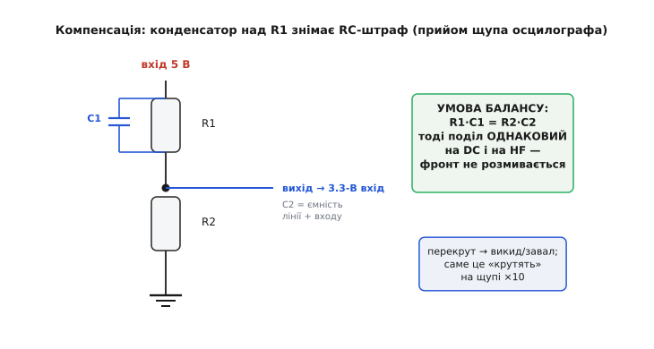

# Дільник напруги як зсувач рівнів

П'ятивольтовий давач треба завести на ніжку 3.3-вольтового мікроконтролера. Найдешевше, що спадає на думку, — і найчастіше правильне, — це два резистори: один згори, один знизу, а сигнал знімаємо з точки між ними. Виходить [дільник напруги](topic:hw-analog/voltage-divider), і працює він тут не як задавач опорної напруги, а як **зсувач логічного рівня вниз**: бере одиницю високого домену й опускає її до безпечної для низького входу висоти. Два резистори за копійки — і 5-вольтова лінія більше не палить пін.

Але «два резистори» — це та оманлива простота, за якою ховається кілька гострих кутів. Скільки саме опущувати? Куди має лягти вихід — рівно на 3.3 В? На яку частоту ця схема ще годиться, а де починає брехати? І чому вона рятує в один бік, а в інший безпорадна? Розберімо дільник саме як інструмент цифрового стику: не «звідки формула» (це в загальній статті про [дільник](topic:hw-analog/voltage-divider)), а **як спроєктувати його так, щоб вхід читав чисту одиницю, пін лишався цілий, а сигнал не розмазався**.

Почнемо з того, чому цей прийом узагалі можливий тільки в один бік — це задає всю його нішу.

## Чому дільник тільки опускає

Дільник — **пасивна** схема: у ньому лише резистори, жодного джерела енергії. А резистори енергії не додають, тільки розсіюють. Тому напруга на виході — завжди **частка** вхідної, ніколи не більше:

```
Vвих = Vвх · R2 / (R1 + R2)
```

Відношення R2/(R1+R2) завжди менше за одиницю, тож Vвих завжди менша за Vвх. Опустити 5 В до 3.3 В — будь ласка. А **підняти** 3.3 В до 5 В пасивними резисторами неможливо в принципі: з меншого не зробиш більшого без джерела, що доллє енергії. Це не обмеження конкретної схеми, а закон збереження — жодне хитре з'єднання резисторів його не обійде.

Звідси одразу випливає ніша дільника: він годиться **лише для однонапрямної лінії, що завжди йде згори вниз**. Скажімо, тактовий сигнал чи дані, які 5-вольтовий майстер жене в 3.3-вольтовий підлеглий і ніколи назад. Для двонапрямної шини (де обидва кінці й говорять, і слухають — як I2C) дільник не підходить: він не вміє відпрацьовувати сигнал у зворотний бік. Там потрібен зовсім інший механізм — [MOSFET-ключ або спеціальна мікросхема](topic:hw-digital/level-shifter).

> Логічна «1» — це не число, а **діапазон напруг**, прив'язаний до живлення тієї мікросхеми: вихід у стані «1» видає щось близьке до свого VDD, а вхід вважає одиницею все, що вище свого порога VIH. Ці дві шкали в різних доменів різні, тож пряме з'єднання їх стикає силоміць. Що таке рівні як смуги — [рівні «0» і «1»](topic:hw-digital/logic-levels-as-ranges).

## Куди має лягти вихід: не «рівно 3.3», а у вікно над порогом

Найпоширеніша помилка проєктувальника — цілитися дільником **рівно** в напругу живлення приймача, тобто в 3.3 В. Це і зайве, і небезпечне. Щоб зрозуміти, куди насправді треба влучити, згадаймо, як вхід приймача взагалі вирішує, що на ньому — нуль чи одиниця.

Вхід не порівнює напругу з однією межею. Він має [два пороги](topic:hw-digital/logic-thresholds): нижче **VIL** — гарантований нуль, вище **VIH** — гарантована одиниця, а між ними «нічия земля», де виробник нічого не обіцяє. Для 3.3-вольтового CMOS-входу VIH лежить приблизно на 0.7·VDD ≈ 2.3–2.5 В. Це і є справжня мета: вихід дільника в стані «1» має бути **вищим за VIH** — не за 3.3 В. Одиниця, що осіла на 2.9 В замість 3.3, для входу однаково чітка одиниця, бо вона впевнено вища за поріг.

Зверху ж є друга межа — **абсолютний максимум** напруги на піні (*absolute maximum rating*), зазвичай близько VDD + 0.3 В ≈ 3.6 В. Перевищиш її — і [захисний діод входу відкриється](topic:hw-digital/esd-gpio-protection), крізь нього потече струм, пін почне деградувати. Отже, вихід дільника мусить лягти у **вікно** між двома лініями: вище VIH (щоб одиниця читалася) і нижче абсолютного максимуму (щоб пін не згорів).


*Шкала напруги на 3.3-вольтовому вході. «1» — не точка, а вся синя смуга від VIH (≈ 2.48 В) до абсолютного максимуму (≈ 3.6 В). Ціль дільника — попасти брусом розкиду (номінал плюс похибки живлення й резисторів) усередину цієї смуги: тоді одиниця певна, а пін цілий. Цілитися рівно в 3.3 В означає без потреби притискатися до верхньої, небезпечної межі.*

Чому це вікно, а не точка, критично важливе? Бо реальний дільник ніколи не видає рівно розрахункову напругу. По-перше, живлення високої сторони «гуляє»: 5-вольтова шина за специфікацією тримається лише ±5%, тобто реально від 4.75 до 5.25 В (а від дешевого адаптера буває й гірше). По-друге, резистори мають **допуск** — звичайні 1% чи 5%, — і їхні відхилення зсувають частку. Помножте одне на друге — і замість «рівно 3.3 В» дістанете **брус** можливих значень. Проєктувати треба так, щоб **увесь цей брус** лежав усередині вікна, а не тільки його середина.

> 🔧 **Навіщо це.** Не рахуйте дільник «на номінал» — рахуйте на **найгірші кути**. Візьміть найвище живлення (5.25 В) і резистори, що штовхають вихід угору, — переконайтеся, що навіть тоді вихід нижчий за абсолютний максимум. Тоді візьміть найнижче живлення (4.75 В) і резистори, що тягнуть вихід донизу, — переконайтеся, що навіть тоді він вищий за VIH із запасом. Сходиться обидва кути — дільник надійний у серії, а не «в одного щасливого екземпляра на столі».

**Приклад (перевірка кутів для 5 В → 3.3 В).** Візьмемо ходову пару R1 = 1.8 кОм, R2 = 3.3 кОм, резистори 1%, вхід ESP32 (VIH ≈ 2.48 В, максимум 3.6 В).

```c
// Дільник 5 В -> 3.3-В логіка: перевірка на найгірших кутах
const float R1nom = 1800.0f, R2nom = 3300.0f;
const float tol   = 0.01f;                 // 1%-резистори

// Номінал при 5.00 В:
float k    = R2nom / (R1nom + R2nom);      // = 3300/5100 = 0.647
float Vnom = 5.00f * k;                    // = 3.24 В

// Кут «якнайвище»: живлення 5.25 В, R2 великий (+1%), R1 малий (-1%)
float kHi = (R2nom*1.01f) / (R1nom*0.99f + R2nom*1.01f);  // = 0.651
float Vhi = 5.25f * kHi;                   // = 3.42 В  < 3.6 В  -> пін цілий  ✓

// Кут «якнайнижче»: живлення 4.75 В, R2 малий (-1%), R1 великий (+1%)
float kLo = (R2nom*0.99f) / (R1nom*1.01f + R2nom*0.99f);  // = 0.642
float Vlo = 4.75f * kLo;                   // = 3.05 В  > 2.48 В -> «1» певна ✓
```

Обидва кути в межах: у найгіршому «верхньому» випадку 3.42 В не дістає до 3.6 В, у найгіршому «нижньому» 3.05 В упевнено вище VIH. Дільник спроєктовано правильно — він працюватиме на будь-якій платі з серії, а не тільки на тій, де резистори випадково лягли ідеально.

## Дільник масштабує, а не затискає

Тут ховається пастка, що на вигляд суперечить самій ідеї безпечного виходу. Дільник дає **безпечні** 3.3 В на виході — легко подумати, що він і «захищає» вхід від зависокої напруги, як стабілітрон чи обмежувальний діод. Це не так, і плутанина буває дорогою.

Дільник **лінійний**: він множить вхід на сталу частку, хоч яким той вхід буде. Наш дільник 5 В → 3.24 В має коефіцієнт 0.65. Подайте на нього не 5, а 6 В (переплутали живлення, стрибок на лінії) — і на виході буде не «безпечні 3.3», а 6 × 0.65 = **3.9 В**, вище абсолютного максимуму. Пін під ударом. Дільник не має жодного «стелі»: він не знає, що таке 3.6 В, він просто масштабує. Затиску тут нема — є пропорція.

Це принципова різниця з **обмежувачем** (клемпом). Обмежувальний діод на VDD відкривається, щойно напруга полізе вище живлення, і **зрізає** надлишок — хоч 5, хоч 50 В на вході дадуть на піні трохи вище VDD. Дільник так не вміє: він масштабує все підряд, тож захищає, лише **доки вхід не вилазить за розрахунковий**. Якщо джерело може стрибнути вище номіналу, дільник сам по собі — не захист; його доповнюють обмежувальним діодом або беруть [спеціальний перетворювач рівнів](topic:hw-digital/level-shifter) із власним затиском.

> 🔧 **Навіщо це.** Не плутайте «поділити» із «затиснути». Дільник безпечний **рівно доти, доки вхід тримається біля розрахункового номіналу**. Лінія, де можливі викиди, стрибки живлення чи випадкове підключення вищої напруги, потребує справжнього обмежувача, а не дільника. Просте контрольне питання: «що буде на виході, якщо на вхід прийде вдвічі більше?» У дільника відповідь — «вдвічі більше на виході», і це відразу показує межу його захисту.

## Головний ворог — швидкість: RC-стеля

Дільник опустив рівень, кути зійшлися, вхід читає чисту одиницю на постійному сигналі. Та щойно сигнал починає **швидко перемикатися**, спливає обмеження, яке й вирішує, чи годиться дільник тут узагалі, — **швидкість фронту**.

Будь-яка реальна лінія має паразитну **ємність**: сама доріжка на платі, вхідна ємність приймача, монтаж — разом кілька до десятків пікофарад. А дільник підключений до цієї ємності через свій **власний опір**. Для швидкості фронту важить не окремо R1 чи R2, а їхнє **паралельне** з'єднання R1∥R2 (з погляду вихідного вузла обидва резистори «дивляться» на нього паралельно — один до живлення, другий до землі; це [вихідний опір дільника](topic:hw-analog/voltage-divider)). Опір і ємність разом утворюють RC-ланку, і напруга на виході змінюється не миттєво, а наростає плавно зі **сталою часу**:

```
τ = (R1 ∥ R2) · C

R1 ∥ R2 = R1·R2 / (R1 + R2)
```

Поки лінію тягнуть **вниз**, усе добре: фронт «1 → 0» формує сильний вихідний транзистор драйвера крізь малий верхній резистор, спад різкий. А от **угору** («0 → 1») лінію піднімає вже сам дільник — заряджаючи ємність крізь свій опір. Цей фронт і є вузьким місцем: що більший опір плечей і що більша ємність, то **лінивіше** вихід повзе до VIH. Якщо період сигналу коротший, ніж треба фронту, щоб дійти до порога, лінія просто **не встигає** піднятися до одиниці перед наступним перемиканням — і приймач читає розмазане сміття.


*Як вихід дільника піднімається в одиницю після фронту «0 → 1». Малі плечі (одиниці кОм) дають малу сталу часу — вихід злітає до VIH швидко, лінія тягне високу частоту. Великі плечі (сотні кОм, «щоб економити струм») дають велику τ — вихід повзе мляво й перетинає поріг пізно, на швидкій шині одиниця не встигає сформуватися. Стеля частоти падає обернено до τ = (R1∥R2)·C.*

Порахуймо цю стелю в числах — вона наочно показує, чому вибір опору тут не косметичний.

**Приклад (стеля частоти для двох варіантів).** Та сама ємність лінії C = 15 пФ, дільник 5 → 3.3 В у двох виконаннях: «жорсткому» (1.8 / 3.3 кОм) і «ощадному» (180 / 330 кОм — ті самі частки, опір у сто разів більший).

```c
const float C = 15e-12f;                   // ємність лінії+входу, Ф

// Жорсткий дільник: R1=1.8к, R2=3.3к
float Rpar1 = 1800.0f*3300.0f/(1800.0f+3300.0f);   // = 1165 Ом
float tau1  = Rpar1 * C;                            // = 17.5 нс
float fmax1 = 1.0f/(10.0f*tau1);                    // ~10τ на період -> 5.7 МГц

// Ощадний дільник: R1=180к, R2=330к (ті самі частки, ×100 опір)
float Rpar2 = 180000.0f*330000.0f/(180000.0f+330000.0f); // = 116.5 кОм
float tau2  = Rpar2 * C;                            // = 1.75 мкс
float fmax2 = 1.0f/(10.0f*tau2);                    // -> 57 кГц
```

Різниця разюча: жорсткий дільник тягне майже 6 МГц, а ощадний — ледь 57 кГц, у сто разів менше, хоч **частки в них однакові й вихідна напруга та сама**. Ось чому на дільник не можна дивитися лише через призму «яка напруга на виході»: та сама напруга при різних опорах — це зовсім різна швидкодія. Швидка лінія жорстко обмежує, наскільки великими можна взяти плечі.

## Скільки ж брати: двобічний затиск на опір

Виходить, малий опір — добре: різкий фронт, висока стеля частоти. То чому б не взяти плечі якнайменшими, скажімо десятки ом? Бо з іншого боку тисне протилежна сила, і оптимум опиняється **посередині**.

Малий опір означає, що крізь дільник постійно тече помітний струм: I = Vвх/(R1+R2). При 5 В і плечах 180 ом сумарно це під 28 мА — весь час, поки схема живиться, у нікуди, самим лише грієм резистори. Гірше, цей струм мусить дати **вихідний транзистор драйвера**, коли він тримає лінію в нулі: дешевий давач може просто не потягнути такого навантаження або просісти. Тобто занадто малий опір **марнує енергію й вантажить драйвер**.

Занадто великий опір тисне з двох боків одразу. Перший бік — **RC гальмує фронт**. Другий тонший: [вхід приймача не ідеальний](topic:hw-digital/logic-thresholds) — крізь нього тече крихітний струм витоку (одиниці мікроампер) і сидить власна ємність. Дільник із великими плечима **м'який** (має великий вихідний опір), тож навіть цей мізерний струм входу помітно **зсуває** вихідну напругу — рівно як [будь-яке навантаження просаджує дільник](topic:hw-analog/voltage-divider). Розрахунок на 3.24 В може на практиці дати 3.1 чи 2.9 В — а це вже небезпечно близько до VIH. Тобто занадто великий опір **і повільний, і неточний**.


*Дві протилежні ціни, що затискають вибір опору. Ліворуч (малі R): зайвий струм крізь дільник, нагрів, навантаження на драйвер. Праворуч (великі R): млявий фронт від RC плюс похибка від струму входу, що зсуває вихідну напругу. Розумний діапазон — посередині, зазвичай одиниці кілоом: досить жорстко, щоб струм входу не збивав рівень, і досить економно, щоб не палити енергію.*

Практичний компроміс для логічних ліній — **одиниці кілоом**: сумарний опір десь від одного до десяти кОм. Це достатньо мало, щоб мікроамперний струм входу не збивав рівень, і достатньо велико, щоб струм крізь дільник (одиниці міліампер) не турбував ні джерело, ні тепловий бюджет. Саме тому в довідниках і трапляються ті самі значення на кшталт 1.8 / 3.3 кОм чи 1 / 2 кОм — вони лежать якраз у цій долині.

> 🔧 **Навіщо це.** Не женіться в жоден край. Плечі в десятки ом «швидкі», але жеруть струм і садять слабкий давач; плечі в сотні кілоом «економні», але повільні й ловлять похибку від струму входу. Тримайте сумарний опір у смузі 1–10 кОм для звичайних логічних ліній — і перевіряйте два числа: струм I = Vвх/(R1+R2) (щоб не був завеликий для драйвера) і сталу часу τ = (R1∥R2)·C проти періоду вашого сигналу (щоб фронт устигав). Ці дві прикидки за хвилину рятують від обох крайнощів.

## Коли фронту все одно замало: компенсований дільник

А що, як лінія і швидка, і плечі великими брати доводиться — скажімо, щоб не вантажити слабке джерело? RC-стеля тоді ріже сигнал. Є класичний прийом, що знімає цей штраф майже задарма: **компенсований дільник**.

Ідея тонка й красива. Простий дільник ділить постійну напругу за опорами (R2/(R1+R2)), а швидкий фронт — за ємностями (бо на високій частоті струм тече крізь ємності, а не крізь резистори). Якщо ці два поділи **різні**, фронт спотворюється — саме тому проста RC-ланка й «розмазує» сигнал. Але якщо додати конденсатор **паралельно верхньому резистору** R1 і підібрати його так, щоб ємнісний поділ **збігся** з резистивним, — фронт пройде без спотворення. Умова балансу проста:

```
R1 · C1 = R2 · C2
```

де C2 — та сама паразитна ємність лінії й входу, а C1 — доданий конденсатор над R1. Коли сталі часу верхнього й нижнього плеча рівні, дільник ділить **однаково** на постійному струмі й на високій частоті — і фронт зберігає форму, хоч які великі резистори.


*Компенсований дільник: конденсатор C1 над верхнім резистором R1. Коли R1·C1 = R2·C2 (C2 — паразитна ємність лінії й входу), ємнісний поділ дорівнює резистивному, і фронт проходить без розмивання. Перекрутиш C1 — з'явиться викид або завал: саме цей баланс «крутять» тримером на осцилографному щупі ×10.*

Це не екзотика — це **принцип, на якому працює щуп осцилографа ×10**: усередині нього дільник 9 МОм на 1 МОм із підстроювальним конденсатором, і те «підстроювання щупа», яке роблять по каліброваному меандру, — це якраз вирівнювання R1·C1 = R2·C2. Перекрутиш ємність — на екрані з'явиться викид (перекомпенсація) або завалений фронт (недокомпенсація). Виведення умови балансу з двох сталих часу й те, що буває при розбалансі, — [математика компенсованого дільника](topic:hw-digital/voltage-divider-digital/math-compensated-divider.md).

Для типової логічної лінії до компенсації вдаватися рідко треба — простіше взяти менші плечі. Але знати цей прийом варто: він рятує, коли опір великий вимушено, і він пояснює, чому осцилографний щуп улаштований саме так.

## Де дільник на місці, а де ні

Складімо все в коротке правило вибору. Дільник як зсувач рівнів — правильний інструмент, коли збігаються **три** умови:

- сигнал іде **тільки згори вниз** (з високого домену в низький), і ніколи назад;
- лінія **повільна** відносно RC-стелі — кнопка, реле, неквапливий UART, поодинока команда чи сигнал скидання;
- вхідна напруга **тримається біля номіналу** (немає викидів і стрибків живлення, від яких потрібен справжній затиск).

Збіглися всі три — дільник неперевершений: копійки, жодної мікросхеми, повна передбачуваність. Це щоденне рішення для стику 5-вольтового давача з 3.3-вольтовим контролером, для приймання RS-232-подібного сигналу, для одиничних ліній між доменами.

А не годиться він там, де порушено бодай одну умову. **Двонапрямна** шина (I2C, 1-Wire) — дільник не вміє у зворотний бік, потрібен [MOSFET-ключ](topic:hw-digital/level-shifter). **Швидка** лінія (SPI на мегагерци, високошвидкісні дані) — RC-стеля ріже фронт, потрібен активний буфер, що [жене обидва фронти силою](topic:hw-digital/push-pull-output). **Підняти** рівень знизу вгору — дільник фізично не може, тут рятує [підтяжка до вищої напруги на open-drain-виході](topic:hw-digital/open-drain-output) або той самий активний перетворювач. І напрямок «вгору» ще й вимагає, щоб низька сторона не гнала лінію силоміць, — інакше конфлікт драйверів.

Отже, дільник як зсувач рівнів — це два резистори, що масштабують одиницю високого домену вниз, у безпечне вікно між VIH і абсолютним максимумом низького входу. Він **тільки опускає** (пасивні резистори енергії не додають), тільки на **однонапрямній повільній** лінії, і **масштабує, а не затискає** (лінійний, без стелі). Проєктувати його треба на **найгірші кути** живлення й допусків, тримаючи вихід усередині вікна, а опір плечей — у долині одиниць кілоом: досить жорстко проти струму входу, досить економно проти нагріву, досить швидко проти RC. Швидкість обмежує стала часу τ = (R1∥R2)·C, а коли опір великий вимушено — рятує компенсація конденсатором над верхнім плечем. Скромна пара резисторів, якщо поставити її з розумінням цих меж, — найдешевший і найнадійніший зсув рівня, який тільки буває.
