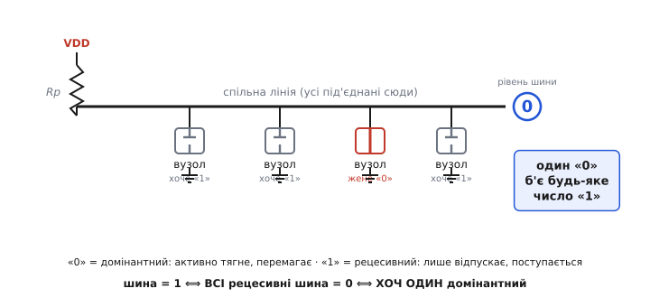
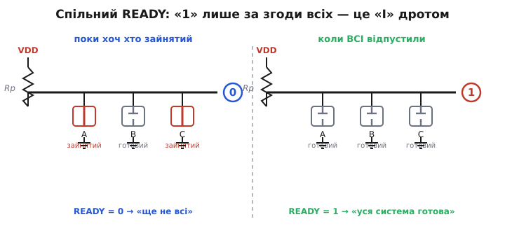
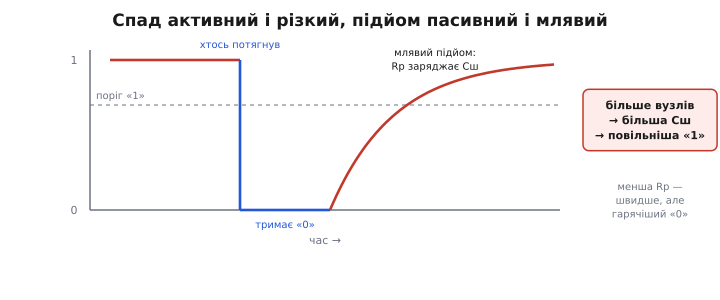

# Шина wired-AND

Уяви десяток мікросхем, і всі вони хочуть говорити по одному-єдиному дроту. Не по черзі за розкладом, а коли кому заманеться — давач раптом має що сказати, контролер саме щось чекає, третій вузол просто ще не готовий. Якби кожна тягла цей дріт із власною силою у свій бік, вони б билися: одна жене «високо», друга тієї ж миті «низько», і на лінії — не сигнал, а бійка з наскрізним струмом. Питання, на яке відповідає **шина wired-AND** (англ. *wired-AND* — «І, зроблене монтажем»), просте й глибоке: як зробити так, щоб багато пристроїв мирно ділили один провід — і щоб із їхніх голосів сама собою складалася осмислена відповідь?

Відповідь виявляється напрочуд ощадливою. Не потрібен ні складний протокол-арбітр, ні мікросхема-регулювальник. Потрібна одна домовленість про те, як виходи поводяться на лінії, — і тоді голий дріт починає рахувати логічне «І» від усіх учасників, а на цьому «І» вже тримаються підтвердження, сигнали готовності й навіть безкровний розподіл права говорити. Розберімо цю домовленість до дна: **який контракт** підписують вузли, **чому** з нього неминуче виходить саме «І», що це дає **як шині** — і де ця простота має свою ціну.

### Контракт шини: тягнути вниз можна, тягнути вгору — ні

Уся конструкція тримається на одному правилі, яке кожен вузол зобов'язується виконувати. Правило таке: **лінію дозволено активно тягнути тільки вниз, до нуля; угору її ніхто не тягне — угору її лишень відпускають**.

Технічно це означає, що виходи мусять бути особливого штибу — [з відкритим стоком](topic:hw-digital/open-drain-output) (*open-drain*; для біполярних — відкритий колектор). Усередині такого виходу сидить один-єдиний ключ між лінією та землею, а верхнього ключа до живлення немає взагалі. Тому вихід уміє рівно дві речі: **притягнути лінію до нуля** (замкнути ключ) або **відпустити** її, лишити висіти в повітрі (стан високого опору, [Hi-Z](topic:hw-digital/hi-z-state)). Порівняй зі звичайним [двотактним виходом](topic:hw-digital/push-pull-output) (*push-pull*), який жене силою в обидва боки: саме те вміння «тягнути вгору» й спричиняло би бійку, тож контракт його забороняє.

> 🔧 **Навіщо це.** Побачив на схемі, що купа ніжок різних мікросхем сходиться в **одну** точку, а від неї один резистор іде до живлення, — це майже напевно шина wired-AND, а не помилка розведення. І перше запитання при налагодженні «лінія залипла в нулі» — котрий вузол забув **відпустити** її: для wired-AND один заклинений вихід, що вічно тягне вниз, кладе всю шину, і винний — саме він.

Раз ніхто не тягне вгору, лишається питання: а хто ж робить лінію високою, коли всі відпустили? Її тихенько підтягує слабкий [резистор до живлення](topic:hw-digital/floating-pullups) (*pull-up*). Він **ледь** тягне вгору — рівно настільки, щоб у відсутність активних дій підняти лінію до «1». Але щойно бодай один вихід замикає свій ключ униз, він **легко перемагає** кволий резистор, і вся лінія провалюється в «0».

Ось тут і народжуються два слова, якими описують шину. Рівень, що **активно тягне й перемагає**, звуть **домінантним** (лат. *dominans* — «панівний»); на нашій лінії це «0». Рівень, що **лише відпускає й поступається**, звуть **рецесивним** (лат. *recessus* — «відступ»); це «1». Контракт у двох словах: **домінантний нуль завжди б'є рецесивну одиницю**, скільки б тих одиниць не було.

### Чому з контракту виходить саме «І»

Тепер порахуймо, що показує лінія, коли на ній висить кілька вузлів. Логіка тут — не аналогія, а прямий наслідок контракту, тож простежмо його крок за кроком.

Лінія висока («1») **тільки** тоді, коли її ніхто не тягне вниз — тобто коли **всі до одного** вузли відпустили, всі виставили рецесивне. Досить **одному** замкнути ключ — і лінія падає в «0». Запишімо це як умову на рівень лінії:

```
лінія = 1   ⟺   ВСІ вузли виставили рецесивне «1»
лінія = 0   ⟺   ХОЧ ОДИН виставив домінантне «0»
```

Перший рядок — це і є визначення логічного «І» (AND): результат істинний лише тоді, коли істинні **всі** входи. Дріт із підтяжкою обчислює «І» від бітів усіх учасників, не маючи жодного вентиля всередині. Саме тому — *wired-AND*: «І», зроблене самим фактом з'єднання.

Важливо вловити, що це «І» — **над усією шиною одразу**, а не над парою входів. Скільки б вузлів не додати — десять, сто, — правило те саме: важить лише одне запитання, «чи є хоч один домінантний нуль?». Один нуль перекриває будь-яке число одиниць. Це робить шину природно масштабованою: нові вузли просто чіпляються до того самого дроту, і сенс лінії не змінюється.


*Багато мовців під'єднані до одного дроту. Кожен або тягне вниз («0», домінантний), або відпускає («1», рецесивний). Лінія висока лише за загальної згоди всіх на «1»; один-єдиний нуль перемагає будь-яке число одиниць. Це таблиця вентиля «І», обчислена голим дротом над усією шиною.*

Тонкість, яку варто назвати прямо, аби не сперечатися даремно: ту саму лінію з тим самим залізом з однаковим правом звуть **монтажним «АБО»** — усе залежить від того, який рівень оголосити «активним сигналом». Дивишся на «тягнути вниз» як на подію — і лінія «спрацьовує, щойно смикне хоч хто», а це вже «АБО». Це не суперечність, а точна математична двоїстість (закони де Моргана): «І» в одній полярності тотожне «АБО» в протилежній. Хто хоче розкладену першопричину цієї двоїстості — вона в сусідній статті про [монтажну логіку](topic:hw-digital/wired-logic): там і виведення «дріт = вентиль», і чому «І» та «АБО» — це одне й те саме, побачене з двох боків. Тут же нам вистачить робочого правила шини: **тягне хоч хто — лінія внизу; високою вона стає лише за згоди всіх.**

### Що це дає шині: згода, підтвердження, право говорити

Тепер найцікавіше — навіщо така лінія по-справжньому потрібна. Виявляється, «І над усіма» — це готовий механізм для кількох задач, які інакше вимагали б окремої логіки. Розгляньмо їх, бо саме тут абстрактне «І» стає інженерним інструментом.

**Спільний сигнал готовності — це «І» без лічильника.** Хай кожен вузол системи тримає лінію `READY` у домінантному нулі, поки він зайнятий, і **відпускає** її в рецесивну одиницю, щойно закінчив свою частину роботи. Усі ці виходи зведено в одну точку монтажним «І». Що тоді показує спільна лінія? Вона підстрибне в «1» **лише тоді, коли всі до одного** відпустили — тобто коли **кожен** вузол готовий. Один дріт — і ти маєш сигнал «уся система готова», без жодного лічильника, без опитування «а ти вже?», без коду, що зводить окремі прапорці. «І» рахує загальну згоду саме так, як треба: доки хоч хтось не встиг, лінія тримається внизу його зусиллям.


*Кожен вузол тягне READY вниз, поки працює, і відпускає, коли готовий. Ліворуч: A і C ще зайняті — лінія в домінантному нулі, «ще не всі». Праворуч: усі відпустили — підтяжка піднімає лінію в одиницю, «уся система готова». Загальну згоду порахував голий дріт як «І» усіх сигналів.*

**Підтвердження прийому — той самий прийом на біт.** У багатьох шинах приймач мусить сказати передавачеві «отримав». Замість окремого дроту-відповіді роблять простіше: у відведений момент передавач **відпускає** лінію (виставляє рецесивне), а приймач у цей самий такт **притягує** її вниз (домінантне). Оскільки домінантний нуль б'є рецесивну одиницю, передавач, читаючи власну лінію, побачить нуль — і це для нього знак «мене почули». Ніхто не конфліктує: один поступився, другий притягнув, «І» зробило висновок.

**Право говорити — арбітраж без арбітра.** Найелегантніше застосування — коли кілька вузлів починають передавати водночас і треба безкровно вирішити, чий голос лишиться. Кожен виставляє свій біт і **одночасно слухає лінію**. Поки вузол шле рецесивну одиницю, а хтось інший — домінантний нуль, на лінії буде нуль (домінантний б'є). Той, хто хотів одиницю, це **побачить** («на лінії не те, що я послав») і чемно замовкне; той, хто послав нуль, побачить свій нуль і продовжить. Так, біт за бітом, лінія сама пропускає вперед вузол із «важчим» повідомленням, а решта відступають без зіткнення й без утрати даних. Це і є [побітовий арбітраж](topic:hw-arch/bus-arbitration) на шині wired-AND — його класично використовує автомобільна CAN-шина, де домінантний нуль виграє суперечку, а вузли з меншим ідентифікатором дістають пріоритет. За цей механізм відповідає той самий контракт «нуль перемагає одиницю», лише прочитаний як змагання.

І, звісно, на цьому ж тримаються **спільні шини зв'язку**. Найвідоміша — [I2C](topic:com-devices/i2c-bus): два дроти, на них висить купа давачів, кожен спілкується через open-drain із підтяжками. Монтажне «І» тут — не лише захист від зіткнень: на ньому будуються і підтвердження прийому, і притримування такту повільним приймачем, і арбітраж кількох ведучих. Усе це — та сама фраза «притягнути вниз перемагає відпустити», застосована знову й знову.

### Ціна шини: чому вона повільна й тепла

Монтажне «І» коштує сміховинно дешево — дріт і резистор, — але воно **не повноцінний** вентиль, і його межі варто знати наперед, бо на них легко наскочити.

Найважче обмеження — **несиметричні фронти**. Спад у нуль **різкий**: якийсь вихід активно замикає ключ і садить лінію силою. А підйом у одиницю **млявий**: лінію не жене ніхто, її лише тягне кволий резистор, і йому доводиться заряджати всю ємність шини крізь власний опір. Це [заряджання RC](topic:hw-analog/rc-time-constant), і саме воно ставить стелю швидкості. Гірше того: що більше вузлів на лінії й що вона довша, то **більша сумарна ємність** — і тим повільніший підйом. Тому шину wired-AND не нарощують безмежно: кожен новий вузол трохи «важчить» фронт одиниці.


*Доки лінію тягнуть, вона різко падає в домінантний нуль. Щойно відпустили — підтяжка Rp повільно заряджає ємність шини Cш, і рецесивна одиниця відновлюється по кривій RC. Більше вузлів — більша Cш — повільніший підйом. Менша Rp пришвидшує фронт, але гріє лінію в нулі: вічний компроміс.*

Друге обмеження — **лінія трохи гріється, поки тримає нуль**. Доки бодай один вихід тягне вниз, крізь підтяжку весь час тече струм із живлення в землю (I = VDD / Rp). Двотактний вихід у сталому стані майже не споживає, а монтажна лінія в активному нулі постійно віддає цю дещицю на тепло. Дрібниця для одної лінії — але це та ціна, яку платять за простоту, і вона зростає, якщо ставити менший резистор заради швидкості.

Третє — **шина не вміє інвертувати й не відновлює рівень**. З голого дроту складається «І» (або «АБО» — за полярністю), але не «НЕ»: перевернути сигнал може лише активний елемент, а дріт нічого не підсилює. І високий рівень тут електрично **слабший** за низький — його тримає лише резистор, тоді як нуль жене повноцінний ключ. Тому рецесивна одиниця чутливіша до завад і повільніша; закладаючи [запас завадостійкості](topic:hw-digital/noise-margin), про це пам'ятають.

**Приклад (швидкість підйому).** Хай підтяжка Rp = 4.7 кОм тягне шину з сумарною ємністю Cш = 100 пФ. Скільки триває підйом рецесивної одиниці?

```
стала часу:   τ = Rp · Cш = 4700 · 100·10⁻¹² = 470·10⁻⁹ с = 470 нс

«дотягнутися» до порогу «1» ≈ кілька τ:

на 100 кГц:  один біт = 10 мкс  → 470 нс ≈ 5 % біта    (легко встигає)
на 400 кГц:  один біт = 2.5 мкс → 470 нс ≈ 19 % біта   (ще гаразд)
на 1 МГц:    один біт = 1 мкс   → 470 нс ≈ 47 % біта   (вже не встигає)
```

Видно, звідки береться характер шини: активний спад миттєвий, а пасивний підйом тягне ємність крізь резистор. Хочеш швидше — став **меншу** Rp (швидший заряд), але тоді росте струм у нулі: знову той самий компроміс між швидкістю й нагрівом. Порахувати цей вибір у C легко:

```c
// Оцінка фронту одиниці для шини wired-AND і перевірка, чи встигає біт.
// Формули прямо з RC: t_rise ≈ k·Rp·Cbus, де k покриває підйом до порогу.
float rc_rise_ns(float Rp_ohm, float Cbus_pF, float k) {
    float tau_ns = Rp_ohm * (Cbus_pF * 1e-12f) * 1e9f;  // τ у наносекундах
    return k * tau_ns;                                   // час до порогу «1»
}

int bit_fits(float bit_period_ns, float rise_ns) {
    // лишаємо запас: фронт має вкластися приблизно в третину біта
    return rise_ns < bit_period_ns * 0.33f;
}

// приклад: Rp = 4.7 кОм, Cbus = 100 пФ, k ≈ 2.2 (підйом до ~0.7·VDD)
// rc_rise_ns(4700, 100, 2.2f) ≈ 1034 нс → на 1 МГц (1000 нс/біт) не влазить.
```

Ось так виходить, що логіку зовсім не конче будувати з вентилів. Іноді достатньо взяти з вузлів одну обіцянку — **тягнути лінію тільки вниз, а вгору лише відпускати** — звести їх в одну точку й дати підтяжку. Дріт сам почне рахувати «усі згодні?», домінантний нуль сам перемагатиме рецесивну одиницю, і на цьому єдиному правилі виростуть згода, підтвердження й право говорити. Ціла робоча шина з голого проводу й резистора — за умови, що пам'ятаєш про плату за простоту: млявий підйом, легкий нагрів у нулі й слабша одиниця, яку тримає сам лише резистор.
