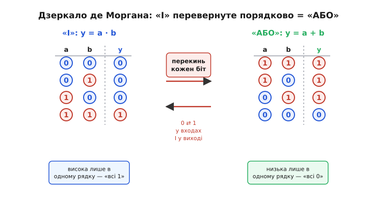
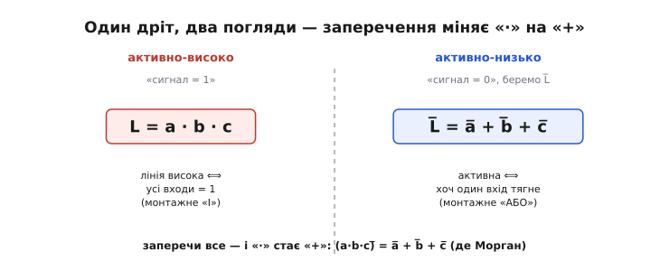

# 🧮 Закони де Моргана: чому «І» й «АБО» — це одне «І» те саме

У самій темі ми натрапили на дивну річ: та сама фізична лінія з тим самим залізом — одні виходи «лише вниз» плюс підтяжка — з однаковим правом зветься то монтажним «І», то монтажним «АБО». Нічого в дроті не міняється; змінюється лише те, який рівень ми оголосили «активним сигналом». Це звучить так, ніби ми просто по-різному дивимося й самі себе плутаємо. Насправді за цим стоїть точна алгебраїчна тотожність — **закони де Моргана**, — і саме вона обіцяє, що плутанини тут немає: «І» в одній полярності **математично тотожне** «АБО» в протилежній. Не «схоже», не «можна вважати» — тотожне, до останнього рядка таблиці.

Ця вставка розкладає, **звідки** ця тотожність береться, **чому** вона неминуча (а не випадкова зручність), як виглядає її апарат — і як він лягає рівно на наш дріт, перетворюючи розмиту фразу «залежить від погляду» на строгий факт. Почнемо з першопричини: що взагалі означає «заперечити» логічну умову.

### Заперечення як дзеркало

Уся логіка монтажної лінії будується на двох простих поняттях і одному, що їх зв'язує. Прості — це «І» та «АБО». Умова «a **І** b» істинна, лише коли істинні **обидві** частини. Умова «a **АБО** b» істинна, коли істинна **хоч одна** (включно з випадком, коли обидві). У прозі ми вже цим користувалися: «лінія висока, лише коли **всі** відпустили» — це «І»; «лінія активна, щойно смикне **хоч хто**» — це «АБО».

Третє поняття — **заперечення** (лат. *negatio* — «відмова, перекреслення»), яке ми записуємо рискою над сигналом: a̅ читається «не a». Заперечення робить рівно одне: перевертає істину в хибу й хибу в істину. Якщо a — це «лінія висока», то a̅ — це «лінія **не** висока», тобто низька. Одне-єдине дзеркало: те, що було «так», стає «ні», і навпаки.

І ось питання, з якого все виростає: **що станеться з умовою «І», якщо подивитися на неї крізь це дзеркало?** Не на окремий сигнал, а на цілу складену умову «a І b». Заперечити її — означає спитати: «коли ця умова **не** виконується?». Розберімо це не формулою, а думкою, бо тут — уся суть.

Умова «a І b» каже: «істинні **обидва**». Коли вона **хибна**? Тоді, коли **не** обидва — тобто коли бракує хоча б одного. «Бракує хоча б одного» означає: **або** хибне a, **або** хибне b (або обидва). Прочитаймо це повільно, бо сталося щось дивне. Ми взяли «І» («обидва істинні»), заперечили його — і в описі того, коли воно ламається, само собою вигулькнуло «**АБО**»: «хибне a **або** хибне b». «І» під дзеркалом обернулося на «АБО».

Це і є перший закон де Моргана, і зараз ми запишемо його точно. Але спершу спіймаймо інтуїцію намертво звичайною, нелогічною мовою.

> Уяви умову вступу: «прийнято, якщо склав математику **І** фізику». Коли тебе **не** приймуть? Не тоді, коли ти завалив **обидва** — а вже тоді, коли завалив **хоч один**. Провал спільної вимоги «обидва» — це успіх окремої вимоги «хоч один провалився». Складене «І» ламається від **одного** слабкого місця; а «одне слабке місце» — це вже «АБО».

Симетрично працює й «АБО». Умова «a АБО b» каже: «істинний **хоч один**». Коли вона хибна? Лише тоді, коли **жодного** — тобто коли хибні **обидва**: хибне a **І** хибне b. Заперечили «АБО» — дістали «І». Дзеркало працює в обидва боки: воно міняє «І» ⇄ «АБО» щоразу, коли ним користуєшся.

Ось чому це не випадкова зручність. «І» й «АБО» — не два незалежні поняття, які випадково спіткнулися одне об одне на нашому дроті. Вони **дзеркальні двійники**: кожне з них — це інше, побачене з протилежного боку істини. Заперечення — і є той бік.

### Два закони, записані точно

Тепер, коли інтуїція на місці, стисло й строго. Домовимося про запис (це звична **булева алгебра** — [алгебра логіки на двох значеннях 0 і 1](topic:math-logic/boolean-algebra), де «·» це «І», «+» це «АБО», риска — заперечення; назва — на честь Джорджа Буля):

```
a · b      «a І b»        (істинно ⟺ обидва істинні)
a + b      «a АБО b»      (істинно ⟺ хоч один істинний)
a̅          «не a»         (перевертає 0 ⇄ 1)
```

Два закони де Моргана в цьому записі:

```
(a · b)̅  =  a̅ + b̅        заперечення «І»  = «АБО» заперечень
(a + b)̅  =  a̅ · b̅        заперечення «АБО» = «І»  заперечень
```

Прочитай кожен рядок словами — і почуєш ту саму думку, що вище. Верхній: «неправда, що обидва» дорівнює «не-a або не-b» — складене «І» ламається від одного винуватця. Нижній: «неправда, що хоч один» дорівнює «не-a і не-b» — щоб узагалі нічого не спрацювало, мусять мовчати всі. Риска над **усім** виразом ліворуч «розривається» на окремі риски над кожним доданком праворуч — **і водночас операція всередині перевертається**: «·» стає «+», «+» стає «·». Це друга половина закону, яку легко проґавити: розірвати рису мало — треба ще й поміняти дію.

> 🔧 **Навіщо це.** У даташитах і на схемах цю тотожність застосовують мовчки, не називаючи де Моргана. Побачив у документації логічний вираз під загальною рискою — знай, що його завжди можна переписати, «розбивши» риску й перевернувши операцію; часто саме так із незручного «не (те або се)» роблять зрозуміле «не-те і не-се». Для монтажної лінії це ще важливіше: та сама схема в описі виробника може бути названа «wired-OR», а в тебе на очах працювати як wired-AND — і ці два описи **не суперечать**, вони пов'язані рівно цим законом.

### Доказ, який видно очима: таблиця й дзеркало

Інтуїція переконує, та в логіці твердження або виконується для **всіх** можливих значень, або хибне. Значень тут небагато — кожен вхід це 0 чи 1, — тож перевіримо верхній закон вичерпно, для всіх чотирьох комбінацій двох входів. Це і є доведення повним перебором (лат. *tabula* — «дощечка, таблиця»): побудуємо обидві сторони й порівняємо стовпчики.

```
a  b │ a·b   (a·b)̅ │ a̅  b̅   a̅+b̅
─────┼────────────┼──────────────
0  0 │  0      1   │ 1  1    1
0  1 │  0      1   │ 1  0    1
1  0 │  0      1   │ 0  1    1
1  1 │  1      0   │ 0  0    0
```

Стовпець `(a·b)̅` і стовпець `a̅+b̅` збіглися рядок у рядок: `1 1 1 0`. Отже ліва частина закону дорівнює правій **на кожному** наборі входів — а це в логіці й означає «тотожно рівні». Не приблизно, не «в типовому випадку» — завжди. Так само перевіряється нижній закон (спробуй сам: стовпці `(a+b)̅` і `a̅·b̅` дадуть `1 0 0 0`).

Тепер найкорисніший спосіб **побачити** цю рівність — не як два окремі стовпці, а як одну таблицю, перекинуту в дзеркалі. Візьми таблицю чистого «І» (без заперечень) і **переверни кожну клітинку** — і входи, і вихід — на протилежний рівень: усі 0 стають 1, усі 1 стають 0. Ось що вийде:


*Ліворуч — «І»: вихід високий рівно в одному рядку, там, де обидва входи високі («всі 1»). Праворуч — та сама таблиця з кожним бітом, переверненим на протилежний рівень: тепер вихід низький рівно в одному рядку, там, де обидва входи низькі («всі 0»). А «низький лише за всіх низьких» — це в точності «АБО». Заперечити все — і «І» стає «АБО»; дзеркало й є закон де Моргана.*

Придивися, що сталося. «І» — це «вихід високий **лише** коли всі входи високі» (одна виграшна комбінація з чотирьох). Перекинули все — і дістали «вихід низький **лише** коли всі входи низькі». Але «низький лише за всіх низьких» — інакше кажучи «високий, щойно хоч один високий» — це дослівне означення «АБО». Тобто «І», відбите в дзеркалі заперечення, **буквально є** таблицею «АБО». Не схоже на неї — **є нею**. Оце і є закон де Моргана, показаний геометрично: одна й та сама таблиця, дві назви, залежно від того, з якого боку істини на неї дивишся.

### Апарат: чому дзеркало симетричне й що з ним можна робити

Варто зрозуміти, **чому** перекидання виходить таким акуратним — бо на цьому тримається вся сила закону. Причина в тому, що заперечення — це **інволюція**: застосуй його двічі й повернешся туди, звідки почав. Подвійна риска знімається: (a̅)̅ = a. «Не (не a)» — це просто a. Дзеркало, поставлене перед дзеркалом, дає пряме зображення.

Саме інволютивність робить закон **оборотним** і дозволяє ним по-справжньому користуватися, а не лише милуватися. Візьмімо верхній закон і застосуймо дзеркало до обох боків:

```
починаємо з:        (a · b)̅ = a̅ + b̅
заперечимо все:     ((a·b)̅)̅ = (a̅ + b̅)̅
ліворуч подвійна риска зникає:   a · b = (a̅ + b̅)̅
```

Останній рядок читається так: «a І b» — це «неправда, що не-a або не-b». Ми щойно виразили «І» **через** «АБО» й заперечення, не вживши жодного «·». Це не абстрактна гра: у залізі саме так буває зручно, коли в тебе є природне «АБО» (одна полярність виходів), а треба одержати «І». Закон де Моргана — це рецепт, як зробити одну операцію з іншої, доклавши лише заперечень.

Звідси й головний практичний висновок для будь-якої логіки, не лише монтажної: **пари {«І», заперечення} досить, щоб побудувати «АБО»; пари {«АБО», заперечення} досить, щоб побудувати «І».** Одну з двох операцій можна не мати «рідною» — її завжди дістанеш через другу плюс дзеркало. (Саме тому в цифровій техніці так люблять вентилі NAND і NOR: кожен з них поєднує операцію із запереченням, і завдяки де Моргану одного такого типу вистачає, щоб зібрати геть усю логіку.)

І ще одне, що прямо знадобиться на дроті: закон **не обмежений двома входами**. Той самий доказ перебором проходить для скількох завгодно змінних, бо міркування «складене „все істинні“ ламається від одного винуватця» не залежить від їхньої кількості. Для n входів:

```
(a₁ · a₂ · … · aₙ)̅  =  a̅₁ + a̅₂ + … + a̅ₙ
(a₁ + a₂ + … + aₙ)̅  =  a̅₁ · a̅₂ · … · a̅ₙ
```

Одне спільне «І» від багатьох під запереченням розсипається на «АБО» від їхніх заперечень — і навпаки. Це рівно те, що діється на спільній лінії з десятком чи сотнею виходів: масштаб не змінює правила.

### Де це працює в темі: той самий дріт, доведений строго

Тепер зберімо все докупи на нашому дроті — і побачимо, що фраза «залежить від погляду» була не відмовкою, а точною теоремою.

Що таке фізично один open-drain вихід на спільній лінії? Він уміє дві речі: **тягнути лінію вниз** або **відпускати**. Нехай сигнал кожного учасника — це «він тягне». Позначмо високий рівень лінії літерою L. Фізика монтажної точки з підтяжкою (це ми вивели в самій темі: [активний нуль перемагає відпускання](topic:hw-digital/active-low)) каже просту річ:

```
L (лінія висока)  ⟺  НІХТО не тягне  ⟺  усі входи відпустили
```

А тепер — два погляди, і кожен ми запишемо алгебраїчно.

**Погляд перший, активно-високий.** Оголосимо «сигнал» = високий рівень. Тоді вхід учасника — це «він відпустив» (дав своїй ділянці бути високою). Лінія висока, лише коли відпустили **всі**:

```
L  =  a · b · c        (усі входи високі → лінія висока)   ← монтажне «І»
```

**Погляд другий, активно-низький.** Тепер оголосимо «сигнал» = низький рівень, бо саме він у залізі несе подію («мені треба», «я тягну»). Дивимося не на L, а на L̅ (лінія **низька**), і входом уважаємо a̅ («учасник тягне», тобто **не** відпустив). Візьмемо наше рівняння L = a·b·c і перекинемо його в дзеркало — заперечимо обидва боки:

```
L̅  =  (a · b · c)̅
```

І ось тут закон де Моргана робить усю роботу. Праворуч під загальною рискою стоїть «І» — розіб'ємо риску й перевернемо операцію:

```
L̅  =  (a · b · c)̅  =  a̅ + b̅ + c̅        ← монтажне «АБО»
```

Прочитай останній рядок фізично: **лінія низька (L̅), щойно тягне хоч один** (a̅ **або** b̅ **або** c̅). Це дослівно «АБО» від подій усіх учасників — те саме монтажне «АБО» збірної лінії переривань, де будь-який давач смикає спільний дріт униз.


*Ліворуч високий рівень оголошено сигналом: лінія висока ⟺ усі входи високі, чисте «І» (L = a·b·c). Праворуч сигналом оголошено низький рівень і дивимося на L̅: заперечення обох боків за законом де Моргана перетворює «·» на «+», і виходить «АБО» — лінія активна, щойно тягне хоч хто. Жодного дроту не переставили; переставили лише те, який рівень назвали активним, а решту зробила тотожність.*

Ось де ланцюжок замкнувся. Ми не «вирішили вважати» одну схему то «І», то «АБО» з примхи. Ми записали фізику лінії одним рівнянням (L = a·b·c), а тоді **той самий факт** подивилися з протилежного боку істини — і закон де Моргана **змусив** його прибрати вигляд «АБО» (L̅ = a̅+b̅+c̅). Обидва записи описують **той самий дріт у тому самому стані**; вони не можуть суперечити, бо один здобутий з іншого чистим запереченням, а заперечення нічого не спотворює — воно лише перейменовує «так» на «ні».

Тому суперечка «це насправді wired-AND чи wired-OR?» — несправжня. Правильна відповідь: **і те, й те, залежно від того, який рівень оголошено активним**, і ці дві відповіді пов'язані не абияк, а строгою тотожністю. Дивишся активно-високими очима — бачиш «І» (згода всіх); перекладаєш активно-низькими — те саме перетворюється на «АБО» (тривога будь-кого). Риска над сигналом на схемі (`IRQ`, `RESET`, суфікс `_n`) — це і є нагадування, що автор дивиться крізь дзеркало, тож у нього «·» вже прочиталося як «+».

### Межа: заперечення дає дзеркало, але не інвертор

Наостанок — важлива чесність, щоб апарат не спокусив на зайве. Закон де Моргана вимагає заперечень: у ньому риски над кожним доданком. На папері риска безплатна — це просто інший погляд. Але **в залізі перевернути рівень — це фізична дія**, яку голий дріт зробити не вміє: для справжнього «не» потрібен активний елемент-підсилювач.

Чому ж тоді на дроті все зійшлося без жодного інвертора? Бо ми **ніде не інвертували сигнал фізично** — ми лише **перейменували**, який рівень уважати активним. Заперечення тут живе виключно в наших назвах («активний нуль» замість «активна одиниця»), а не в кремнію. Дріт як робив рівно одне — «тягне хоч хто → лінія внизу», — так і робить; змінилася тільки етикетка на його поведінці. Саме тому монтажна логіка вміє «складати» входи в «усі» чи «хоч хто» й **вільно перекидати** одне в інше на письмі, але сама, без вентиля, не може перевернути жоден рівень. Дзеркало де Моргана — безкоштовне, коли воно в голові; за фізичне заперечення завжди платять транзистором.

Отак закон, який Огастес де Морган записав для чистої логіки ще до появи транзисторів, виявляється точним описом того, що робить звичайний дріт із підтяжкою. «І» та «АБО» — не два різні вентилі, а одне поняття, побачене з двох боків істини; полярність активного рівня лише каже, з якого боку ти дивишся. А дріт, який мовчки рахує «усі» або «хоч хто», весь цей час просто був чесним дзеркалом.

### Хто такий де Морган — і що саме він зробив

Огастес де Морган (Augustus De Morgan, 1806–1871) — англійський математик і логік, перший професор математики новоствореного Лондонського університету (University College London). Народився в Мадурі, у тодішній Британській Індії, де служив його батько; майже все життя працював у Лондоні. Формальний запис цих двох законів у мові логіки він дав у книжці **«Формальна логіка, або Числення висновку, необхідного й імовірного»** (*Formal Logic, or the Calculus of Inference, Necessary and Probable*, 1847) — вона вийшла буквально того самого тижня, що й праця Джорджа Буля, з яким де Морган листувався і разом з яким стояв біля витоків сучасної математичної (символьної) логіки. Саме тому обидва закони носять його ім'я.

Тут варто чесно розставити межу доказовості, бо «названо на честь» і «вигадав» — різні речі. **Сама рівносильність відома задовго до де Моргана**: її по суті помічав ще Арістотель, її знали середньовічні логіки — Вільям Оккам у XIV столітті прямо виписав словами те, що дають ці правила, а Жан Бурідан описав відповідні перетворення суджень; сходознавці відзначають подібні міркування і в арабській логічній традиції (зокрема в Авіценни). Отже де Морган **не був першим, хто це побачив** — це усталений історичний факт, а не приниження його заслуги. Його внесок точніший і теж реальний: він дав цим правилам **строге формальне, алгебраїчне формулювання** саме тоді, коли логіку почали перетворювати на числення, — і в цій новій, придатній для обчислень формі вони й увійшли в математику та згодом в інженерію. Класичний випадок, коли ім'я на теоремі відзначає не першовідкриття ідеї, а той момент, коли її вклали в апарат, яким усі відтоді користуються.
