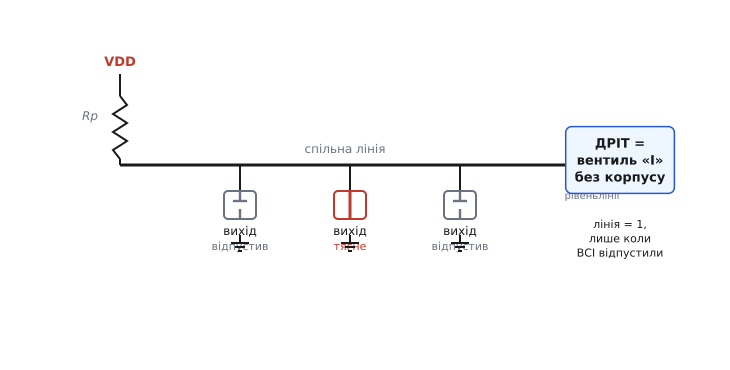
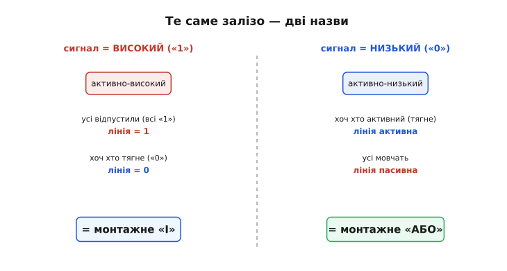
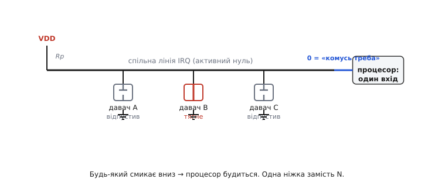

# Монтажна логіка

Логічний вентиль зазвичай уявляють як окрему деталь: коробочку з кількома входами й одним виходом, усередині якої сидять транзистори. Та є дивовижний факт: іноді **сам дріт** виконує роль вентиля. З'єднай кілька виходів в одну точку, додай один резистор — і ця точка рахуватиме логічну функцію від усіх виходів, хоча жодного вентиля туди ніхто не поставив. Це й називають **монтажною логікою** (англ. *wired logic* — «логіка, зроблена монтажем»): логіка не в кремнію, а в самому з'єднанні.

Звучить як фокус, але за ним — проста причина, і вона варта того, щоб її розкласти. Бо це не просто кумедний трюк: на монтажній логіці тримаються спільні шини, лінії переривань, сигнали готовності — усе, де багато пристроїв мають дійти спільної згоди на одному дроті, не заважаючи одне одному. Розберімо, **звідки** береться логіка з голого з'єднання, **яку саме** функцію воно рахує (і чому відповідь залежить від погляду), і де ця ідея ламається.

### Чому з'єднати звичайні виходи не можна

Спершу — чому це взагалі задача. Здавалося б, що складного: візьми два цифрові виходи й з'єднай їх в одну точку. Та звичайний цифровий вихід [двотактний](root:hw-digital/push-pull-output) (*push-pull*): «1» — це коли він активно з'єднує лінію з живленням, «0» — коли активно садить її на землю. Він **тягне в обидва боки силою**. І щойно один такий вихід жене «1», а сусідній тієї ж миті жене «0», вони з'єднують живлення із землею навпрост крізь себе — це **конфлікт шини** (*bus contention*), майже коротке замикання. Великий наскрізний струм, гарячі каскади, у гіршому разі — спалені ніжки.

Тобто проблема не в дроті, а у **виходах, що тягнуть угору силою**. Поки кожен наполягає на своєму рівні активно, двоє неминуче зіткнуться. Аби дріт міг бути вентилем, виходи мусять навчитися **поступатися** — а не битися.

### Один поступливий вихід — і логіка з'являється сама

Розв'язок: відібрати у виходу половину сили. Лишити йому вміння **тягнути вниз** — і забрати вміння тягнути вгору. Замість цього, коли виходу треба «1», він просто **відпускає** лінію, лишає її висіти в повітрі (стан високого опору, *Hi-Z*). Такий вихід зветься [open-drain](root:hw-digital/open-drain-output) (для біполярних транзисторів — [open-collector](root:hw-digital/open-drain-bus-pullup-sizing), відкритий колектор): усередині лише один нижній транзистор-ключ на лінію, верхнього немає взагалі. Він уміє рівно дві речі — **притягнути до нуля** або **відпустити**.

Тепер два, десять, сто таких виходів можна сміливо звести в одну точку: зіткнутися «верхами» нема чому, бо ніхто вгору не тягне. Найгірше, що може статися, — двоє водночас тягнуть **вниз**, а це безпечно: обидва ведуть до тієї самої землі. Лишається питання: якщо ніхто не жене «1», **хто** ж робить лінію високою? Слабкий [резистор-підтяжка](root:hw-digital/floating-pullups) (*pull-up*) до живлення. Він **ледь** тягне лінію вгору. Поки всі виходи відпустили, підтяжка спокійно піднімає лінію до «1». А щойно бодай один притягує вниз — він легко перемагає кволий резистор, і лінія стає «0».

І ось тут народжується логіка. Подивися на лінію очима умови «коли вона висока»:

```
лінія = 1   ⟺   ВСІ виходи відпустили
лінія = 0   ⟺   ХОЧ ОДИН тягне вниз
```

Це **точно** таблиця вентиля «І» (AND): результат істинний лише тоді, коли істинні всі входи. Дріт із підтяжкою обчислює логічне «І» від усіх виходів — без жодного вентиля. Цей трюк і називають **монтажним «І»** (*wired-AND*): «І», зроблене самим монтажем.


*Спільна лінія з підтяжкою Rp і кілька виходів «лише вниз». Лінія висока тільки тоді, коли всі відпустили; досить одному притягнути — і вся лінія «0». Це таблиця вентиля «І», обчислена голим дротом: «І» сидить не в кремнію, а в самому з'єднанні.*

> 🔧 **Навіщо це.** Розуміння «дріт = вентиль» одразу пояснює характерну схему: коли на платі багато ніжок-виходів сходяться в **одну** точку, а від неї один резистор іде до живлення, — це не помилка розведення, це навмисний монтажний вентиль. І перша річ, яку перевіряють, коли така лінія «залипла в нулі», — чи не забув якийсь пристрій **відпустити** її (зависла ніжка тягне вниз вічно), бо для монтажного «І» один-єдиний винуватець садить усю лінію.

### Та сама лінія — то «І», то «АБО»: усе залежить від погляду

Тепер найцікавіше, і саме воно відрізняє монтажну логіку від звичайного вентиля. Ми сказали «монтажне І». Але та сама фізична лінія з тим самим залізом може з однаковим правом називатися монтажним **«АБО»**. Жодного дроту переставляти не треба — змінюється лише **те, що ми вважаємо «активним сигналом»**.

Уся річ у домовленості, яку звуть **активним рівнем**. Можна домовитися, що корисний сигнал — це **високий** рівень («1» = «подія є»); це **активно-високий** погляд (*active-high*). А можна навпаки: корисний сигнал — **низький** рівень («0» = «подія є»), решта часу лінія просто відпущена вгору; це **активно-низький** погляд (*active-low*), у залізі надзвичайно поширений.

Подивімося на одну й ту саму лінію двома очима. Активно-високими очима: лінія істинна («1»), лише коли всі учасники її відпустили, тобто **всі** кажуть «1» — чисте «**І**». А тепер активно-низькими очима, де дія — це **тягнути вниз**: лінія активна, щойно смикне **хоч хто** — це вже «**АБО**» подій (істинно, якщо активний хоч один вхід).


*Ліворуч сигналом вважаємо високий рівень — лінія істинна лише за загальної згоди, це «І». Праворуч сигналом вважаємо тягнути вниз — лінія активна, щойно смикне будь-хто, це «АБО». Залізо те саме; різні лише назви, бо різна домовленість про активний рівень.*

Ця подвійність не випадкова — вона прямо випливає з [законів де Моргана](root:hw-digital/wired-logic/math-and-or-duality.md), які кажуть, що «І» в одній полярності — це завжди «АБО» в протилежній. Тому не варто сперечатися, «насправді» це wired-AND чи wired-OR: правильна відповідь — **залежить від того, який рівень ти оголосив активним**. Дивися не на слово, а на дріт: **тягне хоч хто — лінія внизу; високою вона стає лише за згоди всіх**. А вже як це назвати — «І» чи «АБО» — диктує твоя умовність.

> 🔧 **Навіщо це.** На схемах активний рівень позначають рискою над іменем (`RESET`, читається «ресет, активний нуль») або суфіксом `_n` (`IRQ_n`). Побачив таке ім'я на монтажній лінії — знай: автор дивиться на неї активно-низькими очима, і для нього це «АБО» («смикни, якщо тобі треба»), хоча електрично це той самий wired-AND. Плутанина «чому в даташиті написано OR, а я бачу AND» зникає, щойно поглянеш на полярність активного сигналу.

### Те саме навпаки: монтажне «АБО» залізом

Можна зробити й дзеркальну схему — таку, що залізом, без жодних умовностей, дає справжнє «АБО»: лінія висока, щойно її смикне вгору хоч хто, і низька лише за загальної згоди. Для цього потрібні виходи **протилежного характеру** — ті, що вміють лише **тягнути вгору або відпускати** (відкритий витік, *open-emitter*), і **підтяжка вниз** (*pull-down*) замість угору. Тоді все перевертається: відпущена лінія лежить унизу, а будь-який вихід може підняти її вгору.

Класично так працювала логіка [ECL](root:hw-digital/wired-logic/hist-wired-logic.md) (*emitter-coupled logic* — емітерно-зв'язана логіка), дуже швидке біполярне сімейство: її виходи природно «тягнули вгору», тож з'єднання давало апаратне монтажне «АБО». У сучасній повсякденній цифровій техніці переважає протилежний випадок — open-drain із підтяжкою вгору (активний нуль), — тому на практиці частіше зустрінеш саме його. Та принцип симетричний: який бік активний — той і збирає логіку, а назва («І» чи «АБО») йде слідом за полярністю.

### Де монтажна логіка ламається — і це важливо знати

Монтажний вентиль дешевий (дріт і резистор), але він **не повноцінний** вентиль, і межі варто знати, інакше легко на них наскочити.

**Він не вміє інвертувати.** З голого дроту можна зібрати «І» та «АБО», але **не** «НЕ» (NOT): щоб перевернути сигнал, потрібен активний елемент-підсилювач, а дріт нічого не підсилює. Тому монтажна логіка завжди лише **складає** входи в «усі» чи «хоч хто», але ніколи не обертає рівень.

**Він не відновлює сигнал.** Звичайний вентиль на виході дає чистий, повний рівень, бо активно його жене. Монтажна лінія високий рівень не жене — його лише **тримає кволий резистор**, тож «1» тут електрично слабша, ніж «0». Звідси два наслідки. По-перше, лінія повільно піднімається: підтяжці треба зарядити всю ємність шини крізь свій опір, це [RC-заряджання](root:hw-analog/rc-time-constant), і саме воно ставить стелю швидкості. По-друге, що більше виходів і довша лінія, то більша ємність і повільніший підйом — монтажну логіку не нарощують безмежно.

**Він гріється, поки тягне.** Доки бодай один вихід тримає лінію внизу, крізь підтяжку постійно тече струм із живлення в землю (I = VDD / Rp). На відміну від двотактного виходу, що в усталеному стані майже не споживає, монтажна лінія в активному «0» весь час трохи гріється. Дрібниця для однієї лінії, але це ціна, яку платять за простоту.

**Приклад (швидкість підйому).** Хай підтяжка Rp = 4.7 кОм тягне лінію з ємністю Cш = 100 пФ. Скільки триває підйом до «1»?

```
стала часу:   τ = Rp · Cш = 4700 · 100·10⁻¹² = 470·10⁻⁹ с = 470 нс

«дотягнутися» до рівня ≈ кілька τ:

на 100 кГц:  один біт = 10 мкс  → 470 нс ≈ 5 % біта    (легко встигає)
на 1 МГц:    один біт = 1 мкс   → 470 нс ≈ 47 % біта   (вже не встигає)
```

Видно, чому монтажні шини здебільшого повільні: активний спад різкий, а пасивний підйом тягне ємність крізь резистор. Хочеш швидше — бери **меншу** Rp (швидший заряд), але тоді росте струм у стані «0»: знову той самий компроміс між швидкістю й споживанням.

### Навіщо це насправді: логіка «задарма» на спільному дроті

Тепер видно, де монтажна логіка по-справжньому сяє. Скрізь, де **багато пристроїв** мусять дійти спільного рішення на **одному** дроті, монтажний вентиль дає це рішення безкоштовно — самим з'єднанням.

Перший і найкласичніший приклад — **збірна лінія переривань**. Уяви десяток давачів, і кожен час від часу хоче сповістити процесор: «у мене подія, прокинься». Тягнути від кожного окрему ніжку до процесора — марнотратство. Натомість з'єднують усі їхні open-drain виходи в **одну** лінію з підтяжкою (активний нуль). Тепер **будь-який** давач може смикнути її вниз («мені треба!»), не питаючи дозволу й не конфліктуючи з рештою. Процесор стежить за однією ніжкою: висока — всім спокійно, впала — комусь щось треба (а вже **кому** саме — процесор з'ясує, опитавши давачів). Це готове монтажне «АБО»: лінія збирає тривоги всіх в одну.


*Кілька давачів на одній лінії IRQ з активним нулем. Будь-який притягує лінію вниз, щоб сповістити процесор, не заважаючи іншим; процесор бачить «комусь треба» одним входом. Логічне «АБО» всіх тривог — зроблене голим дротом, без жодного вентиля й без N окремих ніжок.*

Той самий прийом, але дзеркально, дає **сигнал спільної готовності**. Хай кожен вузол системи тримає свою лінію `READY` низькою, поки не закінчив, і **відпускає** її, коли готовий. Усі лінії зведено в одну монтажним «І». Спільна лінія підстрибне в «1» лише тоді, коли **всі до одного** відпустили, тобто **всі** готові. Один дріт — і ти маєш сигнал «уся система готова», без лічильника й без логіки опитування: монтажне «І» рахує загальну згоду саме так, як треба.

І, звісно, на цьому ж тримаються **спільні шини зв'язку** на кшталт [I2C](root:com-devices/i2c-bus): два дроти, на них висить купа давачів, кожен спілкується через open-drain із підтяжками. Монтажна логіка тут — не лише захист від зіткнень, а й робочий механізм: підтвердження прийому, притримування такту, арбітраж кількох ведучих — усе це зводиться до одного й того самого «притягнути вниз перемагає відпустити».

Отак виходить, що логіку не конче будувати з вентилів. Іноді достатньо домовитися, що виходи лише **поступаються** — тягнуть вниз або відпускають, — звести їх в одну точку й дати підтяжку. Дріт почне рахувати «усі» або «хоч хто», а як це назвати — монтажне «І» чи монтажне «АБО» — підкаже та полярність, яку ти оголосив активною. Простий монтаж, ціла логічна функція, нуль зайвих деталей — за умови, що пам'ятаєш про межі: не інвертує, не відновлює сигнал і трохи гріється, поки тягне.
