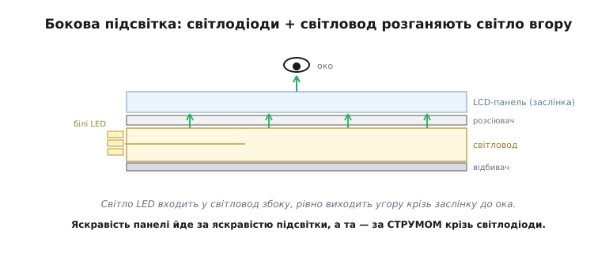
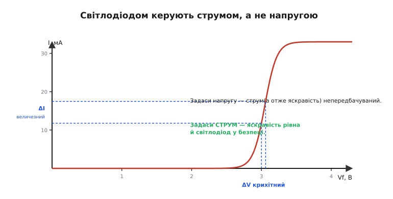
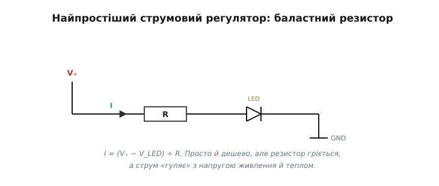
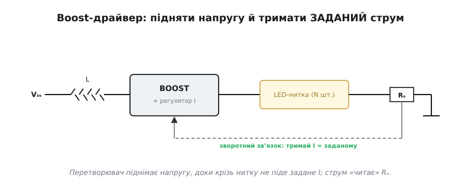
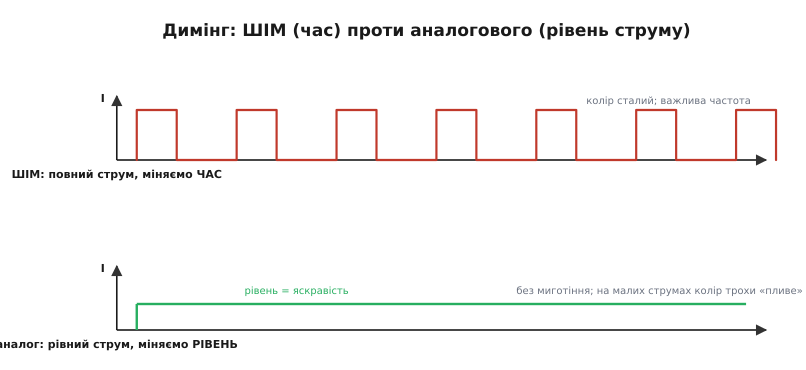
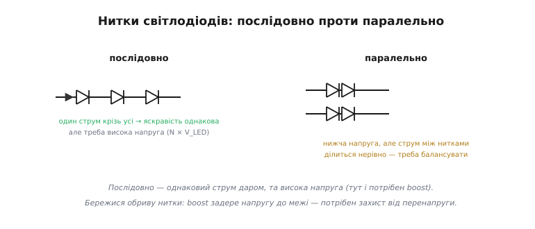

# Підсвітка

Пропускна [панель, як-от TFT-LCD](root:embedded/display-classes), сама світла не випромінює — вона лише **заслінка**, що дозує світло лампи позаду. Ця лампа, **підсвітка** (*backlight*), — аж ніяк не дрібниця наприкінці списку. Зазвичай саме вона — найбільший пожирач енергії у всьому пристрої, і саме від неї залежить, чи буде екран читабельним під лампою денного світла чи на сонці. Майже завжди підсвітка — це нитка **білих світлодіодів**, і керування ними ховає підступ, на якому спотикаються початківці: яскравість світлодіода задають **не напругою, а струмом**. Цей єдиний факт визначає всю підсистему підсвітки — від найпростішого резистора до повноцінного перетворювача, — і саме на ньому все тримається.

### Що ховається за склом: нитка білих світлодіодів

Зазирнімо за панель. Там світять білі світлодіоди, і розташувати їх можна двома способами. У **боковій** підсвітці (*edge-lit*) світлодіоди стоять уздовж краю, а спеціальна прозора пластина — **світловод** (*light guide*) — ловить їхнє світло й рівномірно розганяє його по всій площині, виводячи вгору крізь розсіювач. Так роблять майже всі тонкі екрани: світлодіодів небагато, а конструкція пласка. У **прямій** підсвітці (*direct-lit*) світлодіоди вистелені масивом просто позаду панелі — товстіше, зате яскравіше й із можливістю гасити окремі зони.

Та можливість гасити зони — не дрібниця: вимикаючи світлодіоди там, де на екрані темно, пряма підсвітка піднімає контраст і економить енергію (це й звуть локальним димінгом). Білі світлодіоди прийшли в підсвітку не одразу: донедавна екрани підсвічували тонкими **газорозрядними лампами** (CCFL, холодними катодами), що світили рівно, але потребували високовольтного перетворювача, гірше пригашувалися й боялися холоду. Світлодіоди витіснили їх скрізь — вони ощадливіші, довговічніші, вмикаються миттєво й легко димляться, — тож сьогодні «підсвітка» практично завжди означає світлодіодну.


*Бокова підсвітка в розрізі. Світло кількох білих світлодіодів входить у світловод збоку, багаторазово відбивається, рівномірно виходить угору крізь розсіювач і заслінку — до ока. Яскравість панелі йде за яскравістю підсвітки, а та — прямо за струмом крізь світлодіоди.*

Хоч як розташовані світлодіоди, головне для нас одне: яскравість панелі визначається яскравістю підсвітки, а яскравість підсвітки — **струмом** крізь світлодіоди. Звідси й проста, але невблаганна арифметика: підсвітка горить, поки горить екран, і її струм входить у енергетичний бюджет постійною статтею. Керувати цим струмом — і означає керувати і яскравістю, і споживанням дисплея.

### Світлодіодом керують струмом, а не напругою

Тепер про той підступ. Світлодіод — це діод, а отже, його [вольт-амперна характеристика](root:hw-sensing/led-photodiode) **експоненційна**: доки прикладена напруга менша за поріг, струму майже немає, а щойно її перевищено, струм злітає майже вертикально. Така крута крива має руйнівний наслідок для того, хто надумав керувати яскравістю напругою.


*Чому не напругою. На робочій ділянці характеристика майже вертикальна: зміна напруги на якісь 0.1 В міняє струм — а отже, і яскравість — у рази. Задаси напругу — струм непередбачуваний; задаси струм — яскравість рівна, а світлодіод у безпеці.*

Уявіть, що ви силкуєтеся виставити яскравість, задаючи світлодіодові напругу. Похибка в нещасні 0.1 В — а стільки «гуляє» вже від екземпляра до екземпляра — і струм подвоюється або світлодіод згоряє. Два начебто однакові світлодіоди при тій самій напрузі візьмуть геть різний струм, бо їхні характеристики трохи різняться від народження. Гірше: коли світлодіод гріється, його поріг **знижується**, тож при сталій напрузі струм сам собою росте, гріє ще дужче, поріг падає ще нижче — це **тепловий розгін** (*thermal runaway*), зачароване коло, що вбиває деталь.

Вихід один — керувати не напругою, а **струмом**. Світловий потік світлодіода майже прямо пропорційний струмові, тож, задавши струм, ви дістаєте передбачувану яскравість; а **джерело струму** само собою береже світлодіод, бо більше за задане крізь нього не пропустить, хоч би як грілася й «пливла» характеристика. Уся подальша схемотехніка підсвітки — це різні способи зробити кероване джерело струму.

Що ж таке те «джерело струму» по суті? Це схема, яка **сама підправляє** напругу на світлодіоді так, щоб струм лишався заданим, хоч би що довкола мінялося. Найпростіший варіант — той самий резистор, але він пасивний і неточний. Краще — **активний** регулятор: керований транзистор, що безперервно порівнює виміряний струм із заданим і підправляє себе, аби втримати ціль. Саме ця петля «виміряй — порівняй — підправ» лежить в основі всіх серйозних драйверів — від найдешевшого баласта до канонічного імпульсного перетворювача.

> 🔧 **Навіщо це.** Запамʼятайте раз і назавжди: світлодіод — пристрій **струмовий**. Хоч у даташиті й пишуть «пряма напруга 3.2 В», це не та величина, якою ви керуєте, а та, що сама встановиться при заданому струмі. Скрізь, де є світлодіод — підсвітка, індикатор, ліхтарик, — шукайте те, що задає йому струм; немає такого — деталь працює на удачу й довго не проживе.

### Найпростіший струмовий регулятор: баластний резистор

Найдешевший спосіб задати струм — поставити послідовно зі світлодіодом **баластний резистор** (*ballast resistor*). Він «зʼїдає» різницю між напругою живлення й напругою світлодіода, а оскільки сам по собі лінійний, ще й трохи стабілізує струм: підскочив струм — зросло падіння на резисторі — і воно ж його й осадило назад.

**Приклад (баластний резистор).** Живимо один білий світлодіод (≈ 3.2 В при 20 мА) від 5 В. Який потрібен резистор і скільки на ньому гріється?

```
R = (V₊ − V_LED) ÷ I = (5 − 3.2) ÷ 0.02   = 90 Ом
потужність на R = (5 − 3.2) × 0.02         = 36 мВт
потужність на LED = 3.2 × 0.02             = 64 мВт
```

Тобто понад третину всієї енергії розсіюється в резисторі **дарма**, на тепло. Це й перша вада баласту. Друга — струм «гуляє»: змінилася напруга живлення чи нагрівся світлодіод (а з ним зсунулась його напруга) — і струм поплив разом. Третя й найжорсткіша — резистор працює, тільки якщо живлення **вище** за напругу світлодіода; для довгої нитки, що просить більше, ніж дає батарея, він безсилий.


*Баласт: послідовний резистор R задає струм за простою формулою I = (V₊ − V_LED) ÷ R. Дешево й сердито для одного-двох світлодіодів при сталому живленні, та неощадно (гріється) і ненадійно (струм залежить від напруги й тепла).*

Тож баласт годиться для індикаторного світлодіода чи дрібної підсвітки при фіксованому живленні, але для серйозного, ощадливого до батареї екрана потрібен кращий, активний регулятор струму.

### Коли треба вище за живлення: boost-драйвер

Один білий світлодіод просить близько 3 В. А підсвітка — це часто **нитка** з кількох послідовних світлодіодів, і її сумарна напруга легко переростає живлення: шість штук — це вже ~18–20 В, тоді як батарея дає 3.7. Резистором тут не зарадиш — спершу треба **підняти** напругу. Цим займається **boost-перетворювач** (*boost converter*) із зворотним звʼязком по струму, який разом і є справжнім драйвером підсвітки.


*Boost-драйвер. Перетворювач піднімає напругу настільки, щоб крізь нитку йшов **заданий** струм; величину струму «читає» маленький резистор Rₛ і повертає в регулятор, який підправляє роботу ключа. Так живлять довгі нитки з напругою, вищою за живлення, ще й ощадливо.*

Працює це так: перетворювач піднімає напругу рівно до тієї, за якої крізь нитку тече **задане** значення струму — не більше й не менше. Щоб знати поточний струм, у коло вставляють крихітний **вимірювальний резистор** Rₛ; падіння на ньому — це сигнал струму, і регулятор безперервно підправляє роботу ключа, щоб утримати струм на цілі, хоч би як мінялися напруга нитки чи живлення. Виходить ефективне (на відміну від резистора, що грів повітря) джерело струму, здатне нагодувати довгу нитку. Це й є канонічна підсвітка сучасного приладу.

Чому саме імпульсний boost, а не простий лінійний регулятор? Бо лінійний, як і резистор, мусив би «спалити» всю зайву напругу на собі у вигляді тепла — а коли треба ще й **підняти** напругу вище за живлення, він узагалі безсилий. Імпульсний перетворювач натомість не палить різницю, а перекачує енергію порціями через котушку, тримаючи високий ККД — нерідко за 85–90 %. Для приладу на батареї це прямо означає довший час роботи: та сама яскравість коштує менше струму від акумулятора, бо менше енергії йде в тепло, а не у світло. Як саме [boost-драйвер підсвітки влаштований усередині](root:hw-power/backlight-driver) — як зворотний зв'язок тримає струм, як вибрати котушку й вимірювальний резистор, — це окрема, докладна розмова про сам цей клас мікросхем.

> 🔧 **Навіщо це.** Побачивши в схемі підсвітки котушку й мікросхему з ніжкою «FB» чи «ISET», знайте: це струмовий boost-драйвер, а не просто «подати живлення на лампу». Саме він визначає і яскравість, і ККД підсвітки, і те, як вона поводитиметься на сідаючій батареї.

### Димінг: ШІМ проти аналогового

Світити на повну потрібно не завжди — екран хочеться **пригашувати**: заради економії, заради комфорту вночі, заради автояскравості. Зробити це можна двома принципово різними шляхами, і вибір між ними прямо впливає на [мерехтіння екрана](root:hw-motion/panel-parameters).


*Угорі — **ШІМ-димінг**: струм увесь час повний, але його швидко вмикають і вимикають, а яскравість задають часткою часу (шпаруватістю). Унизу — **аналоговий**: струм рівний і безперервний, а яскравість задають самим його рівнем.*

**ШІМ-димінг** (широтно-імпульсна модуляція; *PWM, pulse-width modulation*) вмикає й вимикає **повний** струм нитки з великою частотою, а яскравість задає шпаруватістю — часткою часу у ввімкненому стані. Його велика перевага в тому, що світлодіод завжди працює або на повному струмі, або зовсім без нього, тож його колір і ефективність **не міняються** з яскравістю. Платня — мерехтіння (*flicker* — «миготіння»): якщо частота ШІМу низька, око й камера ловлять блимання, тож гнати його треба швидко (кілогерци й вище). **Аналоговий димінг** натомість міняє сам **рівень** струму — світло рівне, без жодного миготіння, але на малих струмах білий світлодіод трохи «пливе» в кольорі (бо змінюється баланс люмінофора й ефективність), та й нижче певного струму поводиться нестабільно. Тому на практиці часто беруть **гібрид**: у комфортному діапазоні димлять аналогово, а для зовсім глибокого пригашення додають швидкий ШІМ.

Чому взагалі морочитися з гібридом? Бо вимоги до **глибини** димінгу бувають жорсткі. Екран, яскравий удень, уночі має пригасати в сотні разів — інакше в темряві він сліпить. Чистого аналогового димінгу на такий діапазон не вистачає (на дуже малих струмах світлодіод гасне нерівно й міняє колір), а самий ШІМ на глибокому пригашенні дає такі куці імпульси, що мерехтіння лізе в очі навіть на пристойній частоті. Гібрид бере найкраще з обох світів: широкий, чистий діапазон без миготіння згори — і глибоке пригашення знизу.

А яка частота ШІМу — «достатньо швидка»? Тут немає магічного числа «вище за 50/60 Гц, як у кіно»: око не бачить рівного блимання вже від кількох десятків герц, але **периферійний зір і камера** ловлять його куди вище, а різкий рух очима «розмазує» імпульси в пунктир (стробоскоп). Орієнтир дає галузевий стандарт **IEEE 1789-2015** (рекомендації з модуляції струму яскравих світлодіодів): нижче ~90 Гц — зона ризику; від 90 до 1250 Гц безпека залежить від **глибини модуляції** (наскільки струм проти повного гасне); вище **1250 Гц** ШІМ вважають безпечним практично за будь-якої глибини. Звідси проста інженерна настанова: для екрана, на який дивляться зблизька й годинами, ціль ШІМу — кілогерци, а не сотні герц.

**Приклад (частота ШІМ проти миготіння).** ESP32 керує підсвіткою через ніжку EN струмового драйвера. Скільки кроків яскравості лишиться, якщо взяти безпечну частоту 5 кГц, і де межа? Апаратний модуль ШІМ (LEDC) ділить тактову частоту й розрізняє рівні розрядністю **N** біт: число рівнів = 2ᴺ, а максимальна частота при цій розрядності = f_clk ÷ 2ᴺ.

:::tabs

```cpp
// ESP32 (Arduino): ШІМ підсвітки на ніжку EN струмового драйвера.
// Компроміс: вища частота (менше миготіння) ⇒ менша розрядність (грубіші кроки).
ledcSetup(0, 5000, 11);     // канал 0, частота 5 кГц, розрядність 11 біт
ledcAttachPin(BL_EN, 0);    // EN драйвера = вихід ШІМ
ledcWrite(0, 1024);         // шпаруватість 1024/2047 ≈ 50 % яскравості
```

```python
# ESP32 (MicroPython): той самий ШІМ на ніжку EN струмового драйвера.
from machine import Pin, PWM

bl = PWM(Pin(BL_EN), freq=5000)   # 5 кГц — безпечно за IEEE 1789
bl.duty_u16(32768)                # шпаруватість 32768/65535 ≈ 50 % яскравості
```

:::

```
Перевірка: чи витягне джерело тактів 5 кГц при 11 бітах?
  рівнів яскравості = 2¹¹            = 2048   (вистачить на плавне затемнення)
  гранична частота = 80 МГц ÷ 2¹¹    ≈ 39 кГц > 5 кГц   ✓ запас великий

Якби погналися за «магічними» 60 Гц:
  60 Гц < 90 Гц ⇒ зона ризику за IEEE 1789 — видиме миготіння й смуги на відео
```

Висновок: 5 кГц лежить далеко в безпечній зоні (вище 1250 Гц) і ще лишає 2048 кроків яскравості — більше, ніж око розрізнить. Драйвер при цьому щоразу проганяє крізь нитку **повний** струм (його задає Rₛ, а не ШІМ), тож колір не пливе; ШІМ лише вмикає й вимикає цей струм. Спокуса взяти 60 Гц «бо й так не видно» — пастка: на периферії зору й на знятому відео таке миготіння вилазить одразу.

> 🔧 **Навіщо це.** Вибираючи спосіб димінгу, зважте, що важливіше для вашого виробу: сталий колір на всіх рівнях (тоді ШІМ, але швидкий) чи цілковита відсутність мерехтіння (тоді аналог, змирившись із легким зсувом кольору). Для приладу, на який дивляться годинами, мерехтіння низькочастотного ШІМу — реальна причина втоми очей, а не вигадка; цілься в кілогерци (вище 1250 Гц за IEEE 1789), а не в «достатні» 60 Гц.

### Рівномірність, тепло й захист

Лишаються три практичні турботи, без яких драйвер на папері й підсвітка в житті — різні речі. Перша — **рівномірність**. У боковій підсвітці все тримається на якості світловода: поганий — і по краях яскравіше, ніж посередині, або проступають окремі «гарячі» плями навпроти світлодіодів. А ще світлодіоди мусять світити **однаково**, тож їх вмикають **послідовною** ниткою: один струм крізь усіх — однакова яскравість. Паралельні нитки спокусливі нижчою напругою, але струм між ними ділиться нерівно (через розкид характеристик), і їх доводиться балансувати.

Сюди ж — непомітна, та важлива дрібниця: світлодіоди для підсвітки **сортують** на виробництві за яскравістю й відтінком білого (це звуть бінуванням, *binning*), бо навіть «однакові» діоди з різних партій дали б помітно різні плями. У серйозному виробі беруть світлодіоди з одного біна, щоб підсвітка була рівною і за яскравістю, і за кольором по всій площі — інакше око одразу вихопить, що один кут екрана тепліший чи яскравіший за інший.


*Послідовна нитка дає однаковий струм усім світлодіодам задарма — ціною високої напруги (тут і потрібен boost). Паралельні нитки знижують напругу, та струм ділиться між ними нерівно, тож їх треба балансувати. І стережися обриву: boost задере напругу до межі, шукаючи струм, — потрібен захист від перенапруги.*

Друга турбота — **тепло**: яскравість і строк життя світлодіода падають з нагрівом, тож і сам струм, і відведення тепла треба тримати в межах даташита. Третя — **захист**. Boost-драйвер, наткнувшись на **обрив** нитки (перегорів один світлодіод), у відчайдушних спробах проштовхнути струм задере напругу до максимуму — і без обмежувача перенапруги може попалити сам себе чи обвʼязку. Тому добрі драйвери мають захист від обриву (перенапруги), короткого замикання й перегріву. Це те, що відрізняє схему, яка працює на столі, від тієї, що виживе в полі.

Ці турботи звучать дрібно — аж доки не вилазять у серії. Перегрітий чи перевантажений струмом світлодіод не гасне відразу: він **тьмяніє** роками швидше за розрахунок, і екран, що торік сяяв, стає блідим. Тому досвідчений розробник свідомо **недовантажує** підсвітку — бере струм трохи нижчий за гранично допустимий і дбає про тепловідвід, виторговуючи дрібку яскравості сьогодні на роки рівного світла завтра. Підсвітка, зрештою, — це деталь, що працює без упину весь строк життя виробу, і ставитися до неї варто як до силового вузла, а не як до «лампочки».

Отак за непримітним склом ховається ціла силова підсистема, і керує нею один закон — **струм, а не напруга**, від копійчаного баласта до розумного boost-драйвера. Підсвітка — остання ланка тієї частини дисплея, що **показує**: від фізики пікселя до лампи, що його підсвічує. А ось як те саме скло вміє не лише показувати, а й **відчувати** [дотик пальця](root:hw-motion/touch-tech), — це вже інша підсистема, зі своєю фізикою.

---
