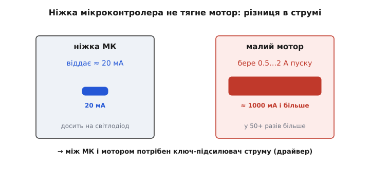
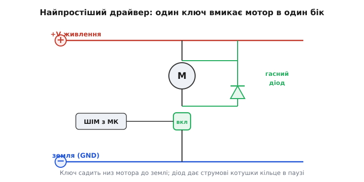
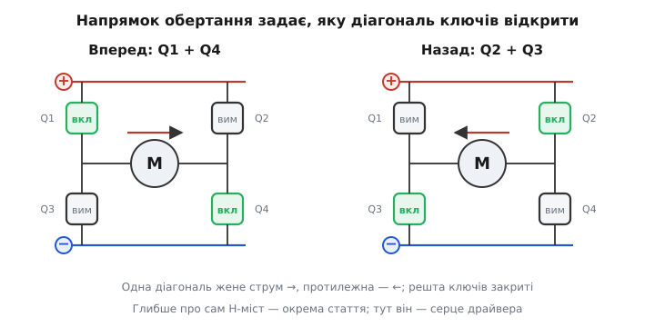
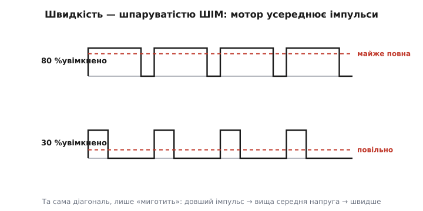
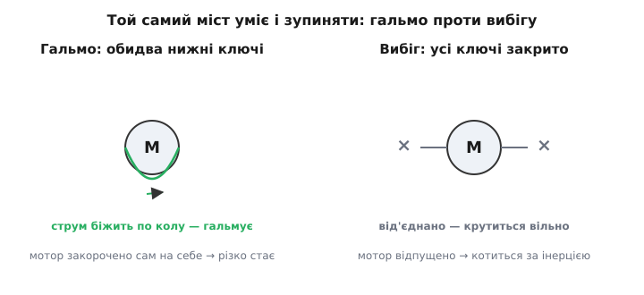

# Драйвер DC-моторів

Між мікроконтролером і моторчиком завжди стоїть окрема схема — **драйвер** (англ. *driver*, «той, що жене»). Без неї ніяк, і причина суто фізична: ніжка мікроконтролера віддає мізерний струм, а навіть найменший мотор просить у десятки разів більше. Драйвер — це посередник, що бере слабку команду «крути» і перетворює її на сильний струм в обмотці; принагідно він уміє ще й обертати мотор в обидва боки, плавно міняти швидкість і різко гальмувати. Розберімо, з чого ця схема складається й чому саме так.

### Чому ніжка МК не крутить мотор напряму

Почнімо з найголовнішого — зі **струму**. Вихід мікроконтролера задуманий керувати логікою, а не качати потужність: типова ніжка віддає десь до 20 мА, і це її межа. Спробуйте підключити мотор прямо до ніжки — і станеться одне з двох: або мотор навіть не зрушить, бо такого струму йому смішно мало, або, що гірше, він спробує взяти своє, перевантажить вихід і спалить порт.


*Ніжка мікроконтролера віддає близько 20 мА — досить хіба на світлодіод. Навіть малий мотор у момент пуску бере півампера-два, у десятки разів більше. Прямого з'єднання тут бути не може — потрібен ключ-підсилювач струму.*

Скільки ж бере мотор? Найбільше — у першу мить, поки він ще не розкрутився. Доки ротор стоїть, обмотка — це просто шматок мідного дроту з крихітним опором, і струм визначає лише закон Ома: I = U / R. При живленні 6 В і опорі обмотки 1 Ом це аж 6 А — **пусковий струм** *(stall current)*, у сотні разів більший за все, що бачила ніжка МК. Коли ротор розкрутиться, він сам починає наводити зустрічну напругу (її звуть протиЕРС), струм спадає до робочих десятих ампера — але стартовий кидок треба пережити щоразу. Висновок неминучий: між командою й мотором мусить стояти підсилювач струму. Ним і є драйвер.

### Ключ як найпростіший драйвер

Найпростіший драйвер — один **ключ**. Ідея та сама, що в будь-якому силовому вмиканні: мікроконтролер своїм слабким сигналом лише прочиняє «ворота», крізь які тече сильний струм від окремого живлення, а не з ніжки. Такими воротами служить силовий транзистор, найчастіше MOSFET: на його затвор іде керування з МК, а сам він пропускає ампери мотора.

> 🔌 **Що під цим.** Ключ нижнього плеча: мотор вішають між «плюсом» і стоком MOSFET, витік — на землю, затвор — від ніжки МК через невеликий резистор, плюс підтяжка затвора донизу (щоб у спокої було гарантовано вимкнено). Високий рівень на затворі відкриває канал — струм тече крізь мотор; низький закриває. Опір відкритого каналу крихітний, тож ключ майже не гріється навіть на амперах. Подробиці схеми, вибору MOSFET і граблі — у статті [«MOSFET як силовий ключ»](topic:hw-components/mosfet-power-switch).


*Найпростіший драйвер: ключ садить нижній кінець мотора до землі, і струм тече. Паралельно мотору — гасний діод (катодом до «плюса»): без нього накопичений в обмотці струм у мить вимикання пробив би ключ.*

Такий одноклавішний драйвер уже корисний: ним вмикають вентилятор, помпу, вібромоторчик — усе, що крутиться **в один бік** і де швидкість або не важлива, або задається швидким миготінням ключа. Але є дві речі, яких один ключ не вміє: він не оберне мотор назад і — якщо про це не подбати — не переживе власного вимикання. Розгляньмо обидві; почнімо з виживання, бо воно стосується **будь-якого** драйвера мотора, навіть найпростішого.

### Чому мотору потрібен гасний діод

Мотор — це передусім **котушка** (обмотка на залізному осерді), а в котушки є вперта властивість: вона тримається за свій струм і не дає йому урватися миттєво. Поки ключ відкритий, крізь обмотку тече, скажімо, ампер. Закриваємо ключ — і котушка опиняється в розпачі: струмові раптом нема куди текти, а спинитися враз він не може. Фізика тут жорстка: напруга на котушці дорівнює швидкості зміни струму, помноженій на індуктивність,

```
U = L · (ΔI / Δt)
```

і якщо обірвати струм майже миттєво (Δt → 0), напруга злітає до сотень вольт. Цей гострий стрибок — той самий [руйнівний «брик» індуктивності](topic:hw-components/inductor-kickback) — б'є по транзистору й пробиває його. Спалити свіжозібраний драйвер у першу ж секунду — класична халепа саме через це.

Рятунок простий і обов'язковий — **гасний діод** *(flyback diode, від англ. «зворотний політ»)* паралельно мотору, катодом до «плюса». Поки ключ відкритий, діод закритий і нічого не робить. А щойно ключ закрився і котушка задерла напругу, діод відкривається й дає накопиченому струмові кільце, по якому той спокійно добігає й згасає, замість того щоб пробивати ключ.

> 🔧 **Навіщо це.** Гасний діод на індуктивному навантаженні — не порада, а закон. Будь-який мотор, реле чи соленоїд при вимиканні «брикається» викидом напруги; діод (або інша гасна ланка) забирає цей викид на себе. Пропустиш його — і драйвер раніше чи пізніше згорить, найчастіше саме в мить вимикання, а не під навантаженням. Тому в кожному драйвері мотора діоди присутні завжди — окремими деталями або вже вбудовані в мікросхему.

### H-міст: щоб крутити в обидва боки

Тепер до другої проблеми — **напрямку**. У мотора постійного струму властивість проста: у який бік крізь нього тече струм, у той бік він і крутиться. Щоб обернути його назад, треба пустити струм у зворотний бік, тобто фактично поміняти місцями два його дроти. Один ключ цього не вміє — він лише перекриває струм, а перевернути не може.

Можна було б перемикати дроти [реле](topic:hw-motion/relay-driver), та механічне реле повільне, зношується й не дасть плавно керувати швидкістю. Електронна відповідь елегантніша: оточити мотор **чотирма** ключами так, щоб самими ключами обирати, куди тече струм. Ця схема — **H-міст** *(H-bridge)*, бо на схемі чотири ключі навколо мотора-перекладини справді складаються в літеру H. Це найважливіша схема всієї електроніки руху.


*Два верхні ключі тягнуть кінці мотора до «плюса», два нижні — до землі. Відкрита діагональ Q1+Q4 жене струм зліва направо — мотор крутиться вперед; протилежна діагональ Q2+Q3 жене струм назад. Напрямок обертання обирають тим, яку діагональ відкрити.*

Уся хитрість — у тому, **які** ключі відкривати разом. Щоб мотор закрутився, один його кінець треба з'єднати з «плюсом», а інший — із землею. Це робить **діагональна** пара: відкрили верхній лівий і нижній правий (Q1+Q4) — струм біжить крізь мотор в один бік; відкрили протилежну діагональ (Q2+Q3) — струм біжить назад. Жодних механічних перемикань: реверс — це просто вибір діагоналі.

> 🔌 **Серце драйвера.** H-міст — це два «півмости» (верхній + нижній ключ зі спільною точкою до мотора), і саме він дає реверс. Залізне правило: **ніколи не відкривати верхній і нижній ключ одного боку разом** — це з'єднало б «плюс» із землею навпростець крізь два ключі, миттєве коротке (наскрізний струм), що палить міст за мить. Тому при кожному перемиканні лишають **мертвий час** — коротку паузу, коли обидва ключі боку гарантовано закриті. Як міст влаштований усередині, чому MOSFET, як працює мертвий час і чому верхній ключ — окремий клопіт — у статті [«H-міст: чотири ключі, щоб крутити мотор в обидва боки»](topic:hw-motion/h-bridge).

У H-мості про гасні діоди можна не дбати окремо: чотири вбудовані в самі MOSFET діоди (між витоком і стоком) уже утворюють для індуктивного струму замкнене кільце. Тож той самий захист, що ми навмисне додавали до одного ключа, у мості з'являється сам собою — ще одна причина, чому драйвери реверсу будують саме мостом.

### Швидкість — широтно-імпульсним керуванням

Напрямок розв'язано; лишається **швидкість**. Перша спокуса — просто подавати на мотор меншу напругу, коли треба повільніше. Так роблять, але «придушити» напругу лінійно означало б розсіяти надлишок у тепло на якомусь елементі — гаряче й марнотратно: щоб крутити мотор удвічі повільніше, довелося б половину потужності спалити на регуляторі.

Розумніший шлях — **широтно-імпульсне керування** *(pulse-width modulation, ШІМ)*. Замість того щоб тримати ключ напіввідкритим, його швидко й повністю вмикають-вимикають, тисячі разів за секунду, і міняють лише **частку** часу, коли він відкритий. Цю частку звуть **шпаруватістю** *(duty cycle)*: 80 % — мотор майже на повну, 30 % — повільно.


*Та сама діагональ моста не тримається відкритою, а «миготить». Що довший увімкнений імпульс у періоді, то вища середня напруга на моторі (червоний пунктир) і то швидше він крутиться. Мотор зі своєю інерцією усереднює окремі імпульси в рівне обертання.*

Чому це працює без ривків? Бо мотор зі своєю механічною інерцією й електричною індуктивністю сам **усереднює** імпульси: він фізично не встигає реагувати на кожне вмикання за мікросекунди, а відчуває лише середнє. Середня ж напруга прямо пропорційна шпаруватості,

```
U_сер = U_живл · D          (D — шпаруватість, 0…1)
```

тож, керуючи однією цифрою D у прошивці, ми плавно ведемо швидкість від нуля до повної. І найкраще — ключ при цьому майже не гріється: він завжди або повністю відкритий (крихітний [опір Rds(on)](topic:hw-components/rds-on), мало тепла), або повністю закритий (струму нема). Холодно й ефективно — на відміну від спалювання надлишку в лінійному регуляторі.

> 🔧 **Навіщо це.** Запам'ятайте поділ ролей у драйвері: **напрямок задає вибір діагоналі моста, а швидкість — шпаруватість ШІМ.** Це дві незалежні «ручки»: одна каже «куди», друга — «як швидко». Майже всі мікроконтролери вміють генерувати ШІМ апаратно, тож від прошивки треба лише задати число шпаруватості, а биття імпульсів процесор бере на себе.

### Гальмо й вибіг

H-міст уміє не лише крутити, а й **зупиняти** — причому двома різними способами, і різницю варто відчувати.


*Гальмо: відкрити обидва нижні ключі — мотор закорочено сам на себе, і його власна інерція жене струм по колу, який різко гальмує ротор. Вибіг: усі ключі закрити — мотор від'єднано, він докочується за інерцією.*

**Вибіг** *(coast)* — найпростіше: закрити всі чотири ключі. Мотор від'єднаний від усього й вільно докочується до зупинки за інерцією, як машина на нейтралці. **Гальмо** *(brake)* — навпаки: відкрити обидва **нижні** ключі разом, закоротивши кінці мотора між собою. Чому це гальмує? Бо мотор, що обертається за інерцією, сам стає **генератором** — наводить напругу. Закоротивши його, ми пускаємо цей наведений струм по колу, і він гальмує ротор, як магнітне гальмо. Те саме «рекуперативне» гальмування (лат. *recuperatio* — повернення) в електромобілях віддає енергію назад у батарею.

Зверніть увагу: гальмо — це знову **нижні** ключі обох боків разом, а не один бік. Відкрити верхній і нижній ключ **одного** боку — це вже не гальмо, а наскрізне коротке, що палить міст. Тому повний набір команд драйвера такий: вперед і назад (дві діагоналі), гальмо (обидва нижні), вибіг (усі закрито) — і одна заборонена комбінація, якої не можна ніколи.

### Половинний міст і повний міст

Наостанок — корисне розрізнення, на яке натрапляють у даташитах. **Повний міст** *(full bridge)* — це весь H-міст із чотирьох ключів: він дає реверс, бо вміє перевернути струм крізь мотор. **Половинний міст** *(half bridge)* — лише один бік, верхній плюс нижній ключ зі спільною точкою. Половинний міст уміє тягнути свій вихід то до «плюса», то до землі (а отже й ШІМ-ити), але **обернути** мотор не може: для реверсу потрібні два кінці, якими можна мінятися, а в половинного — лише один керований вихід.

Звідси проста підказка, що брати під задачу. Крутиться **в один бік** зі змінною швидкістю (вентилятор, помпа) — досить половинного моста або навіть одного ключа з гасним діодом. Треба **реверс** (колеса робота, каретка принтера, заслінка) — потрібен повний міст. А якщо моторів кілька й усім потрібен реверс — беруть мікросхему з кількома повними мостами всередині. До речі, повний H-міст — це рівно **два** половинні, тож, навчившись думати півмостами, ви легко складаєте з них будь-що: один півміст жене один кінець мотора, другий — другий, а їхня різниця і є напругою на моторі.

### Зберімо приклад докупи

Хай треба з 5-вольтового мікроконтролера крутити **мотор 6 В у обидва боки** зі змінною швидкістю. Беремо поширену мікросхему повного H-моста (вона вже містить чотири ключі, гасні діоди й захист від наскрізного струму) і керуємо нею двома сигналами IN1/IN2 на той самий мотор. У таких мікросхем обидва входи приймають ШІМ, і весь набір команд складається з чотирьох комбінацій:

**Дано:** мотор 6 В, опір обмотки R ≈ 1 Ом, два керівні входи IN1, IN2 на цей мотор, обидва вміють ШІМ.

```
1) пусковий струм:  I_stall = U / R = 6 / 1 = 6 А   ← міст і живлення мають його витримати
2) робочий струм:   після розгону спадає до ~0.3…0.5 А (протиЕРС)
3) керування входами (ШІМ — миготливий сигнал швидкості, 1 — постійний високий, 0 — низький):
       вперед:   IN1 = ШІМ,  IN2 = 0
       назад:    IN1 = 0,    IN2 = ШІМ
       гальмо:   IN1 = 1,    IN2 = 1     (мотор закорочено сам на себе — різко стає)
       вибіг:    IN1 = 0,    IN2 = 0     (відпущено)
4) швидкість: шпаруватість ШІМ 0…100 % на «активному» вході
```

Зверніть увагу на красу схеми керування: напрямок задає те, **на який** із двох входів подати миготливий ШІМ, а швидкість — його шпаруватість; гальмо й вибіг — це дві сталі комбінації без ШІМ узагалі. А ось коротка, але реальна прошивка під таку мікросхему — обидва входи заведено на апаратні ШІМ-канали, а функція задає напрямок і швидкість одним викликом (швидкість зі знаком: плюс — уперед, мінус — назад):

:::tabs
```c
// Драйвер DC-мотора через H-міст (тип TB6612/DRV8833): два ШІМ-входи на мотор.
// speed: -255..+255 (знак = напрямок, модуль = шпаруватість).
#define PWM_CH_IN1  0      // апаратний ШІМ-канал входу IN1
#define PWM_CH_IN2  1      // апаратний ШІМ-канал входу IN2

void motor_drive(int speed) {
    if (speed > 255)  speed = 255;          // обрізаємо до діапазону
    if (speed < -255) speed = -255;

    int duty = speed < 0 ? -speed : speed;  // модуль = шпаруватість

    if (speed > 0) {                        // уперед: ШІМ на IN1, IN2 мовчить
        ledcWrite(PWM_CH_IN1, duty);
        ledcWrite(PWM_CH_IN2, 0);
    } else if (speed < 0) {                 // назад: навпаки
        ledcWrite(PWM_CH_IN1, 0);
        ledcWrite(PWM_CH_IN2, duty);
    } else {                                // 0 → вибіг (обидва входи в нулі)
        ledcWrite(PWM_CH_IN1, 0);
        ledcWrite(PWM_CH_IN2, 0);
    }
}

void motor_brake(void) {                    // різке гальмо: обидва входи високі
    ledcWrite(PWM_CH_IN1, 255);             // → мотор закорочено всередині моста
    ledcWrite(PWM_CH_IN2, 255);
}
```
```micropython
# Драйвер DC-мотора через H-міст (тип TB6612/DRV8833): два ШІМ-входи на мотор.
# speed: -255..+255 (знак = напрямок, модуль = шпаруватість).
from machine import Pin, PWM

in1 = PWM(Pin(0), freq=20000)              # апаратний ШІМ на вході IN1
in2 = PWM(Pin(1), freq=20000)             # апаратний ШІМ на вході IN2

def _duty(x):                              # 0..255 → 16-бітна шпаруватість
    return (x * 65535) // 255

def motor_drive(speed):
    speed = max(-255, min(255, speed))     # обрізаємо до діапазону
    duty = abs(speed)                      # модуль = шпаруватість

    if speed > 0:                          # уперед: ШІМ на IN1, IN2 мовчить
        in1.duty_u16(_duty(duty))
        in2.duty_u16(0)
    elif speed < 0:                        # назад: навпаки
        in1.duty_u16(0)
        in2.duty_u16(_duty(duty))
    else:                                  # 0 → вибіг (обидва входи в нулі)
        in1.duty_u16(0)
        in2.duty_u16(0)

def motor_brake():                         # різке гальмо: обидва входи високі
    in1.duty_u16(65535)                    # → мотор закорочено всередині моста
    in2.duty_u16(65535)
```
```python
# Драйвер DC-мотора через H-міст (тип TB6612/DRV8833): два ШІМ-входи на мотор.
# speed: -255..+255 (знак = напрямок, модуль = шпаруватість).
# Raspberry Pi, апаратний ШІМ на двох ніжках через gpiozero.
from gpiozero import PWMOutputDevice

in1 = PWMOutputDevice(17, frequency=20000)  # ШІМ на вході IN1
in2 = PWMOutputDevice(18, frequency=20000)  # ШІМ на вході IN2

def motor_drive(speed):
    speed = max(-255, min(255, speed))      # обрізаємо до діапазону
    duty = abs(speed) / 255                 # модуль = шпаруватість (0..1)

    if speed > 0:                           # уперед: ШІМ на IN1, IN2 мовчить
        in1.value = duty
        in2.value = 0.0
    elif speed < 0:                         # назад: навпаки
        in1.value = 0.0
        in2.value = duty
    else:                                   # 0 → вибіг (обидва входи в нулі)
        in1.value = 0.0
        in2.value = 0.0

def motor_brake():                          # різке гальмо: обидва входи високі
    in1.value = 1.0                         # → мотор закорочено всередині моста
    in2.value = 1.0
```
:::

Уся прошивка драйвера, по суті, зводиться до цього: вибрати, на який вхід подати ШІМ (напрямок), і виставити шпаруватість (швидкість). Биття ШІМ-імпульсів робить апаратний таймер, мертвий час і гасні діоди ховає мікросхема-міст, а пусковий струм у 6 А пережити допомагає те, що ключі холодні. Тому на практиці драйвер мотора рідко паяють із голих транзисторів — беруть готову мікросхему, що ховає всі ці тонкощі, і керують нею кількома лініями GPIO.

### Що лишилося в руках

Драйвер DC-мотора — це ланцюжок із кількох простих причин. Ніжка МК не тягне ампери — **тому** потрібен ключ-підсилювач струму. Мотор-котушка «брикається» при вимиканні — **тому** обов'язковий гасний діод. Один ключ не обертає назад — **тому** беруть H-міст і задають напрямок діагоналлю. Лінійне зниження напруги грілося б — **тому** швидкість ведуть ШІМ-ом. А той самий міст принагідно дає ще й гальмо (закоротити мотор) та вибіг (відпустити). Складіть це разом — і ви тримаєте керування будь-якою рухомою технікою: від іграшкового моторчика до приводів робота. А коли мотор не звичайний колекторний, а трифазний безколекторний чи кроковий, драйвер виростає з тих самих цеглинок — півмостів із холодними ключами, лише в більшій кількості.
