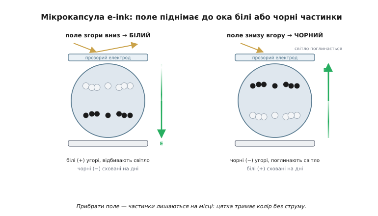

# E-ink дисплей

Майже всі екрани навколо світяться самі: [пропускний TFT-LCD](topic:hw-motion/tft) дозує світло лампи позаду, OLED народжує його прямо в пікселі. E-ink не робить ні того, ні іншого — він узагалі не має власного світла. Він **відбиває те, що довкола**, точно як аркуш паперу, і саме тому при денному світлі його легко сплутати з друком. А якщо вимкнути живлення, картинка нікуди не дінеться: цінник на полиці магазину роками показує цифру від крихітної батарейки, знеструмлена читалка застигає на сторінці. Дві ці риси — паперовий вигляд і пам'ять без струму — виростають з одного фізичного рішення, несхожого ні на яке інше у світі дисплеїв. Варто розібрати, як улаштована одна керована цятка такого екрана, бо з неї випливає геть усе: і чому він читається на сонці, і чому оновлюється повільно, і чому тримає зображення мертвим.

### Звідки взялося «електронне чорнило»

Назва e-ink — це скорочення від англійського *electronic ink*, «електронне чорнило»; ширша назва технології — *e-paper*, «електронний папір». Обидві влучні: ідея була не зробити ще один світний екран, а зробити **кероване чорнило** — таке, що лежить на підкладці, як друкарська фарба, відбиває світло, як фарба, але вміє перемальовуватися за командою. Звідси й увесь подальший характер пристрою. Якщо звичайний дисплей бере за відправну точку джерело світла, то e-ink бере за відправну точку **порошинку пігменту** — ту саму, з якої роблять чорнило, — і вчиться нею керувати.

Як саме нею керувати — підказала фізика, відома задовго до дисплеїв. Дрібна заряджена частинка в рідині рухається, якщо до рідини прикласти електричне поле: поле тягне заряд, а заряд тягне за собою частинку. Це явище зветься **електрофорез** (*electrophoresis*, від грец. *phorēsis* — «перенесення», бо поле переносить частинки крізь рідину). Уся технологія e-ink — це електрофорез, посаджений у мікроскопічну комірку й поставлений на службу зображенню; тому її точна назва — **електрофоретичний дисплей** (*electrophoretic display*).

### Мікрокапсула: керована цятка зблизька

Уявімо мільйони крихітних прозорих кульок — **мікрокапсул** (*microcapsule*), кожна завбільшки приблизно з товщину людської волосини. Усередині кожної — каламутна рідина, а в ній плавають дрібні частинки пігменту двох сортів: **білі** й **чорні**. Хитрість у тому, що частинки заряджені, причому протилежно: білі несуть, скажімо, додатний заряд, чорні — від'ємний. Один і той самий шар капсул розстеляють суцільною плівкою на підкладці, а зверху й знизу затискають прозорими електродами — і виходить екран.

Тепер прикладемо до капсули електричне поле згори вниз. Воно потягне додатні білі частинки до **верхнього**, прозорого електрода — туди, звідки на капсулу падає світло й звідки дивиться око. Білі частинки спливуть до поверхні, відіб'ють світло назад — і цятка стане **білою**. Чорні тим часом, маючи протилежний заряд, підуть полем у зворотний бік, осядуть на дно й сховаються під білими. Перевернемо поле — і все стане навпаки: нагору, до ока, вийдуть чорні частинки, поглинуть світло, а білі зануряться вниз; цятка **почорніє**. Одне й те саме поле розводить два сорти частинок по різні краї капсули саме тому, що заряди в них протилежні — у цьому весь фокус.



*Одна цятка екрана. Ліворуч поле спрямоване так, що додатні білі частинки спливли до прозорого верхнього електрода — капсула відбиває падаюче світло й виглядає білою, а чорні сховались на дні. Праворуч поле перевернули: нагору вийшли від'ємні чорні, вони поглинають світло, і цятка чорніє. Прибрати поле — і частинки лишаться там, де стали.*

Так влаштована **мікрокапсульна** конструкція — найпоширеніша. Є й рідня: замість окремих кульок рідину з пігментом заливають у крихітні комірки-«чашки» з перегородками й запечатують зверху плівкою. Цю конструкцію називають **Microcup** (англ. *cup* — «чашка»); вона зручніша, коли частинок не два сорти, а більше — наприклад, у кольорових панелях із трьома-чотирма пігментами, де капсулу важче начинити багатьма сортами рівномірно. Принцип той самий електрофорез; різниця лише в тому, як саме порцію чорнила ізолюють у комірку.

### Чому картинка тримається без струму

Тепер найважливіше, чого не вміє жоден світний екран. Прибравши поле, ми не повертаємо частинки на місце — вони **лишаються там, де щойно стали**. Біла частинка, що спливла до поверхні, так і тримається біля стінки капсули слабкими силами поверхневого зчеплення; жодного струму, щоб її там утримувати, не треба. Обидва крайні стани цятки — «білий нагорі» і «чорний нагорі» — стійкі самі собою. Така властивість зветься **бістабільністю** (*bistable*, від лат. *bi-* — «двічі» і *stabilis* — «стійкий»: дві стійкі точки рівноваги).

Наслідок прямий і разючий: енергія потрібна лише в **мить зміни** картинки, поки поле жене частинки. Щойно вони стали — поле знімають, і екран тримає зображення сам, **без жодного живлення**, хоч роками. Це повна протилежність [пропускному TFT-LCD](topic:hw-motion/tft), де рідкий кристал сам напругу не тримає й картинку доводиться безперервно освіжати десятки разів на секунду, а [підсвітка](topic:hw-motion/backlight-dimming) горить увесь час, поки екран увімкнено. У e-ink між оновленнями споживання — практично **нуль**.

> 🔧 **Навіщо це.** Саме бістабільність робить e-ink єдиним розумним вибором для пристроїв, що **рідко** міняють картинку й мусять жити **довго** від маленької батарейки: цінники на полицях, дверні таблички, кімнатні датчики з показом раз на хвилину, бейджі, читалки. Такий пристрій спить між оновленнями на нулі й прокидається лише на коротку мить перемалювання. Якщо ж екран має показувати щось, що рухається безперервно, ця головна перевага зникає — і тоді e-ink не ваш вибір.

### Дзеркальний піксель: чому він читається на сонці

Друга корінна риса — те, що e-ink **відбивний** (*reflective*). Власного світла він не має зовсім і користується навколишнім, точно як папір. Звідси випливає поведінка, дзеркальна до світних екранів. Що яскравіше навколо, то **краще** видно e-ink: на прямому сонці, де [TFT](topic:hw-motion/tft) і OLED сліпнуть від бліків і власного світла їм бракує, щоб перебити сонячне, e-ink сяє відбитим світлом і читається бездоганно. І навпаки — у темряві без жодного зовнішнього світла e-ink не видно зовсім, бо відбивати йому нема чого; тут йому потрібне підсвічування збоку, а не лампа позаду.

Чому ж він настільки схожий на папір, що зблизька його легко сплутати з друком? Бо він, як і папір, відбиває світло **розсіяно**, на всі боки, а не дзеркально. Білі частинки пігменту розкидають промені навсібіч, тож на екрані немає ні власного сяйва, ні дзеркального полиску підсвіченого скла. Око не ловить бліків від лампи й не дивиться «в ліхтарик», тож від e-ink очі втомлюються куди менше, ніж від світного дисплея, — це і є та сама причина, чому на читалці комфортно читати годинами.

### Сіра шкала: не лише чорне й біле

Поки що цятка вміла два стани — повністю біла й повністю чорна. Але між ними є простір. Якщо підняти до поверхні **не всі** білі частинки, а лише частину, цятка відіб'є менше світла й виглядатиме **сірою** — тим темнішою, чим менше білого нагорі. Так e-ink дістає градації сірого: різні відтінки — це різна частка частинок, виведених до ока.

Керувати цією часткою непросто — частинку треба зупинити **на півдорозі**, у проміжному стані, а не просто перегнати від краю до краю. Це коштує довшої й тоншої послідовності керувальних імпульсів напруги (її звуть **хвилеформою**), бо проміжне положення нестійке й вимагає точного дозування поштовхів. Тому багатоградаційний e-ink оновлюється помітно повільніше за простий чорно-білий, а кількість надійно відтворних відтінків невелика — типово шістнадцять рівнів сірого. Сама механіка цих хвилеформ і таблиць, з яких їх беруть, — це вже [пристрій оновлення e-ink](topic:hw-motion/eink-refresh); тут досить розуміти, що сірий — це **дозована** частка піднятого пігменту.

### Платня: повільність і привиди

За паперовий вигляд і пам'ять без струму e-ink бере плату, і її варто знати наперед. Перша частина плати — **повільність**. Тверда частинка пігменту мусить фізично проплисти крізь в'язку рідину з одного краю капсули на інший, а це на порядки повільніше за поворот молекули в рідкому кристалі чи спалах світлодіода. Оновлення триває не мікросекунди, а **частки секунди**, а то й секунди. І повільність ця не випадкова: вона — зворотний бік самої бістабільності. Те, що тримає картинку без енергії, — це небажання частинок рухатися; а небажання рухатися — це і є повільність. Одне нерозривно випливає з іншого, тож «швидкий бістабільний e-ink» — це суперечність у термінах.

Друга частина плати — **привиди** (*ghosting*, від англ. *ghost* — «привид»): бліде залишкове зображення попереднього кадру, що проступає крізь новий. Коли частинки переганяють швидко й не до кінця, вони не сідають ідеально, і слід старого стану лишається — спершу непомітний, та з кожним оновленням він міцнішає. Лікують його періодичним повним «промиванням» екрана — кілька разів перекидають усі цятки чорне-біле-чорне-біле, аж поки сліди не зітруться; саме це блимання видно в читалці, коли вона гортає сторінку. Чому привид виникає й як його приборкують хвилеформами та повними оновленнями — докладно розбирає [пристрій оновлення e-ink](topic:hw-motion/eink-refresh); для розуміння самого приладу досить знати, що привид — неминуча плата за те, що картинка тримається без струму.

### Кольоровий e-ink

Базова плівка чорно-біла, бо в капсулі два сорти частинок. Колір додають двома різними шляхами, і їх варто розрізняти, бо вони дають геть різний результат.

Перший шлях — накласти поверх чорно-білої плівки **масив кольорових фільтрів** (*color filter array*, **CFA**): дрібну сітку червоних, зелених і синіх віконець, по одному над кожним підпікселем. Біле світло, що його відбиває плівка, проходить крізь фільтр і фарбується; змішуючи сусідні кольорові підпікселі, око бачить відтінок. Шлях простий і дає швидке оновлення, але має вроджену ваду: фільтр **викидає** більшу частину світла (кожне віконце пропускає лише свою смугу спектра), тож картинка виходить помітно **тьмянішою** й приглушенішою, ніж чорно-білий e-ink, а роздільність кольору падає. На цьому принципі побудована, зокрема, родина E Ink Kaleido.

Другий шлях — обійтися **без** фільтра й покласти в кожну комірку відразу кілька сортів кольорових частинок: типово блакитні, пурпурові, жовті й білі. Тоді кожна цятка сама, своїм пігментом, дає повний колір, а світло ні в якому фільтрі не гасне, тож картинка яскравіша й насиченіша. Платня — ще більша **повільність**: розсортувати полем чотири сорти частинок у потрібні позиції набагато складніше, ніж два, тож хвилеформа виходить довга, а повне кольорове оновлення триває помітно довше за чорно-біле. На цьому принципі побудована родина E Ink Gallery (технологія ACeP). Загальне правило просте: що більше сортів частинок треба розвести полем, то багатша палітра — і то повільніший екран.

> 🔧 **Навіщо це.** Обираючи кольоровий e-ink, чітко вирішіть, що для виробу важливіше. Потрібні живі кольори (репродукції, обкладинки) і не шкода швидкості — дивіться в бік багатопігментних панелей. Потрібні текст і прості кольорові акценти при пристойній швидкості — фільтровий CFA-варіант буде дешевший і жвавіший, але змиріться з тьмяністю. І не обіцяйте замовникові «яскравий і швидкий кольоровий e-ink» — фізика частинок такого поєднання поки не дає.

### Worked example: бюджет енергії статичного цінника

Найкраще цінність бістабільності видно на числах. Порівняймо два невеликі екрани однакового розміру, що показують майже незмінну інформацію й оновлюються раз на хвилину: e-ink і [TFT-LCD з підсвіткою](topic:hw-motion/backlight-dimming). Енергія за хвилину — це активна потужність, помножена на час, у який вона тече. У TFT підсвітка горить **усю** хвилину; у e-ink активний лише короткий пік оновлення, решту часу — нуль. Оцінка лягає в кілька рядків прошивки:

```c
// груба, але типова за порядком оцінка енергії за один 60-секундний цикл
float energy_per_minute_J(float p_active_mW, float active_s) {
    return p_active_mW * 1e-3f * active_s;          // мВт→Вт, Вт·с = Дж
}

float e_tft  = energy_per_minute_J(120.0f, 60.0f); // підсвітка горить весь час = 7.20 Дж
float e_eink = energy_per_minute_J( 30.0f,  1.0f); // лише пік оновлення, далі 0 = 0.03 Дж
float ratio  = e_tft / e_eink;                     // = 7.20 / 0.03 = 240
```

За одну хвилину різниця у **240 разів** здається дрібницею в джоулях. Але помножена на дні автономної роботи, саме вона вирішує, що датчик житиме від однієї батарейки тиждень чи кілька років. Ось чому фізику пікселя варто тримати в голові ще на етапі задуму виробу: для приладу, що показує статичну інформацію й живиться від батареї, відбивний бістабільний екран — це не косметичний вибір, а різниця між «працює рік» і «сідає за тиждень».

### Що лишається запам'ятати

E-ink відрізняється від решти дисплеїв одним коренем: він керує не світлом і не зарядом, а **речовиною** — заряджені порошинки пігменту, що повзуть полем у грузлій рідині мікрокапсули. З цього кореня випливає все. Він **відбивний**, тож читається на сонці й схожий на папір. Він **бістабільний**, тож тримає картинку без струму й живе роками від батарейки. І він **повільний**, з привидами та вередами, бо речовина рухається мляво й має пам'ять — це неминуча зворотна сторона його ж переваг. Саме з таким набором компромісів e-ink і лягає на шальку терезів поряд із [рештою класів дисплеїв](root:embedded/display-classes), коли доходить до вибору екрана під конкретний виріб.
