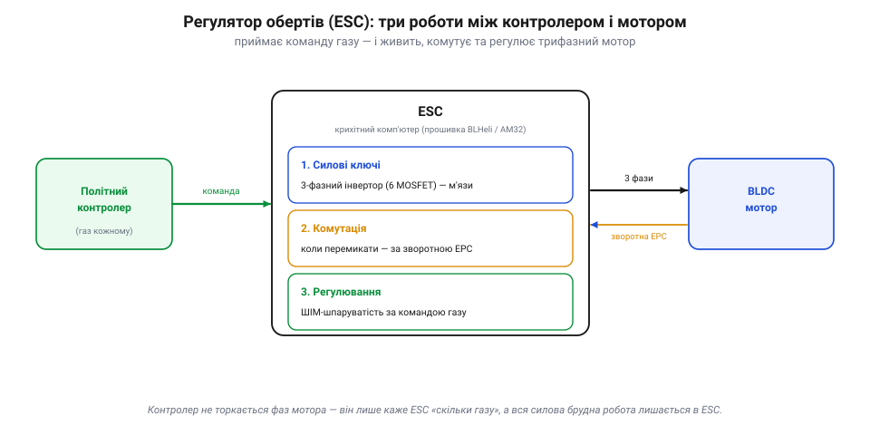
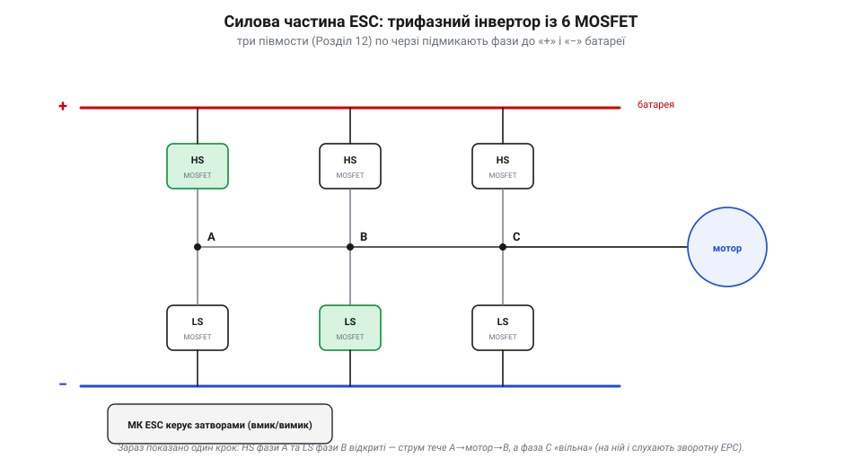
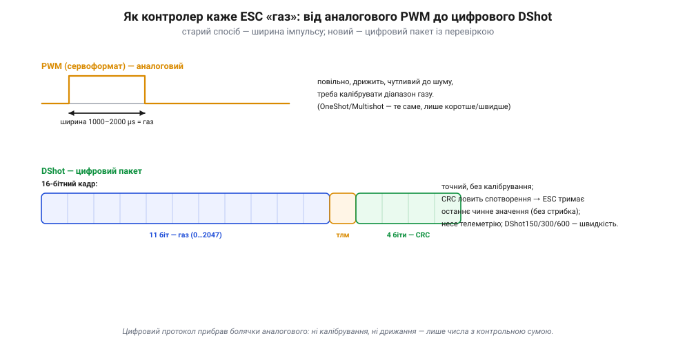
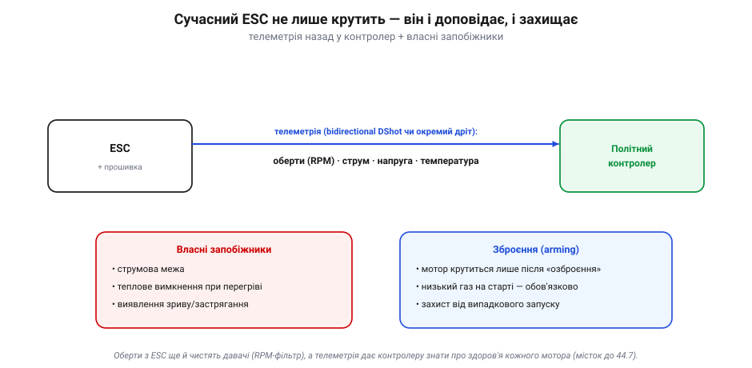

# Регулятор обертів (ESC): як керує мотором

[Безколекторним мотором](root:hw-motion/bldc-motor) не можна керувати, просто подавши напругу, — потрібен «розумний» драйвер. Цей драйвер і є **регулятор обертів** (*electronic speed controller*, ESC). Він стоїть між політним контролером і мотором: контролер каже йому «скільки газу», а ESC робить усю силову й брудну роботу — перемикає фази, тримає такт і дозує потужність. По суті, ESC — це окремий **крихітний комп'ютер**, присвячений одному мотору.

### Три роботи ESC

Усе, що робить ESC, зводиться до трьох робіт:


*Три роботи ESC. **Силові ключі** — трифазний інвертор із шести MOSFET, що власне підмикає фази мотора до батареї (м'язи). **Комутація** (лат. *commutatio* — перемикання) — рішення, коли яку фазу перемкнути, за [зворотною ЕРС](root:hw-motion/bldc-motor) (мозок-таймер). **Регулювання швидкості** — дозування ефективної напруги шпаруватістю ШІМ за командою газу. Контролер не торкається фаз мотора — лише шле ESC число «газ».*

Зверни увагу на поділ відповідальності: [політний контролер](root:sys-dron/flight-controller) тримає **високий рівень** («цьому мотору 60% газу»), а ESC — **низький, силовий** («у яку наносекунду який транзистор відкрити»). Це той самий принцип шарів: брудну роботу з кіловатами й наносекундами ізолюють у спеціалізованому пристрої.

Варто на мить піднятися над окремим ESC і глянути, **звідки** береться його команда. Контролер не думає «мотору 1 — 60%, мотору 2 — 55%». Він мислить величинами апарата: «нахилитись уперед на стільки, повернути на стільки, дати стільки загальної тяги». А окремий крок — [**мікшер** (*mixer*)](root:sys-dron/motor-mixer) — перетворює це бажання на персональне число газу для **кожного** мотора, знаючи геометрію апарата (де який мотор і в який бік крутить). Скажімо, щоб нахилити квадрокоптер уперед, мікшер додає газу заднім моторам і знімає з передніх. Кожен ESC дістає свій результат і виконує його, нічого не знаючи про загальний задум. Це знову той самий поділ рівнів: контролер мислить апаратом, мікшер розкладає на мотори, ESC править кожним окремо.

Корисно пам'ятати й те, що зв'язок «газ → тяга» **нелінійний**: [тяга росте приблизно як квадрат обертів](root:hw-motion/bldc-motor), тож апарат зависає десь на 30–50% газу, а решту лишають **запасом** на маневри й вітер. Якщо завис уже близько до повного газу — апарат перевантажений: керувати ним майже нічим, бо «вгору» вже нема куди. Тому добру збірку роблять так, щоб зависання припадало ближче до середини діапазону газу.

> 🔧 **Навіщо це.** ESC — не «дріт», а самостійний обчислювач зі своєю **прошивкою** (популярні: закрита **BLHeli_32** і відкриті **AM32**, **BLHeli_S**/**BlueJay**). У нього є власні налаштування, телеметрія й навіть оновлення прошивки. Тому, читаючи чужий апарат, став ESC у той самий ряд, що й політний контролер: це ще один програмований вузол, який може мати свою конфігурацію й свої баги.

### Силова частина: трифазний інвертор

Серце ESC — **трифазний інвертор** (лат. *invertere* — обертати, перевертати: він обертає сталу напругу батареї на змінне трифазне живлення): шість силових [MOSFET](root:hw-components/mosfet-power-switch), зібраних у три **півмости**. Кожен півміст може підмкнути свою фазу або до «плюса», або до «мінуса» батареї, а керує їхніми затворами мікроконтролер ESC.


*Силова частина ESC — це шість MOSFET (три півмости). Щоб прокрутити мотор, ESC по черзі відкриває потрібні пари: верхній ключ фази A та нижній ключ фази B відкриті, тож струм тече «+ → A → мотор → B → −», а фаза C лишається вільною (на ній і слухають зворотну ЕРС). Перемикаючи ці пари у правильному порядку, інвертор і малює обертове поле, що тягне за собою ротор.*

Тут сходяться кілька знайомих ниток. [**MOSFET**](root:hw-components/mosfet-power-switch) — бо вони перемикають великі струми з мізерними втратами й дуже швидко. Обмотки мотора **індуктивні**, тож при кожному перемиканні виникають [викиди напруги](root:hw-components/inductor-kickback), які гасять вбудовані діоди MOSFET — точно та сама [проблема flyback](root:embedded/flyback-protection). А ще на цих шести транзисторах виділяється **тепло** (втрати при провідності й перемиканні): гріється не лише [мотор](root:hw-motion/bldc-motor), а й ключі ESC, тому в потужних ESC є радіатори й струмові межі.

Кілька важливих деталей силової частини. По-перше, маленький МК ESC **не може сам** хитати масивні затвори силових MOSFET — між ними стоїть **драйвер затворів** (*gate driver*), що дає потужні короткі імпульси на відкриття й закриття (а для верхніх ключів — ще й хитро «підняти» керування вище за плюс батареї). По-друге, інвертор перемикає ключі ШІМ-ом на високій частоті — десятки кілогерц, досить високій, щоб мотор «бачив» гладку середню напругу, а не окремі імпульси, і щоб писк лежав за межею чутного.

Багато ESC роблять і додаткову послугу — **BEC** (*battery eliminator circuit*): вбудований перетворювач, що з високої напруги батареї робить стабільні 5 В для живлення контролера, приймача чи серво. Це позбавляє окремого джерела, але має межу за струмом — переобтяжиш BEC, і впаде живлення всієї електроніки. Тому на серйозних апаратах [живлення логіки](root:hw-power/power-rails) часто виносять в окремий надійніший модуль.

На мультикоптерах чотири ESC часто об'єднують в одну плату — **4-in-1**: компактно, спільне живлення, менше дротів. А оскільки ESC має прошивку, у нього є й **налаштування**: напрям обертання (щоб не перепаювати фази — досить змінити його програмно), стиль комутації (трапеція чи синус), потужність старту, гальмування. Тож «налаштувати мотори» — це інколи саме конфігурація ESC, а не контролера.

А оскільки прошивка ESC відкрита, у неї є й тонші ручки, які часом рятують збірку: **випередження комутації** (timing) під конкретний мотор, компенсація розмагнічування на високих обертах, плавність і потужність старту. Більшості апаратів вистачає типових значень, але знати, що ці ручки є, корисно: дивний свист, зриви чи кепський старт мотора часто лікуються саме в налаштуваннях ESC, а не заміною заліза.

> 🔧 **Навіщо це.** «6 MOSFET» у даташиті ESC — не магія, а буквально [три півмости](root:hw-components/mosfet-power-switch). І зрозуміло, чому ESC має **струмовий номінал** (скажімо, «40 A»): це межа, яку витримають його ключі, перш ніж перегрітися. Мотор, що тягне більше струму, ніж розрахований ESC, спалить **регулятор**, а не лише себе. Тому ESC завжди добирають із запасом за струмом під свій мотор і гвинт.

### Сигнал від контролера: від PWM до DShot

Як саме контролер передає ESC команду газу? Тут відбулася ціла маленька еволюція, і знати її варто, бо протокол ESC — одне з перших, що впізнаєш на чужому апараті.


*Як контролер каже ESC «газ». Старий спосіб — **аналоговий PWM** сервоформату: ширина імпульсу від 1000 до 2000 мкс кодує газ від 0 до 100%. Простий, але повільний, чутливий до шуму й потребує калібрування діапазону. Новий — **DShot**: цифровий 16-бітний кадр (11 біт газу + 1 біт запиту телеметрії + 4 біти CRC). Точний, без калібрування, із вбудованою перевіркою на спотворення.*

Подивімося на цифровий кадр зблизька — він гарно показує, наскільки «дорослішим» став сигнал:

```
Кадр DShot (16 біт):
  11 біт газу       → 2048 значень  (0 = роззброїти; 48…2047 = газ; 1…47 — команди)
   1 біт телеметрії  → запит даних від ESC
   4 біти CRC        → ESC може виявити спотворений кадр (реакція залежить від прошивки)
```

Краса DShot — не лише в точності. [CRC](root:com-modulation/crc) дає ESC змогу **виявити** спотворений завадою кадр (і не сприйняти його за випадковий стрибок газу) — а що робити далі (відкинути, утримати останнє значення, перейти у власний failsafe), вирішує його прошивка; немає й калібрування діапазону (числа абсолютні); а ще той самий канал несе **команди** (бікнути, змінити напрям) і **телеметрію**. Швидші варіанти — DShot150, 300, 600 — відрізняються лише темпом передачі.

Чому ж аналоговий PWM відходить? Окрім калібрування (треба «показати» ESC, де 0% і де 100% газу, інакше діапазони не збігаються), він **повільний** і **дрижить**: позиція фронту імпульсу плаває від шуму, а оновлюється лише десятки-сотні разів на секунду. А команда газу — це **останній крок** [швидкого контуру стабілізації](root:com-signal/stabilization-cascade): контролер порахував, скільки тяги дати кожному мотору, і мусить це передати негайно. Тому темп і затримка протоколу ESC прямо впливають на чуйність апарата: чим швидше й точніше команда доходить до інвертора, тим жвавіше апарат тримає рівновагу. DShot виграє не лише точністю, а й малою затримкою — він закриває контур щільніше.

> 📜 І PWM-протокол, і його цифрові нащадки — спадок тієї самої спільнотної, відкритої культури, що й [ArduPilot](root:sys-dron/ardupilot-layers). Прошивку для ESC здебільшого пишуть відкрито (**AM32**, **BLHeli_S**, **BlueJay**) — хоч найпоширеніша донедавна **BLHeli_32** була, навпаки, **закрита** (її розробку 2024-го згорнули, естафету перебрав відкритий AM32); а протокол **DShot** народився в спільноті FPV-перегонів близько 2016 року саме щоб позбутися болячок аналогового PWM — калібрування, дрижання, повільності. Так само, як ArduPilot зробив відкритим «великий мозок» апарата, ця спільнота зробила відкритим «маленький мозок» кожного мотора. Відкритість тут — не ідеологія, а інженерна зручність: будь-хто може вдосконалити прошивку дешевого ESC.

> 🔧 **Навіщо це.** Протокол ESC — практичне знання. Бачиш на апараті стару добру PWM — чекай калібрування й нижчої чуйності; бачиш DShot — маєш точність, телеметрію й захист від завад «з коробки». І пам'ятай: контролер та ESC мусять **узгодити** протокол; неспівпадіння — часта причина, чому мотори «не оживають» на новій збірці.

### Зворотний зв'язок і захист

Сучасний ESC не лише сліпо крутить — він **доповідає** й **захищає себе**:


*ESC як двосторонній учасник. По телеметрії він повертає контролеру оберти, струм, напругу й температуру — тож контролер «знає здоров'я» кожного мотора. (Тонкість: **двонапрямлений DShot** тим самим дротом повертає насамперед **оберти** (eRPM); струм, напругу й температуру дає або **окремий** дріт телеметрії, або розширення *Extended DShot Telemetry*, якщо його підтримують обидві сторони.) Має й власні запобіжники: струмову межу, теплове вимкнення при перегріві, виявлення зриву. А зброєння (*arming*) не дає мотору крутитися, поки система не озброєна й газ не на нулі.*

Особливо корисні **оберти** з телеметрії: знаючи точну частоту обертання мотора, контролер може вичистити саме її гармоніку з показань гіроскопа (так званий RPM-фільтр) — тобто телеметрія ESC покращує навіть **відчуття** апарата.

Найновіші ESC уміють **двонапрямлений DShot**: той самий єдиний сигнальний дріт носить і команду газу туди, і **оберти** мотора назад — без жодного окремого дроту (а напругу/струм/температуру, як треба, дає окрема телеметрія). Звідси сучасний RPM-фільтр дістається майже «безплатно»: контролер знає точні оберти кожного мотора щомиті й вичищає їхній шум із гіроскопа. Маленька цеглинка протоколу, а помітно піднімає якість польоту — і черговий приклад, як цифровий зв'язок зробив можливим те, чого аналоговий PWM не вмів у принципі. А виявлення зриву й температура — це вже місток до [надійності](root:sf-devices/redundancy): контролер може помітити, що мотор «нездоровий», і відреагувати — переставити апарат у безпечніший режим або перерозподілити тягу між справними моторами.

Окремо варто сказати про **зброєння**: ESC навмисне не дасть мотору крутитися, поки апарат не «озброєно» й газ не на нулі. Це проста, але критична безпека — щоб гвинти не закрутилися від випадкового сигналу чи перешкоди, поки людина поряд.

Ще одна корисна здатність — **активне гальмування** (його ще звуть «damped light»): замкнувши фази мотора накоротко, ESC різко його гальмує, замість дати вільно обертатися за інерцією. Для спритного апарата це важливо: коли контролер просить **зменшити** тягу, мотор має сповільнитися негайно, а не «викочуватися» секунду за інерцією. Без гальмування апарат реагував би на команди «вниз» мляво й запізно. Тому жваві мультикоптери майже завжди літають з увімкненим гальмуванням — це ще один спосіб, яким ESC впливає на якість керування, а не лише крутить мотор.

> 🔧 **Навіщо це.** Якщо мотор не крутиться — перше питання не «згорів?», а «чи озброєно й чи на нулі газ?». А телеметрія ESC у логах (RPM, струм, температура кожного мотора) — золото для діагностики: по ній видно, який мотор перевантажений, який гріється, а який раптом втратив оберти. Це часто перше місце, куди дивляться, шукаючи причину дивної поведінки чи падіння.

### Підсумок теми

ESC — це силовий «виконавець» між контролером і безколекторним мотором, що робить три речі: **перемикає потужність** (трифазний інвертор із шести [MOSFET](root:hw-components/mosfet-power-switch)), **тримає такт комутації** (за зворотною ЕРС) і **дозує швидкість** (шпаруватістю ШІМ за командою газу). Команду він дістає цифровим протоколом — сучасний **DShot** несе газ, телеметрію й CRC замість старого аналогового PWM. Назад ESC віддає оберти, струм і температуру, має власні запобіжники й вимагає зброєння. А сам він — програмований вузол зі своєю відкритою прошивкою, маленький брат великого політного контролера. Зрештою мотор, гвинт, ESC і батарея — це один **рушійний вузол**, що працює лише злагоджено: KV мотора, крок і діаметр гвинта, струм ESC і напруга батареї мусять пасувати одне одному, і зміниш одне — переглянь решту. Тому досвідчені складальники говорять не «мотор такий-то», а «зв'язка: такий мотор + такий гвинт + стільки банок + такий ESC» — бо саме зв'язка визначає тягу, струм і нагрів, а не жоден компонент поодинці.

Разом мотор і ESC дають апарату **тягу**. Але не всі апарати керуються лише тягою: літакам і деяким машинам потрібні ще й рухомі поверхні, якими керують [серворушії](root:embedded/output-mixing).

---
