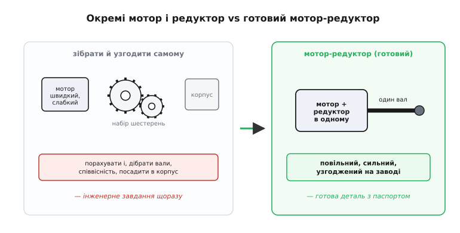
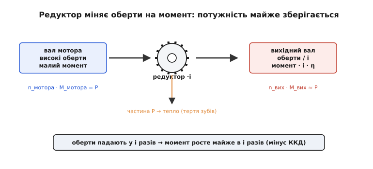
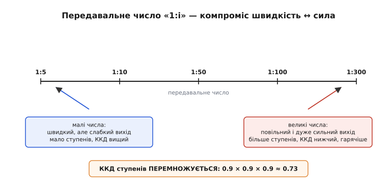
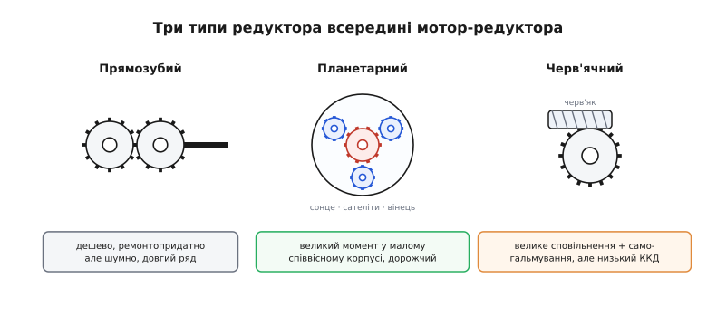
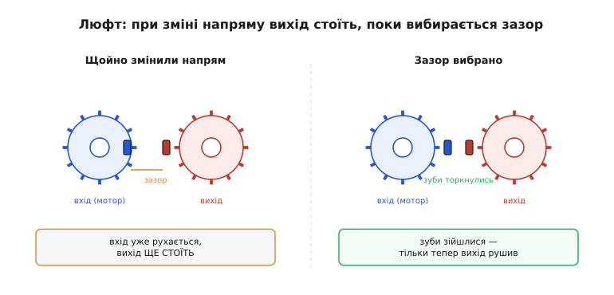

# Мотор-редуктор

Купити окремо мотор, окремо набір шестерень, вирахувати передавальне число, підібрати вали по діаметру, знайти співвісність, посадити все в корпус так, щоб зуби не розходилися під навантаженням, — і повторювати цю морочливу роботу під кожен новий привід. Саме щоб її не робити щоразу, мотор і редуктор давно продають **разом, як один вузол** — **мотор-редуктор** (англ. *gearmotor*, від *gear* — шестерня, і *motor*). Це електромотор, до якого на заводі вже прикручено редуктор, узгоджений із ним за обертами, моментом і кріпленням, і виведено **один вихідний вал** із потрібними «повільними сильними» характеристиками. Розберімо від самої першопричини, навіщо мотор і редуктор узагалі зрослися в одне ціле, як із швидкого слабкого мотора виходить повільний сильний вал, що означає та сама перша цифра на корпусі — передавальне число, які бувають мотор-редуктори всередині й чим відрізняються, і чому при доборі не можна дивитися на мотор без редуктора.

### Чому мотор і редуктор зрослися в один вузол

Корінь усього — у простій невідповідності, що супроводжує майже кожен електромотор. Він **любить крутитися швидко й слабко**: типовий [колекторний DC-мотор](topic:hw-motion/brushed-dc-motor) на холостому ходу дає кілька тисяч, а то й десятки тисяч обертів за хвилину, але момент на його валу мізерний — таким моментом не зрушити навіть невеликий вантаж. А механізмові — колесу робота, осі маніпулятора, барабану лебідки — майже завжди потрібне протилежне: крутитися **повільно, зате з силою**. Між цими двома світами завжди мусить стояти посередник, що сповільнить мотор і рівно настільки ж підсилить його момент.

> Цей посередник — **редуктор**, окремий вузол із зубчастих коліс, що міняє оберти на момент. Працює він як закручений у коло важіль: добуток моменту на оберти (потужність) майже зберігається, тож наскільки падають оберти, настільки росте момент. Міру цього обміну задає **передавальне число** — відношення обертів на вході до обертів на виході. Детальніше про самі передачі, типи зачеплень і втрати — у статті [редуктори й передачі](topic:hw-motion/gears-transmission).

Поки мотор і редуктор окремі, кожен новий привід — це маленьке інженерне завдання. Треба знати оберти й момент мотора, порахувати потрібне передавальне число, дібрати редуктор, у якого вхідний вал сяде на вал мотора, забезпечити їхню **строгу співвісність** (зубчасте зачеплення не прощає перекосу осей), посадити обидва в корпус і подбати, щоб під навантаженням редуктор не «роз'їхався». Це робота, яку для масового виробу безглуздо повторювати щоразу, — тож її роблять **один раз на заводі**.

Так народжується мотор-редуктор: мотор і редуктор зібрані співвісно в спільному корпусі, передавальне число вже підібране під типове застосування, а назовні виходить **один-єдиний вал** — уже повільний і сильний, готовий до роботи. Для того, хто будує пристрій, це означає, що вузол перетворюється з інженерного завдання на **просту деталь з паспортом**: дивишся два числа — оберти й момент на виході — і ставиш, як ставив би будь-який інший компонент.


*Чому мотор і редуктор продають разом. Ліворуч — те, що довелося б робити самому: підібрати мотор, окремий редуктор із потрібним передавальним числом, забезпечити співвісність валів і корпус. Праворуч — мотор-редуктор: усе це вже зібрано й узгоджено на заводі, назовні виходить один повільний сильний вал. Інженерне завдання перетворюється на готову деталь, у якої лишається подивитися два числа — оберти й момент на виході.*

> 🔧 **Навіщо це.** Практичний висновок простий: під більшість приводів **не варто збирати редуктор самому** з мотора й набору шестерень — майже завжди є готовий мотор-редуктор із потрібними обертами й моментом. Це дешевше (масове виробництво), надійніше (співвісність і корпус витримані на заводі) і швидше. Самому редуктор збирають лише там, де готового під задачу немає, — рідкісне передавальне число, незвична компоновка, особливі вимоги.

### Як зі швидкого слабкого мотора виходить повільний сильний вал

Тепер по суті — що саме відбувається всередині між валом мотора й вихідним валом. Уся робота тримається на одному залізному правилі механіки: **даром сили не дають**. Підсилити момент можна, лише чимось заплативши, і платять тут **обертами**.

Уявімо найпростіший випадок — мале зубчасте колесо на валу мотора зчеплене з великим колесом на виході. Зуби в обох однакового розміру (інакше не зчепляться), тож скільки зубів пройде в зачепленні на малому колесі, рівно стільки ж пройде й на великому. Якщо велике колесо має вдесятеро більше зубів, то за десять обертів мотора воно провернеться лише **один раз** — вихід крутиться вдесятеро повільніше. А момент росте дзеркально: зуби малого колеса штовхають велике на його **більшому радіусі**, тобто на довшому плечі, — те саме зусилля на довшому плечі дає більший момент, рівно як довша ручка ключа легше зриває гайку. Сповільнили вдесятеро — і вдесятеро підсилили.

Чому підсилення не береться з нічого, видно з **потужності**. Потужність обертання — це добуток моменту на оберти, і редуктор її не створює: скільки потужності зайшло з вала мотора, стільки (майже) й вийшло на вихідний вал. А якщо добуток сталий, то піднявши один множник, неминуче опускаємо другий. Запишімо три рівності, з яких випливає вся поведінка вузла:

```
передавальне число   i = n_мотора / n_вих
оберти на виході      n_вих = n_мотора / i      (менше обертів)
момент на виході      M_вих = M_мотора · i · η  (більше моменту, мінус втрати)
```


*Обмін обертів на момент усередині мотор-редуктора. Мотор віддає високі оберти й малий момент. Редуктор ділить оберти на передавальне число `i` й рівно настільки ж множить момент. Добуток моменту на оберти (потужність) майже зберігається — змінитися він не може, передача лише перекладає його з «швидко-слабко» у «повільно-сильно». Невелика частка потужності неминуче гине на терті зубів і йде в тепло, тому реальний момент на виході трохи менший за ідеальний — на множник ККД.*

Тут і ховається множник `η` — **коефіцієнт корисної дії** редуктора (частка потужності, що доходить до виходу). Ідеальна передача підняла б момент рівно в `i` разів; реальна множить ще й на `η < 1`, бо частина потужності гине на терті зубів і йде в тепло. Тому в формулі моменту стоїть `· η`: писати ідеальний момент без нього — означає на папері мати запас, якого в живому приводі немає.

> 🔧 **Навіщо це.** Звідси головна звичка роботи з мотор-редуктором: усі робочі числа дивляться **на виході редуктора, а не на валу мотора**. Механізм бачить саме вихідний вал — його оберти, його момент. Цифри мотора («10000 об/хв, 0.02 Н·м») самі по собі ні про що не кажуть, доки не поділиш на передавальне число й не помножиш (з урахуванням ККД). Хороший мотор-редуктор у паспорті одразу дає вихідні числа — ними й користуйся.

### Передавальне число: перша цифра на корпусі

На корпусі мотор-редуктора майже завжди стоїть запис на кшталт **«1:30»**, «1:100», «50:1» — це і є передавальне число, і саме воно першим визначає, на що цей вузол годиться. Читається воно просто: «1:30» означає, що вихідний вал робить **один** оберт на кожні **тридцять** обертів мотора. Отже, оберти падають у 30 разів, а момент (за збереженням потужності) приблизно в 30 разів росте.

Звідки беруть саме це число при доборі? З того, які оберти треба механізмові. Ділимо оберти мотора на бажані оберти виходу — і дістаємо потрібне передавальне число:

```
треба:  вихід 100 об/хв,  мотор дає 3000 об/хв
i = n_мотора / n_вих = 3000 / 100 = 30      → шукаємо мотор-редуктор «1:30»
```

Велике передавальне число (1:100, 1:300) означає дуже повільний, але дуже сильний вихід; мале (1:5, 1:10) — швидший, але слабший. Тут є й прихована плата, про яку легко забути: чим більше передавальне число, тим **більше ступенів** зубчастих коліс доводиться поставити всередину, а ККД ступенів **перемножується**. Три ступені по 0.9 дають не 0.9, а 0.9 × 0.9 × 0.9 ≈ 0.73 — уже помітно менше. Тому дуже «глибокий» редуктор не лише сильніший і повільніший, а ще й відносно менш ефективний і гарячіший за неглибокий.


*Що означає передавальне число на корпусі. «1:i» — вихід робить один оберт на `i` обертів мотора, тож оберти падають у `i` разів, а момент приблизно в стільки ж росте. Ліворуч (малі числа) — швидкий, але слабкий вихід, усередині мало ступенів. Праворуч (великі числа) — повільний і дуже сильний вихід, але всередині більше ступенів, а їхні ККД перемножуються, тож сумарна ефективність падає й вузол сильніше гріється. Передавальне число — компроміс «швидкість ↔ сила», який обирають під механізм.*

> 🔧 **Навіщо це.** Передавальне число — **перше число**, яке дивляться, добираючи мотор-редуктор. Спершу визнач, які оберти й момент потрібні механізмові на виході; тоді поділи оберти мотора на бажані оберти виходу — це й буде орієнтовне передавальне число. Не женися за найбільшим: зайве передавальне число дає надмірно повільний вихід, з'їдає ефективність зайвими ступенями й гріє вузол. Бери таке, що дає потрібні оберти, а момент із розрахунку перевір окремо.

### Типи мотор-редукторів: прямозубий, планетарний, черв'ячний

Усередині мотор-редуктора може стояти редуктор різної будови, і саме він задає характер усього вузла — щільність моменту, ціну, рівень шуму, чи тримає вал навантаження сам. Три типи покривають майже всі застосування.

**Прямозубий** (англ. *spur* — пряма шестерня) — найпростіший: ряд звичайних циліндричних коліс із прямими зубами, ступінь за ступенем. Дешевий, ремонтопридатний, із пристойним ККД (зуби переважно котяться, а не ковзають). Платою є те, що під велике передавальне число потрібен довгий ряд коліс, корпус видовжується, а прямі зуби помітно **клацають** — такий редуктор шумніший. Саме прямозубі редуктори стоять у незліченних дешевих мотор-редукторах іграшок і побутової техніки.

**Планетарний** (англ. *planetary*) — особливий вид зубчастого, де центральна шестерня («сонце») обертає кілька малих «сателітів», що бігають по внутрішньому зубчастому вінці, як планети довкола сонця (звідси й назва). Головна перевага — навантаження ділиться між **кількома** сателітами одразу, тож у малому співвісному корпусі вміщується великий момент і велике передавальне число. Вихідний вал тут співвісний із мотором, що зручно для компактних приводів. За це платять складнішим і дорожчим виробництвом. Планетарні мотор-редуктори стоять там, де важлива **щільність моменту** в малому об'ємі: приводи роботів, акумуляторні шурупокрути, точні осі.

**Черв'ячний** (англ. *worm*) — це гвинт (його звуть *черв'яком*) на валу мотора, зчеплений із зубчастим колесом збоку. За кожен оберт черв'яка колесо провертається лише на один зуб, тож **одна пара** дає величезне сповільнення (1:50, 1:100 і більше) там, де зубчастих коліс знадобився б цілий ряд. Але найцінніша його властивість — **самогальмування**: черв'як легко крутить колесо, а от колесо **не може** прокрутити черв'як назад. Виходить однобічна передача: подав живлення — вал крутиться, зняв — вал застиг сам, без жодного гальма. Розплата велика — черв'як сильно ковзає по зубах колеса, тож **ККД у черв'ячного редуктора низький** (часто лише 0.5–0.7), багато потужності йде в тепло, і вузол відчутно гріється під навантаженням. Черв'ячні мотор-редуктори ставлять туди, де потрібне самогальмування: підйомники, заслінки, поворотні камери, тенти.


*Три типи редуктора всередині мотор-редуктора. **Прямозубий** — ряд звичайних коліс: дешевий і ремонтопридатний, але шумний і довгий під велике число. **Планетарний** — сонце, сателіти й вінець: великий момент і велике число в малому співвісному корпусі, дорожчий у виробництві. **Черв'ячний** — гвинт і колесо впоперек: величезне сповільнення однією парою й самогальмування (вал тримається сам), але низький ККД і сильний нагрів. Кожен задає характер усього вузла — щільність моменту, шум, ефективність і чи тримає вал навантаження без живлення.*

> 🔧 **Навіщо це.** Тип редуктора добирають під задачу, а не навмання. Треба, щоб вал **сам тримав** вантаж зі знятим живленням (підйомник, поворотна камера, заслінка) — бери черв'ячний, він дає це задарма самогальмуванням, лиш погодься на нижчий ККД і нагрів. Треба максимум моменту в малому об'ємі (привід робота, інструмент) — бери планетарний. Треба дешево й просто, а шум і габарити не критичні — вистачить прямозубого. Один і той самий мотор у різних редукторах дає зовсім різні вузли.

### Люфт: чому вихід відстає при зміні напряму

У зубчастого й черв'ячного редуктора (а отже, у більшості мотор-редукторів) є вада, яку конче треба назвати, бо вона псує точність саме там, де її найбільше чекають, — **люфт** (нім. *Luft* — повітря; англ. *backlash* — зворотний удар), він же мертвий хід. Корінь простий: щоб зуби не заклинювало й вони мали куди вмістити мастило, між боком зуба одного колеса й боком сусіднього лишають крихітний **зазор**. Без нього передача їла б сама себе; з ним — з'являється люфт.

Поки вал крутиться в один бік, зуби тиснуть один на одного робочими боками, а зазор «висить» на протилежних, незайманих боках і ні на що не впливає. Але щойно ми **міняємо напрям**, зуби мотора мусять спершу провернутися на ширину зазору **вхолосту**, поки не дійдуть до зубів виходу з іншого боку. Увесь цей час вхід уже рухається, а **вихід ще стоїть**. І, що особливо підступно в мотор-редукторі, цей зазор **множиться на передавальне число**: маленький люфт у кожному ступені, помножений на велике сповільнення, на виході може обернутися помітним мертвим ходом вихідного вала.

```
люфт на виході ≈ зазор_у_ступенях, накопичений і помножений на i
наслідок: після кожної зміни напряму вихід деякий час нерухомий
```


*Звідки береться мертвий хід. Ліворуч щойно змінили напрям: зуб ведучого колеса ще не дотягнувся до зуба веденого — між ними **зазор**, і поки вхід його проходить, вихід нерухомий. Праворуч зазор вибрано, зуби зійшлися — і тільки тепер вихід рушає. Цей холостий хід при кожному реверсі й називають люфтом. У мотор-редукторі він ще й помножений на передавальне число, тож на виході відчувається сильніше, ніж у одній парі коліс.*

Наслідок видно одразу: при кожній зміні напряму вихідний вал **відстає** від команди на величину люфту, і ця відстань ніде не вимірюється. Для приводу, що крутить колесо чи вентилятор, це байдуже — там напрям не міняють щомиті. Але для точного позиціювання, де треба то туди, то сюди (вісь верстата, маніпулятор, наведення), люфт прямо псує точність. Тому там, де він критичний, беруть **планетарні** мотор-редуктори (їхня будова дає менший люфт) або спеціальні безлюфтові, а в дешевому приводі просто пам'ятають: у перший момент після реверсу вихід ще стоїть.

> 🔧 **Навіщо це.** Якщо вихідний вал мотор-редуктора «гуляє» при зміні напряму — це майже завжди люфт, а не збій електроніки, і лікують його **механічно** (щільніший або планетарний редуктор), а не програмою. Грубий програмний обхід — **компенсація люфту**: коли керування змінює напрям, спершу дослати кілька зайвих кроків наосліп, щоб вибрати зазор, і лише тоді рахувати корисний рух. Це латка, не заміна доброї механіки, але часто рятує точність дешевого вузла.

### Worked-приклад: добір мотор-редуктора під колесо робота

Зведімо все в одну практичну задачу — як добирають мотор-редуктор під реальний привід і чому без редуктора голий мотор тут не годиться.

**Умова.** Колесо мобільного робота має крутитися зі швидкістю **120 об/хв** і потребує моменту **0.6 Н·м**, щоб упевнено рушати корпус. Є мотор, що на робочій точці віддає **4800 об/хв** при моменті **0.02 Н·м**. Яке передавальне число мотор-редуктора потрібне, чи вистачить моменту з урахуванням ККД 0.9 і скільки потужності піде в тепло?

Спершу — передавальне число з відношення обертів: у скільки разів сповільнити мотор, щоб дістати оберти колеса.

```
i = n_мотора / n_вих
  = 4800 / 120
  = 40                       // потрібен мотор-редуктор приблизно «1:40»
```

Тепер перевіримо момент. Ідеальна передача підняла б момент мотора рівно в `i` разів; реальна множить ще й на ККД, бо частина потужності гине в теплі:

```
M_вих (ідеал)   = M_мотора · i        = 0.02 · 40       = 0.80 Н·м
M_вих (реальн.) = M_мотора · i · η    = 0.02 · 40 · 0.9 = 0.72 Н·м
```

Потрібно було 0.6 Н·м — реальні **0.72 Н·м** перекривають це із запасом (×1.2), отже редуктор «1:40» підходить. А скільки потужності гине в теплі? Порівняймо вхід і вихід (оберти переводимо в радіани за секунду):

```
ω_мотора = 4800 · 2π / 60 = 502.7 рад/с
P_вх  = M_мотора · ω_мотора = 0.02 · 502.7 = 10.05 Вт
P_вих = η · P_вх            = 0.9 · 10.05   =  9.05 Вт
втрати = P_вх − P_вих        = 10.05 − 9.05  =  1.0 Вт   ← цей ват гріє редуктор
```

Висновок: мотор-редуктор «1:40» дає колесу і потрібні оберти, і момент із запасом, а коштує це приблизно 1 Вт тепла в корпусі. Видно й чому **голий мотор тут марний**: його власні 0.02 Н·м у 30 разів менші за потрібні 0.6 Н·м — без редуктора він просто прокрутився б на місці, не зрушивши робота. У прошивці ця арифметика лягає в одну невелику функцію — перевірити, чи потягне привід, **перш ніж** ганяти його:

:::tabs
```cpp
#include <stdbool.h>

// Чи потягне мотор-редуктор задане навантаження на вихідному валу?
// motor_torque, load_torque — Н·м;  ratio — передавальне число (>1 = сповільнення);
// eff — ККД редуктора (0..1, напр. 0.9)
bool gearmotor_can_pull(float motor_torque, float ratio, float eff, float load_torque) {
    float out_torque = motor_torque * ratio * eff;   // реальний момент на вихідному валу
    return out_torque >= load_torque;                // з урахуванням втрат у редукторі
}

// приклад: мотор 0.02 Н·м, мотор-редуктор «1:40», ККД 0.9, навантаження 0.6 Н·м
// gearmotor_can_pull(0.02f, 40.0f, 0.9f, 0.6f) -> true   (0.72 >= 0.6)
```
```python
# Чи потягне мотор-редуктор задане навантаження на вихідному валу?
# motor_torque, load_torque — Н·м;  ratio — передавальне число (>1 = сповільнення);
# eff — ККД редуктора (0..1, напр. 0.9)
def gearmotor_can_pull(motor_torque, ratio, eff, load_torque):
    out_torque = motor_torque * ratio * eff   # реальний момент на вихідному валу
    return out_torque >= load_torque          # з урахуванням втрат у редукторі


# приклад: мотор 0.02 Н·м, мотор-редуктор «1:40», ККД 0.9, навантаження 0.6 Н·м
# gearmotor_can_pull(0.02, 40.0, 0.9, 0.6) -> True   (0.72 >= 0.6)
```
```js
// Чи потягне мотор-редуктор задане навантаження на вихідному валу?
// motorTorque, loadTorque — Н·м;  ratio — передавальне число (>1 = сповільнення);
// eff — ККД редуктора (0..1, напр. 0.9)
function gearmotorCanPull(motorTorque, ratio, eff, loadTorque) {
  const outTorque = motorTorque * ratio * eff;   // реальний момент на вихідному валу
  return outTorque >= loadTorque;                // з урахуванням втрат у редукторі
}

// приклад: мотор 0.02 Н·м, мотор-редуктор «1:40», ККД 0.9, навантаження 0.6 Н·м
// gearmotorCanPull(0.02, 40.0, 0.9, 0.6) -> true   (0.72 >= 0.6)
```
```go
// Чи потягне мотор-редуктор задане навантаження на вихідному валу?
// motorTorque, loadTorque — Н·м;  ratio — передавальне число (>1 = сповільнення);
// eff — ККД редуктора (0..1, напр. 0.9)
func GearmotorCanPull(motorTorque, ratio, eff, loadTorque float64) bool {
	outTorque := motorTorque * ratio * eff // реальний момент на вихідному валу
	return outTorque >= loadTorque         // з урахуванням втрат у редукторі
}

// приклад: мотор 0.02 Н·м, мотор-редуктор «1:40», ККД 0.9, навантаження 0.6 Н·м
// GearmotorCanPull(0.02, 40.0, 0.9, 0.6) -> true   (0.72 >= 0.6)
```
:::

Кілька пасток, які тут видно. Момент рахуємо **з урахуванням ККД** (`* eff`), а не за ідеальною формулою — інакше на папері запас є, а живий привід не тягне. Запас по моменту лишають **навмисно** (тут 0.72 проти 0.6): мотор має робочу точку, а не одне число, навантаження стрибає на нерівностях, а редуктор гріється і трохи втрачає. І найголовніше — реальний мотор **не** віддає сталий момент на всіх обертах: на високих момент менший, на стопорі більший. Тому в розрахунок беруть значення з **робочої точки** мотора, а не пусковий чи холостий момент.

### Де працює мотор-редуктор

Лишилося побачити загальну картину — мотор-редуктор стоїть майже скрізь, де потрібен керований повільний сильний рух, і причина одна: швидкий слабкий мотор сам по собі ні на що з цього не годиться.

У **колесах і гусеницях мобільних роботів** мотор-редуктор — основа приводу: він дає колесу повільні оберти й момент, щоб упевнено рушати корпус, тоді як голий мотор мчав би некеровано або не зрушив би з місця. У **маніпуляторах і поворотних осях** він не лише додає момент, а й «загрублює» рух — один оберт мотора стає малою часткою градуса на виході, тож позиціювати легше й точніше (тут цінують малий люфт планетарних). У **підйомниках, лебідках, заслінках і тентах** беруть черв'ячний мотор-редуктор за самогальмування — вантаж тримається сам, без живлення й гальма. У **побутовій техніці** (приводи, таймери, дозатори) дешевий прямозубий мотор-редуктор перетворює оберти копійчаного мотора на повільний робочий рух.

Окремо варто бачити сусідні вузли, що збудовані навколо тієї самої ідеї. [Серво](topic:hw-motion/hobby-servo) — це по суті мотор-редуктор із вбудованим керуванням і датчиком положення в одному корпусі: редуктор там перетворює швидкий хід мотора на сильний повільний поворот важеля, а електроніка тримає заданий кут. [Кроковий мотор](topic:hw-motion/stepper-motor) із редуктором дає дрібніший крок на виході (передавальне число ділить кут кроку), але люфт редуктора цю дрібність псує, тож там вибирають безлюфтові схеми. Спільне в усіх — редуктор біля мотора, тільки в мотор-редукторі він зібраний і узгоджений заздалегідь.

> 🔧 **Навіщо це.** Добираючи привід, думай **готовим мотор-редуктором**, а не мотором окремо: під типову задачу майже завжди є вузол із потрібними обертами й моментом, і збирати редуктор самому немає сенсу. Дивися вихідні числа (оберти, момент на валу), тип редуктора (потрібне самогальмування → черв'як; щільність моменту → планетарний; дешево → прямозубий) і пусковий та стопорний момент мотора всередині: надмірний момент може **зламати самі зуби** редуктора, тож вузол беруть не лише «щоб вистачило сили», а й «щоб витримав» найважчий режим мотора.

### Підсумок теми

Мотор-редуктор — це електромотор із заздалегідь прикрученим і узгодженим редуктором та одним вихідним валом, зібрані разом, **щоб не повторювати** морочливий добір передавального числа, співвісності й корпусу під кожен привід. Усередині він робить те, чого не вміє сам мотор: обмінює зайві оберти на брак моменту за збереженням потужності — оберти діляться на **передавальне число** `i`, момент множиться на `i` (мінус втрати на ККД). Перша цифра на корпусі, «1:i», і каже цей обмін: більше число — повільніший і сильніший вихід, але більше ступенів і нижчий сумарний ККД. Характер вузла задає тип редуктора: **прямозубий** (дешево, шумно), **планетарний** (щільний момент у малому корпусі), **черв'ячний** (велике сповільнення й самогальмування ціною низького ККД). Зубчасті редуктори мають **люфт** — холостий хід при реверсі, ще й помножений на передавальне число, тож для точного позиціювання беруть малолюфтові схеми. Головне правило роботи: усі числа дивляться **на виході редуктора**, добирають готовим мотор-редуктором під потрібні оберти й момент і перевіряють, чи витримають зуби пусковий і стопорний момент мотора.

---
