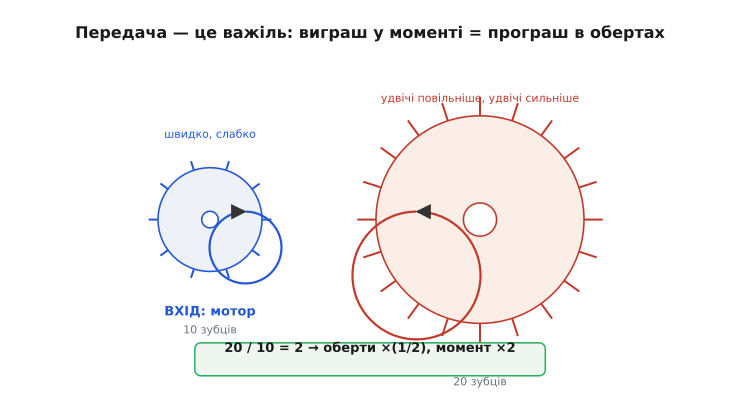
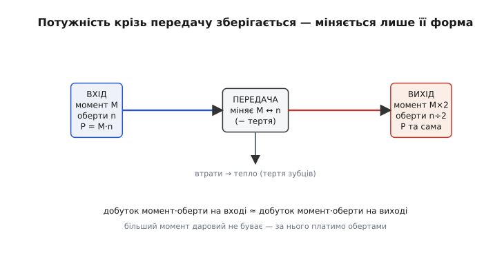
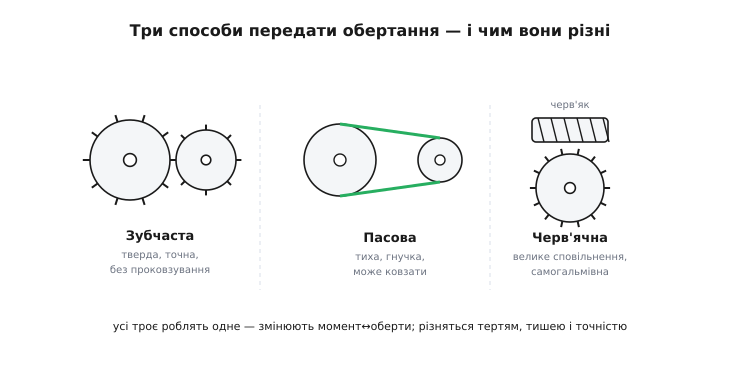
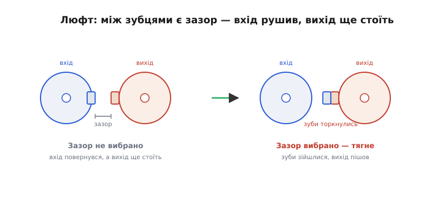

# Редуктори й передачі

Майже жоден мотор не вміє крутити так, як треба механізму. Електромотор любить крутитися **швидко й слабко** — десятки тисяч обертів за хвилину, але з мізерним моментом, якого не вистачить навіть підняти власну вагу робота. А колесу, гвинту чи маніпулятору частіше потрібне протилежне: крутитися **повільно, зате з силою**, щоб зрушити вантаж. Між цими двома світами стоїть **передача** (англ. *transmission* — передавання) — а коли вона саме сповільнює мотор, її звуть **редуктором** (лат. *reductor* — той, що зменшує, тут — зменшує оберти). Це вузол, що перекладає обертання мотора на потрібну механізму мову, обмінюючи зайві оберти на брак моменту. Розберімо від самої першопричини, чому такий обмін узагалі можливий, чому за більший момент завжди платять обертами, які бувають передачі й чим вони різняться, і де без редуктора не обійтися.

### Передача як важіль: міняємо момент на оберти

Почнімо з найдавнішої машини — **важеля**. Підважуючи камінь ломом, ми давимо на довге плече легко, а коротке плече тисне на камінь із величезною силою. Виграш у силі очевидний, але є й прихована плата: щоб коротке плече піднялося на сантиметр, довге доводиться опустити аж на долоню. Більша сила — менший хід. Це не вада конкретного важеля, а залізне правило будь-якої механіки: **даром сили не дають, за неї платять відстанню (або швидкістю)**.

Передача — це той самий важіль, тільки закручений у коло. Замість сили й відстані тут **момент** (сила обертання; лат. *momentum* — рушійна сила) і **оберти** (швидкість обертання). Візьмімо два зчеплені зубчасті колеса: мале на валу мотора й велике на валу механізму. Зуби в них однакового розміру (інакше вони не зчепляться), тож скільки зубів пройде в зачепленні на одному колесі, рівно стільки ж пройде й на другому. А раз велике колесо має вдвічі більше зубів, то за повний оберт малого воно провернеться лише **наполовину**. Мале колесо крутиться швидко — велике вслід за ним повільно.


*Передача — це закручений у коло важіль. Мале колесо на валу мотора (10 зубців) обертається швидко, але з малим моментом. Велике колесо на валу механізму (20 зубців) має вдвічі більше зубів — за оберт малого воно провертається лише на пів-оберта, тобто крутиться **удвічі повільніше**. Натомість на його довшому «плечі» (більшому радіусі) те саме зусилля зачеплення дає **удвічі більший момент**. Виграш у моменті точно дорівнює програшу в обертах — це й є суть редуктора.*

А тепер головне — звідки береться момент. Зуби малого колеса штовхають зуби великого на його **краю**, тобто на більшому радіусі. Те саме зусилля, прикладене на довшому плечі, дає більший момент — рівно так, як довша ручка гайкового ключа дозволяє відкрутити тугу гайку. Велике колесо вдвічі більше — отже, момент на ньому вдвічі більший, ніж віддавав мотор. Ми сповільнили обертання вдвічі й рівно вдвічі підсилили його. Це і є **передавальне число** (англ. *gear ratio*) — у скільки разів передача змінює оберти й момент. Для зубчастих коліс воно дорівнює просто відношенню чисел зубів:

```
передавальне число  i = зуби_веденого / зуби_ведучого
оберти на виході     n_вих = n_вх / i
момент на виході     M_вих = M_вх · i
```

Передавальне число більше за одиницю означає **сповільнення** (це й є редуктор: менше обертів, більше моменту); менше за одиницю — навпаки, **прискорення** (більше обертів ціною моменту, рідший випадок). У життя редуктор приходить майже завжди в першій ролі: мотор крутить надто швидко й надто слабко, редуктор це виправляє.

> 🔧 **Навіщо це.** Передавальне число — перша цифра, яку дивляться, добираючи редуктор під привід. Мотор віддає, скажімо, 3000 об/хв і 0.05 Н·м, а колесу робота треба 100 об/хв і момент, щоб зрушити корпус. Ділимо: 3000 / 100 = 30 — потрібен редуктор «1:30». Він підніме момент теж приблизно в 30 разів (мінус втрати), і з мізерних 0.05 Н·м вийде вже відчутний робочий момент. Без цієї арифметики мотор або крутитиме надто швидко, або не зрушить навантаження.

### Чому добуток моменту на оберти зберігається

Тут постає чесне питання, від якого залежить уся інтуїція: звідки редуктор **бере** додатковий момент? Якщо на виході сили вдвічі більше, чи не виходить, що передача дарує енергію з нічого? Ні — і зрозуміти, чому, важливіше за будь-яку формулу.

Ключ — у понятті **потужності** (англ. *power* — здатність робити роботу за одиницю часу). Для обертання потужність — це **добуток моменту на оберти**: як швидко крутимо, помножене на те, з якою силою. І саме цей добуток передача змінити **не може** — вона лише перекладає його з однієї форми в іншу. Енергія, яку мотор укладає у вал за секунду, мусить кудись піти; зубчасті колеса не вміють ні створювати її, ні знищувати, тож скільки потужності зайшло у редуктор, стільки (майже) й вийшло. А якщо добуток сталий, то піднявши один множник, неминуче опускаємо другий: більше моменту — менше обертів, і навпаки.

```
потужність обертання   P = M · n        (момент × оберти)
зберігається крізь передачу:
   M_вх · n_вх  ≈  M_вих · n_вих
звідси:  підняли M_вих удвічі  →  n_вих упало вдвічі
```


*Чому момент не береться з нічого. У редуктор заходить потужність — добуток моменту на оберти. Передача не вміє її створювати, тож на виході вона майже та сама: якщо момент зріс удвічі, то оберти рівно вдвічі впали. Невелика частка потужності неминуче йде в **тепло** від тертя зубців (тонка стрілка вниз) — тому на виході трохи менше, ніж зайшло. Але «безкоштовного» підсилення тут немає: більший момент завжди оплачений втратою обертів.*

Ось чому аналогія з важелем точна до кінця: важіль теж не додає енергії, він лише міняє силу на відстань так, щоб **робота** (сила × відстань) лишалася та сама. Редуктор робить те саме з обертанням. Це окремий випадок **збереження енергії** — найнадійнішого закону фізики: жодна передача, хоч яка хитра, не віддасть більше потужності, ніж у неї вклали.

І саме тут аналогія з ідеальним важелем **ламається** — на чесному «майже». Реальні зуби труться один об одного, мастило чинить опір, підшипники гальмують. Частина потужності на цьому терті перетворюється на **тепло** й виходить із корисного балансу. Тому насправді добуток моменту на оберти на виході трохи **менший**, ніж на вході, — рівно на величину втрат. Наскільки менший — описує наступне поняття, ККД; але напрям незмінний: передача завжди трохи з'їдає потужність, ніколи не додає.

### Типи передач: зубчаста, пасова, черв'ячна

Перекласти оберти на момент можна різними способами, і кожен має свій характер. Принцип у всіх один — два колеса різного розміру обмінюють оберти на момент, — але **як саме** вони передають рух, визначає, де який доречний.

**Зубчаста передача** — пара коліс із зубами, що входять одне в одне. Зуби чіпляються жорстко, тож **проковзування немає зовсім**: скільки повернулося ведуче, рівно стільки (поділене на передавальне число) повернеться ведене. Це найточніший і найнадійніший спосіб, він тримає великий момент і не «пливе» з часом. Платою є шум (зуби клацають один об одного), потреба в мащенні й те, що осі коліс мусять стояти на строго витриманій відстані. Саме зубчасті колеса стоять усередині майже кожного **редуктора мотора**.

**Пасова передача** — два шківи (колеса без зубів), з'єднані гнучким **пасом** (англ. *belt*). Ведучий шків тягне пас тертям, пас тягне ведений. Вона тиха, дешева, гасить ривки й дозволяє рознести вали далеко (пас завдовжки хоч метр). Але тримається на терті, тож під завеликим навантаженням пас може **прослизнути** — і точного рахунку обертів уже не вийде. Тому пасом передають рух там, де важливіша плавність і тиша, а не точність до градуса: вентилятори, приводи стрічок, верстати. Зубчастий пас (із зубцями зсередини) — компроміс: гнучкий, як пас, але не ковзає, як зубчасте зачеплення; саме такий тягне каретку й вісь у багатьох 3D-принтерах.

**Черв'ячна передача** — це **гвинт** (його звуть *черв'яком*), що зчеплений із зубчастим колесом збоку. За кожен оберт черв'яка колесо провертається лише на один зуб, тож одна така пара дає **величезне сповільнення** (50:1, 100:1 і більше) там, де зубчастих коліс знадобився б цілий ряд. Але найцікавіша її властивість — **самогальмування**: черв'як легко крутить колесо, а от колесо **не може** прокрутити черв'як назад. Виходить однобічна передача: подав живлення — рух є, зняв — вал застиг сам, без жодного гальма. Розплата велика: черв'як ковзає по зубах колеса з сильним тертям, тож **ККД у черв'ячної пари низький** — багато потужності йде в тепло.


*Три способи передати обертання. **Зубчаста** пара зчеплена жорстко — точно й без проковзування, але шумить і потребує точних осей. **Пасова** тягне рух гнучким пасом через тертя — тихо й дешево, рознесе вали далеко, та під перевантаженням пас може прослизнути. **Черв'ячна** дає велике сповільнення однією парою й самогальмується (колесо не прокрутить черв'як назад), але ковзання черв'яка по зубах робить її «гарячою» — з низьким ККД. Усі троє роблять одне — міняють момент на оберти; різняться тертям, тишею й точністю.*

Окремо варто назвати **планетарний редуктор** — особливий вид зубчастого. У ньому центральна шестерня обертає кілька малих «сателітів», що бігають по внутрішньому зубчастому вінцю, як планети довкола сонця (звідси й назва). Навантаження ділиться між кількома сателітами одразу, тому в малому корпусі вміщується великий момент і велике передавальне число. Саме планетарні редуктори стоять у компактних [мотор-редукторах](root:hw-motion/gearmotor) і приводах роботів, де важлива щільність моменту.

> 🔧 **Навіщо це.** Тип передачі добирають під задачу, а не навмання. Треба точно рахувати кут (вісь принтера, поворот маніпулятора) — бери зубчасте зачеплення або зубчастий пас, бо звичайний пас прослизне й зіб'є рахунок. Треба, щоб вал **сам тримався** під вагою, коли живлення знято (підйомник, поворотна камера, заслінка), — черв'як дасть це задарма завдяки самогальмуванню, лиш погодься на нижчий ККД і гірше відведення тепла.

### Люфт: чому вихід відстає від входу

У зубчастої й черв'ячної передачі є вада, яку конче треба назвати, бо вона псує точність там, де її найбільше чекають, — **люфт** (нім. *Luft* — повітря; англ. *backlash* — зворотний удар), він же мертвий хід. Корінь його простий: щоб зуби не заклинювало й вони мали куди вмістити мастило, між боком зуба одного колеса й боком зуба сусіднього лишають крихітний **зазор**. Без цього зазору передача гріла б і їла сама себе; з ним — з'являється люфт.

Поки колесо крутиться в один бік, зуби тиснуть один на одного **робочими боками**, і зазор працює на протилежних, незаймані боках — він ні на що не впливає. Але щойно ми **міняємо напрям**, ведуче колесо мусить спершу провернутися на ширину цього зазору **вхолосту**, поки його зуби не дійдуть до зубів веденого з іншого боку. Увесь цей час вхід уже рухається, а вихід **ще стоїть**. Аж коли зазор вибрано і зуби торкнулися — вихід нарешті рушає.


*Звідки береться мертвий хід. Ліворуч щойно змінили напрям: зуб ведучого колеса (вхід) ще не дотягнувся до зуба веденого (вихід) — між ними **зазор**, і поки вхід його проходить, вихід нерухомий. Праворуч зазор вибрано, зуби зійшлися — і тільки тепер вихід починає рухатися. Цей холостий хід при кожній зміні напряму й називають люфтом: вихід завжди трохи відстає від входу.*

Наслідок видно одразу: при кожній зміні напряму вихідний вал **відстає** від команди на величину люфту, і відстань ця ніде не вимірюється. Для приводу, що крутить вентилятор чи колесо, це байдуже — там напрям не міняють щомиті. Але для точного позиціювання, де треба то туди, то сюди (вісь верстата, маніпулятор, наведення антени), люфт прямо псує точність: наказали повернутися назад на градус, а перші частки градуса з'їв зазор. Тому в точних приводах із ним борються — підбирають колеса щільніше, ставлять спеціальні безлюфтові редуктори (зокрема планетарні й хвильові) або заводять зуби двома пружно стиснутими колесами, що самі вибирають зазор. Простіше ж правило для звичайного приводу — **не міняти напрям без потреби** й пам'ятати, що в перший момент після реверсу вихід ще стоїть.

> 🔧 **Навіщо це.** Якщо вісь на люфтовому редукторі «гуляє» при зміні напряму — це майже завжди мертвий хід, а не збій електроніки. Лікують це механічно (щільніший редуктор, попереднє натягнення зубів), а не програмою. Грубий програмний обхід — **компенсація люфту**: коли керування змінює напрям руху, спершу дослати кілька зайвих кроків наосліп, щоб вибрати зазор, а вже тоді рахувати корисний рух. Це латка, не заміна доброї механіки, але часто рятує точність дешевого приводу.

### ККД: куди дівається решта потужності

Передача віддає трохи менше потужності, ніж бере, — і цю «трохи» варто полічити, бо вона вирішує, скільки тепла й розряду коштуватиме привід. Частку потужності, що доходить до виходу, називають **коефіцієнтом корисної дії** (ККД, англ. *efficiency*): це відношення корисної потужності на виході до тієї, що зайшла на вході.

```
ККД  η = P_вих / P_вх        (частка від 0 до 1, або у відсотках)
втрати = P_вх − P_вих        (іде в тепло)
P_вих = η · P_вх
```

Куди дівається втрачене? Усе — у **тепло**: зуби труться боками, мастило в'язко опирається, підшипники й сальники гальмують вал. Що сильніше ковзання в зачепленні, то більше тепла й то нижчий ККД. Звідси й величезна різниця між типами. Одна пара добрих зубчастих коліс пропускає десь 0.94–0.98 потужності — майже без втрат, бо зуби переважно **котяться**, а не ковзають. Пасова теж тримається високо, поки не прослизає. А от **черв'ячна** з її сильним ковзанням віддає часто лише 0.5–0.9, а за великих передавальних чисел і помітно менше — решта йде в тепло, і черв'ячний редуктор під навантаженням відчутно гріється. Коли передавальне число черв'яка зовсім велике, ККД падає так низько, що пара стає **самогальмівною** (колесо вже не може провернути черв'як): зручне самогальмування й «гарячий» низький ККД — це дві сторони того самого сильного тертя.

Важлива пастка ховається в **ланцюжку** передач. Якщо редуктор складено з кількох ступенів поспіль, їхні ККД **перемножуються**, а не додаються чи усереднюються. Три ступені по 0.95 дають не 0.95, а 0.95 × 0.95 × 0.95 ≈ 0.86 — уже помітно менше. Тому довгий ряд передач завжди програє в ефективності короткому: кожен зайвий ступінь відкушує свою частку. Це одна з причин, чому планетарні й черв'ячні схеми цінують — вони дають велике сповільнення меншим числом ступенів.

> 🔧 **Навіщо це.** ККД — це не абстракція, а **тепло й розряд батареї**. У приводі на акумуляторі (робот, дрон, інструмент) низький ККД редуктора означає, що частина заряду гріє корпус замість того, щоб рухати механізм, — і час роботи коротшає. А ще втрачена потужність мусить кудись піти: черв'ячний редуктор під сталим навантаженням треба ставити так, щоб він **відводив тепло**, інакше мастило деградує й передача швидко зношується. Тому під довге навантаження беруть зубчастий чи планетарний редуктор, а черв'як лишають там, де цінне його самогальмування.

### Worked-приклад: добір передавального числа

Зведімо все в одну практичну задачу — як добирають редуктор під реальний привід.

**Умова.** Колесо мобільного робота має крутитися зі швидкістю **120 об/хв** і потребує моменту **0.6 Н·м**, щоб рушити корпус. Є мотор, що на робочій точці віддає **4800 об/хв** при моменті **0.02 Н·м**. Яке передавальне число редуктора потрібне, чи вистачить моменту і скільки потужності з'їсть передача, якщо її ККД 0.9?

Спершу — передавальне число з відношення обертів: скільки разів треба сповільнити мотор, щоб дістати оберти колеса.

```
i = n_мотора / n_колеса
  = 4800 / 120
  = 40                       // потрібен редуктор приблизно 1:40
```

Тепер перевірмо момент. Ідеальна передача підняла б момент мотора рівно в `i` разів; реальна — ще множить на ККД, бо частина потужності гине:

```
M_вих (ідеал)  = M_мотора · i        = 0.02 · 40       = 0.80 Н·м
M_вих (реальн.) = M_мотора · i · η    = 0.02 · 40 · 0.9 = 0.72 Н·м
```

Потрібно було 0.6 Н·м — реальні **0.72 Н·м** перекривають це із запасом, отже редуктор 1:40 підходить. А скільки потужності губиться в теплі? Порівняймо вхід і вихід:

```
P_вх  = M_мотора · ω_мотора   (ω у радіанах за секунду)
ω_мотора = 4800 · 2π / 60 = 502.7 рад/с
P_вх  = 0.02 · 502.7 = 10.05 Вт
P_вих = η · P_вх = 0.9 · 10.05 = 9.05 Вт
втрати = 10.05 − 9.05 = 1.0 Вт   ← цей ват гріє редуктор
```

Висновок: редуктор 1:40 дає колесу і потрібні оберти, і момент із запасом, а коштує це приблизно 1 Вт тепла, що розсіюється в корпусі передачі. У прошивці ця арифметика лягає в одну невелику функцію — порахувати, чи вистачить моменту, **перш ніж** ганяти привід:

:::tabs
```cpp
#include <stdbool.h>

// Чи потягне привід задане навантаження через редуктор?
// motor_torque, load_torque — Н·м;  ratio — передавальне число (>1 = сповільнення);
// eff — ККД редуктора (0..1, напр. 0.9)
bool drive_can_pull(float motor_torque, float ratio, float eff, float load_torque) {
    float out_torque = motor_torque * ratio * eff;   // реальний момент на виході
    return out_torque >= load_torque;                // з урахуванням втрат
}

// приклад виклику: мотор 0.02 Н·м, редуктор 1:40, ККД 0.9, навантаження 0.6 Н·м
// drive_can_pull(0.02f, 40.0f, 0.9f, 0.6f) -> true  (0.72 >= 0.6)
```
```python
# Чи потягне привід задане навантаження через редуктор?
# motor_torque, load_torque — Н·м;  ratio — передавальне число (>1 = сповільнення);
# eff — ККД редуктора (0..1, напр. 0.9)
def drive_can_pull(motor_torque, ratio, eff, load_torque):
    out_torque = motor_torque * ratio * eff   # реальний момент на виході
    return out_torque >= load_torque          # з урахуванням втрат


# приклад виклику: мотор 0.02 Н·м, редуктор 1:40, ККД 0.9, навантаження 0.6 Н·м
# drive_can_pull(0.02, 40.0, 0.9, 0.6) -> True  (0.72 >= 0.6)
```
```js
// Чи потягне привід задане навантаження через редуктор?
// motorTorque, loadTorque — Н·м;  ratio — передавальне число (>1 = сповільнення);
// eff — ККД редуктора (0..1, напр. 0.9)
function driveCanPull(motorTorque, ratio, eff, loadTorque) {
  const outTorque = motorTorque * ratio * eff;   // реальний момент на виході
  return outTorque >= loadTorque;                // з урахуванням втрат
}

// приклад виклику: мотор 0.02 Н·м, редуктор 1:40, ККД 0.9, навантаження 0.6 Н·м
// driveCanPull(0.02, 40.0, 0.9, 0.6) -> true  (0.72 >= 0.6)
```
```go
// Чи потягне привід задане навантаження через редуктор?
// motorTorque, loadTorque — Н·м;  ratio — передавальне число (>1 = сповільнення);
// eff — ККД редуктора (0..1, напр. 0.9)
func driveCanPull(motorTorque, ratio, eff, loadTorque float64) bool {
	outTorque := motorTorque * ratio * eff   // реальний момент на виході
	return outTorque >= loadTorque           // з урахуванням втрат
}

// приклад виклику: мотор 0.02 Н·м, редуктор 1:40, ККД 0.9, навантаження 0.6 Н·м
// driveCanPull(0.02, 40.0, 0.9, 0.6) -> true  (0.72 >= 0.6)
```
:::

Кілька пасток, які тут видно. Момент рахуємо **з урахуванням ККД** (`* eff`), а не за ідеальною формулою — інакше на папері запас є, а живий привід не тягне. Запас по моменту лишають **навмисно** (тут 0.72 проти 0.6, тобто ×1.2): мотор має робочу точку, а не одну цифру, навантаження стрибає на нерівностях, а редуктор гріється і трохи втрачає. І найголовніше — реальний мотор **не** віддає сталий момент на всіх обертах: на високих обертах момент менший, на стопорі більший. Тому беруть значення з **робочої точки** мотора (а не пусковий чи холостий момент), інакше розрахунок відірветься від дійсності.

### Де працюють редуктори й передачі

Лишилося побачити загальну картину — чому редуктор стоїть майже скрізь, де є мотор. Корінь один: швидкий слабкий мотор і повільний сильний механізм — це майже завжди різні швидкості, і хтось мусить їх узгодити.

У **мобільних роботах і техніці на колесах** мотор крутить десятки тисяч обертів, а колесо має котитися повільно, зате впевнено рушати корпус — без редуктора робот або мчав би некеровано, або не зрушив би з місця. У **маніпуляторах і поворотних осях** редуктор не лише дає момент, а й «загрублює» рух: один оберт мотора стає малою часткою градуса на виході, тож позиціювати стає легше й точніше. У **підйомниках, лебідках і заслінках** цінують черв'як за самогальмування — вантаж висить сам, без живлення й гальма. У **годинниках і таймерах** ряд передач, навпаки, перетворює швидкий хід на повільний обхід стрілки за годину. Навіть скромний [колекторний DC-мотор](root:hw-motion/brushed-dc-motor) в іграшці чи побутовій техніці майже завжди йде в парі з пластиковим редуктором — інакше його оберти ні на що не годяться.

Особливо тісно редуктор пов'язаний із самим мотором. [Кроковий мотор](root:hw-motion/stepper-motor) разом із редуктором дає дрібніший крок на виході (передавальне число ділить кут кроку) — але й люфт редуктора псує цю дрібність, тож тут вибирають безлюфтові схеми. [Серво](root:hw-motion/hobby-servo) — це взагалі мотор, редуктор і керування в одному корпусі: редуктор там перетворює швидкий хід мотора на сильний повільний поворот вихідного важеля. А [мотор-редуктор](root:hw-motion/gearmotor) — готовий вузол, де мотор і редуктор зібрані й узгоджені заздалегідь, щоб не рахувати передавальне число самому.

> 🔧 **Навіщо це.** Добираючи привід, думають **парою «мотор + редуктор»**, а не мотором окремо. Часто дешевше й розумніше взяти швидкий слабкий мотор із редуктором, ніж шукати тихохідний потужний мотор під ту саму задачу. Але редуктор додає не лише момент: він додає люфт, тертя, втрати й тепло. Тому правило просте — рахувати на виході редуктора (оберти, момент, ККД), а не на валу мотора; саме вихід бачить механізм. І пам'ятати про межу: надмірний момент на виході може зламати самі зуби або вал, тож редуктор підбирають не лише «щоб вистачило», а й «щоб витримав» пусковий і стопорний момент мотора.
