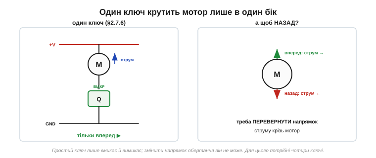
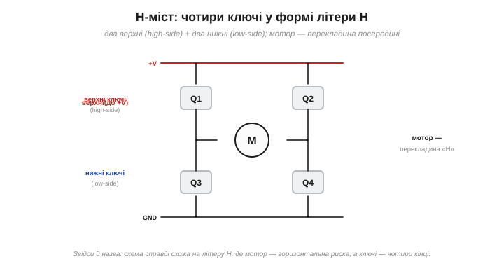
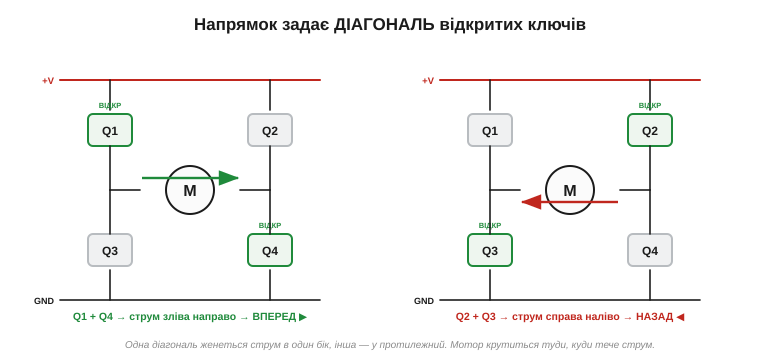
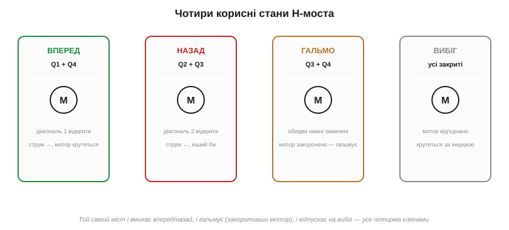
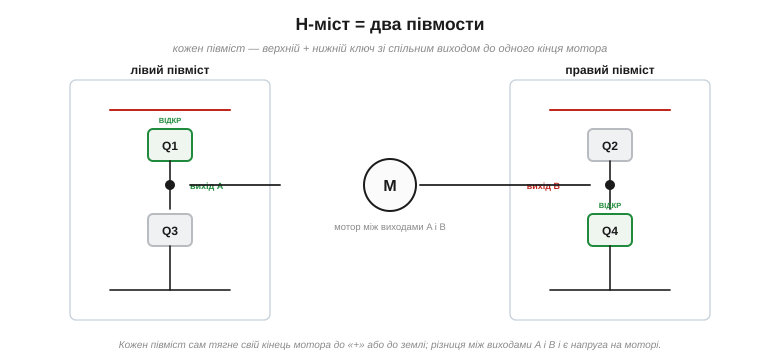
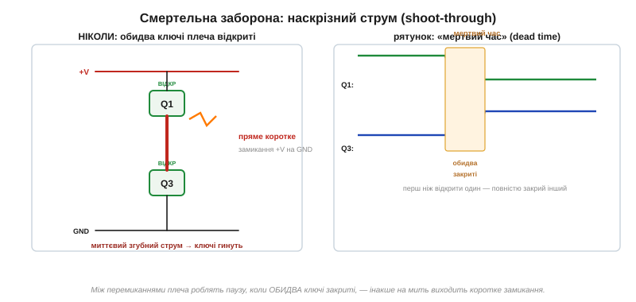
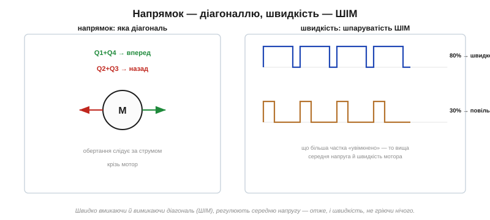

# H-міст: чотири ключі, щоб крутити мотор в обидва боки

Один [силовий MOSFET-ключ](topic:hw-components/mosfet-power-switch) уміє вмикати й вимикати мотор. Та цього мало: іграшковій машинці, дрону, принтеру, роботу-пилососу треба крутити мотор **в обидва боки** — уперед і назад. А простий ключ цього не вміє: він лише перекриває струм, але не може **перевернути** його напрямок. Розв'язок — найзнаменитіша схема силової електроніки, **H-міст**, у якій чотири ключі разом і вмикають мотор, і реверсують, і гальмують.

### Чому одного ключа замало

У [мотора постійного струму](topic:hw-motion/brushed-dc-motor) проста властивість: у який бік крізь нього тече струм, у той бік він і крутиться. Щоб змінити напрямок обертання, треба **поміняти місцями** його два дроти — пустити струм у зворотний бік:


*Один ключ вмикає мотор в один напрямок — і все. Щоб закрутити назад, потрібно перевернути напрямок струму крізь мотор, а на це простий ключ не здатний.*

Можна було б, звісно, фізично перемикати дроти [реле](topic:hw-motion/relay-driver) — але реле повільне, зношується і не дасть плавно керувати швидкістю. Електронне рішення елегантніше: оточити мотор **чотирма** ключами так, щоб самими ключами обирати, куди тече струм.

### Чотири ключі у формі H

Поставимо мотор посередині, а навколо — чотири ключі: два зверху (до «плюса») і два знизу (до землі). Малюнок справді схожий на літеру **H**, де мотор — горизонтальна перекладина:


*Два **верхні** ключі (high-side) з'єднують кінці мотора з «плюсом», два **нижні** (low-side) — із землею. Мотор-перекладина висить між ними. Звідси й назва — H-міст (*H-bridge*).*

Позначмо ключі Q1–Q4: верхній лівий (Q1), верхній правий (Q2), нижній лівий (Q3), нижній правий (Q4). Уся хитрість — у тому, **які** з них відкривати одночасно.

### Напрямок задає діагональ

Щоб мотор закрутився, треба з'єднати один його кінець із «плюсом», а інший — із землею. Це робить **діагональна** пара ключів:


*Відкрили Q1 (верхній лівий) і Q4 (нижній правий) — струм тече крізь мотор зліва направо, мотор крутиться **вперед**. Відкрили іншу діагональ, Q2 і Q3, — струм тече справа наліво, мотор крутиться **назад**.*

Ось і вся ідея реверсу. Одна діагональ (Q1+Q4) жене струм в один бік, протилежна (Q2+Q3) — у зворотний. Жодних механічних перемикань: напрямок обертання обирають тим, **яку діагональ** відкрити. Решта два ключі при цьому замкнені.

### Чотири корисні стани

Окрім «вперед» і «назад», той самий міст уміє ще два корисні режими:


*Вперед (Q1+Q4) і назад (Q2+Q3) — дві робочі діагоналі. **Гальмо**: відкрити обидва нижні ключі (Q3+Q4) — мотор закорочено сам на себе, і він різко гальмує (його ж власна інерція жене струм по колу, а той гаситься). **Вибіг**: усі ключі закрити — мотор від'єднано, він крутиться вільно за інерцією до зупинки.*

Чому закорочений мотор гальмує? Бо коли він обертається за інерцією, то сам стає **генератором** ([наводить напругу](topic:ph-electromagnetism/inductance)); закоротивши його, ми пускаємо цей наведений струм по колу, а він гальмує ротор — те саме «магнітне гальмо» (рекуперативне, лат. *recuperatio* — повернення), що в електромобілях віддає енергію назад у батарею. Тож один міст дає повний набір команд мотору: вперед, назад, стоп-гальмо, вільний вибіг.

### H-міст — це два півмости

Подивімося на схему інакше. Кожен **вертикальний** бік H — це верхній ключ плюс нижній зі спільною точкою посередині, від якої йде дріт до мотора. Така пара зветься **півмостом** (*half-bridge*), а H-міст — просто **два півмости**:


*Лівий півміст (Q1 зверху, Q3 знизу) тягне лівий кінець мотора або до «плюса», або до землі; правий півміст (Q2, Q4) робить те саме з правим кінцем. Напруга на моторі — це **різниця** між виходами двох півмостів.*

Це не просто інша назва — це корисний спосіб думати. Кожен півміст самостійно вирішує, куди тягнути свій кінець мотора: вгору (до «+») чи вниз (до землі). Лівий вгору, правий вниз — струм тече ліворуч-праворуч; навпаки — назад. Півміст — універсальна цеглинка силової електроніки: з нього роблять не лише H-мости, а й імпульсні перетворювачі та інвертори, тож варто впізнавати його в обличчя.

### Смертельна заборона: наскрізний струм

А тепер найважливіше правило, яке відрізняє робочий H-міст від спаленого. **Ніколи не можна відкривати верхній і нижній ключ одного півмоста одночасно.** Бо це з'єднало б «плюс» із землею **прямо** крізь два відкриті ключі — миттєве коротке замикання живлення:


*Якщо Q1 і Q3 відкриті разом, струм летить із «+» прямо в землю крізь обидва ключі, обминаючи мотор, — це **наскрізний струм** (*shoot-through*). За мить він спалює ключі. Рятунок — **мертвий час** (*dead time*): перш ніж відкрити один ключ плеча, повністю закривають інший, лишаючи коротку паузу, коли закриті **обидва**.*

Ця біда — **наскрізний струм** (*shoot-through*) — найчастіша причина «димку» в саморобних мостах. Вона особливо підступна під час **перемикання**: ключ закривається не миттєво (затвор — це [ємність](topic:hw-components/gate-capacitance)), і якщо одразу відкрити протилежний, на коротку мить обидва будуть прочинені. Тому в керуванні мостом завжди закладають **мертвий час** — паузу, коли обидва ключі плеча гарантовано закриті, перш ніж відкрити наступний. Готові драйвери мостів роблять це автоматично; у саморобних мостах про мертвий час дбають окремо, бо ціна помилки — згорілі ключі.

> ⚙️ **Як це в логіці.** Як з одного ШІМ зробити два протилежні сигнали з гарантованою паузою «обидва закриті», скільки той мертвий час має тривати (t_dead > час вимикання ключа) і чому це довіряють апаратному комплементарному ШІМ, а не двом ніжкам уручну — в [алгоритмічній вставці «Наскрізний струм і мертвий час»](topic:hw-motion/h-bridge/proj-shoot-through.md).

### Зведена таблиця керування

Усі команди мосту зручно тримати однією таблицею (× — відкритий ключ):

```
режим        Q1(вл)  Q2(вп)  Q3(нл)  Q4(нп)   що з мотором
вперед         ×       ·       ·       ×       струм →, крутиться вперед
назад          ·       ×       ×       ·       струм ←, крутиться назад
гальмо         ·       ·       ×       ×       закорочено знизу — гальмує
вибіг          ·       ·       ·       ·       від'єднано — вільний хід
─────────────────────────────────────────────────────────────────
ЗАБОРОНЕНО:  Q1+Q3 разом  або  Q2+Q4 разом  → наскрізний струм!
```

Зверніть увагу на структуру: у кожному **дозволеному** рядку в одному плечі відкрито щонайбільше один ключ — це і є страховка від наскрізного струму. Два верхні рядки реверсують мотор, два нижні зупиняють (різко чи плавно), а останній рядок — те, чого не можна ніколи. Прошивка, що керує мостом, по суті лише вибирає рядок із цієї таблиці (а для швидкості ще й «миготить» обраним рядком за ШІМ).

### Швидкість — широтно-імпульсним керуванням

Лишилося навчитися керувати не лише напрямком, а й **швидкістю**. Тут на сцену виходить **[широтно-імпульсне керування](root:embedded/pwm-power-control)** (ШІМ): діагональ відкривають не наглухо, а швидко вмикають-вимикають, міняючи частку «увімкненого» часу:


*Напрямок задає вибір діагоналі, а швидкість — **шпаруватість** ШІМ: 80 % «увімкнено» — мотор крутиться майже на повну, 30 % — повільно. Мотор зі своєю інерцією усереднює імпульси в плавне обертання, а ключі при цьому майже не гріються (вони або повністю відкриті з малим Rds(on), або закриті).*

Чому саме ШІМ, а не плавне зменшення напруги? Бо плавно «придушити» струм лінійним елементом означало б розсіювати надлишок у тепло — гаряче й марнотратно. А ключ, що то повністю відкритий (малий [опір Rds(on)](topic:hw-components/rds-on), мало тепла), то повністю закритий, майже не гріється; мотор же зі своєю механічною інерцією й електричною індуктивністю сам згладжує імпульси в рівне обертання. Тож H-міст плюс ШІМ дають **повне** керування мотором: напрямок — діагоналлю, швидкість — шпаруватістю, плюс гальмо й вибіг, — і все це холодними, ефективними ключами.

### Куди дівається струм у паузі ШІМ

У швидкого вмикання-вимикання є наслідок, який не можна оминути. Мотор — це передусім **котушка** (обмотка), а [котушка не дає струмові урватися миттєво](topic:ph-electromagnetism/inductance): щойно діагональ закрилася, накопичений в обмотці струм мусить кудись текти й далі. Якщо не дати йому дороги, він викине на ключах гострий стрибок напруги — той самий [руйнівний «брик» індуктивності](root:embedded/flyback-protection), що душить кидок на реле й діодах, — і проб'є транзистори.

Рятунок схований у самій [будові силового MOSFET](topic:hw-components/mosfet-structure): між його витоком і стоком уже «вбудовано» діод (паразитний body-діод). Чотири такі діоди утворюють для індуктивного струму замкнене кільце, по якому він спокійно добігає в паузі ШІМ, поки знову не відкриється діагональ. Цей струм, що замикається сам на себе, інженери звуть **струмом самоходу** (freewheeling). Тому в H-мості діоди — не зайва пересторога, а обов'язкова частина схеми: без них індуктивний мотор спалив би ключі за лічені цикли.

Тонкість у тому, що body-діод відкривається лише з падінням близько 0.7 В і на амперному струмі помітно гріється. Тому в «дорослих» мостах роблять хитро: у паузі замість того, щоб віддавати струм діодові, на коротку мить відкривають **протилежний** MOSFET — його малий опір пропускає той самий струм майже без втрат. Це зветься **синхронним випрямленням**; саме воно робить сучасні мости такими холодними. Але вмикати цей зустрічний ключ можна лише витримавши паузу-затримку, інакше знову відчиниться смертельна діагональ — усе впирається в ту саму дисципліну мертвого часу, що й вище.

### Чому саме MOSFET і що ще треба

H-мости будують і на біполярних транзисторах, але MOSFET тут майже завжди кращий: [малий опір у відкритому стані](topic:hw-components/rds-on) означає мало тепла на великому струмі мотора, а [керування полем](topic:hw-components/field-control) і [висока швидкість](topic:hw-components/gate-capacitance) ідеально пасують до ШІМ. Прикиньмо на числах. Мотор тягне 3 А; на MOSFET із Rds(on) = 20 мОм у відкритому стані розсіюється P = I²·R = 9·0.02 ≈ 0.18 Вт — ключ ледь теплий. Біполярний на тому самому струмі тримав би падіння Vce(sat) ≈ 0.3 В, тобто P = 0.3·3 ≈ 0.9 Вт — уп'ятеро більше тепла, та ще й постійний струм бази на додачу. На амперних струмах ця різниця між «опором» і «падінням» вирішує все: MOSFET лишається холодним там, де біполярний просив би радіатора. Та один практичний клопіт варто назвати окремо — **верхні** ключі: щоб відкрити верхній N-MOSFET, на його затвор треба подати [напругу вище за «плюс» живлення](topic:hw-power/high-side-switch) — а це окремий клопіт, який розв'язують спеціальні мікросхеми-драйвери затворів. Тому на практиці H-міст рідко паяють із голих транзисторів — беруть готову мікросхему-драйвер, що ховає всі ці тонкощі всередині; саме про такі модулі — окрема компонентна вставка.

> 🔌 **Готова плата.** Що насправді стоїть на модулі-драйвері мотора як **клас** і чим класичний L298-клас (біполярний) відрізняється від сучасних MOSFET-драйверів — у компонентній вставці [«Плата драйвера мотора: L298-клас і сучасні MOSFET-драйвери»](topic:hw-motion/h-bridge/comp-h-bridge-board.md). А розпіновку такого модуля, обов'язкову спільну землю й готовий приклад керування з коду — в [інтерфейсній вставці «Розпіновка й підключення плати драйвера мотора»](topic:hw-motion/h-bridge/api-h-bridge-board.md).

### Де живуть H-мости

Варто знати, наскільки ця схема всюдисуща. H-міст крутить колеса й гусениці кожного **робота** й радіокерованої машинки, рухає каретку й валики **принтера**, відкриває-закриває заслінки й клапани, гойдає голку швейної машини, керує **електроінструментом** і кухонною технікою — словом, живе всюди, де щось обертається в обидва боки під керуванням електроніки. А підрісши на один півміст, ідея веде далі: **три** півмости разом керують трифазним [безколекторним (BLDC) двигуном](topic:hw-motion/bldc-motor), що стоїть у дронах, електросамокатах, вентиляторах і дисководах. І потужний [**кроковий** двигун](topic:hw-motion/stepper-motor) (молодший родич якого живиться через [драйвер-збірку ULN](topic:hw-components/bjt/comp-darlington-uln.md)) теж керується мостами — по одному на кожну обмотку. Тобто, зрозумівши H-міст, ви тримаєте в руках ключ до майже всієї електроніки руху: від іграшкового моторчика до тягового привода електромобіля — скрізь усередині ті самі півмости з холодними MOSFET-ключами, лише різного калібру.

> 🔧 **Навіщо це.** H-міст — стандартна відповідь на питання «як крутити мотор в обидва боки й керувати швидкістю». Запам'ятайте суть: чотири ключі, **напрямок — вибором діагоналі** (Q1+Q4 проти Q2+Q3), **швидкість — ШІМ**, плюс режими гальма (закоротити мотор) і вибігу. І головне правило безпеки: **ніколи не відкривайте обидва ключі одного плеча разом** — це наскрізний струм, що миттєво палить міст; між перемиканнями завжди має бути мертвий час. На практиці беріть готовий драйвер моста, а не голі транзистори.

### H-міст — серце силової електроніки

За цією схемою — силовий MOSFET-ключ у його найкласичнішій ролі: там, де чотири холодні, швидкі, [керовані полем](topic:hw-components/field-control) ключі роблять те, чого не зробить жоден поодинокий вимикач, — крутять мотор в обидва боки з плавним керуванням швидкістю. Якщо [КМОН](topic:hw-digital/cmos) — серце всієї цифрової техніки, то H-міст — серце силової: та сама пара верхнього й нижнього ключа, лише замість логічного нуля й одиниці вона жене амперами в обмотку мотора.

Лишається, щоправда, один практичний борг, на який H-міст наштовхує двічі, — **верхній ключ**. Щоб відкрити верхній N-MOSFET, на його затвор треба подати [напругу вищу за «плюс» живлення](topic:hw-power/high-side-switch), а такої в схемі зазвичай немає; звідки взяти цю «надшинну» напругу й чому готові мости та перетворювачі завжди мають усередині такий фокус — окрема історія високобічного ключа.
