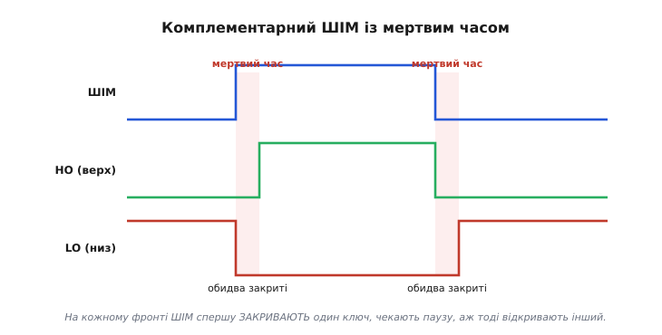
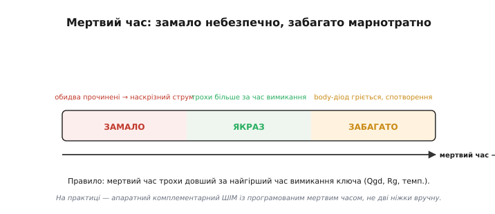

# ⚙️ Наскрізний струм і мертвий час: логіка, що не дає відкрити обидва плечі

У H-мості діє смертельне правило: ніколи не відкривати верхній і нижній ключі одного плеча разом, інакше **наскрізний струм** (англ. *shoot-through*) спалить міст. Сформулювати правило легко — але мікроконтролер не розуміє слів «не роби короткого». Йому треба дати конкретні дії на конкретних входах драйвера, і саме тут ховається весь зміст: **як саме** з одного сигналу ШІМ зробити два протилежні з гарантованою паузою, скільки та пауза має тривати в наносекундах і чому її довіряють залізу, а не рядкам коду в циклі.

### Задача

У півмості два ключі — верхній і нижній. Вони мають бути **протилежні** (один відкритий, інший закритий), але **ніколи не відкриті разом**, навіть на мікросекунду. Підступ у тому, що ключ закривається **не миттєво**: затвор — це [ємність](root:hw-components/gate-capacitance), і поки накопичений заряд стікає крізь опір драйвера, ключ ще лишається прочиненим. Тож якщо тупо зробити сигнали точно протилежними — один інвертувати з іншого, — то на **кожному** фронті буде коротка мить, коли один ключ уже вмикається, а інший ще не встиг закритися. Цієї миті досить: шина живлення замкнеться сама на себе крізь обидва ключі, і амперний сплеск проб'є кристал.

### Ідея: спершу закрий, тоді відкрий

Розв'язок — вставити навмисну паузу, **мертвий час** (англ. *dead time*), коли закриті **обидва** ключі, між вимкненням одного й увімкненням іншого. Це той самий принцип «розірви, перш ніж з'єднати» (англ. *break-before-make*), знайомий із перемикачів і реле: спершу гарантовано відпусти один контакт, і лише тоді торкайся другого.


*З одного ШІМ роблять два сигнали затворів. На фронті вгору: спершу LO→0, пауза, тоді HO→1. На фронті вниз: HO→0, пауза, тоді LO→1. У рожевих смугах закриті обидва ключі — саме ця пауза й рятує міст від наскрізного струму.*

### Спершу — як НЕ треба робити

Спокуса новачка — керувати двома ніжками вручну, інвертуючи одну з одної. У коді це виглядає невинно:

```c
// НЕБЕЗПЕЧНО: наївне комплементарне керування двома GPIO.
// Один ключ — пряма копія ШІМ, інший — інверсія, БЕЗ паузи.
void halfbridge_naive(bool pwm_high) {
    digitalWrite(HO_PIN,  pwm_high);   // верхній = ШІМ
    digitalWrite(LO_PIN, !pwm_high);   // нижній = інверсія ШІМ
}
```

Біда тут навіть не лише у відсутності паузи, а й у тому, що `digitalWrite` — повільний і не одночасний: два виклики виконуються один за одним, з проміжком у кілька тактів. На фронті `pwm_high = true` спершу відкриється верхній ключ, і лише за кілька тактів закриється нижній — а нижній ще й фізично доганяє команду, бо його затвор розряджається не миттєво. Виходить вікно, коли відкриті обидва. На амперах цього досить, щоб «димок» пішов із першого ж циклу.

### Як треба: апаратний комплементарний ШІМ

Правильний шлях — **не** перемикати ніжки програмно, а доручити це периферії. Таймери сучасних мікроконтролерів (STM32, ESP32, та й більшість моторних МК) мають режим **комплементарного ШІМ** із вбудованим регістром мертвого часу: ви задаєте одну шпаруватість, а залізо саме видає два протилежні сигнали HO і LO з гарантованою паузою між фронтами — точно, без тремтіння, незалежно від того, чим зайнятий процесор. Ось як це налаштовують на STM32 (таймер із комплементарними виходами CHx і CHxN):

```c
// БЕЗПЕЧНО: апаратний комплементарний ШІМ із мертвим часом (STM32, TIM1).
// Залізо саме формує HO і LO з паузою — процесор лише задає шпаруватість.
void halfbridge_init(uint32_t pwm_hz, uint8_t dead_ticks) {
    TIM1->PSC = 0;                          // без передільника: лічимо такти ядра
    TIM1->ARR = (SystemCoreClock / pwm_hz) - 1;   // період ШІМ

    // Канал 1 у режимі ШІМ; основний вихід — OC1 (HO), комплементарний — OC1N (LO).
    TIM1->CCMR1 = (6 << 4);                 // OC1M = 110: PWM mode 1
    TIM1->CCER  = TIM_CCER_CC1E             // увімкнути основний вихід (HO)
                | TIM_CCER_CC1NE;           // і комплементарний (LO) — апаратна інверсія

    // Регістр мертвого часу: DTG задає паузу між HO і LO у тактах таймера.
    TIM1->BDTR = (dead_ticks & 0xFF)        // DTG[7:0] — ширина мертвого часу
                | TIM_BDTR_MOE;             // Main Output Enable: пустити сигнали на ніжки

    TIM1->CR1 = TIM_CR1_CEN;                // запустити таймер
}

// Зміна швидкості зводиться до однієї цифри — решту (інверсію + паузу) робить залізо.
void halfbridge_set_duty(uint16_t duty) {   // duty: 0..ARR
    TIM1->CCR1 = duty;
}
```

Уся логіка «спершу закрий, потім — з паузою — відкрий» тут схована в одному регістрі `BDTR`: біти `DTG` задають мертвий час, і таймер автоматично відсуває фронти HO і LO один від одного на цю величину. Прошивка більше не торкається окремих ключів — вона крутить лише шпаруватість, а безпеку забезпечує апаратура, якій байдуже, чи завис у цю мить основний цикл програми.

Варто розуміти, **що відбувається з мотором** саме в ту паузу, коли обидва ключі закриті. Мотор — це котушка, а котушка не дає струмові урватися миттєво: щойно обидва ключі плеча зачинилися, накопичений в обмотці струм мусить кудись далі текти. Він знаходить дорогу крізь паразитний body-діод того ключа, який «у напрямку» струму, і спокійно добігає кільцем, поки не відкриється наступний ключ. Тобто пауза не лишає мотор без струму — лишає його під керуванням повільного діода. І саме звідси випливає, чому паузу не можна роздувати: body-діод відкривається з падінням близько 0.7 В і на амперному струмі помітно гріється, а вихід плеча на цей час «некерований». Чим довша пауза, тим більше енергії згоряє на цьому діоді й тим сильніше спотворюється середня напруга на моторі. Тому мертвий час тримають мінімально достатнім: рівно стільки, щоб ключ устиг закритися, і ані миті більше.

### Скільки тривати паузі: worked-приклад

Мертвий час має **перевищувати найгірший час вимикання ключа** плюс запас:

```
t_dead  >  t_вимк(макс) + запас
t_вимк  ≈  Qgd / I(розряду затвора)   # поки затвор спорожниться нижче порога
```

Час вимикання залежить від [заряду затвора Qgd](root:hw-components/gate-capacitance/math-gate-charge.md), опору затвора Rg і температури. Порахуймо для конкретного випадку й одразу переведімо результат у число тактів таймера, яке йде в регістр.

**Дано:** ключ із зарядом Міллерового плато Qgd = 15 нКл; драйвер стягує затвор крізь сумарний опір Rg = 10 Ом від напруги Vdrive = 10 В; таймер ШІМ тактується від ядра 168 МГц.

```c
// Розрахунок мертвого часу й переведення в такти регістра DTG.
const double Qgd   = 15e-9;     // заряд активної ділянки затвора, Кл
const double Rg    = 10.0;      // опір розряду затвора, Ом
const double Vdrv  = 10.0;      // напруга привода затвора, В
const double f_tim = 168e6;     // частота лічби таймера, Гц

double i_discharge = Vdrv / Rg;             // = 1.0 А  — струм розряду затвора
double t_off       = Qgd / i_discharge;     // = 15 нс  — час вимикання ключа
double t_dead      = 2.0 * t_off;           // = 30 нс  — пауза з 2× запасом
uint8_t dtg = (uint8_t)(t_dead * f_tim + 0.5);  // = round(30e-9 * 168e6) = 5 тактів
```

Покрокова перевірка вручну, по `=`:

```
i_розряду = Vdrive / Rg     = 10 / 10        = 1.0  А
t_вимк    = Qgd / i_розряду = 15e-9 / 1.0    = 15   нс
t_dead    = 2 × t_вимк      = 2 × 15         = 30   нс      (запас ×2)
dtg       = t_dead × f_tim  = 30e-9 × 168e6  ≈ 5    тактів  → у регістр DTG
```

Висновок: при цих параметрах у регістр мертвого часу йде близько п'яти тактів. Узяти менше — ризик наскрізного струму; узяти надміру багато — марні втрати, про які нижче. Запас ×2 тут не примха: реальний t_вимк гуляє з температурою й розкидом партії, тож закладають із похибкою в свій бік.

### Складність і пастки


*Мертвий час налаштовують у вузький коридор: замало — обидва ключі на мить прочинені (наскрізний струм), забагато — довга пауза, коли струм мотора йде крізь повільний body-діод (гріється) і спотворює вихід.*

**Замало → наскрізний струм.** Катастрофічний бік. Навіть кілька наносекунд перекриття на амперах — це сплеск, що руйнує ключі. Завжди закладайте із запасом.

**Забагато → втрати й спотворення.** У паузі індуктивний струм навантаження тече крізь body-діод (повільний, падіння близько 0.7 В → тепло), а вихід на цей час «некерований» — звідси спотворення сигналу, помітне в приводах і звукових підсилювачах. Тож і роздувати паузу не можна: коридор вузький саме тому.

**t_dead не сталий.** Час вимикання гуляє з температурою, силою привода затвора й навантаженням — рахуйте на найгірший випадок, як у прикладі вище із запасом ×2.

**Хибне відмикання за Міллером.** Швидкий стрибок напруги на стоку може крізь ємність затвір-стік знову прочинити «закритий» ключ — і дати наскрізний струм **попри** витриману паузу. Механізм такий: коли парний ключ різко вмикається, напруга на стоку нашого закритого ключа стрибає, і цей стрибок крізь ємність затвір-стік упорскує струм у затвор; якщо опір розряду великий, на ньому наводиться хибна напруга, що піднімає затвор вище порога — і ключ відкривається сам. Тому лікують це сильним [стяганням затвора драйвером](root:hw-power/gate-driver) донизу (малий опір розряду стримує наведену напругу), а в гострих випадках — ще й від'ємною напругою вимкнення, щоб навіть кілька вольт хибного підйому не дотяглися до порога.

> 🔧 **Навіщо це.** Мертвий час — це маленька пауза, що відділяє робочий міст від спаленого. Запам'ятайте логіку: на кожному фронті **спершу закрий, потім — з паузою — відкрий**, а саму паузу бери трохи довшою за найгірший час вимикання ключа (порахуйте t_вимк ≈ Qgd / i_розряду й додайте запас). І головне: довіряйте формування цих двох сигналів **апаратному** комплементарному ШІМ чи готовому драйверу, а не ручному `digitalWrite` двох ніжок у циклі — бо ціна одного збою тут вимірюється згорілими транзисторами.
