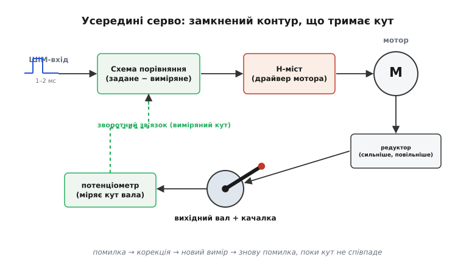
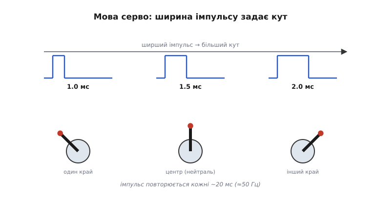
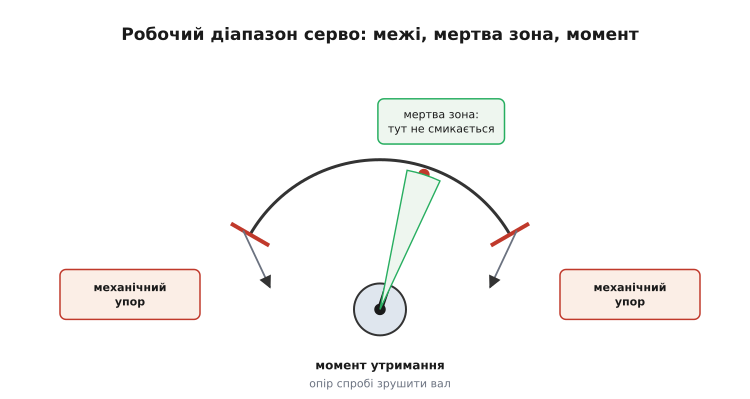
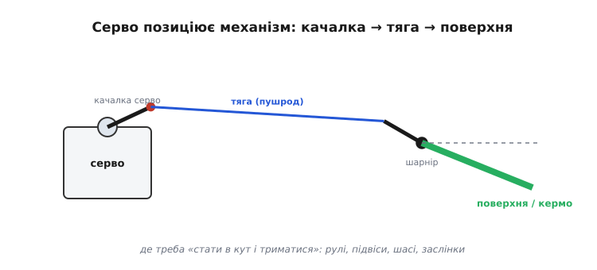

# Сервопривід

Звичайному моторові ти задаєш швидкість — подав напругу, він закрутився і крутиться, поки живлення є. Але часто-густо потрібне зовсім інше: щоб вал став під **певний кут** і **тримав** його, опираючись зовнішнім силам. Кермо літака має відхилитися рівно на 12° і не «віддутися» назад зустрічним потоком; підвіс камери має втримати горизонт, хоч би як хитався апарат; роборука має поставити захват під заданим кутом і не просісти під вагою. Голий мотор цього не вміє: дай йому напругу — він провернеться надто далеко; зніми — він безвольно піддасться першому ж поштовху.

Сервопривід (від латинського *servus* — «слуга»: механізм-слуга, що слухняно тримає задане положення) — це і є розв'язок. Усередині він ховає невеличкий мотор, але обгортає його так, що ти командуєш уже не швидкістю, а **кутом**. Найдешевший і найпоширеніший різновид — хобі-серво з радіокерованих моделей: пластикова коробочка завбільшки із сірникову, три проводи назовні, а всередині — повноцінний замкнений контур керування. Розберімо від першопричини, як ця коробочка перетворює короткий електричний імпульс на стійко втримуваний кут.

## Чому самого мотора не досить

Уявімо просту спробу позиціювати вал без жодної хитрості: подаємо на мотор напругу впродовж рівно відміряного часу, щоб він провернувся «куди треба». Ця ідея розсипається миттєво. Навантаження на валу щоразу інше — і за одну й ту саму мілісекунду напруги мотор провернеться то далі, то ближче. Заряд батареї просів — обертів менше. На валі повисло важче кермо — мотор ледь зрушив. А коли напругу зняли, ніщо не тримає кут: поштовх, потік повітря, вага — і вал поїхав.

Корінь біди в тому, що ми керуємо **наосліп**: задаємо вхід (напругу, час) і сподіваємося на вихід (кут), ніяк не перевіряючи, що насправді сталося. Таке керування без перевірки результату називають [розімкненим контуром](root:embedded/open-vs-closed-loop) — і воно безсиле там, де результат залежить від непередбачуваних збурень.

Вихід один: треба **виміряти справжній кут вала** і весь час порівнювати його з бажаним. Якщо вал не дійшов — піджени мотор уперед; перейшов — відкрути назад; став точно — спинися й тримай. Це і є [замкнений контур зі зворотним зв'язком](root:embedded/open-vs-closed-loop): вихід вимірюється й повертається на вхід, щоб система сама виправляла власну похибку. Серво — це такий контур, відлитий у залізо й присвячений одному-єдиному валу.

## Контур усередині коробочки

Розкрутімо хобі-серво подумки на чотири частини й простежмо, як вони замикаються в кільце.


*Маленький мотор через редуктор крутить вихідний вал із качалкою; потенціометр на тому ж валу міряє його справжній кут; схема щомиті порівнює заданий кут із виміряним і підкручує мотор, поки різниця не зникне. Те саме кільце «помилка → корекція → вимір», що й у будь-якому регуляторі, лише в мініатюрі.*

**Мотор** усередині — звичайний маленький [колекторний двигун](topic:hw-motion/brushed-dc-motor): дешевий, крутиться швидко, але слабкий і неточний сам по собі. Його завдання — лише давати обертання; точність забезпечить контур навколо.

**Редуктор** — набір шестерень, що перетворює швидке слабке обертання моторчика на повільне, але сильне обертання вихідного вала. Це не дрібниця, а ключ до моменту: [зубчаста передача](topic:hw-motion/gears-transmission) міняє швидкість на силу в тій самій пропорції, у якій зменшує оберти. Зменшив швидкість у 200 разів — у стільки ж разів виріс момент на валі. Саме редуктор робить кволий моторчик здатним утримувати кермо проти потоку.

**Потенціометр** — це орган чуття серво. Механічно він з'єднаний із вихідним валом, тож, повертаючись разом із ним, віддає напругу, пропорційну до кута. По суті це [подільник напруги зі змінним відведенням](topic:hw-components/potentiometer): кут вала → положення повзунка → напруга. Ця напруга і є «виміряним кутом», який схема порівнює із заданим. Без неї серво було б сліпим і нічим не відрізнялося б від голого мотора.

**Схема порівняння** — мозок контуру. Вона бере дві величини: задану (із вхідного імпульсу, про що нижче) і виміряну (з потенціометра), знаходить **різницю** — помилку — і за нею вирішує, куди й як сильно крутити мотор. Велика помилка → жени мотор жваво; мала → підкручуй обережно; нульова → стій. Це найпростіший [пропорційний регулятор](root:embedded/proportional-control): сила корекції пропорційна до того, наскільки ми не дійшли до цілі.

Між схемою й мотором стоїть ще один обов'язковий вузол — **драйвер**, бо слабка логіка не може живити мотор напряму. Серво має крутити вал у **обидва** боки (і доганяти ціль, і відкручуватися назад), а на це здатний лише [H-міст](topic:hw-motion/h-bridge) — чотири ключі, що подають на мотор напругу то однієї, то іншої полярності. Полярність задає напрям обертання, а наскільки довго ключі відкриті — швидкість. Схема порівняння керує саме цим мостом.

Тепер кільце замкнулося. Задали кут → схема порівняла з виміряним → H-міст крутнув мотор у потрібний бік → редуктор провернув вал → потенціометр виміряв новий кут → схема порівняла знову. Кільце крутиться сотні разів на секунду, аж поки помилка не впаде до нуля; тоді мотор завмирає, а серво **активно тримає** кут. Штовхни вал — потенціометр одразу засіче відхил, схема побачить помилку й верне вал на місце. Саме тому серво опирається силам, а не піддається їм.

> 🔧 **Навіщо це.** Тримай у голові одну межу: мотор крутить (керуєш швидкістю), серво позиціює (керуєш кутом і утриманням). На чужому пристрої це одразу підказує, що чим керується. Побачив серво на кермі чи захваті — ним правлять **кутом** через внутрішню петлю; побачив мотор на гвинті — ним правлять **обертами**. І коли серво «не тримає» — підозрюй контур: найчастіше винні зношений потенціометр (бреше про кут) або слабке живлення (мостові ключі недодають).

## Чому ширина імпульсу = кут

Лишилося найдивніше: як ззовні сказати серво потрібний кут? Не аналоговою напругою, не цифровим числом, а **тривалістю короткого імпульсу**. Це історична умовність радіокерованих моделей, що пережила десятиліття й стала спільною мовою.

Сигнал такий: серво раз на ~20 мс чекає коротенький додатний імпульс, і **його ширина** кодує кут. Імпульс ≈1.0 мс ставить вал в один край ходу, ≈1.5 мс — у центр (нейтраль), ≈2.0 мс — в інший край. Усе між ними — пропорційно: 1.25 мс → чверть ходу від центру в один бік, і так далі.


*Ширший імпульс — більший кут. Серво вимірює тривалість додатного імпульсу й ставить вал у пропорційну позицію, повторюючи це кожні ~20 мс (≈50 Гц).*

Звідки взявся саме такий код? Зсередини серво ширину імпульсу легко перетворити на ту саму **напругу-уставку**, яку треба порівняти з потенціометром: проста схема (а в сучасних серво — мікроконтролер) міряє тривалість імпульсу й видає пропорційне «задане». А далі вже працює знайомий контур. Тобто ширина імпульсу — це просто зручний для радіоканалу спосіб передати одне число: кут. Те, що сигнал — це послідовність імпульсів різної ширини, робить його [широтно-імпульсним](topic:hw-arch/pwm-on-mcu); тільки тут важлива не середня потужність, як у керуванні яскравістю, а сама **ширина** як носій кута.

Чому ~20 мс між імпульсами? Це спадок аналогових приймачів, що по черзі роздавали імпульси кільком серво в межах одного 20-мілісекундного кадру. Серво й досі очікують свіжий імпульс приблизно з такою частотою; зникнуть імпульси надовго — і серво або обм'якне, або триматиме останній кут, залежно від моделі.

Прикиньмо чутливість цього коду. Повний хід — це ширина від 1.0 до 2.0 мс, тобто 1000 мкс на ~180° (типовий діапазон). Звичайна апаратура розрізняє ширину з кроком близько мікросекунди:

```
діапазон ширини   = 2000 − 1000 = 1000 мкс
крок апаратури    ≈ 1 мкс
градацій кута     ≈ 1000 мкс / 1 мкс = 1000
крок кута         ≈ 180° / 1000 ≈ 0.18°
```

Близько тисячі помітних положень на весь хід, по ~0.18° кожне — для керма чи підвісу цього з головою. Але це й стеля: тонше за ~0.18° класичним RC-сигналом кут не задаси, бо дрібніших градацій ширини просто немає.

> 🔧 **Навіщо це.** «1.0–2.0 мс, період ~20 мс, центр 1.5 мс» — це мова, якою з серво розмовляють приймач, політний контролер і твоя прошивка. Якщо серво стоїть не по центру в нейтралі — або механіка зміщена, або уставку 1.5 мс треба підправити (трим). А якщо кут «грубуватий» і дрібних рухів бракує — впираєшся саме в ту тисячу градацій; тонше дадуть хіба цифрові серво з власним протоколом.

## Робочий приклад: формуємо імпульс на мікроконтролері

Сформувати такий сигнал самому неважко: треба раз на 20 мс підняти ногу мікроконтролера на потрібну кількість мікросекунд. Ось прямий спосіб «у лоб» на C — для перевірки серво на столі:

**Умова.** Один вивід, до нього під'єднано серво. Поставити вал у центр (1500 мкс), тримаючи період 20 мс.

:::tabs

```cpp
// Спосіб «у лоб»: delayMicroseconds() і digitalWrite() як в Arduino.
#include <Arduino.h>

const int SERVO_PIN = 9;
const int FRAME_US  = 20000;   // період кадру, 20 мс = 50 Гц

// один імпульс заданої ширини + добивання кадру до 20 мс
void servoPulse(int pin, int width_us) {
    digitalWrite(pin, HIGH);
    delayMicroseconds(width_us);          // ширина = кут
    digitalWrite(pin, LOW);
    delayMicroseconds(FRAME_US - width_us);  // решта кадру — пауза
}

void setup() {
    pinMode(SERVO_PIN, OUTPUT);
}

void loop() {
    servoPulse(SERVO_PIN, 1500);   // 1500 мкс → нейтраль (центр)
}
```

```python
# MicroPython: апаратний ШІМ сам тримає і частоту, і ширину імпульсу.
from machine import Pin, PWM

servo = PWM(Pin(9), freq=50)   # 50 Гц = кадр 20 мс

def servo_pulse(width_us):
    servo.duty_ns(width_us * 1000)   # ширина = кут; 1500 мкс → нейтраль

servo_pulse(1500)   # 1500 мкс → нейтраль (центр); залізо повторює кадр саме
```

:::

Перетворити бажаний кут на ширину — пряма лінійна підстановка між 1000 і 2000 мкс:

:::tabs

```cpp
// кут 0..180°  →  ширина 1000..2000 мкс
int angleToWidth(int deg) {
    if (deg < 0)   deg = 0;
    if (deg > 180) deg = 180;
    return 1000 + (long)deg * 1000 / 180;   // 0°→1000, 90°→1500, 180°→2000
}
```

```python
# кут 0..180°  →  ширина 1000..2000 мкс
def angle_to_width(deg):
    deg = max(0, min(180, deg))
    return 1000 + deg * 1000 // 180   # 0°→1000, 90°→1500, 180°→2000
```

:::

Перевіримо ключові точки підстановки в думці:

```
deg = 0    → 1000 + 0           = 1000 мкс   (один край)
deg = 90   → 1000 + 90·1000/180 = 1500 мкс   (центр)
deg = 180  → 1000 + 180·1000/180 = 2000 мкс  (інший край)
```

Цей спосіб «у лоб» добрий, щоб ворухнути серво й переконатися, що воно живе, але має ваду: `delayMicroseconds()` **блокує** процесор на весь кадр — нічого іншого програма тим часом не робить. У справжній прошивці імпульс формує апаратний таймер: ти лише записуєш ширину в регістр, а вузол сам тримає й частоту, і тривалість, поки ядро зайняте іншим. Принцип той самий — змінюємо ширину, змінюється кут, — просто формуванням займається залізо, а не цикл затримок.

## Межі, момент і мертва зона

Серво — не ідеальний позиціонувач, і його обмеження прямо випливають з улаштування контуру. Знати їх варто, бо саме об них спотикаються на практиці.


*Хід обмежений механічними упорами; навколо досягнутої цілі є мертва зона, де серво не реагує на мікропомилку; момент утримання — сила, з якою контур опирається спробі провернути вал.*

**Межі ходу.** Вал ходить не на повні 360°, а зазвичай у межах ~180° (часто й менше). Причина подвійна: потенціометр механічно повертається лише на скінченний кут, а на краях стоять механічні упори. Тиснути командою в упор не варто — мотор гудітиме під струмом, упираючись у стінку, гріючись намарно й ризикуючи зірвати шестерню.

**Мертва зона** (*deadband*). Контур навмисне «не помічає» крихітну помилку навколо цілі. Якби він силкувався занулити її геть до нуля, мотор сіпався б навколо позиції без упину — потенціометр завжди трохи шумить, тож ідеального нуля помилки не буває. Тому, щойно вал увійшов у вузьку смужку навколо цілі, схема завмирає. Платою є невелика неточність утримання: серво стоїть «приблизно там», у межах мертвої зони. Вужча зона — точніше, але смикливіше й гарячіше; ширша — спокійніше, але грубіше.

**Момент утримання.** Це сила, з якою серво опирається спробі провернути вал; вимірюють її як силу на плечі качалки — у кілограм-сантиметрах (кг·см). Звідки вона береться? Коли зовнішня сила відхиляє вал, потенціометр засікає появу помилки, і контур жене мотор назустріч — тим сильніше, чим далі вал зігнали. Більший момент означає, що серво твердіше тримає позицію проти потоку чи ваги, — але під навантаженням воно тягне більший струм, бо мостові ключі мусять довше живити мотор.

```
момент на качалці = сила на кінці · довжину качалки
       2 кг·см     =   1 кг       ·    2 см
```

Тобто серво «2 кг·см» утримає 1 кг на плечі 2 см — або 2 кг на плечі 1 см. Подовжив качалку — виграв хід, але **програв** момент у тій самій пропорції. Це та сама зворотна заміна сили на відстань, що й у редукторі всередині.

> 🔧 **Навіщо це.** Серво вибирають за трійцею «момент — швидкість — вага» під конкретну задачу. Замалий момент — і кермо швидкого літака «віддме» назад потоком, бо контур не переборе силу повітря. Замала швидкість — і апарат відповідатиме на команди із запізненням. А мертва зона нагадує: не чекай від хобі-серво ідеального утримання до часток градуса — для цього є інші, дорожчі класи приводів.

## Від вала до поверхні й де це працює

Оберт вихідного вала ще треба **донести** до того, чим керуєш. Робить це проста механіка важелів: на вал насаджують качалку (важіль), від неї жорстка тяга-пушрод іде до качалки керованої поверхні, і та відхиляється на шарнірі.


*Оберт качалки серво через жорстку тягу стає відхиленням поверхні. Довжини качалок задають «передачу»: довша качалка серво або коротша качалка керма — більший хід поверхні, але менша сила.*

Довжини качалок задають передачу між кутом серво й ходом поверхні — і знову це заміна сили на відстань: збільшив хід поверхні довшою качалкою серво — зменшив доступну на ній силу. Тому хід підбирають так, щоб поверхня відхилялася рівно скільки треба, а серво не лишилося без моменту під навантаженням. Окрема дрібниця, що псує точність найкращому серво, — **люфт** у тягах і кріпленнях: будь-яка слабина означає, що поверхня трохи «гуляє» незалежно від вала, додаючи неточності в самому кінці контуру. Тому тяги роблять жорсткими, а з'єднання — щільними.

Де серво працює, видно з його суті — «стань у кут і тримай»: рулі літаків (елерони, руль висоти й напряму), стабілізовані підвіси камер, забірне шасі, скиди вантажу, заслінки й клапани, захвати роборук, навіть мала робототехніка, де кожен суглоб — окреме серво. Скрізь та сама задача: поставити механізм під заданий кут і втримати проти зовнішніх сил. Тож, упізнавши серво на чужому пристрої, питай не «що це», а «який механізм воно позиціює».

Лишається суто практичне про живлення. Серво (а надто кілька) під навантаженням тягне чималий струм ривками — у момент різкого руху споживання стрибає. Тому живлять його від окремої сильної шини, а **не** від тонкого логічного живлення мікроконтролера: інакше ривок серво просадить напругу й перезавантажить контролер у найгірший момент. І ще одне, що зриває новачкам перший запуск: сигнальний провід несе лише імпульс, тож серво й контролер обов'язково мають **спільну землю** — без неї імпульсові «нема відносно чого» бути, і серво смикається хаотично. Три проводи серво — це живлення, земля й сигнал, і земля тут так само важлива, як сигнал.

> 🔧 **Навіщо це.** Найчастіші «таємничі» збої серво — не в самому серво. Смикається без команди — перевір спільну землю. Перезавантажує апарат на різкому русі — серво живиться не від тієї шини. Стоїть не по центру або ходить замало — дивися на механіку тяг і трим, а не міняй серво. Контур усередині надійний; підводить зазвичай те, що навколо нього.

## Підсумок

Сервопривід — це виконавець **кута**, а не швидкості. Усередині хобі-серво ховається маленький [колекторний мотор](topic:hw-motion/brushed-dc-motor), [редуктор](topic:hw-motion/gears-transmission), що міняє його швидкість на силу, [потенціометр](topic:hw-components/potentiometer), що міряє справжній кут вала, і схема, яка через [H-міст](topic:hw-motion/h-bridge) жене мотор так, щоб виміряний кут зійшовся із заданим, — класичний [замкнений контур](root:embedded/open-vs-closed-loop) у мініатюрі. Кут задають тривалістю короткого імпульсу (≈1.0–2.0 мс, центр 1.5 мс, кадр ~20 мс) — спадковою мовою радіокерування, де ширина імпульсу несе одне число. Серво має скінченний хід з упорами, мертву зону навколо цілі й момент утримання, що його платить струмом; а оберт вала донось до поверхні качалками й тягами, не забуваючи про спільну землю та окреме живлення. Усюди, де треба «стати в кут і триматися» проти зовнішніх сил, працює та сама ідея зворотного зв'язку, відлита в дешеву пластикову коробочку.
