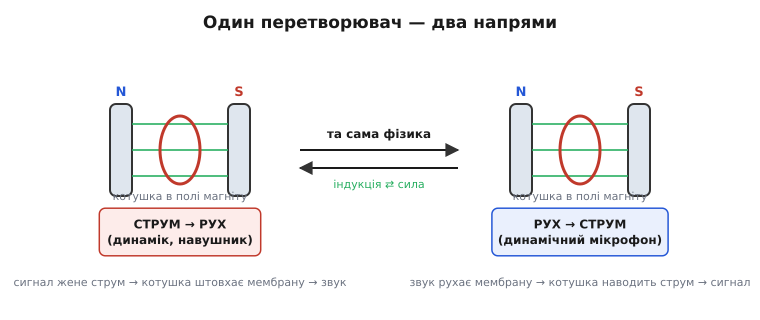
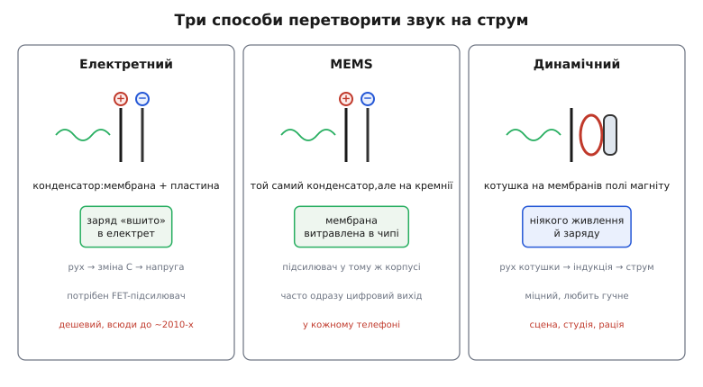
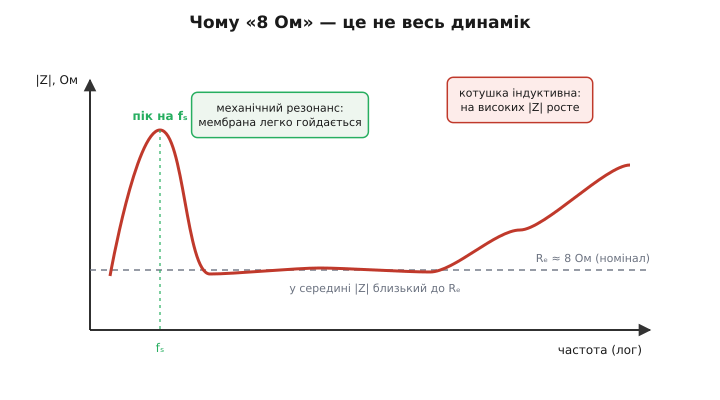

# Мікрофон і динамік

Звук — це коливання тиску повітря: щось рухається, штовхає молекули, і хвиля стиску й розрідження біжить до вуха. Електроніка таких хвиль не чує. Вона знає лише напругу й струм. Тож щоб записати голос, треба перетворити рух повітря на електричний сигнал, а щоб відтворити музику — навпаки, змусити електричний сигнал рухати повітря. Цим займаються два пристрої-близнюки: **мікрофон** (*microphone*, грец. *mikros* — малий, *phone* — звук) і **динамік** (від *dynamic*; також **гучномовець**, *loudspeaker*). Перший перетворює звук на струм, другий — струм на звук.

Найцікавіше в них те, що це не два різні винаходи, а **одна фізика, пущена в два боки**. Перетворювач, який робить із руху струм, майже завжди вміє й зворотне — робити з струму рух. Звідси й починається вся тема.

### Перетворювач, який працює в обидва боки

Уявімо найпростіший пристрій: легка мембрана (тонка плівка), до якої прикріплена дротяна **котушка** (*coil*), а котушка висить у полі постійного магніту. Що буде, якщо мембрану штовхне звукова хвиля? Котушка зрушить разом із мембраною, перетне магнітні лінії — і в дроті наведеться напруга. Це **електромагнітна індукція**: рух провідника в полі породжує струм.

> Рух провідника крізь магнітне поле наводить у ньому напругу, пропорційну швидкості руху й силі поля (закон Фарадея). Зупинився рух — зникла й напруга: реагує саме рух, а не положення. Це той самий принцип, на якому стоять генератори струму. Деталі — [електромагнітна індукція](root:ph-electromagnetism/electromagnetic-induction).

А тепер пустимо процес назад. Подамо в ту саму котушку струм від підсилювача. Котушка зі струмом у магнітному полі відчуває **силу** (силу Ампера) — і починає рухатися, тягнучи за собою мембрану. Мембрана штовхає повітря — народжується звук. Той самий шматок заліза й міді: жени струм — отримаєш рух; жени рух — отримаєш струм.

*Котушка в полі магніту працює в обидва боки. Зліва — динамік: сигнал жене струм, котушка штовхає мембрану, виходить звук. Справа — динамічний мікрофон: звук рухає мембрану, котушка наводить струм. Це не два пристрої, а одне перетворення, прочитане в різних напрямах.*

Ця **взаємність** (*reciprocity*) — не просто красива симетрія. Вона буквальна: дешевий навушник можна ввімкнути як мікрофон, він тихо, але чутиме. Динаміки в домофонах часто так і працюють — то говорять, то слухають тією самою мембраною. Тримаючи в голові цю двобічність, легко зрозуміти будь-який мікрофон чи динамік: треба лише спитати, **який фізичний місток** з'єднує тут рух і електрику.

Місток буває двох сортів. Перший — щойно описана **індукція** (котушка в полі). Другий — **змінна ємність**: рух зближує чи розводить дві пластини конденсатора, а від відстані залежить його ємність. На цих двох ідеях стоять усі три головні типи мікрофонів.

### Три типи мікрофонів

#### Електретний — конденсатор із вшитим зарядом

Найпоширеніший дешевий мікрофон побудований не на котушці, а на **конденсаторі**. Конденсатор — це дві пластини, розділені проміжком, і його ємність тим більша, чим ближче пластини одна до одної.

> Конденсатор — два провідники з ізолятором між ними; він тримає розділений заряд. Ємність C показує, скільки заряду він набирає на вольт, і росте, коли пластини зближуються. На сталому заряді менша відстань означає більшу C і меншу напругу на ньому. Деталі — [конденсатор](root:hw-components/capacitor).

Зробімо одну з пластин рухомою й тонкою — це й буде мембрана. Звук хитає мембрану, відстань між пластинами міняється, отже міняється ємність. Якби на пластинах сидів **сталий заряд**, то зміна ємності одразу давала б зміну напруги (бо за сталого заряду напруга й ємність зв'язані обернено). Так звукова хвиля перетворюється на електричний сигнал.

Лишається питання: звідки взяти той сталий заряд? Класичний конденсаторний мікрофон вимагав зовнішньої високої напруги (так зване фантомне живлення). Прорив зробив **електрет** (*electret* — стягнення *electricity* + *magnet*) — матеріал, у який заряд «вшито» назавжди, як магніт назавжди тримає намагніченість. Електретна плівка несе власне поле й не потребує зовнішньої напруги. Тому **електретний мікрофон** (*electret condenser microphone*, ECM) дешевий і крихітний — десятиліттями він стояв у телефонах, диктофонах, гарнітурах.

Є нюанс: сигнал такого конденсатора дуже слабкий і знятий із дуже високого опору. Підключити його прямо до підсилювача не можна — сигнал просяде. Тому **всередині капсуля сидить крихітний транзистор** (польовий, FET), що служить буфером: він не підсилює за напругою сильно, але узгоджує високий опір джерела з рештою кола. Через це електретний мікрофон не суто пасивний — йому треба підвести живлення на той транзистор (зазвичай кілька вольт через резистор).

#### MEMS — той самий конденсатор, але вирізьблений у кремнії

**MEMS-мікрофон** (*micro-electro-mechanical system* — мікроелектромеханічна система) працює за рівно тим самим принципом змінної ємності, що й електретний. Різниця — у виготовленні. Замість окремої плівки й металевої пластини мембрану й нерухомий електрод **витравлюють прямо в кремнієвому чипі** тими ж методами, якими роблять мікросхеми.

Звідси випливає все інше. Бо мікрофон тепер — кремнієвий кристал, поруч на тій самій підкладці ставлять і підсилювач, і часто аналого-цифровий перетворювач. Тому багато MEMS-мікрофонів мають **одразу цифровий вихід**: із корпусу виходить не тихий аналоговий сигнал, а готовий потік бітів, який не боїться наведень на шляху до процесора. Розміри — частка міліметра, і однакові від штуки до штуки, бо народжуються з одного фотошаблону. Саме тому MEMS витіснив електрет із телефонів, ноутбуків, навушників: туди, де треба мікроскопічний розмір і кілька мікрофонів поруч (для придушення шуму й визначення напрямку звуку).

#### Динамічний — котушка в полі, без живлення

**Динамічний мікрофон** (*dynamic microphone*) — це той самий взаємний перетворювач, прочитаний як «рух → струм»: мембрана з котушкою в полі магніту. Звук рухає мембрану, котушка перетинає поле, наводиться напруга. Жодного заряду, жодного живлення, жодного транзистора всередині — пасивний пристрій, що сам виробляє свій сигнал.

За це платять чутливістю: сигнал динамічного мікрофона слабший і він гірше ловить найтихіші, найвищі звуки, ніж конденсаторний. Зате він **дуже міцний і не боїться гучного**: котушку важко перевантажити, її не зіпсує ні вологе дихання співака, ні ревіння підсилювача поруч. Тому динамічний мікрофон — це сцена, вокал наживо, барабани, рації. Там, де треба не делікатність, а надійність під громом.

*Електретний і MEMS стоять на одному принципі — конденсатор зі змінною відстанню між пластинами, тому обидва потребують підсилювача поруч; різниця лише в тому, що MEMS вирізьблений у кремнії й часто має цифровий вихід. Динамічний стоїть на індукції: котушка в полі, ніякого живлення, зате міцність і любов до гучного.*

Підсумок різниці короткий. Електретний і MEMS — **конденсаторні**: ловлять звук зміною ємності, тому чутливі й тихі, але потребують живлення й підсилювача. Динамічний — **індукційний**: сам виробляє струм, тому простий і витривалий, але менш чутливий. Вибір між ними — це вибір між делікатністю та міцністю.

### Динамік: котушка в полі магніту

Динамік — це перетворювач, пущений у бік «струм → рух», і влаштований він майже як динамічний мікрофон, тільки оптимізований штовхати багато повітря. У зазорі сильного постійного магніту висить **звукова котушка** (*voice coil*) — намотка тонкого дроту на легкому каркасі. До котушки приклеєний **дифузор** (від лат. *diffundere* — розливати; англ. *cone* — конус) — паперовий чи пластиковий конус, що править за мембрану. Підсилювач жене крізь котушку змінний струм — точну копію звукового сигналу. Котушка зі струмом у полі магніту відчуває силу Ампера й рухається туди-сюди в такт сигналу, а приклеєний конус штовхає повітря. Так електричні коливання стають коливаннями тиску — звуком.

Сила, що рухає котушку, пропорційна струму. Тому **гучність керується амплітудою струму**, а висота тону — його частотою: подаси сигнал на 440 герц — конус хитнеться 440 разів за секунду, і вухо почує ноту «ля». Підсилювач лише задає форму струму; всю важку роботу — перетворення цієї форми на рух повітря — робить котушка в полі.

> 🔧 **Навіщо це.** Будь-який пристрій, що має пищати, грати чи говорити — від таймера на плиті до колонки, — усередині має цю саму трійцю: магніт, котушку, мембрану. Керувати ним з мікроконтролера означає подати на котушку (через підсилювач, бо вивід сам стільки струму не дасть) змінний струм потрібної форми: проста прямокутна хвиля дасть писк-«біп», а оцифрований голос — мову. Розуміючи, що рухає конус саме струм у полі, ти знаєш, чому динаміку завжди потрібен підсилювач і чому його не ввімкнути просто з ніжки процесора.

### Чому імпеданс і резонанс

Якщо подивитися на маркування динаміка, там написано щось на кшталт «8 Ом, 5 Вт». Виникає спокуса вважати динамік звичайним резистором на 8 Ом. Але це не так, і розуміння чому — ключ до того, як динамік звучить.

Котушка динаміка — це котушка індуктивності. Її **опір змінному струму** (імпеданс) залежить від частоти, а не тримається стало. До того ж котушка приклеєна до мембрани, а мембрана з підвісом — це механічна коливальна система зі своєю **власною частотою резонансу**, як у будь-якого маятника чи пружини. І ця механіка віддзеркалюється назад в електричне коло: коли мембрана на своїй улюбленій частоті розгойдується найлегше, котушка рухається найбільше — і за рахунок сильної самоіндукції її імпеданс на цій частоті різко підскакує.

*Імпеданс динаміка не сталий. На механічному резонансі fₛ мембрана гойдається найлегше, тож імпеданс дає різкий пік. У середині діапазону |Z| близький до номінального опору котушки Rₑ. На високих частотах індуктивність котушки знову тягне імпеданс угору. «8 Ом» — лише орієнтир десь у середині, а не повна картина.*

Маркування «8 Ом» — це не точне значення на всіх частотах, а **умовний номінал** (*nominal impedance*): приблизний рівень опору котушки десь у робочій смузі, поза піком резонансу. Реальна крива гуляє від цього числа у кілька разів.

Чому це важить на практиці? По-перше, узгодження з підсилювачем. Підсилювач розрахований на певний імпеданс навантаження; підключиш динамік із надто низьким опором — через підсилювач піде завеликий струм, і він перегріється. Тому не можна безоглядно вмикати багато динаміків паралельно: їхні опори складаються як паралельні резистори й сумарний опір падає. По-друге, резонанс визначає, **наскільки низько динамік грає**: маленький динамік має високу частоту резонансу й не відтворює бас — мембрана просто не встигає накачати стільки повітря. Великий сабвуфер має низький резонанс, тому й бере низькі ноти. Власна частота — це нижня межа того, що пристрій узагалі здатен видати.

### Де це працює

Звівши все докупи, легко впізнати ці два перетворювачі всюди. **Мікрофони**: телефони й ноутбуки (зазвичай MEMS, часто кілька — щоб чути напрямок і глушити шум), студійні записи (конденсаторні — за чутливість), сцена й рації (динамічні — за міцність). **Динаміки**: від мініатюрного «пищика» в годиннику до концертних стовпів; навушники — це пара крихітних динаміків біля вуха; зумер у пральній машині — найпростіший динамік, якому досить пищати на одній ноті.

Через взаємність ці ролі іноді змішуються в одному корпусі: домофон і гучний зв'язок то говорять, то слухають однією мембраною; деякі давачі удару й вібрації — це по суті мікрофон, що слухає не повітря, а корпус. А поряд із індукційними та конденсаторними перетворювачами живе ще й третій рід — [п'єзоелектричні](root:ph-condensed/piezoelectric-effect-quartz-resonance) пищалки, де звук народжує не котушка й не ємність, а кристал, що деформується від напруги; на них стоять дешеві зумери й ультразвукові випромінювачі. Але серце класичної пари «мікрофон — динамік» одне: рух і електрика, зв'язані містком поля чи заряду, які вільно перетікають одне в одне в обидва боки.
