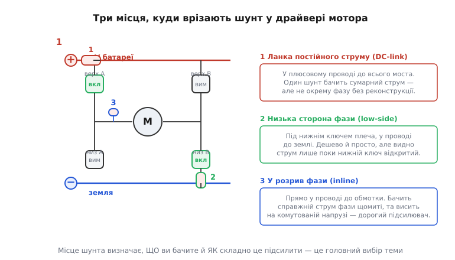
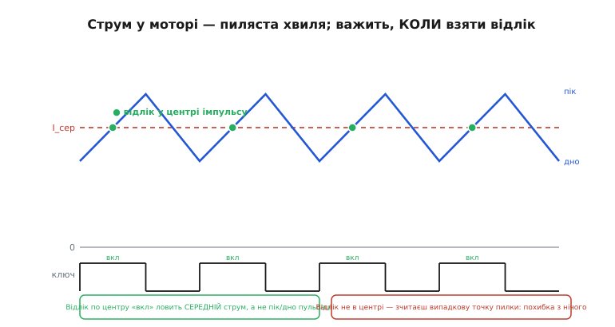
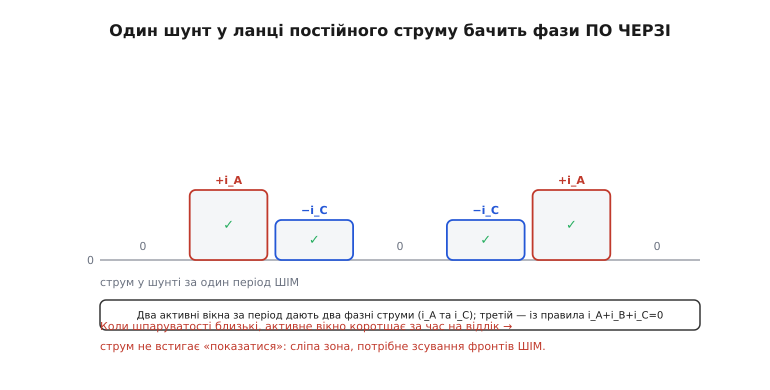
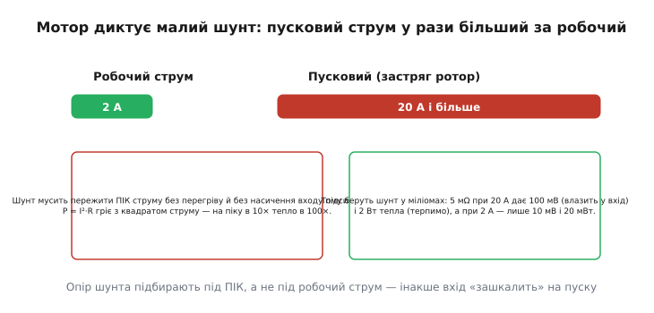

# Вимірювання струму мотора

Керувати мотором наосліп можна — подав напругу й крутиться. Але щойно хочеться керувати ним **добре**, з'ясовується, що напруги мало: треба знати струм в обмотці. Струм — це буквально момент на валу (у мотора момент прямо пропорційний струму), це нагрів ключів, це сигнал «ротор застряг», це основа, на якій стоїть будь-яке точне керування моментом і швидкістю. Тому в кожному серйозному драйвері поряд із силовими ключами сидить вимірювач струму.

І тут одразу впирається головна незручність: струм мотора — не спокійна постійна величина, яку зручно зміряти вольтметром. Драйвер [керує мотором широтно-імпульсною модуляцією](root:hw-motion/dc-motor-driver): силові ключі тисячі разів на секунду вмикаються й вимикаються, тож струм в обмотці не стоїть, а **пиляє** вгору-вниз у такт цим імпульсам, а сама точка, де його можна виміряти, з'являється й зникає разом із перемиканням ключів. Виміряти струм мотора — це не «поставити шунт», а «поставити шунт у правильному місці й зчитати його у правильну мить». Про це «де» і «коли» — уся стаття.

> 🔧 **Навіщо це.** Без вимірювання струму драйвер сліпий до трьох найважливіших речей. Він не спіймає **застрягання**: якщо ротор заклинило, обмотка перетворюється на шматок дроту й тягне пусковий струм, що за секунди спалює ключі — а виявити це можна лише за струмом. Він не дасть **точного моменту**: у полеорієнтованому керуванні момент задають саме струмом, і без його виміру немає зворотного зв'язку. І він не порахує **енергію**: скільки мотор з'їв з батареї, видно тільки з інтеграла струму. Тому вимір струму — не примха, а нервове закінчення драйвера.

## Основа: струм ловлять на шунті

Струм не має клем, до яких причепишся, тож його не міряють прямо — його **перекладають на напругу**. Найпростіший і найточніший переклад: пропустити струм крізь резистор із відомим малим опором і зміряти спад на ньому за [законом Ома](root:hw-analog/ohms-law), V = I·R. Цей резистор, поставлений у коло саме заради вимірювання, звуть **шунтом** (англ. *shunt* — «пустити в обхід»).

> Шунт — малий (одиниці-десятки мΩ), точний силовий резистор у розриві кола; увесь струм тече крізь нього й лишає спад V = I·R, який і міряють. Опір беруть малим, щоб шунт майже не заважав колу й мало грівся; спад виходить крихітний (мілівольти), тож між шунтом і АЦП ставлять диференційний [підсилювач струму](root:hw-sensing/current-monitor), який підніме сигнал до вольтів і відкине синфазну напругу. Загальна фізика цього тракту — переклад «струм → напруга», підсилення, оцифрування — та сама для будь-якого навантаження й розібрана як окрема цеглинка. Тут ми беремо її готовою й дивимося, що додає саме **мотор**.

А додає мотор чимало, і корінь усього — дві його властивості, яких немає у спокійного резистивного навантаження. Перша: мотор **індуктивний**, його обмотка — котушка, тож струм у ній не стрибає миттєво, а плавно наростає й спадає; у такт з імпульсами ШІМ це дає ту саму пилчасту хвилю. Друга: мотор часто **трифазний** (безколекторний) або принаймні реверсивний (через [H-міст](root:hw-motion/h-bridge)), тож «струм мотора» — це не одне число, а струми в кількох обмотках, які ще й міняють напрямок. Обидві властивості й роблять вимір струму мотора окремою наукою.

## Де врізати шунт: три місця, три компроміси

Шунт треба поставити так, щоб крізь нього тік струм мотора. У мостовому драйвері для цього є три принципово різні місця, і вибір між ними — головне інженерне рішення теми. Він визначає не косметику, а дві речі: **що** ви взагалі здатні побачити і **наскільки складним** буде підсилювач.


*Три місця для шунта в драйвері. **1 — ланка постійного струму (DC-link):** один шунт у плюсовому проводі до всього моста, бачить сумарний струм, але окрему фазу віддає лише через реконструкцію. **2 — низька сторона плеча (low-side):** шунт під нижнім ключем, у проводі до землі; дешево й просто, але «бачить» струм лише поки цей нижній ключ відкритий. **3 — у розрив фази (inline):** шунт прямо в проводі до обмотки, бачить справжній струм фази щомиті, та висить на комутованій напрузі, тож потребує найдорожчого підсилювача. Місце шунта — це головний вибір теми.*

Розберімо кожне як наслідок фізики, а не як пункт списку.

**Низька сторона плеча (low-side).** Шунт ставлять між нижнім силовим ключем півмоста й землею. Це найдешевший і найпоширеніший варіант, і причина проста: коли нижній ключ відкритий, обидва кінці шунта сидять майже біля нуля, синфазна напруга мала, тож підсилювачем може бути звичайний недорогий операційний. За цю простоту платять фундаментальним обмеженням: **шунт бачить струм фази лише тоді, коли нижній ключ цієї фази відкритий**. Щойно нижній ключ закрився (а струм фази пішов кільцем крізь верхній ключ або діод), крізь шунт уже нічого не тече — сигнал зник. Тому вимір на низькій стороні прив'язаний до ритму ШІМ: зчитувати струм можна лише у вікні, коли нижній ключ увімкнено, і це вікно диктує, коли саме АЦП має клацнути.

**Ланка постійного струму (DC-link).** Один-єдиний шунт ставлять у спільний провід живлення всього моста — між батареєю й трьома півмостами. Він найдешевший (одна деталь, один підсилювач на весь мотор) і бачить **повний** струм, що йде в мотор, тож ідеальний для захисту від перевантаження й для обліку енергії. Але в цьому проводі струм — це не струм окремої обмотки, а миттєва сума того, що інвертор саме зараз тягне з батареї; яка фаза туди «підключена», залежить від того, які ключі відкриті цю мить. Щоб дістати з нього окремі фазні струми (а полеорієнтованому керуванню потрібні саме вони), доводиться зчитувати шунт **кілька разів за період ШІМ** у різні моменти й математично реконструювати фази. Це окрема, доволі хитра техніка — [реконструкція фаз з одного шунта](root:hw-motion/motor-current-sense/proj-single-shunt-reconstruction.md).

**У розрив фази (inline, high-side фази).** Шунт врізають прямо в провід, що йде до обмотки. Це найчесніший вимір: шунт бачить **справжній струм фази будь-якої миті**, без прив'язки до стану ключів і без реконструкції — саме те, чого хоче точне керування. Розплата — у складності підсилювача: провід фази комутується між плюсом батареї й землею з частотою ШІМ, тож обидва кінці шунта то злітають майже до повного живлення, то падають до нуля, ще й із гострими фронтами. Підсилювач мусить зносити цю велику й швидко змінну **синфазну** напругу й на її тлі виловлювати свої мілівольти різниці — тож для inline беруть спеціальні мікросхеми з високою припустимою синфазною напругою й дуже добрим її придушенням.

Звідси й правило вибору. Треба дешево стерегти мотор від перевантаження й рахувати енергію — досить **одного шунта в ланці постійного струму**. Треба керувати моментом простого мотора недорого — беруть **низьку сторону** й миряться з тим, що вимір прив'язаний до ШІМ. Треба найкраще керування без компромісів (сервопривід, точний робот) — платять за **inline**. Більшість аматорських і промислових драйверів BLDC живуть на низькій стороні або на одному DC-link-шунті саме з міркувань ціни.

> 🔧 **Навіщо це.** Розкриваючи чужий драйвер, за місцем шунтів одразу читаєш його клас і можливості. Один шунт у землі під усім мостом — простий захист, фазних струмів немає. Три шунти під нижніми ключами — повноцінне керування моментом, але з прив'язкою до ШІМ. Три шунти в розрив фаз із дорогими підсилювачами — серйозний сервопривід. А ще це підказує, де шукати проблему: якщо струм «читається» лише на певних шпаруватостях, майже напевно це низька сторона з тісним вікном виміру.

## Пиляста хвиля: чому важить не лише «де», а й «коли»

Тепер до другої, суто моторної тонкості. Струм в обмотці не стоїть на місці. Поки ключ подає на обмотку напругу, струм у ній **наростає** (котушка не пускає його миттєво); щойно ключ прибирає напругу, струм **спадає**. За період ШІМ це повторюється тисячі разів на секунду, тож струм малює **пилчасту хвилю** навколо свого середнього значення — саме це середнє й є «струмом мотора», який нам потрібен, а розмах пилки навколо нього зветься **пульсацією струму** (англ. *current ripple*).


*Струм в індуктивній обмотці наростає, поки ключ увімкнено, і спадає, коли вимкнено, — виходить пилка навколо середнього I_сер. Нам потрібне саме середнє, а не пік чи дно. Ключ (верхня доріжка) показує, коли шунт «бачить» струм. Зелені точки — правильна мить відліку: **центр увімкненого імпульсу**, де миттєвий струм якраз проходить через своє середнє. Клацнеш АЦП не в центрі — зчитаєш випадкову точку пилки й отримаєш похибку буквально з нічого.*

Ось чому вимір струму мотора не можна робити абияк. Якщо просто зчитати шунт у випадкову мить, впіймаєш випадкову точку пилки — то ближче до піку, то до дна, — і показ гулятиме на весь розмах пульсації, хоча середній струм не змінився. Секрет у геометрії трикутника: **у центрі увімкненого імпульсу миттєвий струм якраз дорівнює середньому за період**. Тому відлік прив'язують до ШІМ і беруть його рівно посередині — тоді одна-єдина вибірка чесно віддає середній струм, без жодного усереднення багатьох точок.

Практично це роблять так: таймер, що генерує ШІМ, сам запускає АЦП у потрібну мить. Найзручніший формат — **центрований ШІМ** (англ. *center-aligned*), коли імпульс симетричний відносно середини періоду: тоді «центр увімкненого» для всіх фаз збігається з серединою періоду, і один спільний запуск АЦП ловить середній струм одразу в усіх обмотках. Мікроконтролери для керування моторами вміють це апаратно: таймер видає подію в заданій точці періоду, а АЦП по ній сам оцифровує всі канали струму, не турбуючи процесор.

> 🔧 **Навіщо це.** Це найчастіша прихована пастка новачка в керуванні мотором. Струм ніби міряється, цифри є, але керування «дрижить» або момент нерівний — а причина в тому, що відлік беруть не синхронно з ШІМ, і кожна вибірка сідає на іншу точку пилки. Лік один: запускати АЦП **від таймера ШІМ**, у центрі періоду, а не з циклу програми чи з таймера-переривання «коли доведеться». На низькій стороні до цього додається ще й обмеження: відлік мусить потрапити у вікно, коли нижній ключ відкритий, — а на дуже великій чи дуже малій шпаруватості це вікно стискається (про це нижче).

Є ще одна дрібниця, без якої вимір бреше: **час на заспокоєння після перемикання**. У мить, коли ключ клацнув, по всій платі проходить сплеск завади (гострий фронт напруги наводиться на сенсорні доріжки), і якщо зчитати АЦП одразу, спіймаєш не струм, а дзвін. Тому після фронту витримують коротку паузу — **бланкінг** (англ. *blanking time*), кілька сотень наносекунд, — і лише потім клацають. Центрований відлік цьому допомагає природно: середина періоду — найдальша точка від обох фронтів, тож завада там уже вляглася.

## Один шунт на трифазний мотор: реконструкція фаз

Найдешевший варіант — один шунт у ланці постійного струму — заслуговує окремого погляду, бо саме він показує, наскільки моторний вимір відрізняється від звичайного. Проблема в тому, що трифазному керуванню потрібні **окремі** струми фаз, а один шунт віддає лише їхню суму, «пропущену» через миттєвий стан ключів. Здавалося б, з однієї суми три доданки не дістати — але виручає ритм ШІМ.


*Струм у DC-link-шунті за один період ШІМ. У різні миті інвертор підключає до батареї різні обмотки, тож у різних вікнах крізь шунт тече струм то однієї фази, то іншої. Два активні вікна за період дають два фазні струми (тут +i_A та −i_C), а третій добирають з правила, що сума трьох фазних струмів завжди нульова: i_A + i_B + i_C = 0. Коли ж дві шпаруватості близькі, активне вікно коротшає за час, потрібний АЦП на відлік, — струм не встигає «показатися», виникає сліпа зона, і фронти ШІМ доводиться навмисно розсувати.*

Логіка така. Протягом періоду ШІМ інвертор проходить кілька станів («векторів»), і в кожному стані до батареї через шунт підключена якась одна обмотка. Зчитавши шунт у двох таких вікнах, дістаємо два фазні струми поспіль; третій навіть міряти не треба — він однозначно випливає з фізичного закону, що весь струм, який зайшов у мотор трьома проводами, мусить вийти, тобто **i_A + i_B + i_C = 0**. Одна деталь замість трьох, один підсилювач — і повний набір фазних струмів.

Дешевизна має ціну, і вона повчальна. Активні вікна тривають рівно стільки, скільки різняться шпаруватості фаз. Коли дві фази йдуть майже з однаковою шпаруватістю (а це трапляється щоразу, коли вектор напруги проходить певні кути), відповідне вікно стискається до нуля — коротше за час, який АЦП фізично потребує на відлік разом із бланкінгом. Струм у цьому вікні просто **не встигає показатися**: виникає сліпа зона. Рятунок — навмисне трохи **розсунути фронти ШІМ** у проблемні моменти, розтягнувши вузьке вікно до вимірного, ціною крихітного спотворення напруги. Уся ця математика — які вектори читати, як обробити сліпі зони, як розсувати фронти — живе в прошивці; зібрана вона в окремому [проєкті реконструкції](root:hw-motion/motor-current-sense/proj-single-shunt-reconstruction.md).

## Вибір опору: мотор диктує крихітний шунт

Опір шунта — завжди компроміс: більший R дає більший, легший для виміру сигнал (V = I·R), але й більші втрати, бо весь струм гріє шунт на потужності P = I²·R. У моторі цей компроміс зміщений різко в бік **малого** опору, і винен у цьому пусковий струм.


*Робочий струм мотора скромний, але в мить пуску чи застрягання ротора обмотка перетворюється на голий дріт і тягне у рази більший струм. Шунт мусить пережити цей пік і без перегріву (тепло росте як квадрат струму), і без насичення входу підсилювача (спад не має вилізти за його діапазон). Тому опір беруть під **пік**, а не під робочий струм: 5 мΩ при 20 А дають 100 мВ і 2 Вт, а при робочих 2 А — лише 10 мВ і 20 мВт.*

Річ у тім, що [мотор у першу мить бере пусковий струм](root:hw-motion/dc-motor-driver) у рази більший за робочий: доки ротор не розкрутився й не навів зустрічну напругу, струм обмежує лише крихітний опір обмотки. Той самий сплеск повертається щоразу, коли ротор застрягає. Тож шунт треба розрахувати не на затишний робочий струм, а на цей **пік** — і одразу з двох міркувань. По-перше, за теплом: на піку в десять разів більший струм гріє шунт у сто разів дужче, тож малий опір рятує від згоряння. По-друге, за входом підсилювача: якщо на робочому струмі спад «зручні» 200 мВ, то на десятикратному піку це вже 2 В — підсилювач зашкалить і на найважливішій ділянці (де струм великий і його треба обмежувати) осліпне якраз тоді, коли потрібен найдужче.

**Приклад підбору шунта під драйвер.** Мотор бере робочі 2 А, пусковий/застряглий струм — до 20 А. Вхід підсилювача струму витримує до ±100 мВ. Підбираємо опір під пік, тоді дивимося на тепло й на сигнал у роботі.

```text
Опір під пік (щоб на 20 A спад не виліз за ±100 мВ входу):
  R = V_вх_макс / I_пік = 0.100 В / 20 A = 0.005 Ом = 5 мΩ

Тепло на шунті на піку (шунт має витримати короткочасно):
  P_пік = I_пік² · R = 20² · 0.005 = 400 · 0.005 = 2.0 Вт   → бери шунт ≥ 2 Вт

Сигнал і тепло на робочому струмі 2 A:
  V_роб = I_роб · R = 2 · 0.005 = 0.010 В = 10 мВ           ← малий, тому й потрібен підсилювач
  P_роб = I_роб² · R = 4 · 0.005 = 0.020 Вт = 20 мВт        ← мізер, шунт холодний

Роздільність, якщо підсилювач G = 20, а 12-біт АЦП має Vref = 3.3 В:
  крок_АЦП  = 3.3 / 4096 ≈ 0.806 мВ            (на виході підсилювача)
  крок_V_ш  = 0.806 мВ / 20 ≈ 40.3 мкВ         (зведено до шунта)
  крок_I    = 40.3 мкВ / 0.005 Ом ≈ 8.1 мА     ← найдрібніший помітний струм
```

Тут видно моторну логіку в чистому вигляді: опір задає **пік** (5 мΩ, щоб на 20 А вкластися в ±100 мВ), і саме він робить робочий сигнал крихітним (10 мВ на 2 А) — а отже, підсилювач у моторному драйвері обов'язковий, і без нього АЦП цих міліампер просто не побачить.

## Двонапрямленість: струм тече в обидва боки

Остання моторна особливість, про яку легко забути, поки вона не зіпсує вимір. Мотор — не лампа: струм у його обмотці тече **в обидва боки**. Він реверсивний (H-міст жене струм то ліворуч, то праворуч), а трифазний мотор узагалі має в кожній фазі змінний струм, що півперіоду додатний, півперіоду — від'ємний. Ба більше, мотор часом **віддає** струм назад у джерело: коли він гальмує, то працює генератором, і струм міняє знак навіть при незмінному напрямку обертання.

Звичайний однобічний вимір тут безпорадний: він побачив би лише одну полярність, а другу «обрізав» би в нуль. Тому для струму фази мотора потрібен **двонапрямлений** вимір — такий, що однаково точно віддає і додатний, і від'ємний струм. Технічно це роблять так: на виході підсилювача штучно піднімають нуль на середину діапазону (наприклад, на 1.65 В при живленні 3.3 В), і тоді додатний струм відхиляє показ угору від середини, а від'ємний — униз. Половину діапазону АЦП «жертвують» від'ємній полярності, зате знак струму стає видимим.

> 🔧 **Навіщо це.** Якщо у вимірі струму мотора «нуль» стоїть на самому дні шкали (як у звичайного однобічного монітора), половина картини втрачена: гальмівний і реверсивний струм читатимуться як нуль, а полеорієнтоване керування, якому потрібен знак струму, просто не запрацює. Тому вимірювачі струму для моторів майже завжди двонапрямлені, з нулем усередині діапазону; і калібрувати цей нуль (виміряти показ при I = 0 й запам'ятати) обов'язково — інакше зсув нуля виглядатиме як несправжній сталий струм в один бік.

## Зчитати струм фази в прошивці

Зберемо тракт докупи в коді. Драйвер BLDC на STM32 із трьома шунтами на низькій стороні; таймер ШІМ центрований і в середині періоду запускає АЦП, який оцифровує дві фази одночасно (третю добираємо з i_A + i_B + i_C = 0). Нулі підсилювачів наперед відкалібровані. Обробник переривання «кінець перетворення АЦП» перекладає коди у струми фаз:

:::tabs
```c
// Вимір струму BLDC: 3 шунти low-side, центрований ШІМ, відлік у центрі періоду.
// АЦП запускається таймером ШІМ; тут — обробник «перетворення завершено».
#define R_SHUNT   0.005f     // Ом, шунт під пік струму
#define GAIN      20.0f      // коефіцієнт підсилювача струму
#define VREF      3.3f       // опорна напруга АЦП, В
#define ADC_FS    4096.0f    // повна шкала 12-біт АЦП

// Калібровані «нулі» (код АЦП при I=0): двонапрямлений вимір, нуль ≈ середина шкали.
static uint16_t zero_a = 2048, zero_c = 2048;

// Код АЦП фази → струм у амперах (з урахуванням зсунутого нуля).
static inline float adc_to_current(uint16_t raw, uint16_t zero) {
    float v_out = ((int)raw - (int)zero) * (VREF / ADC_FS);  // напруга від нуля, В
    float v_sh  = v_out / GAIN;                              // спад на шунті, В
    return v_sh / R_SHUNT;                                   // I = V/R (зі знаком)
}

volatile float ia, ib, ic;    // миттєві струми фаз, А

void ADC_ConvCplt_IRQHandler(uint16_t raw_a, uint16_t raw_c) {
    ia = adc_to_current(raw_a, zero_a);   // фаза A з її шунта
    ic = adc_to_current(raw_c, zero_c);   // фаза C з її шунта
    ib = -(ia + ic);                      // фаза B — з правила суми нуль
    // далі: ia, ib, ic → у контур керування моментом (напр. Кларк/Парк для FOC)
}

// Калібрування нулів: викликати при гарантовано знеструмленому моторі.
void calibrate_zero(uint16_t raw_a, uint16_t raw_c) {
    static uint32_t acc_a = 0, acc_c = 0; static int n = 0;
    acc_a += raw_a; acc_c += raw_c;
    if (++n == 256) { zero_a = acc_a / 256; zero_c = acc_c / 256; n = 0; acc_a = acc_c = 0; }
}
```
```cpp
// Вимір струму BLDC: 3 шунти low-side, центрований ШІМ, відлік у центрі періоду.
// АЦП запускається таймером ШІМ; тут — обробник «перетворення завершено».
#include <cstdint>
#include <atomic>

constexpr float R_SHUNT = 0.005f;   // Ом, шунт під пік струму
constexpr float GAIN    = 20.0f;    // коефіцієнт підсилювача струму
constexpr float VREF    = 3.3f;     // опорна напруга АЦП, В
constexpr float ADC_FS  = 4096.0f;  // повна шкала 12-біт АЦП

// Калібровані «нулі» (код АЦП при I=0): двонапрямлений вимір, нуль ≈ середина шкали.
static std::uint16_t zero_a = 2048, zero_c = 2048;

// Код АЦП фази → струм у амперах (з урахуванням зсунутого нуля).
inline float adc_to_current(std::uint16_t raw, std::uint16_t zero) {
    float v_out = (static_cast<int>(raw) - static_cast<int>(zero)) * (VREF / ADC_FS);  // напруга від нуля, В
    float v_sh  = v_out / GAIN;                                                         // спад на шунті, В
    return v_sh / R_SHUNT;                                                              // I = V/R (зі знаком)
}

std::atomic<float> ia, ib, ic;    // миттєві струми фаз, А

void ADC_ConvCplt_IRQHandler(std::uint16_t raw_a, std::uint16_t raw_c) {
    float a = adc_to_current(raw_a, zero_a);   // фаза A з її шунта
    float c = adc_to_current(raw_c, zero_c);   // фаза C з її шунта
    ia = a; ic = c;
    ib = -(a + c);                             // фаза B — з правила суми нуль
    // далі: ia, ib, ic → у контур керування моментом (напр. Кларк/Парк для FOC)
}

// Калібрування нулів: викликати при гарантовано знеструмленому моторі.
void calibrate_zero(std::uint16_t raw_a, std::uint16_t raw_c) {
    static std::uint32_t acc_a = 0, acc_c = 0;
    static int n = 0;
    acc_a += raw_a; acc_c += raw_c;
    if (++n == 256) { zero_a = acc_a / 256; zero_c = acc_c / 256; n = 0; acc_a = acc_c = 0; }
}
```
```python
# Вимір струму BLDC: 3 шунти low-side, центрований ШІМ, відлік у центрі періоду.
# АЦП запускається таймером ШІМ; тут — обробник «перетворення завершено».
R_SHUNT = 0.005    # Ом, шунт під пік струму
GAIN    = 20.0     # коефіцієнт підсилювача струму
VREF    = 3.3      # опорна напруга АЦП, В
ADC_FS  = 4096.0   # повна шкала 12-біт АЦП

# Калібровані «нулі» (код АЦП при I=0): двонапрямлений вимір, нуль ≈ середина шкали.
zero_a = 2048
zero_c = 2048

# миттєві струми фаз, А
ia = ib = ic = 0.0


def adc_to_current(raw, zero):
    """Код АЦП фази → струм у амперах (з урахуванням зсунутого нуля)."""
    v_out = (raw - zero) * (VREF / ADC_FS)   # напруга від нуля, В
    v_sh  = v_out / GAIN                      # спад на шунті, В
    return v_sh / R_SHUNT                     # I = V/R (зі знаком)


def adc_conv_cplt_handler(raw_a, raw_c):
    global ia, ib, ic
    ia = adc_to_current(raw_a, zero_a)   # фаза A з її шунта
    ic = adc_to_current(raw_c, zero_c)   # фаза C з її шунта
    ib = -(ia + ic)                      # фаза B — з правила суми нуль
    # далі: ia, ib, ic → у контур керування моментом (напр. Кларк/Парк для FOC)


# Калібрування нулів: викликати при гарантовано знеструмленому моторі.
_acc_a = _acc_c = _n = 0


def calibrate_zero(raw_a, raw_c):
    global zero_a, zero_c, _acc_a, _acc_c, _n
    _acc_a += raw_a
    _acc_c += raw_c
    _n += 1
    if _n == 256:
        zero_a = _acc_a // 256
        zero_c = _acc_c // 256
        _n = _acc_a = _acc_c = 0
```
:::

**Висновок.** Уся прошивка виміру зводиться до трьох речей: клацнути АЦП **у центрі періоду** ШІМ (щоб упіймати середній струм, а не пилку), перекласти код у струм за ланцюжком «АЦП → підсилювач → шунт» з урахуванням **зсунутого нуля** (щоб бачити знак), і добрати третю фазу з i_A + i_B + i_C = 0. Решту — момент, швидкість, орієнтація поля — будують уже на цих трьох чесних числах.

## Де це працює і головні граблі

Вимір струму мотора стоїть у трьох ролях, і кожна висуває свою вимогу. У **захисті** — поріг застрягання й короткого замикання спрацьовує за струмом швидше, ніж згорить ключ; тут важить швидкодія й здатність бачити пік, а не точність (і природне місце — один шунт у ланці постійного струму, що бачить увесь струм). У **керуванні моментом** (полеорієнтоване керування, сервопривід) — струм фази є зворотним зв'язком контуру, тож потрібні окремі фазні струми, двонапрямленість і синхронний із ШІМ відлік. У **обліку енергії** — інтеграл струму по часу дає спожиту ємність; тут важать мале зміщення нуля й стабільність, бо похибка накопичується.

Типові граблі — прямі наслідки моторної фізики:

- **Відлік не синхронно з ШІМ.** Найчастіша помилка: струм міряється, але «шумить» на весь розмах пульсації, бо кожна вибірка сідає на іншу точку пилки. Лік — запускати АЦП від таймера ШІМ у центрі періоду, а не з циклу програми.
- **Тісне вікно на низькій стороні.** На дуже великій чи дуже малій шпаруватості нижній ключ відкритий надто коротко, і відлік не встигає у вікно. На краях діапазону вимір на низькій стороні деградує — це вбудоване обмеження методу, а не поломка.
- **Однобічний нуль на реверсивному моторі.** Якщо нуль стоїть на дні шкали, гальмівний і зворотний струм читаються як нуль. Для мотора нуль ставлять у середину діапазону й **калібрують** його.
- **Шунт розрахований на робочий, а не на пусковий струм.** На пуску чи застряганні вхід підсилювача зашкалює або шунт перегрівається якраз тоді, коли струм найважливіше бачити. Опір і ватаж шунта беруть під **пік**.
- **Сенсорні доріжки поряд із силовими.** Сигнал — крихітні мілівольти, а поруч комутуються ампери з гострими фронтами. Доріжки від шунта до підсилювача ведуть короткою симетричною парою [чотирипровідним (Кельвіновим) підключенням](root:hw-sensing/kelvin-shunt) подалі від силових петель, інакше підсилювач сприйме наведену заваду за струм.

> 🔧 **Навіщо це.** Складаючи чи діагностуючи драйвер мотора, тримай у голові простий ланцюжок причин. Мотор індуктивний → струм пиляє → відлік мусить бути синхронний із ШІМ і в центрі періоду. Мотор реверсивний і гальмує → струм двонапрямлений → нуль посередині й калібрований. Мотор має пусковий кидок → шунт під пік, не під робочий струм. Мотор трифазний → або три шунти, або один DC-link із реконструкцією фаз. Пройдися цими чотирма пунктами — і більшість «загадкових» проблем із моментом, дриганням і згорілими ключами відпаде ще на етапі схеми.
