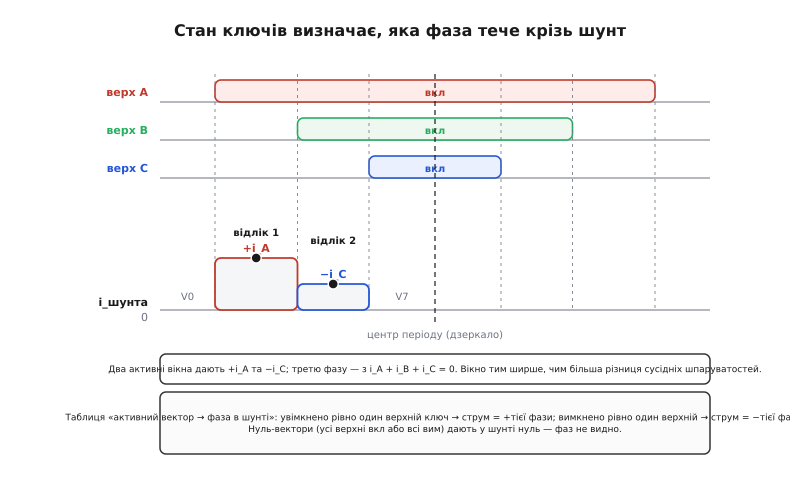
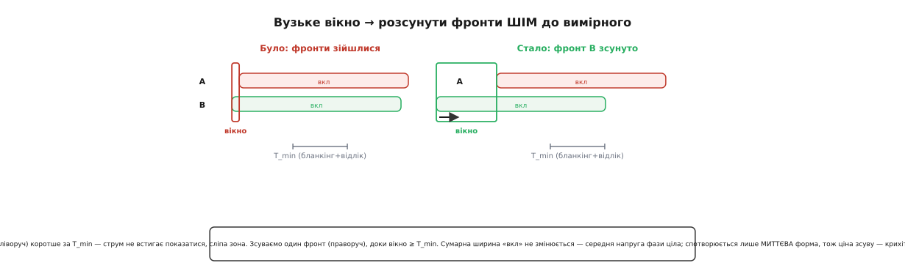

# ⚙️ Реконструкція трьох фазних струмів з одного шунта

Трифазний мотор має три обмотки, а полеорієнтованому керуванню потрібні струми всіх трьох. Найчесніше — поставити три давачі, по одному на фазу. Але є спокуса, від якої важко відмовитися: у ланці постійного струму, у спільному проводі від батареї до всього моста, тече струм, у якому **вже сидить уся інформація про фази** — треба лише навчитися її звідти дістати. Один шунт замість трьох, один підсилювач замість трьох, один канал АЦП замість трьох. Економія деталей, місця на платі й грошей — відчутна, особливо в масовому виробі.

Плата за цю економію — не залізо, а **прошивка**. Уся хитрість переїжджає в код: треба точно знати, коли клацнути АЦП, що саме він у цю мить бачить, як із двох відліків дістати три фази, і що робити, коли момент для відліку просто не настає. Ця вставка — про той код: від фізики того, що тече крізь шунт, до робочого обробника з обробкою сліпих зон.

> 🔧 **Навіщо це.** Реконструкція з одного шунта — типове рішення в дешевих, але «розумних» приводах: побутова техніка (компресори, вентилятори, насоси), електроінструмент, дрібні сервоприводи. Там кожен зайвий давач і операційний підсилювач множиться на мільйони штук, тож інженерів свідомо посилають воювати з прошивкою заради економії трьох резисторів. Хто розуміє цю техніку, той читає й лагодить такі приводи — а їх довкола тисячі.

## Задача: одне число замість трьох

Почнімо з того, що взагалі тече крізь шунт у ланці постійного струму. Інвертор — це три півмости (по два ключі на фазу), увімкнені між плюсом батареї й землею; середні точки півмостів ідуть на обмотки мотора. У кожну мить кожен півміст стоїть в одному з двох станів: або **верхній ключ відкритий** (фаза притиснута до плюса), або **нижній** (фаза притиснута до землі). Три півмости, два стани кожен — вісім можливих комбінацій.

Струм крізь DC-link-шунт — це струм, який інвертор саме зараз тягне з батареї (або віддає в неї). А тягне він рівно ті струми, чиї фази цю мить **підключені до плюсової шини**, тобто чиї верхні ключі відкриті. Ось звідки все випливає:

- **Усі три верхні ключі відкриті** (стан звуть нуль-вектором) — усі три обмотки замкнені на плюс, струм між ними тече кільцем усередині мотора, а з батареї не береться нічого. Крізь шунт — **нуль**.
- **Усі три нижні** (теж нуль-вектор) — те саме дзеркально: обмотки замкнені на землю, кільце струму замикається знизу, батарея осторонь. Крізь шунт — **нуль**.
- **Відкритий рівно один верхній ключ** (скажімо, фази A) — тоді струм із плюса заходить у мотор **тільки через фазу A**, а виходить через дві інші (їхні нижні ключі відкриті). Крізь шунт тече рівно **i_A**.
- **Відкриті два верхні** (скажімо, A і B, закритий C) — з плюса струм заходить через дві фази, а вертається через одну (фазу C, чий нижній ключ відкритий). Крізь шунт тече весь струм, що вертається, тобто **−i_C** (знак мінус — бо це струм, що виходить із мотора).

Останні два випадки — суть усього методу. У них струм у шунті **дорівнює струму однієї фази** (з точністю до знака), і саме ці стани звуть **активними векторами** (бо на відміну від нуль-векторів вони справді штовхають енергію в мотор). Стан ключів однозначно каже, яку фазу ти зараз міряєш:

```text
Стан верхніх ключів (1=відкритий) │ струм у DC-link-шунті
────────────────────────────────────────────────────────
 A B C = 0 0 0  (усі низ)          │  0        (нуль-вектор)
 A B C = 1 0 0                     │  +i_A
 A B C = 1 1 0                     │  −i_C
 A B C = 0 1 0                     │  +i_B
 A B C = 0 1 1                     │  −i_A
 A B C = 0 0 1                     │  +i_C
 A B C = 1 0 1                     │  −i_B
 A B C = 1 1 1  (усі верх)         │  0        (нуль-вектор)
```

Правило читається просто: **увімкнено рівно один верхній ключ → у шунті плюс струм тієї фази; вимкнено рівно один верхній → мінус струм тієї фази.** Шість активних станів, у кожному видно одну конкретну фазу. (Ця таблиця відповідає інверторному стандарту, зокрема вона наведена в патенті STMicroelectronics EP2120323 на вимір фазних струмів одним DC-link-давачем — усталений, багато разів реалізований опис.)

Тепер видно, у чому власне задача. За один період ШІМ інвертор не сидить в одному стані — він проходить **послідовність** станів (два нуль-вектори по краях і два активні всередині — так улаштований центрований ШІМ). У двох активних вікнах крізь шунт течуть **дві різні фази**. Зчитавши шунт двічі, у двох цих вікнах, дістаємо два фазні струми. Третій навіть міряти не треба — його дає фізичний закон.

## Ідея: два відліки плюс закон Кірхгофа

Третій струм добираємо з того, що весь струм, який зайшов у мотор трьома проводами, мусить із нього вийти — інакше заряд накопичувався б у зірці обмоток без кінця, чого не буває. Це прямий наслідок [першого закону Кірхгофа](root:hw-analog/kirchhoff-laws) для вузла-зірки:

```text
i_A + i_B + i_C = 0     завжди, щомиті
```

Отже, знаючи будь-які два фазні струми, третій дістаємо відніманням: якщо в цьому періоді ми зміряли i_A та i_C, то i_B = −(i_A + i_C). Три невідомі, два виміри й один закон — система замкнена.

> 🔧 **Навіщо це.** Той самий закон i_A + i_B + i_C = 0 працює й для перевірки. Навіть коли ви міряєте всі три фази трьома шунтами, їхня сума має сходитися до нуля; якщо ні — десь зсув нуля, дрейф підсилювача або наведена завада. У реконструкції з одного шунта цей закон — не милиця, а фундамент: він перетворює «зміряли дві фази» на «знаємо всі три».

Тепер — де взяти ці два виміри. Порядок станів за період центрованого ШІМ симетричний відносно середини: нуль-вектор → перший активний → другий активний → нуль-вектор → (дзеркало назад). Два активні вікна припадають на першу половину періоду (і повторюються дзеркально в другій). У кожному з них крізь шунт стабільно тече одна фаза — треба лише клацнути АЦП десь **усередині вікна**, подалі від фронтів, де струм чистий.


*Верхні три доріжки — коли відкриті верхні ключі фаз A, B, C (шпаруватості різні: d_A > d_B > d_C). Фронти цих імпульсів ріжуть період на вікна. Нижня доріжка — струм у шунті: у вікні, де відкритий лише верхній ключ A, тече +i_A; де відкриті A і B (закритий C) — тече −i_C; по краях, у нуль-векторах, — нуль. Два відліки (чорні точки) беруть у центрах двох активних вікон; третю фазу добирають з i_A + i_B + i_C = 0. Ширина активного вікна дорівнює різниці сусідніх шпаруватостей — і в цьому весь підступ.*

Зверни увагу на головне з цього рисунка: **ширина активного вікна дорівнює різниці шпаруватостей двох сусідніх фаз**. Перше активне вікно триває рівно (d_A − d_B) періоду, друге — (d_B − d_C). Це не випадковість, а геометрія: вікно відкривається, коли вимкнувся один верхній ключ, і закривається, коли вимкнувся наступний, а їхні моменти вимикання відстоять саме на різницю шпаруватостей. Звідси ростуть усі проблеми: коли дві шпаруватості близькі, відповідне вікно стискається до нуля.

## Таймінг відліку: коли саме клацати

Активне вікно — не вся мить, що доступна для відліку. У самому його краю, щойно клацнув ключ, тече не струм, а **дзвін**: гострий фронт напруги наводиться на все довкола, підсилювач гойдається, шунт бринить від паразитної індуктивності доріжок. Клацнеш АЦП там — упіймаєш заваду. Тому реальне корисне вікно коротше за геометричне на суму трьох витрат часу:

```text
T_min = T_dead + T_settle + T_sample

T_dead    — мертвий час моста: пауза між вимиканням одного ключа плеча
            й вмиканням другого (щоб не було наскрізного струму). Поки він
            триває, стан плеча невизначений, струм ще не «той».
T_settle  — заспокоєння тракту після фронту: дзвін від комутації має
            вгаснути (бланкінг). Кілька сотень нс, диктує розводка плати
            й смуга підсилювача.
T_sample  — власне взяття відліку: заряд конденсатора вибірки-зберігання
            плюс саме перетворення АЦП (для швидкого SAR — одиниці мкс).
```

`T_min` — це **мінімальна ширина активного вікна, за якої відлік іще можливий**: вікно має бути не коротшим, ніж T_dead + T_settle + T_sample разом. (У документації STM32 ці складові фігурують як DT — мертвий час, T_noise — заспокоєння, T_rise — час установлення давача, і T_sample — час вибірки АЦП; сума й задає мінімальне вимірне вікно.) Якщо активне вікно ширше за `T_min` — усе гаразд, беремо відлік у його центрі (там найдалі від обох фронтів). Якщо вужче — вікно **сліпе**, і про це окрема мова нижче.

Практично відлік прив'язують не до програми, а до **таймера ШІМ**: той самий таймер, що формує імпульси, має регістри порівняння, які в потрібну мить запускають АЦП апаратно, без участі процесора. Для центрованого ШІМ таймер рахує вгору-вниз; момент відліку задають третім-четвертим каналом порівняння так, щоб він припав на центр потрібного активного вікна. Процесор про це не думає — він лише отримує готове переривання «перетворення завершено» з двома кодами АЦП.

> 🔧 **Навіщо це.** Найчастіша причина, чому реконструкція «шумить», — відлік у неправильну мить. Взяв на фронті — упіймав дзвін; взяв надто рано (у мертвому часі) — струм ще не встановився; узяв не в тому вікні — переплутав фази. Правило одне: відлік має **потрапити всередину активного вікна, після T_min від його початку**, і запускати його треба залізом від таймера, а не з циклу керування. Якщо привід дає рвані струми лише на певних кутах вектора — майже напевно там вікна підповзли під T_min.

## Сліпі зони: коли момент не настає

Тепер до серця задачі. Активне вікно триває рівно різницю двох сусідніх шпаруватостей. А ця різниця буває крихітною — і не в екзотиці, а в цілком робочих режимах:

- **Мала напруга на моторі** (низька швидкість, малий момент): усі три шпаруватості близькі до 50%, різниці між ними дрібні, **обидва** активні вікна вузькі. Це найгірший випадок — сліпі обидва.
- **Вектор напруги біля межі сектора**: коли вектор дивиться вздовж однієї з шести головних осей, дві з трьох шпаруватостей зрівнюються, і **одне** з двох вікон схлопується в нуль.

У цих режимах активне вікно коротше за `T_min` — струм фізично не встигає «показатися» чистим, перш ніж треба брати наступний відлік. Виникає **сліпа зона** (англ. *immeasurable region*): двох чесних відліків за період не набрати. А без двох фаз реконструкція не працює — контур керування лишається без зворотного зв'язку саме там, де його бракує найдужче (на малій швидкості мотор найтяжче тримати).


*Ліворуч: фронти двох фаз майже зійшлися, вікно між ними коротше за T_min — струм не встигає показатися, відлік бере дзвін. Праворуч: один фронт (тут — фази B) навмисно зсунуто, аж поки вікно не досягне T_min. Сумарна ширина «вкл» кожної фази не змінюється — середня напруга на моторі ціла; спотворюється лише миттєва форма імпульсу, тож ціна зсуву — крихітна додаткова пульсація струму, а не втрата моменту.*

Що з цим роблять? Є два роди рішень, і обидва зводяться до одного: **навмисне змінити ШІМ так, щоб вікно стало вимірним**, заплативши за це якомога менше.

**Рід перший — розсунути фронти (phase-shifting).** Раз вікно коротке через те, що два фронти зійшлися, — розведемо їх. Один із двох сусідніх імпульсів ШІМ зсуваємо в часі: не міняючи його **ширини** (а отже, і середньої напруги фази), пересуваємо його **фронт** так, щоб зазор між фронтами доріс до `T_min`. Ключове тут — саме незмінність ширини: середнє за період значення напруги на кожній фазі те, що й хотів контролер, тож момент і швидкість не пливуть. Змінюється лише **миттєва** форма струму в межах періоду — з'являється трохи більша пульсація, ледь чутне підвищення шуму й нагріву. Обмін чесний: за долю відсотка спотворення отримуємо вимірне вікно.

Але цей прийом має межу. Розсовувати фронти можна лише доти, доки є куди — доки імпульс не вперся в край періоду. Коли обидва вікна вузькі одночасно (та сама мала напруга), місця для розсування може забракнути, бо розтягнеш одне вікно — задавиш друге.

**Рід другий — жертвувати одним відліком і добирати сусідів.** Якщо в цьому періоді два чесні виміри не набираються (обидва вікна сліпі), можна взяти той один, що вдалося, а другу фазу дістати з **попереднього або наступного** періоду ШІМ. На частотах ШІМ у десятки кілогерц фазний струм за один період майже не змінюється (він синусоїдальний з частотою в сотні герц), тож сусідній відлік — добра оцінка. Це дешевше за зсування (нічого не спотворюємо), але додає крихітну затримку й трохи шуму на швидких перехідних режимах.

На практиці якісні реалізації комбінують: доки різниця шпаруватостей дозволяє — просто розсовують фронти; коли й це не рятує — переходять на добір із сусідніх періодів. Академічні роботи йдуть далі (вкидання колінеарних векторів, модифікація самої векторної модуляції в неспостережних зонах), але для розуміння суті досить цих двох.

> 🔧 **Навіщо це.** Сліпі зони — причина, чому привід на одному шунті гірше поводиться на малій швидкості й малому моменті, ніж триохунтовий. Це не поломка, а вбудована межа методу. Коли обираєш між одним шунтом і трьома, питання по суті одне: чи буде цей мотор багато працювати на низьких обертах під навантаженням? Насос, що крутиться на повних обертах, — один шунт чудово впорається. Точний сервопривід, що має тримати вал нерухомо під моментом, — там сліпі зони кусатимуться, і три шунти виправдані.

## Робочий код: обробник реконструкції

Зберімо все докупи. Нижче — обробник для STM32 (стилю HAL/LL, але суть однакова для будь-якого MCU з таймером ШІМ і кількома каналами порівняння). Логіка розкладена на дві частини:

1. **Раз за період**, ще до генерації ШІМ, з розрахованих шпаруватостей визначаємо ширину обох активних вікон, вирішуємо, чи є сліпа зона, і за потреби розсовуємо фронти й ставимо два моменти відліку АЦП. Це роблять у тому ж місці, де контур керування видає нові шпаруватості.
2. **Двічі за період**, у моменти відліку, спрацьовує переривання АЦП; воно бере код, і коли зібрано обидва — реконструює три фази й віддає їх у контур.

Спершу — визначення вікон і планування відліків:

```c
// Планування відліків для реконструкції з одного DC-link-шунта.
// Викликати раз за період ШІМ, отримавши нові шпаруватості d_a,d_b,d_c ∈ [0..1].
// PWM центрований; ARR — період таймера в тіках; канали CCR1..3 — самі імпульси,
// CCR4/CCR5 — два моменти запуску АЦП.

#define PWM_ARR        4199u        // період таймера (тіків до вершини)
#define T_MIN_TICKS      80u        // T_min = dead+settle+sample у тіках таймера
#define HALF_SAMPLE      (T_MIN_TICKS / 2u)

// Впорядковані фази за спаданням шпаруватості: max, mid, min.
typedef struct { uint8_t hi, mid, lo; } phase_order_t;

// Стан для обробника АЦП: які дві фази читаємо цього періоду і в якому знаку.
typedef struct {
    int8_t  ph1, sgn1;   // перший відлік: індекс фази (0=A,1=B,2=C) і знак
    int8_t  ph2, sgn2;   // другий відлік
    uint8_t blind;       // 1 — вікон не вистачило, добираємо із сусіднього періоду
} recon_plan_t;

static volatile recon_plan_t g_plan;

// Відсортувати три шпаруватості, повернути порядок індексів (hi,mid,lo).
static phase_order_t order3(uint16_t da, uint16_t db, uint16_t dc) {
    uint16_t d[3] = { da, db, dc };
    uint8_t  idx[3] = { 0, 1, 2 };
    for (uint8_t i = 0; i < 2; i++)            // проста сортування трьох
        for (uint8_t j = 0; j < 2 - i; j++)
            if (d[idx[j]] < d[idx[j + 1]]) {
                uint8_t t = idx[j]; idx[j] = idx[j + 1]; idx[j + 1] = t;
            }
    phase_order_t o = { idx[0], idx[1], idx[2] };
    return o;
}

// Головне: розрахувати вікна, за потреби розсунути фронти, спланувати відліки.
void ss_plan_period(uint16_t ccr_a, uint16_t ccr_b, uint16_t ccr_c) {
    // ccr_* — тіки «верхній ключ увімкнено» для кожної фази (більше = довша шпаруватість).
    phase_order_t o = order3(ccr_a, ccr_b, ccr_c);
    uint16_t ccr[3] = { ccr_a, ccr_b, ccr_c };

    // Ширини двох активних вікон = різниці сусідніх (упорядкованих) шпаруватостей.
    // Для центрованого ШІМ фронти симетричні, тож у тіках півперіоду це просто різниці.
    int32_t w1 = (int32_t)ccr[o.hi]  - (int32_t)ccr[o.mid];   // вікно «видно фазу hi»
    int32_t w2 = (int32_t)ccr[o.mid] - (int32_t)ccr[o.lo];    // вікно «видно фазу lo»

    // За таблицею вектора: у вікні, де відкритий лише верхній ключ фази hi,
    // у шунті тече +i_hi; у вікні, де відкриті hi та mid (закрита lo), тече −i_lo.
    recon_plan_t p;
    p.ph1 = o.hi; p.sgn1 = +1;   // перший активний вектор бачить +i_hi
    p.ph2 = o.lo; p.sgn2 = -1;   // другий активний вектор бачить −i_lo
    p.blind = 0;

    // Чи обидва вікна ширші за T_min? Якщо так — просто ставимо відліки в їхні центри.
    if (w1 >= T_MIN_TICKS && w2 >= T_MIN_TICKS) {
        // Момент відліку = центр вікна. Для центрованого ШІМ вікна лежать між
        // фронтами вимикання ключів; беремо середину відповідного інтервалу.
        uint16_t s1 = (uint16_t)((ccr[o.hi]  + ccr[o.mid]) / 2);
        uint16_t s2 = (uint16_t)((ccr[o.mid] + ccr[o.lo])  / 2);
        LL_TIM_OC_SetCompareCH4(TIM1, s1);   // запуск АЦП №1
        LL_TIM_OC_SetCompareCH5(TIM1, s2);   // запуск АЦП №2
    }
    // Одне вікно вузьке, друге широке: розсуваємо вузьке до T_min, зсунувши
    // фронт відповідної фази. Ширину імпульсу НЕ чіпаємо (середня напруга ціла) —
    // зсуваємо весь імпульс, компенсуючи протилежним зсувом у другій половині періоду.
    else if (w1 >= T_MIN_TICKS || w2 >= T_MIN_TICKS) {
        // Обидва вузькі вікна межують із СЕРЕДНЬОЮ фазою (mid), тож зсуваємо саме її
        // фронт — геть від того сусіда, до якого вона «прилипла».
        uint8_t victim = o.mid;
        uint16_t shifted;
        if (w1 < T_MIN_TICKS) {                 // прилипла до hi — відсунути вниз, розтягнути w1
            shifted = (uint16_t)(ccr[victim] - (T_MIN_TICKS - w1));
        } else {                                // прилипла до lo — посунути вгору, розтягнути w2
            shifted = (uint16_t)(ccr[victim] + (T_MIN_TICKS - w2));
        }
        apply_edge_shift(victim, shifted);   // оновити CCR + дзеркальну компенсацію
        ccr[victim] = shifted;
        uint16_t s1 = (uint16_t)((ccr[o.hi]  + ccr[o.mid]) / 2);
        uint16_t s2 = (uint16_t)((ccr[o.mid] + ccr[o.lo])  / 2);
        LL_TIM_OC_SetCompareCH4(TIM1, s1);
        LL_TIM_OC_SetCompareCH5(TIM1, s2);
    }
    // Обидва вікна вузькі: розсуванням не врятувати (немає куди). Беремо той
    // єдиний відлік, що вдасться, а другу фазу добираємо із сусіднього періоду.
    else {
        p.blind = 1;
        uint16_t s1 = (uint16_t)((ccr[o.hi] + ccr[o.mid]) / 2);
        LL_TIM_OC_SetCompareCH4(TIM1, s1);           // лишаємо один чесний відлік
        LL_TIM_OC_SetCompareCH5(TIM1, s1 + HALF_SAMPLE);  // другий — марний, ігноруємо
    }

    g_plan = p;
}
```

Тепер — переривання АЦП, що збирає два коди й реконструює фази. Перетворення коду у струм — той самий ланцюжок «код → підсилювач → шунт», що й у звичайному вимірі; двонапрямлений нуль (зсунутий на середину шкали) обов'язковий, бо фазний струм міняє знак:

```c
// Обробник «АЦП завершив обидва перетворення»: два коди → три фазні струми.
#define R_SHUNT   0.005f     // Ом
#define GAIN      20.0f      // підсилювач струму
#define VREF      3.3f
#define ADC_FS    4096.0f
static uint16_t g_zero = 2048;   // калібрований нуль (двонапрямлений вимір)

static inline float raw_to_current(uint16_t raw) {
    float v_out = ((int)raw - (int)g_zero) * (VREF / ADC_FS);
    return (v_out / GAIN) / R_SHUNT;      // I у шунті, зі знаком
}

volatile float g_ia, g_ib, g_ic;     // реконструйовані фазні струми, А
static  float  s_prev[3];            // струми минулого періоду (для сліпих зон)

void ADC1_2_IRQHandler(uint16_t raw1, uint16_t raw2) {
    recon_plan_t p = g_plan;           // знімок плану цього періоду

    // Струм у шунті в кожному вікні = ±струм конкретної фази (за таблицею вектора).
    float i_shunt1 = raw_to_current(raw1);
    float i_shunt2 = raw_to_current(raw2);

    // Розкладемо у масив фаз. Спершу — те, що зміряли напряму.
    float iph[3] = { 0.f, 0.f, 0.f };
    uint8_t known = 0;                 // бітова маска виміряних фаз

    iph[p.ph1] = p.sgn1 * i_shunt1;    // перша фаза: знак за таблицею
    known |= (1u << p.ph1);

    if (!p.blind) {
        iph[p.ph2] = p.sgn2 * i_shunt2;   // друга фаза з другого відліку
        known |= (1u << p.ph2);
    } else {
        // Сліпа зона: другу фазу беремо з минулого періоду (струм за 50 мкс майже не змінився).
        iph[p.ph2] = s_prev[p.ph2];
        known |= (1u << p.ph2);
    }

    // Третю (невиміряну) фазу добираємо з i_A + i_B + i_C = 0.
    uint8_t missing = 0;
    for (uint8_t k = 0; k < 3; k++)
        if (!(known & (1u << k))) missing = k;
    iph[missing] = -(iph[(missing + 1) % 3] + iph[(missing + 2) % 3]);

    g_ia = iph[0]; g_ib = iph[1]; g_ic = iph[2];
    s_prev[0] = g_ia; s_prev[1] = g_ib; s_prev[2] = g_ic;   // збережемо для наступних сліпих зон

    // далі: (g_ia,g_ib,g_ic) → перетворення Кларк/Парк → контур FOC
}
```

Розберемо, чому код такий, а не інший. **Сортування шпаруватостей** — не примха: воно каже, який активний вектор іде першим (видно фазу з найбільшою шпаруватістю), а який другим (закрита фаза з найменшою). Знаки `sgn1 = +1` і `sgn2 = −1` — прямо з таблиці векторів: перший активний вектор має відкритий один верхній ключ (плюс струм тієї фази), другий — закритий один верхній (мінус струм закритої фази). **Момент відліку** — арифметичне середнє двох сусідніх CCR, тобто центр вікна, найдалі від фронтів. **Гілка `blind`** ловить випадок, коли розсуванням не зарадиш, і чесно бере другу фазу з `s_prev` — минулого періоду. І нарешті, **`missing`** знаходить ту одну фазу, якої ми не міряли жодним із двох відліків, і добирає її з правила суми.

## Складність і пастки

Метод простий на папері й підступний у залізі. Найбільші граблі — прямі наслідки фізики, яку ми розібрали.

- **Мінімальна ширина вікна недооцінена.** `T_min` беруть «на око» замало — і на певних кутах вектора відлік починає падати у дзвін від фронта. Симптом: струм чистий на більшості кутів, але періодично «здригається» шість разів за електричний оберт (на межах секторів). Лік: чесно скласти T_dead + T_settle + T_sample, зокрема виміряти реальний час заспокоєння дзвону на **своїй** платі (він залежить від розводки й паразитної індуктивності), а не брати з даташита ідеал.

- **Зсув фронтів спотворює напругу дужче, ніж здається.** Кожне розсування — це відхилення миттєвої напруги від того, що хотів контролер. Поодинці воно дрібне, але на малій швидкості, коли розсовувати доводиться щоперіоду, спотворення накопичується в **чутний акустичний шум** і зайву пульсацію струму. Пастка: розсовувати агресивніше, ніж треба (з запасом «щоб напевно»), — тоді шум зростає без потреби. Розсовуй рівно до T_min, ні на тік більше.

- **Плутанина знака й фази.** Найпідступніша помилка: сплутати, який відлік якій фазі належить, або переплутати знак. Тоді реконструкція дає **правдоподібні, але неправильні** струми — привід крутиться, але момент нерівний, ККД падає, а причину видно лише як дивну форму струму на осцилографі. Захист: перевіряти на стенді, що зміряна сума i_A + i_B + i_C справді нульова в межах шуму, і що знаки збігаються з окремим (нехай тимчасовим) inline-давачем на одній фазі.

- **Мертвий час спотворює саму напругу.** Мертвий час (T_dead) не лише з'їдає вікно — він ще й трохи змінює **реальну** напругу на фазі (ефект звуть спотворенням мертвого часу). На малих шпаруватостях це помітно псує форму струму незалежно від реконструкції. Це не проблема саме одного шунта, але вона накладається й гіршає картину саме там, де вікна й так вузькі.

- **Синхронізація відліку з дзеркальною половиною періоду.** Центрований ШІМ симетричний, і активні вікна є в обох половинах. Якщо помилитися з тим, у якій половині стоїть момент відліку (регістр порівняння спрацьовує на рахунку вгору чи вниз), АЦП клацне не в тому вікні. Дрібна плутанина в налаштуванні таймера — і фази переставлені місцями.

- **АЦП не встигає за два відліки.** Два перетворення мають улягтися у вікна одного періоду ШІМ разом з усіма затримками. На високій частоті ШІМ (понад 20–30 кГц) і повільному АЦП це стає тісно: T_sample з'їдає надто велику частку вікна, T_min росте, сліпі зони ширшають. Тут або швидший АЦП, або нижча частота ШІМ, або перехід на два-три шунти.

Підсумок простий. Реконструкція з одного шунта — гарний інженерний обмін: три давачі стискаються в один ціною складнішої прошивки й **гіршої роботи на малій швидкості** (через сліпі зони). Де мотор здебільшого крутиться швидко (насоси, вентилятори, компресори) — обмін вигідний і метод панує. Де треба точний момент на малих обертах (сервоприводи, точна робототехніка) — сліпі зони кусаються, і платять за три шунти або inline. Ключ до робочої реалізації — не сам алгоритм (він короткий), а **чесний таймінг**: правильно порахований T_min, відлік рівно в центрі вікна від таймера, і акуратна обробка сліпих зон без надмірного розсування.
