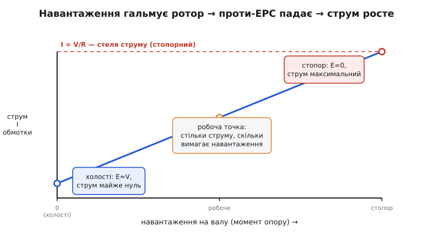
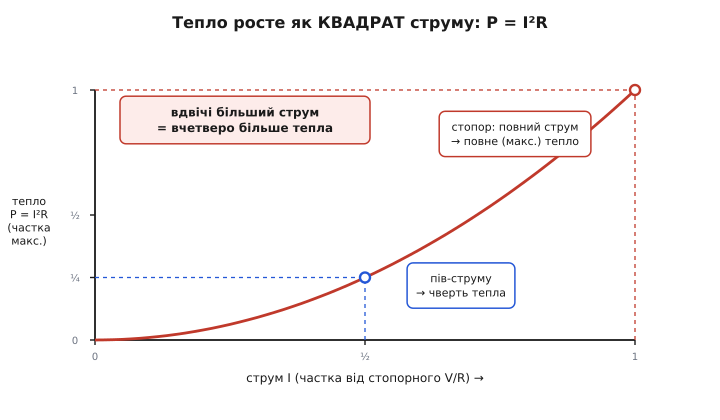
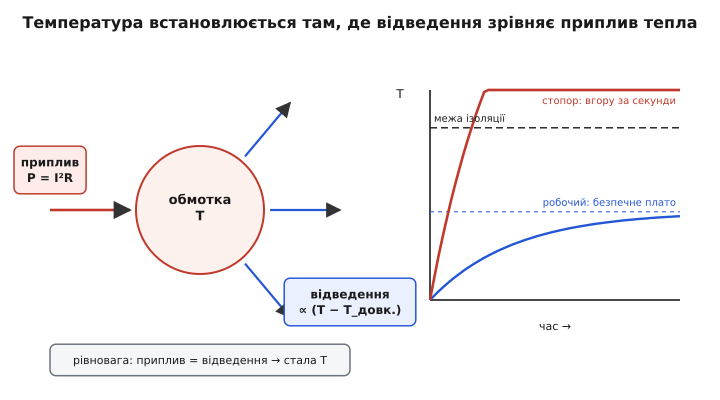
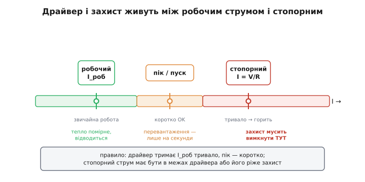

# Струм, заклинювання й нагрів мотора

Той самий мотор, що в нормальній роботі ледь теплий, заклинений валом може задиміти за кілька секунд. Це не парадокс і не дефект — це пряме продовження того, як мотор бере струм. Скільки струму він тягне, вирішує не сам мотор, а **навантаження на валу**: що важче крутити, то більший струм. А струм, своєю чергою, гріє обмотку — і гріє не лінійно, а **квадратом**. Заклинений вал (англ. *stall*, «стопор») — це найгірша точка на обох шкалах одразу: струм підскакує до максимуму, тепло — до максимуму в квадраті, а охолодження не встигає. Розберімо весь ланцюг від першопричини: чому струм узагалі росте з навантаженням, чому стопорний струм — це стеля, чому тепло йде як `I²R`, де лежить теплова межа, за якою ізоляція гине, і як на практиці не дати приводу спалити себе.

### Чому струм мотора залежить від навантаження

Перша несподіванка для того, хто звик до лампочки чи резистора: у них струм задає сама напруга (`I = V/R`), і він сталий. У мотора не так. Підключи мотор до тих самих незмінних шести вольтів — і він братиме то менше струму, то більше, залежно лише від того, що ти повісив на вал. Звідки мотор «знає» про навантаження?

Відповідь у тому, що мотор, який крутиться, **сам виробляє напругу, спрямовану проти живлення**. Його обмотки рухаються в магнітному полі, а провідник, що ріже силові лінії поля, наводить у собі напругу — це електромагнітна індукція. За правилом Ленца ця наведена напруга завжди протидіє причині, яка її породила, тож вона спрямована **назустріч** прикладеній. Її так і звуть — **проти-ЕРС** (зустрічна електрорушійна сила, англ. *back-EMF*). І головне: що швидше крутиться ротор, то швидше обмотки перетинають поле, то **більша** ця зустрічна напруга.

> Мотор у русі одночасно працює генератором: обмотки рухаються в полі й наводять напругу, спрямовану проти живлення (правило Ленца). Ця проти-ЕРС росте лінійно з обертами; на холостому ходу вона майже зрівнюється з прикладеною напругою. Саме різниця між живленням і проти-ЕРС, поділена на опір обмотки, і задає струм. Деталі того, як це випливає з будови мотора, — у статті про [колекторний DC-мотор](topic:hw-motion/brushed-dc-motor).

Тепер ключова формула. Струм в обмотці визначає не сама напруга живлення, а **різниця** між нею і проти-ЕРС, поділена на опір обмотки `R`:

```
струм:   I = (V − E) / R       E — проти-ЕРС, росте з обертами
```

Звідси одразу видно весь механізм саморегуляції. Повісили на вал важчий вантаж — ротор пригальмував — оберти впали — проти-ЕРС `E` зменшилася — різниця `(V − E)` зросла — крізь обмотку пішов **більший струм**. А більший струм у полі дає більший момент — рівно стільки, скільки треба, щоб тягнути цей вантаж. Мотор підлаштовує струм під навантаження сам, без жодного регулятора ззовні: важче навантаження → нижчі оберти → менша проти-ЕРС → більший струм.


*Струм визначає навантаження, не напруга. На холостому ходу ротор крутиться вільно, проти-ЕРС майже зрівняла живлення — струм майже нуль. Що більший момент опору на валу, то сильніше пригальмований ротор, то менша проти-ЕРС і то більший струм `I = (V − E)/R`. У крайній точці — стопорі — ротор стоїть, проти-ЕРС нема зовсім, і струм упирається в стелю `V/R`, яку тримає лише опір обмотки.*

> 🔧 **Навіщо це.** Це пояснює, чому марно міряти «струм мотора» однією цифрою з паспорта. Той самий привід тягне різний струм залежно від навантаження, тертя, температури, заїдань у механіці. Тому в реальній схемі струм не задають, а **вимірюють** — і за ним судять про те, що коїться на валу: раптовий стрибок струму майже завжди означає, що механізм у щось упнувся або заклинив.

### Стопорний струм: стеля, у яку впирається мотор

Доведімо думку до краю. Що буде, якщо вал силоміць зупинити — затиснути рукою, дати йому впертися в перешкоду, заклинити механізм? Ротор стоїть, обмотки не рухаються, поля не ріжуть — отже, проти-ЕРС **дорівнює нулю**. У формулі `I = (V − E)/R` зникає весь захисний доданок `E`, і струм підскакує до своєї абсолютної стелі:

```
стопор (E = 0):   I_стоп = V / R       струм найбільший можливий
```

Це і є **стопорний струм** (англ. *stall current*), він же **пусковий**: у першу мить після ввімкнення ротор ще стоїть, проти-ЕРС ще нема, тож пуск і стопор — це одна й та сама точка `V/R`. Різниця лише в тривалості. Пуск триває частку секунди: ротор зривається з місця, розганяється, проти-ЕРС наростає, струм спадає до робочого. Стопор же тримає мотор у точці `V/R` **скільки завгодно довго** — доки не приберуть перешкоду або не згорить обмотка.

Наскільки великий цей стопорний струм? У дрібних моторів опір обмотки — частки ома чи одиниці ома, тож `V/R` виходить у рази, а то й у десятки разів більший за робочий струм. Мотор, що в роботі задовольняється половиною ампера, на стопорі тягне кілька ампер з того самого джерела. І весь цей струм тече крізь нерухому обмотку, нікуди не діваючись, — уся підведена потужність іде в тепло. Саме тому стопор такий небезпечний; щоб зрозуміти чому — треба подивитися, як струм перетворюється на нагрів.

### Чому нагрів іде як квадрат струму

Будь-який провідник зі струмом гріється: електрони, розігнані напругою, налітають на вузли кристалічної решітки й віддають їм енергію, а та проявляється нагрівом. В обмотці мотора це звичайнісінький мідний дріт зі своїм опором `R`, і на ньому виділяється теплова потужність за законом Джоуля (*James Prescott Joule*, англ. фізик):

```
теплова потужність:   P = I² · R
```

> Тепло на опорі дорівнює `P = I²R` — уся електрична потужність, що падає на чистий опір, без залишку йде в нагрів. Звідси й квадратична залежність: подвоїш струм — учетверо більше тепла. Скільки саме виділяється, куди воно дівається і де межа, за якою деталь гине, — у статті про [джоулеве тепло](topic:ph-electromagnetism/joule-heating).

Тут — найважливіше місце всієї теми, і його варто відчути нутром. Тепло залежить від струму не прямо, а **в квадраті**. Це означає, що нагрів росте набагато швидше за струм. Подвоїв струм — тепло зросло не вдвічі, а **вчетверо**. Збільшив струм утричі — тепло вже **вдев'ятеро**. Помножив на десять — у **сто разів**.


*Чому квадрат вирішує все. Тепло `P = I²R` росте параболою, а не прямою. Працюючи на половині стопорного струму, мотор виділяє лише чверть максимального тепла — і легко його віддає. Та на повному стопорному струмі тепловиділення стрибає на саму вершину параболи. Тому між «трохи перевантажений» і «заклинений» лежить не двократна, а багатократна різниця в нагріві.*

Тепер з'єднаймо це з попереднім. Стопор робить дві погані речі **одночасно**. По-перше, він жене струм до максимуму `V/R`. По-друге — і це гірше — через квадрат саме цей максимальний струм дає максимальне тепло, помножене на себе. Якщо стопорний струм у п'ять разів більший за робочий, то тепловиділення на стопорі — у **двадцять п'ять разів** більше, ніж у нормальній роботі. Обмотка, розрахована тихо розсіювати робоче тепло, дістає двадцятип'ятикратний приплив — і ніяке штатне охолодження з таким не впорається.

> 🔧 **Навіщо це.** Квадрат — причина, чому захист мусить спрацьовувати **швидко й рішуче**. Невелике перевищення струму — ще терпимо, бо тепло від нього зростає помірно. Але двократне перевищення — це вже вчетверо більше тепла, а стопор — десятки разів. Тому в драйверах і запобіжниках поріг ставлять не «з запасом на всякий», а саме там, де квадратичний нагрів іще не встиг спалити ізоляцію.

### Тепловий баланс: де встановлюється температура

Виділення тепла — це лише половина історії. Гаряча обмотка тепло ще й **віддає**: у повітря, у корпус, у радіатор. І температура мотора стоїть не там, де «багато тепла», а там, де **приплив зрівнявся з відведенням**. Це проста рівновага, але саме вона визначає, виживе мотор чи згорить.

Приплив — це знайоме `I²R`, він сталий, поки сталий струм. А відведення тим більше, чим **гарячіша** обмотка проти довкілля: тепло завжди тече від теплішого до холоднішого, і потік пропорційний різниці температур. Тож коли мотор тільки ввімкнули, він холодний, відводить мало — і починає грітися. Грітися — означає, що різниця температур росте, а з нею росте й відведення. Так триває, доки відведення не дожене приплив: відтоді температура **перестає рости** і застигає на сталому рівні.

```
нагрівається:   приплив I²R  >  відведення     → T росте
рівновага:      приплив I²R  =  відведення     → T стала
```


*Температуру задає баланс, а не саме тепло. Обмотка гріється доти, доки зростальне відведення не зрівняє сталий приплив `I²R`; тоді температура застигає. На робочому струмі ця рівновага лежить на безпечному плато (синя крива). На стопорному струмі приплив у десятки разів більший — рівновага була б далеко за межею, якої ізоляція не витримує, тож температура просто лізе вгору крізь цю межу за секунди (червона крива), не встигнувши встановитися.*

Звідси видно ключову різницю між двома режимами. На **робочому** струмі рівновага лежить низько — обмотка нагрівається до якоїсь теплої, але безпечної температури й там тримається годинами. На **стопорному** струмі приплив у десятки разів більший, тож точка рівноваги була б десь дуже високо — куди вище за те, що витримує ізоляція. Мотор просто не доживає до цієї рівноваги: температура злітає крізь допустиму межу за секунди, лак на обмотці плавиться, витки замикаються — і мотор згорає.

Важлива тонкість — **час**. Мідь і залізо мотора мають теплоємність, тож нагрів не миттєвий: є **теплова стала часу**, за яку температура встигає змінитися. У дрібного мотора це секунди, у великого — хвилини. Саме тому пусковий кидок струму не страшний (він короткий — обмотка не встигає прогрітися), а такий самий за величиною стопорний струм смертельний (він триває довше за теплову сталу). Той самий струм: коротко — нічого, тривало — пожежа.

> 🔧 **Навіщо це.** Теплова стала — причина, чому захист дають **із витримкою часу**, а не миттєвий. Якби запобіжник рубив живлення від першого ж перевищення струму, мотор не зміг би навіть стартувати — пусковий кидок вибивав би захист щоразу. Тому грамотний захист дозволяє короткий кидок (пуск), але не дозволяє струмові **триматися** високим (стопор): він стежить не лише за величиною струму, а й за тим, **як довго** той тримається.

### Worked-приклад: стопорний струм і тепло проти робочого

Візьмімо невеликий мотор з опором обмотки `R = 2 Ω`, що живиться від `V = 12 В`. У нормальній роботі він тягне `I_роб = 0.8 А`. Порахуймо стопорний струм і порівняймо тепловиділення в обох режимах.

**Умова:** `V = 12 В`, `R = 2 Ω`, робочий струм `I_роб = 0.8 А`. Знайти стопорний струм (`E = 0`), тепло в обох режимах і їхнє відношення.

```
стопорний струм:   I_стоп = V / R
                          = 12 / 2
                          = 6.0 A           ← у 7.5 раза більший за робочий

тепло на стопорі:  P_стоп = I_стоп² · R
                          = 6.0² · 2
                          = 36 · 2
                          = 72 Вт           ← усі 72 ват у нерухому обмотку

тепло в роботі:    P_роб  = I_роб² · R
                          = 0.8² · 2
                          = 0.64 · 2
                          = 1.28 Вт         ← легко відводиться

відношення тепла:  P_стоп / P_роб = 72 / 1.28 ≈ 56 разів
```

Висновок видно одразу. Струм на стопорі більший лише в `7.5` раза — але тепло більше в **п'ятдесят шість** разів, бо `7.5² ≈ 56`. Обмотка, що спокійно розсіює свій півтора ват, дістає 72 — і за секунди перегрівається. Ось чому привід, теплий у роботі, на стопорі спалахує: квадрат перетворює помірний стрибок струму на катастрофічний стрибок тепла.

Цей самий розрахунок підказує, як захиститися в прошивці: вимірюємо струм і, якщо він тримається на стопорному рівні довше за короткий пусковий момент, рубимо живлення. Ось характерний фрагмент:

:::tabs
```cpp
// Захист від стопора: стопорний струм тримається довго → вимикаємо.
// Короткий пусковий кидок пропускаємо (лічильник скидається, поки струм у нормі).
const float I_STALL = 5.0f;     // поріг, A: вище — підозра на стопор
const uint16_t T_TRIP = 300;    // витримка, мс: довше за пуск, коротше за прогрів

float i = read_motor_current();         // з монітора струму, A
if (i > I_STALL) {
    if (++stall_ms * LOOP_MS >= T_TRIP) // струм високий уже T_TRIP мс?
        motor_stop();                   // ріжемо живлення — інакше згорить
} else {
    stall_ms = 0;                       // струм у нормі — забуваємо кидок
}
```
```python
# Захист від стопора: стопорний струм тримається довго → вимикаємо.
# Короткий пусковий кидок пропускаємо (лічильник скидається, поки струм у нормі).
I_STALL = 5.0      # поріг, A: вище — підозра на стопор
T_TRIP = 300       # витримка, мс: довше за пуск, коротше за прогрів

i = read_motor_current()                # з монітора струму, A
if i > I_STALL:
    stall_ms += 1
    if stall_ms * LOOP_MS >= T_TRIP:    # струм високий уже T_TRIP мс?
        motor_stop()                    # ріжемо живлення — інакше згорить
else:
    stall_ms = 0                        # струм у нормі — забуваємо кидок
```
```micropython
# Захист від стопора: стопорний струм тримається довго → вимикаємо.
# Короткий пусковий кидок пропускаємо (лічильник скидається, поки струм у нормі).
I_STALL = const(5.0)    # поріг, A: вище — підозра на стопор
T_TRIP = const(300)     # витримка, мс: довше за пуск, коротше за прогрів

i = read_motor_current()                # з монітора струму, A
if i > I_STALL:
    stall_ms += 1
    if stall_ms * LOOP_MS >= T_TRIP:    # струм високий уже T_TRIP мс?
        motor_stop()                    # ріжемо живлення — інакше згорить
else:
    stall_ms = 0                        # струм у нормі — забуваємо кидок
```
```go
// Захист від стопора: стопорний струм тримається довго → вимикаємо.
// Короткий пусковий кидок пропускаємо (лічильник скидається, поки струм у нормі).
const iStall = 5.0    // поріг, A: вище — підозра на стопор
const tTrip = 300     // витримка, мс: довше за пуск, коротше за прогрів

i := readMotorCurrent()                 // з монітора струму, A
if i > iStall {
    stallMs++
    if stallMs*loopMs >= tTrip {        // струм високий уже tTrip мс?
        motorStop()                     // ріжемо живлення — інакше згорить
    }
} else {
    stallMs = 0                         // струм у нормі — забуваємо кидок
}
```
:::

Поріг `I_STALL` ставимо вище за робочий і пусковий струм, але нижче за стопорний `V/R = 6 А`, а витримку `T_TRIP` — довшою за пуск, але **коротшою за теплову сталу** обмотки. Так пуск проходить вільно, а справжній стопор вимикається раніше, ніж встигне щось спалити.

### Робоча точка й захист: як не спалити привід

Зведімо все докупи в одну практичну картину. У мотора по струму є три характерні точки, і вони визначають усе проєктування приводу.

**Робочий струм** — те, що мотор тягне в звичайній роботі під своїм навантаженням. Тут тепло помірне, штатне охолодження його легко відводить, мотор може працювати безперервно. Драйвер і джерело мусять тримати цей струм **скільки завгодно довго**.

**Пусковий (піковий) струм** — короткий кидок `V/R` у момент старту. Він великий, але триває менше за теплову сталу, тож обмотка його переживає. Драйвер має витримати цей пік **коротко** — частку секунди.

**Стопорний струм** — той самий `V/R`, але **тривалий**. Це аварія. Він або мусить лишатися в межах того, що драйвер і джерело витримують безмежно, або схема зобов'язана його **обірвати** захистом, перш ніж згорить обмотка чи ключ.


*Вікно, у якому живе привід. Робочий струм (зелена зона) драйвер тримає тривало — тепло помірне й відводиться. Піковий пусковий струм (жовта) допустимий лише коротко, бо обмотка не встигає прогрітися. Стопорний струм `V/R` (червона) тривало означає пожежу: тут захист зобов'язаний вимкнути живлення. Усе проєктування приводу — це підбір драйвера, джерела й порогу захисту під ці три точки.*

Звідси проста, але рятівна дисципліна проєктування. Драйвер мотора добирають **за стопорним струмом**, а не за робочим: він має або витримати `V/R` тривало, або мати вбудований захист, що ріже струм. Запобіжник чи струмовий захист ставлять так, щоб робочий і пусковий струм проходили, а стопорний — ні. А струм для цього треба **вимірювати** — звідси й потреба в окремому вузлі.

> Щоб судити про струм і ловити стопор, його перетворюють на напругу: ставлять у коло мотора малий шунт (резистор) і вимірюють спад на ньому, або беруть готовий підсилювач струму. Цей вузол і дає прошивці число, за яким вона бачить навантаження й розпізнає заклинення. Як він влаштований і де його ставити — у статті про [монітор струму](topic:hw-sensing/current-monitor).

> 🔧 **Навіщо це.** Звідси головна звичка розробника приводів: **ніколи не лишай мотор без межі по струму**. Навіть якщо в нормі все добре, одне заклинення — застряглий механізм, примерзлий вал, людина, що притримала рукою, — миттєво виводить мотор у точку `V/R`, де він сам себе спалює. Драйвер з обмеженням струму або зовнішній струмовий захист коштують копійки, а рятують і мотор, і джерело, і плату.

### Де це працює: однаковий закон для будь-якого мотора

Усе сказане трималося на двох речах: проти-ЕРС, що росте з обертами, і тепла `I²R` на опорі обмотки. Жодна з них не залежить від **типу** мотора — тож той самий закон керує будь-яким електромотором, що перетворює струм на обертання.

У **колекторному DC-моторі** все так, як описано прямо: одна напруга, один струм, стопор жене `V/R` крізь обмотку. У **безколекторному (BLDC)** і в **кроковому** моторі обмоток кілька й перемикає їх електроніка, але суть та сама: коли вал стоїть, проти-ЕРС нема, і струм у активній фазі впирається в `V/R` тієї фази, гріючи її квадратом. Кроковий мотор тут навіть підступніший — він **штатно** тримає вал нерухомо під струмом (так він фіксує положення), тобто значну частину часу живе фактично в стопорному режимі; тому його обмотки навмисне розраховують на тривалий утримувальний струм, а драйвери майже завжди обмежують струм за конструкцією.

Скрізь, де є електромотор під навантаженням, діє той самий ланцюг: навантаження пригальмовує вал → проти-ЕРС падає → струм росте → тепло росте квадратом → є межа, за якою обмотка гине. Зрозумівши його раз на найпростішому моторі, наперед бачиш поведінку будь-якого приводу — від вентилятора в комп'ютері до тягового мотора електромобіля. Усі вони бояться одного: довго стояти під струмом.

### Підсумок теми

Струм мотора задає не напруга, а **навантаження**: ротор у русі виробляє проти-ЕРС `E`, яка росте з обертами й віднімається від живлення, тож струм `I = (V − E)/R` тим більший, чим сильніше пригальмований вал. Крайня точка — **стопор** (вал стоїть, `E = 0`), де струм упирається в стелю `I = V/R`; пуск — та сама точка, лише коротка. Цей струм гріє обмотку за законом Джоуля `P = I²R` — **у квадраті**, тож помірний стрибок струму дає багатократний стрибок тепла (стопорний струм у 7.5 раза більший за робочий означає тепло у ~56 разів більше). Температура встановлюється там, де відведення зрівнює приплив `I²R`; на робочому струмі це безпечне плато, а на стопорному рівновага лежить за межею ізоляції — тож обмотка перегрівається за секунди, бо нагрів повільніший за струм лише на свою **теплову сталу**. Звідси вся практика: драйвер добирають за **стопорним** струмом, захист дають **із витримкою часу** (пропустити пуск, обірвати стопор), а струм для цього **вимірюють**. Закон однаковий для колекторних, безколекторних і крокових моторів — усі вони бояться довго стояти під струмом.

---
