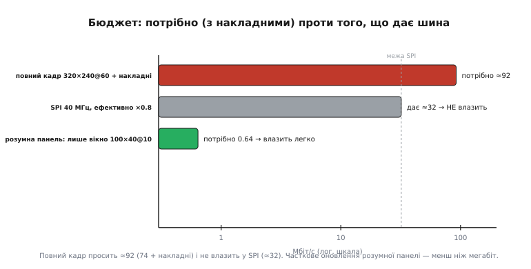

# 🧮 Бюджет пропускної здатності: чи влізе картинка в шину

> Ця математична вставка зводить вибір [інтерфейсу панелі](topic:hw-motion/panel-interfaces) до простого **рахунку із запасом**: скільки бітів за секунду вимагає картинка, скільки реально дає шина, і як перевірити, чи одне влазить в інше — для повного кадру й для розумної панелі, що шле лише зміни.

### Означення: попит і пропускна здатність

**Пропускна здатність** (англ. *bandwidth* — буквально «ширина смуги»: скільки даних пролазить за одиницю часу) — це скільки бітів за секунду здатна пронести шина. А **попит** дисплея — скільки бітів за секунду треба, щоб картинка жила. Для безперервного годування повного кадру попит — це добуток чотирьох чисел:

```
D = ширина × висота × (біт/піксель) × (кадрів/с)
D = 320 × 240 × 16 × 60 = 73 728 000  ≈ 73.7 Мбіт/с
```

### Інтуїція: потік проти труби

Думайте про це як про воду: пікселі — це потік, шина — труба. Труба мусить бути **ширша за потік**, та ще й із запасом, бо ні потік, ні труба не бувають «чистими». До попиту додаються **накладні витрати** (порожні поля між рядками, паузи команда/дані), а в труби частину перерізу зʼїдають службові такти. Тому порівнювати треба не голі числа, а попит *із накладними* проти ємности *з ефективністю*.


*Повний кадр 320×240@60 просить ≈92 Мбіт/с (74 плюс накладні) — і не влазить у SPI на 40 МГц (ефективно ≈32). А розумна панель, що шле лише змінене вікно, просить менш ніж мегабіт — і влазить із величезним запасом.*

### Звідки беруться накладні витрати

Множник «+25%» не з повітря — за ним стоїть конкретна арифметика розгортки. Растрова панель малюється рядок за рядком, як старий променевий екран: після кожного видимого рядка потрібна коротка пауза, щоб «перевести промінь» на початок наступного, а після всього кадру — довша, щоб вернутися згори. Ці паузи звуть **порожніми полями** (англ. *porch* — «ґанок», бо вони ніби «прибудовані» з боків видимої ділянки), і піксельний такт мусить устигнути прогнати не лише видимі пікселі, а й їх.

Порахуймо чесний піксельний такт для типової панелі 800×480 при 60 кадрах. До 800 видимих стовпців додають близько 56 тактів полів на рядок, а до 480 рядків — близько 45 «порожніх» рядків на кадр:

```
такт = (800 + 56) × (480 + 45) × 60
такт = 856 × 525 × 60 = 26 964 000  ≈ 27 МГц
```

Голий добуток 800 × 480 × 60 дав би лише 23 Мпікс/с, а з полями виходить 27 — це майже на **17%** більше, і саме на стільки реально вища частота PCLK. Звідси й береться запас у формулі: поля — це не похибка вимірювання, а фізично потрібні такти, які шина мусить віддати, хоч на скло вони нічого й не виводять.

### Формальний апарат

Накладні витрати зручно врахувати множником (типово +20…30%):

```
D' = D × (1 + накладні) = 73.7 × 1.25  ≈ 92 Мбіт/с
```

Чому взагалі множник ефективності, а не голі 100%? Бо жодна шина не зайнята корисними бітами весь час. У SPI між байтами хост піднімає й опускає CS, перемикає лінію DC з «команди» на «дані», а контролер дисплея зрідка просить паузу. У паралельного 8080 кожен запис — це ще й час на встановлення рівнів і утримання строба WR. А DMA вантажить шину пачками й між ними поступається пам'яттю іншим господарям. Усі ці дрібні простої й складають ту відсоткову «усушку»; ×0.8 — обережна типова оцінка, конкретне число залежить від контролера й режиму, тож у відповідальному проєкті його варто виміряти, а не вірити на слово.

Ємність шини рахують за її природою, а тоді знижують на ефективність (паузи DMA, перемикання — типово ×0.8):

```
SPI:         C = f_такт           (1 біт/такт)   →  40 МГц = 40 Мбіт/с
8080 N-біт:  C = N × f_строб       (16 × 20 МГц)  →  320 Мбіт/с
RGB:         C = (біт/піксель) × f_PCLK
ефективна:   C' = C × 0.8
```

І весь бюджет зводиться до однієї перевірки:

```
влазить, якщо   D' ≤ C'
```

**Приклад 1 (повний кадр на SPI).** Чи прогодує SPI на 40 МГц наш екран?

```
D' = 92 Мбіт/с
C' = 40 × 0.8 = 32 Мбіт/с
92 > 32   →  НЕ влазить: треба ширша шина (8080 чи RGB)
```

**Приклад 2 (часткове оновлення розумної панелі).** Та сама панель, але з власною GRAM: шлемо лише змінене вікно 100×40 пікселів десять разів на секунду.

```
D = 100 × 40 × 16 × 10 = 640 000 = 0.64 Мбіт/с
0.64 ≪ 32   →  влазить легко, з тисячократним запасом
```

Ось у чому чисельна вигода [контролера з власним кадровим буфером](topic:hw-motion/display-controller): памʼять кадру «на склі» дозволяє слати **зміни**, і бюджет падає в рази.

**Приклад 3 (максимум кадрів із шини).** Скільки повних кадрів на секунду витисне SPI на 40 МГц?

```
1 кадр = 320 × 240 × 16 = 1.23 Мбіт
FPS_max = C' / кадр = 32 / 1.23  ≈ 26 кадрів/с
```

Тобто суцільний перемальунок усього екрана по SPI — це від сили ~26 fps, та й то якщо процесор більше нічого не робить. Для плавної анімації цього мало — звідси й уся економія на часткових оновленнях.

**Приклад 4 (велика панель: чи врятує її 8080).** Візьмімо ту саму панель 800×480@60, але через 16-бітну шину 8080 на 20 МГц. Спершу — її чесний попит (із полями, як вище), а тоді — ємність шини:

```
PCLK   = 856 × 525 × 60      ≈ 27 Мпікс/с
D'     = 27 × 16 біт         ≈ 432 Мбіт/с
C(8080) = 16 × 20 МГц = 320;  C' = 320 × 0.8 = 256 Мбіт/с
432 > 256   →  НЕ влазить навіть у 16-бітний 8080
```

Це показує межу наочно: панель такого розміру переростає не лише SPI, а й паралельний 8080 — для безперервного годування їй потрібен або справжній RGB-інтерфейс із власним піксельним тактом, або власна GRAM, щоб шину можна було годувати самими змінами. Голий добуток 800 × 480 × 16 × 60 ≈ 369 Мбіт/с уже був більший за 256; з полями розрив тільки ширшає.

**Приклад 5 (скільки смуг DSI на телефонний екран).** Той самий рахунок працює й на верхньому щаблі — лише ємність рахуємо інакше. Візьмімо 1080×1920 при 24 бітах і 60 кадрах і прикиньмо, скільки смуг MIPI-DSI по 1.5 Гбіт/с треба:

```
D  = 1080 × 1920 × 24 × 60   ≈ 2.99 Гбіт/с
D' = 2.99 × 1.25             ≈ 3.73 Гбіт/с   (із полями/накладними)
1 смуга = 1.5 × 0.8 = 1.2 Гбіт/с (ефективно)
смуг = 3.73 / 1.2 ≈ 3.1   →  треба 4 смуги
```

Виходить рівно те, що й бачимо в телефонах: повноекранний кадр такої роздільності годує **чотирисмуговий** DSI, тоді як двох смуг (2.4 Гбіт/с) уже не вистачає. Той самий принцип D′ ≤ C′ — змінилася лише природа труби: замість «біт за такт» чи «слово за строб» тут «гігабіти на смугу», і вільний параметр — кількість смуг.

### Два режими попиту в одній формулі

Усі чотири приклади — це насправді **одна** формула попиту, у якій крутять два множники: яку площу оновлюємо й як часто. Панель без власної памʼяті змушує годувати весь кадр щоразу, тож площа фіксована й велика, а частота — повні 60. Панель із GRAM знімає це обмеження: оновлюємо лише змінений прямокутник і лише тоді, коли він справді змінився.

```
повний кадр:   D = (W × H)          × біт × FPS_повне
лише зміни:    D = (w × h)          × біт × FPS_зміни
виграш = (W × H × FPS_повне) / (w × h × FPS_зміни)
```

Підставмо числа прикладів 1 і 2: повний кадр — це 320 × 240 × 60, а змінене вікно — 100 × 40 × 10. Відношення дає (320 × 240 × 60) / (100 × 40 × 10) = 4 608 000 / 400 000 ≈ **115 разів**. Ось чисельна суть архітектурної різниці: памʼять кадру «на склі» зрізає попит на два порядки не якимось хитрим кодуванням, а просто тим, що дозволяє не торкатися нерухомих пікселів. Та сама фізична шина в одному режимі задихається, а в іншому нудьгує.

### Де це працює

Ця єдина нерівність D′ ≤ C′ і стоїть за вибором [інтерфейсу панелі](topic:hw-motion/panel-interfaces): дрібний екран влазить у SPI, великий вимагає паралельної чи диференційної шини. Вона ж пояснює, навіщо «розумна» панель із [власним кадровим буфером](topic:hw-motion/display-controller): вона переводить попит із *повного кадру щоразу* на *самі зміни*, і вузька шина раптом стає достатньою. А ще ця перевірка — перше, що варто зробити, прикидаючи нову панель: порахувати D′ під потрібні роздільність, глибину кольору й частоту, і звірити з C′ обраної шини, **перш ніж** замовляти залізо.

> 🔧 **Навіщо це.** Перед вибором панелі й шини полічіть бюджет: D′ = ширина × висота × біт × FPS × 1.25, C′ = ємність шини × 0.8, і перевірте D′ ≤ C′. Не влазить — або берете ширшу шину, або знижуєте роздільність/глибину/FPS, або переходите на розумну панель із частковими оновленнями. Закладайте запас: рахунок упритул на папері в житті не працює.
