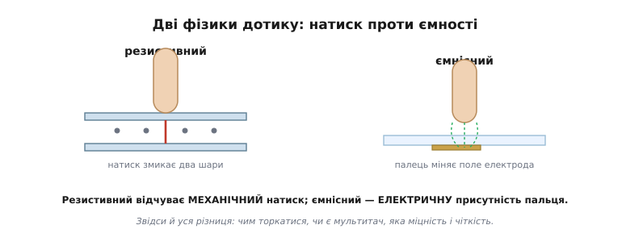
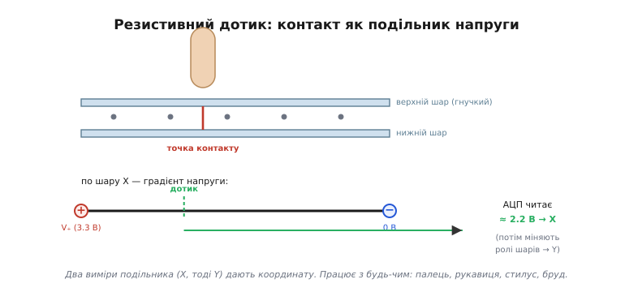
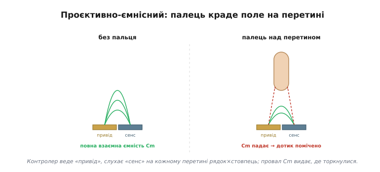
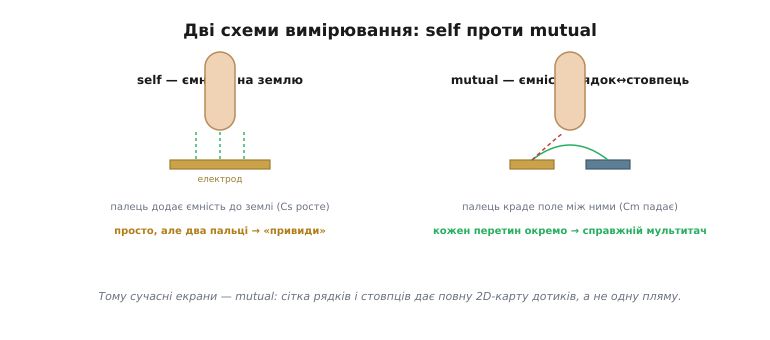
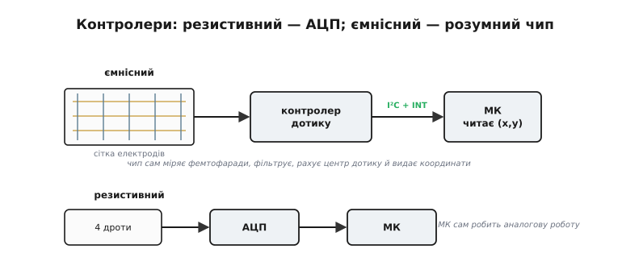
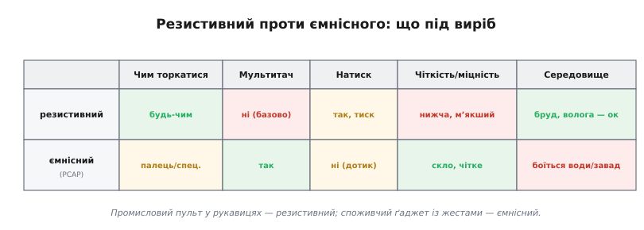

# Сенсорний ввід

Те саме скло, що показує картинку, навчилося ще й **відчувати** палець — і саме це перетворило прилади з кнопкових на ті, якими керуєш прямим дотиком до зображення. Та як шматок прозорого скла розуміє, що його торкнулися й де саме? Тут панують дві зовсім різні фізики. **Резистивний** дотик (від лат. *resistere*, «опиратися», бо вимір тут — про електричний опір) відчуває механічний натиск: палець чи будь-що притискає два провідні шари один до одного. **Ємнісний** (від лат. *capacitas*, «місткість» — здатність провідника тримати заряд) відчуває саму електричну присутність пальця, навіть без зусилля. Вони по-різному відчуваються в руці, по-різному коштують і годяться для різних виробів; розібратися в них означає почати з фізики.

### Дотик як давач: дві фізики

Поставмо задачу чесно: треба визначити, у якій точці двовимірної прозорої поверхні над екраном опинився палець. Прозорість тут принципова — давач лежить **поверх** зображення, тож мусить пропускати світло. І природа дає на цю задачу дві відповіді, протилежні за самою ідеєю.


*Дві фізики дотику. Ліворуч — резистивний: натиск пальця притискає верхній гнучкий шар до нижнього, і в точці контакту вони змикаються. Праворуч — ємнісний: палець, сам бувши провідником, змінює електричне поле прозорого електрода під склом, навіть не тиснучи. Звідси й уся подальша різниця.*

Перша відповідь — **механічна**: зробити поверхню з двох провідних шарів і ловити мить, коли натиск їх замкне. Друга — **електрична**: скористатися тим, що палець людини сам по собі провідник, і ловити, як він спотворює поле електрода. Перша не знає, чим її натиснули, — їй байдуже, палець це чи олівець. Друга прискіплива — їй потрібен саме провідний доторк. Розгляньмо кожну окремо.

Перш ніж занурюватися, оцінімо спільний для обох виклик — **прозорість**. Провідник, що пропускає світло, — річ нетривіальна: метал непрозорий. Тому електроди дотику роблять із особливих прозорих провідних плівок (найвідоміша — оксид індію-олова, *ITO*), та ще й наносять їх тонким візерунком так, щоб і струм проводити, і світло пропускати, і не муарити з пікселями екрана під ними. Сенсор дотику — це окремий шар, що лягає поверх дисплея й мусить бути майже невидимим; чимало інженерної мороки в дотику — саме про те, як залишитися прозорим, відчуваючи палець.

### Резистивний: дотик як подільник напруги

Резистивна панель — це два прозорі провідні шари (тонка плівка оксиду на склі чи плівці), розділені дрібнесенькими **дистанційними крапками**; верхній шар гнучкий. У спокої шари не торкаються. Натиснув пальцем — верхній прогнувся й торкнувся нижнього **рівно в точці натиску**. Лишилося прочитати, де ця точка.


*Резистивне зчитування. По одному шару пускають градієнт напруги (зліва 3.3 В, справа 0 В), а другим шаром у точці контакту знімають напругу, що випала, — і АЦП перетворює її на координату X. Потім шари міняють ролями й так само читають Y. Натиснути можна будь-чим.*

Хитрість зчитування — у тому, що кожен шар працює як **подільник напруги**. Прикладімо до лівого й правого країв одного шару, скажімо, 3.3 В і 0 В — уздовж шару виникне рівний градієнт напруги. Тоді в точці контакту другий шар «намацає» ту напругу, що випала на цій відстані, — а вона прямо відповідає **координаті** дотику. Один вимір [аналого-цифровим перетворювачем](topic:hw-analog/adc) дає X; поміняймо ролі шарів (тепер градієнт по вертикалі) — і другий вимір дає Y. Дві швидкі оцифровки — і маємо точку (x, y).

**Приклад (зчитування X).** Палець натиснув на третині ширини від плюсового краю. Яку напругу прочитає АЦП?

```
точка на f = 1/3 від краю «+»
U = V₊ · (1 − f) = 3.3 · (1 − 1/3) = 3.3 · 2/3   ≈ 2.20 В
→ АЦП оцифровує 2.20 В і перераховує у X-координату
```

Велика чеснота резистивного дотику випливає прямо з його механіки: замкнути шари можна **будь-чим** — голим пальцем, пальцем у рукавиці, стилусом, навіть кінчиком викрутки чи краплею бруду. Платять за це теж механікою: потрібен реальний **натиск**; гнучкий верхній шар із часом протирається; зайві шари трохи гасять яскравість і чіткість; а базова, чотиридротова схема бачить лише **один** доторк за раз — справжнього мультитачу вона не вміє.

Ще дві практичні риси варто знати. По-перше, резистивний екран майже завжди потребує **калібрування**: градієнт напруги по дешевій плівці не ідеально рівний, краї «пливуть», тож при налаштуванні користувачеві дають тицьнути в кілька хрестиків, і прошивка запамʼятовує, як сирі напруги лягають на справжні координати. По-друге, чотиридротова схема — не єдина: пʼяти- й восьмидротові варіанти точніші й стійкіші до зносу, бо інакше розподіляють функції підведення напруги й зчитування, але коштують дорожче. Для більшості простих приладів вистачає чотирьох дротів і одного калібрування на заводі.

> 🔧 **Навіщо це.** Резистивний дотик — досі найкращий вибір там, де працюють **у рукавицях**, де бруд, волога чи мороз, де треба тицяти стилусом і де важить дешевизна: промислові пульти, медичні та польові прилади. Те, що споживач вважає «застарілим», в індустрії часто єдине, що взагалі працює в реальних умовах.

### Ємнісний: палець як обкладка конденсатора

Ємнісний дотик стоїть на самому понятті [ємності](topic:ph-electromagnetism/capacitance): два провідники, розділені діелектриком, утворюють конденсатор, і його ємність залежить від геометрії та того, що поруч. А палець людини — це теж провідник (солона вода всередині нас чудово проводить). Піднесімо його до прозорого електрода під склом — і він втрутиться в поле цього електрода, змінивши ємність. Лишилося цю зміну виміряти.

Сучасні екрани роблять це **проєктивно-ємнісними** (*projected capacitive*, PCAP): під склом лежить **сітка** прозорих електродів — рядки в одному напрямку, стовпці в іншому. Палець, що наблизився до певного місця сітки, міняє ємність саме там, і контролер, проскановуючи сітку, знаходить це місце. Найважливіше: палець торкається **скла**, а електроди сховані під ним — тому поверхня тверда, гладка, прозора й довговічна, на відміну від мʼякої резистивної плівки.

Варто згадати, що ємнісний дотик не одразу став таким. Ранні ємнісні екрани були **поверхневими** (*surface capacitive*): суцільний провідний шар, із кутів якого міряли витік струму через палець, — вони знали лише одну точку дотику й боялися геть усього. Прорив дав саме **проєктивний** підхід зі схованою під склом сіткою: він і зробив можливими мультитач, тонке міцне скло й ту чутливість, яку ми сьогодні вважаємо звичною. Геометрію сітки при цьому роблять хитрою (ромби, містки між ними), щоб поле рядків і стовпців гарно «бачило» палець по всій площі, без сліпих зон між електродами.


*Як сітка чує палець. На кожному перетині рядка й стовпця є невелика взаємна ємність Cm — поле, що «перестрибує» з електрода привода на електрод сенсу. Палець, наблизившись, **відтягує частину цього поля на себе**, і Cm падає. Контролер бачить цей провал — і знає, де торкнулися.*

Звідси й переваги: реагує на **легкий** дотик без жодного натиску, поверхня — міцне чисте скло, картинка яскрава, і — головне — можливий мультитач і жести. А недоліки дзеркальні до резистивного: потрібен саме **провідний** доторк (голий палець або спеціальний ємнісний стилус чи рукавиця), і панель чутлива до води й електричних завад, що теж міняють ємність і можуть прикинутися дотиком.

> 🔧 **Навіщо це.** Ємнісний дотик дає те «преміальне» відчуття, до якого звик користувач смартфона: легкий доторк, плавні жести, чисте скло. Але памʼятайте про його ахіллесову пʼяту — воду: крапля дощу чи мокрий палець здатні збити його з пантелику, тож для приладу, що мокне, це серйозний аргумент проти.

### Self проти mutual: звідки береться мультитач

Виміряти ємнісну зміну сітки можна двома способами, і різниця між ними вирішує, скільки пальців екран побачить одночасно.


*Ліворуч — **self**: міряють ємність кожного електрода **на землю**; палець її підвищує. Просто, та з двома пальцями виникають «привиди» — система не певна, які рядки з якими стовпцями склали реальні точки. Праворуч — **mutual**: міряють ємність **між** рядком і стовпцем на кожному перетині окремо; палець її знижує. Кожна точка незалежна — звідси справжній мультитач.*

У **власній ємності** (*self capacitance*) контролер міряє ємність кожного електрода відносно землі — палець її **збільшує**. Це просто, але має ваду: коли пальців два, система знає лише, які рядки й які стовпці «спрацювали», а не як їх правильно спарувати, — і породжує хибні «привидні» точки. У **взаємній ємності** (*mutual capacitance*) міряють ємність на кожному **перетині** рядок-стовпець окремо, а палець її **зменшує** (краде поле). Оскільки кожен перетин опитують незалежно, виходить повна двовимірна карта дотиків — а отже, **справжній мультитач**: система впевнено бачить десять пальців нараз. Тому сучасні екрани будують саме на взаємній ємності.

За кадром тут чимала боротьба за **сигнал**. Зміна ємності від пальця — це якісь фемтофаради на тлі завад від тієї ж підсвітки, зарядних пристроїв і мережі, тож контролер мусить опитувати сітку швидко (десятки разів на секунду — це **частота звіту**, *report rate*) і ще вправно фільтрувати шум, аби відрізнити справжній дотик від наведення. Від цієї частоти прямо залежить, наскільки «слухняно» лінія тягнеться за пальцем по екрану: низька — і слід відстає, рветься, відчувається вʼялим. Тому добрий ємнісний дотик — це не лише сітка, а й швидкий, тихий тракт вимірювання.

### Контролери дотику: від кількох ніжок до розумного чипа

Хто ж робить усі ці виміри? Тут резистивний і ємнісний дотик розходяться так само різко, як їхня фізика.


*Угорі — ємнісний: сітку обслуговує спеціалізований **контролер дотику**, що сам веде й слухає електроди, ловить мізерні зміни ємності, фільтрує завади, рахує центр дотику й віддає готові координати по I²C з лінією переривання. Унизу — резистивний: вистачає АЦП на кілька ніжок (чи дрібного чипа), а аналогову роботу робить сам МК.*

Резистивному вистачить **АЦП** і кількох виводів мікроконтролера — або дешевого спеціального чипа (класу XPT2046), що сам робить виміри подільника й віддає (x, y) по простій шині. Аналогова робота тут проста. Ємнісному ж потрібен **розумний контролер**: він мусить заряджати й розряджати десятки електродів, ловити зміни ємності в **фемтофаради**, відсіювати шум, знаходити центр кожної плями дотику й перетворювати все це на координати. Така мікросхема (класу FT6206/GT911) сама проробляє цю важку роботу й віддає мікроконтролерові вже готові точки — а часто й розпізнані жести — по шині I²C, смикаючи лінію переривання, коли є новина. Мікроконтролер лише читає результат.

Ця зручність має й зворотний бік: ємнісний контролер треба **налаштовувати** під конкретне скло й корпус. Товщина накладки, повітряний зазор, заземлення приладу, ба навіть те, від мережі він живиться чи від батареї, — усе впливає на чутливість, тож виробник зазвичай підбирає десятки параметрів (пороги, посилення, відсікання води) у прошивці чипа. «Поставив і працює» тут радше виняток: ємнісний дотик, що добре поводиться крізь товсту накладку чи на мокрому склі, — це плід копіткого тюнінгу, а не самої лише вдалої мікросхеми.

На практиці такий чип читають по двох-трьох дротах: дані йдуть по [I²C](topic:com-devices/i2c-bus), а окрема лінія переривання (англ. *interrupt*, «переривання») смикає мікроконтролер лише тоді, коли є новий дотик, — тож опитувати шину без потреби не доводиться. Конкретику ємнісних контролерів цього класу — типову розпіновку, регістри, формат пакета координат і як вичитати кілька дотиків нараз — зібрано в [компонентній вставці](topic:hw-motion/touch-tech/api-touch-controllers.md).

### Від точок до жестів

Що б не стояло в основі, на виході контролер дає **потік подій дотику**: «палець опустився» в точці (x, y), «палець рухається» новими координатами, «палець піднявся» — а для мультитачу таких точок кілька водночас. Сам по собі цей потік — ще не жест.

**Жести** народжуються вже у програмі, з розбору цього потоку. Коротке торкання й відпускання на місці — це **тап**; затримка пальця — **довге натискання**; швидке проведення — **свайп**; а два пальці, що сходяться чи розходяться, — **щипок** для масштабування. Контролер дає сирі точки; перетворити їх на осмислені жести — окрема логіка вже на боці програми. Звідси й головний поділ праці: **залізо дає точки, програма впізнає в них наміри**.

Між сирими точками й чистим жестом стоїть ще чорнова робота, про яку легко забути, та без якої екран відчувається нервовим. Палець тремтить — координати дрібно «скачуть», тож їх згладжують. Долоня, що лягла на край екрана, чи крапля води дають хибні дотики — їх відсіюють (це звуть відхиленням долоні, *palm rejection*). А коротке тремтіння контакту на самій межі натиску треба «придушити», щоб один тап не порахувався двічі. Усе це — той самий шар між залізом і наміром: непомітний, коли зроблений добре, і дратівливий, коли про нього забули.

### Що обирати під виріб

Зведімо все до вибору, бо саме його доведеться робити над реальним приладом.


*Профілі майже дзеркальні. Резистивний: тицяй будь-чим, працює в бруді й рукавицях, дешевий — але потребує натиску, без мультитачу, мʼякший і менш чіткий. Ємнісний: легкий дотик, мультитач і жести, міцне чисте скло — але потрібен голий (чи особливий) палець і боїться води.*

Логіка проста й випливає з фізики. Промисловий або медичний пульт, на який тицяють у рукавицях, у бруді чи під дощем, де важить ціна й не потрібен мультитач, — резистивний. Споживчий ґаджет, де цінують плавні жести, чисте яскраве скло й «той самий» легкий дотик, — ємнісний. Як і з [класами дисплеїв](root:embedded/display-classes), тут немає «кращої» технології — є та, що пасує середовищу й сценарію вашого виробу.

Коли скло вміє і показувати, і відчувати дотик, людино-машинний інтерфейс на рівні заліза вже зібрано: палець керує прямо тим зображенням, на яке дивиться. Окремою породою стоїть осторонь [електронне чорнило](topic:hw-motion/eink-refresh) — там бістабільність зображення дає інші клопоти (повільне й часткове оновлення, «привиди»), але це вже зовсім інша фізика, ніж у підсвічених дотикових панелей.

---
