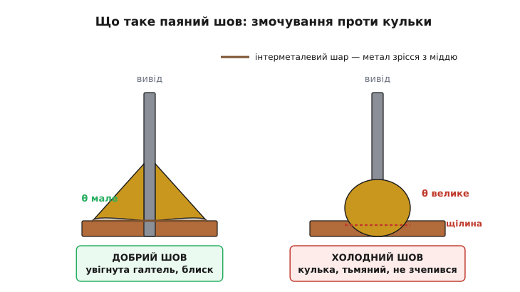
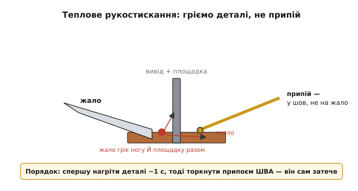

# Мінімальна пайка

<preknowlist>
- [Друкована плата (PCB)](root:hw-pcb/pcb-layout) — доріжки, контактні площадки й отвори, до яких припаюють компоненти.
- [Джоулеве тепло](root:ph-electromagnetism/joule-heating) — струм крізь опір гріє провідник; так і працює жало, і так помирає перегрітий шов.
- [Тепловий опір](root:ph-thermodynamics/thermal-resistance) — як тепло від жала «витікає» в масивну мідь і чому великі площадки важче прогріти.
- [Оксиди](root:basic-chemistry/oxides) — тонка плівка окису на металі, яку припій не змочує, доки її не зняти флюсом.
</preknowlist>

Пайка виглядає як магія, доки ви не зрозумієте одну річ: **ви не приклеюєте деталь до плати — ви зрощуєте два метали в один**. Розплавлений припій не лежить зверху, як застиглий клей; він **розчиняє тонкий поверхневий шар міді** й ноги компонента і, застигаючи, утворює на межі новий сплав, який тримає обидві сторони як одне ціле. Ось чому добрий шов не можна «відклеїти» — його треба знову розплавити. І ось чому холодний шов, що лише прилип зверху, рано чи пізно відвалюється сам: метали так і не зрослися.

Уся решта — температура жала, вибір припою, роль флюсу — це просто умови, за яких це зрощення відбувається, а за їхньої відсутності не відбувається. Розберімо це від кореня, і тоді кожне правило («не гріти припій, гріти деталі», «спершу флюс») перестане бути заклинанням і стане очевидним наслідком фізики.

## Змочування: чому припій «затікає» сам

Візьміть краплю води на чистому склі — вона розповзається тонкою плівкою. Та сама крапля на жирному склі збереться в кульку. Різниця в тому, наскільки рідина «любить» поверхню: якщо любить — розтікається й **змочує** її (звідси й термін — *змочування*, англ. *wetting*); якщо ні — стягується кулею, торкаючись поверхні мінімально. З припоєм — точнісінько так само, тільки замість води розплавлений метал, а замість скла — мідна площадка.

І це не дрібниця вигляду. Змочування — це і є сам механізм пайки. Коли розплавлений припій змочує чисту гарячу мідь, атоми олова з припою й атоми міді на межі починають переходити одні в одних, розчиняючись, — росте тонкий проміжний шар нового сплаву, **інтерметалевий шар** (лат. *inter* — між + метали). Саме він, застигнувши, зшиває припій із міддю намертво. Немає змочування — немає цього шару — немає з'єднання: припій просто лежить кулькою на поверхні, торкаючись її формально, і тримається лише тертям.


*Той самий припій, дві долі. Ліворуч він змочив мідь: розтікся ввігнутою галтеллю з малим кутом θ, по межі виріс інтерметалевий шар — метали зрослися. Праворуч не змочив: зібрався кулькою з великим кутом θ, між ним і міддю лишилась щілина — зчеплення немає, хоч геометрично «припаяно». Око читає це миттєво: увігнута блискуча галтель проти опуклої тьмяної кульки.*

Звідси — головний зовнішній критерій, за яким шов оцінюють на око. **Добрий шов увігнутий**: припій тонко натікає від ноги до країв площадки плавною галтеллю (франц. *gorge* — виїмка), утворюючи гострий кут із поверхнею. **Поганий шов опуклий**: припій горбиться кулькою з тупим кутом, ніби відштовхується від міді. Ця форма — не естетика, а прямий відбиток того, чи відбулося зрощення. Плюс до форми — блиск: свіжий добре сплавлений шов дзеркально блищить, а «холодний», що застиг без нормального сплавлення чи ворухнувся під час застигання, виходить тьмяним, зернистим, шорстким.

> 🔧 **Навіщо це.** Візьміть за звичку **дивитися на кожен свій шов** одразу після пайки: увігнутий і блискучий — далі; опуклий, тьмяний чи «кулькою» — переробити зараз, поки паяльник у руці. 90 % плаваючих, «то працює, то ні» несправностей у саморобних платах — це саме холодні шви, які пройшли візуально, але метали в них не зрослися. Знайти такий шов очима — секунда; ловити його потім осцилографом — година.

## Флюс: чому без нього нічого не змочується

Тепер підступна деталь. Мідь на повітрі миттєво вкривається найтоншою плівкою [окису](root:basic-chemistry/oxides) — того самого, від чого стара мідь темніє. Плівка невидима, але припій **її не змочує**: він любить чистий метал, а не окис. Тому навіть на ідеальному жалі й правильній температурі припій на «повітряній» міді збереться кулькою — бо між ним і металом стоїть шар оксиду, як жир на склі.

Розв'язання — **флюс** (лат. *fluxus*, від *fluere* — текти; назва прямо про те, що він змушує припій текти). Це хімічно активна речовина (в аматорській практиці — переважно каніфоль, застигла живиця хвойних), яка при нагріві **розчиняє й знімає оксидну плівку** з міді та з самого припою й ненадовго захищає щойно оголений метал від нового окислення, поки на нього не натече припій. Знято окис — відкрився чистий метал — припій його змочує — росте інтерметал. Без флюсу цей ланцюжок рветься на першій ланці.

Найважливіше для практики: **флюс уже є всередині припою**. Монтажний припій-дріт роблять порожнистим, із каніфольною серцевиною (англ. *flux core*) — тонкими каналами флюсу вздовж усього прутка. Тому в більшості випадків окремо мазати флюс не треба: щойно ви торкаєтеся дротом гарячого шва, серцевина плавиться першою, розтікається, зачищає поверхню — і слідом іде метал. Ось чому паяти треба **свіжим торканням дроту до шва**, а не наперед розплавленою на жалі краплею: у краплі на жалі флюс уже вигорів, вона мертва й тільки бруднить.

## Теплове рукостискання: чому гріють деталі, а не припій

Найпоширеніша помилка початківця — розплавити припій **на жалі** й перенести краплю на з'єднання, як ложкою. Виходить завжди холодний шов, і ось чому строго.

Припій зрощується не з жалом, а з **міддю площадки й ногою компонента**. Щоб інтерметал виріс, гарячою має бути **сама деталь**, а не тільки метал, що на неї падає. Якщо ви несете розплавлену краплю на холодну мідь, крапля торкається холодної поверхні, флюс у ній давно вигорів, а поверхня внизу так і лишилась окисленою й холодною — метал застигає зверху кулькою, не встигнувши нічого розчинити. Зовні «припаяно», по суті — просто прилипло.

Правильний порядок протилежний і завжди однаковий:

```
1. Притулити жало так, щоб воно торкалося ОДРАЗУ і ноги, і площадки.
2. Зачекати коротку мить (~1 c), доки обидві деталі прогріються.
3. Піднести дріт-припій із протилежного боку — до самого ШВА, не до жала.
4. Флюс із серцевини розтечеться, припій змочить гарячу мідь і сам затече в стик.
5. Прибрати дріт, потім прибрати жало. Не рухати деталь, доки не застигне.
```


*Тепло тече від жала в обидві деталі одночасно (червоні стрілки), а припій торкається не жала, а розігрітого стику з іншого боку. Тоді метал змочує гарячу мідь і сам затягується в шов — інтерметал росте по всій площі контакту, а не тільки там, де впала крапля.*

Ключ до цього — **добрий тепловий контакт жала**. Тепло від жала в деталь передається через площу дотику, і суха, окислена, гостра грань жала віддає його погано; тому жало тримають **облуженим** — на кінчику завжди має бути крапелька свіжого блискучого припою, вона й служить тепловим містком між жалом і деталлю. Торкаєтесь не сухим ребром, а цією мокрою краплею — і деталь прогрівається за мить.

> 🔧 **Навіщо це.** Правило «жалом гріємо деталі, дротом годуємо шов» — не стиль, а різниця між платою, що працює роками, і платою, що збоїть від струсу. Коли поспішаєш і мажеш краплю з жала, здається, що вийшло — а насправді насадив ряд холодних кульок, які тижнями «дивують» плаваючими глюками.

## Скільки гріти: між недогрівом і перегрівом

Виникає природне питання: якщо гарячіше — краще змочується, то чому не тримати жало доти, доки точно розтечеться? Бо з іншого боку чатує **перегрів**, і він теж псує шов, тільки по-іншому.

Затримали жало надовго — і кілька процесів ідуть проти вас разом. По-перше, флюс **вигорає**: його активність триває секунди, далі оксид знову затягує метал, і припій перестає змочувати навіть на гарячому. По-друге, тепло тече далі в компонент і може його **пошкодити** — напівпровідник, електроліт у конденсаторі, ізоляцію. По-третє, тонка мідна [площадка](root:hw-pcb/pcb-layout) від тривалого жару **відшаровується від плати** й відходить разом зі швом — а це вже брак самої плати, який важко полагодити.

Тому ціль — не «якнайгарячіше», а **швидко й точно**: віддати достатньо тепла за короткий час, щоб змочилося з першого разу, і прибрати жало. Практично на монтажний шов іде близько **1–3 секунд** контакту. Якщо за цей час не змочується — майже завжди винне не «замало гріли», а **брудна поверхня, мертвий флюс або холодне (недооблужене) жало**; додати флюсу й освіжити краплю на жалі допоможе більше, ніж тримати довше.

Зворотний бік — **надто холодне жало**. Тут вступає фізика: масивна мідна площадка (а надто якщо це широкий полігон чи шар землі) поводиться як тепловідвід — тепло від жала розтікається в неї швидше, ніж жало встигає підкидати, і стик так і не доходить до потрібної температури. Це прямо пов'язано з [тепловим опором](root:ph-thermodynamics/thermal-resistance) шляху: чим масивніша мідь навколо, тим нижчий її тепловий опір і тим більше тепла вона встигає «висмоктати». На таких точках беруть жало ширше (з більшим кінчиком — більша площа й запас тепла), а не «пожарче»: широкий кінчик віддає більше тепла за той самий час, тоді як тонке жало на масивній площадці просто не встигає прогріти стик.

## Що всередині припою: сплав і температура плавлення

Класичний монтажний припій — сплав **олова й свинцю** (англ. *tin-lead*, Sn-Pb). Чому сплав, а не чистий метал? Тут ховається красива фізика, варта окремого погляду. Чисте олово плавиться при 232 °C, чистий свинець — при 327 °C, а їхня суміш у пропорції **63 % олова / 37 % свинцю** плавиться при **183 °C — нижче за обидва складники** й, головне, **миттєво, при одній температурі**, без проміжного кашоподібного стану. Така особлива пропорція, що плавиться й застигає в одній точці, називається [евтектикою](root:hw-pcb/eutectic-alloys) (гр. *eútēktos* — легкоплавкий), і саме вона робить пайку зручною: припій або твердий, або рідкий, різко, тож шов не встигає «поворухнутися» в напівм'якому стані й застигнути тьмяним.

Свинець отруйний, тому з 2006 року в побутовій електроніці Євросоюзу його заборонила директива **RoHS** (англ. *Restriction of Hazardous Substances* — обмеження небезпечних речовин; чинна з 1 липня 2006). Промисловість перейшла на **безсвинцеві** сплави, здебільшого олово-срібло-мідь (SAC), що плавляться вище — близько 217–220 °C — і трохи гірше змочують, через що потребують гарячішого жала й активнішого флюсу. Для навчання й ремонту багато хто досі бере свинцевий 60/40 чи 63/37 — він **прощає** новачкові набагато більше. Окремий підступ безсвинцевих і чистооловʼяних покриттів — [олов'яні вуса](root:hw-pcb/basic-soldering/comp-tin-whiskers.md): тонкі струмопровідні ниточки, що самі проростають із чистого олова й здатні замкнути сусідні виводи; колись їх стримувала домішка свинцю, і її зникнення повернуло цю стару проблему.

> 🔧 **Навіщо це.** Не змішуйте свинцевий і безсвинцевий припій на одному шві безоглядно й не дивуйтеся, що «той самий» дріт з іншої котушки раптом гірше тече: у безсвинцевого вища температура плавлення й примхливіший флюс. Для першої плати свідомо беріть **свинцевий 63/37 з каніфольною серцевиною** — він знімає половину проблем новачка сам.

## Мінімальний набір і перший шов

Щоб реально спаяти щось уперше, багато не треба. **Паяльник із регулюванням температури** (виставити ~320–340 °C для свинцевого припою), **припій-дріт із флюсовою серцевиною** діаметром близько 0.7–1.0 мм, **вологу губку або латунну вату**, щоб витирати жало, і **окремий флюс** (каніфоль або гель) — про запас, для впертих точок. Усе.

Витерте, облужене жало торкається одразу ноги й площадки; коротка мить прогріву; дротик — до шва з іншого боку; флюс зашипів, метал натік увігнутою галтеллю; прибрали дріт, прибрали жало, не дихаємо на деталь секунду. Погляд на шов: блищить, увігнутий — готово. Кулькою, тьмяний — торкнулись жалом ще раз, додали крихту флюсу, переплавили. Ось і весь цикл; решта майстерності — це просто той самий рух, повторений тисячу разів, аж поки рука сама відчуває мить, коли метал «сів».

І остання, майже філософська думка на закінчення. Усе, що здається набором дрібних правил пайки, — «гріти деталь, а не припій», «спершу флюс», «не рухати до застигання», «дивитися на форму й блиск» — насправді одне правило в різних одежах: **створи умови, за яких два метали встигнуть зрости в один, і не заважай їм застигнути**. Тримайте в голові саме це зрощення — і кожен окремий прийом стане не заклинанням, а очевидним наслідком.
